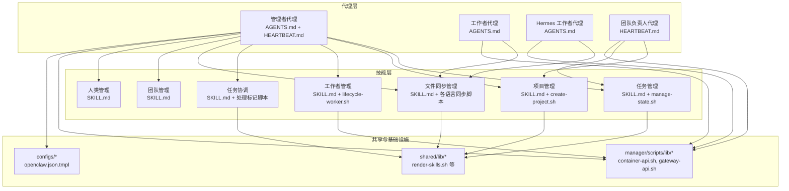
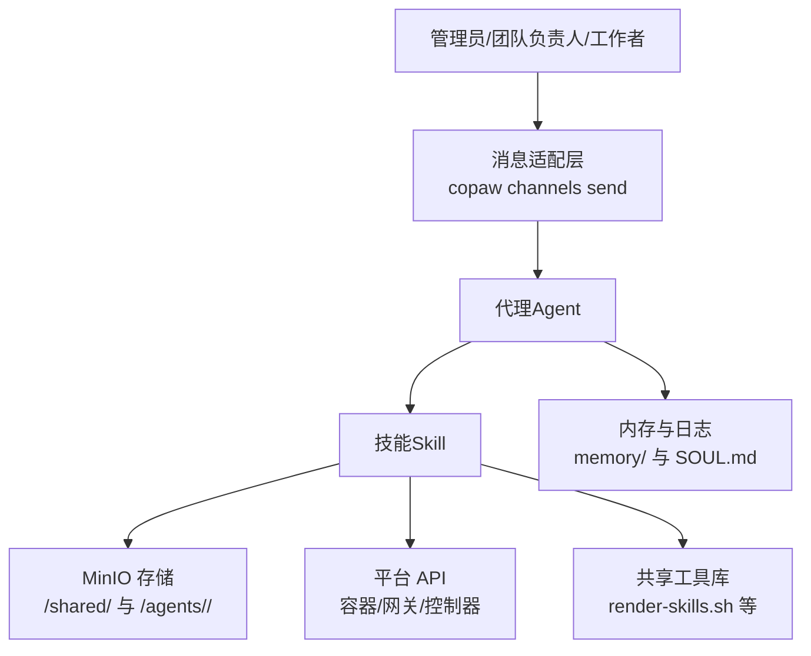
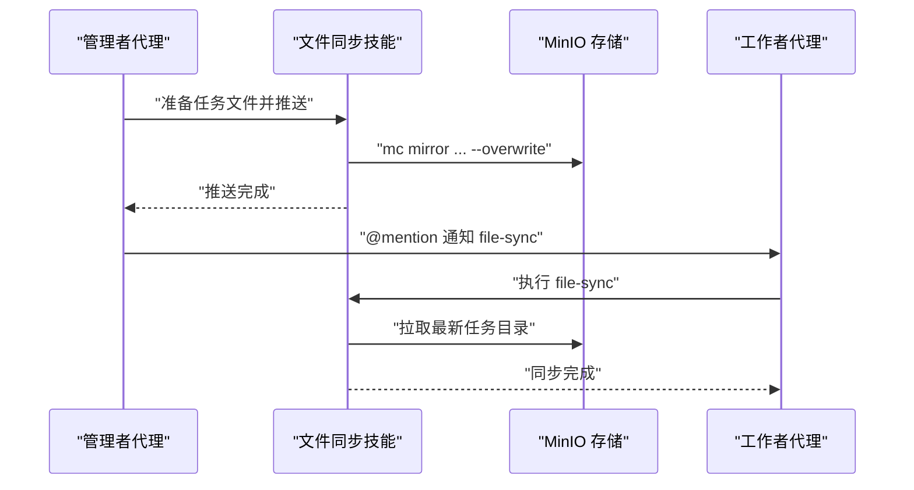
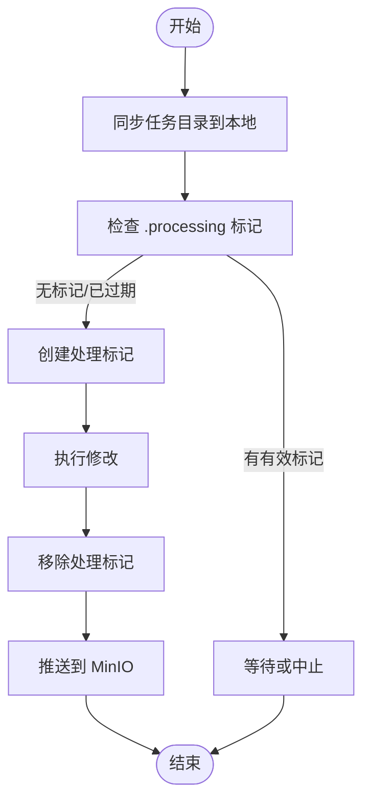
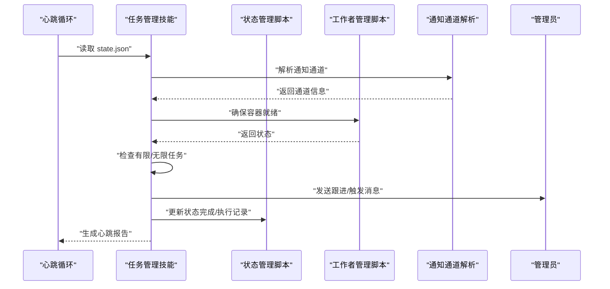
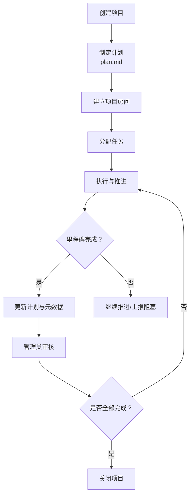
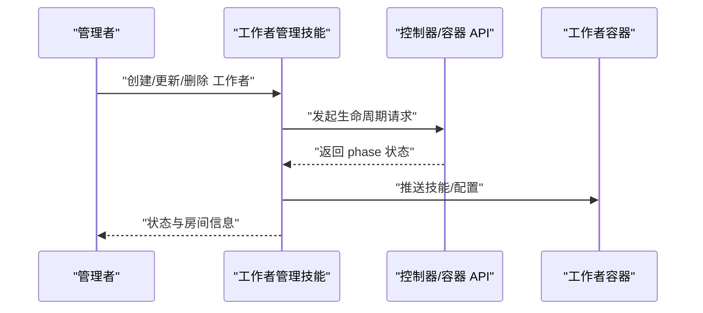
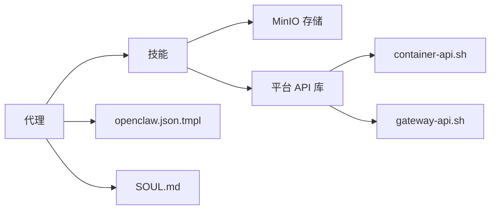

# 编码实现

<cite>
**本文引用的文件**
- [AGENTS.md（CoPaw 管理者代理）](file://manager/agent/copaw-manager-agent/AGENTS.md)
- [AGENTS.md（Hermes 工作者代理）](file://manager/agent/hermes-worker-agent/AGENTS.md)
- [AGENTS.md（Worker 代理）](file://manager/agent/worker-agent/AGENTS.md)
- [HEARTBEAT.md（CoPaw 管理者代理）](file://manager/agent/copaw-manager-agent/HEARTBEAT.md)
- [HEARTBEAT.md（团队负责人代理）](file://manager/agent/team-leader-agent/HEARTBEAT.md)
- [SKILL.md（任务管理）](file://manager/agent/skills/task-management/SKILL.md)
- [SKILL.md（项目管理）](file://manager/agent/skills/project-management/SKILL.md)
- [SKILL.md（文件同步管理）](file://manager/agent/skills/file-sync-management/SKILL.md)
- [SKILL.md（任务协调）](file://manager/agent/skills/task-coordination/SKILL.md)
- [SKILL.md（团队管理）](file://manager/agent/skills/team-management/SKILL.md)
- [SKILL.md（人类管理）](file://manager/agent/skills/human-management/SKILL.md)
- [SKILL.md（工作者管理）](file://manager/agent/skills/worker-management/SKILL.md)
- [hiclaw-sync.sh（通用工作者文件同步）](file://manager/agent/worker-agent/skills/file-sync/scripts/hiclaw-sync.sh)
- [copaw-sync.py（CoPaw 工作者文件同步）](file://manager/agent/copaw-worker-agent/skills/file-sync/scripts/copaw-sync.py)
- [hermes-sync.py（Hermes 工作者文件同步）](file://manager/agent/hermes-worker-agent/skills/file-sync/scripts/hermes-sync.py)
- [push-shared.sh（共享推送脚本）](file://manager/agent/copaw-worker-agent/skills/file-sync/scripts/push-shared.sh)
- [push-shared.sh（Hermes 共享推送脚本）](file://manager/agent/hermes-worker-agent/skills/file-sync/scripts/push-shared.sh)
- [manage-primary-channel.sh（主频道管理脚本）](file://manager/agent/skills/channel-management/scripts/manage-primary-channel.sh)
- [create-project.sh（项目创建脚本）](file://manager/agent/skills/project-management/scripts/create-project.sh)
- [manage-state.sh（状态管理脚本）](file://manager/agent/skills/task-management/scripts/manage-state.sh)
- [resolve-notify-channel.sh（通知通道解析脚本）](file://manager/agent/skills/task-management/scripts/resolve-notify-channel.sh)
- [lifecycle-worker.sh（工作者生命周期脚本）](file://manager/agent/skills/worker-management/scripts/lifecycle-worker.sh)
- [send-worker-greeting.sh（工作者问候脚本）](file://manager/agent/skills/worker-management/scripts/send-worker-greeting.sh)
- [check-processing-marker.sh（检查处理标记脚本）](file://manager/agent/skills/task-coordination/scripts/check-processing-marker.sh)
- [create-processing-marker.sh（创建处理标记脚本）](file://manager/agent/skills/task-coordination/scripts/create-processing-marker.sh)
- [remove-processing-marker.sh（移除处理标记脚本）](file://manager/agent/skills/task-coordination/scripts/remove-processing-marker.sh)
- [container-api.sh（容器 API 库）](file://manager/scripts/lib/container-api.sh)
- [gateway-api.sh（网关 API 库）](file://manager/scripts/lib/gateway-api.sh)
- [base.sh（基础库）](file://manager/scripts/lib/base.sh)
- [render-skills.sh（技能渲染脚本）](file://shared/lib/render-skills.sh)
- [openclaw.json.tmpl（管理者配置模板）](file://manager/configs/manager-openclaw.json.tmpl)
- [SOUL.md（CoPaw 管理者代理）](file://manager/agent/copaw-manager-agent/SOUL.md)
- [SOUL.md（Hermes 工作者代理）](file://manager/agent/hermes-worker-agent/SOUL.md)
- [SOUL.md（Worker 代理）](file://manager/agent/worker-agent/SOUL.md)
</cite>

## 目录
1. [引言](#引言)
2. [项目结构](#项目结构)
3. [核心组件](#核心组件)
4. [架构总览](#架构总览)
5. [详细组件分析](#详细组件分析)
6. [依赖关系分析](#依赖关系分析)
7. [性能考虑](#性能考虑)
8. [故障排查指南](#故障排查指南)
9. [结论](#结论)
10. [附录](#附录)

## 引言
本指南面向 HiClaw 技能编码实现，系统性阐述技能开发的规范、文件组织、实现模式与最佳实践。内容覆盖：
- 技能代码编写规范与命名约定
- 文件组织结构与职责边界
- 标准开发流程：从需求到交付
- 与 HiClaw 系统的集成方式：API 调用、事件处理、状态管理
- 常见技能类型模板：文件同步、任务协调、项目管理
- 代码审查要点与质量保障

## 项目结构
HiClaw 将“代理”（Agent）与“技能”（Skill）解耦：代理负责运行时行为与消息交互，技能以可复用的脚本与文档形式提供具体能力。关键目录与职责如下：
- manager/agent/*-agent：各类代理的工作空间与行为规则
- manager/agent/skills/*：通用技能集合，按功能域划分
- manager/agent/worker-agent/skills/*：通用工作者内置技能
- manager/agent/copaw-worker-agent/skills/*：CoPaw 工作者内置技能
- manager/agent/hermes-worker-agent/skills/*：Hermes 工作者内置技能
- shared/lib/*：共享工具库
- manager/scripts/lib/*：平台级脚本库（容器、网关等）
- manager/configs/*：配置模板与默认值

图表来源
- [AGENTS.md（CoPaw 管理者代理）](file://manager/agent/copaw-manager-agent/AGENTS.md)
- [AGENTS.md（Worker 代理）](file://manager/agent/worker-agent/AGENTS.md)
- [AGENTS.md（Hermes 工作者代理）](file://manager/agent/hermes-worker-agent/AGENTS.md)
- [SKILL.md（任务管理）](file://manager/agent/skills/task-management/SKILL.md)
- [SKILL.md（项目管理）](file://manager/agent/skills/project-management/SKILL.md)
- [SKILL.md（文件同步管理）](file://manager/agent/skills/file-sync-management/SKILL.md)
- [SKILL.md（任务协调）](file://manager/agent/skills/task-coordination/SKILL.md)
- [SKILL.md（工作者管理）](file://manager/agent/skills/worker-management/SKILL.md)
- [SKILL.md（团队管理）](file://manager/agent/skills/team-management/SKILL.md)
- [SKILL.md（人类管理）](file://manager/agent/skills/human-management/SKILL.md)
- [container-api.sh（容器 API 库）](file://manager/scripts/lib/container-api.sh)
- [render-skills.sh（技能渲染脚本）](file://shared/lib/render-skills.sh)
- [openclaw.json.tmpl（管理者配置模板）](file://manager/configs/manager-openclaw.json.tmpl)

章节来源
- [AGENTS.md（CoPaw 管理者代理）](file://manager/agent/copaw-manager-agent/AGENTS.md)
- [AGENTS.md（Worker 代理）](file://manager/agent/worker-agent/AGENTS.md)
- [AGENTS.md（Hermes 工作者代理）](file://manager/agent/hermes-worker-agent/AGENTS.md)
- [SKILL.md（任务管理）](file://manager/agent/skills/task-management/SKILL.md)
- [SKILL.md（项目管理）](file://manager/agent/skills/project-management/SKILL.md)
- [SKILL.md（文件同步管理）](file://manager/agent/skills/file-sync-management/SKILL.md)
- [SKILL.md（任务协调）](file://manager/agent/skills/task-coordination/SKILL.md)
- [SKILL.md（工作者管理）](file://manager/agent/skills/worker-management/SKILL.md)
- [SKILL.md（团队管理）](file://manager/agent/skills/team-management/SKILL.md)
- [SKILL.md（人类管理）](file://manager/agent/skills/human-management/SKILL.md)
- [container-api.sh（容器 API 库）](file://manager/scripts/lib/container-api.sh)
- [render-skills.sh（技能渲染脚本）](file://shared/lib/render-skills.sh)
- [openclaw.json.tmpl（管理者配置模板）](file://manager/configs/manager-openclaw.json.tmpl)

## 核心组件
- 代理（Agent）
  - 管理者代理：负责任务委派、项目监控、工作者生命周期管理与心跳汇报
  - 工作者代理：执行任务、维护工作区、与管理者协作
  - Hermes 工作者代理：Python 驱动的工作者，具备 MCP 工具调用能力
  - 团队负责人代理：在团队维度进行任务分解与协调
- 技能（Skill）
  - 任务管理：状态登记、无限任务调度、完成确认
  - 项目管理：项目房间、计划单、里程碑推进
  - 文件同步管理：本地与 MinIO 的镜像同步、推送与拉取
  - 任务协调：共享工作区的互斥访问控制（.processing 标记）
  - 工作者管理：创建、启停、技能推送、运行时切换
  - 团队管理：团队创建、成员管理、权限与房间策略
  - 人类管理：矩阵账号导入、权限级别与访问控制
- 共享与基础设施
  - 容器 API、网关 API、基础库
  - 技能渲染与配置模板

章节来源
- [AGENTS.md（CoPaw 管理者代理）](file://manager/agent/copaw-manager-agent/AGENTS.md)
- [AGENTS.md（Worker 代理）](file://manager/agent/worker-agent/AGENTS.md)
- [AGENTS.md（Hermes 工作者代理）](file://manager/agent/hermes-worker-agent/AGENTS.md)
- [HEARTBEAT.md（CoPaw 管理者代理）](file://manager/agent/copaw-manager-agent/HEARTBEAT.md)
- [HEARTBEAT.md（团队负责人代理）](file://manager/agent/team-leader-agent/HEARTBEAT.md)
- [SKILL.md（任务管理）](file://manager/agent/skills/task-management/SKILL.md)
- [SKILL.md（项目管理）](file://manager/agent/skills/project-management/SKILL.md)
- [SKILL.md（文件同步管理）](file://manager/agent/skills/file-sync-management/SKILL.md)
- [SKILL.md（任务协调）](file://manager/agent/skills/task-coordination/SKILL.md)
- [SKILL.md（工作者管理）](file://manager/agent/skills/worker-management/SKILL.md)
- [SKILL.md（团队管理）](file://manager/agent/skills/team-management/SKILL.md)
- [SKILL.md（人类管理）](file://manager/agent/skills/human-management/SKILL.md)

## 架构总览
HiClaw 的技能编码围绕“代理 + 技能 + 共享存储”的三层架构展开。代理通过消息触发技能，技能通过脚本与平台 API 完成具体操作，并与 MinIO 存储保持一致。

图表来源
- [AGENTS.md（CoPaw 管理者代理）](file://manager/agent/copaw-manager-agent/AGENTS.md)
- [AGENTS.md（Worker 代理）](file://manager/agent/worker-agent/AGENTS.md)
- [AGENTS.md（Hermes 工作者代理）](file://manager/agent/hermes-worker-agent/AGENTS.md)
- [SKILL.md（文件同步管理）](file://manager/agent/skills/file-sync-management/SKILL.md)
- [container-api.sh（容器 API 库）](file://manager/scripts/lib/container-api.sh)
- [render-skills.sh（技能渲染脚本）](file://shared/lib/render-skills.sh)

## 详细组件分析

### 组件一：文件同步技能（跨代理通用）
- 设计目标
  - 提供统一的本地与 MinIO 同步接口，确保任务文件在代理与工作者之间一致
  - 支持不同运行时（openclaw/copaw/hermes）的差异化同步脚本
- 关键流程
  - 推送：写入本地后立即镜像到 MinIO，随后通知目标代理 file-sync
  - 拉取：在执行任务前先同步，避免使用过期数据
  - 标准化：统一使用 mc 命令族，遵循排除策略（如 base/、spec.md）
- 实现要点
  - 使用共享脚本（render-skills.sh）进行技能注入与更新
  - 在 CoPaw/Hermes 场景下分别提供专用同步脚本
  - 通过 push-shared.sh 进行批量推送

图表来源
- [SKILL.md（文件同步管理）](file://manager/agent/skills/file-sync-management/SKILL.md)
- [hiclaw-sync.sh（通用工作者文件同步）](file://manager/agent/worker-agent/skills/file-sync/scripts/hiclaw-sync.sh)
- [copaw-sync.py（CoPaw 工作者文件同步）](file://manager/agent/copaw-worker-agent/skills/file-sync/scripts/copaw-sync.py)
- [hermes-sync.py（Hermes 工作者文件同步）](file://manager/agent/hermes-worker-agent/skills/file-sync/scripts/hermes-sync.py)
- [push-shared.sh（共享推送脚本）](file://manager/agent/copaw-worker-agent/skills/file-sync/scripts/push-shared.sh)
- [push-shared.sh（Hermes 共享推送脚本）](file://manager/agent/hermes-worker-agent/skills/file-sync/scripts/push-shared.sh)

章节来源
- [SKILL.md（文件同步管理）](file://manager/agent/skills/file-sync-management/SKILL.md)
- [hiclaw-sync.sh（通用工作者文件同步）](file://manager/agent/worker-agent/skills/file-sync/scripts/hiclaw-sync.sh)
- [copaw-sync.py（CoPaw 工作者文件同步）](file://manager/agent/copaw-worker-agent/skills/file-sync/scripts/copaw-sync.py)
- [hermes-sync.py（Hermes 工作者文件同步）](file://manager/agent/hermes-worker-agent/skills/file-sync/scripts/hermes-sync.py)
- [push-shared.sh（共享推送脚本）](file://manager/agent/copaw-worker-agent/skills/file-sync/scripts/push-shared.sh)
- [push-shared.sh（Hermes 共享推送脚本）](file://manager/agent/hermes-worker-agent/skills/file-sync/scripts/push-shared.sh)
- [render-skills.sh（技能渲染脚本）](file://shared/lib/render-skills.sh)

### 组件二：任务协调技能（共享工作区互斥）
- 设计目标
  - 通过 .processing 标记文件实现多主体对共享工作区的互斥访问
  - 规避管理者与工作者同时修改导致的数据冲突
- 关键流程
  - 访问前检查：若存在有效标记则等待或中止
  - 创建标记：记录处理器、起始时间、过期时间与操作类型
  - 执行修改：在受控窗口内完成必要操作
  - 清理标记：完成后立即删除，确保后续安全
  - 自动过期：异常崩溃时由过期机制释放锁

图表来源
- [SKILL.md（任务协调）](file://manager/agent/skills/task-coordination/SKILL.md)
- [check-processing-marker.sh（检查处理标记脚本）](file://manager/agent/skills/task-coordination/scripts/check-processing-marker.sh)
- [create-processing-marker.sh（创建处理标记脚本）](file://manager/agent/skills/task-coordination/scripts/create-processing-marker.sh)
- [remove-processing-marker.sh（移除处理标记脚本）](file://manager/agent/skills/task-coordination/scripts/remove-processing-marker.sh)

章节来源
- [SKILL.md（任务协调）](file://manager/agent/skills/task-coordination/SKILL.md)
- [check-processing-marker.sh（检查处理标记脚本）](file://manager/agent/skills/task-coordination/scripts/check-processing-marker.sh)
- [create-processing-marker.sh（创建处理标记脚本）](file://manager/agent/skills/task-coordination/scripts/create-processing-marker.sh)
- [remove-processing-marker.sh（移除处理标记脚本）](file://manager/agent/skills/task-coordination/scripts/remove-processing-marker.sh)

### 组件三：任务管理与状态（心跳与调度）
- 设计目标
  - 统一的任务状态登记与变更，支持有限任务与无限任务
  - 心跳驱动的进度跟踪、超时检测与自动触发
- 关键流程
  - 初始化与发现：读取 state.json，解析管理员 DM 房间
  - 有限任务：周期性跟进，容器健康检查，完成确认
  - 无限任务：基于计划与超时阈值触发执行，记录执行结果
  - 项目监控：扫描项目计划，跟进里程碑与阻塞点
  - 容器生命周期：空闲检测与自动停止，异常上报
  - 报告：通过 copaw channels send 向管理员汇报

图表来源
- [HEARTBEAT.md（CoPaw 管理者代理）](file://manager/agent/copaw-manager-agent/HEARTBEAT.md)
- [SKILL.md（任务管理）](file://manager/agent/skills/task-management/SKILL.md)
- [manage-state.sh（状态管理脚本）](file://manager/agent/skills/task-management/scripts/manage-state.sh)
- [resolve-notify-channel.sh（通知通道解析脚本）](file://manager/agent/skills/task-management/scripts/resolve-notify-channel.sh)
- [lifecycle-worker.sh（工作者生命周期脚本）](file://manager/agent/skills/worker-management/scripts/lifecycle-worker.sh)

章节来源
- [HEARTBEAT.md（CoPaw 管理者代理）](file://manager/agent/copaw-manager-agent/HEARTBEAT.md)
- [SKILL.md（任务管理）](file://manager/agent/skills/task-management/SKILL.md)
- [manage-state.sh（状态管理脚本）](file://manager/agent/skills/task-management/scripts/manage-state.sh)
- [resolve-notify-channel.sh（通知通道解析脚本）](file://manager/agent/skills/task-management/scripts/resolve-notify-channel.sh)
- [lifecycle-worker.sh（工作者生命周期脚本）](file://manager/agent/skills/worker-management/scripts/lifecycle-worker.sh)

### 组件四：项目管理（多工作者协作）
- 设计目标
  - 以项目房间为核心，通过 plan.md 单一真相源管理任务与依赖
  - 支持多阶段协作与里程碑推进，确保管理员全程可见
- 关键流程
  - 项目创建：确定管理员、房间与初始计划
  - 计划演进：根据里程碑更新 plan.md，同步至 MinIO
  - 任务委派：在项目房间内分配子任务，追踪进度
  - 阻塞处理：识别并上报阻塞，必要时升级至管理员

图表来源
- [SKILL.md（项目管理）](file://manager/agent/skills/project-management/SKILL.md)
- [create-project.sh（项目创建脚本）](file://manager/agent/skills/project-management/scripts/create-project.sh)

章节来源
- [SKILL.md（项目管理）](file://manager/agent/skills/project-management/SKILL.md)
- [create-project.sh（项目创建脚本）](file://manager/agent/skills/project-management/scripts/create-project.sh)

### 组件五：工作者与团队管理（生命周期与权限）
- 设计目标
  - 标准化的工作者创建、启停、技能推送与运行时切换
  - 团队维度的权限与房间策略，避免越权通信
- 关键流程
  - 工作者创建：通过 CLI 注册，支持多运行时模板
  - 生命周期：空闲检测与自动停止，异常上报
  - 技能管理：按需推送/移除技能，保持最小可用集
  - 权限与房间：基于组允许列表限制消息来源，防止噪音与环路

图表来源
- [SKILL.md（工作者管理）](file://manager/agent/skills/worker-management/SKILL.md)
- [lifecycle-worker.sh（工作者生命周期脚本）](file://manager/agent/skills/worker-management/scripts/lifecycle-worker.sh)
- [container-api.sh（容器 API 库）](file://manager/scripts/lib/container-api.sh)

章节来源
- [SKILL.md（工作者管理）](file://manager/agent/skills/worker-management/SKILL.md)
- [lifecycle-worker.sh（工作者生命周期脚本）](file://manager/agent/skills/worker-management/scripts/lifecycle-worker.sh)
- [container-api.sh（容器 API 库）](file://manager/scripts/lib/container-api.sh)

## 依赖关系分析
- 代理与技能
  - 代理通过消息触发技能；技能内部依赖共享脚本与平台 API
- 技能与存储
  - 文件同步、任务协调、项目管理均依赖 MinIO 存储一致性
- 技能与平台 API
  - 容器生命周期、网关配置、HTTP 服务等通过 manager/scripts/lib/* 提供
- 配置与模板
  - openclaw.json.tmpl 用于生成代理配置，SOUL.md 决定身份与行为边界

图表来源
- [container-api.sh（容器 API 库）](file://manager/scripts/lib/container-api.sh)
- [gateway-api.sh（网关 API 库）](file://manager/scripts/lib/gateway-api.sh)
- [openclaw.json.tmpl（管理者配置模板）](file://manager/configs/manager-openclaw.json.tmpl)
- [AGENTS.md（CoPaw 管理者代理）](file://manager/agent/copaw-manager-agent/AGENTS.md)

章节来源
- [container-api.sh（容器 API 库）](file://manager/scripts/lib/container-api.sh)
- [gateway-api.sh（网关 API 库）](file://manager/scripts/lib/gateway-api.sh)
- [openclaw.json.tmpl（管理者配置模板）](file://manager/configs/manager-openclaw.json.tmpl)
- [AGENTS.md（CoPaw 管理者代理）](file://manager/agent/copaw-manager-agent/AGENTS.md)

## 性能考虑
- 同步开销控制
  - 优先使用 mc mirror 的增量同步策略，避免重复传输
  - 对于小文件推送，使用 mc cp 并结合 push-shared.sh 批量处理
- 心跳节拍优化
  - 将相关检查合并到心跳中，减少独立轮询带来的抖动
  - 无限任务仅在到期窗口触发，避免频繁唤醒
- 容器资源管理
  - 空闲检测与自动停止降低资源占用
  - 容器重建与启动需要等待初始化，心跳中预留缓冲时间

## 故障排查指南
- 常见问题与定位
  - 任务未被工作者接收：检查 MinIO 推送是否成功、是否已 @mention 通知 file-sync
  - 心跳无响应：确认容器状态、网络连通性与消息通道解析
  - 状态不一致：核对 manage-state.sh 的原子更新路径，避免并发写入
  - 处理标记卡死：等待过期或手动清理 .processing
- 建议流程
  - 重现步骤：最小化复现场景，记录环境变量与命令参数
  - 日志收集：保存心跳报告、状态文件与最近一次同步日志
  - 上报模板：包含时间线、受影响任务、已尝试的修复动作

章节来源
- [SKILL.md（文件同步管理）](file://manager/agent/skills/file-sync-management/SKILL.md)
- [SKILL.md（任务管理）](file://manager/agent/skills/task-management/SKILL.md)
- [SKILL.md（任务协调）](file://manager/agent/skills/task-coordination/SKILL.md)
- [HEARTBEAT.md（CoPaw 管理者代理）](file://manager/agent/copaw-manager-agent/HEARTBEAT.md)

## 结论
HiClaw 的技能编码以“可组合、可复用、可观测”为目标，通过标准化的代理-技能-存储架构实现高效协作。遵循本文档的规范与流程，可在保证质量的前提下快速扩展新的技能类型，并与现有系统无缝集成。

## 附录

### A. 技能开发标准流程
- 需求分析：明确输入/输出、约束条件与失败处理
- 设计文档：在 SKILL.md 中描述目标、Gotchas 与参考链接
- 脚本实现：遵循命名约定与错误码规范，使用共享库
- 测试验证：在测试环境中模拟心跳与消息流
- 文档完善：补充 references 下的详细文档与示例

### B. 命名约定与注释规范
- 目录与文件
  - 技能目录：skills/<skill-name>/，小写短横线分隔
  - 脚本：scripts/<action>.sh 或 <action>.py，语义化命名
  - 文档：SKILL.md 作为入口，references/ 下细分主题
- 变量与常量
  - 环境变量：HICLAW_* 前缀，明确作用域与生命周期
  - 参数传递：使用 POSIX 兼容选项，提供帮助文本
- 注释与文档
  - 函数/脚本：简述用途、参数、返回值与异常
  - 错误码：统一定义与传播，便于上层捕获

### C. 代码审查要点
- 正确性
  - 是否正确处理同步与状态一致性
  - 是否遵循 .processing 标记协议
- 可靠性
  - 是否包含超时与重试逻辑
  - 是否妥善处理容器异常与网络波动
- 可维护性
  - 是否使用共享库与统一的 API
  - 是否提供清晰的日志与诊断信息
- 安全性
  - 是否避免在消息中泄露凭据
  - 是否遵循最小权限原则与房间策略

### D. 实现模板（示例路径）
- 文件同步模板
  - [hiclaw-sync.sh（通用工作者文件同步）](file://manager/agent/worker-agent/skills/file-sync/scripts/hiclaw-sync.sh)
  - [copaw-sync.py（CoPaw 工作者文件同步）](file://manager/agent/copaw-worker-agent/skills/file-sync/scripts/copaw-sync.py)
  - [hermes-sync.py（Hermes 工作者文件同步）](file://manager/agent/hermes-worker-agent/skills/file-sync/scripts/hermes-sync.py)
- 任务协调模板
  - [check-processing-marker.sh（检查处理标记脚本）](file://manager/agent/skills/task-coordination/scripts/check-processing-marker.sh)
  - [create-processing-marker.sh（创建处理标记脚本）](file://manager/agent/skills/task-coordination/scripts/create-processing-marker.sh)
  - [remove-processing-marker.sh（移除处理标记脚本）](file://manager/agent/skills/task-coordination/scripts/remove-processing-marker.sh)
- 项目管理模板
  - [create-project.sh（项目创建脚本）](file://manager/agent/skills/project-management/scripts/create-project.sh)
- 工作者管理模板
  - [lifecycle-worker.sh（工作者生命周期脚本）](file://manager/agent/skills/worker-management/scripts/lifecycle-worker.sh)
  - [send-worker-greeting.sh（工作者问候脚本）](file://manager/agent/skills/worker-management/scripts/send-worker-greeting.sh)