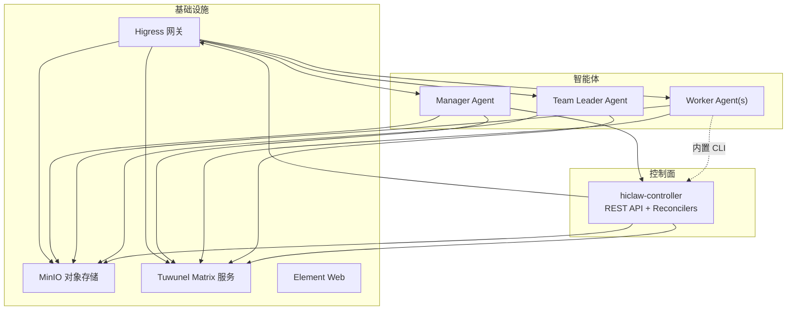
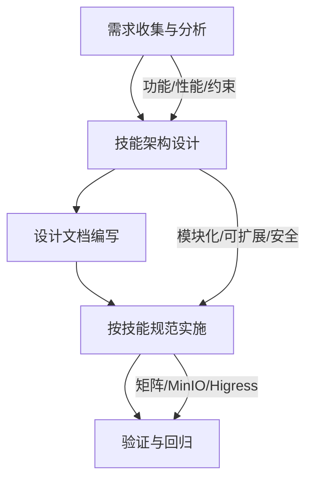
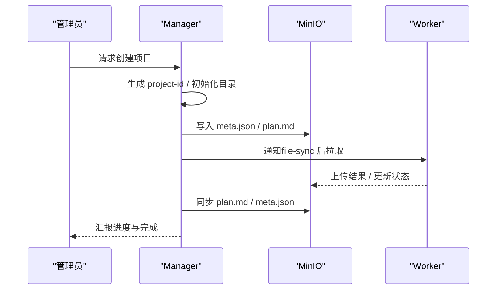
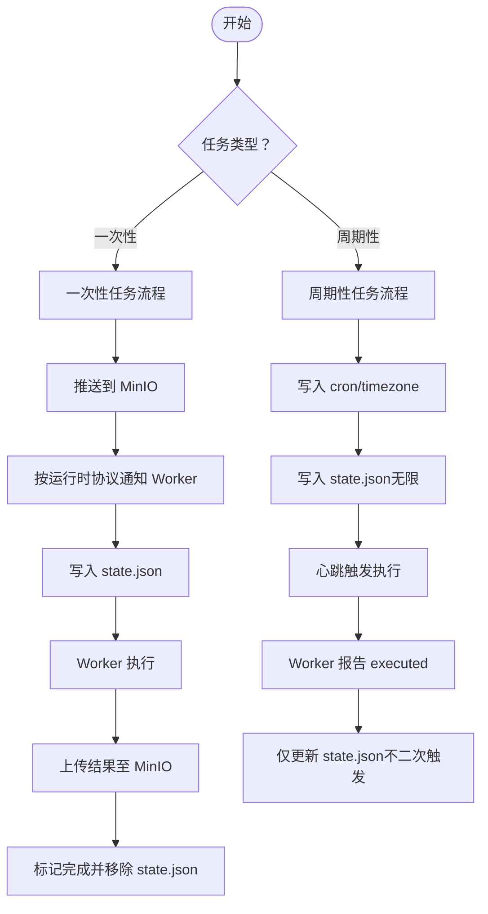
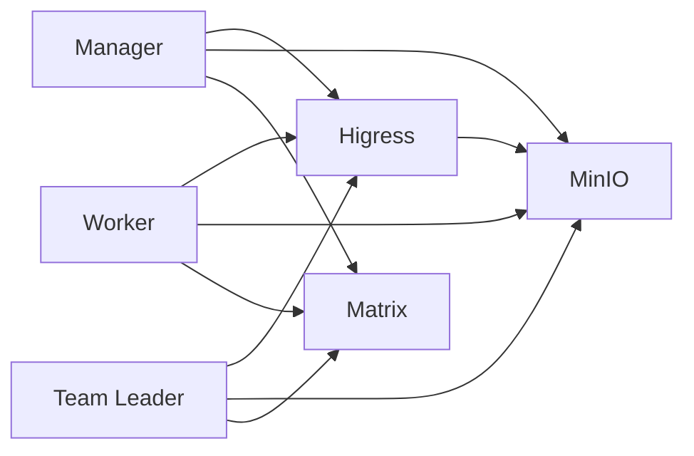

# 设计阶段

<cite>
**本文引用的文件**
- [docs/architecture.md](file://docs/architecture.md)
- [docs/quickstart.md](file://docs/quickstart.md)
- [docs/zh-cn/declarative-resource-management.md](file://docs/zh-cn/declarative-resource-management.md)
- [manager/agent/skills/project-management/SKILL.md](file://manager/agent/skills/project-management/SKILL.md)
- [manager/agent/skills/project-management/references/create-project.md](file://manager/agent/skills/project-management/references/create-project.md)
- [manager/agent/skills/project-management/references/plan-format.md](file://manager/agent/skills/project-management/references/plan-format.md)
- [manager/agent/skills/task-management/SKILL.md](file://manager/agent/skills/task-management/SKILL.md)
- [manager/agent/skills/task-management/references/finite-tasks.md](file://manager/agent/skills/task-management/references/finite-tasks.md)
- [manager/agent/skills/task-management/references/infinite-tasks.md](file://manager/agent/skills/task-management/references/infinite-tasks.md)
- [manager/agent/skills/task-management/references/state-management.md](file://manager/agent/skills/task-management/references/state-management.md)
- [manager/agent/skills/team-management/SKILL.md](file://manager/agent/skills/team-management/SKILL.md)
- [manager/agent/skills/worker-management/SKILL.md](file://manager/agent/skills/worker-management/SKILL.md)
- [manager/agent/skills/worker-management/references/create-worker.md](file://manager/agent/skills/worker-management/references/create-worker.md)
- [manager/agent/skills/channel-management/SKILL.md](file://manager/agent/skills/channel-management/SKILL.md)
- [manager/agent/skills-alpha/coding-cli-management/SKILL.md](file://manager/agent/skills-alpha/coding-cli-management/SKILL.md)
- [migrate/skill/SKILL.md](file://migrate/skill/SKILL.md)
</cite>

## 目录
1. 引言
2. 项目结构
3. 核心组件
4. 架构总览
5. 详细组件分析
6. 依赖分析
7. 性能考量
8. 故障排查指南
9. 结论
10. 附录

## 引言
本指南面向 HiClaw 技能设计阶段，围绕“需求分析—架构设计—设计文档编写”的完整流程，帮助设计人员系统化地定义技能的功能边界、性能与安全约束，并产出可落地的设计文档与实施模板。内容基于仓库中现有的技能文档、参考规范与架构说明，确保设计与实现路径一致。

## 项目结构
HiClaw 采用“控制器 + 管理者 + 工作者（含团队）”的多容器架构，技能体系由 Manager/Worker/Team Leader 的 SKILL.md 与 references 组成，配合 MinIO、Higress、Tuwunel 等基础设施，形成以 Matrix 通信与对象存储为中心的协作平台。

图表来源
- [docs/architecture.md:23-82](file://docs/architecture.md#L23-L82)

章节来源
- [docs/architecture.md:1-235](file://docs/architecture.md#L1-L235)

## 核心组件
- 控制器（hiclaw-controller）：负责 Worker/Manager/Team/Human 的声明式资源编排、生命周期与网关消费者发放。
- 管理者（Manager）：任务协调、项目管理、团队管理、通道与通知策略、权限与 MCP 策略管理。
- 工作者（Worker）：任务执行、文件同步、技能调用、状态上报。
- 团队领导（Team Leader）：在团队维度进行任务分解与协调。
- 基础设施：Higress（AI/Gateway）、MinIO（共享存储）、Tuwunel（Matrix）、Element Web（UI）。

章节来源
- [docs/architecture.md:1-235](file://docs/architecture.md#L1-L235)

## 架构总览
下图展示从“需求—设计—实施—验证”的闭环：需求通过 Manager/Worker/Team 的技能文档沉淀；设计遵循架构约束（通信、存储、网关、权限）；实施依据 SKILL.md 与 references 的操作规范；验证通过快速入门与测试流程闭环。

（该图为概念性流程示意，无需图表来源）

## 详细组件分析

### 一、需求分析与收集
- 功能需求
  - 任务类型：一次性任务（有限）与周期性任务（无限），需明确触发方式与完成判定。
  - 协作范围：单人任务、跨 Worker 协作、团队级任务分解与汇报。
  - 工具集成：MCP 服务器、外部系统（如 GitHub）的委托执行。
- 性能需求
  - 响应时间：心跳轮询、任务触发与结果回传的时延预期。
  - 并发与吞吐：多 Worker 并行、周期任务调度、文件同步带宽。
- 约束条件
  - 通信协议：Matrix 房间与 @mention 规则，主通道与受信联系人策略。
  - 存储与一致性：共享任务树、MinIO 同步与原子更新。
  - 安全与权限：凭据集中管理、消费者密钥、最小权限与 MCP 权限动态控制。

章节来源
- [manager/agent/skills/task-management/SKILL.md:1-30](file://manager/agent/skills/task-management/SKILL.md#L1-L30)
- [manager/agent/skills/task-management/references/finite-tasks.md:1-110](file://manager/agent/skills/task-management/references/finite-tasks.md#L1-L110)
- [manager/agent/skills/task-management/references/infinite-tasks.md:1-44](file://manager/agent/skills/task-management/references/infinite-tasks.md#L1-L44)
- [manager/agent/skills/channel-management/SKILL.md:1-30](file://manager/agent/skills/channel-management/SKILL.md#L1-L30)
- [docs/architecture.md:119-162](file://docs/architecture.md#L119-L162)

### 二、技能架构设计原则
- 模块化设计
  - 技能以 SKILL.md 为入口，辅以 references 与 scripts，职责单一、边界清晰。
  - Manager/Worker/Team Leader 的技能集合分层明确，避免交叉耦合。
- 可扩展性
  - 新增技能通过“内置 + 分发”的方式（builtin + worker-skills），不影响核心运行时。
  - 支持多运行时（openclaw/copaw/hermes），通过控制器解析与镜像选择。
- 安全性
  - 凭据集中于 Higress 消费者密钥，Worker 仅持有令牌，不接触真实密钥。
  - MCP 权限可动态撤销与恢复，最小暴露面。
  - 受信联系人与主通道策略，防止敏感信息外泄。

章节来源
- [docs/architecture.md:140-162](file://docs/architecture.md#L140-L162)
- [docs/architecture.md:223-235](file://docs/architecture.md#L223-L235)
- [manager/agent/skills/worker-management/SKILL.md:1-83](file://manager/agent/skills/worker-management/SKILL.md#L1-L83)

### 三、设计文档模板与标准格式
以下为技能设计文档的通用模板与关键字段，用于统一表达“技能描述、输入输出、错误处理、边界条件”。

- 文档标题与元数据
  - 标题：技能名称（与 SKILL.md name 一致）
  - 描述：技能用途与适用场景
  - 关键词：assign_when（可选，用于自动匹配）
- 技能描述
  - 目标与范围：解决的问题域、与哪些流程衔接
  - 交互对象：Manager/Worker/Team Leader/人类管理员
  - 依赖关系：前置条件、依赖的其他技能或工具
- 输入与输出规范
  - 输入：消息格式（如 @mention + payload）、文件/参数要求
  - 输出：结果文件（如 result.md）、状态更新（如 meta.json）
  - 错误码与语义：失败原因、重试策略、降级处理
- 边界条件与异常处理
  - 超时与重试：任务执行超时、网络抖动、存储不可用
  - 权限不足：MCP 权限被撤销、通道未配置
  - 幂等性：重复触发的处理策略
- 运行时与环境
  - 所需运行时（openclaw/copaw/hermes）
  - 必备工具与脚本（scripts/*）
  - 配置项（如 coding-cli-config.json）
- 参考与示例
  - 参考文档：references/* 中的流程与格式
  - 示例：任务样例、消息样例、文件样例

章节来源
- [manager/agent/skills/project-management/SKILL.md:1-37](file://manager/agent/skills/project-management/SKILL.md#L1-L37)
- [manager/agent/skills/project-management/references/plan-format.md:1-89](file://manager/agent/skills/project-management/references/plan-format.md#L1-L89)
- [manager/agent/skills/task-management/references/finite-tasks.md:1-110](file://manager/agent/skills/task-management/references/finite-tasks.md#L1-L110)
- [manager/agent/skills/task-management/references/infinite-tasks.md:1-44](file://manager/agent/skills/task-management/references/infinite-tasks.md#L1-L44)
- [manager/agent/skills-alpha/coding-cli-management/SKILL.md:1-202](file://manager/agent/skills-alpha/coding-cli-management/SKILL.md#L1-L202)

### 四、典型技能设计示例与最佳实践

#### 示例一：项目管理（project-management）
- 需求要点
  - 项目房间、计划文件（plan.md）、元数据（meta.json）、任务目录结构
  - YOLO 模式对确认流程的影响
  - 计划格式与 DAG 依赖规则
- 设计要点
  - 将“计划草案”与“正式确认”分离，避免无主干信息
  - 使用 references/plan-format.md 作为唯一事实来源
  - 严格遵守“先同步到 MinIO 再通知 Worker”的顺序
- 实施参考
  - 创建项目流程与确认步骤：[references/create-project.md:1-54](file://manager/agent/skills/project-management/references/create-project.md#L1-L54)
  - 计划格式与 DAG 规则：[references/plan-format.md:1-89](file://manager/agent/skills/project-management/references/plan-format.md#L1-L89)

图表来源
- [manager/agent/skills/project-management/references/create-project.md:25-36](file://manager/agent/skills/project-management/references/create-project.md#L25-L36)
- [manager/agent/skills/project-management/SKILL.md:8-25](file://manager/agent/skills/project-management/SKILL.md#L8-L25)

章节来源
- [manager/agent/skills/project-management/SKILL.md:1-37](file://manager/agent/skills/project-management/SKILL.md#L1-L37)
- [manager/agent/skills/project-management/references/create-project.md:1-54](file://manager/agent/skills/project-management/references/create-project.md#L1-L54)
- [manager/agent/skills/project-management/references/plan-format.md:1-89](file://manager/agent/skills/project-management/references/plan-format.md#L1-L89)

#### 示例二：任务管理（task-management）
- 需求要点
  - 一次性任务与周期性任务的差异
  - 任务状态机：分配、进行中、完成、阻塞、修订
  - 通知渠道解析与运行时适配
- 设计要点
  - state.json 为唯一真相，所有变更必须经 manage-state.sh
  - 严禁在管理员 DM 中直接粘贴 Worker 触发文本
  - 无限任务仅在心跳触发，完成记录与下次触发解耦
- 实施参考
  - 一次性任务流程：[references/finite-tasks.md:1-110](file://manager/agent/skills/task-management/references/finite-tasks.md#L1-L110)
  - 周期性任务流程：[references/infinite-tasks.md:1-44](file://manager/agent/skills/task-management/references/infinite-tasks.md#L1-L44)
  - 状态管理脚本与渠道解析：[references/state-management.md:1-36](file://manager/agent/skills/task-management/references/state-management.md#L1-L36)

图表来源
- [manager/agent/skills/task-management/references/finite-tasks.md:10-87](file://manager/agent/skills/task-management/references/finite-tasks.md#L10-L87)
- [manager/agent/skills/task-management/references/infinite-tasks.md:5-43](file://manager/agent/skills/task-management/references/infinite-tasks.md#L5-L43)
- [manager/agent/skills/task-management/references/state-management.md:1-36](file://manager/agent/skills/task-management/references/state-management.md#L1-L36)

章节来源
- [manager/agent/skills/task-management/SKILL.md:1-30](file://manager/agent/skills/task-management/SKILL.md#L1-L30)
- [manager/agent/skills/task-management/references/finite-tasks.md:1-110](file://manager/agent/skills/task-management/references/finite-tasks.md#L1-L110)
- [manager/agent/skills/task-management/references/infinite-tasks.md:1-44](file://manager/agent/skills/task-management/references/infinite-tasks.md#L1-L44)
- [manager/agent/skills/task-management/references/state-management.md:1-36](file://manager/agent/skills/task-management/references/state-management.md#L1-L36)

#### 示例三：团队管理（team-management）
- 需求要点
  - 团队由 Team Leader + 多个 Worker 组成
  - Leader 房间与团队房间的权限与沟通边界
  - 任务委派与生命周期管理
- 设计要点
  - Team Leader 是 Worker 容器，具备管理技能
  - Manager 仅与 Team Leader 交互，不直接与 Worker 通信
  - 默认团队管理员为全局管理员，可指定
- 实施参考
  - 团队创建与委派流程：[manager/agent/skills/team-management/SKILL.md:1-48](file://manager/agent/skills/team-management/SKILL.md#L1-L48)

章节来源
- [manager/agent/skills/team-management/SKILL.md:1-48](file://manager/agent/skills/team-management/SKILL.md#L1-L48)

#### 示例四：工作者管理（worker-management）
- 需求要点
  - Worker 生命周期（创建、启动/停止、重置、删除）
  - 技能推送与技能匹配（assign_when）
  - 运行时切换（destructive）
- 设计要点
  - SOUL 内容必须内联传递，避免 0 字节文件
  - file-sync、task-progress、project-participation 为默认技能
  - 切换运行时会重建容器，注意中断风险
- 实施参考
  - Worker 创建与技能匹配：[references/create-worker.md:24-71](file://manager/agent/skills/worker-management/references/create-worker.md#L24-L71)
  - Worker 管理操作参考：[manager/agent/skills/worker-management/SKILL.md:1-83](file://manager/agent/skills/worker-management/SKILL.md#L1-L83)

章节来源
- [manager/agent/skills/worker-management/SKILL.md:1-83](file://manager/agent/skills/worker-management/SKILL.md#L1-L83)
- [manager/agent/skills/worker-management/references/create-worker.md:24-71](file://manager/agent/skills/worker-management/references/create-worker.md#L24-L71)

#### 示例五：通道管理（channel-management）
- 需求要点
  - 主通道配置与受信联系人策略
  - 首次接触协议与跨通道升级
  - 任务派发必须走 Worker 房间，不得嵌入管理员 DM
- 设计要点
  - 主通道不可设为 matrix（默认回退）
  - 未知发件人组房静默忽略，直至管理员批准
  - 任务派发遵循运行时协议（message / copaw channels send）
- 实施参考
  - 通道与联系人策略：[manager/agent/skills/channel-management/SKILL.md:1-30](file://manager/agent/skills/channel-management/SKILL.md#L1-L30)

章节来源
- [manager/agent/skills/channel-management/SKILL.md:1-30](file://manager/agent/skills/channel-management/SKILL.md#L1-L30)

#### 示例六：迁移技能（hiclaw-migrate）
- 需求要点
  - 将 Standalone OpenClaw 迁移到 HiClaw Worker
  - 分析工具依赖、适配 AGENTS.md 与 SOUL.md、生成迁移包
- 设计要点
  - 使用内置 Marker 区分 HiClaw 管理部分与用户自定义内容
  - 保留必要的自定义工具列表，避免冗余
  - 生成 ZIP 后由导入脚本校验清单
- 实施参考
  - 迁移流程与脚本参考：[migrate/skill/SKILL.md:1-238](file://migrate/skill/SKILL.md#L1-L238)

章节来源
- [migrate/skill/SKILL.md:1-238](file://migrate/skill/SKILL.md#L1-L238)

## 依赖分析
- 组件耦合
  - Manager 与 Worker 通过 Matrix 与 Higress 通信，状态与文件通过 MinIO 同步，耦合度低但依赖强一致性。
  - 技能之间通过共享 references 与 scripts 解耦，新增技能不影响既有流程。
- 外部依赖
  - Higress（AI/Gateway）、MinIO（对象存储）、Tuwunel（Matrix）、Element Web（UI）
  - MCP 服务器（如 GitHub）通过 Higress 路由与消费者密钥访问
- 循环依赖
  - 无直接循环依赖；任务状态通过 state.json 与心跳驱动，避免环路触发

图表来源
- [docs/architecture.md:119-162](file://docs/architecture.md#L119-L162)

章节来源
- [docs/architecture.md:1-235](file://docs/architecture.md#L1-L235)

## 性能考量
- 通信与延迟
  - Matrix 房间消息与文件同步应尽量批量、幂等，减少重复传输。
  - 心跳轮询间隔与任务调度时间窗需平衡成本与响应速度。
- 存储与并发
  - MinIO 同步采用 mc mirror，建议按任务粒度隔离命名空间，避免热点冲突。
  - 文件写入与读取遵循“先写后读”顺序，必要时加处理标记（processing marker）。
- 运行时与资源
  - 多运行时（openclaw/copaw/hermes）按场景选择，避免不必要的镜像切换。
  - Worker 无状态，容器重启不应影响任务进度，确保 MinIO 数据持久化。

（本节为通用指导，无需章节来源）

## 故障排查指南
- 任务无法完成或 Worker 被停止
  - 检查 state.json 是否存在对应任务条目；若缺失，Worker 可能因空闲超时被停止。
  - 确认任务已在 MinIO 中可见，再通知 Worker。
- 通知未送达或重复
  - 管理员 DM 中不得直接粘贴 Worker 触发文本；按运行时协议发送至 Worker 房间。
  - 无限任务完成后仅记录执行，不要立即再次触发，避免循环。
- 通道与权限问题
  - 主通道不可设为 matrix；首次接触需匹配管理员语言。
  - MCP 权限被撤销时，Worker 应收到明确错误；可通过 Manager 恢复。
- 迁移失败或内容冲突
  - 检查 AGENTS.md 的内置 Marker 区段是否正确；用户内容应位于 Marker 之后。
  - 生成 ZIP 前确保 AGENTS.md/SOUL.md 已按 HiClaw 规范适配。

章节来源
- [manager/agent/skills/task-management/SKILL.md:8-25](file://manager/agent/skills/task-management/SKILL.md#L8-L25)
- [manager/agent/skills/task-management/references/finite-tasks.md:26-98](file://manager/agent/skills/task-management/references/finite-tasks.md#L26-L98)
- [manager/agent/skills/task-management/references/infinite-tasks.md:21-43](file://manager/agent/skills/task-management/references/infinite-tasks.md#L21-L43)
- [manager/agent/skills/channel-management/SKILL.md:11-20](file://manager/agent/skills/channel-management/SKILL.md#L11-L20)
- [migrate/skill/SKILL.md:78-118](file://migrate/skill/SKILL.md#L78-L118)

## 结论
HiClaw 的技能设计应以“需求—架构—文档—实施—验证”为主线，严格遵循架构约束与技能规范，确保功能边界清晰、可扩展且安全可控。通过统一的设计文档模板与参考流程，可以显著降低设计偏差与实施风险，提升团队协作效率与交付质量。

## 附录

### A. 快速上手与验证
- 安装与登录：参考快速入门指南中的安装与登录步骤，验证各组件健康状态。
- 创建 Worker 与任务：通过 Matrix 与 Manager 交互，完成首次任务委派与结果验证。
- GitHub MCP 操作：验证 MCP 权限撤销与恢复流程。

章节来源
- [docs/quickstart.md:1-356](file://docs/quickstart.md#L1-L356)

### B. 声明式资源与团队配置
- Team/Manager/Worker/Human 的 CRD 字段与状态，便于在 YAML 中声明式管理。

章节来源
- [docs/zh-cn/declarative-resource-management.md:156-207](file://docs/zh-cn/declarative-resource-management.md#L156-L207)
- [docs/architecture.md:165-177](file://docs/architecture.md#L165-L177)