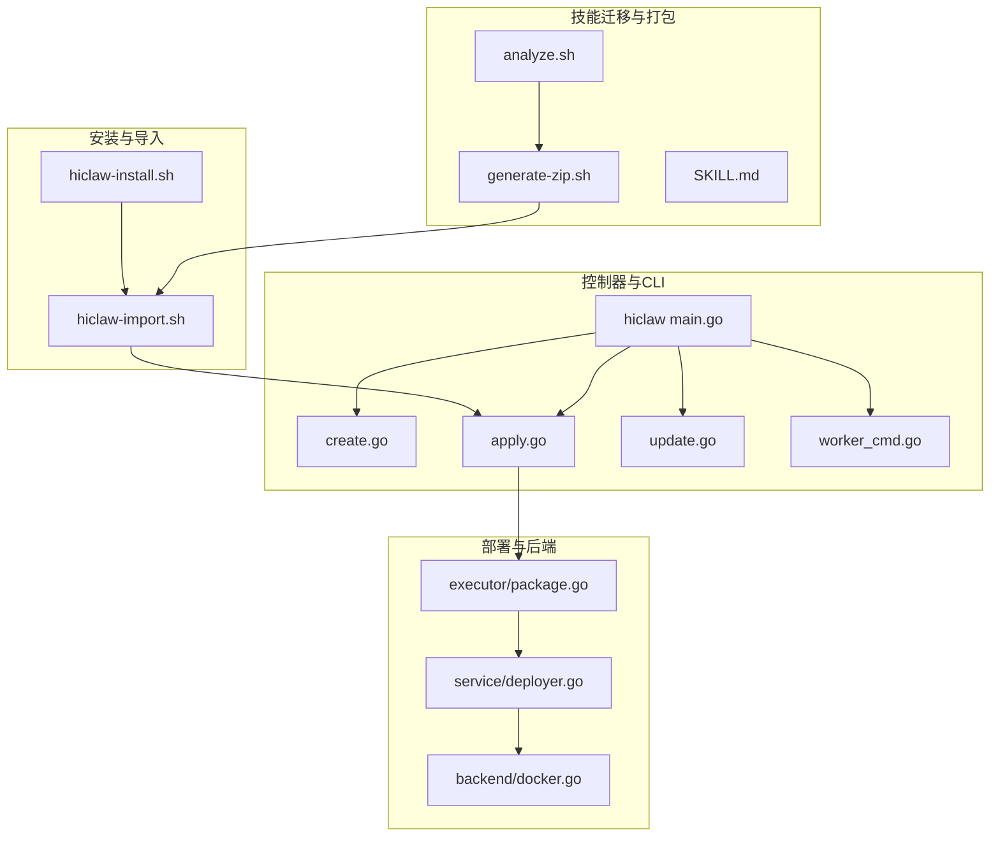
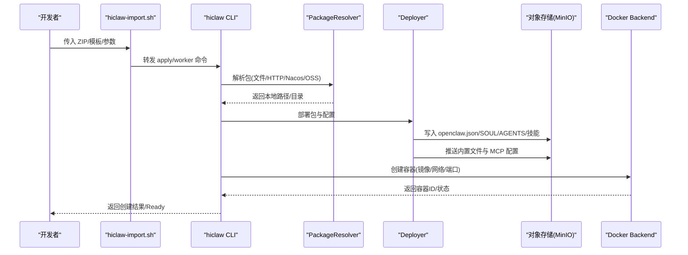
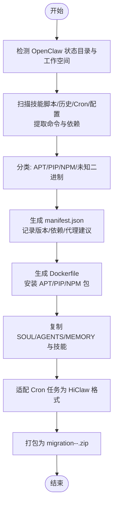
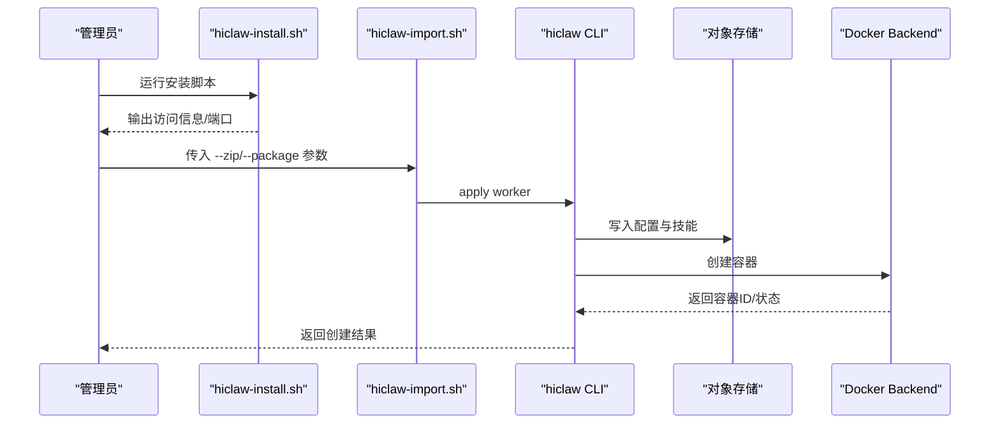
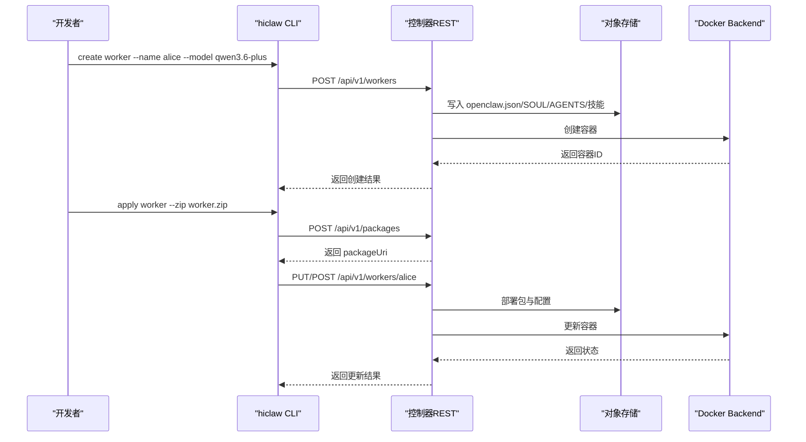
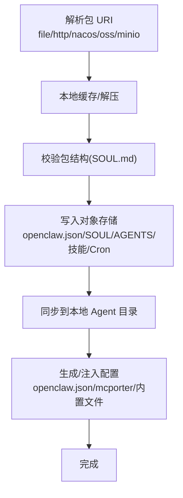
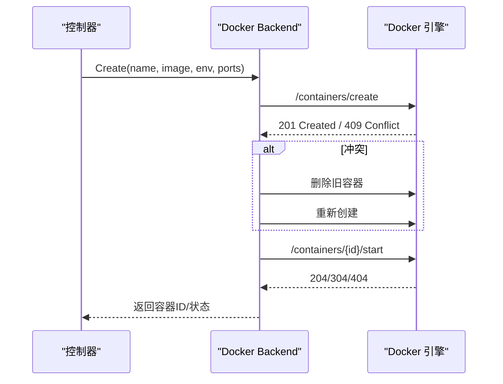
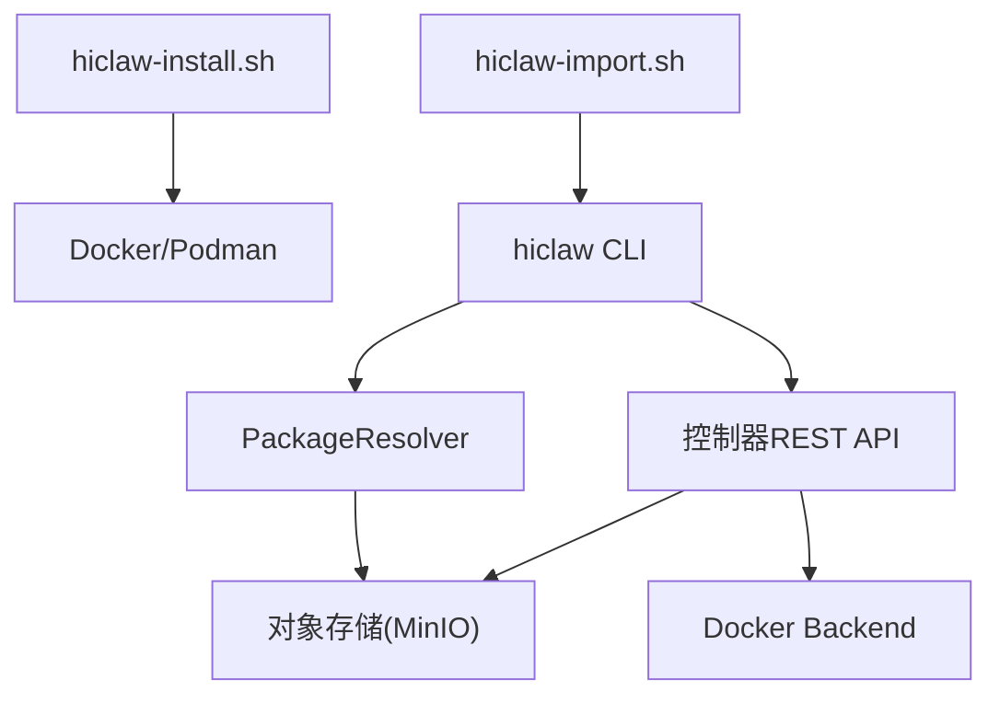

# 部署发布

<cite>
**本文档引用的文件**
- [README.md](file://README.md)
- [SKILL.md](file://migrate/skill/SKILL.md)
- [generate-zip.sh](file://migrate/skill/scripts/generate-zip.sh)
- [analyze.sh](file://migrate/skill/scripts/analyze.sh)
- [AGENTS.md（CoPaw 管理员）](file://manager/agent/copaw-manager-agent/AGENTS.md)
- [AGENTS.md（Hermes Worker）](file://manager/agent/hermes-worker-agent/AGENTS.md)
- [current.md](file://changelog/current.md)
- [v1.1.0.md](file://changelog/v1.1.0.md)
- [hiclaw-install.sh](file://install/hiclaw-install.sh)
- [hiclaw-import.sh](file://install/hiclaw-import.sh)
- [main.go](file://hiclaw-controller/cmd/hiclaw/main.go)
- [create.go](file://hiclaw-controller/cmd/hiclaw/create.go)
- [apply.go](file://hiclaw-controller/cmd/hiclaw/apply.go)
- [update.go](file://hiclaw-controller/cmd/hiclaw/update.go)
- [worker_cmd.go](file://hiclaw-controller/cmd/hiclaw/worker_cmd.go)
- [package.go](file://hiclaw-controller/internal/executor/package.go)
- [deployer.go](file://hiclaw-controller/internal/service/deployer.go)
- [docker.go](file://hiclaw-controller/internal/backend/docker.go)
</cite>

## 目录
1. [简介](#简介)
2. [项目结构](#项目结构)
3. [核心组件](#核心组件)
4. [架构总览](#架构总览)
5. [详细组件分析](#详细组件分析)
6. [依赖分析](#依赖分析)
7. [性能考虑](#性能考虑)
8. [故障排查指南](#故障排查指南)
9. [结论](#结论)
10. [附录](#附录)

## 简介
本指南面向 HiClaw 技能部署与发布，覆盖从技能打包、依赖管理、压缩打包，到导入、安装、激活、版本控制与发布说明，再到发布后的监控、维护与回滚机制。文档基于仓库中的安装脚本、CLI、控制器与迁移工具链，提供可操作的流程与可视化图示，帮助读者在本地或 Kubernetes 环境中高效完成技能与 Worker 的全生命周期管理。

## 项目结构
HiClaw 采用多模块协作的工程结构：
- 安装与导入：install/ 下的一键安装与导入脚本，负责环境准备、资源创建与 Worker 导入。
- 技能迁移与打包：migrate/skill/ 提供从 OpenClaw 迁移到 HiClaw 的技能打包工具链。
- 控制器与 CLI：hiclaw-controller/cmd/hiclaw/ 提供资源管理 CLI（创建、应用、更新、状态查询、生命周期）。
- 部署与后端：hiclaw-controller/internal/service/ 与 internal/backend/ 负责配置生成、对象存储同步与容器后端编排。
- 管理员与 Worker 行为规范：manager/agent/ 下的 AGENTS.md 文档定义了 Manager 与 Worker 的行为规则与工作流。

图表来源
- [hiclaw-install.sh:1-800](file://install/hiclaw-install.sh#L1-L800)
- [hiclaw-import.sh:1-140](file://install/hiclaw-import.sh#L1-L140)
- [analyze.sh:1-296](file://migrate/skill/scripts/analyze.sh#L1-L296)
- [generate-zip.sh:1-451](file://migrate/skill/scripts/generate-zip.sh#L1-L451)
- [SKILL.md:1-238](file://migrate/skill/SKILL.md#L1-L238)
- [main.go:1-35](file://hiclaw-controller/cmd/hiclaw/main.go#L1-L35)
- [create.go:1-499](file://hiclaw-controller/cmd/hiclaw/create.go#L1-L499)
- [apply.go:1-388](file://hiclaw-controller/cmd/hiclaw/apply.go#L1-L388)
- [update.go:1-215](file://hiclaw-controller/cmd/hiclaw/update.go#L1-L215)
- [worker_cmd.go:1-299](file://hiclaw-controller/cmd/hiclaw/worker_cmd.go#L1-L299)
- [deployer.go:1-678](file://hiclaw-controller/internal/service/deployer.go#L1-L678)
- [package.go:1-596](file://hiclaw-controller/internal/executor/package.go#L1-L596)
- [docker.go:1-577](file://hiclaw-controller/internal/backend/docker.go#L1-L577)

章节来源
- [README.md:1-404](file://README.md#L1-L404)

## 核心组件
- 安装与导入脚本：一键安装 Manager 与 Worker，支持交互式与非交互式模式；导入脚本将 ZIP 包或注册表模板推送到控制器并创建/更新资源。
- 技能迁移工具链：analyze.sh 分析依赖，generate-zip.sh 生成迁移包，包含 manifest.json、Dockerfile、配置与技能。
- 控制器 CLI：hiclaw CLI 支持 create/apply/update/worker/status 等命令，驱动控制器完成资源创建与状态管理。
- 部署器与包解析器：将包内容部署到对象存储，生成 openclaw.json、SOUL.md、AGENTS.md、内置技能与 MCP 配置，并注入运行时上下文。
- Docker 后端：通过 Docker Engine API 创建/启动/停止容器，处理端口冲突与镜像拉取。

章节来源
- [hiclaw-install.sh:1-800](file://install/hiclaw-install.sh#L1-L800)
- [hiclaw-import.sh:1-140](file://install/hiclaw-import.sh#L1-L140)
- [SKILL.md:1-238](file://migrate/skill/SKILL.md#L1-L238)
- [generate-zip.sh:1-451](file://migrate/skill/scripts/generate-zip.sh#L1-L451)
- [analyze.sh:1-296](file://migrate/skill/scripts/analyze.sh#L1-L296)
- [main.go:1-35](file://hiclaw-controller/cmd/hiclaw/main.go#L1-L35)
- [create.go:1-499](file://hiclaw-controller/cmd/hiclaw/create.go#L1-L499)
- [apply.go:1-388](file://hiclaw-controller/cmd/hiclaw/apply.go#L1-L388)
- [update.go:1-215](file://hiclaw-controller/cmd/hiclaw/update.go#L1-L215)
- [worker_cmd.go:1-299](file://hiclaw-controller/cmd/hiclaw/worker_cmd.go#L1-L299)
- [deployer.go:1-678](file://hiclaw-controller/internal/service/deployer.go#L1-L678)
- [package.go:1-596](file://hiclaw-controller/internal/executor/package.go#L1-L596)
- [docker.go:1-577](file://hiclaw-controller/internal/backend/docker.go#L1-L577)

## 架构总览
HiClaw 的技能部署与发布围绕“对象存储 + 控制器 + 容器后端”展开：
- 对象存储（MinIO）：集中存放 Worker 配置、技能与共享数据，保证 Worker 无状态与可恢复。
- 控制器：接收 CLI/导入请求，解析包，生成配置，注入上下文，同步到对象存储，并通过后端创建容器。
- 容器后端：Docker 后端负责镜像拉取、容器创建与生命周期管理。

图表来源
- [hiclaw-import.sh:1-140](file://install/hiclaw-import.sh#L1-L140)
- [apply.go:1-388](file://hiclaw-controller/cmd/hiclaw/apply.go#L1-L388)
- [package.go:1-596](file://hiclaw-controller/internal/executor/package.go#L1-L596)
- [deployer.go:1-678](file://hiclaw-controller/internal/service/deployer.go#L1-L678)
- [docker.go:1-577](file://hiclaw-controller/internal/backend/docker.go#L1-L577)

## 详细组件分析

### 组件A：技能打包与迁移（OpenClaw → HiClaw）
- 依赖分析：analyze.sh 扫描技能脚本、历史命令、定时任务与配置文件，识别系统命令、Python 与 Node 包，生成 tool-analysis.json。
- 包生成：generate-zip.sh 基于分析结果生成 Dockerfile、manifest.json、配置与技能目录，打包为 ZIP。
- 迁移规范：SKILL.md 规定迁移流程、AGENTS.md 标记注入、SOUL.md 结构与 Cron 适配。

图表来源
- [analyze.sh:1-296](file://migrate/skill/scripts/analyze.sh#L1-L296)
- [generate-zip.sh:1-451](file://migrate/skill/scripts/generate-zip.sh#L1-L451)
- [SKILL.md:1-238](file://migrate/skill/SKILL.md#L1-L238)

章节来源
- [analyze.sh:1-296](file://migrate/skill/scripts/analyze.sh#L1-L296)
- [generate-zip.sh:1-451](file://migrate/skill/scripts/generate-zip.sh#L1-L451)
- [SKILL.md:1-238](file://migrate/skill/SKILL.md#L1-L238)

### 组件B：安装与导入（Manager/Worker）
- 一键安装：hiclaw-install.sh 支持交互式与非交互式安装，自动检测时区、语言、端口与网络模式，拉取镜像并启动服务。
- 导入 Worker：hiclaw-import.sh 将 ZIP/模板/远程包导入控制器，创建或更新 Worker 资源。

图表来源
- [hiclaw-install.sh:1-800](file://install/hiclaw-install.sh#L1-L800)
- [hiclaw-import.sh:1-140](file://install/hiclaw-import.sh#L1-L140)
- [apply.go:1-388](file://hiclaw-controller/cmd/hiclaw/apply.go#L1-L388)
- [docker.go:1-577](file://hiclaw-controller/internal/backend/docker.go#L1-L577)

章节来源
- [hiclaw-install.sh:1-800](file://install/hiclaw-install.sh#L1-L800)
- [hiclaw-import.sh:1-140](file://install/hiclaw-import.sh#L1-L140)

### 组件C：控制器 CLI（创建/应用/更新/状态）
- 创建 Worker：create.go 支持 name、model、runtime、image、identity、soul、skills、package、expose、team、role 等参数。
- 应用 Worker：apply.go 支持 ZIP 上传与参数直传，自动区分创建/更新。
- 更新 Worker：update.go 仅更新指定字段。
- Worker 生命周期：worker_cmd.go 提供 wake/sleep/ensure-ready/status/report-ready 等命令。

图表来源
- [create.go:1-499](file://hiclaw-controller/cmd/hiclaw/create.go#L1-L499)
- [apply.go:1-388](file://hiclaw-controller/cmd/hiclaw/apply.go#L1-L388)
- [update.go:1-215](file://hiclaw-controller/cmd/hiclaw/update.go#L1-L215)
- [worker_cmd.go:1-299](file://hiclaw-controller/cmd/hiclaw/worker_cmd.go#L1-L299)
- [deployer.go:1-678](file://hiclaw-controller/internal/service/deployer.go#L1-L678)
- [docker.go:1-577](file://hiclaw-controller/internal/backend/docker.go#L1-L577)

章节来源
- [create.go:1-499](file://hiclaw-controller/cmd/hiclaw/create.go#L1-L499)
- [apply.go:1-388](file://hiclaw-controller/cmd/hiclaw/apply.go#L1-L388)
- [update.go:1-215](file://hiclaw-controller/cmd/hiclaw/update.go#L1-L215)
- [worker_cmd.go:1-299](file://hiclaw-controller/cmd/hiclaw/worker_cmd.go#L1-L299)

### 组件D：部署器与包解析器
- 包解析：支持 file://、http(s)://、nacos://、oss:// 与 MinIO 路径，解析并缓存到本地，解压后校验结构。
- 部署：将配置、技能、Cron 等写入对象存储，必要时先写入 MinIO 再同步到本地，避免镜像同步竞争。
- 配置生成：生成 openclaw.json、mcporter-servers.json、Matrix 凭证与内置文件，注入团队协调上下文与内置 AGENTS.md。

图表来源
- [package.go:1-596](file://hiclaw-controller/internal/executor/package.go#L1-L596)
- [deployer.go:1-678](file://hiclaw-controller/internal/service/deployer.go#L1-L678)

章节来源
- [package.go:1-596](file://hiclaw-controller/internal/executor/package.go#L1-L596)
- [deployer.go:1-678](file://hiclaw-controller/internal/service/deployer.go#L1-L678)

### 组件E：容器后端（Docker）
- 可用性检测：检查 Docker Socket 与 PING。
- 创建容器：解析 runtime/image/network/env/端口映射，处理端口冲突重试。
- 生命周期：Start/Stop/Delete/Status，标准化状态。

图表来源
- [docker.go:1-577](file://hiclaw-controller/internal/backend/docker.go#L1-L577)

章节来源
- [docker.go:1-577](file://hiclaw-controller/internal/backend/docker.go#L1-L577)

## 依赖分析
- 安装脚本依赖 Docker/Podman 可用性与容器运行时 Socket；导入脚本依赖控制器容器运行。
- CLI 依赖控制器 REST API 与对象存储；包解析器依赖 mc 命令与 MinIO 客户端。
- 部署器依赖对象存储镜像同步能力与容器后端 API。

图表来源
- [hiclaw-install.sh:1-800](file://install/hiclaw-install.sh#L1-L800)
- [hiclaw-import.sh:1-140](file://install/hiclaw-import.sh#L1-L140)
- [apply.go:1-388](file://hiclaw-controller/cmd/hiclaw/apply.go#L1-L388)
- [package.go:1-596](file://hiclaw-controller/internal/executor/package.go#L1-L596)
- [docker.go:1-577](file://hiclaw-controller/internal/backend/docker.go#L1-L577)

章节来源
- [hiclaw-install.sh:1-800](file://install/hiclaw-install.sh#L1-L800)
- [hiclaw-import.sh:1-140](file://install/hiclaw-import.sh#L1-L140)
- [apply.go:1-388](file://hiclaw-controller/cmd/hiclaw/apply.go#L1-L388)
- [package.go:1-596](file://hiclaw-controller/internal/executor/package.go#L1-L596)
- [docker.go:1-577](file://hiclaw-controller/internal/backend/docker.go#L1-L577)

## 性能考虑
- 镜像拉取与端口分配：Docker 后端在创建容器时进行镜像存在性检查与拉取，若端口冲突会重试并清理容器，避免资源泄漏。
- 对象存储同步：部署器先写入 MinIO 再同步本地，避免镜像同步导致的覆盖与竞态。
- 配置生成：openclaw.json 与内置文件写入采用增量/合并策略，减少不必要的覆盖。

章节来源
- [docker.go:1-577](file://hiclaw-controller/internal/backend/docker.go#L1-L577)
- [deployer.go:1-678](file://hiclaw-controller/internal/service/deployer.go#L1-L678)
- [package.go:1-596](file://hiclaw-controller/internal/executor/package.go#L1-L596)

## 故障排查指南
- 安装失败：检查 Docker/Podman 是否可用、Socket 权限与网络绑定；查看安装日志文件。
- 导入失败：确认控制器容器运行、ZIP/模板可达；使用 --dry-run/-f 检查 YAML 语法。
- Worker 未就绪：使用 worker status/ensure-ready 检查阶段与容器状态；必要时使用 worker wake/sleep。
- 端口冲突：Docker 后端会自动重试端口分配，若持续失败，调整暴露端口或清理占用进程。
- 配置覆盖：确认对象存储中 SOUL/AGENTS/HEARTBEAT 已由权威写入器管理，避免镜像同步覆盖。

章节来源
- [hiclaw-install.sh:1-800](file://install/hiclaw-install.sh#L1-L800)
- [hiclaw-import.sh:1-140](file://install/hiclaw-import.sh#L1-L140)
- [worker_cmd.go:1-299](file://hiclaw-controller/cmd/hiclaw/worker_cmd.go#L1-L299)
- [docker.go:1-577](file://hiclaw-controller/internal/backend/docker.go#L1-L577)

## 结论
HiClaw 的技能部署与发布流程以“对象存储 + 控制器 + 容器后端”为核心，结合安装脚本、迁移工具链与 CLI，形成从技能打包、导入、配置生成到容器编排的完整闭环。遵循本文档的流程与最佳实践，可在本地与 Kubernetes 环境中稳定地完成技能与 Worker 的全生命周期管理。

## 附录

### A. 技能打包与迁移流程（摘要）
- 使用 analyze.sh 生成 tool-analysis.json。
- 使用 generate-zip.sh 生成 ZIP 包，包含 manifest.json、Dockerfile、config 与 skills。
- 使用 SKILL.md 规范化 AGENTS.md、SOUL.md 与 Cron 适配。
- 通过 hiclaw-import.sh 导入 ZIP 到控制器，创建/更新 Worker。

章节来源
- [analyze.sh:1-296](file://migrate/skill/scripts/analyze.sh#L1-L296)
- [generate-zip.sh:1-451](file://migrate/skill/scripts/generate-zip.sh#L1-L451)
- [SKILL.md:1-238](file://migrate/skill/SKILL.md#L1-L238)
- [hiclaw-import.sh:1-140](file://install/hiclaw-import.sh#L1-L140)

### B. 版本控制与发布说明
- 当前未发布变更记录：current.md 记录影响镜像的变更，用于下一次发布前汇总。
- v1.1.0 发布说明：涵盖 Kubernetes 原生架构、Hermes Worker 运行时、Helm Chart、多容器架构、OpenClaw 升级与镜像瘦身、自动迁移、CLI 改进等。

章节来源
- [current.md:1-12](file://changelog/current.md#L1-L12)
- [v1.1.0.md:1-184](file://changelog/v1.1.0.md#L1-L184)

### C. 部署与激活步骤（摘要）
- 一键安装：运行 hiclaw-install.sh，按提示选择提供商、模型与端口，完成安装。
- 导入 Worker：运行 hiclaw-import.sh，传入 --zip 或 --package，创建/更新 Worker。
- 激活与监控：使用 worker status/ensure-ready 检查状态；使用 worker report-ready 上报就绪与心跳。

章节来源
- [hiclaw-install.sh:1-800](file://install/hiclaw-install.sh#L1-L800)
- [hiclaw-import.sh:1-140](file://install/hiclaw-import.sh#L1-L140)
- [worker_cmd.go:1-299](file://hiclaw-controller/cmd/hiclaw/worker_cmd.go#L1-L299)

### D. 管理员与 Worker 行为规范（摘要）
- 管理员（CoPaw）：明确会话规则、消息发送规则、控制器 API 规则、内存与工具使用、@mention 协议与 NO_REPLY 使用。
- Worker（Hermes）：明确工作空间布局、访问共享文件、会话规则、任务执行流程、MinIO 访问与安全规则。

章节来源
- [AGENTS.md（CoPaw 管理员）:1-249](file://manager/agent/copaw-manager-agent/AGENTS.md#L1-L249)
- [AGENTS.md（Hermes Worker）:1-225](file://manager/agent/hermes-worker-agent/AGENTS.md#L1-L225)