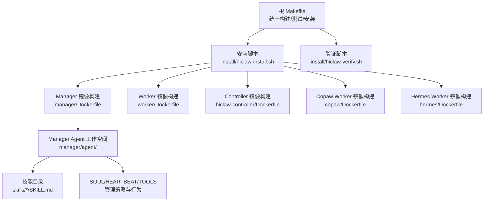
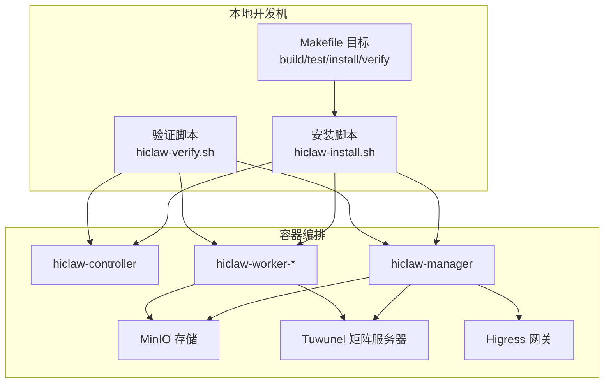
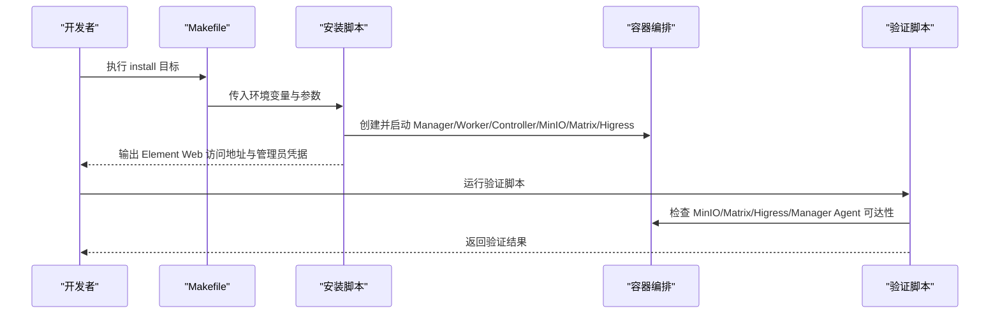
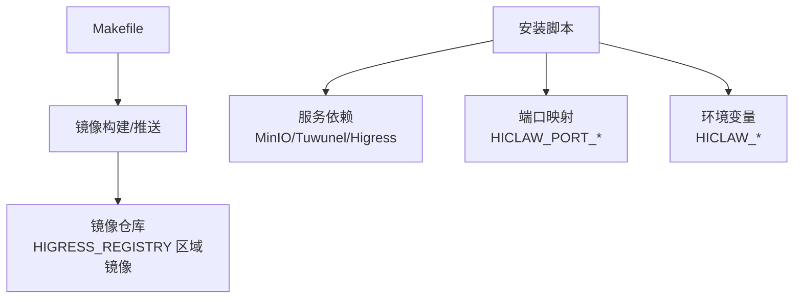

# 开发环境搭建

<cite>
**本文引用的文件**
- [README.md](file://README.md)
- [docs/development.md](file://docs/development.md)
- [install/README.md](file://install/README.md)
- [install/hiclaw-install.sh](file://install/hiclaw-install.sh)
- [install/hiclaw-verify.sh](file://install/hiclaw-verify.sh)
- [Makefile](file://Makefile)
- [manager/agent/AGENTS.md](file://manager/agent/AGENTS.md)
- [manager/agent/skills/worker-management/SKILL.md](file://manager/agent/skills/worker-management/SKILL.md)
- [manager/agent/skills/channel-management/SKILL.md](file://manager/agent/skills/channel-management/SKILL.md)
- [copaw/README.md](file://copaw/README.md)
- [copaw/AGENTS.md](file://copaw/AGENTS.md)
- [copaw/pyproject.toml](file://copaw/pyproject.toml)
- [hermes/README.md](file://hermes/README.md)
- [hermes/pyproject.toml](file://hermes/pyproject.toml)
</cite>

## 目录
1. [简介](#简介)
2. [项目结构](#项目结构)
3. [核心组件](#核心组件)
4. [架构总览](#架构总览)
5. [详细组件分析](#详细组件分析)
6. [依赖关系分析](#依赖关系分析)
7. [性能考虑](#性能考虑)
8. [故障排查指南](#故障排查指南)
9. [结论](#结论)
10. [附录](#附录)

## 简介
本指南面向 HiClaw 技能开发者与本地贡献者，提供从系统要求、前置条件、工具链安装配置到开发目录结构、文件组织规范、环境验证与常见问题排查的完整流程。通过统一的构建与测试入口（Makefile）、安装脚本与验证脚本，以及多运行时（OpenClaw/CoPaw/Hermes）的技能生态，帮助你在本地快速搭建可复现的开发环境。

## 项目结构
HiClaw 采用模块化分层组织：根目录提供统一的构建与测试入口；安装脚本负责一键部署 Manager 与 Worker；各子系统（Manager、Worker、Controller、Helm Chart、Copaw/Hermes Worker）各自维护独立的源码与配置；技能以 SKILL.md 为单位组织在 Manager 的工作空间中。

图示来源
- [Makefile:104-121](file://Makefile#L104-L121)
- [install/hiclaw-install.sh:1-200](file://install/hiclaw-install.sh#L1-L200)
- [manager/agent/AGENTS.md:1-220](file://manager/agent/AGENTS.md#L1-L220)

章节来源
- [README.md:54-110](file://README.md#L54-L110)
- [docs/development.md:12-47](file://docs/development.md#L12-L47)
- [Makefile:104-121](file://Makefile#L104-L121)

## 核心组件
- 构建与测试：通过 Makefile 提供统一目标，支持多架构镜像构建与推送、集成测试、状态查询与日志查看。
- 安装与卸载：install/hiclaw-install.sh 支持交互式与非交互式安装，覆盖 Manager/Worker/Controller/嵌入式模式等。
- 验证：install/hiclaw-verify.sh 对容器运行态、内部服务与外部端口进行浅层健康检查。
- 运行时与技能：Manager/Worker 支持 OpenClaw/CoPaw/Hermes 三种运行时；技能以 SKILL.md 组织，遵循统一的 YAML front matter 规范。

章节来源
- [docs/development.md:16-76](file://docs/development.md#L16-L76)
- [install/README.md:5-186](file://install/README.md#L5-L186)
- [install/hiclaw-verify.sh:1-176](file://install/hiclaw-verify.sh#L1-L176)
- [copaw/AGENTS.md:140-173](file://copaw/AGENTS.md#L140-L173)

## 架构总览
下图展示本地开发与安装的关键交互：开发者通过 Makefile 执行构建/安装，安装脚本拉起 Manager/Worker/Controller/MinIO/Matrix/Higress 等组件；验证脚本对关键端点进行可达性检查；Manager 工作空间中的技能通过 SKILL.md 描述能力边界与调用方式。

图示来源
- [Makefile:538-691](file://Makefile#L538-L691)
- [install/hiclaw-install.sh:1-200](file://install/hiclaw-install.sh#L1-L200)
- [install/hiclaw-verify.sh:80-164](file://install/hiclaw-verify.sh#L80-L164)

## 详细组件分析

### 系统要求与前置条件
- 操作系统支持
  - macOS / Linux：推荐使用 Docker Desktop 或 Docker Engine。
  - Windows：需要 PowerShell 7+ 与 Docker Desktop（WSL2 后端）。
- 资源建议
  - 最低：2 核 CPU + 4 GB 内存；多 Worker 场景建议 4 核 + 8 GB。
- 必备工具
  - Docker（用于构建与测试）
  - Git（代码与包管理）
  - mc（MinIO 客户端，用于集成测试）
  - jq（JSON 处理，测试脚本使用）

章节来源
- [README.md:56-58](file://README.md#L56-L58)
- [docs/development.md:5-11](file://docs/development.md#L5-L11)
- [install/README.md:5-9](file://install/README.md#L5-L9)

### 开发工具链安装与配置
- Docker
  - macOS/Linux：安装 Docker Desktop 或 Docker Engine，并确保服务已启动。
  - Windows：安装 Docker Desktop 并启用 WSL2 后端。
- Helm（可选，Kubernetes 部署）
  - Helm 3.7+，配合 Kubernetes 集群（kind/minikube/k3s/托管集群）。
- Git
  - 用于克隆仓库与分支切换；部分构建场景需访问 npm 与 GitHub，国内用户可按需配置代理。
- MinIO Client（mc）
  - 用于测试阶段的存储操作与数据校验。
- jq
  - 用于解析测试输出与日志。

章节来源
- [docs/development.md:5-11](file://docs/development.md#L5-L11)
- [install/README.md:5-9](file://install/README.md#L5-L9)
- [README.md:114-118](file://README.md#L114-L118)

### 安装与卸载流程
- 一键安装（推荐）
  - macOS/Linux：直接执行安装脚本，按提示输入 LLM API Key、管理员密码等。
  - Windows：使用 PowerShell 7+ 执行安装脚本。
- 自定义安装
  - 通过环境变量覆盖默认值（如 LLM Provider、默认模型、端口映射、数据持久化路径等）。
- 卸载
  - 支持停止并移除 Manager、Worker、控制器容器，清理卷与工作空间目录。

图示来源
- [Makefile:538-563](file://Makefile#L538-L563)
- [install/hiclaw-install.sh:1-200](file://install/hiclaw-install.sh#L1-L200)
- [install/hiclaw-verify.sh:80-164](file://install/hiclaw-verify.sh#L80-L164)

章节来源
- [install/README.md:10-186](file://install/README.md#L10-L186)
- [install/hiclaw-install.sh:1-200](file://install/hiclaw-install.sh#L1-L200)
- [Makefile:538-598](file://Makefile#L538-L598)

### 开发环境验证方法
- 容器运行态
  - 使用 status 目标查看所有 hiclaw 相关容器状态。
- 内部服务健康
  - MinIO 健康检查（127.0.0.1:9000/minio/health/live）
  - Matrix API 可达（127.0.0.1:6167/_matrix/client/versions）
  - Manager Agent 健康（OpenClaw：gateway health；CoPaw：应用健康端点）
- 外部可达性
  - Higress 网关（默认 18080）
  - Higress 控制台（默认 18001）
- 日志定位
  - 查看控制器、Manager、Worker 的日志，结合会话文件定位问题。

章节来源
- [install/hiclaw-verify.sh:80-164](file://install/hiclaw-verify.sh#L80-L164)
- [Makefile:695-708](file://Makefile#L695-L708)
- [docs/development.md:412-474](file://docs/development.md#L412-L474)

### 技能开发目录结构与文件组织规范
- Manager 工作空间布局
  - 主机挂载路径：~/（SOUL.md、openclaw.json、memory/、skills/、state.json、workers-registry.json 等）
  - 共享空间：/root/hiclaw-fs/shared/（任务、知识、协作数据，与 MinIO 同步）
  - Worker 文件：/root/hiclaw-fs/agents/<worker-name>/（可通过 MinIO 镜像查看）
- 技能文件规范
  - SKILL.md 必须包含 YAML front matter（name 与 description），否则 OpenClaw 不会发现该技能。
  - 技能放置于 <workspace>/skills/<name>/SKILL.md，由 openclaw-workspace 自动发现。
- 目录层级设计
  - manager/agent/skills/<skill-name>/SKILL.md
  - manager/agent/skills/<skill-name>/scripts/（可选脚本）
  - manager/agent/skills/<skill-name>/references/（参考文档）
- 行为与安全
  - 严格遵守主机文件访问权限与隐私规则，必须获得管理员授权后方可访问主机文件。
  - 任务委派必须通过房间消息工具发送至 Worker 房间，不得在管理员 DM 中直接 @mention。

章节来源
- [manager/agent/AGENTS.md:1-220](file://manager/agent/AGENTS.md#L1-L220)
- [docs/development.md:373-386](file://docs/development.md#L373-L386)
- [manager/agent/skills/worker-management/SKILL.md:1-83](file://manager/agent/skills/worker-management/SKILL.md#L1-L83)
- [manager/agent/skills/channel-management/SKILL.md:1-30](file://manager/agent/skills/channel-management/SKILL.md#L1-L30)

### 运行时与技能生态
- 运行时选择
  - Manager：openclaw（默认）或 copaw
  - Worker：openclaw、copaw、hermes
- CoPaw Worker
  - 基于 Python 3.11，提供轻量级 Worker 运行时；通过 bridge 将 openclaw.json 转换为 CoPaw 原生配置。
  - 依赖矩阵通道与 mcporter 工具，支持 MCP 服务器调用。
- Hermes Worker
  - 基于 hermes-agent，提供自主编码能力；通过自定义 matrix-nio 适配器实现与 CoPaw Worker 一致的房间策略与加密支持。

章节来源
- [copaw/README.md:1-18](file://copaw/README.md#L1-L18)
- [copaw/AGENTS.md:140-173](file://copaw/AGENTS.md#L140-L173)
- [copaw/pyproject.toml:1-31](file://copaw/pyproject.toml#L1-L31)
- [hermes/README.md:1-82](file://hermes/README.md#L1-L82)
- [hermes/pyproject.toml:1-37](file://hermes/pyproject.toml#L1-L37)

### 测试与调试
- 测试套件
  - make test：构建镜像并运行全部 10 个集成测试用例。
  - make test-quick：仅运行 test-01 快速健康检查。
  - make test-installed：针对已安装的 Manager 运行测试，跳过容器生命周期。
- 调试技巧
  - 查看 Manager/Controller/MinIO/Higress 日志，结合会话文件定位问题。
  - 使用 hiclaw-verify.sh 进行浅层健康检查。
  - 在代理环境下运行测试时，务必设置 no_proxy，避免本地健康检查被代理劫持。

章节来源
- [docs/development.md:165-204](file://docs/development.md#L165-L204)
- [docs/development.md:412-474](file://docs/development.md#L412-L474)
- [docs/development.md:264-300](file://docs/development.md#L264-L300)

## 依赖关系分析
- 构建依赖
  - Makefile 通过 docker buildx 实现多架构镜像构建与推送；支持 Podman 与 Docker 的差异化处理。
  - 基础镜像 openclaw-base 通过 HIGRESS_REGISTRY 指定区域镜像源，提升国内拉取速度。
- 运行时依赖
  - Manager/Worker/Controller 依赖 MinIO（对象存储）、Tuwunel（Matrix 服务器）、Higress（AI 网关）。
  - CoPaw/Hermes Worker 依赖矩阵通道与 MCP 工具链。
- 环境变量与网络
  - 安装脚本通过环境变量控制端口映射、注册表、LLM Provider、默认模型等。
  - 代理场景需通过 DOCKER_BUILD_ARGS 注入 http_proxy/https_proxy/no_proxy。

图示来源
- [Makefile:21-94](file://Makefile#L21-L94)
- [Makefile:214-252](file://Makefile#L214-L252)
- [install/hiclaw-install.sh:14-50](file://install/hiclaw-install.sh#L14-L50)
- [docs/development.md:264-291](file://docs/development.md#L264-L291)

章节来源
- [Makefile:21-94](file://Makefile#L21-L94)
- [install/hiclaw-install.sh:14-50](file://install/hiclaw-install.sh#L14-L50)
- [docs/development.md:264-291](file://docs/development.md#L264-L291)

## 性能考虑
- 资源规划
  - 建议至少 2 核 CPU 与 4 GB 内存起步；多 Worker 并发场景建议 4 核 + 8 GB。
- 镜像构建
  - 使用多架构构建（amd64 + arm64）以减少重复构建；Podman 与 Docker 的构建路径不同，注意区分。
- 代理与网络
  - 国内用户建议配置代理并通过 DOCKER_BUILD_ARGS 注入；no_proxy 必须排除本地回环，避免健康检查失败。
- 日志与可观测性
  - 合理设置日志级别与轮转，避免磁盘占用过高；利用会话文件与验证脚本快速定位瓶颈。

## 故障排查指南
- 常见症状与修复
  - git clone 在构建中卡住：通过 DOCKER_BUILD_ARGS 传递 http_proxy/https_proxy。
  - 健康检查返回 503：设置 no_proxy 排除 localhost。
  - Node.js 版本过低导致语法错误：确保 Manager 使用 openclaw-base，Worker 使用构建阶段复制的 Node.js 22。
  - 缺少 gateway 配置或令牌：添加 openclaw.json 中的 gateway.local 与 auth.token。
  - Qwen 提供商缺少特定配置：在 Higress Console API 中包含 rawConfigs 字段。
  - SKILL.md 未被加载：确认包含 YAML front matter（name 与 description）。
  - setup-higress.sh 在重启时崩溃：使用 higress_api() 辅助函数处理“已存在”错误。
  - Higress 设置重复执行导致消费者重置：检查 /data/.higress-setup-done 标记文件。
- 验证与诊断
  - 使用 hiclaw-verify.sh 对 MinIO/Matrix/Higress/Manager Agent 进行健康检查。
  - 通过会话文件与日志定位问题；必要时清理 Matrix 历史或重启容器。

章节来源
- [docs/development.md:483-498](file://docs/development.md#L483-L498)
- [install/hiclaw-verify.sh:80-164](file://install/hiclaw-verify.sh#L80-L164)

## 结论
通过统一的 Makefile、安装脚本与验证脚本，结合多运行时与技能生态，HiClaw 为技能开发者提供了可复现且易于扩展的本地开发环境。遵循本文档的系统要求、工具链配置、目录结构与验证流程，可显著降低环境搭建成本并提升问题定位效率。

## 附录
- 快速开始
  - 安装 Docker/PowerShell 7+，克隆仓库后执行安装脚本，记录 Element Web 地址与管理员凭据。
  - 使用 make test 或 make test-quick 验证环境。
- 常用命令
  - make build / make test / make install / make verify / make status / make logs