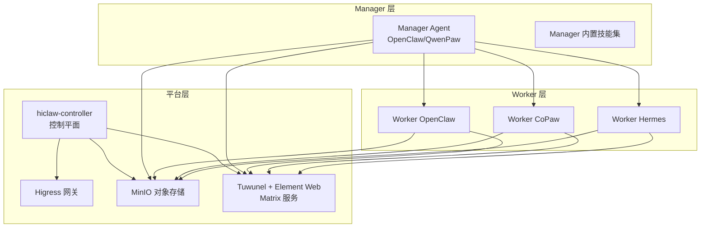
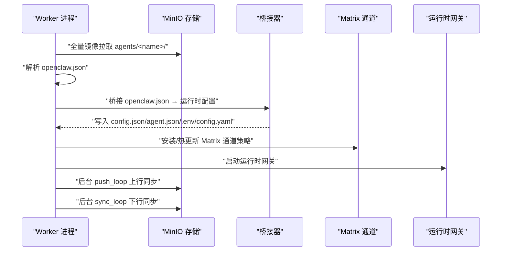
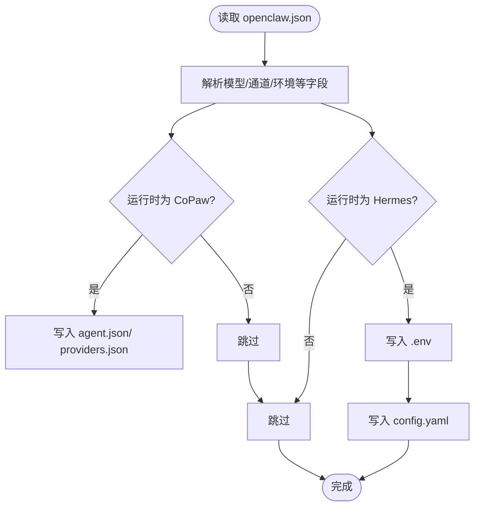
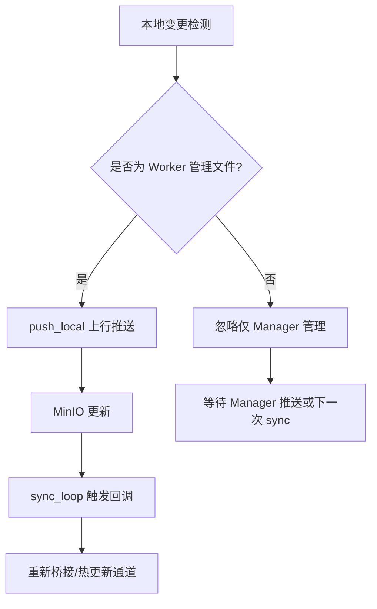
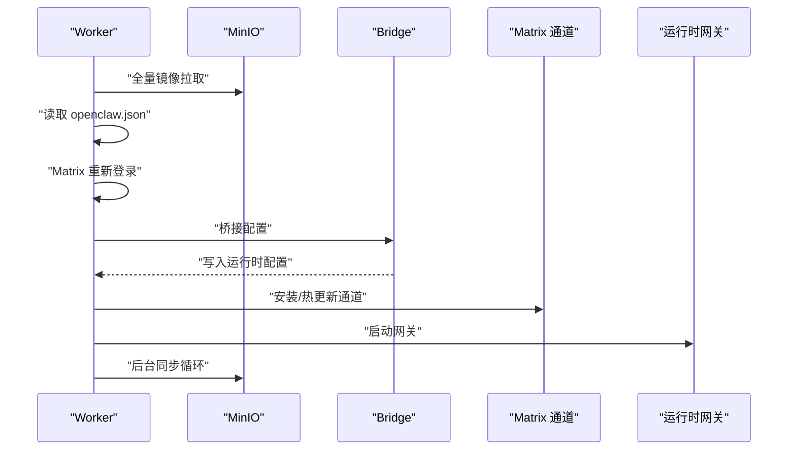
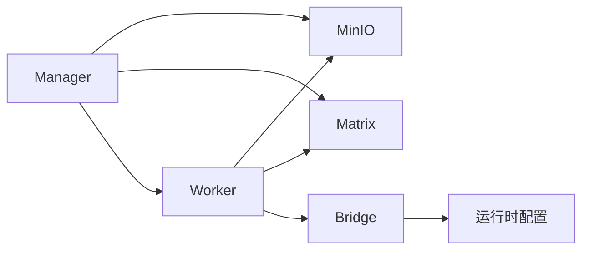

# 技能开发指南

<cite>
**本文引用的文件**
- [README.md](file://README.md)
- [docs/development.md](file://docs/development.md)
- [docs/quickstart.md](file://docs/quickstart.md)
- [copaw/README.md](file://copaw/README.md)
- [hermes/README.md](file://hermes/README.md)
- [copaw/src/copaw_worker/worker.py](file://copaw/src/copaw_worker/worker.py)
- [hermes/src/hermes_worker/worker.py](file://hermes/src/hermes_worker/worker.py)
- [copaw/src/copaw_worker/bridge.py](file://copaw/src/copaw_worker/bridge.py)
- [hermes/src/hermes_worker/bridge.py](file://hermes/src/hermes_worker/bridge.py)
- [copaw/src/copaw_worker/sync.py](file://copaw/src/copaw_worker/sync.py)
- [manager/agent/copaw-manager-agent/AGENTS.md](file://manager/agent/copaw-manager-agent/AGENTS.md)
- [manager/agent/skills/worker-management/references/create-worker.md](file://manager/agent/skills/worker-management/references/create-worker.md)
- [manager/agent/skills/project-management/references/create-project.md](file://manager/agent/skills/project-management/references/create-project.md)
- [manager/agent/skills/human-management/references/create-human.md](file://manager/agent/skills/human-management/references/create-human.md)
- [migrate/skill/SKILL.md](file://migrate/skill/SKILL.md)
</cite>

## 目录
1. [简介](#简介)
2. [项目结构](#项目结构)
3. [核心组件](#核心组件)
4. [架构总览](#架构总览)
5. [详细组件分析](#详细组件分析)
6. [依赖关系分析](#依赖关系分析)
7. [性能考虑](#性能考虑)
8. [故障排查指南](#故障排查指南)
9. [结论](#结论)
10. [附录](#附录)

## 简介
本指南面向在 HiClaw 平台上进行“技能”开发的工程师与技术作者，系统阐述技能开发的标准流程、结构规范、文件组织与命名约定；覆盖开发环境搭建、依赖管理与测试工具；总结最佳实践（代码规范、错误处理、性能优化）；说明与不同运行时（CoPaw、Hermes）的兼容性与适配要点；提供调试技巧与故障排查方法，并给出从“Hello World”到复杂功能的完整开发示例，以及技能开发模板与脚手架工具的使用方式。

## 项目结构
HiClaw 是一个基于 Manager-Workers 架构的多智能体协作平台，支持多种 Worker 运行时（OpenClaw、CoPaw、Hermes），并通过 Matrix 协议进行消息通信，使用 MinIO 提供共享文件系统，Higress 作为统一网关与凭证管理中心。

- 核心目录概览
  - copaw：CoPaw Worker 运行时实现与桥接逻辑
  - hermes：Hermes Worker 运行时实现与桥接逻辑
  - manager：Manager Agent 及其内置技能与工作区规则
  - hiclaw-controller：Kubernetes 控制平面与资源编排
  - docs：官方文档与开发指南
  - tests：集成测试套件
  - install：安装与卸载脚本
  - shared/lib：通用脚本与工具

图表来源
- [README.md:305-333](file://README.md#L305-L333)

章节来源
- [README.md:13-33](file://README.md#L13-L33)
- [README.md:290-333](file://README.md#L290-L333)

## 核心组件
- Manager Agent：负责任务编排、权限控制、Worker 生命周期管理、与人类管理员协作等
- Worker（CoPaw/Hermes/OpenClaw）：执行具体任务，通过 Matrix 与 Manager/人类交互，使用 MinIO 共享状态与文件
- 文件同步（FileSync）：基于 mc（MinIO 客户端）的双向同步机制，确保 Worker 与 Manager 的配置、技能、共享数据一致
- 桥接（Bridge）：将 HiClaw 统一配置 openclaw.json 转换为各运行时所需的本地配置（CoPaw 的 agent.json/providers.json、Hermes 的 .env/config.yaml）
- 网关（Higress）：统一路由、凭证管理与 MCP 服务器托管

章节来源
- [copaw/src/copaw_worker/worker.py:44-177](file://copaw/src/copaw_worker/worker.py#L44-L177)
- [hermes/src/hermes_worker/worker.py:44-165](file://hermes/src/hermes_worker/worker.py#L44-L165)
- [copaw/src/copaw_worker/bridge.py:155-211](file://copaw/src/copaw_worker/bridge.py#L155-L211)
- [hermes/src/hermes_worker/bridge.py:400-427](file://hermes/src/hermes_worker/bridge.py#L400-L427)
- [copaw/src/copaw_worker/sync.py:114-138](file://copaw/src/copaw_worker/sync.py#L114-L138)

## 架构总览
下图展示 Worker 启动与运行的关键流程：从 MinIO 拉取配置与技能，桥接生成运行时配置，启动通道与网关，进入后台同步循环。

图表来源
- [copaw/src/copaw_worker/worker.py:65-177](file://copaw/src/copaw_worker/worker.py#L65-L177)
- [hermes/src/hermes_worker/worker.py:86-165](file://hermes/src/hermes_worker/worker.py#L86-L165)
- [copaw/src/copaw_worker/bridge.py:155-211](file://copaw/src/copaw_worker/bridge.py#L155-L211)
- [hermes/src/hermes_worker/bridge.py:400-427](file://hermes/src/hermes_worker/bridge.py#L400-L427)
- [copaw/src/copaw_worker/sync.py:466-485](file://copaw/src/copaw_worker/sync.py#L466-L485)

## 详细组件分析

### 技能结构规范与命名约定
- 技能目录结构
  - 每个技能位于 skills/<技能名>/ 目录下
  - 必须包含 SKILL.md，且必须包含 YAML front matter（name、description）
  - 可选 references/（参考文档）、scripts/（可执行脚本）、其他资源
- 命名约定
  - 技能名：小写、连字符或下划线分隔，避免空格
  - 文件名：SKILL.md、脚本以 .sh 结尾并赋予可执行权限
  - front matter：必须包含 name、description 字段
- 内容规范
  - SKILL.md 需自包含 API 说明、调用示例、注意事项
  - 脚本需具备幂等性与错误处理，输出清晰的日志与状态

章节来源
- [docs/development.md:373-404](file://docs/development.md#L373-L404)

### 文件组织与最小化模板
- 最小技能模板建议
  - SKILL.md：front matter + 标题 + 功能描述 + 使用场景 + API 参考 + 示例
  - scripts/：提供可复用的 Bash/Python 脚本，遵循参数化与错误码约定
  - references/：补充背景知识、外部链接、变更记录
- 推荐的 front matter 结构
  - name：技能唯一标识
  - description：简短用途说明
- 脚本执行约定
  - 返回非零退出码表示失败
  - 输出结构化日志（如 JSON），便于上层解析
  - 处理边界条件与异常输入

章节来源
- [docs/development.md:373-404](file://docs/development.md#L373-L404)

### 开发环境搭建与依赖管理
- 本地开发
  - 使用 Makefile 构建镜像与运行测试
  - 支持多架构构建与推送（buildx）
  - 支持区域镜像仓库加速（多区域镜像）
- 依赖与工具
  - Docker：容器化构建与运行
  - mc（MinIO Client）：文件同步与调试
  - jq：JSON 处理与测试辅助
  - Node.js（OpenClaw 基础镜像已内置）：部分技能需要
- 测试工具
  - 集成测试套件：tests/ 下的多轮验证
  - replay-task：向 Manager 发送任务进行快速验证
  - 日志导出：scripts/export-debug-log.py 导出聊天与会话日志

章节来源
- [docs/development.md:16-91](file://docs/development.md#L16-L91)
- [docs/development.md:165-194](file://docs/development.md#L165-L194)
- [docs/development.md:301-343](file://docs/development.md#L301-L343)

### 与不同运行时的兼容性与适配
- 运行时选择
  - OpenClaw：适合通用任务编排与工具调用
  - CoPaw：轻量级 Python 运行时，适合快速任务与浏览器自动化
  - Hermes：自主编码 Agent，带终端沙箱与持久记忆
- 兼容性要点
  - 所有运行时均通过 openclaw.json 与 MinIO 交互
  - 桥接器负责将 openclaw.json 映射为各运行时的本地配置
  - Matrix 通道策略在各运行时保持一致（提及策略、加密、群聊/私聊拆分）

章节来源
- [README.md:290-304](file://README.md#L290-L304)
- [copaw/README.md:1-18](file://copaw/README.md#L1-L18)
- [hermes/README.md:19-38](file://hermes/README.md#L19-L38)

### 桥接器（Bridge）与配置映射
- CoPaw 桥接
  - 将 openclaw.json 映射为 config.json、agent.json、providers.json
  - 支持“创建阶段”模板填充与“重启阶段”字段覆盖
  - Matrix 通道策略通过控制器字段精确覆盖
- Hermes 桥接
  - 将 openclaw.json 映射为 .env 与 config.yaml
  - 环境变量与 YAML 块按“桥接拥有”与“用户保留”策略分离
  - 自动设置平台矩阵启用、回复模式、日志级别等

图表来源
- [copaw/src/copaw_worker/bridge.py:155-211](file://copaw/src/copaw_worker/bridge.py#L155-L211)
- [hermes/src/hermes_worker/bridge.py:400-427](file://hermes/src/hermes_worker/bridge.py#L400-L427)

章节来源
- [copaw/src/copaw_worker/bridge.py:420-512](file://copaw/src/copaw_worker/bridge.py#L420-L512)
- [hermes/src/hermes_worker/bridge.py:131-207](file://hermes/src/hermes_worker/bridge.py#L131-L207)

### 文件同步（FileSync）与冲突合并
- 设计原则
  - 写入方负责立即推送到 MinIO，并通过 Matrix 提醒对方拉取
  - Manager 管理的文件（openclaw.json、skills/、shared/）只允许下行拉取
  - Worker 管理的文件（AGENTS.md、SOUL.md、sessions/、memory/）只允许上行推送
- 冲突处理
  - openclaw.json 采用“远程权威基线 + 本地优先字段保留”的合并策略
  - Matrix 访问令牌（accessToken）在本地优先，防止重启后密钥失效
- 同步循环
  - push_loop：周期性扫描本地变更并上行推送
  - sync_loop：周期性拉取 Manager 管理的文件，触发回调以重新桥接或热更新通道

图表来源
- [copaw/src/copaw_worker/sync.py:466-485](file://copaw/src/copaw_worker/sync.py#L466-L485)
- [copaw/src/copaw_worker/sync.py:487-604](file://copaw/src/copaw_worker/sync.py#L487-L604)
- [copaw/src/copaw_worker/sync.py:50-97](file://copaw/src/copaw_worker/sync.py#L50-L97)

章节来源
- [copaw/src/copaw_worker/sync.py:114-138](file://copaw/src/copaw_worker/sync.py#L114-L138)
- [copaw/src/copaw_worker/sync.py:346-463](file://copaw/src/copaw_worker/sync.py#L346-L463)

### Worker 启动流程（CoPaw/Hermes）
- CoPaw Worker
  - 初始化 mc、全量镜像拉取、读取 openclaw.json
  - 重新登录 Matrix（刷新设备 ID 与访问令牌）
  - 桥接配置至 .copaw 工作区、复制 mcporter 配置
  - 安装 Matrix 通道、同步技能、启动后台同步
  - 启动 Uvicorn 服务与 CoPaw 运行时
- Hermes Worker
  - 初始化 mc、全量镜像拉取、读取 openclaw.json
  - 重新登录 Matrix（刷新设备 ID 与访问令牌）
  - 桥接配置至 HERMES_HOME（.env + config.yaml）
  - 同步技能、复制 mcporter 配置、启动后台同步
  - 启动 Hermes 网关

图表来源
- [copaw/src/copaw_worker/worker.py:65-205](file://copaw/src/copaw_worker/worker.py#L65-L205)
- [hermes/src/hermes_worker/worker.py:86-192](file://hermes/src/hermes_worker/worker.py#L86-L192)

章节来源
- [copaw/src/copaw_worker/worker.py:210-287](file://copaw/src/copaw_worker/worker.py#L210-L287)
- [hermes/src/hermes_worker/worker.py:197-277](file://hermes/src/hermes_worker/worker.py#L197-L277)

### 最佳实践
- 代码规范
  - Shell 脚本：使用 ${VAR} 语法、函数化复用逻辑
  - 配置模板：使用 ${VAR} 占位符，注释解释每个字段
  - 技能文档：必须包含 YAML front matter（name + description），自包含 API 参考与示例
  - 测试：每项验收用例独立文件，共享断言与辅助函数
- 错误处理
  - 所有脚本返回非零退出码表示失败
  - 对外接口（HTTP/Matrix）返回明确错误信息与状态码
  - 文件同步失败时记录详细日志并重试
- 性能优化
  - 使用 push_loop 的增量推送减少网络开销
  - 合理设置 sync_interval 与 push_check_interval
  - 避免在技能中执行阻塞操作，必要时异步化

章节来源
- [docs/development.md:405-411](file://docs/development.md#L405-L411)
- [docs/development.md:412-474](file://docs/development.md#L412-L474)

### 调试技巧与故障排查
- 查看日志
  - Manager Agent：/var/log/hiclaw/manager-agent.log、manager-agent-error.log
  - 控制器（embedded）：/var/log/hiclaw/higress-console.log、/var/log/hiclaw/tuwunel.log
  - Replay 会话日志：logs/replay/replay-{timestamp}.log
- 检查状态
  - Higress 控制台：消费者、路由、AI 提供商列表
  - MinIO：mc 列表与内容校验
  - OpenClaw 技能加载：openclaw skills list --json
- 常见问题
  - git clone 超时：在 DOCKER_BUILD_ARGS 中设置 http_proxy/no_proxy
  - Node.js 版本不匹配：确保使用 Node.js 22（Manager 使用 openclaw-base，Worker 从构建阶段复制）
  - 缺少 gateway 配置：openclaw.json 必须包含 gateway.mode=local 与 gateway.auth.token
  - Skills 未加载：确认 SKILL.md 包含 YAML front matter

章节来源
- [docs/development.md:412-497](file://docs/development.md#L412-L497)

### 开发示例

#### 示例一：Hello World 技能
- 目标：实现一个最简单的“问候”技能，支持参数化名称
- 步骤
  - 在 skills/hello-world/ 创建 SKILL.md，包含 front matter 与使用说明
  - 在 scripts/ 创建 hello.sh，接收参数并输出问候语
  - 在 references/ 添加使用示例与注意事项
  - 在 Manager 中通过 Matrix @mention 调用该技能
- 验证
  - 观察 Worker 回复与日志
  - 使用 replay-task 快速验证

章节来源
- [docs/quickstart.md:144-172](file://docs/quickstart.md#L144-L172)

#### 示例二：文件同步与结果回传
- 目标：编写一个生成 README 的技能，将结果写入 shared/tasks/{task-id}/result.md
- 步骤
  - 在 SKILL.md 中定义输入参数（项目名、描述、使用说明）
  - 在 scripts/ 创建生成脚本，写入 MinIO 共享目录
  - 通过 Manager 分配任务，观察 Worker 在 MinIO 中写入结果
- 验证
  - 检查 MinIO 中是否存在 result.md
  - 在 Room 中查看 Worker 的进度与通知

章节来源
- [docs/quickstart.md:148-171](file://docs/quickstart.md#L148-L171)

#### 示例三：跨 Worker 协作
- 目标：Alice 与 Bob 协作完成前端与后端任务
- 步骤
  - 通过 Manager 创建多个 Worker
  - 在项目房间中分配任务，使用 shared/ 进行协作
  - 观察 Worker 间通过 MinIO 协同与 Room 通知
- 验证
  - 检查各自任务目录与结果
  - 确认 Room 中的进度与协作记录

章节来源
- [docs/quickstart.md:226-253](file://docs/quickstart.md#L226-L253)

#### 示例四：迁移现有 OpenClaw 技能
- 目标：将 Standalone OpenClaw 的技能迁移到 HiClaw Worker
- 步骤
  - 使用 migrate/skill 分析工具依赖
  - 适配 AGENTS.md 与 SOUL.md，去除与 HiClaw 内置重复的规则
  - 生成 ZIP 包并导入到 HiClaw
- 验证
  - Worker 启动后加载迁移后的技能
  - 通过 Matrix 验证技能可用性

章节来源
- [migrate/skill/SKILL.md:60-181](file://migrate/skill/SKILL.md#L60-L181)

### 脚手架工具与模板
- 安装与运行
  - 使用 Makefile 提供的 build、test、install 目标
  - 一键安装 Manager 与 Worker，支持自定义环境变量
- CLI 工具
  - hiclaw：在容器内提供资源创建、查询、更新等命令
  - replay-task：快速发送任务到 Manager 进行验证
- 脚手架建议
  - 为新技能创建标准化目录结构
  - 在 SKILL.md 中提供 front matter 与 API 参考
  - 在 scripts/ 中提供可复用的 Bash/Python 脚本

章节来源
- [docs/development.md:93-163](file://docs/development.md#L93-L163)
- [docs/quickstart.md:53-59](file://docs/quickstart.md#L53-L59)

## 依赖关系分析
- 组件耦合
  - Worker 与 MinIO：强耦合（双向同步）
  - Worker 与 Matrix：强耦合（消息通道）
  - Worker 与运行时网关：强耦合（桥接配置）
  - Manager 与 Worker：弱耦合（通过 Room 与 MinIO 协作）
- 外部依赖
  - Docker：容器化运行
  - MinIO Client（mc）：文件同步
  - Node.js（OpenClaw 基础镜像）：运行时基础
  - Higress：统一网关与路由

图表来源
- [copaw/src/copaw_worker/worker.py:65-177](file://copaw/src/copaw_worker/worker.py#L65-L177)
- [hermes/src/hermes_worker/worker.py:86-165](file://hermes/src/hermes_worker/worker.py#L86-L165)
- [copaw/src/copaw_worker/bridge.py:155-211](file://copaw/src/copaw_worker/bridge.py#L155-L211)
- [hermes/src/hermes_worker/bridge.py:400-427](file://hermes/src/hermes_worker/bridge.py#L400-L427)

章节来源
- [README.md:290-304](file://README.md#L290-L304)

## 性能考虑
- 同步策略
  - push_loop 采用“变更触发 + 内容对比”，避免重复上传
  - sync_loop 采用“周期性拉取 + 变更回调”，保证一致性
- 资源占用
  - CoPaw/Hermes Worker 容器体积较小，适合多实例部署
  - MinIO 作为共享存储，建议合理设置对象生命周期与压缩策略
- 网络与路由
  - Higress 统一路由，减少直连暴露面
  - 端口映射与容器内端口重映射需保持一致，避免请求失败

## 故障排查指南
- 常见症状与修复
  - git clone 挂起：在构建参数中设置 http_proxy/no_proxy
  - Node.js 版本不匹配：确保使用 Node.js 22
  - 缺少 gateway 配置：添加 gateway.mode=local 与 gateway.auth.token
  - Skills 未加载：确认 SKILL.md front matter 正确
- 日志与诊断
  - Manager Agent 日志、控制器日志、Higress/Tuwunel 日志
  - MinIO 状态检查与 mc 列表
  - Replay 会话日志导出与 AI 辅助分析

章节来源
- [docs/development.md:483-497](file://docs/development.md#L483-L497)

## 结论
HiClaw 提供了统一的技能开发框架与运行时抽象，通过 openclaw.json 与桥接器实现跨运行时的一致行为，借助 MinIO 与 Matrix 实现状态与消息的协同。遵循本文的结构规范、开发流程与最佳实践，可以高效地构建从简单到复杂的技能，并在多运行时环境中稳定运行。

## 附录
- 快速开始
  - 一键安装 Manager 与 Worker
  - 通过 Element Web 登录并发起任务
- Worker 管理
  - 通过 Manager 创建、删除、升级 Worker
  - 通过 Matrix 与 Worker 协作
- 项目管理
  - 创建项目房间、分解任务、跟踪进度

章节来源
- [docs/quickstart.md:13-77](file://docs/quickstart.md#L13-L77)
- [manager/agent/skills/worker-management/references/create-worker.md:1-125](file://manager/agent/skills/worker-management/references/create-worker.md#L1-L125)
- [manager/agent/skills/project-management/references/create-project.md:1-75](file://manager/agent/skills/project-management/references/create-project.md#L1-L75)
- [manager/agent/copaw-manager-agent/AGENTS.md:149-249](file://manager/agent/copaw-manager-agent/AGENTS.md#L149-L249)
- [manager/agent/skills/human-management/references/create-human.md:1-84](file://manager/agent/skills/human-management/references/create-human.md#L1-L84)