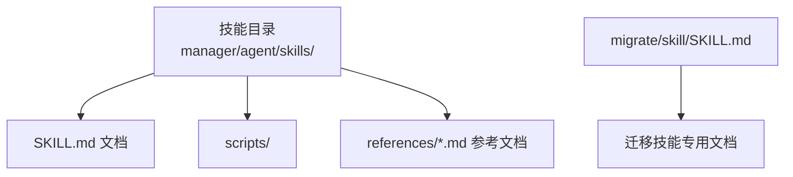
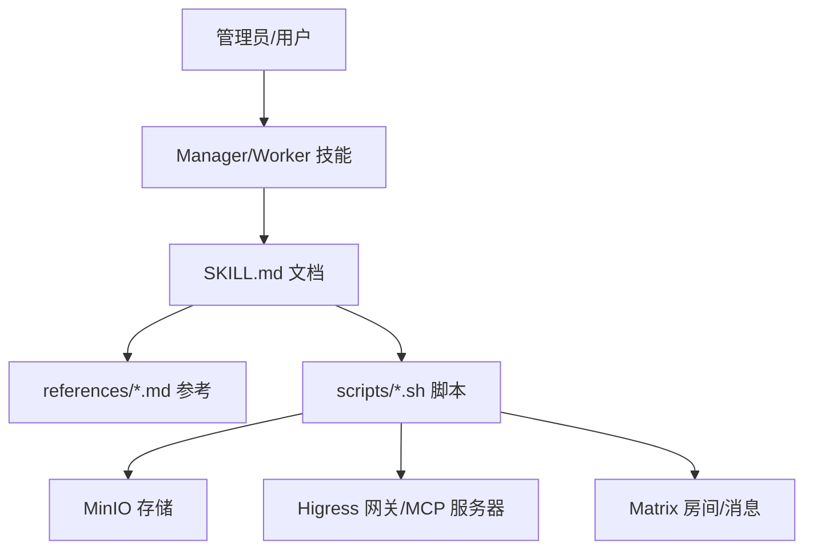
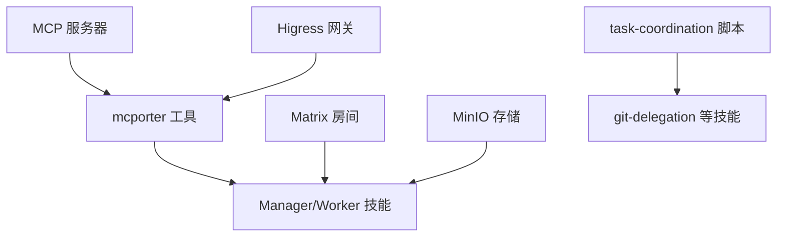

# SKILL.md 文件格式

<cite>
**本文档引用的文件**
- [manager/agent/skills/project-management/SKILL.md](file://manager/agent/skills/project-management/SKILL.md)
- [manager/agent/skills/human-management/SKILL.md](file://manager/agent/skills/human-management/SKILL.md)
- [manager/agent/skills/mcporter/SKILL.md](file://manager/agent/skills/mcporter/SKILL.md)
- [migrate/skill/SKILL.md](file://migrate/skill/SKILL.md)
- [manager/agent/skills/task-management/SKILL.md](file://manager/agent/skills/task-management/SKILL.md)
- [manager/agent/skills/team-management/SKILL.md](file://manager/agent/skills/team-management/SKILL.md)
- [manager/agent/skills/worker-management/SKILL.md](file://manager/agent/skills/worker-management/SKILL.md)
- [manager/agent/skills/matrix-server-management/SKILL.md](file://manager/agent/skills/matrix-server-management/SKILL.md)
- [manager/agent/skills/mcp-server-management/SKILL.md](file://manager/agent/skills/mcp-server-management/SKILL.md)
- [manager/agent/skills/hiclaw-find-worker/SKILL.md](file://manager/agent/skills/hiclaw-find-worker/SKILL.md)
- [manager/agent/skills/git-delegation-management/SKILL.md](file://manager/agent/skills/git-delegation-management/SKILL.md)
- [manager/agent/skills/model-switch/SKILL.md](file://manager/agent/skills/model-switch/SKILL.md)
- [manager/agent/skills/service-publishing/SKILL.md](file://manager/agent/skills/service-publishing/SKILL.md)
- [manager/agent/skills/file-sync-management/SKILL.md](file://manager/agent/skills/file-sync-management/SKILL.md)
- [manager/agent/skills/task-coordination/SKILL.md](file://manager/agent/skills/task-coordination/SKILL.md)
</cite>

## 目录
1. [引言](#引言)
2. [项目结构](#项目结构)
3. [核心组件](#核心组件)
4. [架构总览](#架构总览)
5. [详细组件分析](#详细组件分析)
6. [依赖分析](#依赖分析)
7. [性能考虑](#性能考虑)
8. [故障排查指南](#故障排查指南)
9. [结论](#结论)
10. [附录：字段参考与示例](#附录字段参考与示例)

## 引言
本文件系统性阐述 SKILL.md 的标准格式与使用规范，面向开发者与运维人员，帮助正确编写技能描述文件。SKILL.md 是 HiClaw 多智能体体系中“技能”的标准化文档载体，用于：
- 描述技能用途与边界（何时使用）
- 定义技能元数据（名称、描述等）
- 提供操作参考与最佳实践
- 指明脚本调用、参数与返回约定
- 规范任务协作与共享资源访问流程

本仓库中的大量 SKILL.md 文件展示了不同技能的典型写法与结构，本文将基于这些真实示例进行归纳总结。

## 项目结构
SKILL.md 分布于各技能目录下，通常位于：
- manager/agent/skills/<skill-name>/SKILL.md
- manager/agent/<agent-type>-agent/skills/<skill-name>/SKILL.md
- migrate/skill/SKILL.md

这些文件共同构成技能知识库，支撑 Manager 与 Worker 的自动化协作。

**章节来源**
- [manager/agent/skills/project-management/SKILL.md:1-37](file://manager/agent/skills/project-management/SKILL.md#L1-L37)
- [migrate/skill/SKILL.md:1-238](file://migrate/skill/SKILL.md#L1-L238)

## 核心组件
SKILL.md 的核心由以下部分组成（按出现频率与重要性排序）：

- 元数据区（YAML 前言段）
  - 必需字段：name、description
  - 其他常见字段：version、author、tags 等（视具体技能而定）
- 标题与简介
  - 使用一级标题概述技能主题
  - 简要说明适用场景与职责边界
- 操作参考（Operation Reference）
  - 列出常见情境与对应参考文档或脚本
- 关键流程与注意事项（Gotchas）
  - 高频错误与规避要点
- 脚本与命令示例
  - 展示关键命令行调用与参数
- 参考资料链接
  - references/*.md 文件路径，便于深入学习

**章节来源**
- [manager/agent/skills/project-management/SKILL.md:1-37](file://manager/agent/skills/project-management/SKILL.md#L1-L37)
- [manager/agent/skills/human-management/SKILL.md:1-45](file://manager/agent/skills/human-management/SKILL.md#L1-L45)
- [manager/agent/skills/mcporter/SKILL.md:1-41](file://manager/agent/skills/mcporter/SKILL.md#L1-L41)
- [migrate/skill/SKILL.md:1-238](file://migrate/skill/SKILL.md#L1-L238)

## 架构总览
SKILL.md 在系统中的作用是“契约与说明书”：
- 作为技能的“接口定义”，明确输入（触发条件）、处理逻辑（步骤）、输出（结果与通知）
- 作为“知识入口”，串联 references 文档与 scripts 脚本
- 作为“协作协议”，通过 .processing 标记、MinIO 同步等机制保障多主体并发安全

**图表来源**
- [manager/agent/skills/task-coordination/SKILL.md:1-153](file://manager/agent/skills/task-coordination/SKILL.md#L1-L153)
- [manager/agent/skills/service-publishing/SKILL.md:1-92](file://manager/agent/skills/service-publishing/SKILL.md#L1-L92)
- [manager/agent/skills/mcp-server-management/SKILL.md:1-33](file://manager/agent/skills/mcp-server-management/SKILL.md#L1-L33)

## 详细组件分析

### 组件一：元数据区（YAML 前言段）
- 位置：文档开头以三连字符分隔的前言段
- 必填项：name、description
- 建议项：version、author、tags、license 等
- 示例参考：
  - [manager/agent/skills/project-management/SKILL.md:1-4](file://manager/agent/skills/project-management/SKILL.md#L1-L4)
  - [manager/agent/skills/mcporter/SKILL.md:1-4](file://manager/agent/skills/mcporter/SKILL.md#L1-L4)
  - [migrate/skill/SKILL.md:1-4](file://migrate/skill/SKILL.md#L1-L4)

**章节来源**
- [manager/agent/skills/project-management/SKILL.md:1-4](file://manager/agent/skills/project-management/SKILL.md#L1-L4)
- [manager/agent/skills/mcporter/SKILL.md:1-4](file://manager/agent/skills/mcporter/SKILL.md#L1-L4)
- [migrate/skill/SKILL.md:1-4](file://migrate/skill/SKILL.md#L1-L4)

### 组件二：标题与简介
- 一级标题：技能名称
- 简介：说明技能职责、适用场景与边界
- 示例参考：
  - [manager/agent/skills/project-management/SKILL.md:6-8](file://manager/agent/skills/project-management/SKILL.md#L6-L8)
  - [manager/agent/skills/human-management/SKILL.md:6-8](file://manager/agent/skills/human-management/SKILL.md#L6-L8)
  - [manager/agent/skills/mcporter/SKILL.md:6-8](file://manager/agent/skills/mcporter/SKILL.md#L6-L8)

**章节来源**
- [manager/agent/skills/project-management/SKILL.md:6-8](file://manager/agent/skills/project-management/SKILL.md#L6-L8)
- [manager/agent/skills/human-management/SKILL.md:6-8](file://manager/agent/skills/human-management/SKILL.md#L6-L8)
- [manager/agent/skills/mcporter/SKILL.md:6-8](file://manager/agent/skills/mcporter/SKILL.md#L6-L8)

### 组件三：Gotchas（注意事项与陷阱）
- 以列表形式列出高频错误、边界条件与规避策略
- 示例参考：
  - [manager/agent/skills/task-management/SKILL.md:8-17](file://manager/agent/skills/task-management/SKILL.md#L8-L17)
  - [manager/agent/skills/team-management/SKILL.md:27-37](file://manager/agent/skills/team-management/SKILL.md#L27-L37)
  - [manager/agent/skills/worker-management/SKILL.md:33-43](file://manager/agent/skills/worker-management/SKILL.md#L33-L43)

**章节来源**
- [manager/agent/skills/task-management/SKILL.md:8-17](file://manager/agent/skills/task-management/SKILL.md#L8-L17)
- [manager/agent/skills/team-management/SKILL.md:27-37](file://manager/agent/skills/team-management/SKILL.md#L27-L37)
- [manager/agent/skills/worker-management/SKILL.md:33-43](file://manager/agent/skills/worker-management/SKILL.md#L33-L43)

### 组件四：操作参考（Operation Reference）
- 使用表格列出“管理员想要做什么”到“应阅读的参考文档/脚本”的映射
- 示例参考：
  - [manager/agent/skills/task-management/SKILL.md:20-29](file://manager/agent/skills/task-management/SKILL.md#L20-L29)
  - [manager/agent/skills/team-management/SKILL.md:39-47](file://manager/agent/skills/team-management/SKILL.md#L39-L47)
  - [manager/agent/skills/worker-management/SKILL.md:45-58](file://manager/agent/skills/worker-management/SKILL.md#L45-L58)

**章节来源**
- [manager/agent/skills/task-management/SKILL.md:20-29](file://manager/agent/skills/task-management/SKILL.md#L20-L29)
- [manager/agent/skills/team-management/SKILL.md:39-47](file://manager/agent/skills/team-management/SKILL.md#L39-L47)
- [manager/agent/skills/worker-management/SKILL.md:45-58](file://manager/agent/skills/worker-management/SKILL.md#L45-L58)

### 组件五：脚本与命令示例
- 使用代码块展示关键命令行调用
- 参数说明与示例参考：
  - [manager/agent/skills/human-management/SKILL.md:20-25](file://manager/agent/skills/human-management/SKILL.md#L20-L25)
  - [manager/agent/skills/mcporter/SKILL.md:12-24](file://manager/agent/skills/mcporter/SKILL.md#L12-L24)
  - [manager/agent/skills/model-switch/SKILL.md:12-21](file://manager/agent/skills/model-switch/SKILL.md#L12-L21)

**章节来源**
- [manager/agent/skills/human-management/SKILL.md:20-25](file://manager/agent/skills/human-management/SKILL.md#L20-L25)
- [manager/agent/skills/mcporter/SKILL.md:12-24](file://manager/agent/skills/mcporter/SKILL.md#L12-L24)
- [manager/agent/skills/model-switch/SKILL.md:12-21](file://manager/agent/skills/model-switch/SKILL.md#L12-L21)

### 组件六：依赖声明与集成点
- 外部依赖：MCP 服务器、Higress 网关、Matrix、MinIO
- 内部依赖：脚本间协作（如 task-coordination 与 git-delegation）
- 示例参考：
  - [manager/agent/skills/mcp-server-management/SKILL.md:8-8](file://manager/agent/skills/mcp-server-management/SKILL.md#L8-L8)
  - [manager/agent/skills/matrix-server-management/SKILL.md:8-8](file://manager/agent/skills/matrix-server-management/SKILL.md#L8-L8)
  - [manager/agent/skills/git-delegation-management/SKILL.md:46-95](file://manager/agent/skills/git-delegation-management/SKILL.md#L46-L95)
  - [manager/agent/skills/task-coordination/SKILL.md:136-142](file://manager/agent/skills/task-coordination/SKILL.md#L136-L142)

**章节来源**
- [manager/agent/skills/mcp-server-management/SKILL.md:8-8](file://manager/agent/skills/mcp-server-management/SKILL.md#L8-L8)
- [manager/agent/skills/matrix-server-management/SKILL.md:8-8](file://manager/agent/skills/matrix-server-management/SKILL.md#L8-L8)
- [manager/agent/skills/git-delegation-management/SKILL.md:46-95](file://manager/agent/skills/git-delegation-management/SKILL.md#L46-L95)
- [manager/agent/skills/task-coordination/SKILL.md:136-142](file://manager/agent/skills/task-coordination/SKILL.md#L136-L142)

### 组件七：执行参数与返回值规范
- 命令行参数：使用表格或代码块给出参数名、含义与示例
- 返回值与状态码：脚本退出码、输出关键字（如 RESTART_REQUIRED、ERROR: MODEL_NOT_REACHABLE）
- 示例参考：
  - [manager/agent/skills/model-switch/SKILL.md:39-51](file://manager/agent/skills/model-switch/SKILL.md#L39-L51)
  - [manager/agent/skills/service-publishing/SKILL.md:23-40](file://manager/agent/skills/service-publishing/SKILL.md#L23-L40)
  - [manager/agent/skills/git-delegation-management/SKILL.md:97-111](file://manager/agent/skills/git-delegation-management/SKILL.md#L97-L111)

**章节来源**
- [manager/agent/skills/model-switch/SKILL.md:39-51](file://manager/agent/skills/model-switch/SKILL.md#L39-L51)
- [manager/agent/skills/service-publishing/SKILL.md:23-40](file://manager/agent/skills/service-publishing/SKILL.md#L23-L40)
- [manager/agent/skills/git-delegation-management/SKILL.md:97-111](file://manager/agent/skills/git-delegation-management/SKILL.md#L97-L111)

### 组件八：任务协作与共享资源
- 协作机制：.processing 标记文件、MinIO 同步、房间 @mentions
- 示例参考：
  - [manager/agent/skills/task-coordination/SKILL.md:32-95](file://manager/agent/skills/task-coordination/SKILL.md#L32-L95)
  - [manager/agent/skills/file-sync-management/SKILL.md:8-13](file://manager/agent/skills/file-sync-management/SKILL.md#L8-L13)
  - [manager/agent/skills/git-delegation-management/SKILL.md:48-95](file://manager/agent/skills/git-delegation-management/SKILL.md#L48-L95)

**章节来源**
- [manager/agent/skills/task-coordination/SKILL.md:32-95](file://manager/agent/skills/task-coordination/SKILL.md#L32-L95)
- [manager/agent/skills/file-sync-management/SKILL.md:8-13](file://manager/agent/skills/file-sync-management/SKILL.md#L8-L13)
- [manager/agent/skills/git-delegation-management/SKILL.md:48-95](file://manager/agent/skills/git-delegation-management/SKILL.md#L48-L95)

## 依赖分析
- 外部系统依赖
  - Higress 网关：MCP 工具调用、模型路由
  - MCP 服务器：外部 API 工具集合
  - Matrix：消息与房间通信
  - MinIO：共享文件存储与同步
- 内部系统依赖
  - 脚本间协作：task-coordination 为 git-delegation 等提供并发控制
  - 参考文档：references/*.md 提供深度说明与流程图

**图表来源**
- [manager/agent/skills/mcp-server-management/SKILL.md:8-8](file://manager/agent/skills/mcp-server-management/SKILL.md#L8-L8)
- [manager/agent/skills/mcporter/SKILL.md:8-8](file://manager/agent/skills/mcporter/SKILL.md#L8-L8)
- [manager/agent/skills/task-coordination/SKILL.md:136-142](file://manager/agent/skills/task-coordination/SKILL.md#L136-L142)

**章节来源**
- [manager/agent/skills/mcp-server-management/SKILL.md:8-8](file://manager/agent/skills/mcp-server-management/SKILL.md#L8-L8)
- [manager/agent/skills/mcporter/SKILL.md:8-8](file://manager/agent/skills/mcporter/SKILL.md#L8-L8)
- [manager/agent/skills/task-coordination/SKILL.md:136-142](file://manager/agent/skills/task-coordination/SKILL.md#L136-L142)

## 性能考虑
- 并发控制：使用 .processing 标记避免冲突，减少重试与回滚成本
- 存储同步：优先使用 mc mirror/cp，避免本地状态不一致导致的重复拉取
- 网络调用：MCP 工具调用前先验证连通性，减少失败重试
- 日志与可观测性：在关键步骤输出状态信息，便于定位问题

## 故障排查指南
- 模型切换失败
  - 现象：脚本输出 ERROR: MODEL_NOT_REACHABLE
  - 排查：确认默认 AI Provider 是否支持该模型；是否已配置新 Provider 与路由
  - 参考：[manager/agent/skills/model-switch/SKILL.md:39-51](file://manager/agent/skills/model-switch/SKILL.md#L39-L51)
- Git 操作失败
  - 现象：git-failed: 错误信息
  - 排查：合并冲突、认证失败、分支分歧等
  - 参考：[manager/agent/skills/git-delegation-management/SKILL.md:137-149](file://manager/agent/skills/git-delegation-management/SKILL.md#L137-L149)
- 文件同步不一致
  - 现象：Worker 无法看到最新文件
  - 排查：是否先从 MinIO 拉取、是否推送后通知 Worker 同步
  - 参考：[manager/agent/skills/file-sync-management/SKILL.md:8-13](file://manager/agent/skills/file-sync-management/SKILL.md#L8-L13)

**章节来源**
- [manager/agent/skills/model-switch/SKILL.md:39-51](file://manager/agent/skills/model-switch/SKILL.md#L39-L51)
- [manager/agent/skills/git-delegation-management/SKILL.md:137-149](file://manager/agent/skills/git-delegation-management/SKILL.md#L137-L149)
- [manager/agent/skills/file-sync-management/SKILL.md:8-13](file://manager/agent/skills/file-sync-management/SKILL.md#L8-L13)

## 结论
SKILL.md 是 HiClaw 技能体系的“契约与说明书”。遵循本文档的结构与规范，可以确保技能描述清晰、可执行、可维护，并与系统内其他组件（脚本、网关、存储、房间）形成稳定协作关系。

## 附录：字段参考与示例

### 字段参考表
- 必填字段
  - name：技能唯一标识（小写、短横线分隔）
  - description：技能用途与边界说明
- 建议字段
  - version：版本号（语义化版本）
  - author：作者/团队
  - tags：标签（如 mcp、matrix、git）
  - license：许可证
- 元数据示例参考
  - [manager/agent/skills/project-management/SKILL.md:1-4](file://manager/agent/skills/project-management/SKILL.md#L1-L4)
  - [manager/agent/skills/mcporter/SKILL.md:1-4](file://manager/agent/skills/mcporter/SKILL.md#L1-L4)

**章节来源**
- [manager/agent/skills/project-management/SKILL.md:1-4](file://manager/agent/skills/project-management/SKILL.md#L1-L4)
- [manager/agent/skills/mcporter/SKILL.md:1-4](file://manager/agent/skills/mcporter/SKILL.md#L1-L4)

### 依赖声明语法
- 外部依赖
  - MCP 服务器：通过 mcporter 调用工具
  - Higress 网关：模型路由与工具代理
  - Matrix：房间与 @mentions
  - MinIO：共享存储与同步
- 内部依赖
  - 脚本协作：task-coordination 为 git-delegation 提供并发控制
- 示例参考
  - [manager/agent/skills/mcp-server-management/SKILL.md:8-8](file://manager/agent/skills/mcp-server-management/SKILL.md#L8-L8)
  - [manager/agent/skills/git-delegation-management/SKILL.md:46-95](file://manager/agent/skills/git-delegation-management/SKILL.md#L46-L95)
  - [manager/agent/skills/task-coordination/SKILL.md:136-142](file://manager/agent/skills/task-coordination/SKILL.md#L136-L142)

**章节来源**
- [manager/agent/skills/mcp-server-management/SKILL.md:8-8](file://manager/agent/skills/mcp-server-management/SKILL.md#L8-L8)
- [manager/agent/skills/git-delegation-management/SKILL.md:46-95](file://manager/agent/skills/git-delegation-management/SKILL.md#L46-L95)
- [manager/agent/skills/task-coordination/SKILL.md:136-142](file://manager/agent/skills/task-coordination/SKILL.md#L136-L142)

### 执行参数与返回值规范
- 命令行参数
  - 使用表格或代码块给出参数名、含义与示例
  - 示例参考：
    - [manager/agent/skills/model-switch/SKILL.md:12-21](file://manager/agent/skills/model-switch/SKILL.md#L12-L21)
    - [manager/agent/skills/service-publishing/SKILL.md:23-40](file://manager/agent/skills/service-publishing/SKILL.md#L23-L40)
- 返回值与状态码
  - 退出码：0 表示成功，非 0 表示失败
  - 输出关键字：如 RESTART_REQUIRED、ERROR: MODEL_NOT_REACHABLE
  - 示例参考：
    - [manager/agent/skills/model-switch/SKILL.md:29-33](file://manager/agent/skills/model-switch/SKILL.md#L29-L33)
    - [manager/agent/skills/model-switch/SKILL.md:41-51](file://manager/agent/skills/model-switch/SKILL.md#L41-L51)

**章节来源**
- [manager/agent/skills/model-switch/SKILL.md:12-21](file://manager/agent/skills/model-switch/SKILL.md#L12-L21)
- [manager/agent/skills/model-switch/SKILL.md:29-33](file://manager/agent/skills/model-switch/SKILL.md#L29-L33)
- [manager/agent/skills/model-switch/SKILL.md:41-51](file://manager/agent/skills/model-switch/SKILL.md#L41-L51)
- [manager/agent/skills/service-publishing/SKILL.md:23-40](file://manager/agent/skills/service-publishing/SKILL.md#L23-L40)

### 任务协作与共享资源
- 协作机制
  - .processing 标记文件：防止并发修改
  - MinIO 同步：mc mirror/cp
  - Matrix @mentions：触发与通知
- 示例参考
  - [manager/agent/skills/task-coordination/SKILL.md:32-95](file://manager/agent/skills/task-coordination/SKILL.md#L32-L95)
  - [manager/agent/skills/file-sync-management/SKILL.md:8-13](file://manager/agent/skills/file-sync-management/SKILL.md#L8-L13)

**章节来源**
- [manager/agent/skills/task-coordination/SKILL.md:32-95](file://manager/agent/skills/task-coordination/SKILL.md#L32-L95)
- [manager/agent/skills/file-sync-management/SKILL.md:8-13](file://manager/agent/skills/file-sync-management/SKILL.md#L8-L13)

### 完整字段参考与示例索引
- 元数据区
  - [manager/agent/skills/project-management/SKILL.md:1-4](file://manager/agent/skills/project-management/SKILL.md#L1-L4)
  - [manager/agent/skills/mcporter/SKILL.md:1-4](file://manager/agent/skills/mcporter/SKILL.md#L1-L4)
- Gotchas
  - [manager/agent/skills/task-management/SKILL.md:8-17](file://manager/agent/skills/task-management/SKILL.md#L8-L17)
  - [manager/agent/skills/worker-management/SKILL.md:33-43](file://manager/agent/skills/worker-management/SKILL.md#L33-L43)
- 操作参考
  - [manager/agent/skills/task-management/SKILL.md:20-29](file://manager/agent/skills/task-management/SKILL.md#L20-L29)
  - [manager/agent/skills/team-management/SKILL.md:39-47](file://manager/agent/skills/team-management/SKILL.md#L39-L47)
- 脚本与命令示例
  - [manager/agent/skills/human-management/SKILL.md:20-25](file://manager/agent/skills/human-management/SKILL.md#L20-L25)
  - [manager/agent/skills/mcporter/SKILL.md:12-24](file://manager/agent/skills/mcporter/SKILL.md#L12-L24)
- 依赖与集成
  - [manager/agent/skills/mcp-server-management/SKILL.md:8-8](file://manager/agent/skills/mcp-server-management/SKILL.md#L8-L8)
  - [manager/agent/skills/git-delegation-management/SKILL.md:46-95](file://manager/agent/skills/git-delegation-management/SKILL.md#L46-L95)
- 返回值与状态码
  - [manager/agent/skills/model-switch/SKILL.md:29-33](file://manager/agent/skills/model-switch/SKILL.md#L29-L33)
  - [manager/agent/skills/git-delegation-management/SKILL.md:97-111](file://manager/agent/skills/git-delegation-management/SKILL.md#L97-L111)

**章节来源**
- [manager/agent/skills/project-management/SKILL.md:1-4](file://manager/agent/skills/project-management/SKILL.md#L1-L4)
- [manager/agent/skills/mcporter/SKILL.md:1-4](file://manager/agent/skills/mcporter/SKILL.md#L1-L4)
- [manager/agent/skills/task-management/SKILL.md:8-17](file://manager/agent/skills/task-management/SKILL.md#L8-L17)
- [manager/agent/skills/worker-management/SKILL.md:33-43](file://manager/agent/skills/worker-management/SKILL.md#L33-L43)
- [manager/agent/skills/task-management/SKILL.md:20-29](file://manager/agent/skills/task-management/SKILL.md#L20-L29)
- [manager/agent/skills/team-management/SKILL.md:39-47](file://manager/agent/skills/team-management/SKILL.md#L39-L47)
- [manager/agent/skills/human-management/SKILL.md:20-25](file://manager/agent/skills/human-management/SKILL.md#L20-L25)
- [manager/agent/skills/mcporter/SKILL.md:12-24](file://manager/agent/skills/mcporter/SKILL.md#L12-L24)
- [manager/agent/skills/mcp-server-management/SKILL.md:8-8](file://manager/agent/skills/mcp-server-management/SKILL.md#L8-L8)
- [manager/agent/skills/git-delegation-management/SKILL.md:46-95](file://manager/agent/skills/git-delegation-management/SKILL.md#L46-L95)
- [manager/agent/skills/model-switch/SKILL.md:29-33](file://manager/agent/skills/model-switch/SKILL.md#L29-L33)
- [manager/agent/skills/git-delegation-management/SKILL.md:97-111](file://manager/agent/skills/git-delegation-management/SKILL.md#L97-L111)