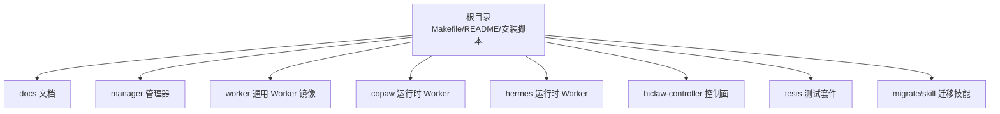
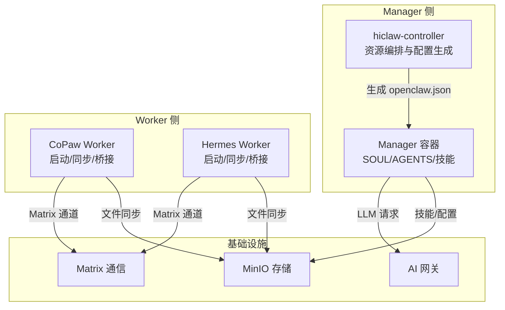
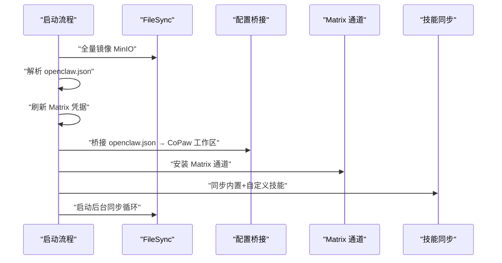
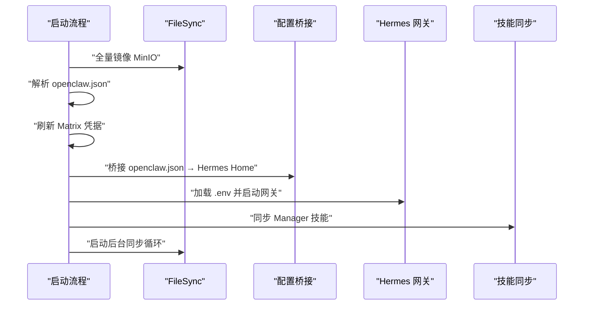
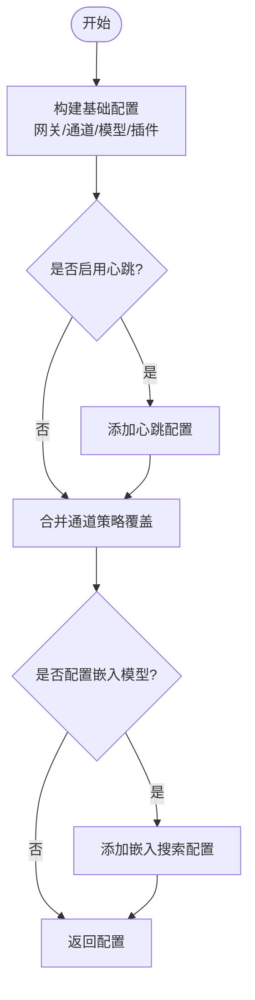
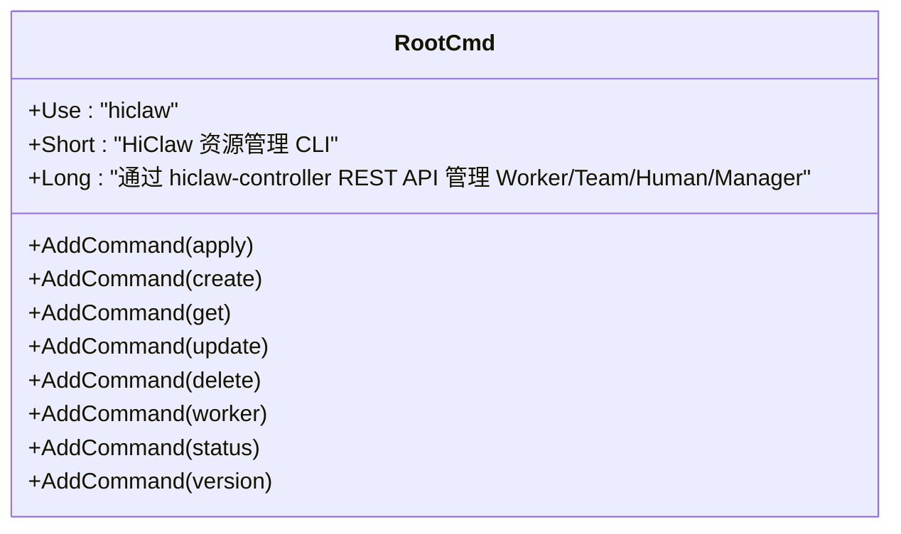
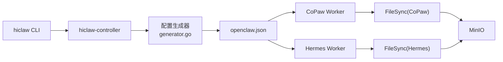

# 技能开发最佳实践

<cite>
**本文档引用的文件**
- [README.md](file://README.md)
- [docs/development.md](file://docs/development.md)
- [Makefile](file://Makefile)
- [tests/README.md](file://tests/README.md)
- [manager/agent/skills/project-management/SKILL.md](file://manager/agent/skills/project-management/SKILL.md)
- [manager/agent/skills/task-management/SKILL.md](file://manager/agent/skills/task-management/SKILL.md)
- [copaw/src/copaw_worker/worker.py](file://copaw/src/copaw_worker/worker.py)
- [copaw/src/copaw_worker/config.py](file://copaw/src/copaw_worker/config.py)
- [copaw/src/copaw_worker/sync.py](file://copaw/src/copaw_worker/sync.py)
- [hermes/src/hermes_worker/worker.py](file://hermes/src/hermes_worker/worker.py)
- [hermes/src/hermes_worker/config.py](file://hermes/src/hermes_worker/config.py)
- [hermes/src/hermes_worker/sync.py](file://hermes/src/hermes_worker/sync.py)
- [hiclaw-controller/cmd/hiclaw/main.go](file://hiclaw-controller/cmd/hiclaw/main.go)
- [hiclaw-controller/internal/agentconfig/generator.go](file://hiclaw-controller/internal/agentconfig/generator.go)
- [migrate/skill/SKILL.md](file://migrate/skill/SKILL.md)
</cite>

## 目录
1. [简介](#简介)
2. [项目结构](#项目结构)
3. [核心组件](#核心组件)
4. [架构总览](#架构总览)
5. [详细组件分析](#详细组件分析)
6. [依赖关系分析](#依赖关系分析)
7. [性能考量](#性能考量)
8. [故障排查指南](#故障排查指南)
9. [结论](#结论)
10. [附录](#附录)

## 简介
本文件面向 HiClaw 技能开发者，系统阐述技能设计的模块化原则、可重用性设计、性能优化、测试策略与打包分发流程。HiClaw 是一个基于 Manager-Workers 架构的多智能体协作运行时平台，通过 Matrix 协议与 MinIO 共享存储实现状态与技能的统一管理。技能以 Markdown + 脚本的形式存放在 MinIO 中，由 Worker 按需拉取与执行。

## 项目结构
HiClaw 仓库采用按职责分层的组织方式：
- 根目录：顶层构建与测试脚本（Makefile）、安装脚本与文档入口
- docs：用户与开发者文档
- manager：Manager 容器与内置技能集合
- worker：通用 Worker 基础镜像
- copaw/hermes：不同运行时的 Worker 实现
- hiclaw-controller：Kubernetes 控制面与资源管理 CLI
- tests：集成测试套件
- migrate/skill：迁移工具技能，指导从 OpenClaw 迁移到 HiClaw

**图表来源**
- [Makefile:1-120](file://Makefile#L1-L120)
- [README.md:130-240](file://README.md#L130-L240)

**章节来源**
- [README.md:130-240](file://README.md#L130-L240)
- [Makefile:1-120](file://Makefile#L1-L120)

## 核心组件
- Worker 生命周期与启动流程：CoPaw 与 Hermes Worker 在启动时完成 MinIO 同步、配置桥接、通道安装与技能同步，并启动后台同步循环
- 文件同步机制：统一通过 mc CLI 与 MinIO 交互，区分“管理者托管”与“Worker 自管”两类文件，确保冲突最小化
- 配置生成器：控制器根据运行环境生成 openclaw.json，统一矩阵通道、网关与模型配置
- CLI 工具：hiclaw CLI 提供资源管理命令，便于声明式地创建/更新/删除 Worker、团队与人类实体

**章节来源**
- [copaw/src/copaw_worker/worker.py:45-178](file://copaw/src/copaw_worker/worker.py#L45-L178)
- [hermes/src/hermes_worker/worker.py:86-166](file://hermes/src/hermes_worker/worker.py#L86-L166)
- [copaw/src/copaw_worker/sync.py:225-463](file://copaw/src/copaw_worker/sync.py#L225-L463)
- [hermes/src/hermes_worker/sync.py:222-457](file://hermes/src/hermes_worker/sync.py#L222-L457)
- [hiclaw-controller/internal/agentconfig/generator.go:25-203](file://hiclaw-controller/internal/agentconfig/generator.go#L25-L203)
- [hiclaw-controller/cmd/hiclaw/main.go:9-35](file://hiclaw-controller/cmd/hiclaw/main.go#L9-L35)

## 架构总览
HiClaw 的技能体系围绕“状态即代码”的思想：所有配置与技能均以文件形式存储在 MinIO，Worker 通过文件同步与桥接逻辑自动适配运行时差异。Manager 侧负责资源编排与配置下发，Worker 侧负责执行与状态回传。

**图表来源**
- [hiclaw-controller/internal/agentconfig/generator.go:25-203](file://hiclaw-controller/internal/agentconfig/generator.go#L25-L203)
- [copaw/src/copaw_worker/worker.py:65-178](file://copaw/src/copaw_worker/worker.py#L65-L178)
- [hermes/src/hermes_worker/worker.py:86-166](file://hermes/src/hermes_worker/worker.py#L86-L166)

## 详细组件分析

### 组件一：CoPaw Worker 启动与同步
- 启动阶段：校验 mc 可用性、全量镜像 MinIO 内容、解析 openclaw.json、刷新 Matrix 凭据、桥接配置至 CoPaw 工作区、安装 Matrix 通道、同步技能、启动后台同步循环
- 同步策略：本地变更触发推送；远程变更触发回调，必要时热更新通道白名单
- 技能管理：先播种 CoPaw 内置技能，再叠加 Manager 推送的自定义技能，清理过期技能

**图表来源**
- [copaw/src/copaw_worker/worker.py:65-178](file://copaw/src/copaw_worker/worker.py#L65-L178)
- [copaw/src/copaw_worker/sync.py:225-463](file://copaw/src/copaw_worker/sync.py#L225-L463)

**章节来源**
- [copaw/src/copaw_worker/worker.py:45-178](file://copaw/src/copaw_worker/worker.py#L45-L178)
- [copaw/src/copaw_worker/config.py:7-29](file://copaw/src/copaw_worker/config.py#L7-L29)
- [copaw/src/copaw_worker/sync.py:225-463](file://copaw/src/copaw_worker/sync.py#L225-L463)

### 组件二：Hermes Worker 启动与同步
- 启动阶段：校验 mc 可用性、全量镜像 MinIO、解析 openclaw.json、刷新 Matrix 凭据、桥接配置至 Hermes Home、同步技能、复制 mcporter 配置、启动后台同步循环
- 热更新：当 openclaw.json 变更时，重新桥接并加载 .env，必要时重启网关以应用不可热更新项
- 技能管理：镜像 Manager 推送的技能目录，清理不再发布的技能

**图表来源**
- [hermes/src/hermes_worker/worker.py:86-166](file://hermes/src/hermes_worker/worker.py#L86-L166)
- [hermes/src/hermes_worker/sync.py:222-457](file://hermes/src/hermes_worker/sync.py#L222-L457)

**章节来源**
- [hermes/src/hermes_worker/worker.py:44-166](file://hermes/src/hermes_worker/worker.py#L44-L166)
- [hermes/src/hermes_worker/config.py:7-40](file://hermes/src/hermes_worker/config.py#L7-L40)
- [hermes/src/hermes_worker/sync.py:222-457](file://hermes/src/hermes_worker/sync.py#L222-L457)

### 组件三：配置生成器（控制器）
- 生成 openclaw.json：统一网关端口、绑定地址、控制台安全策略、矩阵通道策略、模型提供者与别名映射、心跳与嵌入搜索等
- 通道策略覆盖：支持在请求中注入额外的群组/私聊允许列表，或移除特定主体
- 模型规格：内置多种模型的上下文窗口、最大输出、视觉与推理能力参数

**图表来源**
- [hiclaw-controller/internal/agentconfig/generator.go:25-203](file://hiclaw-controller/internal/agentconfig/generator.go#L25-L203)
- [hiclaw-controller/internal/agentconfig/generator.go:267-345](file://hiclaw-controller/internal/agentconfig/generator.go#L267-L345)
- [hiclaw-controller/internal/agentconfig/generator.go:448-492](file://hiclaw-controller/internal/agentconfig/generator.go#L448-L492)

**章节来源**
- [hiclaw-controller/internal/agentconfig/generator.go:9-493](file://hiclaw-controller/internal/agentconfig/generator.go#L9-L493)

### 组件四：CLI 工具（hiclaw）
- 提供资源管理命令：apply、create、get、update、delete、worker、status、version
- 支持通过环境变量设置控制器基地址与认证令牌

**图表来源**
- [hiclaw-controller/cmd/hiclaw/main.go:9-35](file://hiclaw-controller/cmd/hiclaw/main.go#L9-L35)

**章节来源**
- [hiclaw-controller/cmd/hiclaw/main.go:9-35](file://hiclaw-controller/cmd/hiclaw/main.go#L9-L35)

### 技能设计与可重用性
- 模块化原则：每个技能独立存放于 skills/<name>/ 目录，包含 SKILL.md 与脚本/参考材料，遵循“单一职责”
- 参数化设计：通过 openclaw.json 的模型与通道配置实现参数化；技能内部通过环境变量与共享文件进行参数传递
- 配置灵活性：配置生成器支持模型别名映射、通道策略覆盖、嵌入搜索等灵活组合
- 向后兼容性：文件同步采用“字段级合并”，避免因单字段变更导致的全量重启

**章节来源**
- [manager/agent/skills/project-management/SKILL.md:1-37](file://manager/agent/skills/project-management/SKILL.md#L1-L37)
- [manager/agent/skills/task-management/SKILL.md:1-30](file://manager/agent/skills/task-management/SKILL.md#L1-L30)
- [hiclaw-controller/internal/agentconfig/generator.go:448-492](file://hiclaw-controller/internal/agentconfig/generator.go#L448-L492)
- [copaw/src/copaw_worker/sync.py:50-97](file://copaw/src/copaw_worker/sync.py#L50-L97)

## 依赖关系分析
- Worker 与控制器：Worker 通过 MinIO 读取控制器下发的 openclaw.json 与技能；控制器通过 CLI 与 REST API 管理资源
- 文件同步：CoPaw 与 Hermes Worker 使用相同的 mc CLI 抽象，但对“内层/外层”文件同步与衍生文件的排除规则略有差异
- 配置生成：控制器生成的 openclaw.json 与 Worker 侧的字段合并策略共同保证配置一致性

**图表来源**
- [hiclaw-controller/cmd/hiclaw/main.go:9-35](file://hiclaw-controller/cmd/hiclaw/main.go#L9-L35)
- [hiclaw-controller/internal/agentconfig/generator.go:25-203](file://hiclaw-controller/internal/agentconfig/generator.go#L25-L203)
- [copaw/src/copaw_worker/sync.py:114-138](file://copaw/src/copaw_worker/sync.py#L114-L138)
- [hermes/src/hermes_worker/sync.py:114-144](file://hermes/src/hermes_worker/sync.py#L114-L144)

**章节来源**
- [hiclaw-controller/cmd/hiclaw/main.go:9-35](file://hiclaw-controller/cmd/hiclaw/main.go#L9-L35)
- [hiclaw-controller/internal/agentconfig/generator.go:25-203](file://hiclaw-controller/internal/agentconfig/generator.go#L25-L203)
- [copaw/src/copaw_worker/sync.py:114-138](file://copaw/src/copaw_worker/sync.py#L114-L138)
- [hermes/src/hermes_worker/sync.py:114-144](file://hermes/src/hermes_worker/sync.py#L114-L144)

## 性能考量
- 执行效率
  - 使用“内层→外层”同步策略，减少不必要的磁盘写入与网络传输
  - 仅扫描自上次推送以来修改过的文件，降低推送开销
- 内存使用
  - Worker 启动时一次性镜像 MinIO 内容，后续采用增量同步，避免长时间占用内存
  - 对衍生文件（如 .env、config.yaml）进行排除，防止重复上传
- 并发处理
  - 同步循环与推送循环异步运行，互不阻塞
  - 配置变更时，仅对受影响的通道配置进行热更新，避免全量重启

**章节来源**
- [copaw/src/copaw_worker/sync.py:564-604](file://copaw/src/copaw_worker/sync.py#L564-L604)
- [hermes/src/hermes_worker/sync.py:563-601](file://hermes/src/hermes_worker/sync.py#L563-L601)
- [copaw/src/copaw_worker/worker.py:162-172](file://copaw/src/copaw_worker/worker.py#L162-L172)
- [hermes/src/hermes_worker/worker.py:155-162](file://hermes/src/hermes_worker/worker.py#L155-L162)

## 故障排查指南
- 日志定位
  - Manager 容器日志：查看 manager-agent.log、gateway 错误日志、OpenClaw 日志
  - 控制面日志：查看 hiclaw-controller 的基础设施日志
- 状态检查
  - 使用 hiclaw CLI 查询资源状态
  - 通过 MinIO 客户端验证文件存在性与内容
- 常见问题
  - Node.js 版本不满足要求：确保使用 Node.js 22 的镜像
  - 网络代理导致构建失败：在构建参数中传入代理
  - 技能未被加载：确认 SKILL.md 包含 YAML front matter

**章节来源**
- [docs/development.md:412-498](file://docs/development.md#L412-L498)
- [tests/README.md:74-87](file://tests/README.md#L74-L87)

## 结论
HiClaw 的技能开发应遵循“模块化、参数化、可重用、可维护”的原则。通过统一的文件同步与配置生成机制，技能可以在不同运行时之间保持一致的行为与体验。结合完善的测试与打包流程，可以显著提升技能的质量与交付效率。

## 附录

### 技能开发最佳实践清单
- 设计原则
  - 功能分解：将复杂任务拆分为多个小技能，每个技能聚焦单一职责
  - 接口设计：统一使用 SKILL.md 描述输入/输出与前置条件
  - 依赖管理：通过 openclaw.json 的模型与通道配置集中管理外部依赖
- 可重用性
  - 参数化：通过环境变量与共享文件实现跨场景复用
  - 配置灵活性：利用控制器的通道策略覆盖与模型别名映射
  - 向后兼容：遵循字段级合并策略，避免破坏性变更
- 性能优化
  - 仅推送变更文件，减少网络与磁盘 IO
  - 异步并发：合理安排同步与推送循环的间隔
  - 缓存与衍生文件排除：避免重复上传与冲突
- 测试策略
  - 单元测试：针对脚本逻辑与边界条件编写测试
  - 集成测试：通过 Matrix API 验证技能在真实会话中的行为
  - 端到端测试：模拟完整工作流，覆盖多 Worker 场景
- 打包与分发
  - 迁移工具：使用 migrate/skill 将现有 OpenClaw 设置迁移到 HiClaw
  - 版本管理：通过 Makefile 的版本与标签管理镜像版本
  - 依赖处理：在 Worker 基础镜像中预装常用工具，减少自定义镜像体积
  - 部署策略：通过 hiclaw CLI 与 Helm chart 实现声明式部署与升级

**章节来源**
- [migrate/skill/SKILL.md:60-238](file://migrate/skill/SKILL.md#L60-L238)
- [Makefile:1-120](file://Makefile#L1-L120)
- [tests/README.md:21-87](file://tests/README.md#L21-L87)