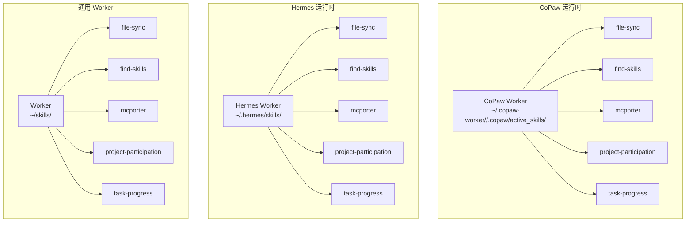
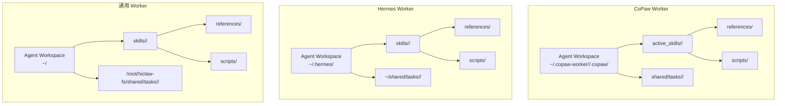
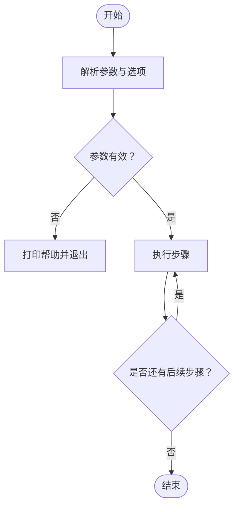
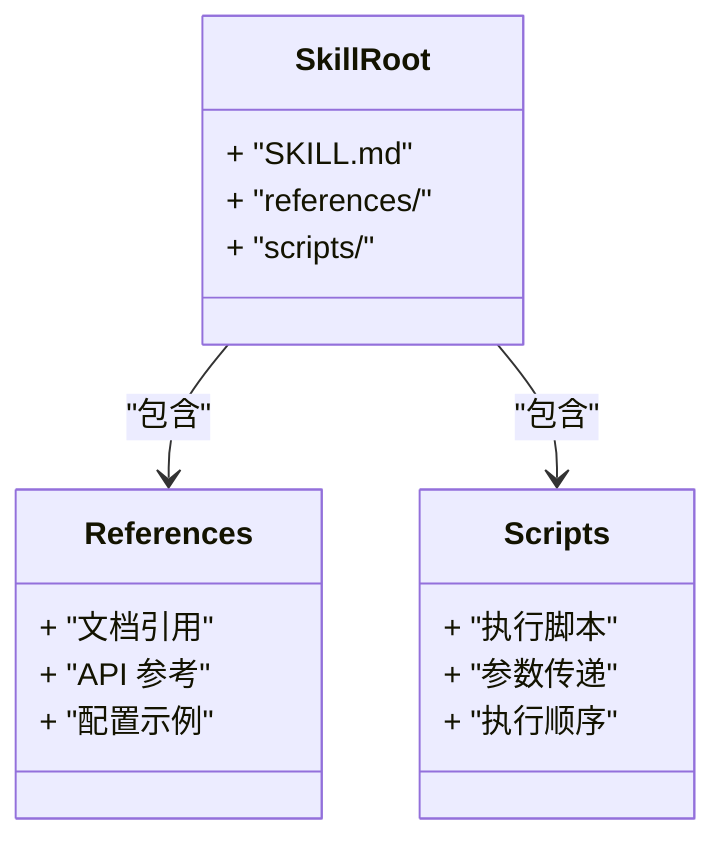
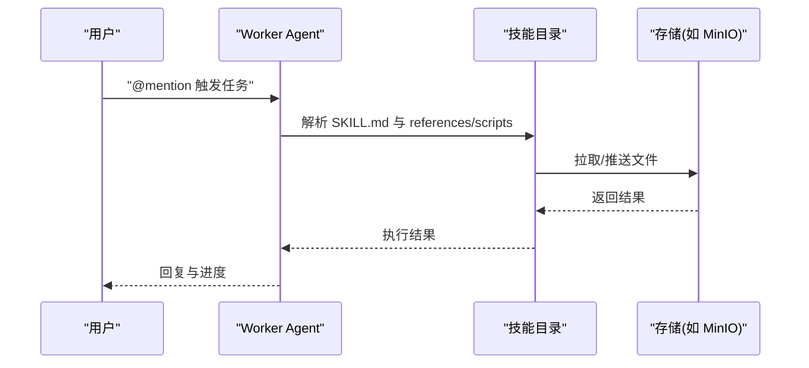
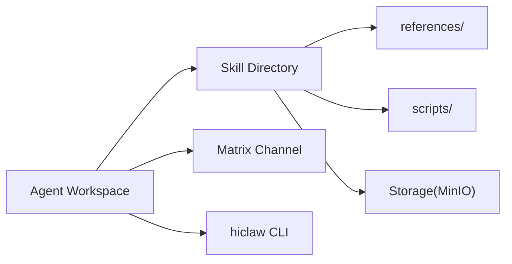

# 技能目录组织结构

<cite>
**本文档引用的文件**
- [manager/agent/copaw-worker-agent/AGENTS.md](file://manager/agent/copaw-worker-agent/AGENTS.md)
- [manager/agent/hermes-worker-agent/AGENTS.md](file://manager/agent/hermes-worker-agent/AGENTS.md)
- [manager/agent/worker-agent/AGENTS.md](file://manager/agent/worker-agent/AGENTS.md)
- [manager/agent/team-leader-agent/AGENTS.md](file://manager/agent/team-leader-agent/AGENTS.md)
- [manager/agent/copaw-manager-agent/AGENTS.md](file://manager/agent/copaw-manager-agent/AGENTS.md)
- [manager/agent/copaw-worker-agent/skills/file-sync/SKILL.md](file://manager/agent/copaw-worker-agent/skills/file-sync/SKILL.md)
- [manager/agent/copaw-worker-agent/skills/find-skills/SKILL.md](file://manager/agent/copaw-worker-agent/skills/find-skills/SKILL.md)
- [manager/agent/copaw-worker-agent/skills/mcporter/SKILL.md](file://manager/agent/copaw-worker-agent/skills/mcporter/SKILL.md)
- [manager/agent/copaw-worker-agent/skills/project-participation/SKILL.md](file://manager/agent/copaw-worker-agent/skills/project-participation/SKILL.md)
- [manager/agent/copaw-worker-agent/skills/task-progress/SKILL.md](file://manager/agent/copaw-worker-agent/skills/task-progress/SKILL.md)
- [manager/agent/hermes-worker-agent/skills/file-sync/SKILL.md](file://manager/agent/hermes-worker-agent/skills/file-sync/SKILL.md)
- [manager/agent/hermes-worker-agent/skills/find-skills/SKILL.md](file://manager/agent/hermes-worker-agent/skills/find-skills/SKILL.md)
- [manager/agent/hermes-worker-agent/skills/mcporter/SKILL.md](file://manager/agent/hermes-worker-agent/skills/mcporter/SKILL.md)
- [manager/agent/hermes-worker-agent/skills/project-participation/SKILL.md](file://manager/agent/hermes-worker-agent/skills/project-participation/SKILL.md)
- [manager/agent/hermes-worker-agent/skills/task-progress/SKILL.md](file://manager/agent/hermes-worker-agent/skills/task-progress/SKILL.md)
- [manager/agent/worker-agent/skills/file-sync/SKILL.md](file://manager/agent/worker-agent/skills/file-sync/SKILL.md)
- [manager/agent/worker-agent/skills/find-skills/SKILL.md](file://manager/agent/worker-agent/skills/find-skills/SKILL.md)
- [manager/agent/worker-agent/skills/mcporter/SKILL.md](file://manager/agent/worker-agent/skills/mcporter/SKILL.md)
- [manager/agent/worker-agent/skills/project-participation/SKILL.md](file://manager/agent/worker-agent/skills/project-participation/SKILL.md)
- [manager/agent/worker-agent/skills/task-progress/SKILL.md](file://manager/agent/worker-agent/skills/task-progress/SKILL.md)
</cite>

## 目录
1. [简介](#简介)
2. [项目结构](#项目结构)
3. [核心组件](#核心组件)
4. [架构总览](#架构总览)
5. [详细组件分析](#详细组件分析)
6. [依赖关系分析](#依赖关系分析)
7. [性能考量](#性能考量)
8. [故障排查指南](#故障排查指南)
9. [结论](#结论)
10. [附录](#附录)

## 简介
本文件系统化阐述 HiClaw 技能目录的标准层级结构与组织规范，覆盖以下主题：
- 根目录、技能子目录与子目录命名规范
- references 子目录的作用与内容组织（文档引用、API 参考、配置示例）
- scripts 子目录的组织方式（脚本命名规则、执行顺序、参数传递机制）
- 不同运行时（CoPaw、Hermes、通用 Worker）下的技能目录差异与兼容性
- 最佳实践与示例模板

## 项目结构
HiClaw 的技能目录主要分布在各 Agent 的工作空间中，典型路径如下：
- CoPaw Worker：`~/.copaw-worker/<worker-name>/.copaw/active_skills/<skill-name>/`
- Hermes Worker：`~/.hermes/skills/<skill-name>/`
- 通用 Worker：`~/skills/<skill-name>/`

每个技能目录均包含一个 SKILL.md 作为使用说明，并可按需包含 references 与 scripts 子目录。

**图表来源**
- [manager/agent/copaw-worker-agent/AGENTS.md:70-75](file://manager/agent/copaw-worker-agent/AGENTS.md#L70-L75)
- [manager/agent/hermes-worker-agent/AGENTS.md:82-87](file://manager/agent/hermes-worker-agent/AGENTS.md#L82-L87)
- [manager/agent/worker-agent/AGENTS.md:48-56](file://manager/agent/worker-agent/AGENTS.md#L48-L56)

**章节来源**
- [manager/agent/copaw-worker-agent/AGENTS.md:70-75](file://manager/agent/copaw-worker-agent/AGENTS.md#L70-L75)
- [manager/agent/hermes-worker-agent/AGENTS.md:82-87](file://manager/agent/hermes-worker-agent/AGENTS.md#L82-L87)
- [manager/agent/worker-agent/AGENTS.md:48-56](file://manager/agent/worker-agent/AGENTS.md#L48-L56)

## 核心组件
- 根目录与工作空间
  - CoPaw Worker：技能位于 `~/.copaw-worker/<worker-name>/.copaw/active_skills/`
  - Hermes Worker：技能位于 `~/.hermes/skills/`
  - 通用 Worker：技能位于 `~/skills/`
- 标准子目录
  - SKILL.md：技能使用说明与最佳实践
  - references：文档引用、API 参考、配置示例等静态资源
  - scripts：可执行脚本与工具函数，支持参数传递与执行顺序约定
- 共享与同步
  - 各运行时通过统一的存储镜像机制（如 MinIO）实现技能与任务文件的自动同步与推送

**章节来源**
- [manager/agent/copaw-worker-agent/AGENTS.md:70-75](file://manager/agent/copaw-worker-agent/AGENTS.md#L70-L75)
- [manager/agent/hermes-worker-agent/AGENTS.md:82-87](file://manager/agent/hermes-worker-agent/AGENTS.md#L82-L87)
- [manager/agent/worker-agent/AGENTS.md:48-56](file://manager/agent/worker-agent/AGENTS.md#L48-L56)

## 架构总览
技能目录在不同运行时中的职责与交互如下：

**图表来源**
- [manager/agent/copaw-worker-agent/AGENTS.md:70-75](file://manager/agent/copaw-worker-agent/AGENTS.md#L70-L75)
- [manager/agent/hermes-worker-agent/AGENTS.md:82-87](file://manager/agent/hermes-worker-agent/AGENTS.md#L82-L87)
- [manager/agent/worker-agent/AGENTS.md:48-56](file://manager/agent/worker-agent/AGENTS.md#L48-L56)

## 详细组件分析

### references 子目录
- 职责
  - 存放技能相关的文档引用、API 参考与配置示例，便于快速查阅与复用
- 组织建议
  - 使用清晰的文件命名（如 api-reference.md、setup-guide.md、template.yaml）
  - 对于多语言场景，可按语言分组（如 zh-cn/）
  - 保持与 SKILL.md 的内容互补，避免重复与冲突
- 运行时差异
  - CoPaw 与 Hermes 均支持 references；通用 Worker 的 references 由具体技能维护

**章节来源**
- [manager/agent/copaw-worker-agent/skills/file-sync/SKILL.md:33-39](file://manager/agent/copaw-worker-agent/skills/file-sync/SKILL.md#L33-L39)
- [manager/agent/hermes-worker-agent/skills/file-sync/SKILL.md:30-35](file://manager/agent/hermes-worker-agent/skills/file-sync/SKILL.md#L30-L35)
- [manager/agent/worker-agent/skills/file-sync/SKILL.md:120-128](file://manager/agent/worker-agent/skills/file-sync/SKILL.md#L120-L128)

### scripts 子目录
- 命名规则
  - 使用动宾短语或领域相关名称（如 push-shared.sh、hiclaw-find-skill.sh、setup-mcp-server.sh）
  - 避免使用保留关键字与特殊字符，确保跨平台兼容
- 执行顺序
  - 优先遵循技能文档中定义的步骤顺序（如先 discovery 再调用工具）
  - 对于多阶段流程，建议在 SKILL.md 中明确列出步骤与依赖
- 参数传递机制
  - 使用 POSIX 兼容的参数解析（如 key=value 或 JSON 字符串）
  - 在脚本内部进行参数校验与错误处理，必要时输出帮助信息
  - 对于复杂参数，建议通过环境变量或配置文件承载

**图表来源**
- [manager/agent/copaw-worker-agent/skills/find-skills/SKILL.md:32-36](file://manager/agent/copaw-worker-agent/skills/find-skills/SKILL.md#L32-L36)
- [manager/agent/hermes-worker-agent/skills/find-skills/SKILL.md:30-35](file://manager/agent/hermes-worker-agent/skills/find-skills/SKILL.md#L30-L35)
- [manager/agent/worker-agent/skills/find-skills/SKILL.md:25-30](file://manager/agent/worker-agent/skills/find-skills/SKILL.md#L25-L30)

**章节来源**
- [manager/agent/copaw-worker-agent/skills/find-skills/SKILL.md:32-36](file://manager/agent/copaw-worker-agent/skills/find-skills/SKILL.md#L32-L36)
- [manager/agent/hermes-worker-agent/skills/find-skills/SKILL.md:30-35](file://manager/agent/hermes-worker-agent/skills/find-skills/SKILL.md#L30-L35)
- [manager/agent/worker-agent/skills/find-skills/SKILL.md:25-30](file://manager/agent/worker-agent/skills/find-skills/SKILL.md#L25-L30)

### 技能目录标准层级结构
- 根目录
  - CoPaw：`~/.copaw-worker/<worker-name>/.copaw/active_skills/<skill>/`
  - Hermes：`~/.hermes/skills/<skill>/`
  - 通用：`~/skills/<skill>/`
- 子目录
  - references：文档与参考
  - scripts：脚本与工具
- 文件
  - SKILL.md：技能说明与使用指南

**图表来源**
- [manager/agent/copaw-worker-agent/skills/file-sync/SKILL.md:1-65](file://manager/agent/copaw-worker-agent/skills/file-sync/SKILL.md#L1-L65)
- [manager/agent/hermes-worker-agent/skills/file-sync/SKILL.md:1-65](file://manager/agent/hermes-worker-agent/skills/file-sync/SKILL.md#L1-L65)
- [manager/agent/worker-agent/skills/file-sync/SKILL.md:1-178](file://manager/agent/worker-agent/skills/file-sync/SKILL.md#L1-L178)

**章节来源**
- [manager/agent/copaw-worker-agent/skills/file-sync/SKILL.md:1-65](file://manager/agent/copaw-worker-agent/skills/file-sync/SKILL.md#L1-L65)
- [manager/agent/hermes-worker-agent/skills/file-sync/SKILL.md:1-65](file://manager/agent/hermes-worker-agent/skills/file-sync/SKILL.md#L1-L65)
- [manager/agent/worker-agent/skills/file-sync/SKILL.md:1-178](file://manager/agent/worker-agent/skills/file-sync/SKILL.md#L1-L178)

### 不同运行时（CoPaw、Hermes）差异与兼容性
- 工作空间布局
  - CoPaw Worker：使用 active_skills 目录管理技能，支持自动同步与热重载
  - Hermes Worker：使用 skills 目录，配置与环境变量由桥接机制维护
  - 通用 Worker：使用 skills 目录，共享文件路径与权限受平台限制
- 消息与通知
  - 三类运行时均要求通过 @mention 触发，且 @mention 必须使用完整 Matrix ID
- 同步与推送
  - CoPaw 与 Hermes 的 shared 目录自动镜像；通用 Worker 需显式推送至存储
- MCP 工具访问
  - 三类运行时均可通过 mcporter 访问 MCP 服务器工具，但配置文件路径与桥接机制不同

**图表来源**
- [manager/agent/copaw-worker-agent/AGENTS.md:101-107](file://manager/agent/copaw-worker-agent/AGENTS.md#L101-L107)
- [manager/agent/hermes-worker-agent/AGENTS.md:102-118](file://manager/agent/hermes-worker-agent/AGENTS.md#L102-L118)
- [manager/agent/worker-agent/AGENTS.md:71-82](file://manager/agent/worker-agent/AGENTS.md#L71-L82)

**章节来源**
- [manager/agent/copaw-worker-agent/AGENTS.md:101-107](file://manager/agent/copaw-worker-agent/AGENTS.md#L101-L107)
- [manager/agent/hermes-worker-agent/AGENTS.md:102-118](file://manager/agent/hermes-worker-agent/AGENTS.md#L102-L118)
- [manager/agent/worker-agent/AGENTS.md:71-82](file://manager/agent/worker-agent/AGENTS.md#L71-L82)

## 依赖关系分析
- 组件耦合
  - 技能目录与 Agent 工作空间强耦合，SKILL.md 与 references/scripts 共同构成技能使用闭环
- 外部依赖
  - 存储服务（MinIO）、消息通道（Matrix）、控制器（hiclaw CLI）
- 兼容性
  - 不同运行时对同一技能的接口一致，但工作空间与同步机制存在差异

**图表来源**
- [manager/agent/copaw-manager-agent/AGENTS.md:103-112](file://manager/agent/copaw-manager-agent/AGENTS.md#L103-L112)
- [manager/agent/team-leader-agent/AGENTS.md:26-39](file://manager/agent/team-leader-agent/AGENTS.md#L26-L39)

**章节来源**
- [manager/agent/copaw-manager-agent/AGENTS.md:103-112](file://manager/agent/copaw-manager-agent/AGENTS.md#L103-L112)
- [manager/agent/team-leader-agent/AGENTS.md:26-39](file://manager/agent/team-leader-agent/AGENTS.md#L26-L39)

## 性能考量
- 自动同步与热重载
  - CoPaw 支持配置变更的热重载与定时同步，减少人工干预
- 推送策略
  - 采用增量推送与排除规则（如排除 spec.md 与 base/），降低带宽与存储压力
- 并发与批处理
  - 将多个检查或操作合并到心跳轮询中，减少模型调用频率

## 故障排查指南
- @mention 触发失败
  - 确认 @mention 使用完整 Matrix ID，且仅在当前消息段落生效
- 同步异常
  - 检查存储前缀与凭据，确保使用统一的 mc 命令与排除规则
- MCP 工具调用失败
  - 确认 mcporter 配置文件存在且权限正确，必要时重新拉取配置

**章节来源**
- [manager/agent/copaw-worker-agent/AGENTS.md:35-44](file://manager/agent/copaw-worker-agent/AGENTS.md#L35-L44)
- [manager/agent/hermes-worker-agent/AGENTS.md:46-57](file://manager/agent/hermes-worker-agent/AGENTS.md#L46-L57)
- [manager/agent/worker-agent/AGENTS.md:17-29](file://manager/agent/worker-agent/AGENTS.md#L17-L29)

## 结论
HiClaw 的技能目录组织以“标准层级 + references + scripts”为核心，配合不同运行时的工作空间与同步机制，形成统一而灵活的技能生态。遵循本文档的命名规范、组织方式与最佳实践，可在 CoPaw、Hermes 与通用 Worker 之间实现良好的兼容性与可移植性。

## 附录

### 示例模板：技能目录结构
- 根目录：`<runtime>/skills/<skill-name>/`
- 子目录：
  - `references/`：文档引用、API 参考、配置示例
  - `scripts/`：执行脚本与工具函数
- 文件：`SKILL.md`

**章节来源**
- [manager/agent/copaw-worker-agent/skills/file-sync/SKILL.md:1-65](file://manager/agent/copaw-worker-agent/skills/file-sync/SKILL.md#L1-L65)
- [manager/agent/hermes-worker-agent/skills/file-sync/SKILL.md:1-65](file://manager/agent/hermes-worker-agent/skills/file-sync/SKILL.md#L1-L65)
- [manager/agent/worker-agent/skills/file-sync/SKILL.md:1-178](file://manager/agent/worker-agent/skills/file-sync/SKILL.md#L1-L178)