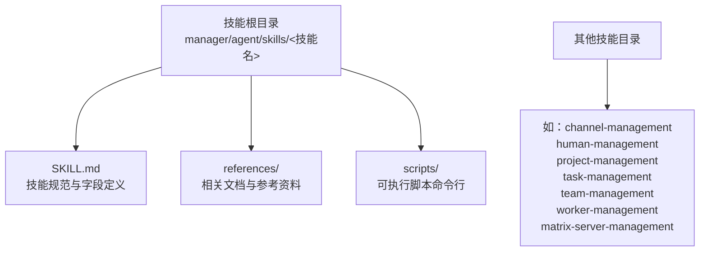
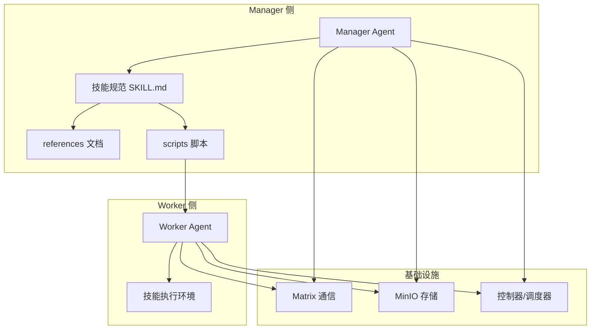
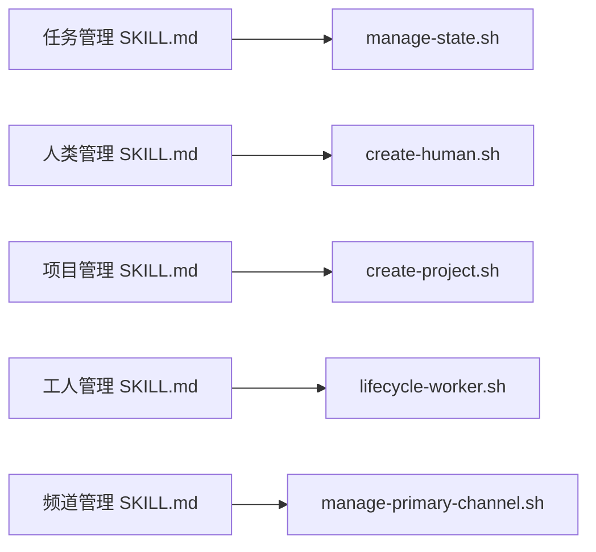

# 技能结构规范

<cite>
**本文引用的文件**
- [SKILL.md（频道管理）](file://manager/agent/skills/channel-management/SKILL.md)
- [SKILL.md（人类管理）](file://manager/agent/skills/human-management/SKILL.md)
- [SKILL.md（项目管理）](file://manager/agent/skills/project-management/SKILL.md)
- [SKILL.md（工人管理）](file://manager/agent/skills/worker-management/SKILL.md)
- [SKILL.md（任务管理）](file://manager/agent/skills/task-management/SKILL.md)
- [SKILL.md（团队管理）](file://manager/agent/skills/team-management/SKILL.md)
- [SKILL.md（Matrix 服务器管理）](file://manager/agent/skills/matrix-server-management/SKILL.md)
- [SKILL.md（迁移技能）](file://migrate/skill/SKILL.md)
- [manage-primary-channel.sh](file://manager/agent/skills/channel-management/scripts/manage-primary-channel.sh)
- [create-human.sh](file://manager/agent/skills/human-management/scripts/create-human.sh)
- [lifecycle-worker.sh](file://manager/agent/skills/worker-management/scripts/lifecycle-worker.sh)
- [create-project.sh](file://manager/agent/skills/project-management/scripts/create-project.sh)
- [manage-state.sh](file://manager/agent/skills/task-management/scripts/manage-state.sh)
</cite>

## 目录
1. [简介](#简介)
2. [项目结构](#项目结构)
3. [核心组件](#核心组件)
4. [架构总览](#架构总览)
5. [详细组件分析](#详细组件分析)
6. [依赖关系分析](#依赖关系分析)
7. [性能考量](#性能考量)
8. [故障排查指南](#故障排查指南)
9. [结论](#结论)
10. [附录：技能模板与最佳实践](#附录技能模板与最佳实践)

## 简介
本规范面向 HiClaw 的“技能”（Skill）结构，系统化阐述 SKILL.md 的标准格式与字段定义、技能目录组织、references 与 scripts 子目录的作用与命名规则、技能配置文件的 YAML 语法要点与必填项、以及技能开发的最佳实践（模块化、可复用性、性能优化）。同时提供完整模板与示例路径，帮助开发者快速构建符合规范的技能。

## 项目结构
HiClaw 的技能位于“代理技能库”中，按功能域划分在 manager/agent/skills 下，每个技能通常包含：
- SKILL.md：技能规范与操作参考
- references/：相关文档与参考资料
- scripts/：可执行脚本（命令行工具）

图示来源
- [SKILL.md（频道管理）:1-30](file://manager/agent/skills/channel-management/SKILL.md#L1-L30)
- [SKILL.md（人类管理）:1-45](file://manager/agent/skills/human-management/SKILL.md#L1-L45)
- [SKILL.md（项目管理）:1-37](file://manager/agent/skills/project-management/SKILL.md#L1-L37)
- [SKILL.md（工人管理）:1-83](file://manager/agent/skills/worker-management/SKILL.md#L1-L83)
- [SKILL.md（任务管理）:1-30](file://manager/agent/skills/task-management/SKILL.md#L1-L30)
- [SKILL.md（团队管理）:1-48](file://manager/agent/skills/team-management/SKILL.md#L1-L48)
- [SKILL.md（Matrix 服务器管理）:1-23](file://manager/agent/skills/matrix-server-management/SKILL.md#L1-L23)

章节来源
- [SKILL.md（频道管理）:1-30](file://manager/agent/skills/channel-management/SKILL.md#L1-L30)
- [SKILL.md（人类管理）:1-45](file://manager/agent/skills/human-management/SKILL.md#L1-L45)
- [SKILL.md（项目管理）:1-37](file://manager/agent/skills/project-management/SKILL.md#L1-L37)
- [SKILL.md（工人管理）:1-83](file://manager/agent/skills/worker-management/SKILL.md#L1-L83)
- [SKILL.md（任务管理）:1-30](file://manager/agent/skills/task-management/SKILL.md#L1-L30)
- [SKILL.md（团队管理）:1-48](file://manager/agent/skills/team-management/SKILL.md#L1-L48)
- [SKILL.md（Matrix 服务器管理）:1-23](file://manager/agent/skills/matrix-server-management/SKILL.md#L1-L23)

## 核心组件
- 技能规范文件（SKILL.md）
  - 必备字段：name、description（用于识别与检索）、assign_when（可选，用于标注适用角色）
  - 正文：用途说明、注意事项（Gotchas）、操作参考表（Reference）
- references 子目录
  - 放置与技能相关的文档、流程说明、API 参考等，供 SKILL.md 引用
- scripts 子目录
  - 放置可执行脚本，遵循原子写入、参数校验、错误处理与结果输出约定

章节来源
- [SKILL.md（频道管理）:1-30](file://manager/agent/skills/channel-management/SKILL.md#L1-L30)
- [SKILL.md（人类管理）:1-45](file://manager/agent/skills/human-management/SKILL.md#L1-L45)
- [SKILL.md（项目管理）:1-37](file://manager/agent/skills/project-management/SKILL.md#L1-L37)
- [SKILL.md（工人管理）:1-83](file://manager/agent/skills/worker-management/SKILL.md#L1-L83)
- [SKILL.md（任务管理）:1-30](file://manager/agent/skills/task-management/SKILL.md#L1-L30)
- [SKILL.md（团队管理）:1-48](file://manager/agent/skills/team-management/SKILL.md#L1-L48)
- [SKILL.md（Matrix 服务器管理）:1-23](file://manager/agent/skills/matrix-server-management/SKILL.md#L1-L23)

## 架构总览
技能在 HiClaw 中作为“可组合能力单元”，通过 Manager/Worker 的协作完成任务编排与执行。技能规范驱动行为边界，脚本负责具体动作，references 提供上下文与参考。

图示来源
- [SKILL.md（人类管理）:1-45](file://manager/agent/skills/human-management/SKILL.md#L1-L45)
- [SKILL.md（项目管理）:1-37](file://manager/agent/skills/project-management/SKILL.md#L1-L37)
- [SKILL.md（工人管理）:1-83](file://manager/agent/skills/worker-management/SKILL.md#L1-L83)
- [SKILL.md（任务管理）:1-30](file://manager/agent/skills/task-management/SKILL.md#L1-L30)
- [SKILL.md（团队管理）:1-48](file://manager/agent/skills/team-management/SKILL.md#L1-L48)
- [SKILL.md（Matrix 服务器管理）:1-23](file://manager/agent/skills/matrix-server-management/SKILL.md#L1-L23)

## 详细组件分析

### 频道管理技能（channel-management）
- 角色定位：仅 Manager 使用，不分配给 Worker
- 关键约束
  - 主频道不可设为 “matrix”
  - 未知发件人需静默忽略
  - 受信任联系人不得接收敏感信息
  - 调用 message 工具时必须显式设置 channel/target
  - 首次接触协议：使用管理员语言
  - 任务派发至 Worker 房间而非管理员 DM
- 操作参考：通过 references 列表文档进行读取与执行

章节来源
- [SKILL.md（频道管理）:1-30](file://manager/agent/skills/channel-management/SKILL.md#L1-L30)

### 人类管理技能（human-management）
- 功能：导入真实人类用户、配置权限等级、移除访问、管理账户
- 权限等级（包含关系）
  - 1：管理员等同权限
  - 2：指定团队领导与其 Worker、指定独立 Worker
  - 3：仅指定 Worker
- 快速创建示例：提供命令行示例，展示关键参数
- 注意事项：人类无需容器、MinIO、Higress；邮箱可选但推荐；Matrix 账户自动注册；权限变更需重新计算 groupAllowFrom

章节来源
- [SKILL.md（人类管理）:1-45](file://manager/agent/skills/human-management/SKILL.md#L1-L45)

### 项目管理技能（project-management）
- 项目组成：项目房间（Matrix）、单源真相 plan.md、meta.json、共享任务目录
- 关键约束
  - YOLO 模式下需自动确认
  - 项目房间必须包含管理员
  - plan.md 是唯一真相
  - 待修订未完成前不得进入下一阶段
  - 始终使用 SOUL.md 语言风格

章节来源
- [SKILL.md（项目管理）:1-37](file://manager/agent/skills/project-management/SKILL.md#L1-L37)

### 工人管理技能（worker-management）
- 功能：手动生成/重置 Worker、启停、管理技能、启用同侪提及、打开控制台
- 快速创建：提供命令行示例，强调 inline SOUL 内容传递
- 注意事项：名称小写且长度>3；--remote 表示“从 Manager 远程”；默认包含 file-sync、task-progress、project-participation；切换运行时为破坏性操作

章节来源
- [SKILL.md（工人管理）:1-83](file://manager/agent/skills/worker-management/SKILL.md#L1-L83)

### 任务管理技能（task-management）
- 关键约束
  - 对不熟悉的领域先使用 find-skills 搜索相关技能
  - 优先委派给 Worker
  - 不要对无限任务进行即时 @mention
  - 使用 manage-state.sh 修改 state.json
  - 所有委派任务必须登记到 state.json
  - 先同步到 MinIO 再通知 Worker，先拉取再读取结果

章节来源
- [SKILL.md（任务管理）:1-30](file://manager/agent/skills/task-management/SKILL.md#L1-L30)

### 团队管理技能（team-management）
- 组成：1 个 Team Leader + 多个 Worker；Leader 负责任务分解与协调
- 关键点：Leader 房间为标准 3 方；Team 房间包含 Team Admin；委托任务使用 --delegated-to-team；控制器强制 runtime: copaw

章节来源
- [SKILL.md（团队管理）:1-48](file://manager/agent/skills/team-management/SKILL.md#L1-L48)

### Matrix 服务器管理技能（matrix-server-management）
- 用途：独立 Matrix 管理请求（注册用户、创建房间、管理成员、上传文件）
- 注意事项：Workers 忽略无 m.mentions 的消息；用户 ID 必须完全匹配；trusted_private_chat 自动加入；不要用于 Worker/项目创建

章节来源
- [SKILL.md（Matrix 服务器管理）:1-23](file://manager/agent/skills/matrix-server-management/SKILL.md#L1-L23)

### 迁移技能（hiclaw-migrate）
- 目标：将 OpenClaw 环境分析并打包为 HiClaw 可导入的 Worker 包
- 关键流程：工具依赖分析、适配 AGENTS.md/SOUL.md、Cron 适配、生成 ZIP、导入验证
- 注意事项：移除内置覆盖内容；适配工作区路径；AI Identity 段落必需

章节来源
- [SKILL.md（迁移技能）:1-238](file://migrate/skill/SKILL.md#L1-L238)

## 依赖关系分析
技能之间存在调用与协作关系：
- 任务管理依赖状态文件（state.json），由 manage-state.sh 提供原子写入保障
- 人类管理依赖 Matrix 服务与 SMTP（可选）
- 项目管理依赖 MinIO 同步与 Matrix 房间
- 工人管理依赖控制器与后端容器 API
- 频道管理依赖主频道配置文件（primary-channel.json）

图示来源
- [manage-state.sh:1-294](file://manager/agent/skills/task-management/scripts/manage-state.sh#L1-L294)
- [create-human.sh:1-379](file://manager/agent/skills/human-management/scripts/create-human.sh#L1-L379)
- [create-project.sh:1-229](file://manager/agent/skills/project-management/scripts/create-project.sh#L1-L229)
- [lifecycle-worker.sh:1-574](file://manager/agent/skills/worker-management/scripts/lifecycle-worker.sh#L1-L574)
- [manage-primary-channel.sh:1-124](file://manager/agent/skills/channel-management/scripts/manage-primary-channel.sh#L1-L124)

章节来源
- [manage-state.sh:1-294](file://manager/agent/skills/task-management/scripts/manage-state.sh#L1-L294)
- [create-human.sh:1-379](file://manager/agent/skills/human-management/scripts/create-human.sh#L1-L379)
- [create-project.sh:1-229](file://manager/agent/skills/project-management/scripts/create-project.sh#L1-L229)
- [lifecycle-worker.sh:1-574](file://manager/agent/skills/worker-management/scripts/lifecycle-worker.sh#L1-L574)
- [manage-primary-channel.sh:1-124](file://manager/agent/skills/channel-management/scripts/manage-primary-channel.sh#L1-L124)

## 性能考量
- 原子写入与临时文件替换：脚本普遍采用 tmp+mv 确保并发安全与一致性
- 最小化外部调用：优先使用本地文件与环境变量，减少网络往返
- 缓存与重试：对 Matrix/MinIO 操作进行幂等与失败回退
- 资源回收：空闲 Worker 自动停止，降低资源占用
- 并发与批处理：批量创建 Worker 时避免阻塞等待，采用轮询状态

## 故障排查指南
- 参数缺失或非法
  - 检查脚本参数解析与必填项校验
  - 示例：manage-state.sh 在缺少必要参数时会报错并退出
- 权限与认证问题
  - Matrix 登录失败：检查令牌与密码配置
  - SMTP 发送失败：确认主机、端口、凭据配置
- 状态不一致
  - 使用 manage-state.sh 的 list/init 等动作核对 active_tasks 与更新时间
- 容器生命周期异常
  - 使用 lifecycle-worker.sh 的 ensure-ready/start/delete 等动作恢复容器状态

章节来源
- [manage-state.sh:248-294](file://manager/agent/skills/task-management/scripts/manage-state.sh#L248-L294)
- [create-human.sh:74-84](file://manager/agent/skills/human-management/scripts/create-human.sh#L74-L84)
- [lifecycle-worker.sh:451-505](file://manager/agent/skills/worker-management/scripts/lifecycle-worker.sh#L451-L505)

## 结论
HiClaw 技能体系通过明确的规范（SKILL.md）、清晰的目录结构（references/scripts）与健壮的脚本实现，实现了可组合、可复用、可维护的多智能体协作能力。遵循本文档的字段定义、目录组织与最佳实践，可显著提升技能质量与系统稳定性。

## 附录：技能模板与最佳实践

### SKILL.md 字段定义与示例路径
- 必填字段
  - name：技能标识符（小写、连字符）
  - description：简短用途说明
- 可选字段
  - assign_when：适用角色（如仅 Manager）
- 正文结构
  - 用途说明、注意事项（Gotchas）、操作参考表（Reference）
- 示例路径
  - [SKILL.md（频道管理）:1-30](file://manager/agent/skills/channel-management/SKILL.md#L1-L30)
  - [SKILL.md（人类管理）:1-45](file://manager/agent/skills/human-management/SKILL.md#L1-L45)
  - [SKILL.md（项目管理）:1-37](file://manager/agent/skills/project-management/SKILL.md#L1-L37)
  - [SKILL.md（工人管理）:1-83](file://manager/agent/skills/worker-management/SKILL.md#L1-L83)
  - [SKILL.md（任务管理）:1-30](file://manager/agent/skills/task-management/SKILL.md#L1-L30)
  - [SKILL.md（团队管理）:1-48](file://manager/agent/skills/team-management/SKILL.md#L1-L48)
  - [SKILL.md（Matrix 服务器管理）:1-23](file://manager/agent/skills/matrix-server-management/SKILL.md#L1-L23)
  - [SKILL.md（迁移技能）:1-238](file://migrate/skill/SKILL.md#L1-L238)

### 目录组织与命名规则
- 目录层级
  - manager/agent/skills/<技能名>/
  - references/：文档与参考资料
  - scripts/：命令行脚本
- 命名建议
  - 技能名：小写、连字符
  - 脚本：语义化、带扩展名（.sh）
  - 文档：描述性、版本化（如 plan-format.md）

### YAML 配置语法与参数选项
- YAML 语法要点
  - 缩进统一使用空格（2 空格）
  - 键名小写，使用连字符分隔
  - 字符串值加引号，布尔值小写
- 必填字段
  - name、description（见 SKILL.md）
  - 与脚本交互的配置项需在 references 中明确
- 示例路径
  - [create-project.sh（项目元数据与房间创建）:64-98](file://manager/agent/skills/project-management/scripts/create-project.sh#L64-L98)
  - [create-human.sh（权限与邀请）:196-289](file://manager/agent/skills/human-management/scripts/create-human.sh#L196-L289)

### 最佳实践
- 模块化设计
  - 将复杂流程拆分为多个脚本，单一职责
  - 通过 references 提供上下文，避免重复文档
- 可复用性
  - 参数化脚本，支持环境变量与配置文件
  - 输出标准化 JSON，便于上层集成
- 性能优化
  - 使用原子写入（tmp+mv）避免竞态
  - 批量操作时避免阻塞等待，采用轮询
  - 合理缓存与幂等操作，减少无效调用

### 完整技能模板与示例路径
- 频道管理
  - 规范与参考：[SKILL.md（频道管理）:1-30](file://manager/agent/skills/channel-management/SKILL.md#L1-L30)
  - 主频道配置脚本：[manage-primary-channel.sh:1-124](file://manager/agent/skills/channel-management/scripts/manage-primary-channel.sh#L1-L124)
- 人类管理
  - 规范与参考：[SKILL.md（人类管理）:1-45](file://manager/agent/skills/human-management/SKILL.md#L1-L45)
  - 人类导入脚本：[create-human.sh:1-379](file://manager/agent/skills/human-management/scripts/create-human.sh#L1-L379)
- 项目管理
  - 规范与参考：[SKILL.md（项目管理）:1-37](file://manager/agent/skills/project-management/SKILL.md#L1-L37)
  - 项目创建脚本：[create-project.sh:1-229](file://manager/agent/skills/project-management/scripts/create-project.sh#L1-L229)
- 工人管理
  - 规范与参考：[SKILL.md（工人管理）:1-83](file://manager/agent/skills/worker-management/SKILL.md#L1-L83)
  - 生命周期脚本：[lifecycle-worker.sh:1-574](file://manager/agent/skills/worker-management/scripts/lifecycle-worker.sh#L1-L574)
- 任务管理
  - 规范与参考：[SKILL.md（任务管理）:1-30](file://manager/agent/skills/task-management/SKILL.md#L1-L30)
  - 状态管理脚本：[manage-state.sh:1-294](file://manager/agent/skills/task-management/scripts/manage-state.sh#L1-L294)
- 团队管理
  - 规范与参考：[SKILL.md（团队管理）:1-48](file://manager/agent/skills/team-management/SKILL.md#L1-L48)
- Matrix 服务器管理
  - 规范与参考：[SKILL.md（Matrix 服务器管理）:1-23](file://manager/agent/skills/matrix-server-management/SKILL.md#L1-L23)
- 迁移技能
  - 规范与参考：[SKILL.md（迁移技能）:1-238](file://migrate/skill/SKILL.md#L1-L238)