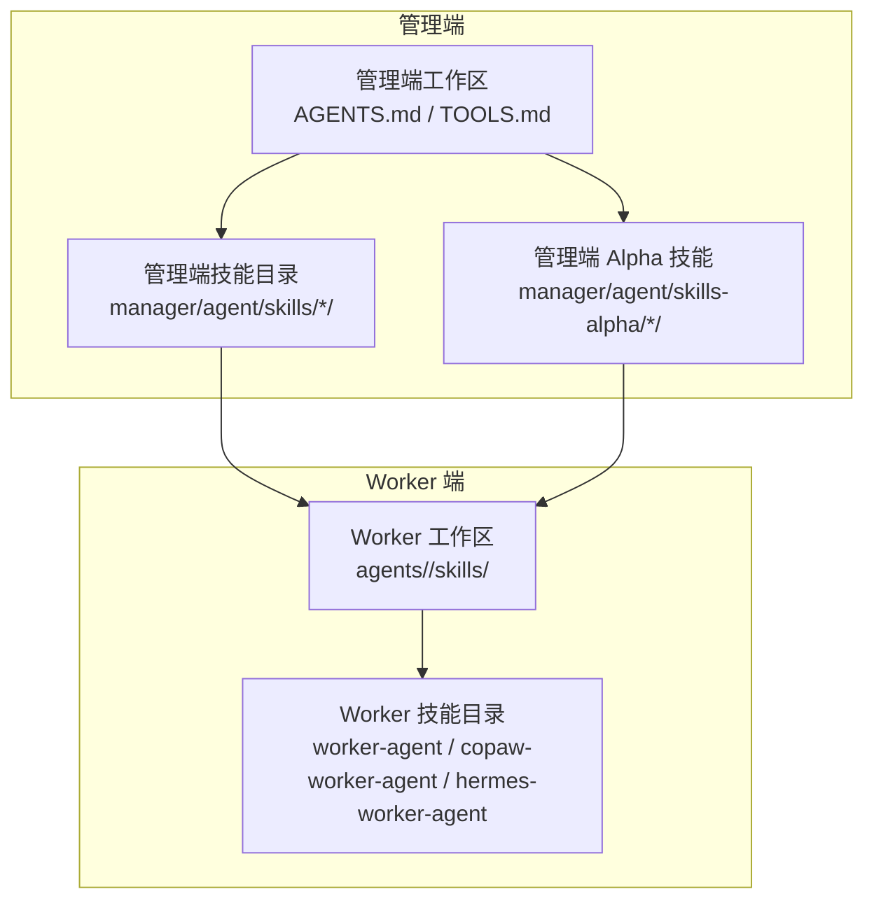
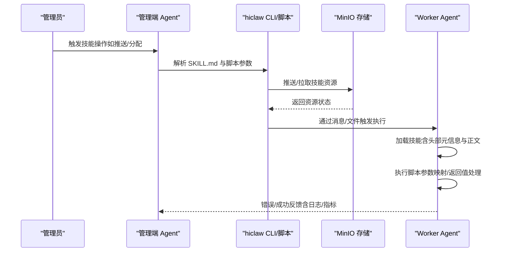
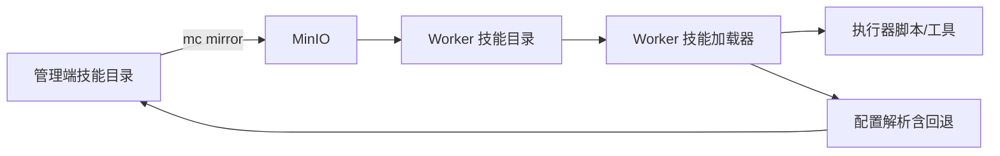

# 技能配置语法

<cite>
**本文引用的文件**
- [manager/agent/skills/task-management/SKILL.md](file://manager/agent/skills/task-management/SKILL.md)
- [manager/agent/skills/worker-management/SKILL.md](file://manager/agent/skills/worker-management/SKILL.md)
- [manager/agent/skills/project-management/SKILL.md](file://manager/agent/skills/project-management/SKILL.md)
- [manager/agent/skills/team-management/SKILL.md](file://manager/agent/skills/team-management/SKILL.md)
- [manager/agent/AGENTS.md](file://manager/agent/AGENTS.md)
- [manager/agent/TOOLS.md](file://manager/agent/TOOLS.md)
- [manager/agent/skills-alpha/coding-cli-management/SKILL.md](file://manager/agent/skills-alpha/coding-cli-management/SKILL.md)
- [manager/agent/skills/task-management/references/infinite-tasks.md](file://manager/agent/skills/task-management/references/infinite-tasks.md)
- [manager/agent/skills/worker-management/scripts/push-worker-skills.sh](file://manager/agent/skills/worker-management/scripts/push-worker-skills.sh)
- [copaw/src/matrix/config.py](file://copaw/src/matrix/config.py)
- [copaw/src/copaw_worker/worker.py](file://copaw/src/copaw_worker/worker.py)
- [hiclaw-controller/cmd/hiclaw/main_test.go](file://hiclaw-controller/cmd/hiclaw/main_test.go)
- [tests/skills/hiclaw-test/SKILL.md](file://tests/skills/hiclaw-test/SKILL.md)
</cite>

## 目录
1. [引言](#引言)
2. [项目结构](#项目结构)
3. [核心组件](#核心组件)
4. [架构总览](#架构总览)
5. [详细组件分析](#详细组件分析)
6. [依赖关系分析](#依赖关系分析)
7. [性能考量](#性能考量)
8. [故障排查指南](#故障排查指南)
9. [结论](#结论)
10. [附录](#附录)

## 引言
本文件系统性阐述 HiClaw 技能配置语法与使用规范，聚焦于 YAML/Markdown 技能描述文件的语法规则、缩进与数据类型约定、特殊字符处理、以及技能执行器类型、参数映射、返回值与错误处理机制。文档同时覆盖同步/异步与回调机制差异，并提供验证规则、常见错误类型、完整配置示例与最佳实践，帮助开发者正确编写与维护技能配置文件。

## 项目结构
HiClaw 的“技能”以“技能目录 + SKILL.md + 可选 scripts/ 与 references/”的方式组织，每个技能独立自洽，作为 Agent 的工具与知识来源。管理端与 Worker 端均提供多套技能实现，按运行时（openclaw/copaw/hermes）分层管理，确保可移植与可替换。

图示来源
- [manager/agent/AGENTS.md:1-220](file://manager/agent/AGENTS.md#L1-L220)
- [manager/agent/TOOLS.md:1-12](file://manager/agent/TOOLS.md#L1-L12)

章节来源
- [manager/agent/AGENTS.md:1-220](file://manager/agent/AGENTS.md#L1-L220)
- [manager/agent/TOOLS.md:1-12](file://manager/agent/TOOLS.md#L1-L12)

## 核心组件
- 技能描述文件（SKILL.md）
  - 使用 YAML 头部（front matter）定义元信息（name、description 等），正文为操作参考与注意事项。
  - 头部使用三短横线分隔，键值对严格缩进；字符串值若含换行需采用 YAML 折叠/保留块。
- 技能脚本（scripts/）
  - 提供具体执行流程与参数映射，遵循统一的输入输出约定（如通过环境变量、标准输入/输出、或 MinIO 同步）。
- 技能资源（references/）
  - 提供规范、模板与参考文档，用于指导复杂场景下的参数校验与一致性。
- 运行时适配（runtime-specific）
  - 不同运行时（openclaw/copaw/hermes）下，技能来源与加载顺序存在差异，需注意覆盖与优先级。

章节来源
- [manager/agent/skills/task-management/SKILL.md:1-30](file://manager/agent/skills/task-management/SKILL.md#L1-L30)
- [manager/agent/skills/worker-management/SKILL.md:1-83](file://manager/agent/skills/worker-management/SKILL.md#L1-L83)
- [manager/agent/skills/project-management/SKILL.md:1-37](file://manager/agent/skills/project-management/SKILL.md#L1-L37)
- [manager/agent/skills/team-management/SKILL.md:1-48](file://manager/agent/skills/team-management/SKILL.md#L1-L48)
- [manager/agent/skills-alpha/coding-cli-management/SKILL.md:1-202](file://manager/agent/skills-alpha/coding-cli-management/SKILL.md#L1-L202)

## 架构总览
技能配置在系统中的流转路径如下：管理端通过 CLI/脚本将技能推送到 MinIO，Worker 端拉取后加载；执行阶段由 Agent 根据 SKILL.md 的指引调用脚本，完成参数映射、返回值处理与错误上报。

图示来源
- [manager/agent/skills/worker-management/scripts/push-worker-skills.sh:103-135](file://manager/agent/skills/worker-management/scripts/push-worker-skills.sh#L103-L135)
- [copaw/src/copaw_worker/worker.py:352-375](file://copaw/src/copaw_worker/worker.py#L352-L375)

章节来源
- [manager/agent/skills/worker-management/scripts/push-worker-skills.sh:103-135](file://manager/agent/skills/worker-management/scripts/push-worker-skills.sh#L103-L135)
- [copaw/src/copaw_worker/worker.py:352-375](file://copaw/src/copaw_worker/worker.py#L352-L375)

## 详细组件分析

### YAML 与 Markdown 技能头（front matter）语法
- 结构与分隔
  - 使用三短横线（---）作为头部起止标记，头部内容为键值对列表，键名区分大小写，值支持字符串、布尔、整数、数组等。
  - 头部与正文之间必须空一行。
- 缩进与嵌套
  - 使用空格进行缩进，不支持制表符；同一层级缩进一致。
  - 数组项使用短横线加空格（- ）开头，子对象保持相对缩进。
- 特殊字符与换行
  - 字符串值若包含换行，推荐使用 YAML 折叠块（>）或保留块（|），并在必要时转义特殊字符。
  - 若值包含引号、反斜杠等，应按 YAML 规范进行转义或使用引号包裹。
- 数据类型与默认值
  - 布尔值：true/false；整数：十进制数字；字符串：无引号或双引号包裹；数组：- 开头的列表。
  - 若需要默认值，应在脚本或控制器侧进行回退处理（例如从根配置继承字段）。

章节来源
- [copaw/src/matrix/config.py:1220-1266](file://copaw/src/matrix/config.py#L1220-L1266)

### 技能元信息与正文结构
- 元信息（name、description 等）
  - name 用于唯一标识技能，便于路由与匹配；description 用于系统识别何时加载该技能。
- 正文（How-To、Gotchas、Reference）
  - How-To 提供操作步骤与命令示例；
  - Gotchas 列出常见陷阱与安全注意事项；
  - Reference 提供相关文档链接与模板。

章节来源
- [manager/agent/skills/task-management/SKILL.md:1-30](file://manager/agent/skills/task-management/SKILL.md#L1-L30)
- [manager/agent/skills/worker-management/SKILL.md:1-83](file://manager/agent/skills/worker-management/SKILL.md#L1-L83)
- [manager/agent/skills/project-management/SKILL.md:1-37](file://manager/agent/skills/project-management/SKILL.md#L1-L37)
- [manager/agent/skills/team-management/SKILL.md:1-48](file://manager/agent/skills/team-management/SKILL.md#L1-L48)

### 参数映射与返回值处理
- 参数映射
  - 通过脚本参数、环境变量、标准输入或 MinIO 文件传递输入；SKILL.md 中明确列出关键参数与来源。
  - 对于多运行时（openclaw/copaw/hermes），需根据运行时选择对应脚本路径与参数集。
- 返回值处理
  - 成功/失败通过脚本退出码与标准输出/错误输出区分；部分流程会将结果写入 MinIO，供后续步骤消费。
  - 对于无限任务，状态需通过专用脚本原子更新，避免并发冲突。

章节来源
- [manager/agent/skills/worker-management/scripts/push-worker-skills.sh:108-135](file://manager/agent/skills/worker-management/scripts/push-worker-skills.sh#L108-L135)
- [manager/agent/skills/task-management/references/infinite-tasks.md:34-44](file://manager/agent/skills/task-management/references/infinite-tasks.md#L34-L44)

### 错误处理机制
- 推送失败
  - 当 MinIO 同步失败或技能源不存在时，脚本会记录警告并返回非零退出码，需人工介入。
- 执行失败
  - CLI 工具或外部服务失败时，应通知 Worker 并抄送管理员，同时记录失败原因与定位信息。
- 超时与重试
  - 对于耗时操作，应设置超时阈值并在失败时进行有限重试；心跳与轮询用于缓解瞬时阻塞。

章节来源
- [manager/agent/skills/worker-management/scripts/push-worker-skills.sh:122-135](file://manager/agent/skills/worker-management/scripts/push-worker-skills.sh#L122-L135)
- [manager/agent/skills-alpha/coding-cli-management/SKILL.md:152-180](file://manager/agent/skills-alpha/coding-cli-management/SKILL.md#L152-L180)

### 技能类型与执行模型
- 同步执行
  - 适用于短时、确定性任务；脚本在调用方等待完成后返回结果。
- 异步执行
  - 适用于长时任务；脚本启动后立即返回，后续通过轮询或回调上报进度与结果。
- 回调机制
  - 通过消息通道（如 Matrix 房间）或文件系统标记（processing marker）实现；回调需避免循环触发（例如无限任务仅在心跳时触发）。

章节来源
- [manager/agent/skills/task-management/references/infinite-tasks.md:34-44](file://manager/agent/skills/task-management/references/infinite-tasks.md#L34-L44)
- [manager/agent/skills/task-management/SKILL.md:12-18](file://manager/agent/skills/task-management/SKILL.md#L12-L18)

### 验证规则与常见错误
- YAML 头部验证
  - 必须包含 name；kind/metadata.name 在资源类 YAML 中需正确解析；多文档需正确分割且去除空文档。
- 资源存在性
  - 技能源目录必须存在；MinIO 同步需确认目标路径与权限。
- 参数合法性
  - 运行时参数需符合受支持集合；路径与文件名需满足平台限制（如小写、长度）。
- 常见错误类型
  - 语法错误：缩进不一致、非法字符、未闭合块。
  - 资源缺失：技能目录不存在、MinIO 同步失败。
  - 逻辑错误：无限任务在完成点错误地触发下一轮；推送后未 @mention 导致 Worker 未感知。

章节来源
- [hiclaw-controller/cmd/hiclaw/main_test.go:155-347](file://hiclaw-controller/cmd/hiclaw/main_test.go#L155-L347)
- [manager/agent/skills/worker-management/SKILL.md:35-43](file://manager/agent/skills/worker-management/SKILL.md#L35-L43)

### 配置示例与最佳实践
- 示例一：Worker 管理（创建/生命周期/技能推送）
  - 使用 CLI 创建 Worker 并推送技能；确保先推送再通知 Worker，避免空同步。
- 示例二：任务管理（无限任务）
  - 使用专用脚本更新状态，不要在完成点立即触发下一轮；心跳时自动调度。
- 示例三：Alpha 技能（AI 编码 CLI 委托）
  - 先检测可用 CLI，再启用配置；执行前创建处理标记，结束后清理；失败时通知 Worker 与管理员。

章节来源
- [manager/agent/skills/worker-management/SKILL.md:12-31](file://manager/agent/skills/worker-management/SKILL.md#L12-L31)
- [manager/agent/skills/task-management/references/infinite-tasks.md:34-44](file://manager/agent/skills/task-management/references/infinite-tasks.md#L34-L44)
- [manager/agent/skills-alpha/coding-cli-management/SKILL.md:29-75](file://manager/agent/skills-alpha/coding-cli-management/SKILL.md#L29-L75)

## 依赖关系分析
技能加载与执行依赖于以下关系：
- 管理端技能目录与 Worker 技能目录的镜像关系；
- MinIO 作为共享存储的依赖；
- 运行时特定脚本与通用脚本的互斥与覆盖关系；
- Worker 端技能管理器对内置与推送技能的合并策略。

图示来源
- [manager/agent/skills/worker-management/scripts/push-worker-skills.sh:103-135](file://manager/agent/skills/worker-management/scripts/push-worker-skills.sh#L103-L135)
- [copaw/src/copaw_worker/worker.py:352-375](file://copaw/src/copaw_worker/worker.py#L352-L375)
- [copaw/src/matrix/config.py:1220-1266](file://copaw/src/matrix/config.py#L1220-L1266)

章节来源
- [manager/agent/skills/worker-management/scripts/push-worker-skills.sh:103-135](file://manager/agent/skills/worker-management/scripts/push-worker-skills.sh#L103-L135)
- [copaw/src/copaw_worker/worker.py:352-375](file://copaw/src/copaw_worker/worker.py#L352-L375)
- [copaw/src/matrix/config.py:1220-1266](file://copaw/src/matrix/config.py#L1220-L1266)

## 性能考量
- 资源同步
  - 尽量批量同步与去重，避免重复推送导致的带宽浪费。
- 执行粒度
  - 将长时任务拆分为多个短任务，结合回调与轮询，减少阻塞。
- 日志与指标
  - 记录关键节点耗时与错误码，便于定位瓶颈。

## 故障排查指南
- 测试与调试
  - 使用测试技能提供的调试导出工具收集日志与指标，定位挂起、超时与 LLM 调用失败等问题。
- 常见问题
  - Worker 未响应：检查容器状态、进程存活与网络连通性。
  - 无限任务循环：确认完成点未触发下一轮，仅在心跳时调度。
  - 推送失败：核对 MinIO 权限、路径与脚本返回码。

章节来源
- [tests/skills/hiclaw-test/SKILL.md:100-147](file://tests/skills/hiclaw-test/SKILL.md#L100-L147)
- [manager/agent/skills/task-management/SKILL.md:12-18](file://manager/agent/skills/task-management/SKILL.md#L12-L18)

## 结论
HiClaw 的技能配置以 SKILL.md 为核心，辅以脚本与参考文档，形成清晰的执行契约。通过严格的 YAML front matter 规范、参数映射与返回值约定、以及同步/异步与回调机制，系统实现了可维护、可扩展的多运行时技能体系。遵循本文档的语法与最佳实践，可显著降低配置错误与执行风险。

## 附录
- 术语
  - 技能：封装特定能力的最小单元，包含描述、脚本与参考文档。
  - 运行时：openclaw/copaw/hermes 三种运行时，分别对应不同的 Agent 实现与工具链。
  - 处理标记：用于协调多进程或多轮任务的原子标记文件。
- 参考
  - YAML 头部解析与多文档分割测试用例，体现解析器对空文档与元信息的处理策略。

章节来源
- [hiclaw-controller/cmd/hiclaw/main_test.go:155-347](file://hiclaw-controller/cmd/hiclaw/main_test.go#L155-L347)