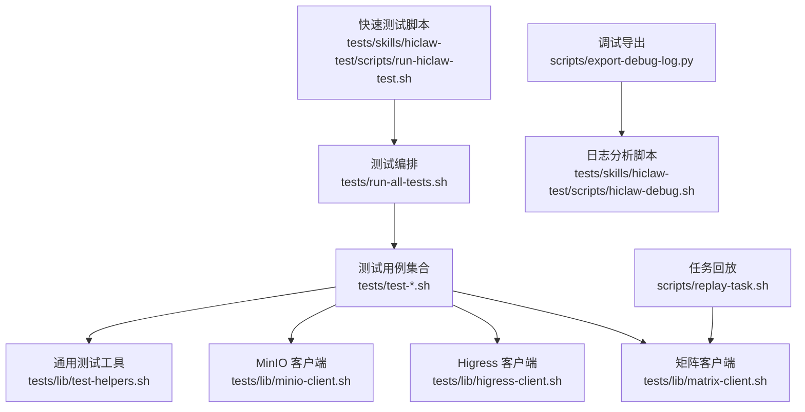
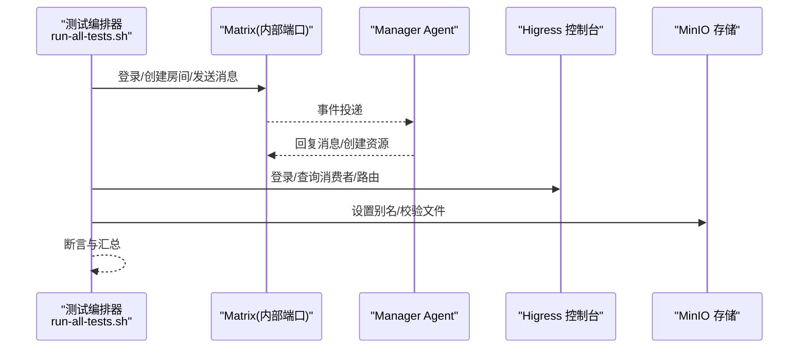
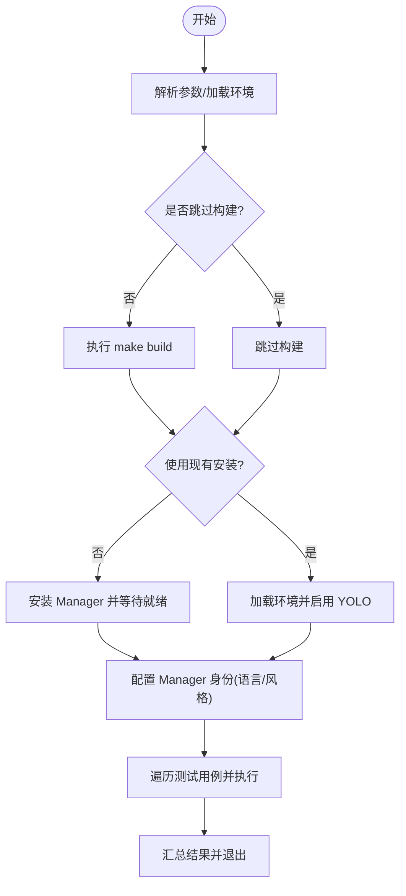
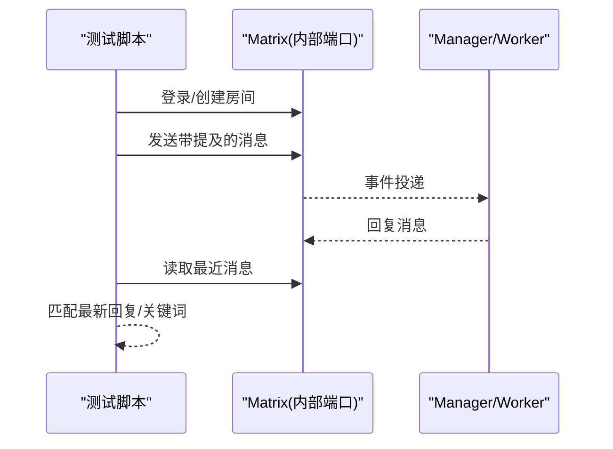
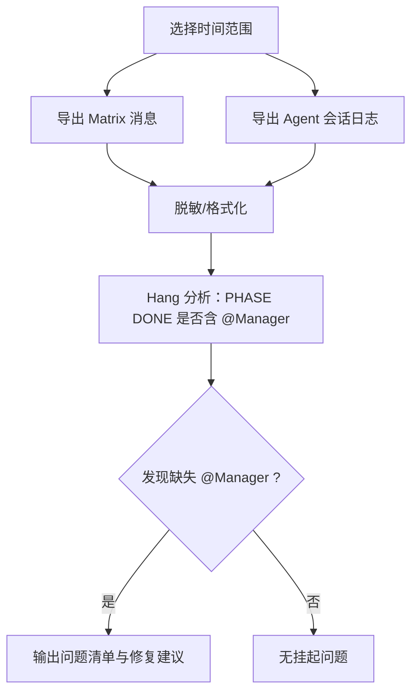
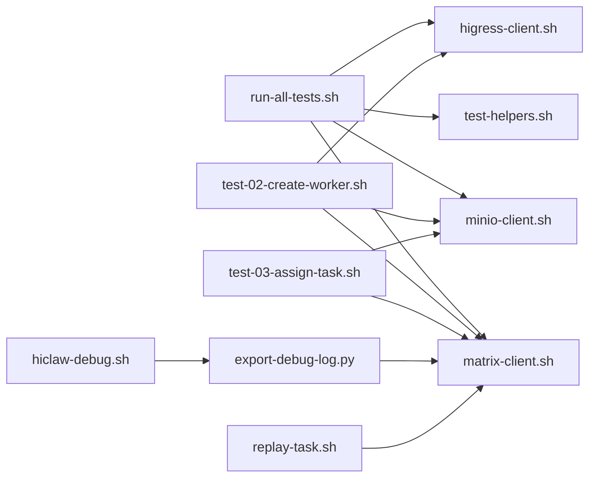

# 测试与调试

<cite>
**本文引用的文件**
- [README.md](file://README.md)
- [tests/README.md](file://tests/README.md)
- [tests/run-all-tests.sh](file://tests/run-all-tests.sh)
- [tests/lib/test-helpers.sh](file://tests/lib/test-helpers.sh)
- [tests/lib/matrix-client.sh](file://tests/lib/matrix-client.sh)
- [tests/lib/higress-client.sh](file://tests/lib/higress-client.sh)
- [tests/lib/minio-client.sh](file://tests/lib/minio-client.sh)
- [scripts/replay-task.sh](file://scripts/replay-task.sh)
- [scripts/export-debug-log.py](file://scripts/export-debug-log.py)
- [tests/skills/hiclaw-test/SKILL.md](file://tests/skills/hiclaw-test/SKILL.md)
- [tests/skills/hiclaw-test/scripts/hiclaw-debug.sh](file://tests/skills/hiclaw-test/scripts/hiclaw-debug.sh)
- [tests/skills/hiclaw-test/scripts/run-hiclaw-test.sh](file://tests/skills/hiclaw-test/scripts/run-hiclaw-test.sh)
- [tests/test-01-manager-boot.sh](file://tests/test-01-manager-boot.sh)
- [tests/test-02-create-worker.sh](file://tests/test-02-create-worker.sh)
- [tests/test-03-assign-task.sh](file://tests/test-03-assign-task.sh)
</cite>

## 目录
1. [简介](#简介)
2. [项目结构](#项目结构)
3. [核心组件](#核心组件)
4. [架构总览](#架构总览)
5. [详细组件分析](#详细组件分析)
6. [依赖关系分析](#依赖关系分析)
7. [性能考量](#性能考量)
8. [故障排查指南](#故障排查指南)
9. [结论](#结论)
10. [附录](#附录)

## 简介
本指南面向 HiClaw 的技能测试与调试场景，系统阐述如何使用仓库内置的测试框架进行端到端验证，如何通过日志导出与分析定位问题，以及如何搭建与配置测试环境。文档覆盖以下关键主题：
- 测试框架与执行流程（单元测试、集成测试、端到端测试）
- 调试工具与技术（日志导出、错误追踪、性能诊断）
- 测试环境搭建与配置（模拟环境、测试数据准备）
- 常见问题排查（脚本错误、依赖冲突、运行时异常）
- 测试用例编写与调试最佳实践

## 项目结构
HiClaw 在仓库中提供了完整的测试与调试基础设施：
- tests：集成测试套件与测试辅助库（矩阵、Higress 控制台、MinIO 客户端等）
- scripts：调试与回放脚本（导出日志、重放任务）
- tests/skills/hiclaw-test：可被“技能”调用的测试与调试工作流
- README 提供构建与测试命令入口

图表来源
- [tests/run-all-tests.sh:1-388](file://tests/run-all-tests.sh#L1-L388)
- [tests/lib/matrix-client.sh:1-552](file://tests/lib/matrix-client.sh#L1-L552)
- [tests/lib/higress-client.sh:1-85](file://tests/lib/higress-client.sh#L1-L85)
- [tests/lib/minio-client.sh:1-59](file://tests/lib/minio-client.sh#L1-L59)
- [scripts/export-debug-log.py:1-756](file://scripts/export-debug-log.py#L1-L756)
- [tests/skills/hiclaw-test/scripts/hiclaw-debug.sh:1-176](file://tests/skills/hiclaw-test/scripts/hiclaw-debug.sh#L1-L176)
- [scripts/replay-task.sh:1-416](file://scripts/replay-task.sh#L1-L416)
- [tests/skills/hiclaw-test/scripts/run-hiclaw-test.sh:1-173](file://tests/skills/hiclaw-test/scripts/run-hiclaw-test.sh#L1-L173)

章节来源
- [README.md:380-394](file://README.md#L380-L394)
- [tests/README.md:1-87](file://tests/README.md#L1-L87)

## 核心组件
- 集成测试编排器：tests/run-all-tests.sh
  - 构建镜像、安装/启动 Manager、加载环境变量、配置 Manager 身份、逐个执行测试用例、汇总结果
- 测试辅助库：
  - tests/lib/test-helpers.sh：断言、等待/轮询、容器内执行、配置检测、生命周期钩子
  - tests/lib/matrix-client.sh：Matrix 用户注册/登录、房间管理、消息发送/读取、等待回复、提及消息
  - tests/lib/higress-client.sh：Higress 控制台登录、消费者/路由/MCP 查询
  - tests/lib/minio-client.sh：MinIO mc 别名设置、文件存在性/内容/目录列表检查
- 调试与回放：
  - scripts/export-debug-log.py：按时间范围导出 Matrix 消息与各 Agent 会话日志，并支持 PII 脱敏
  - tests/skills/hiclaw-test/scripts/hiclaw-debug.sh：导出并分析“阶段完成但未 @Manager”的挂起问题
  - scripts/replay-task.sh：以管理员身份向 Manager 发送任务消息并可选等待回复，便于手动复现
  - tests/skills/hiclaw-test/scripts/run-hiclaw-test.sh：一键拉取代码、加载配置、运行测试或现有安装上的测试

章节来源
- [tests/run-all-tests.sh:1-388](file://tests/run-all-tests.sh#L1-L388)
- [tests/lib/test-helpers.sh:1-549](file://tests/lib/test-helpers.sh#L1-L549)
- [tests/lib/matrix-client.sh:1-552](file://tests/lib/matrix-client.sh#L1-L552)
- [tests/lib/higress-client.sh:1-85](file://tests/lib/higress-client.sh#L1-L85)
- [tests/lib/minio-client.sh:1-59](file://tests/lib/minio-client.sh#L1-L59)
- [scripts/export-debug-log.py:1-756](file://scripts/export-debug-log.py#L1-L756)
- [tests/skills/hiclaw-test/scripts/hiclaw-debug.sh:1-176](file://tests/skills/hiclaw-test/scripts/hiclaw-debug.sh#L1-L176)
- [scripts/replay-task.sh:1-416](file://scripts/replay-task.sh#L1-L416)
- [tests/skills/hiclaw-test/scripts/run-hiclaw-test.sh:1-173](file://tests/skills/hiclaw-test/scripts/run-hiclaw-test.sh#L1-L173)

## 架构总览
下图展示了测试与调试在系统中的交互路径：测试脚本通过 Matrix API 触发 Manager 行为，同时验证 Higress 控制台与 MinIO 的状态；调试阶段通过导出日志与分析脚本定位问题。

图表来源
- [tests/run-all-tests.sh:186-313](file://tests/run-all-tests.sh#L186-L313)
- [tests/lib/matrix-client.sh:35-151](file://tests/lib/matrix-client.sh#L35-L151)
- [tests/lib/higress-client.sh:13-84](file://tests/lib/higress-client.sh#L13-L84)
- [tests/lib/minio-client.sh:10-59](file://tests/lib/minio-client.sh#L10-L59)

## 详细组件分析

### 组件A：测试编排与执行（run-all-tests.sh）
- 主要职责
  - 解析参数（跳过构建、使用现有安装、过滤测试）
  - 加载环境变量（从 hiclaw-manager.env 或 HOME）
  - 启动/清理容器、启用 YOLO 模式、等待健康
  - 配置 Manager 身份（语言/风格），确保后续测试一致性
  - 顺序执行测试用例，收集结果并输出报告
- 关键流程
  - 容器生命周期管理（控制器/Manager/Worker）
  - 等待 Manager Agent 就绪（不同运行时的健康检查）
  - 逐个测试用例执行与断言
- 性能与稳定性
  - 使用超时与重试策略避免偶发网络波动
  - 通过“会话稳定”等待减少竞态条件

图表来源
- [tests/run-all-tests.sh:11-178](file://tests/run-all-tests.sh#L11-L178)
- [tests/run-all-tests.sh:319-387](file://tests/run-all-tests.sh#L319-L387)

章节来源
- [tests/run-all-tests.sh:1-388](file://tests/run-all-tests.sh#L1-L388)

### 组件B：矩阵通信与消息处理（matrix-client.sh）
- 主要职责
  - 通过 docker exec 访问内部 Matrix 端口，避免暴露宿主端口
  - 提供用户注册/登录、房间管理、消息发送/读取、等待回复、提及消息等能力
  - 支持“至少一次”语义的消息发送，适配不同运行时的就绪窗口差异
- 关键机制
  - 事件基线快照：仅返回新事件，避免旧消息干扰
  - 进度式回复匹配：等待包含特定关键词的最新回复
  - 提及消息构造：同时满足 m.mentions 与可见提及，确保被 Worker/Manager 正确处理

图表来源
- [tests/lib/matrix-client.sh:35-151](file://tests/lib/matrix-client.sh#L35-L151)
- [tests/lib/matrix-client.sh:153-390](file://tests/lib/matrix-client.sh#L153-L390)

章节来源
- [tests/lib/matrix-client.sh:1-552](file://tests/lib/matrix-client.sh#L1-L552)

### 组件C：Higress 控制台与 MCP 管理（higress-client.sh）
- 主要职责
  - 登录控制台并维护会话 Cookie
  - 查询消费者、路由、MCP 服务器消费者等
- 使用场景
  - 验证 Manager/Worker 消费者创建与授权
  - 校验 MCP 权限动态变更（测试用例 10）

章节来源
- [tests/lib/higress-client.sh:1-85](file://tests/lib/higress-client.sh#L1-L85)

### 组件D：MinIO 文件系统验证（minio-client.sh）
- 主要职责
  - 配置 mc 别名（内部端口）
  - 校验文件存在性、读取内容、列出目录
  - 提供等待文件出现的轮询封装
- 使用场景
  - 验证 Manager/Worker 生成的 SOUL.md、任务规范、共享文件等

章节来源
- [tests/lib/minio-client.sh:1-59](file://tests/lib/minio-client.sh#L1-L59)

### 组件E：日志导出与分析（export-debug-log.py、hiclaw-debug.sh）
- export-debug-log.py
  - 自动识别 Matrix 服务地址与令牌，导出指定时间范围内的消息
  - 从各容器 Session 目录导出 Agent 会话日志（OpenClaw/Copaw/Hermes）
  - 支持 PII 脱敏与选择性导出（仅消息/按容器/按房间）
- hiclaw-debug.sh
  - 对导出的日志进行二次分析，重点检查“阶段完成”消息是否包含 @Manager 提及
  - 输出挂起问题清单与修复建议

图表来源
- [scripts/export-debug-log.py:677-756](file://scripts/export-debug-log.py#L677-L756)
- [tests/skills/hiclaw-test/scripts/hiclaw-debug.sh:65-159](file://tests/skills/hiclaw-test/scripts/hiclaw-debug.sh#L65-L159)

章节来源
- [scripts/export-debug-log.py:1-756](file://scripts/export-debug-log.py#L1-L756)
- [tests/skills/hiclaw-test/scripts/hiclaw-debug.sh:1-176](file://tests/skills/hiclaw-test/scripts/hiclaw-debug.sh#L1-L176)

### 组件F：任务回放与人工干预（replay-task.sh）
- 主要职责
  - 以管理员身份登录 Matrix，查找或创建与 Manager 的私聊室
  - 等待 Manager Agent 网关健康与房间加入
  - 发送任务消息并可选等待回复，同时记录对话日志
- 使用场景
  - 快速复现问题、验证修复、手动调试

章节来源
- [scripts/replay-task.sh:1-416](file://scripts/replay-task.sh#L1-L416)

### 组件G：测试用例示例与断言（test-01/test-02/test-03）
- test-01-manager-boot.sh：验证网关/控制台/Element 可达、Matrix/MinIO 健康、Manager 配置与响应
- test-02-create-worker.sh：请求创建 Worker、等待命名回复、验证 Higress 消费者与 MinIO 文件
- test-03-assign-task.sh：分配任务、等待任务目录生成、等待 Worker 完成并产出结果

章节来源
- [tests/test-01-manager-boot.sh:1-153](file://tests/test-01-manager-boot.sh#L1-L153)
- [tests/test-02-create-worker.sh:1-149](file://tests/test-02-create-worker.sh#L1-L149)
- [tests/test-03-assign-task.sh:1-83](file://tests/test-03-assign-task.sh#L1-L83)

## 依赖关系分析
- 测试编排器依赖测试辅助库与各客户端库
- 测试用例依赖矩阵/Higress/MinIO 客户端与断言工具
- 调试工具依赖导出脚本与分析脚本
- 任务回放脚本依赖矩阵客户端与环境变量

图表来源
- [tests/run-all-tests.sh:1-388](file://tests/run-all-tests.sh#L1-L388)
- [tests/lib/test-helpers.sh:1-549](file://tests/lib/test-helpers.sh#L1-L549)
- [tests/lib/matrix-client.sh:1-552](file://tests/lib/matrix-client.sh#L1-L552)
- [tests/lib/higress-client.sh:1-85](file://tests/lib/higress-client.sh#L1-L85)
- [tests/lib/minio-client.sh:1-59](file://tests/lib/minio-client.sh#L1-L59)
- [scripts/export-debug-log.py:1-756](file://scripts/export-debug-log.py#L1-L756)
- [tests/skills/hiclaw-test/scripts/hiclaw-debug.sh:1-176](file://tests/skills/hiclaw-test/scripts/hiclaw-debug.sh#L1-L176)
- [scripts/replay-task.sh:1-416](file://scripts/replay-task.sh#L1-L416)

## 性能考量
- 测试执行
  - 使用超时与重试避免偶发失败；对 Manager Agent 就绪采用分阶段等待（运行时健康 + 房间加入）
  - 通过“会话稳定”等待减少竞态，提升断言准确性
- 日志导出
  - 按时间范围导出，避免全量扫描；对大文件采用增量读取与脱敏
- 端到端验证
  - 通过 MinIO 与 Higress 的状态核验，减少对真实外部服务的依赖波动

## 故障排查指南
- 常见问题与定位
  - 测试挂起：使用 hiclaw-debug.sh 分析“阶段完成”消息是否包含 @Manager 提及
  - Worker 不响应：检查容器状态、进程存活、Matrix 房间加入
  - LLM 调用失败：查看 Manager Agent 错误日志
  - 超时：适当增加超时时间或使用 run-hiclaw-test.sh 的 existing 模式
- 推荐步骤
  - 导出调试日志（export-debug-log.py 或 hiclaw-debug.sh）
  - 分析 Matrix 消息与 Agent 会话，确认关键事件是否发生
  - 结合测试输出指标（metrics）评估性能与资源消耗

章节来源
- [tests/skills/hiclaw-test/SKILL.md:100-147](file://tests/skills/hiclaw-test/SKILL.md#L100-L147)
- [scripts/export-debug-log.py:1-756](file://scripts/export-debug-log.py#L1-L756)
- [tests/skills/hiclaw-test/scripts/hiclaw-debug.sh:65-159](file://tests/skills/hiclaw-test/scripts/hiclaw-debug.sh#L65-L159)

## 结论
HiClaw 的测试与调试体系以“容器内访问 + 端到端验证 + 日志导出分析”为核心，既保证了测试的稳定性与可重复性，又提供了强大的问题定位能力。通过统一的测试编排器与丰富的辅助库，开发者可以高效地完成从单点验证到全链路回归的各类测试任务，并借助调试工具快速定位与解决问题。

## 附录

### 测试框架使用指南
- 执行方式
  - 一键全量测试：make test（或 tests/run-all-tests.sh）
  - 指定测试：make test TEST_FILTER="01 02"
  - 使用现有安装：make test SKIP_INSTALL=1
- 环境变量
  - HICLAW_LLM_API_KEY：用于 Manager Agent 的 LLM 行为
  - HICLAW_GITHUB_TOKEN：用于 GitHub/MCP 相关测试（可选）
  - hiclaw-manager.env：包含管理员密码、MinIO 凭据、Matrix 域名等

章节来源
- [tests/README.md:37-87](file://tests/README.md#L37-L87)
- [tests/run-all-tests.sh:25-68](file://tests/run-all-tests.sh#L25-L68)

### 调试最佳实践
- 使用 export-debug-log.py 指定时间范围导出日志，避免全量扫描
- 使用 hiclaw-debug.sh 分析“阶段完成”消息是否遗漏 @Manager 提及
- 通过 replay-task.sh 快速复现问题，便于人工介入与验证
- 在 run-hiclaw-test.sh 中使用 existing 模式加速回归测试

章节来源
- [scripts/export-debug-log.py:677-756](file://scripts/export-debug-log.py#L677-L756)
- [tests/skills/hiclaw-test/scripts/hiclaw-debug.sh:1-176](file://tests/skills/hiclaw-test/scripts/hiclaw-debug.sh#L1-L176)
- [scripts/replay-task.sh:1-416](file://scripts/replay-task.sh#L1-L416)
- [tests/skills/hiclaw-test/scripts/run-hiclaw-test.sh:1-173](file://tests/skills/hiclaw-test/scripts/run-hiclaw-test.sh#L1-L173)