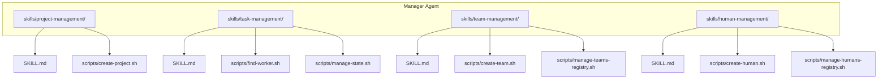
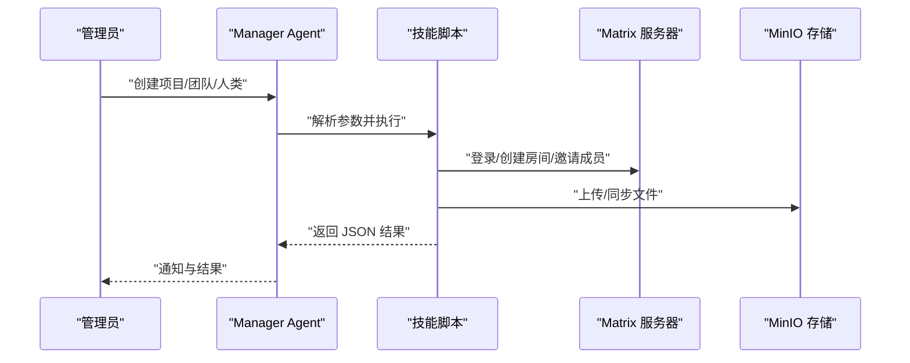
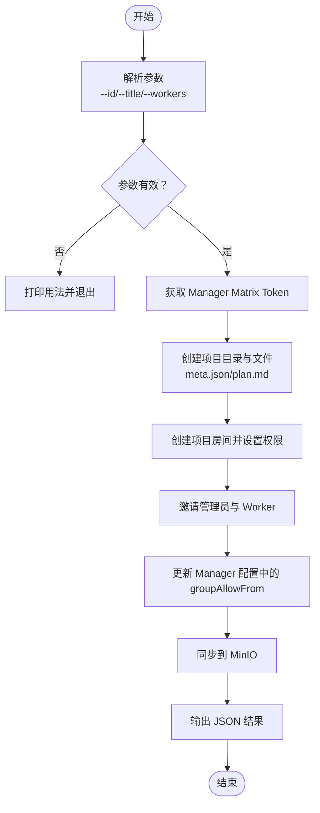
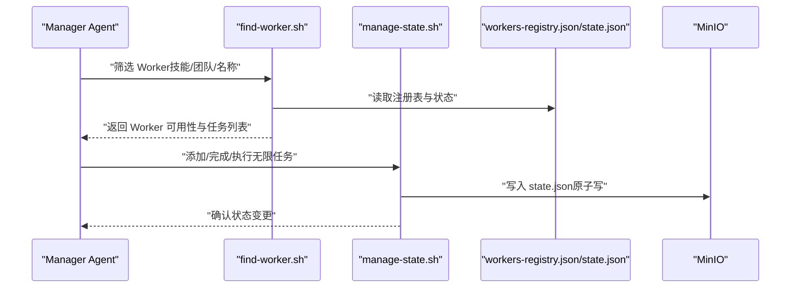
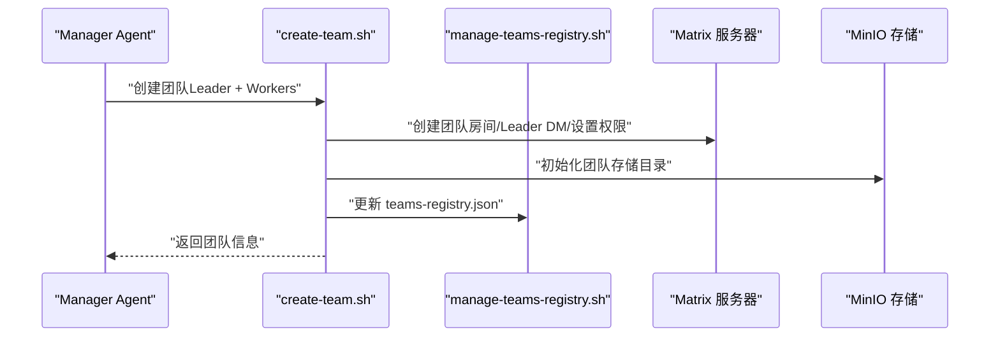
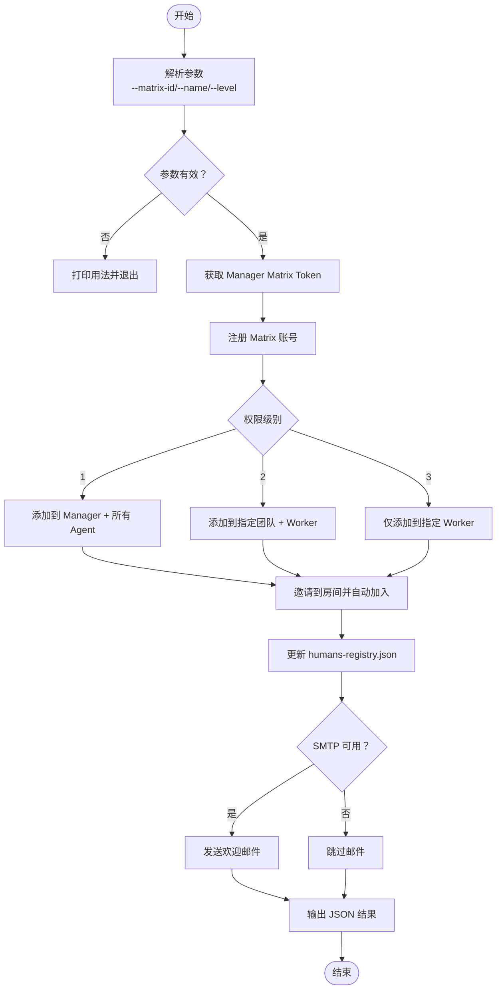
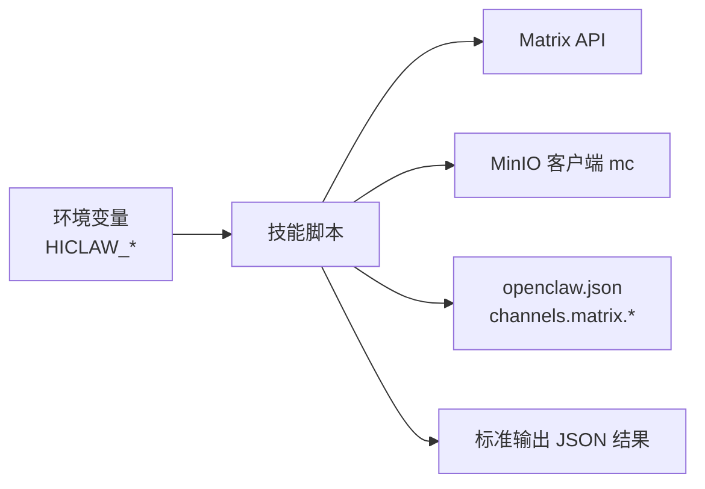

# 基础技能开发示例

<cite>
**本文引用的文件**
- [README.md](file://README.md)
- [docs/development.md](file://docs/development.md)
- [manager/agent/skills/project-management/SKILL.md](file://manager/agent/skills/project-management/SKILL.md)
- [manager/agent/skills/task-management/SKILL.md](file://manager/agent/skills/task-management/SKILL.md)
- [manager/agent/skills/team-management/SKILL.md](file://manager/agent/skills/team-management/SKILL.md)
- [manager/agent/skills/human-management/SKILL.md](file://manager/agent/skills/human-management/SKILL.md)
- [manager/agent/skills/project-management/scripts/create-project.sh](file://manager/agent/skills/project-management/scripts/create-project.sh)
- [manager/agent/skills/task-management/scripts/find-worker.sh](file://manager/agent/skills/task-management/scripts/find-worker.sh)
- [manager/agent/skills/task-management/scripts/manage-state.sh](file://manager/agent/skills/task-management/scripts/manage-state.sh)
- [manager/agent/skills/team-management/scripts/create-team.sh](file://manager/agent/skills/team-management/scripts/create-team.sh)
- [manager/agent/skills/team-management/scripts/manage-teams-registry.sh](file://manager/agent/skills/team-management/scripts/manage-teams-registry.sh)
- [manager/agent/skills/human-management/scripts/create-human.sh](file://manager/agent/skills/human-management/scripts/create-human.sh)
- [manager/agent/skills/human-management/scripts/manage-humans-registry.sh](file://manager/agent/skills/human-management/scripts/manage-humans-registry.sh)
- [shared/lib/render-skills.sh](file://shared/lib/render-skills.sh)
- [migrate/skill/SKILL.md](file://migrate/skill/SKILL.md)
</cite>

## 目录
1. [简介](#简介)
2. [项目结构](#项目结构)
3. [核心组件](#核心组件)
4. [架构总览](#架构总览)
5. [详细组件分析](#详细组件分析)
6. [依赖关系分析](#依赖关系分析)
7. [性能考虑](#性能考虑)
8. [故障排查指南](#故障排查指南)
9. [结论](#结论)
10. [附录：从零开始创建第一个技能](#附录从零开始创建第一个技能)

## 简介
本指南面向希望在 HiClaw 平台上开发“技能（Skill）”的工程师与技术作者。HiClaw 是一个基于 Manager-Workers 架构的多智能体协作运行时平台，通过 Matrix 协议进行通信，并以 MinIO 作为共享存储。技能是可被 Worker 调用的原子能力单元，通常以 Shell 脚本形式实现，配合 SKILL.md 元数据与 openclaw.json 配置共同工作。

本指南将以“项目管理”“任务管理”“团队管理”“人类管理”等核心技能为例，系统讲解：
- 技能的基本结构与实现方式
- Shell 脚本编写规范（参数处理、错误处理、输出格式）
- 技能配置文件（SKILL.md、openclaw.json）的编写方法
- 从零到一创建第一个技能的完整流程
- 常见开发模式与代码片段参考

## 项目结构
HiClaw 的技能主要位于 Manager Agent 的 skills 目录下，每个技能包含：
- SKILL.md：技能元数据与操作参考
- scripts/：实现该技能的 Shell 脚本
- references/：技能相关的参考文档（如流程、格式、权限说明）

图表来源
- [manager/agent/skills/project-management/SKILL.md:1-37](file://manager/agent/skills/project-management/SKILL.md#L1-L37)
- [manager/agent/skills/task-management/SKILL.md:1-30](file://manager/agent/skills/task-management/SKILL.md#L1-L30)
- [manager/agent/skills/team-management/SKILL.md:1-48](file://manager/agent/skills/team-management/SKILL.md#L1-L48)
- [manager/agent/skills/human-management/SKILL.md:1-45](file://manager/agent/skills/human-management/SKILL.md#L1-L45)

章节来源
- [README.md:13-50](file://README.md#L13-L50)
- [docs/development.md:12-15](file://docs/development.md#L12-L15)

## 核心组件
本节聚焦于四个核心技能的结构与职责：
- 项目管理：负责创建项目目录、生成项目计划、创建项目房间并邀请成员
- 任务管理：负责查询可用 Worker、维护任务状态、管理无限循环任务
- 团队管理：负责创建团队（Leader + Workers）、初始化团队存储空间、回填权限
- 人类管理：负责导入人类用户、配置权限级别、发送欢迎邮件

章节来源
- [manager/agent/skills/project-management/SKILL.md:1-37](file://manager/agent/skills/project-management/SKILL.md#L1-L37)
- [manager/agent/skills/task-management/SKILL.md:1-30](file://manager/agent/skills/task-management/SKILL.md#L1-L30)
- [manager/agent/skills/team-management/SKILL.md:1-48](file://manager/agent/skills/team-management/SKILL.md#L1-L48)
- [manager/agent/skills/human-management/SKILL.md:1-45](file://manager/agent/skills/human-management/SKILL.md#L1-L45)

## 架构总览
HiClaw 的技能执行路径通常如下：
- Manager Agent 读取 SKILL.md 获取技能描述与参考文档
- Manager Agent 调用对应脚本（scripts/*.sh），脚本通过 Matrix API 创建房间、邀请成员，或通过 MinIO 客户端同步文件
- 脚本使用 openclaw.json 中的通道策略（groupAllowFrom 等）控制消息来源
- 脚本通过环境变量（如 HICLAW_MATRIX_URL、MANAGER_MATRIX_TOKEN）完成认证与调用

图表来源
- [manager/agent/skills/project-management/scripts/create-project.sh:1-229](file://manager/agent/skills/project-management/scripts/create-project.sh#L1-L229)
- [manager/agent/skills/team-management/scripts/create-team.sh:1-651](file://manager/agent/skills/team-management/scripts/create-team.sh#L1-L651)
- [manager/agent/skills/human-management/scripts/create-human.sh:1-379](file://manager/agent/skills/human-management/scripts/create-human.sh#L1-L379)

## 详细组件分析

### 项目管理技能（project-management）
- 职责：创建项目目录结构、生成项目计划与元信息、创建项目房间并邀请管理员与 Worker
- 关键脚本：create-project.sh
- 输出：返回包含项目 ID、标题、房间 ID、状态与 Worker 列表的 JSON

图表来源
- [manager/agent/skills/project-management/scripts/create-project.sh:1-229](file://manager/agent/skills/project-management/scripts/create-project.sh#L1-L229)

章节来源
- [manager/agent/skills/project-management/SKILL.md:1-37](file://manager/agent/skills/project-management/SKILL.md#L1-L37)
- [manager/agent/skills/project-management/scripts/create-project.sh:1-229](file://manager/agent/skills/project-management/scripts/create-project.sh#L1-L229)

### 任务管理技能（task-management）
- 职责：查询可用 Worker、维护任务状态（有限/无限）、管理通知渠道
- 关键脚本：find-worker.sh、manage-state.sh
- 输出：JSON 列表（按可用性分组统计与明细）

图表来源
- [manager/agent/skills/task-management/scripts/find-worker.sh:1-238](file://manager/agent/skills/task-management/scripts/find-worker.sh#L1-L238)
- [manager/agent/skills/task-management/scripts/manage-state.sh:1-294](file://manager/agent/skills/task-management/scripts/manage-state.sh#L1-L294)

章节来源
- [manager/agent/skills/task-management/SKILL.md:1-30](file://manager/agent/skills/task-management/SKILL.md#L1-L30)
- [manager/agent/skills/task-management/scripts/find-worker.sh:1-238](file://manager/agent/skills/task-management/scripts/find-worker.sh#L1-L238)
- [manager/agent/skills/task-management/scripts/manage-state.sh:1-294](file://manager/agent/skills/task-management/scripts/manage-state.sh#L1-L294)

### 团队管理技能（team-management）
- 职责：创建团队（Leader + Workers）、初始化团队存储、回填人类权限
- 关键脚本：create-team.sh、manage-teams-registry.sh
- 输出：团队名、Leader 房间 ID、团队房间 ID、Worker 列表与管理员信息

图表来源
- [manager/agent/skills/team-management/scripts/create-team.sh:1-651](file://manager/agent/skills/team-management/scripts/create-team.sh#L1-L651)
- [manager/agent/skills/team-management/scripts/manage-teams-registry.sh:1-174](file://manager/agent/skills/team-management/scripts/manage-teams-registry.sh#L1-L174)

章节来源
- [manager/agent/skills/team-management/SKILL.md:1-48](file://manager/agent/skills/team-management/SKILL.md#L1-L48)
- [manager/agent/skills/team-management/scripts/create-team.sh:1-651](file://manager/agent/skills/team-management/scripts/create-team.sh#L1-L651)
- [manager/agent/skills/team-management/scripts/manage-teams-registry.sh:1-174](file://manager/agent/skills/team-management/scripts/manage-teams-registry.sh#L1-L174)

### 人类管理技能（human-management）
- 职责：导入人类用户、配置权限级别、邀请到房间、发送欢迎邮件
- 关键脚本：create-human.sh、manage-humans-registry.sh
- 输出：矩阵用户 ID、显示名、权限级别、是否发送邮件、邀请房间列表

图表来源
- [manager/agent/skills/human-management/scripts/create-human.sh:1-379](file://manager/agent/skills/human-management/scripts/create-human.sh#L1-L379)
- [manager/agent/skills/human-management/scripts/manage-humans-registry.sh:1-184](file://manager/agent/skills/human-management/scripts/manage-humans-registry.sh#L1-L184)

章节来源
- [manager/agent/skills/human-management/SKILL.md:1-45](file://manager/agent/skills/human-management/SKILL.md#L1-L45)
- [manager/agent/skills/human-management/scripts/create-human.sh:1-379](file://manager/agent/skills/human-management/scripts/create-human.sh#L1-L379)
- [manager/agent/skills/human-management/scripts/manage-humans-registry.sh:1-184](file://manager/agent/skills/human-management/scripts/manage-humans-registry.sh#L1-L184)

## 依赖关系分析
- 脚本依赖环境变量与工具：jq、mc（MinIO 客户端）、curl、envsubst（渲染模板）
- 脚本通过 openclaw.json 的 channels.matrix.groupAllowFrom 控制消息来源
- 脚本通过 Matrix API 进行房间创建、邀请与权限设置
- 脚本通过 MinIO 同步共享文件（projects、tasks、knowledge 等）

图表来源
- [shared/lib/render-skills.sh:1-42](file://shared/lib/render-skills.sh#L1-L42)
- [manager/agent/skills/project-management/scripts/create-project.sh:1-229](file://manager/agent/skills/project-management/scripts/create-project.sh#L1-L229)
- [manager/agent/skills/team-management/scripts/create-team.sh:1-651](file://manager/agent/skills/team-management/scripts/create-team.sh#L1-L651)
- [manager/agent/skills/human-management/scripts/create-human.sh:1-379](file://manager/agent/skills/human-management/scripts/create-human.sh#L1-L379)

章节来源
- [shared/lib/render-skills.sh:1-42](file://shared/lib/render-skills.sh#L1-L42)

## 性能考虑
- 使用原子写（tmp+mv）避免并发写冲突，确保 state.json 一致性
- 尽量减少对 Matrix API 的轮询，优先通过心跳与回调机制触发
- MinIO 同步采用镜像同步（mc mirror），批量传输更高效
- 通过缓存与索引（workers-registry.json、teams-registry.json）降低重复查询成本

## 故障排查指南
- 日志定位
  - Manager Agent 日志：查看容器日志与 OpenClaw 网关日志
  - Higress/Tuwunel/MinIO 日志：检查基础设施组件状态
- 常见问题
  - Node.js 版本过低导致启动失败：确保使用 Node.js 22 或从构建阶段复制
  - OpenClaw 缺少网关配置：必须配置 gateway.mode 与 gateway.auth.token
  - 技能未加载：SKILL.md 必须包含 YAML front matter（name/description）
  - Higress 设置重复：使用内置 API 封装函数避免重复创建
- 调试技巧
  - 使用 replay-task.sh 发送任务到 Manager 进行端到端验证
  - 检查 MinIO 文件是否存在与权限是否正确
  - 使用 jq 校验 JSON 文件结构（state.json、teams-registry.json、humans-registry.json）

章节来源
- [docs/development.md:412-498](file://docs/development.md#L412-L498)

## 结论
HiClaw 的技能体系以“最小可执行单元”的 Shell 脚本为核心，结合 SKILL.md 元数据与 openclaw.json 通道策略，实现了可组合、可观测、可审计的多智能体协作能力。通过本文档提供的结构化开发流程与最佳实践，开发者可以快速上手并高质量交付技能。

## 附录：从零开始创建第一个技能

### 第一步：规划技能
- 明确技能目标与边界（例如：创建一个简单的“问候”技能）
- 设计输入参数与输出格式（建议统一为 JSON）
- 编写 SKILL.md（包含 YAML front matter、操作参考与注意事项）

章节来源
- [manager/agent/skills/project-management/SKILL.md:1-37](file://manager/agent/skills/project-management/SKILL.md#L1-L37)

### 第二步：创建文件结构
- 在 manager/agent/skills 下新建目录，如 greetings
- 新建 SKILL.md 与 scripts/greet.sh
- 在 SKILL.md 中定义 name 与 description，并在 references/ 放置参考文档

章节来源
- [docs/development.md:373-386](file://docs/development.md#L373-L386)

### 第三步：实现脚本
- 参数处理：使用 while 循环解析 --key value 形式
- 错误处理：统一使用 _fail 函数输出 JSON 错误并退出
- 输出格式：以 ---RESULT--- 开头输出 JSON，便于 Manager Agent 解析
- 环境变量：通过 hiclaw-env.sh 注入 HICLAW_* 变量

章节来源
- [manager/agent/skills/project-management/scripts/create-project.sh:1-50](file://manager/agent/skills/project-management/scripts/create-project.sh#L1-L50)
- [manager/agent/skills/task-management/scripts/find-worker.sh:1-44](file://manager/agent/skills/task-management/scripts/find-worker.sh#L1-L44)
- [manager/agent/skills/team-management/scripts/create-team.sh:1-27](file://manager/agent/skills/team-management/scripts/create-team.sh#L1-L27)
- [manager/agent/skills/human-management/scripts/create-human.sh:1-26](file://manager/agent/skills/human-management/scripts/create-human.sh#L1-L26)

### 第四步：配置 openclaw.json
- 在 openclaw.json 中配置 channels.matrix.groupAllowFrom，限制消息来源
- 如需网关访问，配置 gateway 字段（本地模式与鉴权令牌）

章节来源
- [docs/development.md:389-404](file://docs/development.md#L389-L404)

### 第五步：渲染与测试
- 使用 render-skills.sh 渲染模板中的环境变量占位符
- 使用 replay-task.sh 发送任务进行端到端验证
- 使用 jq 校验输出 JSON 是否符合预期

章节来源
- [shared/lib/render-skills.sh:1-42](file://shared/lib/render-skills.sh#L1-L42)
- [docs/development.md:129-151](file://docs/development.md#L129-L151)

### 第六步：集成与回退
- 将技能纳入 Manager Agent 的工作流，确保与现有技能协同
- 提供迁移指南（如需要从旧版 OpenClaw 迁移），参考 hiclaw-migrate 技能

章节来源
- [migrate/skill/SKILL.md:1-238](file://migrate/skill/SKILL.md#L1-L238)