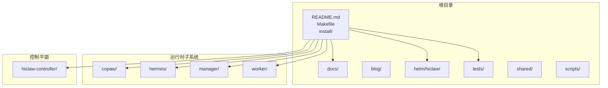
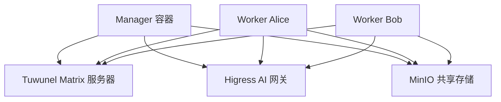
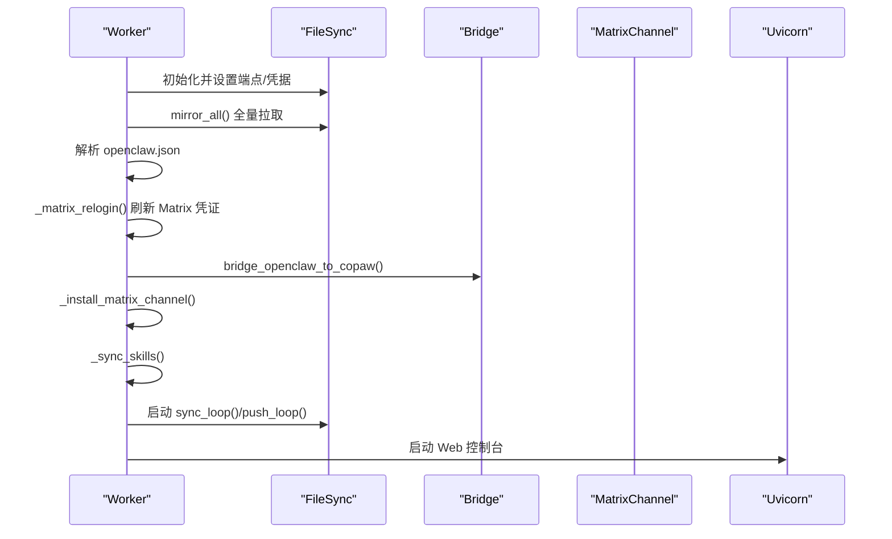
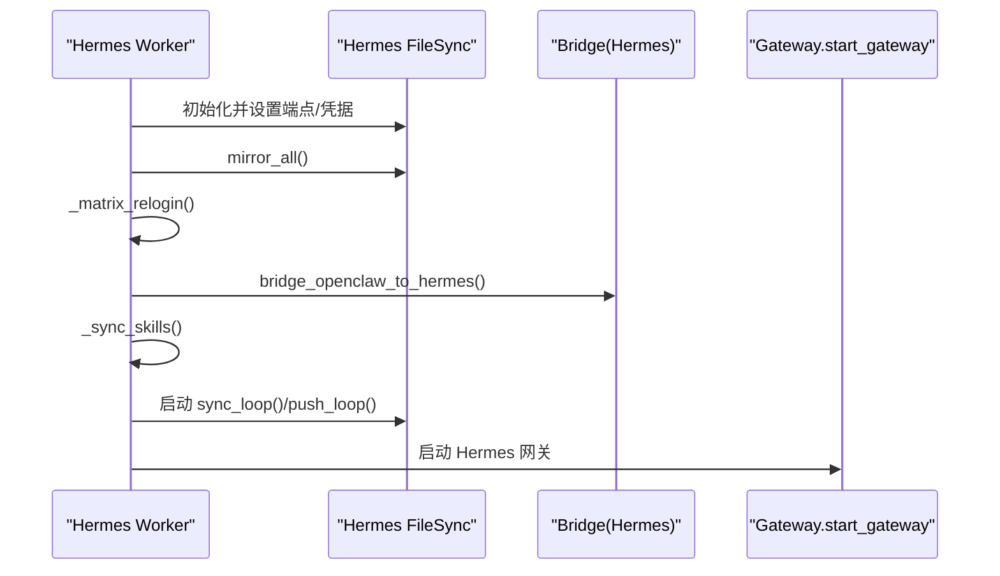
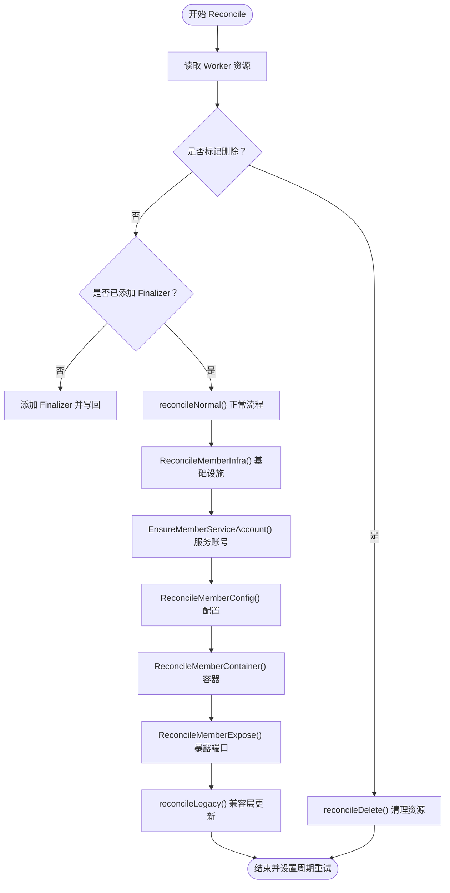
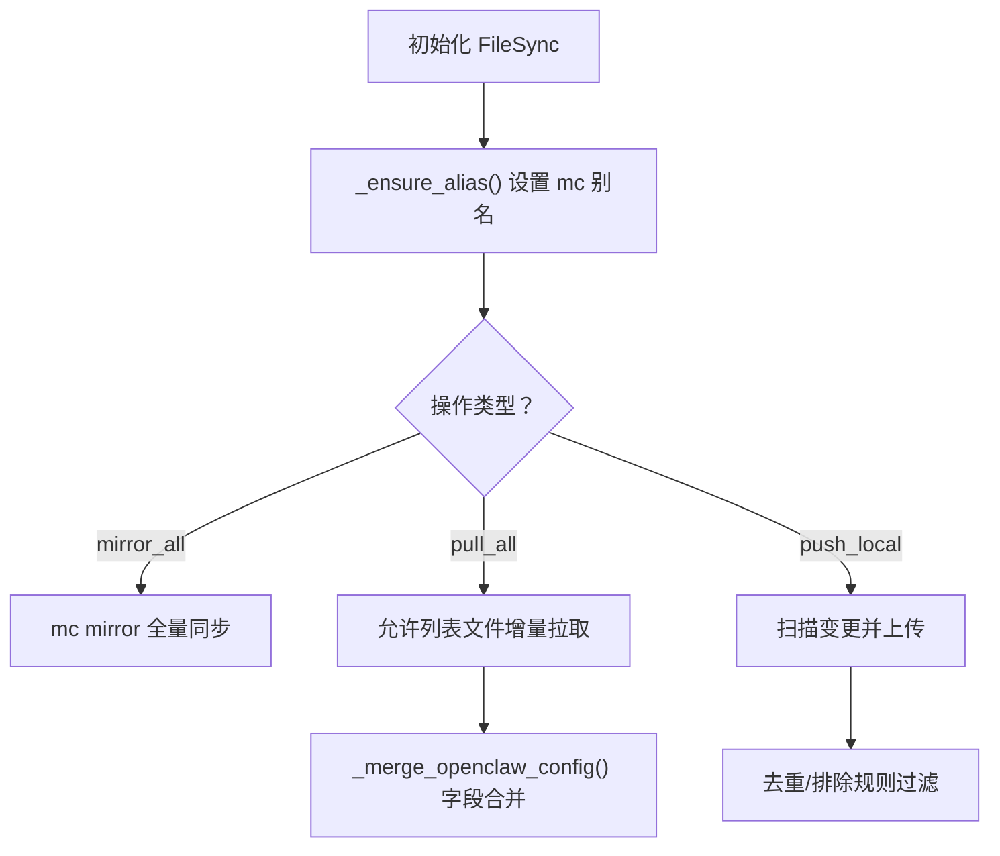
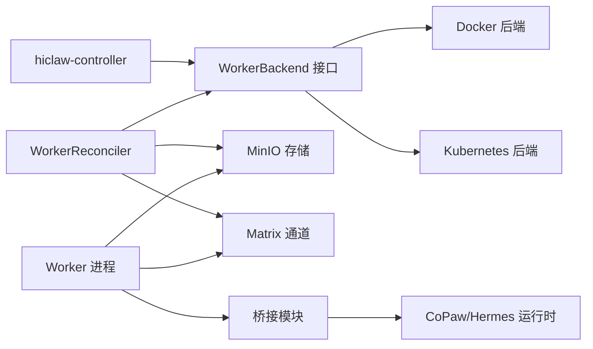

# 技能开发最佳实践

<cite>
**本文引用的文件**
- [README.md](file://README.md)
- [docs/development.md](file://docs/development.md)
- [copaw/src/copaw_worker/worker.py](file://copaw/src/copaw_worker/worker.py)
- [hermes/src/hermes_worker/worker.py](file://hermes/src/hermes_worker/worker.py)
- [hiclaw-controller/cmd/controller/main.go](file://hiclaw-controller/cmd/controller/main.go)
- [hiclaw-controller/internal/controller/worker_controller.go](file://hiclaw-controller/internal/controller/worker_controller.go)
- [hiclaw-controller/internal/backend/interface.go](file://hiclaw-controller/internal/backend/interface.go)
- [copaw/src/copaw_worker/sync.py](file://copaw/src/copaw_worker/sync.py)
- [hermes/src/hermes_worker/sync.py](file://hermes/src/hermes_worker/sync.py)
- [manager/agent/worker-agent/AGENTS.md](file://manager/agent/worker-agent/AGENTS.md)
- [manager/agent/skills/task-management/SKILL.md](file://manager/agent/skills/task-management/SKILL.md)
- [tests/test-01-manager-boot.sh](file://tests/test-01-manager-boot.sh)
- [tests/test-02-create-worker.sh](file://tests/test-02-create-worker.sh)
- [copaw/AGENTS.md](file://copaw/AGENTS.md)
</cite>

## 目录
1. [引言](#引言)
2. [项目结构](#项目结构)
3. [核心组件](#核心组件)
4. [架构总览](#架构总览)
5. [详细组件分析](#详细组件分析)
6. [依赖关系分析](#依赖关系分析)
7. [性能考量](#性能考量)
8. [故障排查指南](#故障排查指南)
9. [结论](#结论)
10. [附录](#附录)

## 引言
本指南面向 HiClaw 技能开发者与贡献者，系统阐述技能开发的代码规范、质量标准、错误处理与异常管理、性能优化、安全与合规、测试策略与质量保证、代码审查标准与常见问题预防。HiClaw 是一个基于 Manager-Workers 架构的多智能体协作运行时平台，强调人类在回路、可观测性与可审计性，并通过 MinIO 共享文件系统降低多智能体协作中的令牌消耗与状态同步成本。

## 项目结构
HiClaw 仓库采用模块化组织方式：
- 根目录包含安装脚本、文档、发布日志与 Helm 图表等
- copaw 与 hermes 子系统分别提供 Python 与 Hermes 自主编码运行时的 Worker 实现
- hiclaw-controller 提供 Kubernetes 原生控制平面（CRD、控制器、服务）
- manager 与 worker 分别承载 Manager 与 Worker 的容器镜像与脚本
- tests 提供端到端集成测试套件
- shared 与 scripts 提供共享库与工具脚本

图示来源
- [README.md:1-404](file://README.md#L1-L404)
- [docs/development.md:12-14](file://docs/development.md#L12-L14)

章节来源
- [README.md:1-404](file://README.md#L1-L404)
- [docs/development.md:12-14](file://docs/development.md#L12-L14)

## 核心组件
- Worker 进程：负责从 MinIO 拉取配置与技能，桥接为运行时配置，启动通道与代理循环；支持 CoPaw 与 Hermes 两种运行时
- 控制器（hiclaw-controller）：负责 Worker/Manager/Team 等资源的声明式编排与生命周期管理
- 文件同步（FileSync）：基于 mc CLI 的双向同步，确保 MinIO 与本地工作区一致
- 测试框架：端到端测试覆盖 Manager 启动、Worker 创建与任务流程

章节来源
- [copaw/src/copaw_worker/worker.py:32-177](file://copaw/src/copaw_worker/worker.py#L32-L177)
- [hermes/src/hermes_worker/worker.py:44-165](file://hermes/src/hermes_worker/worker.py#L44-L165)
- [hiclaw-controller/cmd/controller/main.go:16-36](file://hiclaw-controller/cmd/controller/main.go#L16-L36)
- [hiclaw-controller/internal/controller/worker_controller.go:57-151](file://hiclaw-controller/internal/controller/worker_controller.go#L57-L151)
- [copaw/src/copaw_worker/sync.py:114-184](file://copaw/src/copaw_worker/sync.py#L114-L184)
- [hermes/src/hermes_worker/sync.py:114-181](file://hermes/src/hermes_worker/sync.py#L114-L181)

## 架构总览
HiClaw 的核心是“Manager-Workers”架构，Manager 负责编排与协调，Worker 执行具体任务。所有 Agent 都通过 Matrix 协议进行可见且可干预的通信，Higress 作为统一网关承担流量与凭证管理，MinIO 提供共享文件系统以降低令牌消耗。

图示来源
- [README.md:240-333](file://README.md#L240-L333)

章节来源
- [README.md:240-333](file://README.md#L240-L333)

## 详细组件分析

### 组件一：CoPaw Worker 生命周期与启动流程
CoPaw Worker 的启动流程包括：确保 mc 可用、全量拉取 MinIO 内容、解析 openclaw.json、重新登录 Matrix 以刷新设备 ID、桥接配置到 CoPaw 工作区、安装 Matrix 通道、同步技能、启动后台同步循环，并最终启动 Uvicorn 服务。

图示来源
- [copaw/src/copaw_worker/worker.py:65-177](file://copaw/src/copaw_worker/worker.py#L65-L177)
- [copaw/src/copaw_worker/sync.py:225-263](file://copaw/src/copaw_worker/sync.py#L225-L263)

章节来源
- [copaw/src/copaw_worker/worker.py:65-177](file://copaw/src/copaw_worker/worker.py#L65-L177)
- [copaw/src/copaw_worker/sync.py:225-263](file://copaw/src/copaw_worker/sync.py#L225-L263)

### 组件二：Hermes Worker 生命周期与启动流程
Hermes Worker 的启动流程与 CoPaw 类似，但使用 hermes-agent 的网关入口，同样执行 mc 安装、全量拉取、Matrix 重登录、桥接配置、技能同步与后台同步循环，并启动 Hermes 网关。

图示来源
- [hermes/src/hermes_worker/worker.py:86-165](file://hermes/src/hermes_worker/worker.py#L86-L165)
- [hermes/src/hermes_worker/sync.py:222-265](file://hermes/src/hermes_worker/sync.py#L222-L265)

章节来源
- [hermes/src/hermes_worker/worker.py:86-165](file://hermes/src/hermes_worker/worker.py#L86-L165)
- [hermes/src/hermes_worker/sync.py:222-265](file://hermes/src/hermes_worker/sync.py#L222-L265)

### 组件三：控制器与成员编排
hiclaw-controller 通过 Reconcile 循环管理 Worker/Team/Manager 资源，执行基础设施准备、服务账号、配置、容器与暴露等阶段，并在删除时清理资源与回滚旧配置。

图示来源
- [hiclaw-controller/internal/controller/worker_controller.go:57-151](file://hiclaw-controller/internal/controller/worker_controller.go#L57-L151)
- [hiclaw-controller/internal/backend/interface.go:179-210](file://hiclaw-controller/internal/backend/interface.go#L179-L210)

章节来源
- [hiclaw-controller/internal/controller/worker_controller.go:57-151](file://hiclaw-controller/internal/controller/worker_controller.go#L57-L151)
- [hiclaw-controller/internal/backend/interface.go:179-210](file://hiclaw-controller/internal/backend/interface.go#L179-L210)

### 组件四：文件同步与冲突合并策略
FileSync 使用 mc CLI 在 MinIO 与本地之间进行镜像同步，支持：
- 全量拉取（mirror_all）
- 允许列表拉取（pull_all）
- 变更触发推送（push_local）
- openclaw.json 字段级合并（远程权威，本地保留 accessToken）

图示来源
- [copaw/src/copaw_worker/sync.py:114-184](file://copaw/src/copaw_worker/sync.py#L114-L184)
- [copaw/src/copaw_worker/sync.py:346-463](file://copaw/src/copaw_worker/sync.py#L346-L463)
- [copaw/src/copaw_worker/sync.py:487-604](file://copaw/src/copaw_worker/sync.py#L487-L604)
- [hermes/src/hermes_worker/sync.py:114-181](file://hermes/src/hermes_worker/sync.py#L114-L181)
- [hermes/src/hermes_worker/sync.py:346-457](file://hermes/src/hermes_worker/sync.py#L346-L457)
- [hermes/src/hermes_worker/sync.py:481-601](file://hermes/src/hermes_worker/sync.py#L481-L601)

章节来源
- [copaw/src/copaw_worker/sync.py:114-184](file://copaw/src/copaw_worker/sync.py#L114-L184)
- [copaw/src/copaw_worker/sync.py:346-463](file://copaw/src/copaw_worker/sync.py#L346-L463)
- [copaw/src/copaw_worker/sync.py:487-604](file://copaw/src/copaw_worker/sync.py#L487-L604)
- [hermes/src/hermes_worker/sync.py:114-181](file://hermes/src/hermes_worker/sync.py#L114-L181)
- [hermes/src/hermes_worker/sync.py:346-457](file://hermes/src/hermes_worker/sync.py#L346-L457)
- [hermes/src/hermes_worker/sync.py:481-601](file://hermes/src/hermes_worker/sync.py#L481-L601)

### 组件五：任务管理与沟通协议
Worker Agent 的工作区文档定义了任务执行、沟通协议、@mention 规则、内存与技能管理等关键约束，确保任务在无噪音的前提下高效流转。

章节来源
- [manager/agent/worker-agent/AGENTS.md:17-178](file://manager/agent/worker-agent/AGENTS.md#L17-L178)
- [manager/agent/skills/task-management/SKILL.md:1-30](file://manager/agent/skills/task-management/SKILL.md#L1-L30)

## 依赖关系分析
- Worker 与控制器通过 MinIO 与 Matrix 协同，控制器负责资源编排，Worker 负责运行时行为
- 文件同步模块是 Worker 与控制器之间的数据桥梁，确保配置与技能的一致性
- 不同运行时（CoPaw/Hermes/OpenClaw）共享同一套配置格式（openclaw.json），通过桥接转换为各自原生配置

图示来源
- [hiclaw-controller/internal/backend/interface.go:179-210](file://hiclaw-controller/internal/backend/interface.go#L179-L210)
- [hiclaw-controller/internal/controller/worker_controller.go:30-55](file://hiclaw-controller/internal/controller/worker_controller.go#L30-L55)
- [copaw/src/copaw_worker/worker.py:136-177](file://copaw/src/copaw_worker/worker.py#L136-L177)
- [hermes/src/hermes_worker/worker.py:136-165](file://hermes/src/hermes_worker/worker.py#L136-L165)

章节来源
- [hiclaw-controller/internal/backend/interface.go:179-210](file://hiclaw-controller/internal/backend/interface.go#L179-L210)
- [hiclaw-controller/internal/controller/worker_controller.go:30-55](file://hiclaw-controller/internal/controller/worker_controller.go#L30-L55)
- [copaw/src/copaw_worker/worker.py:136-177](file://copaw/src/copaw_worker/worker.py#L136-L177)
- [hermes/src/hermes_worker/worker.py:136-165](file://hermes/src/hermes_worker/worker.py#L136-L165)

## 性能考量
- 内存管理
  - Worker 进程通过桥接与工作区分离，避免重复加载配置；注意桥接过程中的环境变量与模块猴子补丁，避免重复初始化带来的额外开销
  - 合理设置日志级别，减少不必要的日志输出对 IO 的影响
- I/O 优化
  - 使用 mc mirror 进行全量与增量同步，结合 push_local 的变更检测与内容比较，避免重复上传
  - 对于技能与共享目录，采用按需拉取与去重策略，减少无效文件传输
- 网络请求处理
  - 控制器与 Worker 间通过 Higress 网关统一路由，建议启用连接池与超时控制，避免长轮询导致的资源占用
  - 在云模式下，通过 STS 凭证刷新机制降低频繁鉴权带来的延迟

章节来源
- [copaw/src/copaw_worker/sync.py:487-604](file://copaw/src/copaw_worker/sync.py#L487-L604)
- [hermes/src/hermes_worker/sync.py:481-601](file://hermes/src/hermes_worker/sync.py#L481-L601)
- [copaw/AGENTS.md:295-334](file://copaw/AGENTS.md#L295-L334)

## 故障排查指南
- 日志定位
  - Manager 容器：manager-agent.log、manager-agent-error.log、hiclaw-controller.log、higress-gateway.log、tuwunel.log
  - Worker 容器：stdout 与 .hiclaw-worker/<name>/ 下的日志文件
- 常见症状与修复
  - 管理器未响应：检查 Matrix 事件接收、通道策略与会话文件；确认 openclaw.json 与 .copaw/config.json 的 allowlist 配置
  - Worker 无法登录 Matrix：确认 _matrix_relogin 成功并写回 accessToken；检查密码在 MinIO 中是否存在
  - 同步风暴或频繁重启：关注每 5 分钟 re-bridge 导致的通道重启；必要时调整 sync_interval 或排查 MinIO 写入抖动
  - MCP 服务器配置不生效：确认桥接后的 providers.json 与 active_llm 是否正确；检查 Controller 的路由与消费者配置
- 测试辅助
  - 使用测试脚本验证 Manager 启动健康度、Worker 创建与任务流程；通过 metrics 基线对比评估性能变化

章节来源
- [copaw/AGENTS.md:295-403](file://copaw/AGENTS.md#L295-L403)
- [tests/test-01-manager-boot.sh:14-152](file://tests/test-01-manager-boot.sh#L14-L152)
- [tests/test-02-create-worker.sh:13-148](file://tests/test-02-create-worker.sh#L13-L148)

## 结论
HiClaw 的技能开发应遵循统一的配置格式（openclaw.json）、严格的文件同步策略与运行时桥接流程，确保跨运行时一致性与可审计性。通过明确的错误处理与日志策略、合理的性能优化手段、严格的安全与权限控制，以及完善的测试与质量保证体系，可以显著提升技能的稳定性与可维护性。

## 附录

### 代码规范与质量标准
- 命名约定
  - 变量与函数使用清晰语义命名，避免缩写；类名使用帕斯卡命名法，模块与文件使用蛇形命名法
  - 配置键与环境变量采用 SCREAMING_SNAKE_CASE，便于在不同运行时间保持一致
- 注释规范
  - 关键流程与复杂逻辑必须包含注释说明；对外接口与公共函数需提供简要说明
  - 对于桥接与同步模块，需标注字段映射与合并策略
- 文档要求
  - 每个技能需提供 SKILL.md，包含 YAML front matter、功能描述与使用参考
  - 重要变更需在 changelog 中记录，遵循统一格式

章节来源
- [docs/development.md:405-411](file://docs/development.md#L405-L411)
- [manager/agent/skills/task-management/SKILL.md:1-30](file://manager/agent/skills/task-management/SKILL.md#L1-L30)

### 错误处理与异常管理
- 错误分类
  - 启动期错误：配置缺失、矩阵登录失败、桥接失败
  - 运行期错误：同步失败、通道策略拒绝、LLM 调用超时
  - 资源错误：容器/Pod 状态异常、K8s API 权限不足
- 日志记录
  - 使用结构化日志输出关键上下文（时间戳、组件、事件、错误码）
  - 区分 stdout/stderr 用途，避免混杂
- 用户反馈机制
  - 通过 Matrix 通道发送可读性强的错误摘要与建议
  - 对于可恢复错误，提供重试提示与最小可行修复步骤

章节来源
- [copaw/src/copaw_worker/worker.py:92-103](file://copaw/src/copaw_worker/worker.py#L92-L103)
- [hermes/src/hermes_worker/worker.py:110-119](file://hermes/src/hermes_worker/worker.py#L110-L119)
- [copaw/AGENTS.md:295-334](file://copaw/AGENTS.md#L295-L334)

### 性能优化方法
- 内存管理
  - 避免重复初始化桥接模块；合理缓存配置解析结果
  - 控制会话文件大小与数量，定期清理过期历史
- I/O 优化
  - 使用 push_local 的 mtime 与内容比较，减少无效上传
  - 对大文件与共享目录采用增量同步策略
- 网络请求处理
  - 合理设置超时与重试；对 Higress 路由进行健康检查与降级策略

章节来源
- [copaw/src/copaw_worker/sync.py:487-604](file://copaw/src/copaw_worker/sync.py#L487-L604)
- [hermes/src/hermes_worker/sync.py:481-601](file://hermes/src/hermes_worker/sync.py#L481-L601)

### 安全性考虑
- 输入验证
  - 对来自 Matrix 的消息进行白名单校验，限制 @mention 与命令范围
  - 对 openclaw.json 的字段进行白名单与类型校验
- 权限检查
  - 通过控制器的授权器与服务账号策略，限制 Worker 的操作范围
  - 确保凭据仅在网关侧持有，Worker 仅使用消费级令牌
- 敏感数据保护
  - 禁止在聊天中泄露密钥与令牌；对日志进行脱敏处理
  - 使用加密存储与最小权限原则管理 MinIO 与数据库

章节来源
- [README.md:268-277](file://README.md#L268-L277)
- [manager/agent/worker-agent/AGENTS.md:170-178](file://manager/agent/worker-agent/AGENTS.md#L170-L178)

### 测试策略与质量保证
- 单元测试
  - 对桥接与同步模块的关键函数进行单元测试，覆盖字段合并、路径计算与排除规则
- 集成测试
  - 使用端到端测试脚本验证 Manager 启动、Worker 创建与任务执行链路
  - 通过 metrics 基线对比评估性能回归
- 回归测试
  - 在每次变更后运行完整测试套件，确保跨运行时兼容性

章节来源
- [tests/test-01-manager-boot.sh:14-152](file://tests/test-01-manager-boot.sh#L14-L152)
- [tests/test-02-create-worker.sh:13-148](file://tests/test-02-create-worker.sh#L13-L148)
- [copaw/AGENTS.md:285-294](file://copaw/AGENTS.md#L285-L294)

### 代码审查标准与检查清单
- 代码层面
  - 是否遵循命名与注释规范
  - 是否存在重复初始化与全局状态污染
  - 是否正确处理异步取消与资源释放
- 安全层面
  - 是否存在硬编码凭据与敏感信息
  - 是否对输入进行了白名单与长度限制
- 性能层面
  - 是否避免不必要的磁盘与网络 I/O
  - 是否使用了合理的超时与重试策略
- 测试层面
  - 是否补充了相关单元与集成测试
  - 是否提供了足够的日志与可观测性

章节来源
- [docs/development.md:405-411](file://docs/development.md#L405-L411)
- [copaw/AGENTS.md:437-462](file://copaw/AGENTS.md#L437-L462)