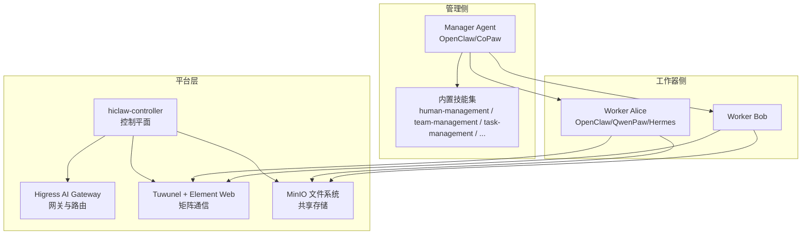
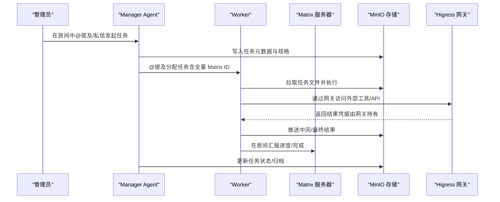
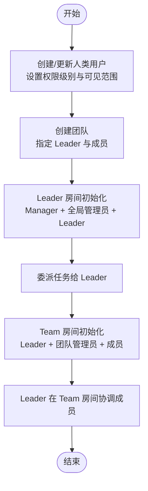
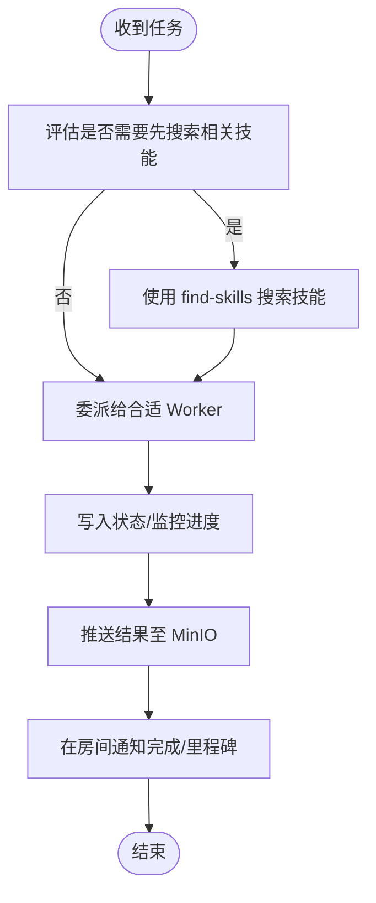
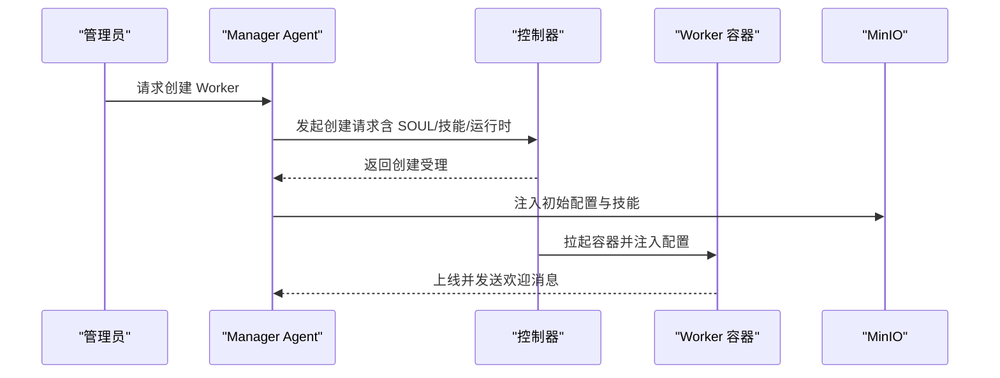
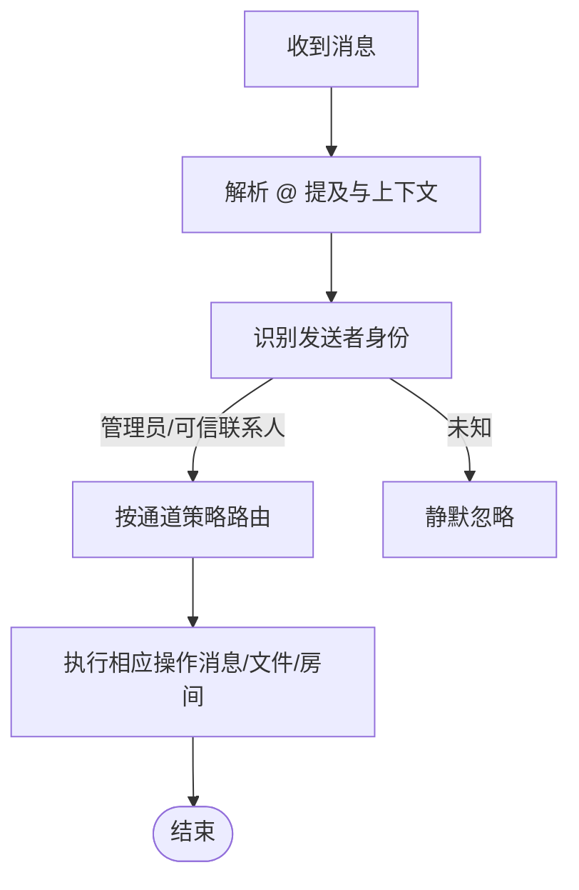
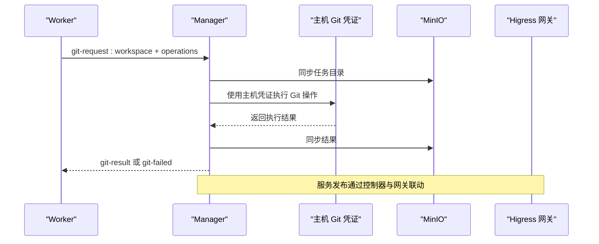
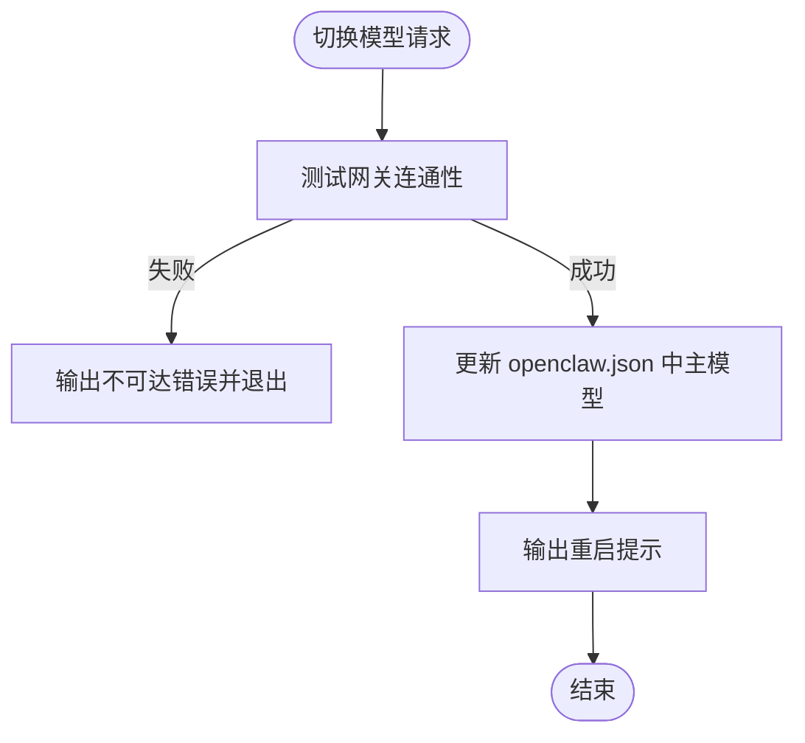
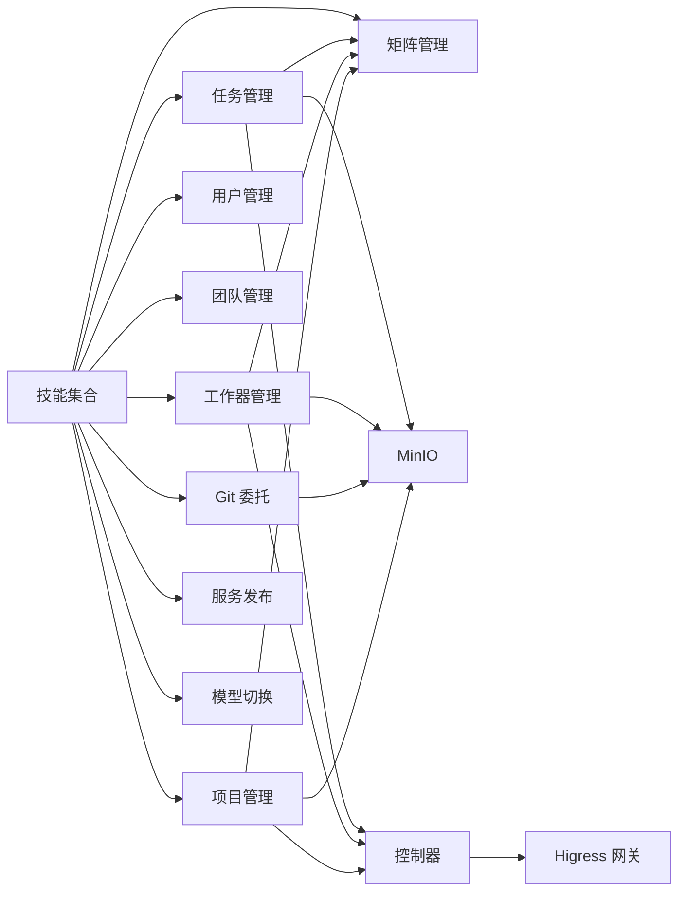

# 示例与最佳实践

<cite>
**本文引用的文件**
- [README.md](file://README.md)
- [docs/quickstart.md](file://docs/quickstart.md)
- [docs/development.md](file://docs/development.md)
- [manager/agent/skills/human-management/SKILL.md](file://manager/agent/skills/human-management/SKILL.md)
- [manager/agent/skills/team-management/SKILL.md](file://manager/agent/skills/team-management/SKILL.md)
- [manager/agent/skills/task-management/SKILL.md](file://manager/agent/skills/task-management/SKILL.md)
- [manager/agent/skills/worker-management/SKILL.md](file://manager/agent/skills/worker-management/SKILL.md)
- [manager/agent/skills/channel-management/SKILL.md](file://manager/agent/skills/channel-management/SKILL.md)
- [manager/agent/skills/project-management/SKILL.md](file://manager/agent/skills/project-management/SKILL.md)
- [manager/agent/skills/matrix-server-management/SKILL.md](file://manager/agent/skills/matrix-server-management/SKILL.md)
- [manager/agent/skills/git-delegation-management/SKILL.md](file://manager/agent/skills/git-delegation-management/SKILL.md)
- [manager/agent/skills/service-publishing/SKILL.md](file://manager/agent/skills/service-publishing/SKILL.md)
- [manager/agent/skills/model-switch/SKILL.md](file://manager/agent/skills/model-switch/SKILL.md)
- [manager/agent/copaw-manager-agent/AGENTS.md](file://manager/agent/copaw-manager-agent/AGENTS.md)
- [manager/agent/hermes-worker-agent/AGENTS.md](file://manager/agent/hermes-worker-agent/AGENTS.md)
- [tests/skills/hiclaw-test/SKILL.md](file://tests/skills/hiclaw-test/SKILL.md)
</cite>

## 目录
1. [简介](#简介)
2. [项目结构](#项目结构)
3. [核心组件](#核心组件)
4. [架构总览](#架构总览)
5. [详细组件分析](#详细组件分析)
6. [依赖关系分析](#依赖关系分析)
7. [性能考量](#性能考量)
8. [故障排查指南](#故障排查指南)
9. [结论](#结论)
10. [附录](#附录)

## 简介
本指南面向 HiClaw 技能开发者与平台使用者，提供从入门到进阶的完整技能开发示例与最佳实践。内容覆盖：
- 基础技能：用户与团队管理、任务委派、工作器生命周期与技能管理
- 高级场景：多 Worker 协作、矩阵服务器管理、Git 委托、服务发布、模型切换
- 设计模式与架构原则：模块化、可扩展性、可维护性
- 最佳实践：代码规范、错误处理、性能优化、安全与隐私
- 社区经验与常见陷阱
- 实战案例与代码审查要点

## 项目结构
HiClaw 采用 Manager-Workers 架构，Manager 负责编排与可见性，Workers 执行具体任务。技能以 SKILL.md 文档形式定义，配合脚本与参考文档实现端到端能力。

图示来源
- [README.md:305-333](file://README.md#L305-L333)

章节来源
- [README.md:13-333](file://README.md#L13-L333)
- [docs/quickstart.md:13-77](file://docs/quickstart.md#L13-L77)

## 核心组件
- Manager Agent：统一编排入口，负责人类可见性、任务委派、权限与身份管理、心跳与状态治理。
- Worker：执行具体任务，支持多种运行时（OpenClaw/QwenPaw/Hermes），通过矩阵与共享存储协作。
- 内置技能：以 SKILL.md 定义，配套脚本与参考文档，覆盖用户/团队/任务/工作器/项目/矩阵/服务/Git/模型等能力域。
- 控制面：控制器负责资源声明式管理、凭证与路由配置、容器生命周期与环境注入。

章节来源
- [docs/quickstart.md:13-77](file://docs/quickstart.md#L13-L77)
- [manager/agent/skills/human-management/SKILL.md:1-45](file://manager/agent/skills/human-management/SKILL.md#L1-L45)
- [manager/agent/skills/team-management/SKILL.md:1-48](file://manager/agent/skills/team-management/SKILL.md#L1-L48)
- [manager/agent/skills/task-management/SKILL.md:1-30](file://manager/agent/skills/task-management/SKILL.md#L1-L30)
- [manager/agent/skills/worker-management/SKILL.md:1-83](file://manager/agent/skills/worker-management/SKILL.md#L1-L83)
- [manager/agent/skills/project-management/SKILL.md:1-37](file://manager/agent/skills/project-management/SKILL.md#L1-L37)
- [manager/agent/skills/matrix-server-management/SKILL.md:1-23](file://manager/agent/skills/matrix-server-management/SKILL.md#L1-L23)
- [manager/agent/skills/git-delegation-management/SKILL.md:1-167](file://manager/agent/skills/git-delegation-management/SKILL.md#L1-L167)
- [manager/agent/skills/service-publishing/SKILL.md:1-92](file://manager/agent/skills/service-publishing/SKILL.md#L1-L92)
- [manager/agent/skills/model-switch/SKILL.md:1-83](file://manager/agent/skills/model-switch/SKILL.md#L1-L83)

## 架构总览
下图展示 Manager 与 Worker 的交互路径、共享存储与网关的作用。

图示来源
- [README.md:240-289](file://README.md#L240-L289)
- [manager/agent/skills/task-management/SKILL.md:8-19](file://manager/agent/skills/task-management/SKILL.md#L8-L19)
- [manager/agent/skills/git-delegation-management/SKILL.md:12-16](file://manager/agent/skills/git-delegation-management/SKILL.md#L12-L16)

## 详细组件分析

### 组件一：用户与团队管理（Human/Team Management）
- 用户管理：支持按层级导入真实人类账户，自动注册 Matrix 账号，配置权限与可见范围。
- 团队管理：Team 包含 Team Leader + 多个 Worker；Manager 仅与 Leader 交互，Leader 负责在 Team 房间内协调。

图示来源
- [manager/agent/skills/human-management/SKILL.md:18-36](file://manager/agent/skills/human-management/SKILL.md#L18-L36)
- [manager/agent/skills/team-management/SKILL.md:10-37](file://manager/agent/skills/team-management/SKILL.md#L10-L37)

章节来源
- [manager/agent/skills/human-management/SKILL.md:1-45](file://manager/agent/skills/human-management/SKILL.md#L1-L45)
- [manager/agent/skills/team-management/SKILL.md:1-48](file://manager/agent/skills/team-management/SKILL.md#L1-L48)

### 组件二：任务管理与项目管理（Task/Project Management）
- 任务管理：优先委派给 Worker；禁止 Worker 幻觉未知领域；使用状态文件原子更新；无限任务需心跳触发。
- 项目管理：单源计划文件（plan.md）、项目房间、任务生命周期与变更流程。

图示来源
- [manager/agent/skills/task-management/SKILL.md:8-19](file://manager/agent/skills/task-management/SKILL.md#L8-L19)
- [manager/agent/skills/project-management/SKILL.md:16-25](file://manager/agent/skills/project-management/SKILL.md#L16-L25)

章节来源
- [manager/agent/skills/task-management/SKILL.md:1-30](file://manager/agent/skills/task-management/SKILL.md#L1-L30)
- [manager/agent/skills/project-management/SKILL.md:1-37](file://manager/agent/skills/project-management/SKILL.md#L1-L37)

### 组件三：工作器管理与技能生态（Worker/技能）
- 工作器管理：创建/启动/停止/重置/删除；动态切换运行时；启用/禁用同 Worker 互 @；推送/移除技能。
- 技能生态：每个技能以 SKILL.md 定义，包含前置条件、操作步骤、参考文档与脚本路径。

图示来源
- [manager/agent/skills/worker-management/SKILL.md:8-31](file://manager/agent/skills/worker-management/SKILL.md#L8-L31)
- [manager/agent/copaw-manager-agent/AGENTS.md:103-113](file://manager/agent/copaw-manager-agent/AGENTS.md#L103-L113)

章节来源
- [manager/agent/skills/worker-management/SKILL.md:1-83](file://manager/agent/skills/worker-management/SKILL.md#L1-L83)
- [manager/agent/copaw-manager-agent/AGENTS.md:1-249](file://manager/agent/copaw-manager-agent/AGENTS.md#L1-L249)

### 组件四：矩阵服务器与通道管理（Matrix/Channel）
- 矩阵管理：注册用户、创建房间、管理成员、上传文件；Worker 必须带 @ 提及才被处理。
- 通道管理：识别发送者身份、可信联系人、主通知通道、首次接触协议与跨通道升级。

图示来源
- [manager/agent/skills/matrix-server-management/SKILL.md:10-17](file://manager/agent/skills/matrix-server-management/SKILL.md#L10-L17)
- [manager/agent/skills/channel-management/SKILL.md:11-20](file://manager/agent/skills/channel-management/SKILL.md#L11-L20)

章节来源
- [manager/agent/skills/matrix-server-management/SKILL.md:1-23](file://manager/agent/skills/matrix-server-management/SKILL.md#L1-L23)
- [manager/agent/skills/channel-management/SKILL.md:1-30](file://manager/agent/skills/channel-management/SKILL.md#L1-L30)

### 组件五：Git 委托与服务发布（Git/Service）
- Git 委托：Worker 将 Git 操作委托给 Manager，Manager 以主机 Git 凭证执行，避免 Worker 暴露敏感信息。
- 服务发布：通过 Higress 网关将 Worker 内部服务暴露为域名，便于外部访问。

图示来源
- [manager/agent/skills/git-delegation-management/SKILL.md:20-111](file://manager/agent/skills/git-delegation-management/SKILL.md#L20-L111)
- [manager/agent/skills/service-publishing/SKILL.md:12-92](file://manager/agent/skills/service-publishing/SKILL.md#L12-L92)

章节来源
- [manager/agent/skills/git-delegation-management/SKILL.md:1-167](file://manager/agent/skills/git-delegation-management/SKILL.md#L1-L167)
- [manager/agent/skills/service-publishing/SKILL.md:1-92](file://manager/agent/skills/service-publishing/SKILL.md#L1-L92)

### 组件六：模型切换与测试（Model/Test）
- 模型切换：验证网关连通后更新 Manager 主模型，输出重启提示。
- 测试：提供测试技能与测试套件，覆盖安装、任务委派、协作、权限控制等场景。

图示来源
- [manager/agent/skills/model-switch/SKILL.md:23-55](file://manager/agent/skills/model-switch/SKILL.md#L23-L55)

章节来源
- [manager/agent/skills/model-switch/SKILL.md:1-83](file://manager/agent/skills/model-switch/SKILL.md#L1-L83)
- [tests/skills/hiclaw-test/SKILL.md](file://tests/skills/hiclaw-test/SKILL.md)

## 依赖关系分析
- Manager 与 Worker 通过矩阵房间与共享存储解耦，任务通过 MinIO 传递，外部凭据通过网关代理。
- 技能之间存在组合关系：任务委派依赖工作器管理与项目管理；Git 委托依赖任务协调与 MinIO 同步。
- 控制器作为控制平面，协调 Worker 生命周期、路由与凭证，确保一致性与可审计性。

图示来源
- [manager/agent/skills/task-management/SKILL.md:20-30](file://manager/agent/skills/task-management/SKILL.md#L20-L30)
- [manager/agent/skills/worker-management/SKILL.md:45-60](file://manager/agent/skills/worker-management/SKILL.md#L45-L60)
- [manager/agent/skills/project-management/SKILL.md:27-37](file://manager/agent/skills/project-management/SKILL.md#L27-L37)
- [manager/agent/skills/git-delegation-management/SKILL.md:153-156](file://manager/agent/skills/git-delegation-management/SKILL.md#L153-L156)
- [manager/agent/skills/service-publishing/SKILL.md:12-22](file://manager/agent/skills/service-publishing/SKILL.md#L12-L22)

章节来源
- [README.md:240-333](file://README.md#L240-L333)
- [docs/development.md:205-231](file://docs/development.md#L205-L231)

## 性能考量
- 任务委派优先：避免 Manager 自行执行可由 Worker 完成的任务，减少 Manager 计算与令牌消耗。
- 状态原子更新：使用状态管理脚本更新 state.json，避免竞态与重复计算。
- 文件同步策略：MinIO 同步为异步兜底，关键路径先推送再 @ 提醒，避免 Worker 空同步。
- 无限任务触发：通过心跳周期触发执行，避免高频轮询造成令牌浪费。
- 运行时选择：根据任务特性选择合适运行时（OpenClaw/QwenPaw/Hermes），平衡推理与执行效率。

章节来源
- [manager/agent/skills/task-management/SKILL.md:10-19](file://manager/agent/skills/task-management/SKILL.md#L10-L19)
- [manager/agent/skills/worker-management/SKILL.md:33-44](file://manager/agent/skills/worker-management/SKILL.md#L33-L44)
- [manager/agent/hermes-worker-agent/AGENTS.md:153-172](file://manager/agent/hermes-worker-agent/AGENTS.md#L153-L172)

## 故障排查指南
- 日志定位：Manager 日志、Higress/Tuwunel/MinIO 状态检查、Replay 会话日志导出。
- 常见问题：Node 版本不满足、OpenClaw 网关配置缺失、技能未加载（缺少 YAML front matter）、代理导致健康检查失败。
- 调试技巧：使用 openclaw skills list 检查技能加载；通过 Higress Console 检查消费者/路由/提供商；使用 mc 检查 MinIO 前缀与对象。

章节来源
- [docs/development.md:412-498](file://docs/development.md#L412-L498)
- [docs/quickstart.md:13-77](file://docs/quickstart.md#L13-L77)

## 结论
HiClaw 的技能体系以“文档即接口”的方式实现模块化与可扩展性：每个技能独立、职责清晰，并通过脚本与参考文档形成闭环。遵循本文最佳实践，可在保证安全与可见性的前提下，快速构建从简单到复杂的协作场景。

## 附录

### A. 开发与测试清单
- 本地安装与回放：一键安装 Manager，使用 replay 发送任务验证。
- 测试套件：按需运行特定测试，或跳过镜像构建进行快速迭代。
- CI/CD：多架构构建与推送、集成测试流水线、必要密钥准备。

章节来源
- [docs/development.md:93-164](file://docs/development.md#L93-L164)
- [docs/development.md:165-204](file://docs/development.md#L165-L204)
- [docs/development.md:232-262](file://docs/development.md#L232-L262)

### B. 社区经验与常见陷阱
- 不要直接在管理员 DM 中嵌入 @Worker 任务分配；应通过 Worker 房间分发。
- Worker 互 @ 需谨慎，避免噪声与循环；仅在阻塞/里程碑时 @ 提及。
- 无限任务不要在报告中频繁触发执行，应通过心跳驱动。
- 切换 Worker 运行时为破坏性操作，需提前确认并避免在任务中途切换。

章节来源
- [manager/agent/copaw-manager-agent/AGENTS.md:68-72](file://manager/agent/copaw-manager-agent/AGENTS.md#L68-L72)
- [manager/agent/skills/worker-management/SKILL.md:61-83](file://manager/agent/skills/worker-management/SKILL.md#L61-L83)
- [manager/agent/hermes-worker-agent/AGENTS.md:135-143](file://manager/agent/hermes-worker-agent/AGENTS.md#L135-L143)

### C. 代码审查要点
- SKILL.md 是否包含必需 YAML front matter（name/description）。
- 脚本是否正确处理返回码与错误输出，是否幂等与可重试。
- 是否遵循最小权限原则，敏感信息不通过消息明文传输。
- 是否使用状态管理脚本原子更新，避免竞态。
- 是否提供充分的参考文档链接与示例命令。

章节来源
- [docs/development.md:405-411](file://docs/development.md#L405-L411)
- [manager/agent/skills/git-delegation-management/SKILL.md:159-167](file://manager/agent/skills/git-delegation-management/SKILL.md#L159-L167)