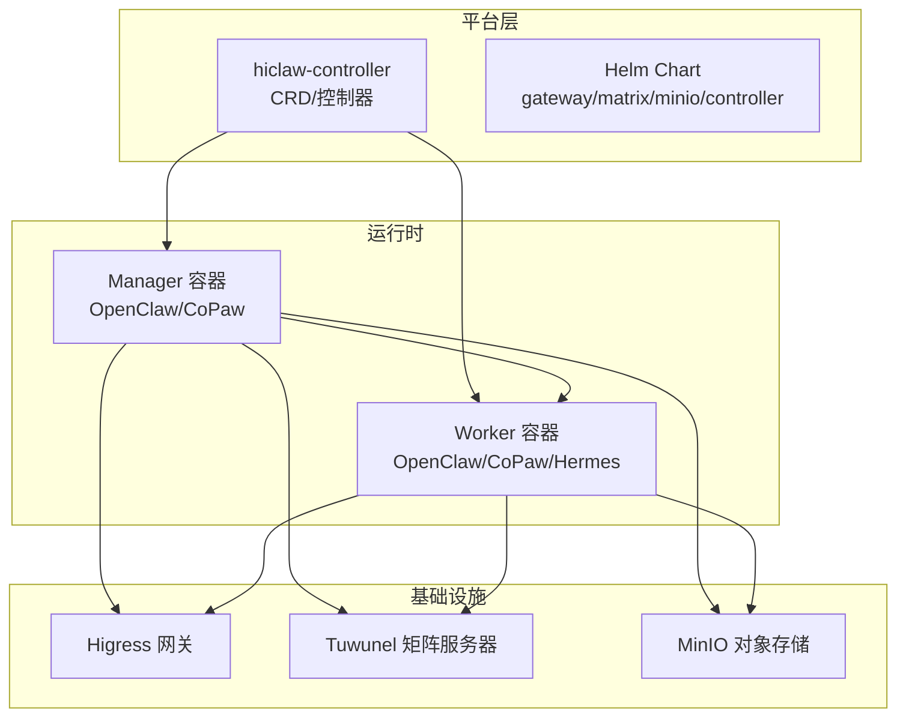
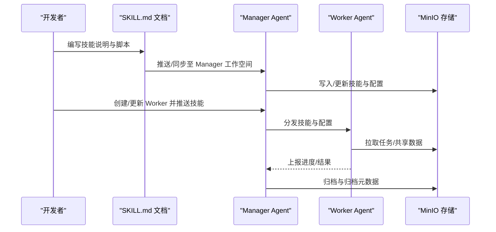
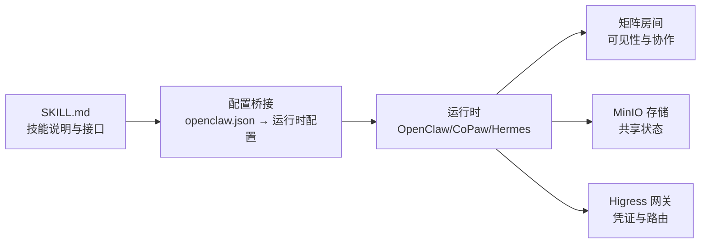

# 社区技能开发经验

<cite>
**本文引用的文件**
- [README.md](file://README.md)
- [AGENTS.md](file://AGENTS.md)
- [docs/development.md](file://docs/development.md)
- [manager/agent/AGENTS.md](file://manager/agent/AGENTS.md)
- [manager/agent/SOUL.md](file://manager/agent/SOUL.md)
- [manager/agent/HEARTBEAT.md](file://manager/agent/HEARTBEAT.md)
- [manager/agent/skills/worker-management/SKILL.md](file://manager/agent/skills/worker-management/SKILL.md)
- [manager/agent/skills/project-management/SKILL.md](file://manager/agent/skills/project-management/SKILL.md)
- [manager/agent/skills/task-management/SKILL.md](file://manager/agent/skills/task-management/SKILL.md)
- [migrate/skill/SKILL.md](file://migrate/skill/SKILL.md)
- [copaw/README.md](file://copaw/README.md)
- [hermes/README.md](file://hermes/README.md)
- [manager/README.md](file://manager/README.md)
- [changelog/current.md](file://changelog/current.md)
</cite>

## 目录
1. [引言](#引言)
2. [项目结构](#项目结构)
3. [核心组件](#核心组件)
4. [架构总览](#架构总览)
5. [详细组件分析](#详细组件分析)
6. [依赖关系分析](#依赖关系分析)
7. [性能与可维护性考量](#性能与可维护性考量)
8. [故障排查指南](#故障排查指南)
9. [结论](#结论)
10. [附录](#附录)

## 引言
本文件面向 HiClaw 社区技能开发者，系统化总结技能开发的成功经验与失败教训，给出技能发布与质量控制的标准流程，并覆盖技能打包、分发、版本管理、兼容性与向后兼容性、协作模式（贡献、评审、沟通）、维护与更新策略、统计数据与用户反馈分析，以及常见陷阱与规避方法。目标是帮助开发者以一致、可复用的方式构建高质量的社区技能，提升多智能体协作效率与稳定性。

## 项目结构
HiClaw 采用“Manager-Workers 架构”，通过 Kubernetes 控制器与 Helm 图表实现声明式资源管理；Manager 负责编排与可见性，Worker 承担具体任务执行。技能作为可发现的自描述单元，分布在 Manager 与 Worker 的工作空间中，通过 MinIO 共享状态，确保 Worker 无状态、可重建。

图示来源
- [AGENTS.md:100-101](file://AGENTS.md#L100-L101)
- [manager/README.md:3-11](file://manager/README.md#L3-L11)

章节来源
- [AGENTS.md:9-31](file://AGENTS.md#L9-L31)
- [manager/README.md:3-11](file://manager/README.md#L3-L11)

## 核心组件
- 技能定义与加载：技能以 SKILL.md 自描述，位于 Manager/Worker 工作空间或内置模板树下，遵循统一格式与命名规范，由 Agent 运行时自动发现与加载。
- 工作空间与共享存储：Manager/Worker 的本地工作空间与共享目录通过 MinIO 同步，确保状态集中、可审计、可回放。
- 管理与编排：Manager 提供心跳、任务与项目管理、Worker 生命周期与技能管理等能力；控制器负责 CRD 的一致性与资源编排。
- 多运行时支持：OpenClaw、CoPaw、Hermes 三种 Worker 运行时可共存于同一房间，按需切换，保持矩阵通信与策略一致。

章节来源
- [docs/development.md:373-387](file://docs/development.md#L373-L387)
- [manager/agent/AGENTS.md:1-10](file://manager/agent/AGENTS.md#L1-L10)
- [manager/agent/SOUL.md:1-51](file://manager/agent/SOUL.md#L1-L51)
- [manager/agent/HEARTBEAT.md:1-30](file://manager/agent/HEARTBEAT.md#L1-L30)

## 架构总览
技能在 HiClaw 中的生命周期：设计与编写 → 内置模板与工作空间同步 → 发布与导入 → 使用与反馈 → 维护与迭代。Manager 侧负责规则与流程，Worker 侧负责执行与结果产出，二者通过矩阵房间与 MinIO 协同。

图示来源
- [manager/agent/AGENTS.md:44-50](file://manager/agent/AGENTS.md#L44-L50)
- [manager/agent/skills/worker-management/SKILL.md:45-60](file://manager/agent/skills/worker-management/SKILL.md#L45-L60)

## 详细组件分析

### 技能开发与发布标准流程
- 设计阶段：明确技能边界、输入输出、调用工具、错误处理与安全约束，参考现有技能的 SKILL.md 前言块与参考文档。
- 编写规范：使用统一的 YAML 前言块与清晰的步骤说明；避免第三方平台特定语法，确保跨运行时可用。
- 质量要求：提供最小可运行示例、常见问题与边界条件处理；对敏感信息进行脱敏与最小权限原则。
- 发布前检查：确认技能被 Agent 正确发现与加载；在 Manager/Worker 工作空间验证脚本可执行与路径正确。
- 版本与变更记录：所有影响镜像内容的改动必须记录在变更日志中，便于追踪与回滚。

章节来源
- [docs/development.md:405-411](file://docs/development.md#L405-L411)
- [docs/development.md:373-387](file://docs/development.md#L373-L387)
- [changelog/current.md:1-12](file://changelog/current.md#L1-L12)

### 技能打包、分发与版本管理最佳实践
- 打包策略：将技能所需脚本、配置与参考文档打包到独立目录，避免与运行时耦合；必要时生成轻量 Dockerfile（如迁移场景）。
- 分发渠道：优先通过内置模板与 Manager/Worker 同步机制分发；对于外部模板市场，建议使用标准化的注册中心协议与校验机制。
- 版本管理：以语义化版本管理技能包；在变更日志中记录每次镜像相关改动；发布前进行兼容性回归测试。
- 向后兼容：避免破坏性变更；对不兼容升级提供迁移脚本与过渡期策略；在 SKILL.md 中标注兼容范围与迁移指引。

章节来源
- [migrate/skill/SKILL.md:152-181](file://migrate/skill/SKILL.md#L152-L181)
- [docs/development.md:58-76](file://docs/development.md#L58-L76)
- [changelog/current.md:7-11](file://changelog/current.md#L7-L11)

### 兼容性测试与向后兼容性考虑
- 运行时兼容：OpenClaw/CoPaw/Hermes 的差异通过桥接与适配层抽象；技能应尽量使用通用接口与公共工具。
- 网络与凭证：技能不应直接访问真实凭证，通过网关与消费者令牌进行受控访问；对不同提供商的 API 差异进行适配。
- 文件系统与同步：MinIO 作为单一事实源，技能读写需遵循同步约定，避免竞态与数据丢失。

章节来源
- [hermes/README.md:54-72](file://hermes/README.md#L54-L72)
- [manager/agent/AGENTS.md:44-49](file://manager/agent/AGENTS.md#L44-L49)

### 协作模式：贡献、评审与沟通
- 贡献指南：遵循统一的代码风格与文档规范；提交前在本地完成集成测试与最小样例验证。
- 代码评审：重点评审技能边界、安全性、可维护性与兼容性；确保变更日志完整。
- 社区沟通：使用矩阵房间进行可见性与可干预的协作；重大变更提前在社区公告与讨论区同步。

章节来源
- [docs/development.md:405-411](file://docs/development.md#L405-L411)
- [README.md:396-400](file://README.md#L396-L400)

### 技能维护与更新策略
- Bug 修复：优先定位到具体技能与脚本，结合日志与回放工具复现；修复后回归测试并更新变更日志。
- 功能增强：新增能力需保持向后兼容；提供渐进式迁移方案与降级路径。
- 废弃处理：对不再维护的技能提供替代方案与迁移指引；在公告与文档中标注停用时间线。

章节来源
- [docs/development.md:412-498](file://docs/development.md#L412-L498)
- [manager/agent/HEARTBEAT.md:177-192](file://manager/agent/HEARTBEAT.md#L177-L192)

### 技能使用的统计数据与用户反馈
- 数据采集：通过矩阵消息与 Agent 会话日志导出工具收集行为数据；结合 MinIO 中的任务与结果目录进行统计分析。
- 反馈闭环：建立定期回顾机制，汇总高频问题与改进建议；在 Manager/Worker 的记忆文件中沉淀经验。

章节来源
- [README.md:363-379](file://README.md#L363-L379)
- [manager/agent/AGENTS.md:84-106](file://manager/agent/AGENTS.md#L84-L106)

### 常见陷阱与规避方法
- 误用第三方平台通道：技能应基于矩阵与通用工具，避免硬编码 Discord/Slack 等通道。
- 忽视运行时差异：不同运行时的启动与配置存在差异，需通过桥接或模板隔离差异。
- 不当的文件同步：先写入 MinIO 再通知 Worker，避免空同步导致的阻塞。
- 未遵循最小权限：技能不应直接暴露真实凭证，通过网关与消费者令牌受控访问。

章节来源
- [migrate/skill/SKILL.md:78-98](file://migrate/skill/SKILL.md#L78-L98)
- [manager/agent/AGENTS.md:67-71](file://manager/agent/AGENTS.md#L67-L71)
- [hermes/README.md:73-82](file://hermes/README.md#L73-L82)

## 依赖关系分析
技能开发与运行依赖围绕“文档驱动 + 配置桥接 + 工具链”的模式展开：SKILL.md 描述能力与接口，openclaw.json/环境变量桥接运行时配置，MinIO 提供共享状态，矩阵房间承载可见性与协作。

图示来源
- [hermes/README.md:54-72](file://hermes/README.md#L54-L72)
- [manager/agent/AGENTS.md:44-49](file://manager/agent/AGENTS.md#L44-L49)

章节来源
- [hermes/README.md:54-72](file://hermes/README.md#L54-L72)
- [manager/agent/AGENTS.md:44-49](file://manager/agent/AGENTS.md#L44-L49)

## 性能与可维护性考量
- 性能优化：减少不必要的文件同步与网络往返；优先使用增量更新与原子操作；避免在心跳中重复触发相同任务。
- 可维护性：保持 SKILL.md 结构化与可检索；为复杂技能拆分子模块与可选依赖；提供清晰的错误提示与重试策略。
- 可观测性：启用日志导出与回放工具，结合矩阵消息与会话日志进行根因分析。

章节来源
- [docs/development.md:412-498](file://docs/development.md#L412-L498)
- [manager/agent/HEARTBEAT.md:119-120](file://manager/agent/HEARTBEAT.md#L119-L120)

## 故障排查指南
- 日志定位：查看 Manager/Controller 的日志与 Higress/Tuwunel 的状态；使用回放工具重现问题。
- 技能加载：确认 SKILL.md 包含正确的 YAML 前言块；检查 Agent 是否能正确发现与加载技能。
- 网关与凭证：核对消费者令牌与路由配置；确保提供商特定字段完整（如 Qwen 的 rawConfigs）。
- 文件系统：验证 MinIO 别名与同步命令；检查存储前缀与权限。

章节来源
- [docs/development.md:412-498](file://docs/development.md#L412-L498)
- [docs/development.md:353-372](file://docs/development.md#L353-L372)

## 结论
HiClaw 的技能体系以“文档即规范、配置即桥接、工具即能力”为核心理念，通过统一的 SKILL.md 与工作空间同步机制，实现跨运行时的一致体验。遵循本文提供的流程、最佳实践与协作模式，可显著提升技能质量与团队协作效率，并为持续演进与规模化扩展奠定基础。

## 附录
- 运行时选择与安装：根据需求选择 OpenClaw/CoPaw/Hermes 运行时；参考各运行时的安装与使用说明。
- 管理员与工作者身份：严格区分管理员与工作者的身份与权限，确保最小权限与可审计性。
- 项目与任务管理：利用项目计划与任务生命周期管理工具，确保跨 Worker 的协同与可见性。

章节来源
- [copaw/README.md:1-18](file://copaw/README.md#L1-L18)
- [hermes/README.md:1-82](file://hermes/README.md#L1-L82)
- [manager/agent/SOUL.md:25-51](file://manager/agent/SOUL.md#L25-L51)
- [manager/agent/skills/project-management/SKILL.md:1-37](file://manager/agent/skills/project-management/SKILL.md#L1-L37)
- [manager/agent/skills/task-management/SKILL.md:1-30](file://manager/agent/skills/task-management/SKILL.md#L1-L30)