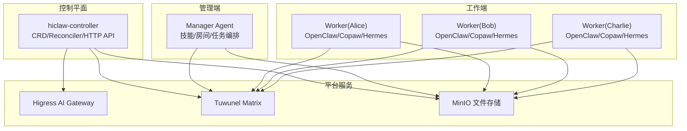
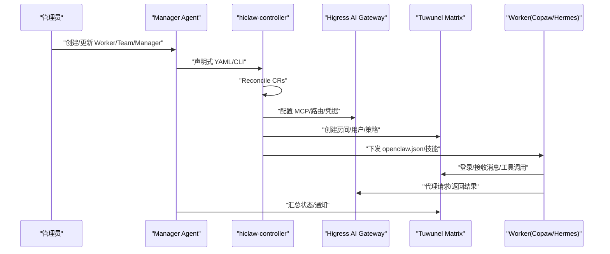
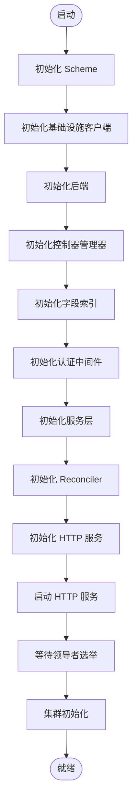
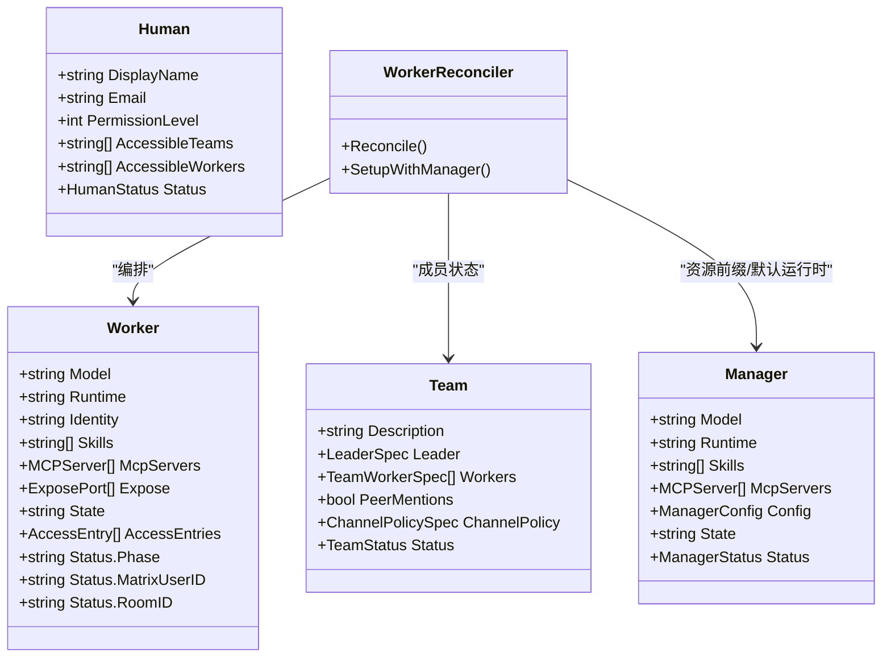
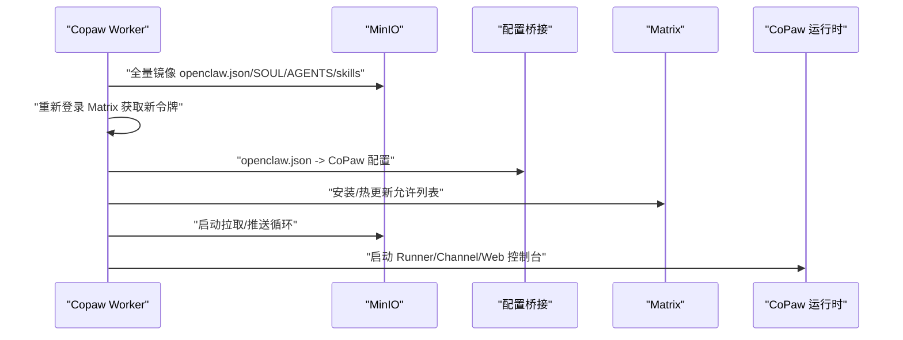
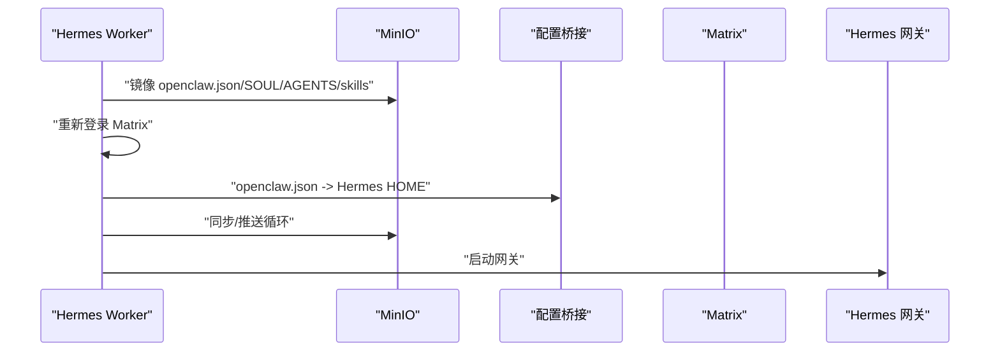
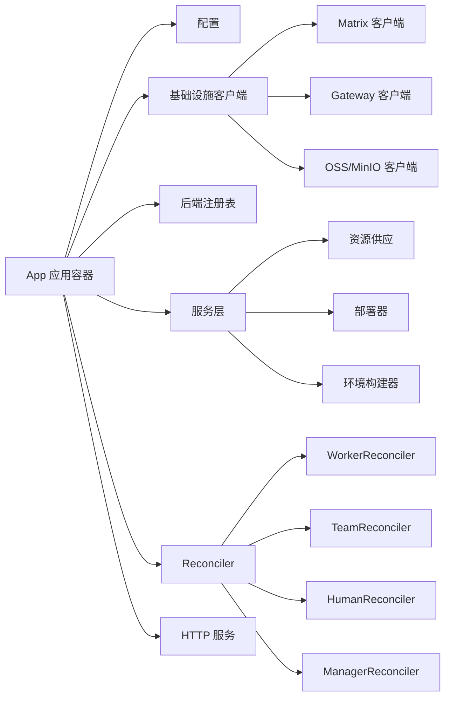

# 高级技能设计模式

<cite>
**本文引用的文件**
- [README.md](file://README.md)
- [hiclaw-controller/cmd/controller/main.go](file://hiclaw-controller/cmd/controller/main.go)
- [hiclaw-controller/internal/app/app.go](file://hiclaw-controller/internal/app/app.go)
- [hiclaw-controller/api/v1beta1/types.go](file://hiclaw-controller/api/v1beta1/types.go)
- [hiclaw-controller/internal/controller/worker_controller.go](file://hiclaw-controller/internal/controller/worker_controller.go)
- [manager/agent/skills/mcp-server-management/SKILL.md](file://manager/agent/skills/mcp-server-management/SKILL.md)
- [manager/agent/skills/service-publishing/SKILL.md](file://manager/agent/skills/service-publishing/SKILL.md)
- [manager/agent/skills/task-management/SKILL.md](file://manager/agent/skills/task-management/SKILL.md)
- [manager/agent/skills/matrix-server-management/SKILL.md](file://manager/agent/skills/matrix-server-management/SKILL.md)
- [copaw/src/copaw_worker/worker.py](file://copaw/src/copaw_worker/worker.py)
- [hermes/src/hermes_worker/worker.py](file://hermes/src/hermes_worker/worker.py)
- [manager/README.md](file://manager/README.md)
- [copaw/README.md](file://copaw/README.md)
- [hermes/README.md](file://hermes/README.md)
</cite>

## 目录
1. [引言](#引言)
2. [项目结构](#项目结构)
3. [核心组件](#核心组件)
4. [架构总览](#架构总览)
5. [详细组件分析](#详细组件分析)
6. [依赖分析](#依赖分析)
7. [性能考量](#性能考量)
8. [故障排查指南](#故障排查指南)
9. [结论](#结论)
10. [附录](#附录)

## 引言
本技术指南面向在 HiClaw 平台上进行“高级技能设计与实现”的工程师，聚焦于复杂技能的架构设计原则：模块化、插件化与可扩展性；提供服务发布、MCP 服务器管理、矩阵服务器集成等高级开发模式的实现参考；深入解析技能间交互与通信机制（消息传递、状态同步、事件处理）；总结性能优化策略（缓存、并发与资源管理）与安全最佳实践（权限控制、数据加密、访问审计），并给出复杂场景下的架构决策与落地建议。

## 项目结构
HiClaw 采用“Manager-Workers 架构”，控制器负责 Kubernetes 原生资源编排，Manager Agent 负责任务编排与技能执行，Worker 运行时（OpenClaw/Copaw/Hermes）通过统一的配置桥接与文件同步机制接入平台能力。关键目录与职责概览：
- hiclaw-controller：Kubernetes 控制平面，负责 Worker/Team/Manager/Human 等 CR 的声明式编排与基础设施协调
- manager：Manager Agent 容器，内置技能生态与矩阵通道，支持两种运行时（OpenClaw/Copaw）
- worker：Worker 运行时容器（Copaw/Hermes），通过 MinIO 同步配置与技能，桥接到各自运行时
- copaw/hermes：轻量级 Worker 运行时实现，分别适配 CoPaw 与 Hermes 生态
- docs/blog/changelog：文档与版本说明，便于理解演进与最佳实践

图示来源
- [README.md:305-333](file://README.md#L305-L333)
- [manager/README.md:3-11](file://manager/README.md#L3-L11)

章节来源
- [README.md:13-50](file://README.md#L13-L50)
- [manager/README.md:3-11](file://manager/README.md#L3-L11)

## 核心组件
- 控制器（hiclaw-controller）
  - 以 controller-runtime 为核心，构建应用容器 App，按阶段初始化 Scheme、基础设施客户端、后端、认证中间件、服务层、Reconciler 与 HTTP 服务
  - 支持嵌入式与集群内两种模式，通过标签隔离多实例跨控资源
- Manager Agent
  - 提供技能生态（worker-management、task-management、mcp-server-management、service-publishing 等），通过矩阵房间与 Workers 交互
- Worker 运行时（Copaw/Hermes）
  - 通过 MinIO 同步 openclaw.json、SOUL.md、AGENTS.md、skills/，桥接到各自运行时，启动矩阵通道与网关
- 基础设施
  - Higress AI Gateway：统一流量入口与 MCP 服务器托管
  - Tuwunel Matrix：自建 Matrix 服务，支持提及策略、加密与自由响应房间
  - MinIO：集中式 HTTP 文件系统，支撑 Worker 无状态化与跨 Agent 信息交换

章节来源
- [hiclaw-controller/cmd/controller/main.go:16-36](file://hiclaw-controller/cmd/controller/main.go#L16-L36)
- [hiclaw-controller/internal/app/app.go:81-108](file://hiclaw-controller/internal/app/app.go#L81-L108)
- [manager/README.md:3-11](file://manager/README.md#L3-L11)

## 架构总览
下图展示从控制器到运行时的端到端调用链与职责边界，体现模块化与插件化设计：控制器负责资源编排与基础设施，Manager 负责任务与技能编排，Worker 通过桥接与同步实现插件化能力。

图示来源
- [hiclaw-controller/internal/app/app.go:111-175](file://hiclaw-controller/internal/app/app.go#L111-L175)
- [manager/agent/skills/mcp-server-management/SKILL.md:8](file://manager/agent/skills/mcp-server-management/SKILL.md#L8)
- [manager/agent/skills/service-publishing/SKILL.md:12](file://manager/agent/skills/service-publishing/SKILL.md#L12)

## 详细组件分析

### 控制器应用容器与生命周期
- 初始化步骤（顺序执行）：注册 Scheme、基础设施客户端（Matrix/Gateway/OSS）、后端选择、控制器管理器、字段索引、认证中间件、服务层、Reconciler、HTTP 服务
- 启动流程：先启动 HTTP 服务，再等待领导者选举后执行集群初始化（创建/校验基础设施），并在嵌入式模式下生成长期管理员令牌供内置 CLI 使用
- 多后端支持：根据模式选择 Docker 或 Kubernetes 后端，支持混合部署

图示来源
- [hiclaw-controller/internal/app/app.go:81-108](file://hiclaw-controller/internal/app/app.go#L81-L108)
- [hiclaw-controller/internal/app/app.go:111-175](file://hiclaw-controller/internal/app/app.go#L111-L175)

章节来源
- [hiclaw-controller/internal/app/app.go:81-175](file://hiclaw-controller/internal/app/app.go#L81-L175)

### Worker 资源模型与生命周期编排
- 资源类型：Worker、Team、Manager、Human，均带有生命周期状态（Running/Sleeping/Stopped）、矩阵用户与房间、暴露端口等
- 编排流程：WorkerReconciler 将 CR 转换为 MemberContext，依次执行基础设施、服务账号、配置、容器与暴露端口等阶段，最终写回状态
- Pod 观察：仅对属于当前控制器实例且非 Team 所拥有的 Pod 进行过滤观察，避免跨实例干扰

图示来源
- [hiclaw-controller/api/v1beta1/types.go:63-146](file://hiclaw-controller/api/v1beta1/types.go#L63-L146)
- [hiclaw-controller/api/v1beta1/types.go:159-285](file://hiclaw-controller/api/v1beta1/types.go#L159-L285)
- [hiclaw-controller/api/v1beta1/types.go:369-447](file://hiclaw-controller/api/v1beta1/types.go#L369-L447)
- [hiclaw-controller/internal/controller/worker_controller.go:33-151](file://hiclaw-controller/internal/controller/worker_controller.go#L33-L151)

章节来源
- [hiclaw-controller/api/v1beta1/types.go:63-447](file://hiclaw-controller/api/v1beta1/types.go#L63-L447)
- [hiclaw-controller/internal/controller/worker_controller.go:33-151](file://hiclaw-controller/internal/controller/worker_controller.go#L33-L151)

### Copaw Worker 启动与桥接流程
- 启动步骤：确保 mc 可用、全量镜像 MinIO 内容、读取 openclaw.json、重新登录 Matrix 获取新设备 ID 与令牌、桥接配置到 CoPaw 工作区、安装矩阵通道、同步技能、启动后台同步循环
- 热更新：监听 MinIO 拉取事件，必要时重桥接配置并热更新矩阵通道允许列表

图示来源
- [copaw/src/copaw_worker/worker.py:65-177](file://copaw/src/copaw_worker/worker.py#L65-L177)
- [copaw/src/copaw_worker/worker.py:494-545](file://copaw/src/copaw_worker/worker.py#L494-L545)

章节来源
- [copaw/src/copaw_worker/worker.py:65-177](file://copaw/src/copaw_worker/worker.py#L65-L177)
- [copaw/src/copaw_worker/worker.py:494-545](file://copaw/src/copaw_worker/worker.py#L494-L545)

### Hermes Worker 启动与桥接流程
- 启动步骤：确保 mc 可用、镜像 MinIO 内容、重新登录 Matrix、桥接 openclaw.json 到 Hermes HOME（生成 config.yaml/.env/SOUL.md/AGENTS.md）、同步技能、复制 mcporter 配置、启动后台同步循环、启动网关
- 热更新：监听 MinIO 拉取事件，必要时重桥接配置并加载环境变量

图示来源
- [hermes/src/hermes_worker/worker.py:86-165](file://hermes/src/hermes_worker/worker.py#L86-L165)
- [hermes/src/hermes_worker/worker.py:402-430](file://hermes/src/hermes_worker/worker.py#L402-L430)

章节来源
- [hermes/src/hermes_worker/worker.py:86-165](file://hermes/src/hermes_worker/worker.py#L86-L165)
- [hermes/src/hermes_worker/worker.py:402-430](file://hermes/src/hermes_worker/worker.py#L402-L430)

### 技能：MCP 服务器管理
- 场景：为 Worker/Manager 配置 MCP 工具服务器、轮换凭证、授权/撤销 Worker 访问、通过 YAML 自定义 API 集成
- 关键要点：云模式不支持脚本管理、认证插件激活延迟、消费者授权为替换操作、YAML 必须使用特定密钥键名、仅通知相关 Worker、SSE 端点鉴权在消息接口检查
- 实现参考：Manager 技能文档中提供了操作指引与注意事项

章节来源
- [manager/agent/skills/mcp-server-management/SKILL.md:8](file://manager/agent/skills/mcp-server-management/SKILL.md#L8)
- [manager/agent/skills/mcp-server-management/SKILL.md:10-21](file://manager/agent/skills/mcp-server-management/SKILL.md#L10-L21)

### 技能：服务发布（对外暴露 Worker HTTP 服务）
- 场景：通过 Higress 网关将 Worker 容器内的 HTTP 服务暴露为公网可访问域名
- 关键要点：自动域名生成规则、支持多端口、无鉴权、基于 Docker DNS 解析容器名、删除暴露需从 spec 中移除
- 实现参考：Manager 技能文档中提供了 CLI 与 YAML 使用方式及注意事项

章节来源
- [manager/agent/skills/service-publishing/SKILL.md:12](file://manager/agent/skills/service-publishing/SKILL.md#L12)
- [manager/agent/skills/service-publishing/SKILL.md:25-92](file://manager/agent/skills/service-publishing/SKILL.md#L25-L92)

### 技能：任务管理与状态同步
- 场景：委派任务给 Worker、Worker 上报完成、管理周期性任务、检查 Worker 可用性
- 关键要点：避免 Worker 对不熟悉领域幻觉、优先委派、无限任务状态恒为“active”、必须在 MinIO 中同步任务文件后再通知 Worker、修改 state.json 必须使用脚本保证原子性
- 实现参考：Manager 技能文档中提供了任务选择、有限/无限任务、状态管理与通知渠道的参考

章节来源
- [manager/agent/skills/task-management/SKILL.md:8](file://manager/agent/skills/task-management/SKILL.md#L8)
- [manager/agent/skills/task-management/SKILL.md:20-30](file://manager/agent/skills/task-management/SKILL.md#L20-L30)

### 技能：矩阵服务器管理
- 场景：独立矩阵管理员请求（注册用户、创建房间、管理成员、上传文件）、向管理员发送文件
- 关键要点：Worker 忽略无提及的消息、用户 ID 必须完全匹配、信任私聊预设会自动加入受邀成员、API 不支持删除账户、不要用于 Worker/项目创建
- 实现参考：Manager 技能文档中提供了 API 参考

章节来源
- [manager/agent/skills/matrix-server-management/SKILL.md:8](file://manager/agent/skills/matrix-server-management/SKILL.md#L8)
- [manager/agent/skills/matrix-server-management/SKILL.md:10-23](file://manager/agent/skills/matrix-server-management/SKILL.md#L10-L23)

## 依赖分析
- 组件耦合与内聚
  - 控制器内部通过 App 将 Scheme、基础设施客户端、后端、服务层与 Reconciler 解耦，形成高内聚低耦合的应用容器
  - WorkerReconciler 通过共享的成员编排辅助函数实现复用，降低重复逻辑
- 直接与间接依赖
  - 控制器依赖 controller-runtime、Kubernetes 客户端与 CRD Scheme；通过服务层抽象基础设施差异
  - Worker 运行时依赖 MinIO 客户端与各自运行时框架，通过桥接与同步实现解耦
- 外部依赖与集成点
  - Higress AI Gateway：统一流量入口与 MCP 管理
  - Tuwunel Matrix：统一通信协议与策略
  - MinIO：集中式文件系统与状态持久化

图示来源
- [hiclaw-controller/internal/app/app.go:43-79](file://hiclaw-controller/internal/app/app.go#L43-L79)
- [hiclaw-controller/internal/app/app.go:432-496](file://hiclaw-controller/internal/app/app.go#L432-L496)

章节来源
- [hiclaw-controller/internal/app/app.go:43-79](file://hiclaw-controller/internal/app/app.go#L43-L79)
- [hiclaw-controller/internal/app/app.go:432-496](file://hiclaw-controller/internal/app/app.go#L432-L496)

## 性能考量
- 缓存机制
  - 控制器通过字段索引（如团队领导/成员名称）加速反查，减少遍历成本
  - Worker 运行时通过 MinIO 全量镜像与增量同步结合，降低启动时长与网络抖动影响
- 并发处理
  - 控制器管理器与 HTTP 服务并行启动，领导者选举后执行初始化，避免阻塞
  - Worker 启动异步任务处理拉取/推送循环，避免阻塞主事件循环
- 资源管理
  - 嵌入式模式使用本地 etcd 存储与本地 apiserver，降低外部依赖开销
  - 多后端选择（Docker/Kubernetes）按部署场景优化资源占用与弹性

章节来源
- [hiclaw-controller/internal/app/app.go:298-336](file://hiclaw-controller/internal/app/app.go#L298-L336)
- [hiclaw-controller/internal/app/app.go:519-567](file://hiclaw-controller/internal/app/app.go#L519-L567)
- [copaw/src/copaw_worker/worker.py:162-171](file://copaw/src/copaw_worker/worker.py#L162-L171)
- [hermes/src/hermes_worker/worker.py:155-162](file://hermes/src/hermes_worker/worker.py#L155-L162)

## 故障排查指南
- 日志导出
  - 使用调试脚本导出矩阵消息与 Agent 会话日志，结合代码库进行根因分析
- 常见问题定位
  - Worker 无法登录矩阵：检查 MinIO 中密码键是否存在、端口映射是否正确、是否需要重新登录
  - MCP 工具不可用：确认服务器创建/更新后认证插件激活延迟、消费者授权是否完整、SSE 端点鉴权位置
  - 服务未暴露：确认 Worker 容器已监听指定端口、Higress 路由已创建、域名解析正常
- 安全与权限
  - 确保 Worker 仅持有消费级令牌，真实密钥由网关持有
  - 使用 ACL 与策略限制矩阵房间与提及范围

章节来源
- [README.md:367-379](file://README.md#L367-L379)
- [manager/agent/skills/mcp-server-management/SKILL.md:10-21](file://manager/agent/skills/mcp-server-management/SKILL.md#L10-L21)
- [manager/agent/skills/service-publishing/SKILL.md:85-92](file://manager/agent/skills/service-publishing/SKILL.md#L85-L92)
- [README.md:268-277](file://README.md#L268-L277)

## 结论
HiClaw 的高级技能设计以“模块化 + 插件化 + 可扩展性”为核心，通过控制器的声明式编排与 Worker 运行时的桥接同步，实现了跨运行时的一致体验。在复杂场景下，应优先采用 MCP 服务器管理与服务发布等技能，配合严格的权限控制与状态同步策略，确保系统的可观测性、安全性与可维护性。

## 附录
- 运行时对比
  - OpenClaw：通用 Agent，技能生态丰富，适合任务编排与工具调用
  - CoPaw：轻量级，适配矩阵通道与文件同步
  - Hermes：自主编码 Agent，终端沙箱与持续记忆
- 安装与部署
  - 支持 Docker 与 Helm（Kubernetes）两种安装方式，Manager 与 Worker 可按需切换运行时

章节来源
- [README.md:290-304](file://README.md#L290-L304)
- [manager/README.md:12-18](file://manager/README.md#L12-L18)
- [copaw/README.md:1-18](file://copaw/README.md#L1-L18)
- [hermes/README.md:1-82](file://hermes/README.md#L1-L82)