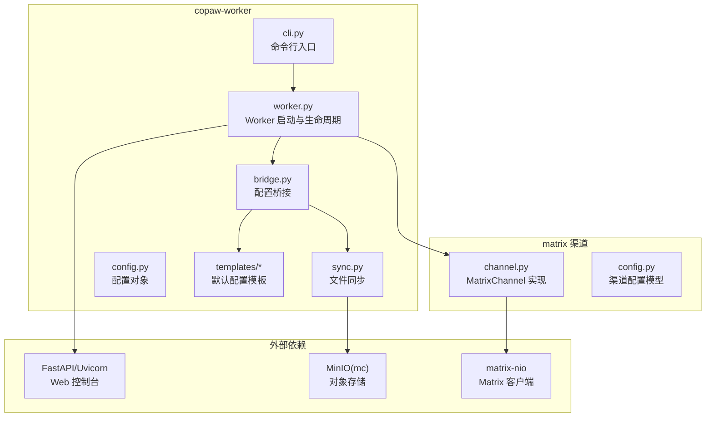
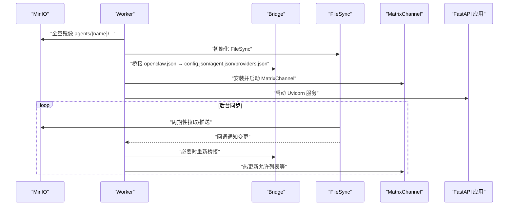
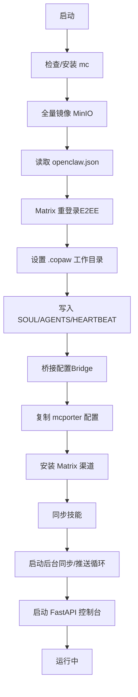
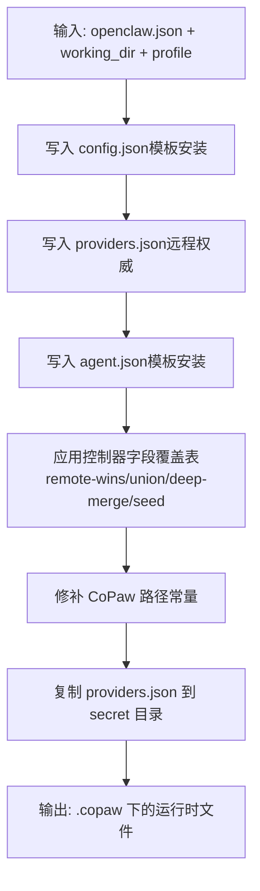
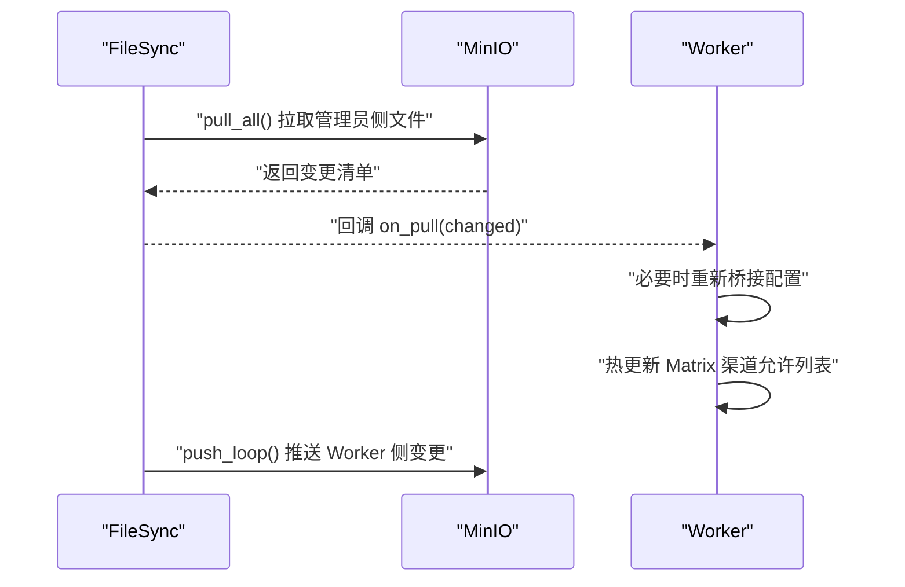
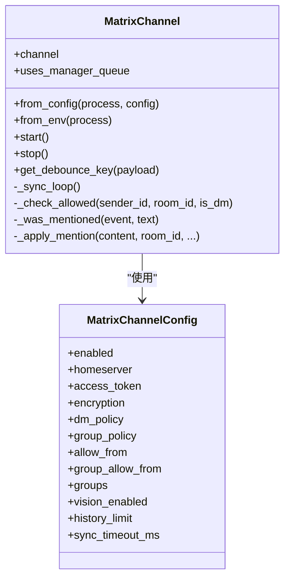
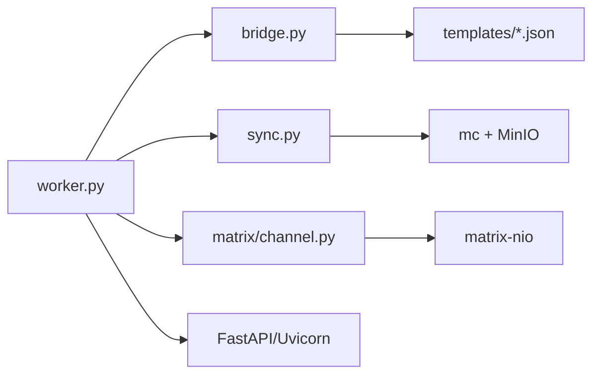

# CoPaw 运行时兼容性

<cite>
**本文引用的文件**
- [copaw/src/copaw_worker/bridge.py](file://copaw/src/copaw_worker/bridge.py)
- [copaw/src/copaw_worker/worker.py](file://copaw/src/copaw_worker/worker.py)
- [copaw/src/copaw_worker/sync.py](file://copaw/src/copaw_worker/sync.py)
- [copaw/src/copaw_worker/config.py](file://copaw/src/copaw_worker/config.py)
- [copaw/src/copaw_worker/cli.py](file://copaw/src/copaw_worker/cli.py)
- [copaw/src/copaw_worker/templates/config.json](file://copaw/src/copaw_worker/templates/config.json)
- [copaw/src/copaw_worker/templates/agent.worker.json](file://copaw/src/copaw_worker/templates/agent.worker.json)
- [copaw/src/copaw_worker/templates/agent.manager.json](file://copaw/src/copaw_worker/templates/agent.manager.json)
- [copaw/src/matrix/channel.py](file://copaw/src/matrix/channel.py)
- [copaw/src/matrix/config.py](file://copaw/src/matrix/config.py)
- [copaw/README.md](file://copaw/README.md)
- [copaw/pyproject.toml](file://copaw/pyproject.toml)
- [copaw/tests/test_bridge.py](file://copaw/tests/test_bridge.py)
- [copaw/tests/test_channel_mention.py](file://copaw/tests/test_channel_mention.py)
- [hermes/src/hermes_worker/worker.py](file://hermes/src/hermes_worker/worker.py)
- [hermes/src/hermes_worker/bridge.py](file://hermes/src/hermes_worker/bridge.py)
</cite>

## 目录
1. [简介](#简介)
2. [项目结构](#项目结构)
3. [核心组件](#核心组件)
4. [架构总览](#架构总览)
5. [详细组件分析](#详细组件分析)
6. [依赖分析](#依赖分析)
7. [性能考虑](#性能考虑)
8. [故障排查指南](#故障排查指南)
9. [结论](#结论)
10. [附录](#附录)

## 简介
本文件面向需要在 HiClaw 生态中使用 CoPaw 运行时的开发者与运维人员，系统阐述 CoPaw 运行时的架构设计、兼容性要求与实现细节，重点覆盖以下方面：
- 基于 FastAPI 的异步运行与 Web 控制台
- Matrix 通道集成与消息处理策略
- 技能管理与文件同步机制
- 配置桥接（Bridge）与热更新能力
- 与 Hermes 运行时的差异点与共性
- 开发与部署注意事项、最佳实践与排障建议

## 项目结构
CoPaw 运行时作为 HiClaw Worker 的轻量级运行时，主要由以下模块组成：
- copaw_worker：运行时入口、配置桥接、文件同步、启动流程
- matrix：Matrix 通道实现（基于 matrix-nio）
- tests：桥接与通道行为的单元测试
- hermes：对比参考的另一套运行时（便于识别差异）

图表来源
- [copaw/src/copaw_worker/cli.py:21-69](file://copaw/src/copaw_worker/cli.py#L21-L69)
- [copaw/src/copaw_worker/worker.py:45-177](file://copaw/src/copaw_worker/worker.py#L45-L177)
- [copaw/src/copaw_worker/bridge.py:155-211](file://copaw/src/copaw_worker/bridge.py#L155-L211)
- [copaw/src/copaw_worker/sync.py:114-137](file://copaw/src/copaw_worker/sync.py#L114-L137)
- [copaw/src/matrix/channel.py:216-255](file://copaw/src/matrix/channel.py#L216-L255)
- [copaw/src/matrix/config.py:160-184](file://copaw/src/matrix/config.py#L160-L184)

章节来源
- [copaw/README.md:1-18](file://copaw/README.md#L1-L18)
- [copaw/pyproject.toml:1-31](file://copaw/pyproject.toml#L1-L31)

## 核心组件
- Worker：负责初始化、拉取配置、桥接配置、安装 Matrix 渠道、启动 FastAPI 控制台、后台同步循环与热更新
- Bridge：将 Controller 提供的 openclaw.json 转换为 CoPaw 的本地运行时文件（config.json、agent.json、providers.json），并应用“重启覆盖”策略
- FileSync：基于 mc 的双向同步，支持全量镜像、增量拉取、变更触发推送、云模式凭据刷新
- MatrixChannel：基于 matrix-nio 的 Matrix 渠道实现，支持 E2EE、历史缓冲、提及解析与可见提及注入
- 模板系统：通过内置模板确保首次启动的安全默认与最小化配置集

章节来源
- [copaw/src/copaw_worker/worker.py:32-177](file://copaw/src/copaw_worker/worker.py#L32-L177)
- [copaw/src/copaw_worker/bridge.py:155-211](file://copaw/src/copaw_worker/bridge.py#L155-L211)
- [copaw/src/copaw_worker/sync.py:114-137](file://copaw/src/copaw_worker/sync.py#L114-L137)
- [copaw/src/matrix/channel.py:216-255](file://copaw/src/matrix/channel.py#L216-L255)
- [copaw/src/copaw_worker/templates/config.json:1-21](file://copaw/src/copaw_worker/templates/config.json#L1-L21)

## 架构总览
CoPaw 运行时采用“控制器驱动 + 本地桥接 + 对象存储同步”的架构：
- 控制器侧生成 openclaw.json，包含模型、渠道、代理默认项等
- Worker 启动后从 MinIO 全量镜像，随后桥接生成 CoPaw 运行时文件
- 运行时通过 FastAPI 提供 Web 控制台，同时以 MatrixChannel 接收/发送消息
- FileSync 在后台周期性拉取控制器侧变更并推送本地变更，支持热更新

图表来源
- [copaw/src/copaw_worker/worker.py:65-177](file://copaw/src/copaw_worker/worker.py#L65-L177)
- [copaw/src/copaw_worker/bridge.py:155-211](file://copaw/src/copaw_worker/bridge.py#L155-L211)
- [copaw/src/copaw_worker/sync.py:466-485](file://copaw/src/copaw_worker/sync.py#L466-L485)
- [copaw/src/matrix/channel.py:335-477](file://copaw/src/matrix/channel.py#L335-L477)

## 详细组件分析

### 组件一：Worker（运行时主控）
职责与流程：
- 确保 mc 可用并下载到本地路径
- 全量镜像 MinIO 中的 Worker 工作空间
- 读取 openclaw.json 并进行 Matrix 重登录（解决 E2EE 设备 ID 问题）
- 设置 CoPaw 工作目录并写入 SOUL/AGENTS/HEARTBEAT 文件
- 桥接配置、复制 mcporter 配置、安装 Matrix 渠道、同步技能
- 启动后台同步循环与推送循环
- 通过 FastAPI 启动 Web 控制台

图表来源
- [copaw/src/copaw_worker/worker.py:65-177](file://copaw/src/copaw_worker/worker.py#L65-L177)

章节来源
- [copaw/src/copaw_worker/worker.py:32-177](file://copaw/src/copaw_worker/worker.py#L32-L177)

### 组件二：Bridge（配置桥接）
目标：
- 将控制器提供的 openclaw.json 映射为 CoPaw 的本地运行时文件
- 首次启动时从模板安装缺失文件；后续重启仅覆盖控制器“拥有”的字段
- 保持用户自定义与迁移写入的配置不被覆盖

关键机制：
- 模板安装：config.json、agent.{profile}.json、providers.json
- 控制器字段覆盖表：定义哪些键由控制器拥有，如何合并（remote-wins、union、deep-merge、seed）
- 环境与路径修补：动态修改 CoPaw 内部常量，使其指向工作目录
- 端口重映射：容器内 :8080 自动映射到宿主机网关端口

图表来源
- [copaw/src/copaw_worker/bridge.py:155-211](file://copaw/src/copaw_worker/bridge.py#L155-L211)
- [copaw/src/copaw_worker/bridge.py:469-512](file://copaw/src/copaw_worker/bridge.py#L469-L512)
- [copaw/src/copaw_worker/bridge.py:519-648](file://copaw/src/copaw_worker/bridge.py#L519-L648)

章节来源
- [copaw/src/copaw_worker/bridge.py:1-703](file://copaw/src/copaw_worker/bridge.py#L1-L703)
- [copaw/src/copaw_worker/templates/config.json:1-21](file://copaw/src/copaw_worker/templates/config.json#L1-L21)
- [copaw/src/copaw_worker/templates/agent.worker.json:1-25](file://copaw/src/copaw_worker/templates/agent.worker.json#L1-L25)
- [copaw/src/copaw_worker/templates/agent.manager.json:1-26](file://copaw/src/copaw_worker/templates/agent.manager.json#L1-L26)

### 组件三：FileSync（文件同步）
特性：
- 使用 mc CLI 与 MinIO 交互
- 设计原则：谁写谁推、谁写谁负责；通过 @mention 通知对端拉取
- 分类：
  - 管理员侧（只拉取）：openclaw.json、mcporter-servers.json、skills/、shared/
  - Worker 侧（可读写）：AGENTS.md、SOUL.md、.copaw/sessions/、memory/ 等
- 合并策略：openclaw.json 采用“远端优先 + 本地保留特定键”的合并逻辑
- 云模式凭据：阿里云环境通过共享脚本刷新 STS 凭据
- 热更新：后台任务周期拉取，变更回调触发重新桥接与渠道热更新

图表来源
- [copaw/src/copaw_worker/sync.py:346-463](file://copaw/src/copaw_worker/sync.py#L346-L463)
- [copaw/src/copaw_worker/sync.py:466-485](file://copaw/src/copaw_worker/sync.py#L466-L485)
- [copaw/src/copaw_worker/sync.py:607-634](file://copaw/src/copaw_worker/sync.py#L607-L634)

章节来源
- [copaw/src/copaw_worker/sync.py:1-634](file://copaw/src/copaw_worker/sync.py#L1-L634)

### 组件四：MatrixChannel（Matrix 渠道）
能力：
- 支持 token 与用户名/密码登录，E2EE 存储与密钥维护
- 历史缓冲、提及检测、可见提及注入（m.mentions + matrix.to 链接）
- 允许列表策略（DM/群组）、每房间覆盖、同步令牌持久化与恢复
- 与 CoPaw 的热更新配合，允许列表变更无需重启

图表来源
- [copaw/src/matrix/channel.py:216-255](file://copaw/src/matrix/channel.py#L216-L255)
- [copaw/src/matrix/channel.py:160-206](file://copaw/src/matrix/channel.py#L160-L206)
- [copaw/src/matrix/config.py:160-184](file://copaw/src/matrix/config.py#L160-L184)

章节来源
- [copaw/src/matrix/channel.py:1-800](file://copaw/src/matrix/channel.py#L1-L800)
- [copaw/src/matrix/config.py:1-800](file://copaw/src/matrix/config.py#L1-L800)

### 组件五：与 Hermes 运行时的差异点
- 运行时入口与控制台
  - CoPaw：通过 FastAPI 启动 Web 控制台，内部托管 AgentRunner/ChannelManager
  - Hermes：通过网关启动，独立于 FastAPI
- 配置桥接目标
  - CoPaw：桥接至 .copaw 下的 config.json/agent.json/providers.json
  - Hermes：桥接至 ~/.hermes 下的 .env 与 config.yaml
- 渠道实现
  - CoPaw：直接使用 MatrixChannel（matrix-nio）
  - Hermes：通过 hermes_matrix.overlay_adapter 适配矩阵平台
- 同步与热更新
  - 两者均采用 mc 与 MinIO 的双向同步，但桥接目标与热更新触发点不同

章节来源
- [copaw/src/copaw_worker/worker.py:183-205](file://copaw/src/copaw_worker/worker.py#L183-L205)
- [hermes/src/hermes_worker/worker.py:171-192](file://hermes/src/hermes_worker/worker.py#L171-L192)
- [hermes/src/hermes_worker/bridge.py:1-200](file://hermes/src/hermes_worker/bridge.py#L1-L200)

## 依赖分析
- 外部依赖
  - FastAPI/Uvicorn：提供 Web 控制台与异步服务
  - matrix-nio：Matrix 客户端库，支持 E2EE
  - mc（MinIO Client）：对象存储操作
  - markdown-it-py/linkify-it-py：消息渲染与链接识别
- 内部耦合
  - Worker 依赖 Bridge、FileSync、MatrixChannel
  - Bridge 依赖模板资源与路径修补
  - FileSync 依赖 mc 与 MinIO 命名约定
  - MatrixChannel 依赖 CoPaw 配置与同步令牌文件

图表来源
- [copaw/src/copaw_worker/worker.py:24-26](file://copaw/src/copaw_worker/worker.py#L24-L26)
- [copaw/src/copaw_worker/bridge.py:130-134](file://copaw/src/copaw_worker/bridge.py#L130-L134)
- [copaw/src/copaw_worker/sync.py:100-111](file://copaw/src/copaw_worker/sync.py#L100-L111)
- [copaw/src/matrix/channel.py:23-41](file://copaw/src/matrix/channel.py#L23-L41)
- [copaw/pyproject.toml:12-17](file://copaw/pyproject.toml#L12-L17)

章节来源
- [copaw/pyproject.toml:1-31](file://copaw/pyproject.toml#L1-L31)

## 性能考虑
- 异步并发：Worker 与 FileSync 使用 asyncio，避免阻塞；Uvicorn 作为 ASGI 服务器承载控制台
- 同步粒度：pull_all 与 push_loop 分别针对管理员侧与 Worker 侧，减少不必要的网络往返
- 缓存与持久化：Matrix 同步令牌持久化，避免重复全量同步
- 端口映射：容器内 :8080 自动映射到宿主机端口，降低网络层开销
- 热更新：仅在必要时重新桥接与热更新渠道配置，避免频繁重启

## 故障排查指南
常见问题与定位要点：
- mc 未找到或权限不足
  - 现象：无法镜像或推送
  - 处理：确认 mc 是否已自动安装到 PATH，或手动安装；核对 MinIO 凭据
- Matrix 登录失败或 E2EE 不生效
  - 现象：无法接收加密消息或设备 ID 不匹配
  - 处理：执行重登录流程，确保新 token 与 device_id 写回 openclaw.json
- 配置未生效或被覆盖
  - 现象：用户自定义字段丢失
  - 处理：确认是否属于控制器“拥有”的字段；非控制器字段应保留在 agent.json 中
- 允许列表未更新
  - 现象：新加入的用户未被允许
  - 处理：确认 FileSync 回调是否触发重新桥接；检查热更新逻辑是否成功应用到 MatrixChannel

章节来源
- [copaw/src/copaw_worker/worker.py:293-337](file://copaw/src/copaw_worker/worker.py#L293-L337)
- [copaw/src/copaw_worker/worker.py:528-544](file://copaw/src/copaw_worker/worker.py#L528-L544)
- [copaw/src/copaw_worker/sync.py:346-463](file://copaw/src/copaw_worker/sync.py#L346-L463)
- [copaw/src/copaw_worker/bridge.py:469-512](file://copaw/src/copaw_worker/bridge.py#L469-L512)

## 结论
CoPaw 运行时通过“控制器驱动 + 本地桥接 + 对象存储同步”的方式，实现了与 HiClaw 生态的无缝集成。其核心优势在于：
- 明确的配置所有权划分与热更新机制
- 基于 FastAPI 的 Web 控制台与异步处理
- 完整的 Matrix 渠道能力（含 E2EE）
- 与 Hermes 运行时在目标与流程上的互补性

对于开发者与运维人员，建议优先掌握桥接规则、同步策略与 Matrix 渠道配置，以确保稳定与高效的运行。

## 附录

### A. 配置与文件同步机制
- 首次启动：从模板安装 config.json、agent.json、providers.json
- 后续重启：仅覆盖控制器“拥有”的字段，用户自定义与迁移写入保持不变
- 管理员侧：openclaw.json、skills/、shared/ 由 MinIO 下发
- Worker 侧：AGENTS.md、SOUL.md、.copaw 下的会话与记忆数据由 Worker 写入并推送

章节来源
- [copaw/src/copaw_worker/bridge.py:155-211](file://copaw/src/copaw_worker/bridge.py#L155-L211)
- [copaw/src/copaw_worker/sync.py:346-463](file://copaw/src/copaw_worker/sync.py#L346-L463)

### B. 热更新与渠道热更新
- 当 openclaw.json 或技能发生变更时，触发重新桥接与渠道热更新
- MatrixChannel 允许列表可在不停止的情况下热更新，避免中断正在进行的请求

章节来源
- [copaw/src/copaw_worker/worker.py:494-544](file://copaw/src/copaw_worker/worker.py#L494-L544)
- [copaw/src/matrix/channel.py:560-670](file://copaw/src/matrix/channel.py#L560-L670)

### C. 测试参考
- 桥接行为测试：验证模板安装、字段覆盖策略、用户自定义保留
- 矩阵提及测试：验证可见提及注入与多目标提及

章节来源
- [copaw/tests/test_bridge.py:1-405](file://copaw/tests/test_bridge.py#L1-L405)
- [copaw/tests/test_channel_mention.py:1-202](file://copaw/tests/test_channel_mention.py#L1-L202)