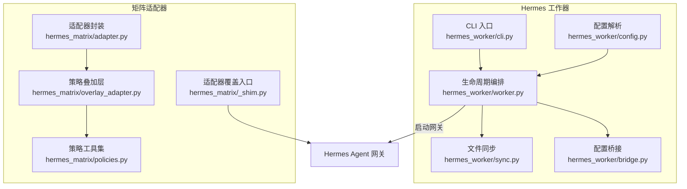
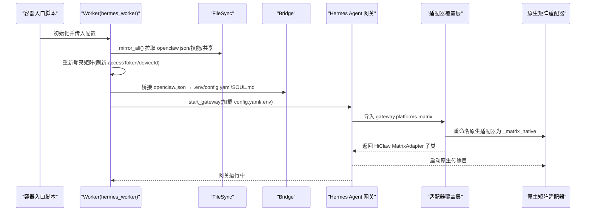
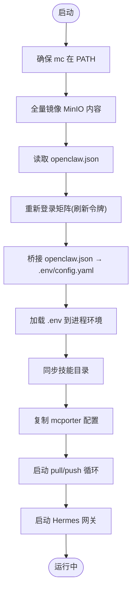
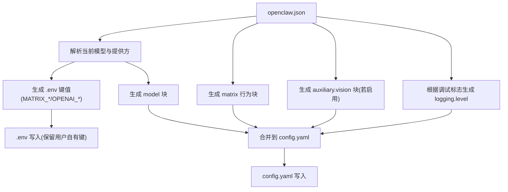
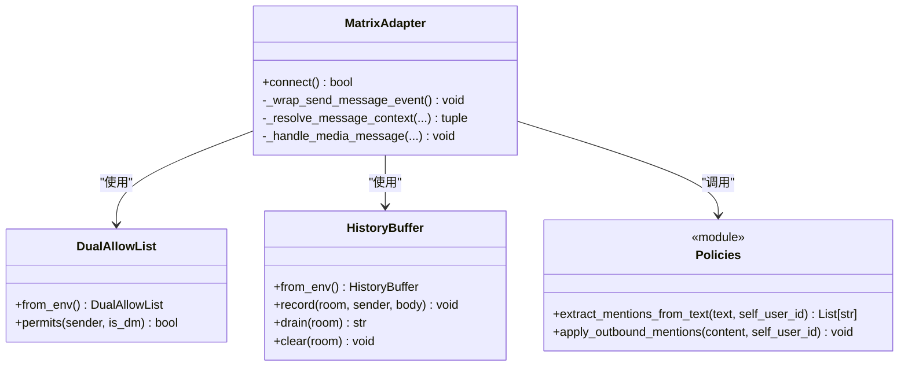
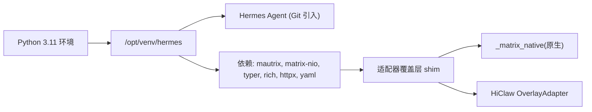

# Hermes 运行时兼容性

<cite>
**本文引用的文件**
- [hermes/src/hermes_worker/worker.py](file://hermes/src/hermes_worker/worker.py)
- [hermes/src/hermes_worker/bridge.py](file://hermes/src/hermes_worker/bridge.py)
- [hermes/src/hermes_worker/config.py](file://hermes/src/hermes_worker/config.py)
- [hermes/src/hermes_worker/cli.py](file://hermes/src/hermes_worker/cli.py)
- [hermes/src/hermes_worker/sync.py](file://hermes/src/hermes_worker/sync.py)
- [hermes/src/hermes_matrix/adapter.py](file://hermes/src/hermes_matrix/adapter.py)
- [hermes/src/hermes_matrix/overlay_adapter.py](file://hermes/src/hermes_matrix/overlay_adapter.py)
- [hermes/src/hermes_matrix/policies.py](file://hermes/src/hermes_matrix/policies.py)
- [hermes/src/hermes_matrix/_shim.py](file://hermes/src/hermes_matrix/_shim.py)
- [hermes/README.md](file://hermes/README.md)
- [hermes/pyproject.toml](file://hermes/pyproject.toml)
- [hermes/Dockerfile](file://hermes/Dockerfile)
- [hermes/tests/test_bridge.py](file://hermes/tests/test_bridge.py)
- [hermes/tests/test_policies.py](file://hermes/tests/test_policies.py)
- [copaw/src/copaw_worker/worker.py](file://copaw/src/copaw_worker/worker.py)
- [copaw/src/copaw_worker/bridge.py](file://copaw/src/copaw_worker/bridge.py)
- [copaw/src/matrix/channel.py](file://copaw/src/matrix/channel.py)
- [copaw/src/matrix/config.py](file://copaw/src/matrix/config.py)
- [copaw/README.md](file://copaw/README.md)
</cite>

## 目录
1. [简介](#简介)
2. [项目结构](#项目结构)
3. [核心组件](#核心组件)
4. [架构总览](#架构总览)
5. [详细组件分析](#详细组件分析)
6. [依赖分析](#依赖分析)
7. [性能考虑](#性能考虑)
8. [故障排除指南](#故障排除指南)
9. [结论](#结论)
10. [附录](#附录)

## 简介
本文件面向 Hermes 运行时在 HiClaw 中的兼容性与实现细节，系统阐述其基于 Python 的轻量级设计、与矩阵协议适配器的兼容层、与 MCP 服务器的集成路径以及技能执行机制。重点对比 Hermes 与 CoPaw 在技能执行模型、配置管理与通信协议处理上的差异，并提供针对 Hermes 的开发与运维指南（含配置示例与排障建议）。

## 项目结构
Hermes 运行时由“工作器（Worker）”与“矩阵适配器（Matrix Adapter）”两大子模块组成，均位于 hermes 目录下，采用与 CoPaw 相同的 MinIO 同步与 openclaw.json 配置桥接模式，但以 Python 实现并替换上游 mautrix 传输层为 matrix-nio，以复用 CoPaw 的策略语义。

图表来源
- [hermes/src/hermes_worker/cli.py:1-72](file://hermes/src/hermes_worker/cli.py#L1-L72)
- [hermes/src/hermes_worker/config.py:1-40](file://hermes/src/hermes_worker/config.py#L1-L40)
- [hermes/src/hermes_worker/sync.py:1-622](file://hermes/src/hermes_worker/sync.py#L1-L622)
- [hermes/src/hermes_worker/bridge.py:1-538](file://hermes/src/hermes_worker/bridge.py#L1-L538)
- [hermes/src/hermes_worker/worker.py:1-463](file://hermes/src/hermes_worker/worker.py#L1-L463)
- [hermes/src/hermes_matrix/_shim.py:1-24](file://hermes/src/hermes_matrix/_shim.py#L1-L24)
- [hermes/src/hermes_matrix/adapter.py:1-5](file://hermes/src/hermes_matrix/adapter.py#L1-L5)
- [hermes/src/hermes_matrix/overlay_adapter.py:1-240](file://hermes/src/hermes_matrix/overlay_adapter.py#L1-L240)
- [hermes/src/hermes_matrix/policies.py:1-223](file://hermes/src/hermes_matrix/policies.py#L1-L223)

章节来源
- [hermes/README.md:1-82](file://hermes/README.md#L1-L82)
- [hermes/Dockerfile:1-175](file://hermes/Dockerfile#L1-L175)

## 核心组件
- Worker：负责初始化、镜像同步、重新登录矩阵、桥接配置、启动网关与后台拉取/推送循环。
- FileSync：基于 mc CLI 的双向同步，遵循“谁写谁推”的原则，区分 Manager-managed 与 Worker-managed 文件。
- Bridge：将 openclaw.json 映射到 hermes 的 .env 与 config.yaml，保留用户自定义项。
- Matrix Adapter（覆盖层）：在 hermes-agent 原生 mautrix 适配器之上叠加 HiClaw 策略（提及增强、双允许列表、历史缓冲、图像降级）。
- Policies：纯策略工具集，不依赖矩阵 SDK，提供提及提取、双允许列表与历史缓冲。
- CLI：Typer CLI 暴露 hermes-worker 命令，接收 MinIO 连接参数与同步间隔等。

章节来源
- [hermes/src/hermes_worker/worker.py:1-463](file://hermes/src/hermes_worker/worker.py#L1-L463)
- [hermes/src/hermes_worker/sync.py:1-622](file://hermes/src/hermes_worker/sync.py#L1-L622)
- [hermes/src/hermes_worker/bridge.py:1-538](file://hermes/src/hermes_worker/bridge.py#L1-L538)
- [hermes/src/hermes_matrix/overlay_adapter.py:1-240](file://hermes/src/hermes_matrix/overlay_adapter.py#L1-L240)
- [hermes/src/hermes_matrix/policies.py:1-223](file://hermes/src/hermes_matrix/policies.py#L1-L223)
- [hermes/src/hermes_worker/cli.py:1-72](file://hermes/src/hermes_worker/cli.py#L1-L72)

## 架构总览
Hermes 运行时通过 hermes-worker 在容器内启动，使用 mc 将 MinIO 上的 openclaw.json、技能与共享资源镜像到本地工作区；随后桥接生成 .env 与 config.yaml，并启动 Hermes Agent 网关。网关加载平台适配器时，通过 shim 将原生 mautrix 替换为 HiClaw 的 overlay 适配器，从而获得与 CoPaw 一致的矩阵策略行为。

图表来源
- [hermes/src/hermes_worker/worker.py:86-192](file://hermes/src/hermes_worker/worker.py#L86-L192)
- [hermes/src/hermes_worker/sync.py:222-265](file://hermes/src/hermes_worker/sync.py#L222-L265)
- [hermes/src/hermes_worker/bridge.py:400-538](file://hermes/src/hermes_worker/bridge.py#L400-L538)
- [hermes/src/hermes_matrix/_shim.py:1-24](file://hermes/src/hermes_matrix/_shim.py#L1-L24)
- [hermes/Dockerfile:132-141](file://hermes/Dockerfile#L132-L141)

## 详细组件分析

### Worker 生命周期与启动流程
- 初始化阶段：确保 mc 可用、镜像 MinIO 内容、读取 openclaw.json、重新登录矩阵以保持端到端加密会话稳定。
- 桥接阶段：将 openclaw.json 转换为 .env 与 config.yaml，并复制 SOUL.md/AGENTS.md 到工作区。
- 技能同步：拉取 MinIO 上的技能目录，保留本地已安装但不再发布的技能以防泄漏。
- 后台循环：启动 pull/push 异步任务，周期性拉取 Manager-managed 文件并推送 Worker-managed 变更。
- 网关启动：加载网关配置，启动矩阵适配器与代理循环。

图表来源
- [hermes/src/hermes_worker/worker.py:86-192](file://hermes/src/hermes_worker/worker.py#L86-L192)
- [hermes/src/hermes_worker/bridge.py:400-538](file://hermes/src/hermes_worker/bridge.py#L400-L538)
- [hermes/src/hermes_worker/sync.py:335-396](file://hermes/src/hermes_worker/sync.py#L335-L396)

章节来源
- [hermes/src/hermes_worker/worker.py:1-463](file://hermes/src/hermes_worker/worker.py#L1-L463)

### 配置桥接（openclaw.json → hermes config）
- .env 映射键族：MATRIX_*、OPENAI_*、HERMES_DEFAULT_MODEL 等，均由桥接覆盖；其他用户自定义键保留。
- config.yaml 映射块：model、auxiliary.vision、logging、matrix 行为开关、platforms.matrix.enabled 等。
- 端口重映射：容器内 :8080 自动映射到宿主机网关端口，保证网关与模型服务可达。
- 视觉能力对齐：当激活模型具备图像输入能力时，辅助视觉配置指向同一 OpenAI 兼容端点；否则在消息处理时进行图像降级。

图表来源
- [hermes/src/hermes_worker/bridge.py:73-125](file://hermes/src/hermes_worker/bridge.py#L73-L125)
- [hermes/src/hermes_worker/bridge.py:213-283](file://hermes/src/hermes_worker/bridge.py#L213-L283)
- [hermes/src/hermes_worker/bridge.py:315-381](file://hermes/src/hermes_worker/bridge.py#L315-L381)
- [hermes/src/hermes_worker/bridge.py:383-394](file://hermes/src/hermes_worker/bridge.py#L383-L394)

章节来源
- [hermes/src/hermes_worker/bridge.py:1-538](file://hermes/src/hermes_worker/bridge.py#L1-L538)
- [hermes/tests/test_bridge.py:1-110](file://hermes/tests/test_bridge.py#L1-L110)

### 文件同步与冲突解决
- 设计原则：谁写谁推；Manager-managed（只读）与 Worker-managed（读写）职责分离。
- openclaw.json 合并策略：本地优先，仅在特定字段上覆盖远程；通道与插件条目进行深度合并。
- 排除规则：derived 文件（.env/config.yaml）、缓存目录、日志、临时锁文件等不被推送回 MinIO。
- 回归保护：.hermes 下由桥接生成的衍生文件不参与推送，避免与 Manager 编辑冲突。

章节来源
- [hermes/src/hermes_worker/sync.py:1-622](file://hermes/src/hermes_worker/sync.py#L1-L622)

### 矩阵适配器与策略叠加
- 适配器覆盖：通过 shim 将原生 mautrix 适配器重命名为 _matrix_native，并在导入路径返回 HiClaw 的子类适配器。
- 策略叠加层：在连接成功后包装发送事件，注入 MSC3952 提及信号；应用双允许列表与历史缓冲策略；在模型无视觉能力时对图片消息进行降级。
- 策略工具集：纯函数式工具，支持从文本提取 MXID、合并提及块、双允许列表判定与历史上下文拼接。

图表来源
- [hermes/src/hermes_matrix/overlay_adapter.py:94-240](file://hermes/src/hermes_matrix/overlay_adapter.py#L94-L240)
- [hermes/src/hermes_matrix/policies.py:126-174](file://hermes/src/hermes_matrix/policies.py#L126-L174)
- [hermes/src/hermes_matrix/policies.py:182-223](file://hermes/src/hermes_matrix/policies.py#L182-L223)

章节来源
- [hermes/src/hermes_matrix/adapter.py:1-5](file://hermes/src/hermes_matrix/adapter.py#L1-L5)
- [hermes/src/hermes_matrix/overlay_adapter.py:1-240](file://hermes/src/hermes_matrix/overlay_adapter.py#L1-L240)
- [hermes/src/hermes_matrix/policies.py:1-223](file://hermes/src/hermes_matrix/policies.py#L1-L223)
- [hermes/src/hermes_matrix/_shim.py:1-24](file://hermes/src/hermes_matrix/_shim.py#L1-L24)

### 与 CoPaw 的主要差异
- 技能执行模型：Hermes 使用 hermes-agent 的代理循环与工具链，CoPaw 使用 agentscope；两者均通过技能目录与 mcporter 集成 MCP 服务器。
- 配置管理方式：二者均以 openclaw.json 为中心并通过桥接生成 hermes 配置；Hermes 通过 .env 与 config.yaml 的组合，CoPaw 有类似的桥接逻辑但实现细节不同。
- 通信协议处理：Hermes 通过 shim 将原生 mautrix 替换为 matrix-nio，复用 CoPaw 的策略语义（提及、允许列表、自由回复、线程、E2EE 等），而 CoPaw 本身即基于 matrix-nio。

章节来源
- [hermes/README.md:1-82](file://hermes/README.md#L1-L82)
- [copaw/src/copaw_worker/worker.py](file://copaw/src/copaw_worker/worker.py)
- [copaw/src/copaw_worker/bridge.py](file://copaw/src/copaw_worker/bridge.py)
- [copaw/src/matrix/channel.py](file://copaw/src/matrix/channel.py)
- [copaw/src/matrix/config.py](file://copaw/src/matrix/config.py)
- [copaw/README.md](file://copaw/README.md)

## 依赖分析
- 外部依赖：mautrix[encryption]、matrix-nio[e2e]、typer、rich、httpx、pyyaml 等，满足矩阵传输、命令行、HTTP 客户端与 YAML 解析需求。
- 运行时依赖：Hermes Agent 通过 Git 引入固定版本，确保可重复构建；Python 3.11 环境与虚拟环境隔离。
- 适配器替换：Docker 构建阶段将原生矩阵适配器重命名为 _matrix_native，并安装 shim，使导入路径保持稳定。

图表来源
- [hermes/pyproject.toml:12-25](file://hermes/pyproject.toml#L12-L25)
- [hermes/Dockerfile:96-121](file://hermes/Dockerfile#L96-L121)
- [hermes/Dockerfile:132-141](file://hermes/Dockerfile#L132-L141)

章节来源
- [hermes/pyproject.toml:1-37](file://hermes/pyproject.toml#L1-L37)
- [hermes/Dockerfile:1-175](file://hermes/Dockerfile#L1-L175)

## 性能考虑
- 内存优化：启用 jemalloc 减少 Python 内存碎片，降低约 10%-20% RSS。
- 同步策略：pull/push 循环异步化，避免阻塞；仅推送变更文件，减少 IO。
- 端口映射：容器内 :8080 自动映射到宿主机端口，避免网络重定向开销。
- 缓存与排除：排除日志、缓存、临时文件，减少上传与拉取负担。

章节来源
- [hermes/Dockerfile:62-66](file://hermes/Dockerfile#L62-L66)
- [hermes/src/hermes_worker/sync.py:520-528](file://hermes/src/hermes_worker/sync.py#L520-L528)

## 故障排除指南
- mc 未找到或安装失败
  - 现象：启动时报错提示 mc 未在 PATH。
  - 处理：自动下载安装 mc 并加入 PATH；若失败，请手动安装。
  - 参考：[hermes/src/hermes_worker/worker.py:283-330](file://hermes/src/hermes_worker/worker.py#L283-L330)
- 矩阵重新登录失败
  - 现象：无法获取 access_token 或 device_id，导致 E2EE 不稳定。
  - 处理：检查 homeserver 与密码键路径；确认 MinIO 中 credentials/matrix/password 存在。
  - 参考：[hermes/src/hermes_worker/worker.py:197-277](file://hermes/src/hermes_worker/worker.py#L197-L277)
- openclaw.json 合并异常
  - 现象：字段覆盖不符合预期或通道/插件合并错误。
  - 处理：确认本地与远程字段结构；注意 accessToken 本地优先策略。
  - 参考：[hermes/src/hermes_worker/sync.py:50-98](file://hermes/src/hermes_worker/sync.py#L50-L98)
- 配置桥接未生效
  - 现象：修改 openclaw.json 后 config.yaml 未更新。
  - 处理：确认桥接是否触发；检查 HICLAW_MATRIX_DEBUG 是否设置；验证 .env 与 config.yaml 写入。
  - 参考：[hermes/src/hermes_worker/bridge.py:400-538](file://hermes/src/hermes_worker/bridge.py#L400-L538)
- 矩阵策略不生效
  - 现象：提及未增强、允许列表未拦截、历史上下文缺失。
  - 处理：检查 MATRIX_* 环境变量；确认 OverlayAdapter 已被网关加载；验证 policies 工具集。
  - 参考：[hermes/src/hermes_matrix/overlay_adapter.py:94-240](file://hermes/src/hermes_matrix/overlay_adapter.py#L94-L240)
  - 参考：[hermes/src/hermes_matrix/policies.py:126-223](file://hermes/src/hermes_matrix/policies.py#L126-L223)

章节来源
- [hermes/src/hermes_worker/worker.py:197-330](file://hermes/src/hermes_worker/worker.py#L197-L330)
- [hermes/src/hermes_worker/sync.py:50-98](file://hermes/src/hermes_worker/sync.py#L50-L98)
- [hermes/src/hermes_worker/bridge.py:400-538](file://hermes/src/hermes_worker/bridge.py#L400-L538)
- [hermes/src/hermes_matrix/overlay_adapter.py:94-240](file://hermes/src/hermes_matrix/overlay_adapter.py#L94-L240)
- [hermes/src/hermes_matrix/policies.py:126-223](file://hermes/src/hermes_matrix/policies.py#L126-L223)

## 结论
Hermes 运行时在保持与 CoPaw 相同的配置与策略语义的同时，以 Python 与 matrix-nio 为基础实现了轻量级、可维护的适配器覆盖层。通过 openclaw.json 桥接与 mc 驱动的同步机制，Hermes 能够与 Manager 协同工作，提供一致的矩阵通信体验与 MCP 服务器集成能力。建议在生产环境中关注端口映射、令牌轮换与同步策略的稳定性，并结合测试用例验证策略与桥接行为。

## 附录

### 开发与运维指南
- 技能编写规范
  - 技能目录结构：skills/<技能名>/SKILL.md 与脚本文件；脚本需赋予可执行权限。
  - MCP 服务器集成：通过 Manager 发布 config/mcporter.json 或 mcporter-servers.json，Hermes 侧自动复制到工作区。
  - 参考：[hermes/src/hermes_worker/sync.py:327-344](file://hermes/src/hermes_worker/sync.py#L327-L344)
- MCP 服务器配置
  - 在 openclaw.json 中声明模型与网关信息；桥接会生成 OPENAI_* 环境变量与 model 块。
  - 参考：[hermes/src/hermes_worker/bridge.py:265-283](file://hermes/src/hermes_worker/bridge.py#L265-L283)
- 矩阵房间权限管理
  - 使用 MATRIX_DM_POLICY/MATRIX_GROUP_POLICY 与 ALLOWED_USERS/GROUP_ALLOW_FROM 控制 DM 与群组权限。
  - 自由回复房间与线程策略由 MATRIX_FREE_RESPONSE_ROOMS 与 MATRIX_AUTO_THREAD 控制。
  - 参考：[hermes/src/hermes_matrix/policies.py:126-174](file://hermes/src/hermes_matrix/policies.py#L126-L174)
  - 参考：[hermes/src/hermes_worker/bridge.py:213-262](file://hermes/src/hermes_worker/bridge.py#L213-L262)
- 配置示例（路径参考）
  - CLI 参数：--name/--fs/--fs-key/--fs-secret/--fs-bucket/--sync-interval/--install-dir
  - 参考：[hermes/src/hermes_worker/cli.py:24-38](file://hermes/src/hermes_worker/cli.py#L24-L38)
  - Worker 配置数据结构：WorkerConfig 字段与属性
  - 参考：[hermes/src/hermes_worker/config.py:7-40](file://hermes/src/hermes_worker/config.py#L7-L40)
  - 网关启动与平台适配器加载：start_gateway 与 shim 覆盖
  - 参考：[hermes/src/hermes_worker/worker.py:171-192](file://hermes/src/hermes_worker/worker.py#L171-L192)
  - 参考：[hermes/src/hermes_matrix/_shim.py:1-24](file://hermes/src/hermes_matrix/_shim.py#L1-L24)