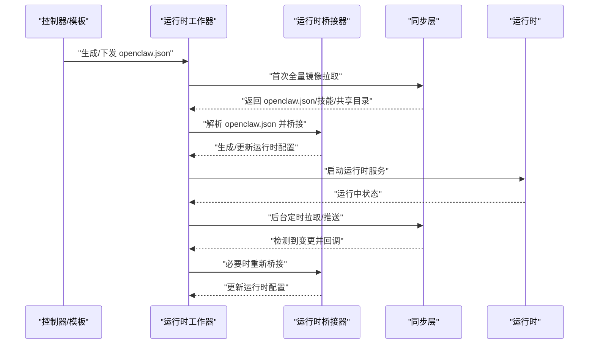
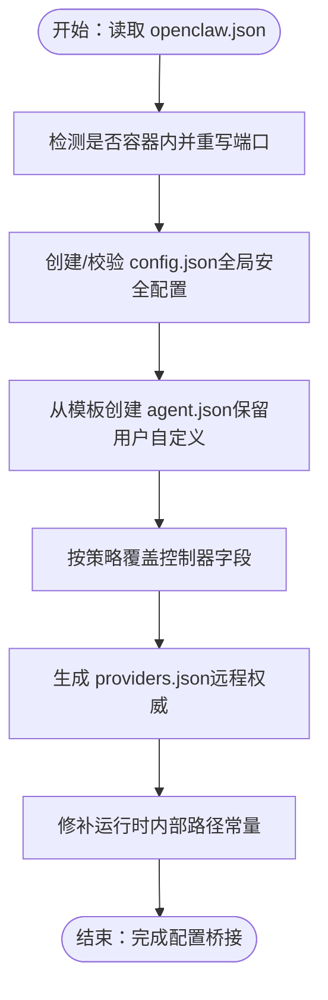
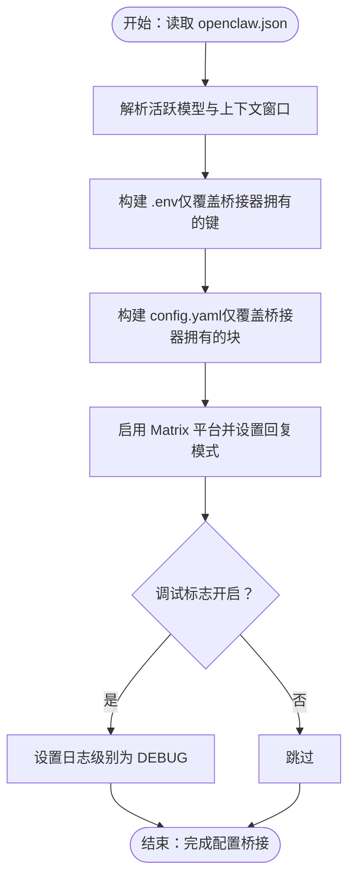
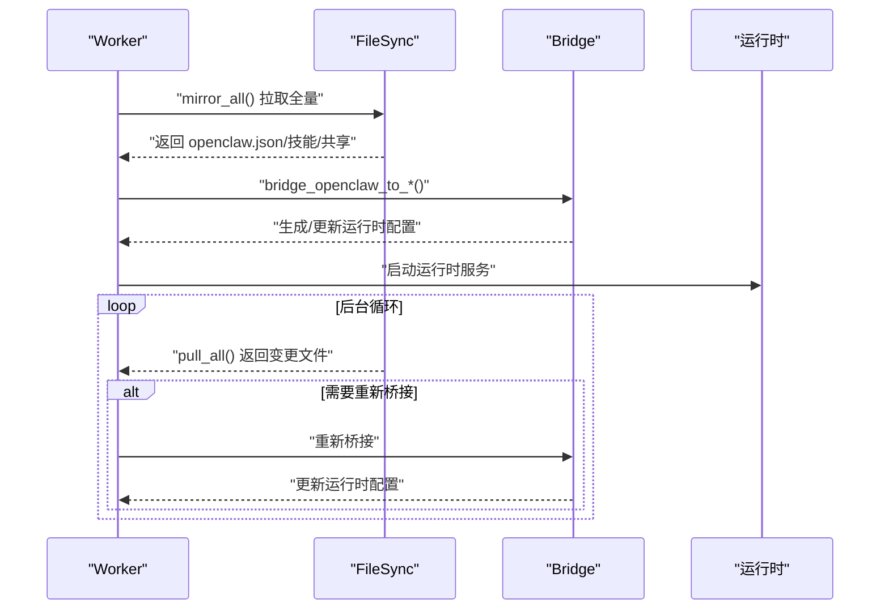
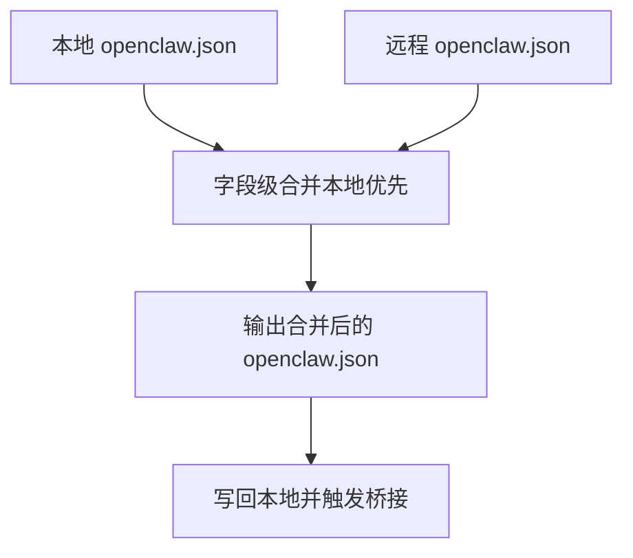
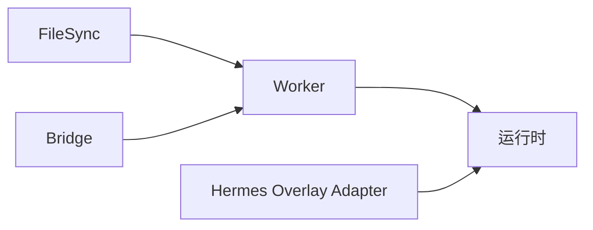

# 跨运行时兼容性

<cite>
**本文引用的文件**
- [copaw_worker/bridge.py](file://copaw/src/copaw_worker/bridge.py)
- [hermes_worker/bridge.py](file://hermes/src/hermes_worker/bridge.py)
- [copaw_worker/worker.py](file://copaw/src/copaw_worker/worker.py)
- [hermes_worker/worker.py](file://hermes/src/hermes_worker/worker.py)
- [copaw_worker/config.py](file://copaw/src/copaw_worker/config.py)
- [hermes_worker/config.py](file://hermes/src/hermes_worker/config.py)
- [copaw_worker/sync.py](file://copaw/src/copaw_worker/sync.py)
- [hermes_worker/sync.py](file://hermes/src/hermes_worker/sync.py)
- [merge-openclaw-config.sh](file://shared/lib/merge-openclaw-config.sh)
- [manager-openclaw.json.tmpl](file://manager/configs/manager-openclaw.json.tmpl)
- [agent.worker.json](file://copaw/src/copaw_worker/templates/agent.worker.json)
- [config.json](file://copaw/src/copaw_worker/templates/config.json)
- [adapter.py](file://hermes/src/hermes_matrix/adapter.py)
</cite>

## 目录
1. [简介](#简介)
2. [项目结构](#项目结构)
3. [核心组件](#核心组件)
4. [架构总览](#架构总览)
5. [详细组件分析](#详细组件分析)
6. [依赖分析](#依赖分析)
7. [性能考虑](#性能考虑)
8. [故障排查指南](#故障排查指南)
9. [结论](#结论)
10. [附录](#附录)

## 简介
本指南面向需要在不同运行时（CoPaw 与 Hermes）之间保持一致行为与配置的开发者，系统阐述如何以 openclaw.json 为统一配置源，通过运行时桥接器将配置映射到各自运行时的本地配置格式，从而实现“一次配置、多端生效”。文档覆盖以下主题：
- 运行时桥接机制：openclaw.json 到各运行时配置的转换流程与策略
- 跨运行时开发最佳实践：条件执行、功能降级、统一 API 设计与错误处理
- 兼容性测试与验证流程
- 可移植技能代码编写范式与运行时差异处理
- 运行时选择策略与迁移路径

## 项目结构
HiClaw 将“控制器侧配置”（openclaw.json）作为单一可信来源，通过运行时专用的桥接器将其转换为各运行时的本地配置文件或环境变量，再由运行时加载执行。同步子系统负责在运行期拉取/推送变更，保证配置一致性。

```mermaid
graph TB
subgraph "控制器与模板"
M["manager-openclaw.json.tmpl<br/>生成初始 openclaw.json"]
end
subgraph "运行时桥接"
C["CoPaw 桥接器<br/>copaw_worker/bridge.py"]
H["Hermes 桥接器<br/>hermes_worker/bridge.py"]
end
subgraph "运行时工作器"
CW["CoPaw Worker<br/>copaw_worker/worker.py"]
HW["Hermes Worker<br/>hermes_worker/worker.py"]
end
subgraph "同步层"
CS["CoPaw 同步<br/>copaw_worker/sync.py"]
HS["Hermes 同步<br/>hermes_worker/sync.py"]
end
M --> C
M --> H
C --> CW
H --> HW
CW <- --> CS
HW <- --> HS
```

图表来源
- [manager-openclaw.json.tmpl](file://manager/configs/manager-openclaw.json.tmpl)
- [copaw_worker/bridge.py](file://copaw/src/copaw_worker/bridge.py)
- [hermes_worker/bridge.py](file://hermes/src/hermes_worker/bridge.py)
- [copaw_worker/worker.py](file://copaw/src/copaw_worker/worker.py)
- [hermes_worker/worker.py](file://hermes/src/hermes_worker/worker.py)
- [copaw_worker/sync.py](file://copaw/src/copaw_worker/sync.py)
- [hermes_worker/sync.py](file://hermes/src/hermes_worker/sync.py)

章节来源
- [manager-openclaw.json.tmpl](file://manager/configs/manager-openclaw.json.tmpl)
- [copaw_worker/bridge.py](file://copaw/src/copaw_worker/bridge.py)
- [hermes_worker/bridge.py](file://hermes/src/hermes_worker/bridge.py)
- [copaw_worker/worker.py](file://copaw/src/copaw_worker/worker.py)
- [hermes_worker/worker.py](file://hermes/src/hermes_worker/worker.py)
- [copaw_worker/sync.py](file://copaw/src/copaw_worker/sync.py)
- [hermes_worker/sync.py](file://hermes/src/hermes_worker/sync.py)

## 核心组件
- 运行时桥接器
  - CoPaw 桥接器：将 openclaw.json 映射为 CoPaw 的 config.json、agent.json、providers.json，并修补运行时内部路径常量。
  - Hermes 桥接器：将 openclaw.json 映射为 Hermes 的 .env 与 config.yaml，并保留用户自定义项。
- 运行时工作器
  - CoPaw Worker：拉取 openclaw.json、桥接配置、安装通道、启动运行时服务。
  - Hermes Worker：拉取 openclaw.json、桥接配置、启动网关与适配器。
- 同步层
  - 采用 mc 客户端进行双向同步，遵循“谁写谁推”的原则，避免冲突；对 openclaw.json 使用字段级合并策略，确保本地定制不被覆盖。
- 统一配置模板
  - CoPaw 提供默认模板（config.json、agent.worker.json），Hermes 通过桥接器生成 .env 与 config.yaml。

章节来源
- [copaw_worker/bridge.py](file://copaw/src/copaw_worker/bridge.py)
- [hermes_worker/bridge.py](file://hermes/src/hermes_worker/bridge.py)
- [copaw_worker/worker.py](file://copaw/src/copaw_worker/worker.py)
- [hermes_worker/worker.py](file://hermes/src/hermes_worker/worker.py)
- [copaw_worker/sync.py](file://copaw/src/copaw_worker/sync.py)
- [hermes_worker/sync.py](file://hermes/src/hermes_worker/sync.py)
- [agent.worker.json](file://copaw/src/copaw_worker/templates/agent.worker.json)
- [config.json](file://copaw/src/copaw_worker/templates/config.json)

## 架构总览
下图展示了从 openclaw.json 到运行时配置的转换与运行时启动的关键步骤：



图表来源
- [copaw_worker/worker.py](file://copaw/src/copaw_worker/worker.py)
- [hermes_worker/worker.py](file://hermes/src/hermes_worker/worker.py)
- [copaw_worker/bridge.py](file://copaw/src/copaw_worker/bridge.py)
- [hermes_worker/bridge.py](file://hermes/src/hermes_worker/bridge.py)
- [copaw_worker/sync.py](file://copaw/src/copaw_worker/sync.py)
- [hermes_worker/sync.py](file://hermes/src/hermes_worker/sync.py)

## 详细组件分析

### CoPaw 桥接器（配置转换）
- 职责
  - 将 openclaw.json 中的模型、通道、运行参数等映射到 CoPaw 的 config.json、agent.json、providers.json。
  - 在容器内外部自动重写端口（如 :8080 → 主机暴露端口），确保网关可达。
  - 仅对控制器“真正拥有”的字段进行覆盖，其余用户自定义项保持不变。
- 关键点
  - 创建阶段：缺失文件从模板复制，模板包含安全默认值与通道骨架。
  - 重启覆盖阶段：按“remote-wins/union/deep-merge/seed”策略应用控制器字段。
  - 特殊处理：providers.json 由控制器完全接管；config.json 仅首次创建，后续不再修改。
- 运行时差异
  - CoPaw 使用全局 config.json 控制安全策略，agent.json 专注通道与运行参数；Hermes 使用 .env 与 config.yaml 分治。



图表来源
- [copaw_worker/bridge.py](file://copaw/src/copaw_worker/bridge.py)
- [config.json](file://copaw/src/copaw_worker/templates/config.json)
- [agent.worker.json](file://copaw/src/copaw_worker/templates/agent.worker.json)

章节来源
- [copaw_worker/bridge.py](file://copaw/src/copaw_worker/bridge.py)
- [config.json](file://copaw/src/copaw_worker/templates/config.json)
- [agent.worker.json](file://copaw/src/copaw_worker/templates/agent.worker.json)

### Hermes 桥接器（配置转换）
- 职责
  - 将 openclaw.json 映射到 Hermes 的 .env 与 config.yaml，仅覆盖桥接器“拥有”的键，其他用户自定义项保留。
  - 自动识别并启用视觉能力（当激活模型支持图像输入时）。
  - 当开启调试标志时，提升日志级别。
- 关键点
  - .env：仅覆盖 MATRIX_*、OPENAI_*、HERMES_DEFAULT_MODEL 等桥接器拥有的键，其余键保留。
  - config.yaml：仅替换桥接器拥有的块（model、matrix、auxiliary.vision、logging），其他块原样保留。
  - 平台开关：默认启用 Matrix 平台，reply_to_mode 设置为 first。
- 运行时差异
  - Hermes 通过 .env 与 config.yaml 两套配置源，桥接器仅覆盖可控范围，最大化用户可编辑空间。



图表来源
- [hermes_worker/bridge.py](file://hermes/src/hermes_worker/bridge.py)

章节来源
- [hermes_worker/bridge.py](file://hermes/src/hermes_worker/bridge.py)

### 运行时工作器（启动与热更新）
- CoPaw Worker
  - 首次启动：拉取全量文件、桥接配置、安装矩阵通道、同步技能、启动 Uvicorn 控制台。
  - 运行期：监听 MinIO 变更，必要时重新桥接并热更新允许列表。
- Hermes Worker
  - 首次启动：拉取全量文件、桥接配置、加载 .env、同步技能、启动网关。
  - 运行期：监听 MinIO 变更，必要时重新桥接并提示需重启以应用不可热更新的设置。



图表来源
- [copaw_worker/worker.py](file://copaw/src/copaw_worker/worker.py)
- [hermes_worker/worker.py](file://hermes/src/hermes_worker/worker.py)
- [copaw_worker/sync.py](file://copaw/src/copaw_worker/sync.py)
- [hermes_worker/sync.py](file://hermes/src/hermes_worker/sync.py)

章节来源
- [copaw_worker/worker.py](file://copaw/src/copaw_worker/worker.py)
- [hermes_worker/worker.py](file://hermes/src/hermes_worker/worker.py)
- [copaw_worker/sync.py](file://copaw/src/copaw_worker/sync.py)
- [hermes_worker/sync.py](file://hermes/src/hermes_worker/sync.py)

### 同步层（字段级合并与双向同步）
- 合并策略（本地优先）
  - 远程（MinIO/Manager）为基底，本地（Worker）保留自定义项；仅 models、gateway、channels、plugins 等受控字段按规则覆盖。
  - channels.matrix.accessToken 始终以本地为准（Worker 重新登录后写回）。
- 双向同步
  - 本地写入者负责立即推送到 MinIO，并通过 Matrix 通知对方拉取。
  - 运行期：定期拉取受控文件；本地变更通过 push_local 触发推送。



图表来源
- [copaw_worker/sync.py](file://copaw/src/copaw_worker/sync.py)
- [hermes_worker/sync.py](file://hermes/src/hermes_worker/sync.py)
- [merge-openclaw-config.sh](file://shared/lib/merge-openclaw-config.sh)

章节来源
- [copaw_worker/sync.py](file://copaw/src/copaw_worker/sync.py)
- [hermes_worker/sync.py](file://hermes/src/hermes_worker/sync.py)
- [merge-openclaw-config.sh](file://shared/lib/merge-openclaw-config.sh)

### 统一配置模板与运行时差异
- CoPaw 模板
  - config.json：全局安全与工具扫描默认关闭，避免过度限制。
  - agent.worker.json：默认启用控制台与 Matrix 通道，保留用户可编辑项。
- Hermes 配置
  - 通过桥接器生成 .env 与 config.yaml，不直接使用模板文件，但桥接器保留用户自定义块。

章节来源
- [config.json](file://copaw/src/copaw_worker/templates/config.json)
- [agent.worker.json](file://copaw/src/copaw_worker/templates/agent.worker.json)
- [hermes_worker/bridge.py](file://hermes/src/hermes_worker/bridge.py)

## 依赖分析
- 组件耦合
  - 工作器依赖同步层与桥接器；桥接器依赖 openclaw.json 与运行时内部模块路径修补。
  - 同步层依赖 mc 客户端与 MinIO 存储；运行时依赖桥接器生成的配置。
- 外部集成
  - Hermes 通过 overlay_adapter 提供与上游的兼容适配层。
- 潜在环路
  - 桥接器与同步层解耦良好，未见循环依赖。



图表来源
- [copaw_worker/worker.py](file://copaw/src/copaw_worker/worker.py)
- [hermes_worker/worker.py](file://hermes/src/hermes_worker/worker.py)
- [copaw_worker/sync.py](file://copaw/src/copaw_worker/sync.py)
- [hermes_worker/sync.py](file://hermes/src/hermes_worker/sync.py)
- [adapter.py](file://hermes/src/hermes_matrix/adapter.py)

章节来源
- [copaw_worker/worker.py](file://copaw/src/copaw_worker/worker.py)
- [hermes_worker/worker.py](file://hermes/src/hermes_worker/worker.py)
- [copaw_worker/sync.py](file://copaw/src/copaw_worker/sync.py)
- [hermes_worker/sync.py](file://hermes/src/hermes_worker/sync.py)
- [adapter.py](file://hermes/src/hermes_matrix/adapter.py)

## 性能考虑
- 同步策略
  - push_local 与 pull_all 均基于 mtime 与内容对比，避免重复传输。
  - 定时拉取间隔可调，平衡实时性与网络开销。
- 配置桥接
  - 仅在必要时重新桥接（如 openclaw.json 变更），减少运行时重启频率。
- 端口重写
  - 容器内外部端口映射在桥接阶段集中处理，避免运行时重复计算。

## 故障排查指南
- 配置未生效
  - 检查 openclaw.json 是否被字段级合并覆盖（本地优先）。
  - 确认桥接器是否成功生成对应运行时配置文件。
- 端口/网关不可达
  - 核对 HICLAW_PORT_GATEWAY 环境变量与容器端口映射。
- Matrix 登录失败（E2EE）
  - Worker 会尝试重新登录并写回新的 access_token 与 device_id；若失败，检查密码键是否存在且可读。
- 技能未更新
  - 确认 MinIO 上技能目录已推送，且 Worker 已拉取；检查 push_local 是否排除了衍生文件导致未触发。

章节来源
- [copaw_worker/worker.py](file://copaw/src/copaw_worker/worker.py)
- [hermes_worker/worker.py](file://hermes/src/hermes_worker/worker.py)
- [copaw_worker/sync.py](file://copaw/src/copaw_worker/sync.py)
- [hermes_worker/sync.py](file://hermes/src/hermes_worker/sync.py)

## 结论
通过以 openclaw.json 为中心的运行时桥接与字段级合并策略，HiClaw 实现了 CoPaw 与 Hermes 的跨运行时一致性。开发者应遵循“控制器拥有字段最小化、用户自定义最大保留”的原则，结合条件执行与功能降级策略，编写可移植技能代码，并利用内置同步与桥接机制保障配置一致性与运行稳定性。

## 附录

### 跨运行时开发最佳实践
- 条件执行
  - 在技能中根据运行时类型（如通过环境变量或运行时特性）选择性启用功能。
- 功能降级
  - 对于运行时不支持的能力（如视觉），在桥接器层面自动降级或禁用，确保技能可运行。
- 统一 API 接口设计
  - 以 openclaw.json 字段为契约，屏蔽底层差异；对外暴露一致的入口与错误码。
- 错误处理策略
  - 将运行时特定错误包装为统一错误类型，便于上层统一处理与告警。

### 兼容性测试方法与验证流程
- 单元测试
  - 针对桥接器的字段解析与合并逻辑编写测试，覆盖典型与边界场景。
- 端到端测试
  - 在 CoPaw 与 Hermes 两种运行时下分别验证：配置桥接、技能加载、消息通道、文件同步。
- 回归测试
  - 使用历史 openclaw.json 快照进行回归，确保字段级合并策略稳定。

### 运行时选择策略与迁移指南
- 选择策略
  - 若需要更强的通道扩展与 UI 控制，优先 CoPaw；若偏好轻量配置与生态互通，优先 Hermes。
- 迁移路径
  - 以 openclaw.json 为唯一配置源，先在目标运行时验证桥接结果，再逐步迁移技能与自定义项。
  - 迁移期间保留本地自定义项，通过字段级合并策略确保平滑过渡。