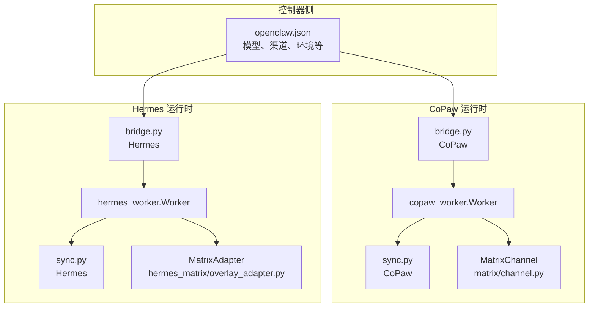
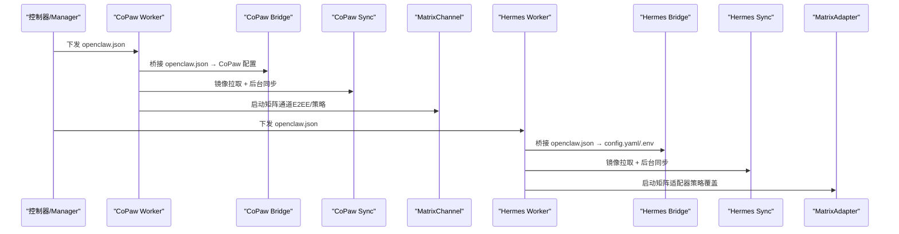
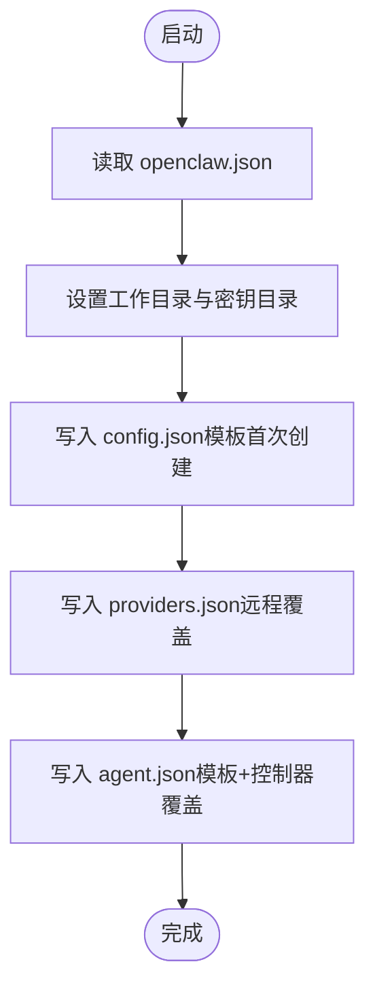
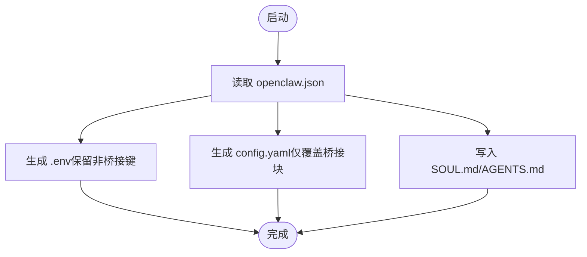
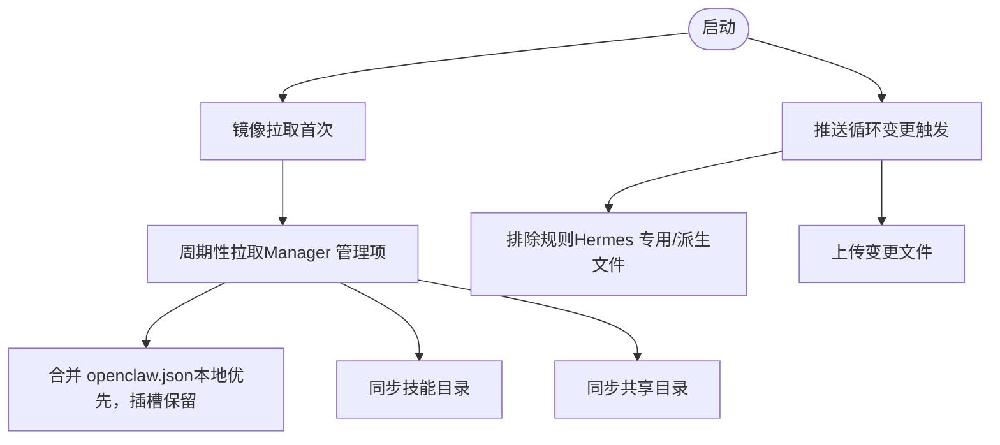
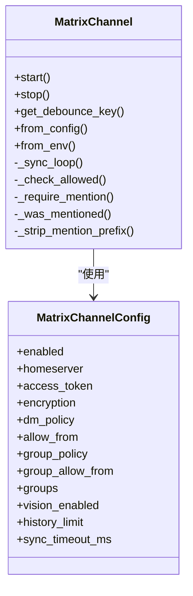
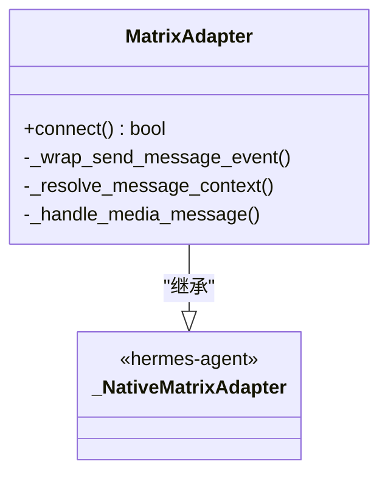
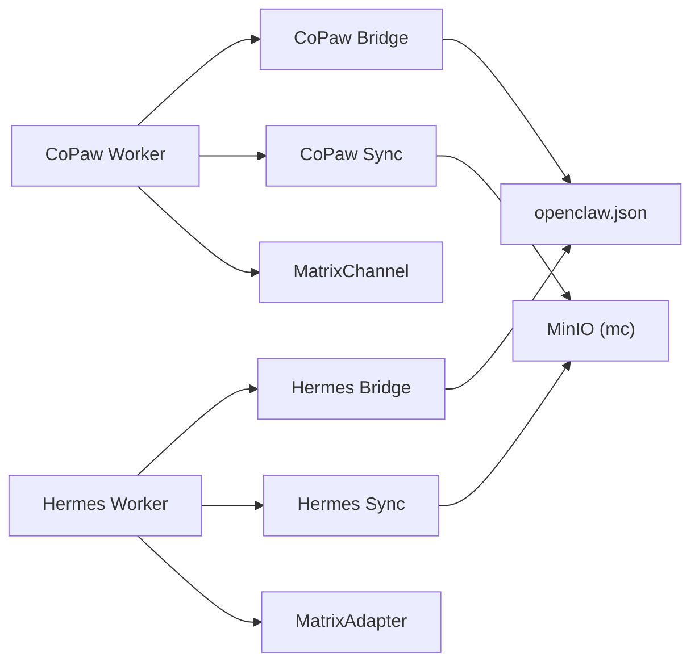

# 运行时兼容性

<cite>
**本文引用的文件**
- [copaw/README.md](file://copaw/README.md)
- [hermes/README.md](file://hermes/README.md)
- [copaw/src/copaw_worker/worker.py](file://copaw/src/copaw_worker/worker.py)
- [hermes/src/hermes_worker/worker.py](file://hermes/src/hermes_worker/worker.py)
- [copaw/src/copaw_worker/bridge.py](file://copaw/src/copaw_worker/bridge.py)
- [hermes/src/hermes_worker/bridge.py](file://hermes/src/hermes_worker/bridge.py)
- [copaw/src/copaw_worker/config.py](file://copaw/src/copaw_worker/config.py)
- [hermes/src/hermes_worker/config.py](file://hermes/src/hermes_worker/config.py)
- [copaw/src/copaw_worker/sync.py](file://copaw/src/copaw_worker/sync.py)
- [hermes/src/hermes_worker/sync.py](file://hermes/src/hermes_worker/sync.py)
- [copaw/src/matrix/channel.py](file://copaw/src/matrix/channel.py)
- [hermes/src/hermes_matrix/overlay_adapter.py](file://hermes/src/hermes_matrix/overlay_adapter.py)
- [hermes/src/hermes_matrix/adapter.py](file://hermes/src/hermes_matrix/adapter.py)
- [manager/agent/copaw-manager-agent/AGENTS.md](file://manager/agent/copaw-manager-agent/AGENTS.md)
- [manager/agent/hermes-worker-agent/AGENTS.md](file://manager/agent/hermes-worker-agent/AGENTS.md)
</cite>

## 目录
1. [引言](#引言)
2. [项目结构](#项目结构)
3. [核心组件](#核心组件)
4. [架构总览](#架构总览)
5. [详细组件分析](#详细组件分析)
6. [依赖关系分析](#依赖关系分析)
7. [性能考量](#性能考量)
8. [故障排查指南](#故障排查指南)
9. [结论](#结论)
10. [附录](#附录)

## 引言
本指南面向需要在 HiClaw 中编写与部署“技能”（Skill）的开发者，聚焦于两种 Worker 运行时：CoPaw 与 Hermes。目标是帮助你在不同运行时之间实现一致的功能体验与行为边界，涵盖以下关键点：
- 各运行时的特性差异与限制（如矩阵通道策略、加密与历史缓冲、模型能力映射等）
- 兼容性适配技术方案（条件执行、功能降级、跨运行时通用实现）
- 配置桥接与文件同步机制（openclaw.json 到运行时本地配置的映射）
- 兼容性测试方法与验证流程
- 开发注意事项与最佳实践

## 项目结构
HiClaw 将运行时抽象为两个 Worker 包：copaw-worker 与 hermes-worker。两者均通过“配置桥接 + 文件同步”的方式，将控制器下发的 openclaw.json 转换为各自运行时所需的本地配置，并通过 MinIO 客户端（mc）进行双向同步。

图示来源
- [copaw/src/copaw_worker/worker.py:44-177](file://copaw/src/copaw_worker/worker.py#L44-L177)
- [hermes/src/hermes_worker/worker.py:44-165](file://hermes/src/hermes_worker/worker.py#L44-L165)
- [copaw/src/copaw_worker/bridge.py:155-211](file://copaw/src/copaw_worker/bridge.py#L155-L211)
- [hermes/src/hermes_worker/bridge.py:400-538](file://hermes/src/hermes_worker/bridge.py#L400-L538)
- [copaw/src/copaw_worker/sync.py:114-263](file://copaw/src/copaw_worker/sync.py#L114-L263)
- [hermes/src/hermes_worker/sync.py:114-265](file://hermes/src/hermes_worker/sync.py#L114-L265)
- [copaw/src/matrix/channel.py:216-477](file://copaw/src/matrix/channel.py#L216-L477)
- [hermes/src/hermes_matrix/overlay_adapter.py:94-240](file://hermes/src/hermes_matrix/overlay_adapter.py#L94-L240)

章节来源
- [copaw/README.md:1-18](file://copaw/README.md#L1-L18)
- [hermes/README.md:1-82](file://hermes/README.md#L1-L82)

## 核心组件
- Worker 生命周期与启动流程
  - CoPaw：启动时镜像拉取、配置桥接、安装矩阵通道、技能同步、后台同步循环、启动内置 Web 控制台。
  - Hermes：启动时镜像拉取、配置桥接、技能与 mcporter 配置同步、后台同步循环、启动网关。
- 配置桥接
  - CoPaw：将 openclaw.json 映射到 CoPaw 的 config.json、agent.json、providers.json 等。
  - Hermes：将 openclaw.json 映射到 HERMES_HOME 下的 config.yaml 与 .env。
- 文件同步
  - 双向同步：Manager 推送的配置与技能从 MinIO 拉取；Worker 写入的会话、记忆等推送到 MinIO。
  - 同步策略：按需拉取 Manager 管理的文件；对 Worker 管理的文件进行去重与覆盖策略。
- 矩阵通道/适配器
  - CoPaw：自定义 MatrixChannel（matrix-nio），支持 E2EE、历史缓冲、提及策略、媒体处理等。
  - Hermes：基于 hermes-agent 原生 Matrix 适配器的覆盖层，注入 HiClaw 策略（提及增强、允许列表、历史缓冲、图像降级）。

章节来源
- [copaw/src/copaw_worker/worker.py:45-177](file://copaw/src/copaw_worker/worker.py#L45-L177)
- [hermes/src/hermes_worker/worker.py:59-165](file://hermes/src/hermes_worker/worker.py#L59-L165)
- [copaw/src/copaw_worker/bridge.py:155-211](file://copaw/src/copaw_worker/bridge.py#L155-L211)
- [hermes/src/hermes_worker/bridge.py:400-538](file://hermes/src/hermes_worker/bridge.py#L400-L538)
- [copaw/src/copaw_worker/sync.py:225-463](file://copaw/src/copaw_worker/sync.py#L225-L463)
- [hermes/src/hermes_worker/sync.py:222-457](file://hermes/src/hermes_worker/sync.py#L222-L457)
- [copaw/src/matrix/channel.py:216-477](file://copaw/src/matrix/channel.py#L216-L477)
- [hermes/src/hermes_matrix/overlay_adapter.py:94-240](file://hermes/src/hermes_matrix/overlay_adapter.py#L94-L240)

## 架构总览
下图展示两类运行时在“配置桥接 + 文件同步 + 矩阵通道”上的统一流程，以及各自的差异化实现点。

图示来源
- [copaw/src/copaw_worker/worker.py:65-177](file://copaw/src/copaw_worker/worker.py#L65-L177)
- [hermes/src/hermes_worker/worker.py:86-165](file://hermes/src/hermes_worker/worker.py#L86-L165)
- [copaw/src/copaw_worker/bridge.py:155-211](file://copaw/src/copaw_worker/bridge.py#L155-L211)
- [hermes/src/hermes_worker/bridge.py:400-538](file://hermes/src/hermes_worker/bridge.py#L400-L538)
- [copaw/src/matrix/channel.py:335-477](file://copaw/src/matrix/channel.py#L335-L477)
- [hermes/src/hermes_matrix/overlay_adapter.py:103-240](file://hermes/src/hermes_matrix/overlay_adapter.py#L103-L240)

## 详细组件分析

### 配置桥接（CoPaw）
- 目标产物：config.json、workspaces/default/agent.json、providers.json（含密钥安全目录）。
- 关键策略：
  - 首次创建使用模板；后续重启仅覆盖控制器拥有的字段（如矩阵策略、运行参数）。
  - 提供者凭据（apiKey/baseUrl）由控制器全权管理，写入安全目录。
  - 视觉能力（vision_enabled）由当前活跃模型决定，桥接时解析并注入。
- 端口重映射：容器内 :8080 自动映射到宿主机暴露端口，保证网关连通性。

图示来源
- [copaw/src/copaw_worker/bridge.py:155-211](file://copaw/src/copaw_worker/bridge.py#L155-L211)
- [copaw/src/copaw_worker/bridge.py:519-581](file://copaw/src/copaw_worker/bridge.py#L519-L581)
- [copaw/src/copaw_worker/bridge.py:587-648](file://copaw/src/copaw_worker/bridge.py#L587-L648)

章节来源
- [copaw/src/copaw_worker/bridge.py:155-211](file://copaw/src/copaw_worker/bridge.py#L155-L211)
- [copaw/src/copaw_worker/bridge.py:217-266](file://copaw/src/copaw_worker/bridge.py#L217-L266)
- [copaw/src/copaw_worker/bridge.py:469-512](file://copaw/src/copaw_worker/bridge.py#L469-L512)

### 配置桥接（Hermes）
- 目标产物：HERMES_HOME/config.yaml、.env、SOUL.md/AGENTS.md。
- 关键策略：
  - .env 仅重写桥接拥有的键（MATRIX_*、OPENAI_*、HERMES_DEFAULT_MODEL），保留用户自定义键。
  - config.yaml 仅替换桥接拥有的块（model、matrix、platforms.matrix、auxiliary.vision、logging），其他保持原样。
  - 视觉能力（vision_enabled）通过辅助视觉配置与模型配置联动。
- 端口重映射：容器内 :8080 自动映射到宿主端口，保证网关连通性。

图示来源
- [hermes/src/hermes_worker/bridge.py:400-538](file://hermes/src/hermes_worker/bridge.py#L400-L538)
- [hermes/src/hermes_worker/bridge.py:213-262](file://hermes/src/hermes_worker/bridge.py#L213-L262)
- [hermes/src/hermes_worker/bridge.py:315-380](file://hermes/src/hermes_worker/bridge.py#L315-L380)

章节来源
- [hermes/src/hermes_worker/bridge.py:400-538](file://hermes/src/hermes_worker/bridge.py#L400-L538)

### 文件同步（CoPaw）
- 设计原则：谁写谁推；Manager 管理的文件只拉取；Worker 管理的文件只推送。
- 同步策略：
  - 首次启动全量镜像拉取（mirror_all）。
  - 后续周期性拉取 Manager 管理的 openclaw.json、mcporter.json、skills/、shared/。
  - 推送策略：扫描变更文件，排除 Manager 管理项与派生文件，避免冲突。
  - openclaw.json 合并：远端（Manager）为主，本地（Worker）插槽保留（如 accessToken、插件 entries）。

图示来源
- [copaw/src/copaw_worker/sync.py:225-463](file://copaw/src/copaw_worker/sync.py#L225-L463)
- [copaw/src/copaw_worker/sync.py:466-634](file://copaw/src/copaw_worker/sync.py#L466-L634)

章节来源
- [copaw/src/copaw_worker/sync.py:225-463](file://copaw/src/copaw_worker/sync.py#L225-L463)
- [copaw/src/copaw_worker/sync.py:50-97](file://copaw/src/copaw_worker/sync.py#L50-L97)

### 文件同步（Hermes）
- 设计原则与 CoPaw 一致：谁写谁推；Manager 管理的文件只拉取；Worker 管理的文件只推送。
- 差异点：
  - 排除规则更严格：屏蔽 hermes 专用缓存与派生目录（如 platforms、matrix-nio-store、cache 等）。
  - 内外层文件同步：.hermes/ 内部的 SOUL/AGENTS 与根目录外层互相同步，确保推送一致性。

图示来源
- [hermes/src/hermes_worker/sync.py:222-457](file://hermes/src/hermes_worker/sync.py#L222-L457)
- [hermes/src/hermes_worker/sync.py:481-622](file://hermes/src/hermes_worker/sync.py#L481-L622)

章节来源
- [hermes/src/hermes_worker/sync.py:222-457](file://hermes/src/hermes_worker/sync.py#L222-L457)
- [hermes/src/hermes_worker/sync.py:481-622](file://hermes/src/hermes_worker/sync.py#L481-L622)

### 矩阵通道与适配器（CoPaw）
- 实现：基于 matrix-nio 的 MatrixChannel，支持：
  - E2EE：设备密钥持久化、会话维护、密钥分发。
  - 历史缓冲：未提及消息在群组中缓冲，提及后拼接上下文。
  - 提及策略：DM/群组分别允许列表；支持 per-room requireMention/autoReply。
  - 媒体处理：图片/文件/音频/视频事件解析与格式化。
- 运行时：通过 uvicorn 启动内置 Web 控制台，便于调试与状态查看。

图示来源
- [copaw/src/matrix/channel.py:216-477](file://copaw/src/matrix/channel.py#L216-L477)
- [copaw/src/matrix/channel.py:160-206](file://copaw/src/matrix/channel.py#L160-L206)

章节来源
- [copaw/src/matrix/channel.py:216-477](file://copaw/src/matrix/channel.py#L216-L477)

### 矩阵适配器（Hermes）
- 实现：继承 hermes-agent 原生 MatrixAdapter，仅注入 HiClaw 策略层：
  - 出站提及增强：为每条消息补充 m.mentions。
  - 双允许列表：DM/群组分别控制。
  - 历史缓冲：未提及消息在群组中缓冲，提及后拼接。
  - 图像降级：当模型不支持视觉时，将图片事件降级为文本描述。
- 运行时：通过网关启动，加载 config.yaml/.env，连接 Matrix 并进入消息处理循环。

图示来源
- [hermes/src/hermes_matrix/overlay_adapter.py:94-240](file://hermes/src/hermes_matrix/overlay_adapter.py#L94-L240)

章节来源
- [hermes/src/hermes_matrix/overlay_adapter.py:94-240](file://hermes/src/hermes_matrix/overlay_adapter.py#L94-L240)
- [hermes/src/hermes_matrix/adapter.py:1-5](file://hermes/src/hermes_matrix/adapter.py#L1-L5)

## 依赖关系分析
- 运行时入口与生命周期
  - CoPaw：Worker.run → start → bridge → 安装矩阵通道 → 启动内置 Web 控制台。
  - Hermes：Worker.run → start → bridge → 启动网关 → 加载 config.yaml/.env。
- 配置桥接依赖
  - CoPaw：依赖模板与路径补丁，确保 config.json/agent.json/providers.json 的生成与安全存储。
  - Hermes：依赖 .env 与 config.yaml 的增量覆盖，避免用户自定义被覆盖。
- 同步依赖
  - 两者均依赖 mc CLI 与 MinIO，采用“谁写谁推”的原则，避免竞态。
- 矩阵通道依赖
  - CoPaw：依赖 matrix-nio 与 QwenPaw 基类通道；Hermes：依赖 hermes-agent 原生适配器与覆盖层。

图示来源
- [copaw/src/copaw_worker/worker.py:45-177](file://copaw/src/copaw_worker/worker.py#L45-L177)
- [hermes/src/hermes_worker/worker.py:59-165](file://hermes/src/hermes_worker/worker.py#L59-L165)
- [copaw/src/copaw_worker/bridge.py:155-211](file://copaw/src/copaw_worker/bridge.py#L155-L211)
- [hermes/src/hermes_worker/bridge.py:400-538](file://hermes/src/hermes_worker/bridge.py#L400-L538)
- [copaw/src/copaw_worker/sync.py:114-263](file://copaw/src/copaw_worker/sync.py#L114-L263)
- [hermes/src/hermes_worker/sync.py:114-265](file://hermes/src/hermes_worker/sync.py#L114-L265)

章节来源
- [copaw/src/copaw_worker/worker.py:45-177](file://copaw/src/copaw_worker/worker.py#L45-L177)
- [hermes/src/hermes_worker/worker.py:59-165](file://hermes/src/hermes_worker/worker.py#L59-L165)

## 性能考量
- 同步频率与带宽
  - CoPaw/Hermes 的同步循环默认周期较长，适合减少网络压力；对于高频更新场景可缩短周期或使用变更触发推送。
- 端口映射与容器网络
  - 容器内 :8080 自动映射到宿主端口，避免硬编码导致的连通性问题。
- E2EE 与密钥维护
  - CoPaw 在每次启动时进行密钥上传/查询/声明与 to-device 消息发送，确保加密链路稳定。
- 媒体处理
  - CoPaw/Hermes 对媒体事件进行格式化与降级处理，避免不必要的传输与解析开销。

## 故障排查指南
- 配置桥接失败
  - CoPaw：检查 config.json/agent.json/providers.json 是否存在；确认模板是否成功写入；核对 providers.json 的 apiKey/baseUrl。
  - Hermes：检查 .env 与 config.yaml 是否被桥接覆盖；确认 MATRIX_* 与 OPENAI_* 是否正确生成。
- 文件同步异常
  - CoPaw：确认 mc alias 设置；检查排除规则是否误删本地文件；验证 openclaw.json 合并逻辑。
  - Hermes：确认排除规则是否屏蔽了 .env/config.yaml；检查内外层 SOUL/AGENTS 同步。
- 矩阵通道/适配器问题
  - CoPaw：检查 E2EE 设备密钥与会话；核对 allowlist 与 requireMention；验证历史缓冲是否生效。
  - Hermes：确认出站提及增强是否启用；检查图像降级逻辑是否按预期触发。
- 常用定位手段
  - 查看 Worker 日志与同步任务输出。
  - 使用 mc cat/ls 验证 MinIO 上的对象是否存在与权限是否正确。
  - 在 Manager Agent 的文档中参考消息发送与 @mention 规则，避免因消息格式导致的静默丢弃。

章节来源
- [copaw/src/copaw_worker/bridge.py:519-581](file://copaw/src/copaw_worker/bridge.py#L519-L581)
- [hermes/src/hermes_worker/bridge.py:400-538](file://hermes/src/hermes_worker/bridge.py#L400-L538)
- [copaw/src/copaw_worker/sync.py:143-183](file://copaw/src/copaw_worker/sync.py#L143-L183)
- [hermes/src/hermes_worker/sync.py:149-180](file://hermes/src/hermes_worker/sync.py#L149-L180)
- [copaw/src/matrix/channel.py:335-477](file://copaw/src/matrix/channel.py#L335-L477)
- [hermes/src/hermes_matrix/overlay_adapter.py:103-240](file://hermes/src/hermes_matrix/overlay_adapter.py#L103-L240)
- [manager/agent/copaw-manager-agent/AGENTS.md:74-101](file://manager/agent/copaw-manager-agent/AGENTS.md#L74-L101)
- [manager/agent/hermes-worker-agent/AGENTS.md:92-142](file://manager/agent/hermes-worker-agent/AGENTS.md#L92-L142)

## 结论
通过统一的“配置桥接 + 文件同步 + 矩阵策略覆盖”，HiClaw 在 CoPaw 与 Hermes 两种运行时上实现了高度一致的行为体验。开发者在编写技能时应关注：
- openclaw.json 字段映射与桥接策略
- 同步循环与推送策略的边界
- 矩阵通道/适配器的策略差异（提及、允许列表、历史缓冲、E2EE、图像降级）
- 兼容性测试与验证流程（含端到端消息流转与配置热更新）

## 附录

### 兼容性适配技术方案
- 条件执行
  - 在技能中根据运行时类型（例如通过环境变量或运行时包可用性）选择不同的执行路径。
- 功能降级
  - 当模型不支持视觉输入时，Hermes 会自动将图片事件降级为文本描述；CoPaw 的 MatrixChannel 也会根据 vision_enabled 控制媒体处理。
- 跨运行时通用实现
  - 统一使用 openclaw.json 描述配置；通过桥接生成各自运行时的本地配置；通过同步机制保证状态一致性。

章节来源
- [hermes/src/hermes_matrix/overlay_adapter.py:189-229](file://hermes/src/hermes_matrix/overlay_adapter.py#L189-L229)
- [copaw/src/matrix/channel.py:196-203](file://copaw/src/matrix/channel.py#L196-L203)

### 兼容性测试方法与验证流程
- 配置验证
  - 启动 Worker 后检查 config.json/agent.json（CoPaw）或 config.yaml/.env（Hermes）是否生成正确。
  - 验证 providers.json（CoPaw）或 OPENAI_*（Hermes）是否指向正确的网关端口。
- 同步验证
  - 在 MinIO 中放置 openclaw.json 与技能目录，观察 Worker 是否拉取并应用。
  - 修改 Worker 本地文件（如 SOUL/AGENTS），观察是否推送回 MinIO。
- 矩阵交互验证
  - 在群组房间中发送不含 @mention 的消息，验证历史缓冲是否生效。
  - 发送不含 @mention 的图片，验证图像降级（若模型不支持视觉）。
- 端到端验证
  - 使用 Manager Agent 的消息发送规则，构造完整的任务流转，验证 Worker 是否正确响应。

章节来源
- [copaw/src/copaw_worker/worker.py:65-177](file://copaw/src/copaw_worker/worker.py#L65-L177)
- [hermes/src/hermes_worker/worker.py:86-165](file://hermes/src/hermes_worker/worker.py#L86-L165)
- [manager/agent/copaw-manager-agent/AGENTS.md:74-101](file://manager/agent/copaw-manager-agent/AGENTS.md#L74-L101)
- [manager/agent/hermes-worker-agent/AGENTS.md:92-142](file://manager/agent/hermes-worker-agent/AGENTS.md#L92-L142)