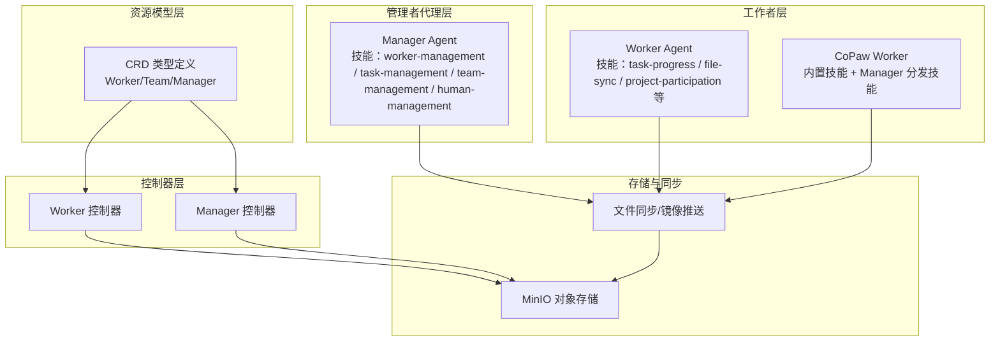
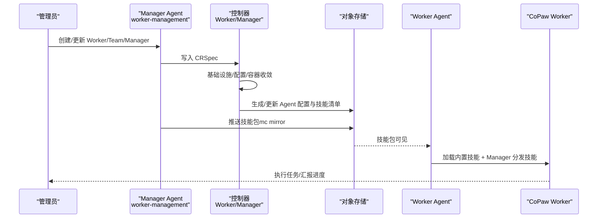
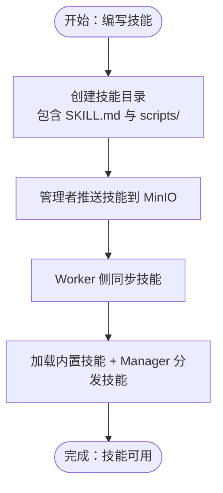
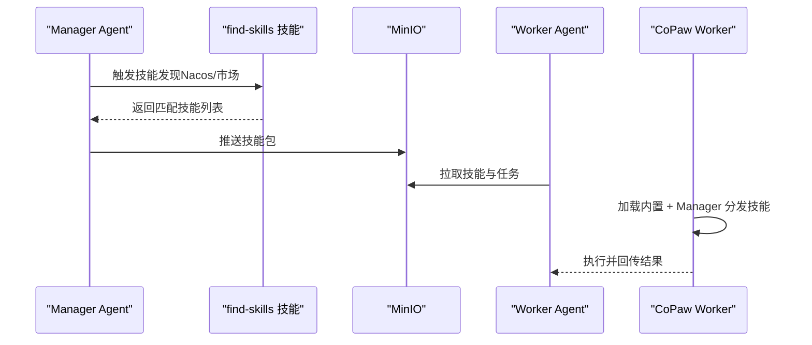
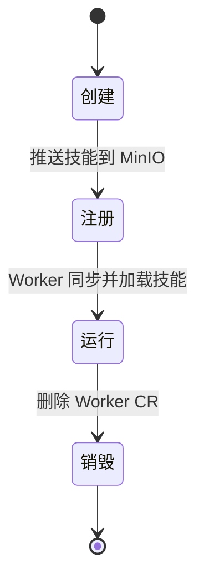
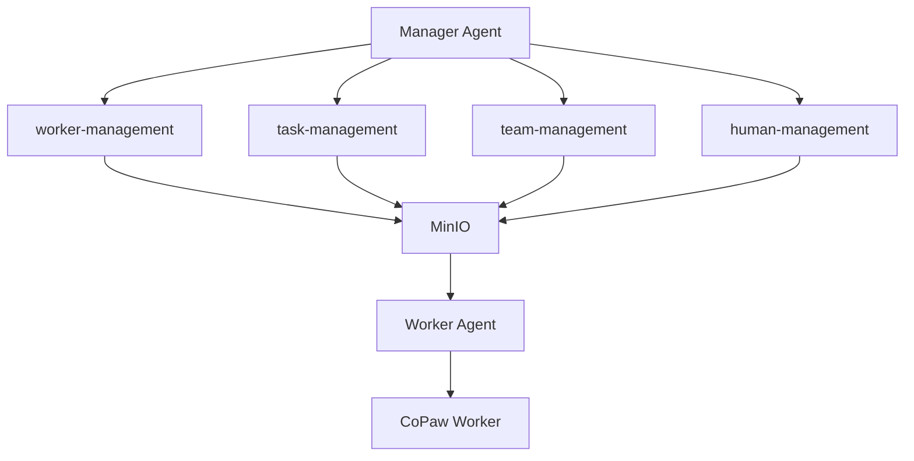
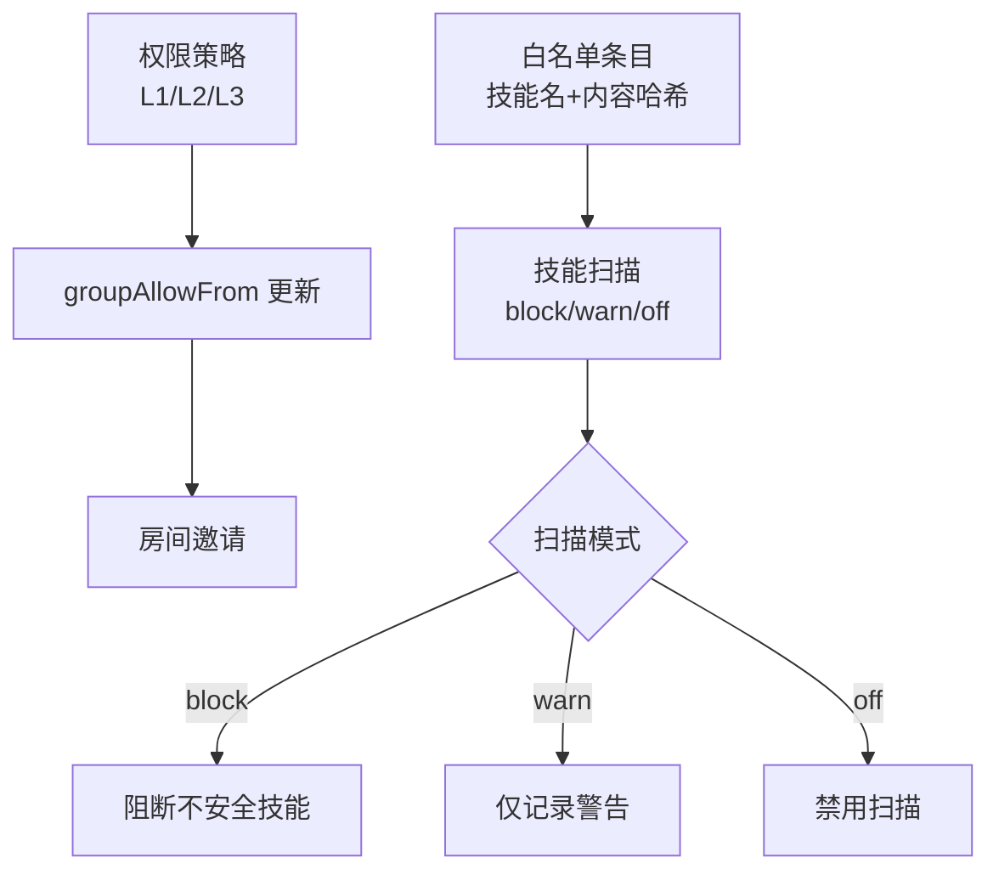
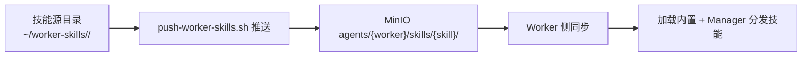
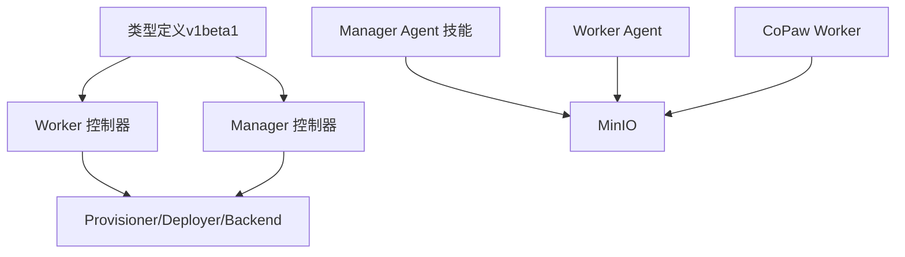

# 技能架构设计

<cite>
**本文引用的文件**   
- [SKILL.md（worker-management）](file://manager/agent/skills/worker-management/SKILL.md)
- [SKILL.md（task-management）](file://manager/agent/skills/task-management/SKILL.md)
- [SKILL.md（team-management）](file://manager/agent/skills/team-management/SKILL.md)
- [SKILL.md（human-management）](file://manager/agent/skills/human-management/SKILL.md)
- [技能管理参考（worker-management）](file://manager/agent/skills/worker-management/references/skills-management.md)
- [生命周期管理参考（worker-management）](file://manager/agent/skills/worker-management/references/lifecycle.md)
- [类型定义（v1beta1）](file://hiclaw-controller/api/v1beta1/types.go)
- [Worker 控制器](file://hiclaw-controller/internal/controller/worker_controller.go)
- [Manager 控制器](file://hiclaw-controller/internal/controller/manager_controller.go)
- [CoPaw 技能扫描配置](file://copaw/src/matrix/config.py)
- [CoPaw Worker 同步逻辑](file://copaw/src/copaw_worker/worker.py)
- [技能推送脚本](file://manager/agent/skills/worker-management/scripts/push-worker-skills.sh)
- [查找技能脚本（CoPaw Worker）](file://manager/agent/copaw-worker-agent/skills/find-skills/SKILL.md)
</cite>

## 目录
1. [引言](#引言)
2. [项目结构](#项目结构)
3. [核心组件](#核心组件)
4. [架构总览](#架构总览)
5. [详细组件分析](#详细组件分析)
6. [依赖分析](#依赖分析)
7. [性能考量](#性能考量)
8. [故障排查指南](#故障排查指南)
9. [结论](#结论)
10. [附录](#附录)

## 引言
本文件面向 HiClaw 技能架构设计，系统性阐述技能系统的定义格式、注册机制、发现算法与执行环境；详解技能生命周期（创建、注册、分发、运行、销毁）；说明技能与 Manager Agent、Worker 的交互模式及依赖与协作；给出隔离与安全机制（权限控制、资源限制、技能扫描）；并提供架构图与数据流图，帮助开发者快速理解与扩展。

## 项目结构
HiClaw 将“技能”抽象为可声明、可分发、可执行的单元，围绕以下层次组织：
- 资源模型层：通过 CRD 定义 Worker/Team/Manager 等资源及其状态字段
- 控制器层：根据资源期望状态收敛实际后端状态，负责基础设施、配置与容器生命周期
- 管理者代理层：提供技能化的管理能力（如 Worker 生命周期、任务编排、团队管理、人类接入）
- 工作者层：按需加载技能，执行任务，与管理者/其他工作者协作
- 存储与同步：通过对象存储统一分发技能包，Worker 侧周期性同步

图表来源
- [类型定义（v1beta1）:63-146](file://hiclaw-controller/api/v1beta1/types.go#L63-L146)
- [Worker 控制器:110-151](file://hiclaw-controller/internal/controller/worker_controller.go#L110-L151)
- [Manager 控制器:128-160](file://hiclaw-controller/internal/controller/manager_controller.go#L128-L160)
- [技能管理参考（worker-management）:1-40](file://manager/agent/skills/worker-management/references/skills-management.md#L1-L40)

章节来源
- [类型定义（v1beta1）:63-146](file://hiclaw-controller/api/v1beta1/types.go#L63-L146)
- [Worker 控制器:110-151](file://hiclaw-controller/internal/controller/worker_controller.go#L110-L151)
- [Manager 控制器:128-160](file://hiclaw-controller/internal/controller/manager_controller.go#L128-L160)

## 核心组件
- 资源模型（Worker/Team/Manager）
  - Worker/Team/Manager 的 Spec/Status 字段承载运行态期望与观测态结果，控制器据此收敛
- 管理者代理技能集
  - worker-management：Worker 生命周期、技能推送、运行时切换、远程安装命令生成
  - task-management：任务委派、状态管理、无限任务、心跳检查
  - team-management：团队创建、领导与成员、房间策略
  - human-management：人类用户接入、权限等级、房间邀请
- 工作者代理技能集
  - task-progress、file-sync、project-participation 等默认技能
  - CoPaw Worker 内置技能与 Manager 分发技能叠加
- 控制器与后端
  - Worker/Manager 控制器负责基础设施、服务账号、配置生成、容器部署与暴露
- 存储与同步
  - 通过对象存储统一分发技能目录，Worker 侧周期同步

章节来源
- [SKILL.md（worker-management）:1-83](file://manager/agent/skills/worker-management/SKILL.md#L1-L83)
- [SKILL.md（task-management）:1-30](file://manager/agent/skills/task-management/SKILL.md#L1-L30)
- [SKILL.md（team-management）:1-48](file://manager/agent/skills/team-management/SKILL.md#L1-L48)
- [SKILL.md（human-management）:1-45](file://manager/agent/skills/human-management/SKILL.md#L1-L45)
- [类型定义（v1beta1）:71-146](file://hiclaw-controller/api/v1beta1/types.go#L71-L146)

## 架构总览
下图展示技能在资源模型、控制器、管理者代理与工作者之间的流转路径与职责边界。

图表来源
- [类型定义（v1beta1）:71-146](file://hiclaw-controller/api/v1beta1/types.go#L71-L146)
- [Worker 控制器:110-151](file://hiclaw-controller/internal/controller/worker_controller.go#L110-L151)
- [Manager 控制器:128-160](file://hiclaw-controller/internal/controller/manager_controller.go#L128-L160)
- [技能推送脚本:103-135](file://manager/agent/skills/worker-management/scripts/push-worker-skills.sh#L103-L135)
- [CoPaw Worker 同步逻辑:352-375](file://copaw/src/copaw_worker/worker.py#L352-L375)

## 详细组件分析

### 技能定义与注册机制
- 定义格式
  - 每个技能以目录形式存在，包含描述文件（如 SKILL.md）与脚本目录（scripts/），描述文件包含 name、description 等元信息
- 注册与分发
  - 管理者侧通过 worker-management 技能提供的脚本将技能推送到 MinIO，目标路径为 agents/{worker}/skills/{skill}/
  - Worker 侧（含 CoPaw Worker）从 MinIO 同步技能，内置技能为基础层，Manager 分发的技能覆盖优先级更高
- 默认技能
  - file-sync、task-progress、project-participation 为默认技能，不可移除

图表来源
- [技能管理参考（worker-management）:26-40](file://manager/agent/skills/worker-management/references/skills-management.md#L26-L40)
- [技能推送脚本:103-135](file://manager/agent/skills/worker-management/scripts/push-worker-skills.sh#L103-L135)
- [CoPaw Worker 同步逻辑:352-375](file://copaw/src/copaw_worker/worker.py#L352-L375)

章节来源
- [SKILL.md（worker-management）:35-40](file://manager/agent/skills/worker-management/SKILL.md#L35-L40)
- [技能管理参考（worker-management）:1-40](file://manager/agent/skills/worker-management/references/skills-management.md#L1-L40)
- [技能推送脚本:103-135](file://manager/agent/skills/worker-management/scripts/push-worker-skills.sh#L103-L135)
- [CoPaw Worker 同步逻辑:352-375](file://copaw/src/copaw_worker/worker.py#L352-L375)

### 技能发现算法与执行环境
- 发现算法
  - 查找技能脚本：CoPaw Worker 提供 find-skills 技能，用于在特定运行时（如 Nacos）场景下搜索可用技能
  - 执行环境
    - Worker Agent 运行在各自容器中，按需加载技能
    - CoPaw Worker 在启动时先去重旧定制技能，再加载内置技能，最后叠加 Manager 分发的技能
- 执行流程
  - 管理者将任务与技能清单写入 MinIO
  - Worker 通过 file-sync 获取最新技能与任务文件，执行后回传结果至 MinIO

图表来源
- [查找技能脚本（CoPaw Worker）:172-175](file://manager/agent/copaw-worker-agent/skills/find-skills/SKILL.md#L172-L175)
- [CoPaw Worker 同步逻辑:352-375](file://copaw/src/copaw_worker/worker.py#L352-L375)
- [技能推送脚本:103-135](file://manager/agent/skills/worker-management/scripts/push-worker-skills.sh#L103-L135)

章节来源
- [查找技能脚本（CoPaw Worker）:172-175](file://manager/agent/copaw-worker-agent/skills/find-skills/SKILL.md#L172-L175)
- [CoPaw Worker 同步逻辑:352-375](file://copaw/src/copaw_worker/worker.py#L352-L375)

### 技能生命周期管理
- 创建
  - 通过 worker-management 的创建流程生成 Worker，控制器生成 Agent 配置与默认技能
- 注册
  - 使用 push-worker-skills.sh 将技能注册到 MinIO 并通知 Worker
- 运行
  - Worker 侧周期同步与即时通知触发同步，加载技能并执行任务
- 销毁
  - 删除 Worker CR，控制器清理基础设施与状态；技能包保留以便后续复用

图表来源
- [生命周期管理参考（worker-management）:1-56](file://manager/agent/skills/worker-management/references/lifecycle.md#L1-L56)
- [技能推送脚本:103-135](file://manager/agent/skills/worker-management/scripts/push-worker-skills.sh#L103-L135)
- [Worker 控制器:110-151](file://hiclaw-controller/internal/controller/worker_controller.go#L110-L151)

章节来源
- [生命周期管理参考（worker-management）:1-56](file://manager/agent/skills/worker-management/references/lifecycle.md#L1-L56)
- [Worker 控制器:110-151](file://hiclaw-controller/internal/controller/worker_controller.go#L110-L151)

### 技能与 Manager Agent、Worker 的交互模式
- Manager Agent
  - 通过 worker-management 管理 Worker 生命周期与技能分发
  - 通过 task-management 编排任务、协调 Worker 与团队
  - 通过 team-management 组织团队、房间与权限
  - 通过 human-management 接入人类用户并设置权限
- Worker
  - 通过 file-sync 获取最新技能与任务
  - 通过 task-progress 回报进度
  - 通过 project-participation 参与项目协作
- 协作机制
  - 任务委派：Manager 指定 Worker 或 Team Leader，由后者分解与协调
  - 心跳检查：定期轮询已分配任务状态，避免无限循环

图表来源
- [SKILL.md（worker-management）:45-60](file://manager/agent/skills/worker-management/SKILL.md#L45-L60)
- [SKILL.md（task-management）:20-30](file://manager/agent/skills/task-management/SKILL.md#L20-L30)
- [SKILL.md（team-management）:39-48](file://manager/agent/skills/team-management/SKILL.md#L39-L48)
- [SKILL.md（human-management）:38-45](file://manager/agent/skills/human-management/SKILL.md#L38-L45)

章节来源
- [SKILL.md（worker-management）:45-60](file://manager/agent/skills/worker-management/SKILL.md#L45-L60)
- [SKILL.md（task-management）:20-30](file://manager/agent/skills/task-management/SKILL.md#L20-L30)
- [SKILL.md（team-management）:39-48](file://manager/agent/skills/team-management/SKILL.md#L39-L48)
- [SKILL.md（human-management）:38-45](file://manager/agent/skills/human-management/SKILL.md#L38-L45)

### 技能隔离与安全机制
- 权限控制
  - 人类用户权限等级（L1/L2/L3）决定可访问的房间与被允许的 @mention 来源
  - 通过 groupAllowFrom 与房间邀请实现细粒度通信权限
- 资源限制
  - Worker/Team/Manager 的容器与网络暴露由控制器统一收敛，避免跨实例冲突
- 技能扫描
  - CoPaw 支持对技能进行扫描，支持 block/warn/off 三种模式，可配置白名单条目
  - 扫描超时可配置，白名单条目可按技能名与内容哈希放行

图表来源
- [CoPaw 技能扫描配置:1100-1141](file://copaw/src/matrix/config.py#L1100-L1141)

章节来源
- [CoPaw 技能扫描配置:1100-1141](file://copaw/src/matrix/config.py#L1100-L1141)

### 数据流图
- 技能分发数据流
  - 管理者侧：worker-management 将技能目录镜像到 MinIO 的 agents/{worker}/skills/{skill}/
  - Worker 侧：周期性同步或收到通知后拉取最新技能
  - CoPaw Worker：内置技能为基础层，Manager 分发技能覆盖更高优先级

图表来源
- [技能管理参考（worker-management）:1-40](file://manager/agent/skills/worker-management/references/skills-management.md#L1-L40)
- [技能推送脚本:103-135](file://manager/agent/skills/worker-management/scripts/push-worker-skills.sh#L103-L135)
- [CoPaw Worker 同步逻辑:352-375](file://copaw/src/copaw_worker/worker.py#L352-L375)

## 依赖分析
- 资源模型与控制器
  - Worker/Team/Manager 的 Spec/Status 字段驱动控制器收敛；控制器通过 Provisioner/Deployer/Backend 管理基础设施与容器
- 管理者代理与工作者
  - 管理者代理技能通过脚本与 MinIO 交互；工作者通过 file-sync 与 CoPaw 技能管理器协同
- 外部依赖
  - 对象存储（MinIO）、容器后端（Kubernetes）、消息通道（Matrix）

图表来源
- [类型定义（v1beta1）:71-146](file://hiclaw-controller/api/v1beta1/types.go#L71-L146)
- [Worker 控制器:110-151](file://hiclaw-controller/internal/controller/worker_controller.go#L110-L151)
- [Manager 控制器:128-160](file://hiclaw-controller/internal/controller/manager_controller.go#L128-L160)

章节来源
- [类型定义（v1beta1）:71-146](file://hiclaw-controller/api/v1beta1/types.go#L71-L146)
- [Worker 控制器:110-151](file://hiclaw-controller/internal/controller/worker_controller.go#L110-L151)
- [Manager 控制器:128-160](file://hiclaw-controller/internal/controller/manager_controller.go#L128-L160)

## 性能考量
- 同步策略
  - 采用周期性同步（默认 5 分钟）与即时通知相结合，降低带宽与延迟
- 扫描开销
  - 技能扫描可配置超时，白名单可减少重复扫描成本
- 资源收敛
  - 控制器按需创建/更新/删除基础设施，避免无效重建

## 故障排查指南
- 技能未生效
  - 检查是否通过 worker-management 的脚本推送至 MinIO，确认 Worker 是否收到 file-sync 通知并完成同步
- Worker 无法启动
  - 查看控制器日志与 Worker 状态，确认容器后端状态与暴露端口
- 权限问题
  - 核对人类用户的权限等级与 groupAllowFrom 更新情况，确保房间邀请正确
- 技能扫描阻断
  - 检查扫描模式与白名单配置，必要时临时调整为 warn/off 以定位问题

章节来源
- [技能管理参考（worker-management）:24-40](file://manager/agent/skills/worker-management/references/skills-management.md#L24-L40)
- [生命周期管理参考（worker-management）:50-56](file://manager/agent/skills/worker-management/references/lifecycle.md#L50-L56)
- [CoPaw 技能扫描配置:1100-1141](file://copaw/src/matrix/config.py#L1100-L1141)

## 结论
HiClaw 技能架构以声明式资源模型为核心，结合控制器的收敛能力与管理者代理的技能化操作，形成“定义—分发—加载—执行”的闭环。通过权限控制、技能扫描与统一存储，既保证了灵活性与可扩展性，也兼顾了安全性与可观测性。建议在扩展新技能时遵循“最小权限、明确依赖、可审计”的原则，并充分利用默认技能与分发机制降低维护成本。

## 附录
- 自定义开发指导原则
  - 明确定义：在 SKILL.md 中提供清晰的 name/description/assign_when
  - 最小依赖：脚本仅使用必要的工具与权限
  - 可测试：提供最小可运行示例与验证步骤
  - 可审计：记录变更与版本，必要时加入扫描白名单
- 关键参考
  - worker-management 技能：生命周期、技能推送、运行时切换
  - task-management 技能：任务委派、状态管理、心跳检查
  - team-management 技能：团队组织、房间策略、权限继承
  - human-management 技能：人类接入、权限等级、房间邀请

章节来源
- [SKILL.md（worker-management）:1-83](file://manager/agent/skills/worker-management/SKILL.md#L1-L83)
- [SKILL.md（task-management）:1-30](file://manager/agent/skills/task-management/SKILL.md#L1-L30)
- [SKILL.md（team-management）:1-48](file://manager/agent/skills/team-management/SKILL.md#L1-L48)
- [SKILL.md（human-management）:1-45](file://manager/agent/skills/human-management/SKILL.md#L1-L45)