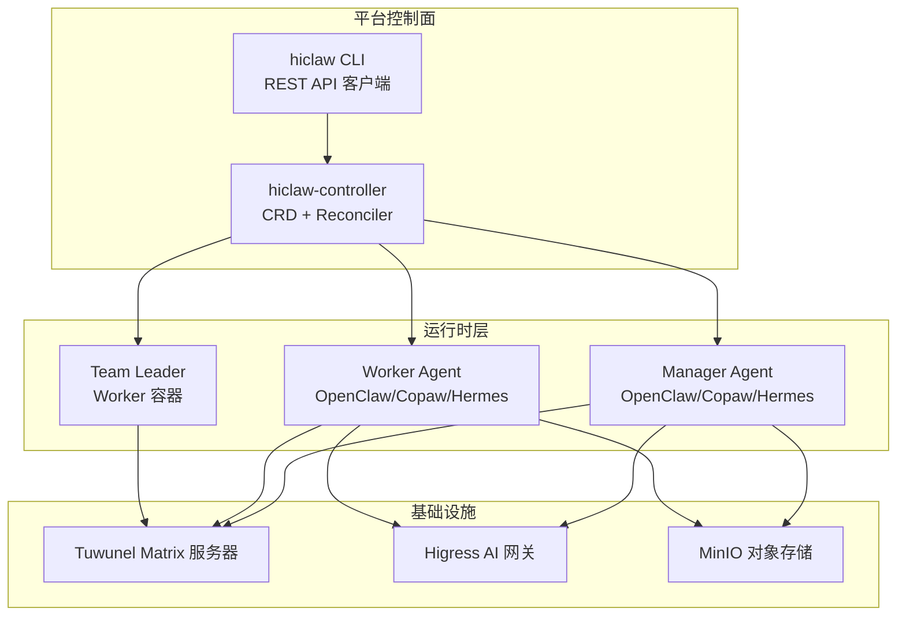
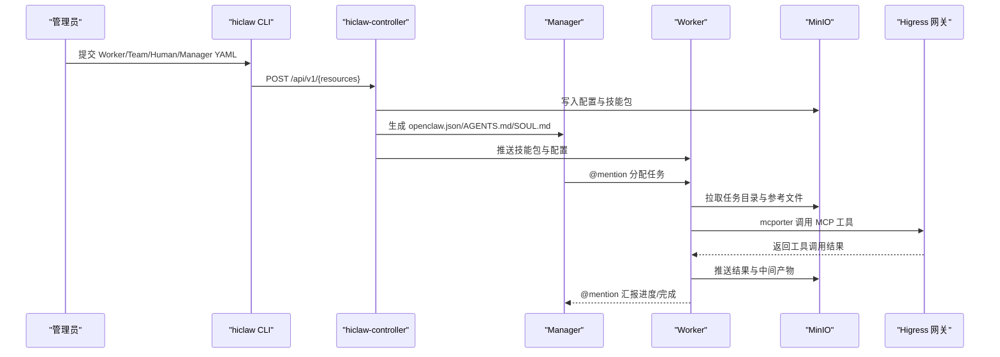
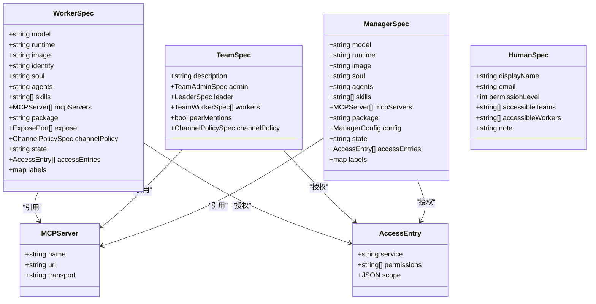

# 技能生态系统

<cite>
**本文引用的文件**
- [README.md](file://README.md)
- [架构说明.md](file://docs/zh-cn/architecture.md)
- [声明式资源管理.md](file://docs/zh-cn/declarative-resource-management.md)
- [types.go](file://hiclaw-controller/api/v1beta1/types.go)
- [main.go](file://hiclaw-controller/cmd/hiclaw/main.go)
- [AGENTS.md（Manager Agent 工作区）](file://manager/agent/worker-agent/AGENTS.md)
- [AGENTS.md（CoPaw Manager Agent）](file://manager/agent/copaw-manager-agent/AGENTS.md)
- [AGENTS.md（CoPaw 子系统导航）](file://copaw/AGENTS.md)
- [worker-management/SKILL.md](file://manager/agent/skills/worker-management/SKILL.md)
- [human-management/SKILL.md](file://manager/agent/skills/human-management/SKILL.md)
- [project-management/SKILL.md](file://manager/agent/skills/project-management/SKILL.md)
- [mcporter/SKILL.md](file://manager/agent/skills/mcporter/SKILL.md)
- [matrix-server-management/SKILL.md](file://manager/agent/skills/matrix-server-management/SKILL.md)
</cite>

## 目录
1. [简介](#简介)
2. [项目结构](#项目结构)
3. [核心组件](#核心组件)
4. [架构总览](#架构总览)
5. [详细组件分析](#详细组件分析)
6. [依赖分析](#依赖分析)
7. [性能考虑](#性能考虑)
8. [故障排查指南](#故障排查指南)
9. [结论](#结论)
10. [附录](#附录)

## 简介
本文件面向 HiClaw 技能生态系统，系统阐述技能分类、标签体系与搜索机制的设计思路与实践路径；说明技能贡献流程（提交、审核、评估与发布）；解释技能市场运作（下载统计、评价与推荐）；给出标准化规范（文档、测试与兼容性）；并提供治理机制（版权、争议解决与社区规则）。最后结合仓库现有能力，展示技能生态的现状、发展趋势与未来规划方向。

## 项目结构
HiClaw 采用“Manager-Workers”架构，围绕 Kubernetes 声明式资源（Worker、Team、Human、Manager）构建多运行时协作平台。技能生态以“技能包（skills/）”为核心载体，贯穿 Manager、Worker 与 Team Leader 的工作流，配合 MCP 服务器工具链与共享文件系统，形成可组合、可分发、可观测的技能能力网络。

图示来源
- [架构说明.md:1-189](file://docs/zh-cn/architecture.md#L1-L189)
- [声明式资源管理.md:1-800](file://docs/zh-cn/declarative-resource-management.md#L1-L800)
- [types.go:63-104](file://hiclaw-controller/api/v1beta1/types.go#L63-L104)

章节来源
- [README.md:1-404](file://README.md#L1-L404)
- [架构说明.md:1-189](file://docs/zh-cn/architecture.md#L1-L189)
- [声明式资源管理.md:1-800](file://docs/zh-cn/declarative-resource-management.md#L1-L800)

## 核心组件
- 控制器与 CLI：通过 CRD 描述资源期望状态，控制器负责调和（Reconcile）与自动化执行；CLI 提供命令行入口。
- Manager/Team Leader/Worker：三种角色分别承担编排、委派与执行职责，均以“技能包”驱动行为。
- MCP 工具链：通过 mcporter 与配置化的 MCP 服务器对接外部 API，扩展 Agent 的工具调用能力。
- 共享文件系统：MinIO 提供统一的对象存储，支撑配置、任务与结果的跨 Agent 共享与持久化。

章节来源
- [types.go:63-104](file://hiclaw-controller/api/v1beta1/types.go#L63-L104)
- [main.go:9-34](file://hiclaw-controller/cmd/hiclaw/main.go#L9-L34)
- [mcporter/SKILL.md:1-41](file://manager/agent/skills/mcporter/SKILL.md#L1-L41)

## 架构总览
技能生态以“声明式资源 + 技能包 + MCP 工具链 + 共享存储”为核心，形成如下闭环：
- 资源定义：Worker/Team/Human/Manager 通过 YAML 声明期望状态。
- 调和执行：控制器解析 YAML，生成 Agent 配置，推送至 MinIO，并启动容器。
- 技能分发：Manager 将内置或自定义技能推送到 Worker 的 MinIO 空间，Worker 通过技能包执行任务。
- 工具调用：通过 mcporter 调用 MCP 服务器工具，实现对外部 API 的安全访问。
- 可观测性：Matrix 房间全程可见，便于人工干预与审计。

图示来源
- [声明式资源管理.md:773-799](file://docs/zh-cn/declarative-resource-management.md#L773-L799)
- [mcporter/SKILL.md:1-41](file://manager/agent/skills/mcporter/SKILL.md#L1-L41)
- [AGENTS.md（Manager Agent 工作区）:116-178](file://manager/agent/worker-agent/AGENTS.md#L116-L178)

章节来源
- [声明式资源管理.md:1-800](file://docs/zh-cn/declarative-resource-management.md#L1-L800)
- [架构说明.md:1-189](file://docs/zh-cn/architecture.md#L1-L189)

## 详细组件分析

### 技能分类与标签体系
- 分类维度
  - 运行时：OpenClaw、CoPaw、Hermes 三种运行时的技能差异体现在配置桥接、文件同步与会话格式等方面。
  - 功能域：通用管理类（如 worker-management、human-management）、任务执行类（如 project-management、task-progress）、工具调用类（mcporter）、通信与房间管理（matrix-server-management）等。
  - 生命周期：内置技能（由平台分发）与自定义技能（通过 package 引入）。
- 标签体系建议
  - 技能元数据：name、description、tags（如 runtime=openclaw,copaw,hermes；category=management；domain=github/git；capability=file-sync；compat=matrix；security=limited）。
  - 分类标签：按运行时、领域、能力、兼容性、安全级别等建立统一枚举，便于检索与推荐。
  - 版本与兼容：记录最低平台版本、兼容的 MCP 服务器版本、最小内存/CPU 要求等。

章节来源
- [AGENTS.md（CoPaw 子系统导航）:1-480](file://copaw/AGENTS.md#L1-L480)
- [worker-management/SKILL.md:1-83](file://manager/agent/skills/worker-management/SKILL.md#L1-L83)
- [human-management/SKILL.md:1-45](file://manager/agent/skills/human-management/SKILL.md#L1-L45)
- [project-management/SKILL.md:1-37](file://manager/agent/skills/project-management/SKILL.md#L1-L37)
- [mcporter/SKILL.md:1-41](file://manager/agent/skills/mcporter/SKILL.md#L1-L41)
- [matrix-server-management/SKILL.md:1-23](file://manager/agent/skills/matrix-server-management/SKILL.md#L1-L23)

### 搜索机制与市场入口
- 搜索入口
  - 内置技能：Manager/Worker 侧的 skills/ 目录，按目录名与 SKILL.md 元信息进行索引。
  - 自定义技能：通过 package 引入，统一归档于 MinIO 的 agents/<name>/skills/ 或 shared/ 目录。
- 检索策略
  - 关键词：name、description、tags、domain/capability 等元数据字段。
  - 结构化过滤：按 runtime、category、security 等标签筛选。
  - 相关性排序：基于使用频率、评分、最近更新时间与兼容性打分。
- 市场入口
  - CLI：hiclaw apply/import/list 等命令支持从本地/远程/Nacos 加载 package。
  - Web/控制台：可扩展 Higress 控制台或 Element Web 插件，提供技能市场浏览与一键导入。

章节来源
- [声明式资源管理.md:539-597](file://docs/zh-cn/declarative-resource-management.md#L539-L597)
- [AGENTS.md（Manager Agent 工作区）:48-56](file://manager/agent/worker-agent/AGENTS.md#L48-L56)

### 技能贡献流程
- 提交流程
  - 本地开发：在 skills/<skill-name>/ 下编写 SKILL.md 与脚本，确保最小可运行单元与文档齐全。
  - 包装与验证：使用 package 格式（manifest.json、Dockerfile、skills/）进行打包，验证运行时兼容性与 MCP 服务器连通性。
  - 提交审核：通过 PR/Issue 描述变更、影响范围与测试结果；必要时附带回归测试。
- 质量评估
  - 文档完整性：技能描述、使用场景、参数说明、错误处理与安全注意事项。
  - 兼容性：覆盖 OpenClaw/Copaw/Hermes 三种运行时；对 MCP 服务器版本与 Matrix 协议的兼容性进行标注。
  - 性能与稳定性：最小资源占用、幂等性、异常恢复与日志输出。
- 发布标准
  - 通过 CI/CD 流水线（集成测试、性能测试、安全扫描）。
  - 标注版本与兼容性，提供迁移指南与弃用策略。
  - 在技能市场公开发布并同步元数据。

章节来源
- [AGENTS.md（CoPaw Manager Agent）:1-249](file://manager/agent/copaw-manager-agent/AGENTS.md#L1-L249)
- [声明式资源管理.md:539-597](file://docs/zh-cn/declarative-resource-management.md#L539-L597)

### 技能市场运作机制
- 下载统计
  - 通过 CLI/控制台记录技能下载次数、首次使用时间与活跃度指标。
- 用户评价
  - 通过 Matrix 房间反馈与 Issue/PR 评论收集用户评价，结合评分系统（如星评、有用票）。
- 推荐算法
  - 基于用户画像（角色、团队、历史使用）、技能标签（runtime/category/domain）与上下文（任务类型、MCP 服务器）进行协同过滤与内容相似度推荐。
  - 动态调整权重：新技能置顶、高分技能置顶、近期热门与热度衰减。

章节来源
- [README.md:52-52](file://README.md#L52-L52)

### 标准化规范
- 文档要求
  - SKILL.md 必备字段：name、description、usage、parameters、examples、security、compatibility。
  - references/ 下提供参考文档（如 create-worker.md、task-lifecycle.md、plan-format.md）。
- 测试标准
  - 单元测试：覆盖关键函数与脚本逻辑。
  - 集成测试：在嵌入式/集群模式下验证技能在不同运行时下的行为一致性。
  - 场景测试：模拟真实任务流（创建 Worker、分配任务、调用 MCP、汇报结果）。
- 兼容性检查
  - 运行时兼容：OpenClaw/Copaw/Hermes 的配置桥接与会话格式差异。
  - MCP 服务器：工具清单、参数校验、鉴权与速率限制。
  - Matrix 协议：@mention 规则、消息格式与历史上下文处理。

章节来源
- [AGENTS.md（CoPaw 子系统导航）:170-294](file://copaw/AGENTS.md#L170-L294)
- [project-management/SKILL.md:27-37](file://manager/agent/skills/project-management/SKILL.md#L27-L37)
- [worker-management/SKILL.md:45-83](file://manager/agent/skills/worker-management/SKILL.md#L45-L83)

### 治理机制
- 版权保护
  - 技能包内嵌版权声明与许可证；通过 package.manifest.json 记录来源与版本。
- 争议解决
  - 通过 Issue/PR 模板收集证据（日志、会话文件、配置快照）；仲裁流程基于社区共识与维护者投票。
- 社区规则
  - 贡献者协议（CLA）、行为准则（Code of Conduct）与审核流程（至少两名维护者批准）。
- 审计与合规
  - 日志保留与匿名化处理；Matrix 房间消息与 Agent 会话文件可导出用于审计。

章节来源
- [README.md:396-404](file://README.md#L396-L404)

### 发展趋势与未来规划
- 技能生态演进
  - 从“内置技能 + 自定义 package”向“插件化市场 + 智能推荐”演进。
  - 引入技能版本管理、灰度发布与 A/B 测试能力。
- 平台增强
  - 更丰富的 MCP 服务器生态与工具目录。
  - 更细粒度的权限与访问控制（AccessEntry）。
  - 更强的可观测性与自动化运维（日志、指标、告警）。

章节来源
- [README.md:31-53](file://README.md#L31-L53)
- [声明式资源管理.md:1-800](file://docs/zh-cn/declarative-resource-management.md#L1-L800)

## 依赖分析
- 控制器与资源模型
  - Worker/Team/Human/Manager 的 CRD 字段与状态机定义了资源的期望与实际状态差异，控制器据此进行调和。
- CLI 与控制器交互
  - CLI 通过 REST API 与控制器交互，控制器再通过文件系统与容器编排实现资源落地。
- 技能与 MCP 工具链
  - 技能包通过 mcporter 与 MCP 服务器对接，工具清单与鉴权由控制器注入到 Agent 配置中。

图示来源
- [types.go:71-104](file://hiclaw-controller/api/v1beta1/types.go#L71-L104)
- [types.go:167-238](file://hiclaw-controller/api/v1beta1/types.go#L167-L238)
- [types.go:379-406](file://hiclaw-controller/api/v1beta1/types.go#L379-L406)
- [types.go:339-346](file://hiclaw-controller/api/v1beta1/types.go#L339-L346)

章节来源
- [types.go:1-448](file://hiclaw-controller/api/v1beta1/types.go#L1-L448)

## 性能考虑
- 资源与并发
  - Worker 无状态设计，通过 MinIO 与 Higress 网关实现横向扩展；合理设置 idle 超时与自动休眠，降低资源占用。
- 文件同步
  - 使用 mc mirror 实现增量同步，避免频繁全量传输；对大文件与高频更新场景建议分批与去重。
- MCP 工具调用
  - 合理设置超时与重试；对高延迟工具采用异步回调或轮询策略。
- 日志与可观测性
  - 统一日志级别与输出格式；关键路径增加埋点与指标采集。

## 故障排查指南
- 常见症状与定位
  - Agent 未响应：检查 Matrix 事件是否到达、@mention 是否正确、Agent 是否被允许、会话文件是否更新。
  - MCP 工具调用失败：检查 mcporter 配置、消费者令牌、上游服务状态与限流。
  - 技能未生效：确认技能包是否推送成功、MinIO 路径是否正确、Agent 是否执行 file-sync。
- 日志与导出
  - Manager/Worker 容器日志、控制器 reconcile 日志、Higress 网关请求日志、Tuwunel 事件日志。
  - 使用调试脚本导出会话与消息历史，辅助根因分析。

章节来源
- [AGENTS.md（CoPaw 子系统导航）:295-462](file://copaw/AGENTS.md#L295-L462)
- [架构说明.md:295-331](file://docs/zh-cn/architecture.md#L295-L331)

## 结论
HiClaw 技能生态系统以声明式资源与技能包为核心，结合 MCP 工具链与共享存储，实现了可组合、可分发、可观测的多运行时协作能力。通过标准化规范、治理机制与持续改进，平台正逐步走向智能化市场与自动化运维，为构建企业级智能体团队提供坚实基础。

## 附录
- 快速开始
  - 安装与访问：参阅 README 的安装与访问说明。
  - 声明式资源：参阅声明式资源管理文档，了解 Worker/Team/Human/Manager 的 YAML 定义与操作方式。
- 开发与贡献
  - 技能开发：在 skills/<skill-name>/ 下编写 SKILL.md 与脚本，使用 package 格式打包并验证兼容性。
  - CLI 使用：通过 hiclaw CLI 管理资源与技能，或使用 HTTP API 与控制器交互。

章节来源
- [README.md:54-110](file://README.md#L54-L110)
- [声明式资源管理.md:598-772](file://docs/zh-cn/declarative-resource-management.md#L598-L772)