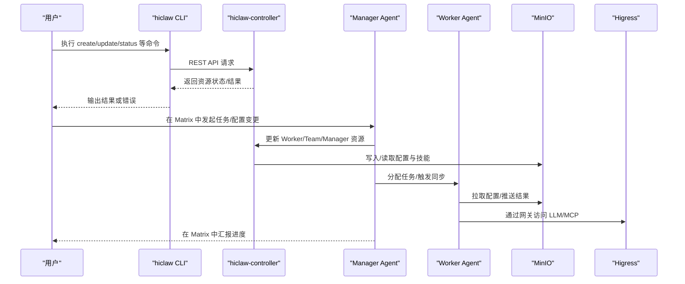
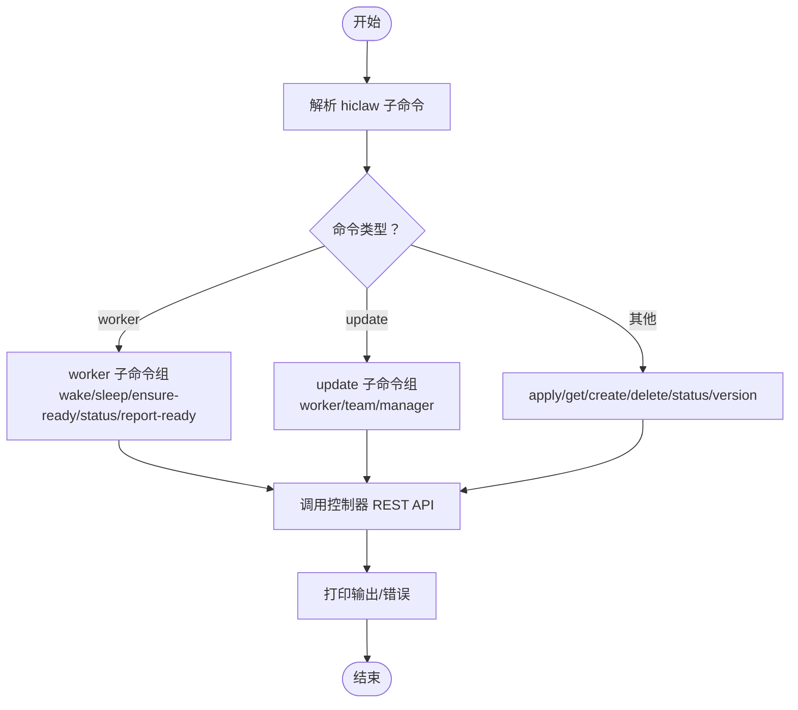
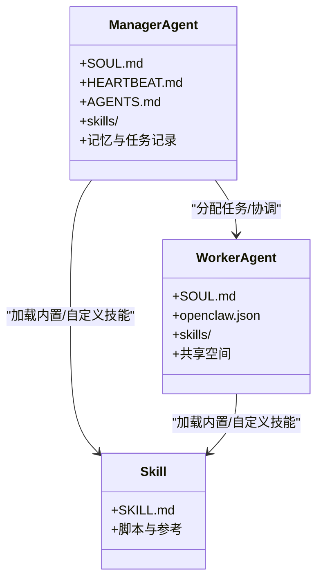
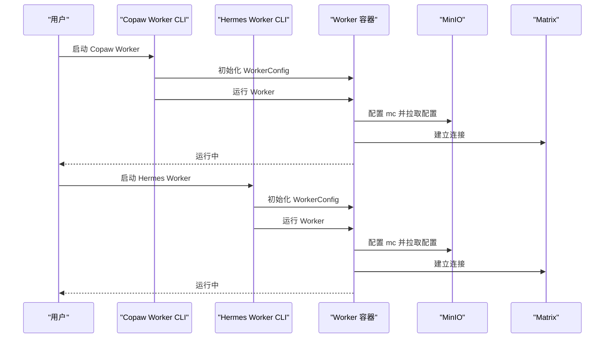
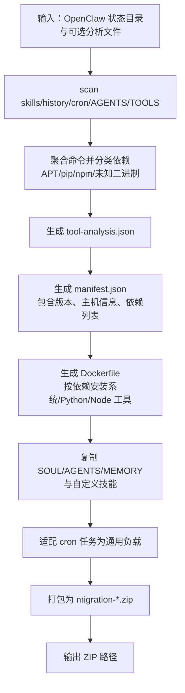
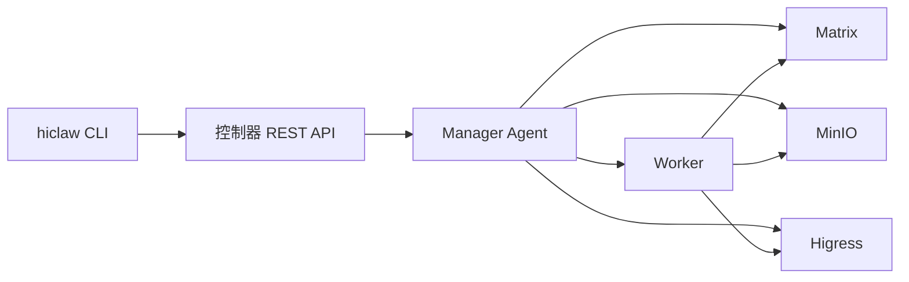

# 技能管理工具

<cite>
**本文引用的文件**
- [README.md](file://README.md)
- [hiclaw-controller/cmd/hiclaw/main.go](file://hiclaw-controller/cmd/hiclaw/main.go)
- [hiclaw-controller/cmd/hiclaw/worker_cmd.go](file://hiclaw-controller/cmd/hiclaw/worker_cmd.go)
- [hiclaw-controller/cmd/hiclaw/update.go](file://hiclaw-controller/cmd/hiclaw/update.go)
- [manager/agent/worker-agent/AGENTS.md](file://manager/agent/worker-agent/AGENTS.md)
- [manager/agent/copaw-manager-agent/AGENTS.md](file://manager/agent/copaw-manager-agent/AGENTS.md)
- [docs/manager-guide.md](file://docs/manager-guide.md)
- [docs/worker-guide.md](file://docs/worker-guide.md)
- [migrate/skill/scripts/analyze.sh](file://migrate/skill/scripts/analyze.sh)
- [migrate/skill/scripts/generate-zip.sh](file://migrate/skill/scripts/generate-zip.sh)
- [copaw/src/copaw_worker/cli.py](file://copaw/src/copaw_worker/cli.py)
- [hermes/src/hermes_worker/cli.py](file://hermes/src/hermes_worker/cli.py)
- [manager/configs/known-models.json](file://manager/configs/known-models.json)
- [scripts/export-debug-log.py](file://scripts/export-debug-log.py)
</cite>

## 目录
1. [简介](#简介)
2. [项目结构](#项目结构)
3. [核心组件](#核心组件)
4. [架构总览](#架构总览)
5. [详细组件分析](#详细组件分析)
6. [依赖关系分析](#依赖关系分析)
7. [性能考虑](#性能考虑)
8. [故障排除指南](#故障排除指南)
9. [结论](#结论)
10. [附录](#附录)

## 简介
本指南面向 HiClaw 技能管理与运维场景，围绕以下目标展开：  
- 技能管理命令行工具：如何进行技能搜索、安装、更新与卸载（通过 CLI 与内置技能生态）。  
- 技能配置管理：参数设置、环境配置与运行时调整（含模型、运行时、端口暴露等）。  
- 技能分析与诊断：性能监控、错误追踪与调试辅助（日志导出、健康检查、会话回放）。  
- 技能迁移与备份：从 OpenClaw 迁移至 HiClaw 的自动化流程与批量操作建议。  
- Web 界面与可视化：Higress 控制台、Element Web、MinIO 控制台的使用要点与状态监控。  
- 高级用法与批量处理：多 Worker 并发、批量导入、代理镜像加速与自动化脚本。  
- 常见问题与排障：容器日志、网络连通性、凭据授权与任务恢复。

## 项目结构
HiClaw 采用“Manager-Workers 架构”，控制器提供资源管理 CLI，Manager 负责编排与沟通，Workers 执行具体任务。技能生态由 Manager/Worker 的 skills 目录与内置技能共同组成；迁移工具链支持从 OpenClaw 向 HiClaw 的平滑过渡。

```mermaid
graph TB
subgraph "控制平面"
CLI["hiclaw CLI<br/>资源管理命令"]
CTRL["hiclaw-controller<br/>REST API"]
end
subgraph "管理面"
MGR["Manager Agent<br/>OpenClaw/Copaw/Hermes"]
WEB["Element Web<br/>IM 客户端"]
GW["Higress 控制台<br/>路由与消费者"]
end
subgraph "工作面"
W1["Worker Alice<br/>OpenClaw/Copaw/Hermes"]
W2["Worker Bob<br/>OpenClaw/Copaw/Hermes"]
FS["MinIO 存储<br/>共享文件系统"]
end
CLI --> CTRL
CTRL --> MGR
MGR <- --> WEB
MGR --> FS
MGR --> GW
MGR --> W1
MGR --> W2
W1 --> FS
W2 --> FS
```

图示来源
- [hiclaw-controller/cmd/hiclaw/main.go:9-34](file://hiclaw-controller/cmd/hiclaw/main.go#L9-L34)
- [docs/manager-guide.md:158-206](file://docs/manager-guide.md#L158-L206)
- [docs/worker-guide.md:1-30](file://docs/worker-guide.md#L1-L30)

章节来源
- [README.md:13-33](file://README.md#L13-L33)
- [hiclaw-controller/cmd/hiclaw/main.go:9-34](file://hiclaw-controller/cmd/hiclaw/main.go#L9-L34)
- [docs/manager-guide.md:1-36](file://docs/manager-guide.md#L1-L36)
- [docs/worker-guide.md:1-30](file://docs/worker-guide.md#L1-L30)

## 核心组件
- 控制器 CLI（hiclaw）：提供 apply、create、get、update、delete、worker、status、version 等子命令，用于声明式管理 Worker/Team/Manager/人类等资源，并与控制器 REST API 交互。
- Manager Agent：负责在 Matrix 上与人类管理员与 Worker 协作，承载技能与工作流；支持 OpenClaw、Copaw、Hermes 三种运行时。
- Worker Agent：轻量无状态容器，连接 Manager，同步配置与技能，执行任务并通过 MinIO 共享数据。
- 迁移工具链：analyze.sh 与 generate-zip.sh 将 OpenClaw 状态与技能打包为 HiClaw 可导入的 ZIP 包。
- Web 界面：Higress 控制台（路由与消费者）、Element Web（IM 客户端）、MinIO 控制台（对象存储）。

章节来源
- [hiclaw-controller/cmd/hiclaw/main.go:9-34](file://hiclaw-controller/cmd/hiclaw/main.go#L9-L34)
- [hiclaw-controller/cmd/hiclaw/worker_cmd.go:11-22](file://hiclaw-controller/cmd/hiclaw/worker_cmd.go#L11-L22)
- [hiclaw-controller/cmd/hiclaw/update.go:9-18](file://hiclaw-controller/cmd/hiclaw/update.go#L9-L18)
- [docs/manager-guide.md:1-36](file://docs/manager-guide.md#L1-L36)
- [docs/worker-guide.md:1-30](file://docs/worker-guide.md#L1-L30)
- [migrate/skill/scripts/analyze.sh:1-296](file://migrate/skill/scripts/analyze.sh#L1-L296)
- [migrate/skill/scripts/generate-zip.sh:1-451](file://migrate/skill/scripts/generate-zip.sh#L1-L451)

## 架构总览
下图展示 CLI、控制器、Manager、Worker、MinIO、Higress、Element Web 的交互关系与职责边界。



图示来源
- [hiclaw-controller/cmd/hiclaw/main.go:9-34](file://hiclaw-controller/cmd/hiclaw/main.go#L9-L34)
- [hiclaw-controller/cmd/hiclaw/worker_cmd.go:139-210](file://hiclaw-controller/cmd/hiclaw/worker_cmd.go#L139-L210)
- [docs/manager-guide.md:158-206](file://docs/manager-guide.md#L158-L206)
- [docs/worker-guide.md:137-185](file://docs/worker-guide.md#L137-L185)

## 详细组件分析

### 组件一：CLI 与资源生命周期管理
- 根命令与子命令：提供 apply、create、get、update、delete、worker、status、version 等能力，覆盖资源全生命周期。
- Worker 子命令族：wake/sleep/ensure-ready/status/report-ready，支持单个或团队维度查询与状态上报。
- 更新命令族：update worker/team/manager 支持按字段增量更新（模型、运行时、镜像、身份描述、SOUL、技能包、暴露端口等）。



图示来源
- [hiclaw-controller/cmd/hiclaw/main.go:9-34](file://hiclaw-controller/cmd/hiclaw/main.go#L9-L34)
- [hiclaw-controller/cmd/hiclaw/worker_cmd.go:11-22](file://hiclaw-controller/cmd/hiclaw/worker_cmd.go#L11-L22)
- [hiclaw-controller/cmd/hiclaw/update.go:9-18](file://hiclaw-controller/cmd/hiclaw/update.go#L9-L18)

章节来源
- [hiclaw-controller/cmd/hiclaw/main.go:9-34](file://hiclaw-controller/cmd/hiclaw/main.go#L9-L34)
- [hiclaw-controller/cmd/hiclaw/worker_cmd.go:28-289](file://hiclaw-controller/cmd/hiclaw/worker_cmd.go#L28-L289)
- [hiclaw-controller/cmd/hiclaw/update.go:24-214](file://hiclaw-controller/cmd/hiclaw/update.go#L24-L214)

### 组件二：Manager Agent 工作区与技能生态
- 工作区布局：Manager 与 Worker 的工作区、共享空间、MinIO 前缀、消息发送规则、控制器 API 使用规范、心跳与内存管理等。
- 技能使用：每个技能目录包含 SKILL.md，提供完整 API 与示例；Manager/Worker Agent 自动发现并加载。
- 模型与运行时：支持多种 LLM 模型与运行时（openclaw/copaw/hermes），可通过 CLI 或配置进行切换与更新。



图示来源
- [manager/agent/worker-agent/AGENTS.md:1-178](file://manager/agent/worker-agent/AGENTS.md#L1-L178)
- [manager/agent/copaw-manager-agent/AGENTS.md:1-249](file://manager/agent/copaw-manager-agent/AGENTS.md#L1-L249)
- [docs/manager-guide.md:51-70](file://docs/manager-guide.md#L51-L70)

章节来源
- [manager/agent/worker-agent/AGENTS.md:1-178](file://manager/agent/worker-agent/AGENTS.md#L1-L178)
- [manager/agent/copaw-manager-agent/AGENTS.md:1-249](file://manager/agent/copaw-manager-agent/AGENTS.md#L1-L249)
- [docs/manager-guide.md:41-70](file://docs/manager-guide.md#L41-L70)

### 组件三：Worker 运行时与 CLI
- Copaw Worker CLI：支持名称、MinIO 端点与密钥、桶名、同步间隔、安装目录、控制台端口等参数，启动后连接 Matrix。
- Hermes Worker CLI：与 Copaw 类似，但通过 Hermes 网关接入，适合自主编码类任务。



图示来源
- [copaw/src/copaw_worker/cli.py:21-69](file://copaw/src/copaw_worker/cli.py#L21-L69)
- [hermes/src/hermes_worker/cli.py:21-72](file://hermes/src/hermes_worker/cli.py#L21-L72)

章节来源
- [copaw/src/copaw_worker/cli.py:21-69](file://copaw/src/copaw_worker/cli.py#L21-L69)
- [hermes/src/hermes_worker/cli.py:21-72](file://hermes/src/hermes_worker/cli.py#L21-L72)

### 组件四：迁移与备份工具链
- analyze.sh：扫描 OpenClaw 状态目录、技能脚本、历史命令、cron 任务与 AGENTS.md/TOOLS.md，生成工具依赖分析报告。
- generate-zip.sh：基于分析结果与配置，生成可导入的 ZIP 包，包含 manifest.json、Dockerfile、SOUL/AGENTS/MEMORY 文件、自定义技能与适配后的 cron 任务，并输出迁移包路径。



图示来源
- [migrate/skill/scripts/analyze.sh:1-296](file://migrate/skill/scripts/analyze.sh#L1-L296)
- [migrate/skill/scripts/generate-zip.sh:1-451](file://migrate/skill/scripts/generate-zip.sh#L1-L451)

章节来源
- [migrate/skill/scripts/analyze.sh:1-296](file://migrate/skill/scripts/analyze.sh#L1-L296)
- [migrate/skill/scripts/generate-zip.sh:1-451](file://migrate/skill/scripts/generate-zip.sh#L1-L451)

### 组件五：模型与运行时配置
- 已知模型清单：包含多种 LLM 模型的标识、推理能力、上下文窗口、最大 Token 数与输入类型，便于在 Manager/Worker 更新时选择合适模型。
- 运行时选择：Manager 与 Worker 支持 openclaw/copaw/hermes，可通过 CLI 或配置进行切换。

章节来源
- [manager/configs/known-models.json:1-19](file://manager/configs/known-models.json#L1-L19)
- [hiclaw-controller/cmd/hiclaw/update.go:24-98](file://hiclaw-controller/cmd/hiclaw/update.go#L24-L98)

## 依赖关系分析
- CLI 依赖控制器 REST API 提供资源状态与变更能力；Worker 依赖 MinIO 同步配置与技能；Manager 依赖 Higress 网关访问 LLM/MCP；Element Web 提供人类管理员入口。
- 运行时耦合度低：Manager/Worker 可互换运行时，仅需遵循对应工作区与通信协议。



图示来源
- [hiclaw-controller/cmd/hiclaw/main.go:9-34](file://hiclaw-controller/cmd/hiclaw/main.go#L9-L34)
- [docs/manager-guide.md:158-206](file://docs/manager-guide.md#L158-L206)
- [docs/worker-guide.md:137-185](file://docs/worker-guide.md#L137-L185)

章节来源
- [hiclaw-controller/cmd/hiclaw/main.go:9-34](file://hiclaw-controller/cmd/hiclaw/main.go#L9-L34)
- [docs/manager-guide.md:158-206](file://docs/manager-guide.md#L158-L206)
- [docs/worker-guide.md:137-185](file://docs/worker-guide.md#L137-L185)

## 性能考虑
- 同步策略：Worker 本地到远程实时镜像同步（mc mirror --watch），远程到本地周期性拉取（默认 5 分钟），避免频繁全量传输。
- 心跳与空闲回收：Manager 可根据 Leader 心跳与 Worker 空闲超时自动启停 Worker，节省资源。
- 日志与回放：提供会话回放与日志导出工具，便于快速定位瓶颈与异常。

章节来源
- [docs/worker-guide.md:148-185](file://docs/worker-guide.md#L148-L185)
- [docs/manager-guide.md:158-199](file://docs/manager-guide.md#L158-L199)
- [scripts/export-debug-log.py](file://scripts/export-debug-log.py)

## 故障排除指南
- 日志查看：Manager Agent、OpenClaw 运行时、控制器基础设施日志位置与查看方式。
- 会话回放：测试与复盘时可生成回放日志，便于审计与问题定位。
- 健康检查：Higress 控制台、Element Web、MinIO 的健康探测端点与返回状态。
- Worker 排障：无法启动、无法连接 Matrix、无法访问 LLM/MCP、重置 Worker 的排查步骤与命令。
- 数据备份与恢复：Docker 卷备份与还原命令，确保持久化数据安全。

章节来源
- [docs/manager-guide.md:158-239](file://docs/manager-guide.md#L158-L239)
- [docs/worker-guide.md:61-123](file://docs/worker-guide.md#L61-L123)
- [README.md:355-378](file://README.md#L355-L378)

## 结论
HiClaw 的技能管理以“声明式资源 + 可插拔技能 + 分布式协作”为核心，CLI 提供统一入口，Manager/Worker 通过 MinIO 与 Higress 实现配置与能力的解耦，配合 Web 界面与日志工具形成完整的可观测闭环。迁移工具链进一步降低从 OpenClaw 迁移的成本，实现技能与环境的平滑过渡。

## 附录

### A. 技能管理命令行速查
- 资源管理
  - 创建/获取/更新/删除：hiclaw create/get/update/delete
  - 应用清单：hiclaw apply -f <file>
  - 版本：hiclaw version
- Worker 生命周期
  - 唤醒/休眠/确保就绪/状态/上报就绪：hiclaw worker wake/sleep/ensure-ready/status/report-ready
- 更新资源
  - 更新 Worker/Team/Manager：hiclaw update worker/team/manager（支持按字段增量更新）

章节来源
- [hiclaw-controller/cmd/hiclaw/main.go:9-34](file://hiclaw-controller/cmd/hiclaw/main.go#L9-L34)
- [hiclaw-controller/cmd/hiclaw/worker_cmd.go:11-210](file://hiclaw-controller/cmd/hiclaw/worker_cmd.go#L11-L210)
- [hiclaw-controller/cmd/hiclaw/update.go:9-18](file://hiclaw-controller/cmd/hiclaw/update.go#L9-L18)

### B. 技能配置与运行时调整
- 模型与运行时：通过 update worker/team/manager 的 --model/--runtime/--image 等参数进行调整。
- 技能包与内置技能：通过 --skills 传入内置技能列表，或在 Manager/Worker 工作区放置自定义 SKILL.md。
- 端口暴露：通过 --expose 指定 Worker 需要对外暴露的端口。

章节来源
- [hiclaw-controller/cmd/hiclaw/update.go:24-98](file://hiclaw-controller/cmd/hiclaw/update.go#L24-L98)
- [docs/manager-guide.md:51-70](file://docs/manager-guide.md#L51-L70)

### C. 技能分析与诊断
- 导出调试日志：使用 scripts/export-debug-log.py 导出矩阵消息与会话日志，结合代码库进行根因分析。
- 健康检查：Higress 控制台、Element Web、MinIO 的健康探测端点。
- 会话回放：测试阶段生成回放日志，便于复盘。

章节来源
- [README.md:367-378](file://README.md#L367-L378)
- [docs/manager-guide.md:158-199](file://docs/manager-guide.md#L158-L199)

### D. 技能迁移与备份
- 迁移流程：先运行 analyze.sh 生成 tool-analysis.json，再运行 generate-zip.sh 生成 migration-*.zip，最后在 HiClaw 主机上导入。
- 备份与恢复：使用 Docker 卷备份 tar.gz，恢复时解压至相同路径。

章节来源
- [migrate/skill/scripts/analyze.sh:1-296](file://migrate/skill/scripts/analyze.sh#L1-L296)
- [migrate/skill/scripts/generate-zip.sh:1-451](file://migrate/skill/scripts/generate-zip.sh#L1-L451)
- [docs/manager-guide.md:207-239](file://docs/manager-guide.md#L207-L239)

### E. Web 界面与可视化
- Higress 控制台：查看路由与消费者，管理 MCP 服务器与权限。
- Element Web：Matrix 客户端，零配置即可体验。
- MinIO 控制台：对象存储可视化与对象浏览。

章节来源
- [docs/manager-guide.md:199-206](file://docs/manager-guide.md#L199-L206)

### F. 高级用法与批量处理
- 多 Worker 并发：在 CoPaw 场景下，通过一次性前台执行多次创建请求并行发起，避免后台输出丢失。
- 代理镜像加速：generate-zip.sh 支持设置 APT 镜像与构建代理，提升国内拉取速度。
- 自动化脚本：结合 analyze.sh/generate-zip.sh 与 hiclaw CLI，实现批量导入与配置更新。

章节来源
- [manager/agent/copaw-manager-agent/AGENTS.md:53-54](file://manager/agent/copaw-manager-agent/AGENTS.md#L53-L54)
- [migrate/skill/scripts/generate-zip.sh:174-237](file://migrate/skill/scripts/generate-zip.sh#L174-L237)