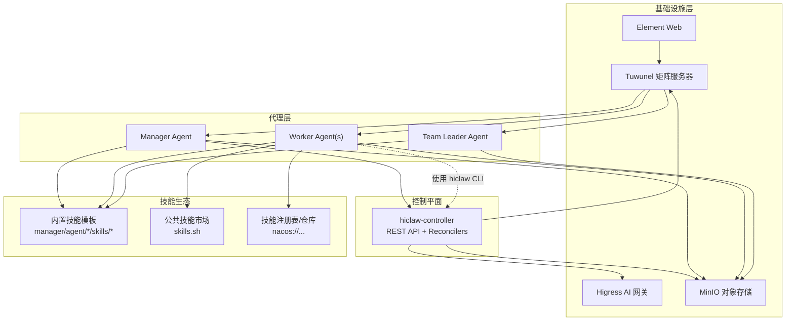
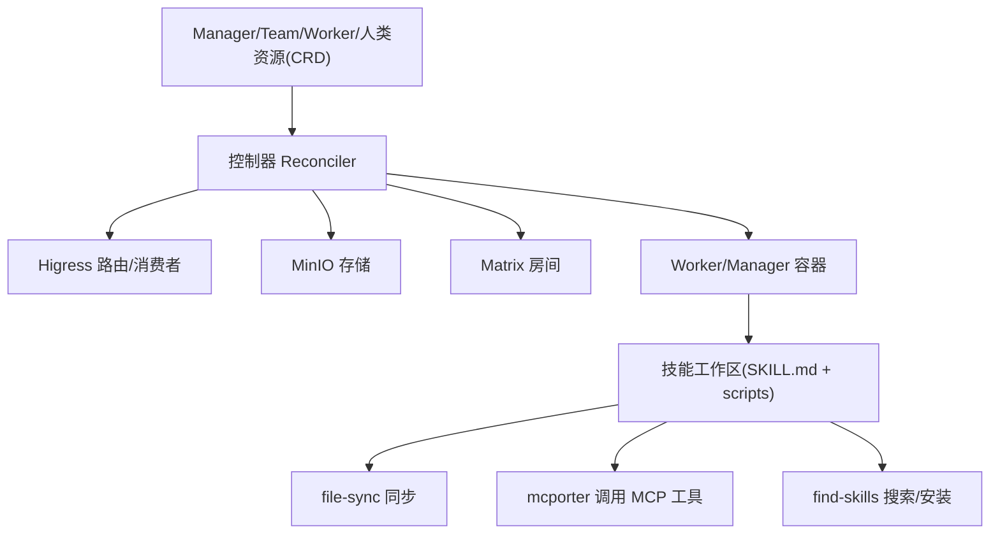
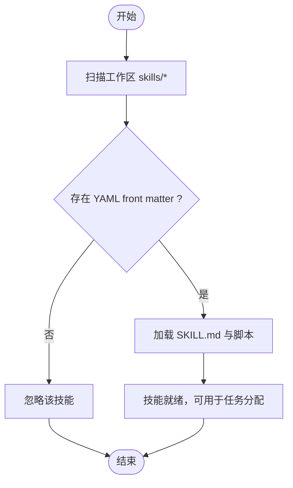
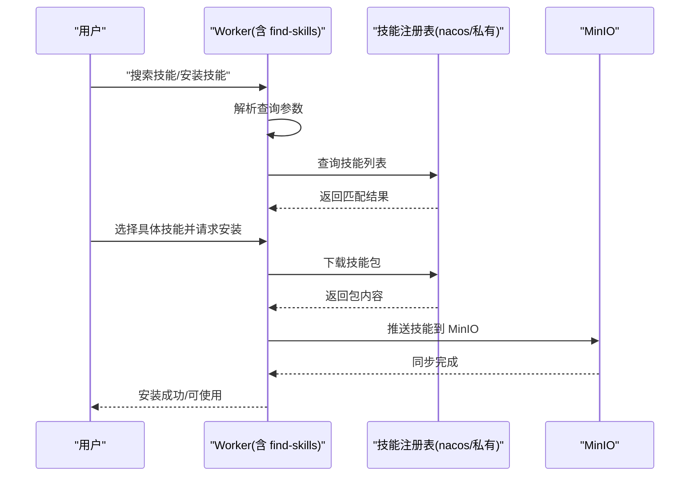
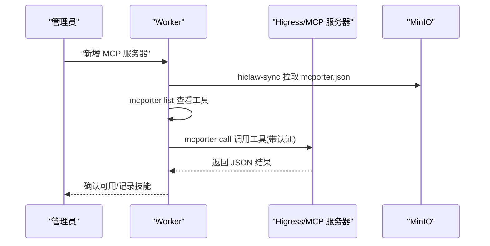
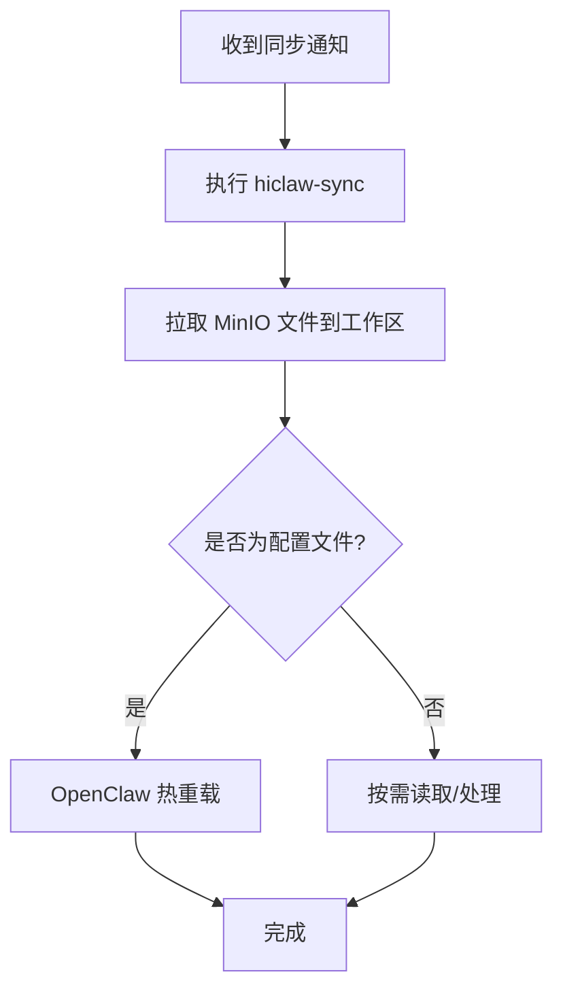
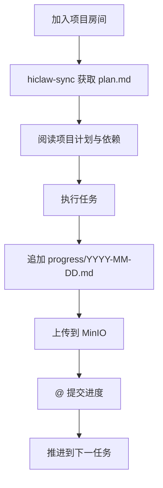
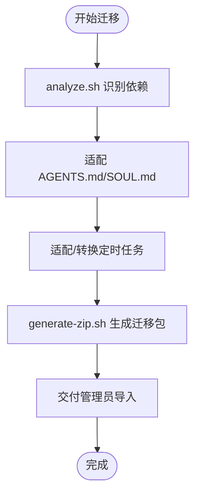
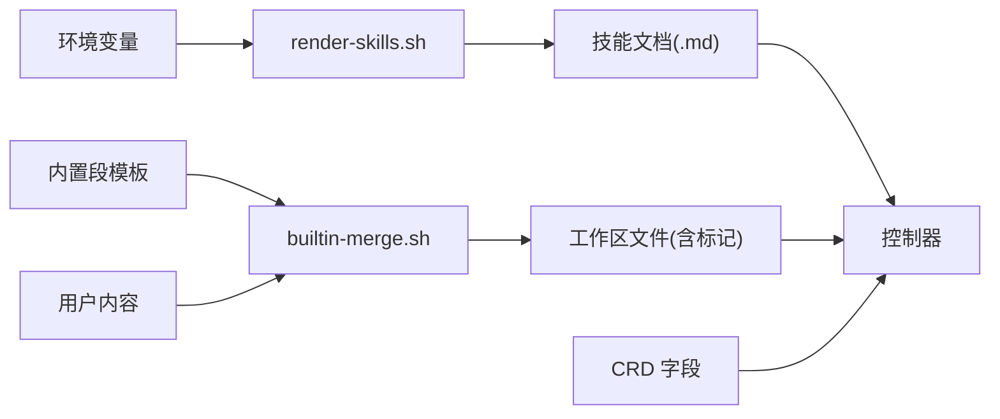

# 技能系统

<cite>
**本文引用的文件**   
- [README.md](file://README.md)
- [docs/architecture.md](file://docs/architecture.md)
- [docs/development.md](file://docs/development.md)
- [hiclaw-controller/api/v1beta1/types.go](file://hiclaw-controller/api/v1beta1/types.go)
- [manager/agent/worker-agent/skills/find-skills/SKILL.md](file://manager/agent/worker-agent/skills/find-skills/SKILL.md)
- [manager/agent/worker-agent/skills/mcporter/SKILL.md](file://manager/agent/worker-agent/skills/mcporter/SKILL.md)
- [manager/agent/worker-agent/skills/file-sync/SKILL.md](file://manager/agent/worker-agent/skills/file-sync/SKILL.md)
- [manager/agent/worker-agent/skills/project-participation/SKILL.md](file://manager/agent/worker-agent/skills/project-participation/SKILL.md)
- [manager/agent/worker-agent/skills/task-progress/SKILL.md](file://manager/agent/worker-agent/skills/task-progress/SKILL.md)
- [migrate/skill/SKILL.md](file://migrate/skill/SKILL.md)
- [shared/lib/render-skills.sh](file://shared/lib/render-skills.sh)
- [manager/scripts/lib/builtin-merge.sh](file://manager/scripts/lib/builtin-merge.sh)
</cite>

## 目录
1. [简介](#简介)
2. [项目结构](#项目结构)
3. [核心组件](#核心组件)
4. [架构总览](#架构总览)
5. [详细组件分析](#详细组件分析)
6. [依赖关系分析](#依赖关系分析)
7. [性能考量](#性能考量)
8. [故障排查指南](#故障排查指南)
9. [结论](#结论)
10. [附录](#附录)

## 简介
本文件系统化阐述 HiClaw 的技能生态系统：从架构设计到工作原理，从技能注册与发现、部署与管理，到开发规范、测试方法、部署流程、版本管理、社区生态、工具使用、运行时兼容与协作模式，并提供最佳实践与常见问题解决方案。目标是帮助开发者与运营人员快速理解并高效使用 HiClaw 的技能体系。

## 项目结构
HiClaw 将“技能”抽象为“面向代理的 Markdown（SKILL.md）+ 可选脚本与参考文档”，通过内置的渲染与合并机制注入到各运行时（OpenClaw/CoPaw/Hermes）的工作空间中；同时，控制器通过 CRD 驱动 Worker/Manager/Team/Human 资源的生命周期，实现技能的声明式管理与分发。

图示来源
- [docs/architecture.md:104-137](file://docs/architecture.md#L104-L137)
- [docs/architecture.md:180-221](file://docs/architecture.md#L180-L221)

章节来源
- [docs/architecture.md:104-137](file://docs/architecture.md#L104-L137)
- [docs/architecture.md:180-221](file://docs/architecture.md#L180-L221)

## 核心组件
- 技能定义与加载
  - 技能以 SKILL.md 为核心，配合可选的 scripts/ 与 references/ 目录，由各运行时按约定加载。
  - OpenClaw 要求 SKILL.md 具备 YAML front matter，否则不会被发现。
- 渲染与注入
  - 渲染脚本负责将环境变量注入到技能文档中，确保路径、网关地址、默认模型等在不同部署环境下正确生效。
  - 内置合并脚本负责在升级或导入时，将“受控内置段”与“用户自定义段”安全合并，避免覆盖用户内容。
- 分发与同步
  - 技能通过 MinIO 同步至 Worker 工作区；Worker 通过 file-sync 技能拉取最新配置与共享资源。
  - MCP 服务器工具通过 mcporter 技能进行调用，配置由控制器或管理员推送并在 Worker 端自动热更新。
- 声明式管理
  - Worker/Manager/Team/Human 的 CRD 定义了技能、MCP 服务器、暴露端口、通道策略等字段，控制器据此生成路由、消费者与工作负载。

章节来源
- [docs/development.md:373-404](file://docs/development.md#L373-L404)
- [shared/lib/render-skills.sh:1-42](file://shared/lib/render-skills.sh#L1-L42)
- [manager/scripts/lib/builtin-merge.sh:1-161](file://manager/scripts/lib/builtin-merge.sh#L1-L161)
- [hiclaw-controller/api/v1beta1/types.go:63-146](file://hiclaw-controller/api/v1beta1/types.go#L63-L146)

## 架构总览
HiClaw 的技能系统围绕“多运行时协同 + 声明式资源 + 中央化存储”的设计展开：

- 运行时模型
  - 支持 OpenClaw、CoPaw、Hermes 三种 Worker 运行时，Manager 可选择 OpenClaw 或 CoPaw。
- 沟通机制
  - Matrix 房间用于人机协同与任务编排；MinIO 提供共享状态与工件存储；Higress 承担 AI 流量与 MCP 服务路由。
- 控制器职责
  - 依据 CRD 规范生成并维护路由/消费者；协调 Worker 生命周期；将 MCP 配置与技能清单推送到 MinIO 并触发 Worker 同步。

图示来源
- [docs/architecture.md:165-177](file://docs/architecture.md#L165-L177)
- [hiclaw-controller/api/v1beta1/types.go:63-146](file://hiclaw-controller/api/v1beta1/types.go#L63-L146)

章节来源
- [docs/architecture.md:165-177](file://docs/architecture.md#L165-L177)
- [hiclaw-controller/api/v1beta1/types.go:63-146](file://hiclaw-controller/api/v1beta1/types.go#L63-L146)

## 详细组件分析

### 组件一：技能注册与发现（OpenClaw）
- 注册要求
  - SKILL.md 必须包含 YAML front matter（name/description），否则 OpenClaw 不会识别该技能。
- 发现机制
  - OpenClaw 在指定工作区目录下自动扫描并加载技能；file-sync 技能可拉取最新技能清单。
- 开发建议
  - 保持 front matter 完整；在 references/ 中提供 API 参考与示例；在 scripts/ 中提供最小可执行命令入口。

图示来源
- [docs/development.md:373-386](file://docs/development.md#L373-L386)
- [manager/agent/worker-agent/skills/file-sync/SKILL.md:1-20](file://manager/agent/worker-agent/skills/file-sync/SKILL.md#L1-L20)

章节来源
- [docs/development.md:373-386](file://docs/development.md#L373-L386)
- [manager/agent/worker-agent/skills/file-sync/SKILL.md:1-20](file://manager/agent/worker-agent/skills/file-sync/SKILL.md#L1-L20)

### 组件二：技能搜索与安装（find-skills）
- 功能定位
  - 在公共或私有注册表中搜索并安装技能；强调 Worker 安全隔离，不接触真实凭证。
- 使用场景
  - 用户询问未知领域任务、需要扩展能力、希望导入市场技能时。
- 关键流程
  - 使用固定脚本路径执行 find/install；支持检查更新与批量更新；结果链接 skills.sh。
- 注意事项
  - 严格使用返回的安装命令；Ambiguous 名称需先搜索再安装；安装后约 10 秒内同步到 MinIO。

图示来源
- [manager/agent/worker-agent/skills/find-skills/SKILL.md:26-44](file://manager/agent/worker-agent/skills/find-skills/SKILL.md#L26-L44)
- [manager/agent/worker-agent/skills/find-skills/SKILL.md:89-103](file://manager/agent/worker-agent/skills/find-skills/SKILL.md#L89-L103)

章节来源
- [manager/agent/worker-agent/skills/find-skills/SKILL.md:26-44](file://manager/agent/worker-agent/skills/find-skills/SKILL.md#L26-L44)
- [manager/agent/worker-agent/skills/find-skills/SKILL.md:89-103](file://manager/agent/worker-agent/skills/find-skills/SKILL.md#L89-L103)

### 组件三：MCP 工具调用（mcporter）
- 功能定位
  - 通过 mcporter 列出/调用 MCP 服务器工具；支持 JSON 参数与工具 Schema 查看。
- 协作流程
  - 当管理员通知新增 MCP 工具时，Worker 先同步配置，再列出工具并生成技能文档以便长期维护。
- 安全与权限
  - 自动附加 Bearer 认证头；访问权限由管理员授权；配置缺失时先执行 file-sync。

图示来源
- [manager/agent/worker-agent/skills/mcporter/SKILL.md:28-48](file://manager/agent/worker-agent/skills/mcporter/SKILL.md#L28-L48)
- [manager/agent/worker-agent/skills/mcporter/SKILL.md:50-66](file://manager/agent/worker-agent/skills/mcporter/SKILL.md#L50-L66)

章节来源
- [manager/agent/worker-agent/skills/mcporter/SKILL.md:28-48](file://manager/agent/worker-agent/skills/mcporter/SKILL.md#L28-L48)
- [manager/agent/worker-agent/skills/mcporter/SKILL.md:50-66](file://manager/agent/worker-agent/skills/mcporter/SKILL.md#L50-L66)

### 组件四：文件同步（file-sync）
- 功能定位
  - 将 MinIO 上的最新文件同步到 Worker 工作区；OpenClaw 检测到配置变更后热重载。
- 使用时机
  - 配置变更、任务文件更新、协作产物到达时。
- 最佳实践
  - 任何通知“有新文件”后立即执行同步；完成后向发送方确认。

图示来源
- [manager/agent/worker-agent/skills/file-sync/SKILL.md:1-20](file://manager/agent/worker-agent/skills/file-sync/SKILL.md#L1-L20)

章节来源
- [manager/agent/worker-agent/skills/file-sync/SKILL.md:1-20](file://manager/agent/worker-agent/skills/file-sync/SKILL.md#L1-L20)

### 组件五：项目参与与任务进度（project-participation / task-progress）
- 项目参与
  - 加入项目房间后，先同步再阅读 plan.md；提交前设置 Git 作者信息；完成即 @ 提交进度推进。
- 任务进度
  - 每个有意义动作后追加进度日志；task-history.json 维护最近 10 条任务；恢复流程按日期排序读取最新进度。

图示来源
- [manager/agent/worker-agent/skills/project-participation/SKILL.md:14-31](file://manager/agent/worker-agent/skills/project-participation/SKILL.md#L14-L31)
- [manager/agent/worker-agent/skills/task-progress/SKILL.md:14-38](file://manager/agent/worker-agent/skills/task-progress/SKILL.md#L14-L38)

章节来源
- [manager/agent/worker-agent/skills/project-participation/SKILL.md:14-31](file://manager/agent/worker-agent/skills/project-participation/SKILL.md#L14-L31)
- [manager/agent/worker-agent/skills/task-progress/SKILL.md:14-38](file://manager/agent/worker-agent/skills/task-progress/SKILL.md#L14-L38)

### 组件六：迁移与导入（hiclaw-migrate）
- 目标
  - 将现有 OpenClaw 实例迁移到 HiClaw 管理的 Worker，生成可导入的 ZIP 包。
- 关键点
  - 理解 Worker 架构差异（Matrix 通信、MinIO 存储、受控技能、MCP 通过网关）。
  - 使用分析脚本识别依赖；适配 AGENTS.md 与 SOUL.md；生成 ZIP 并交付给管理员导入。
- 不迁移项
  - openclaw.json、认证配置、设备身份、会话历史、扩展/插件；仅迁移自定义技能。

图示来源
- [migrate/skill/SKILL.md:60-77](file://migrate/skill/SKILL.md#L60-L77)
- [migrate/skill/SKILL.md:152-175](file://migrate/skill/SKILL.md#L152-L175)

章节来源
- [migrate/skill/SKILL.md:60-77](file://migrate/skill/SKILL.md#L60-L77)
- [migrate/skill/SKILL.md:152-175](file://migrate/skill/SKILL.md#L152-L175)

## 依赖关系分析
- 环境变量注入
  - 渲染脚本对技能文档中的已知变量进行替换，确保不同环境下的 URL、令牌、模型等正确。
- 内置段合并
  - 合并脚本在升级或导入时，将“受控内置段”与“用户自定义段”安全合并，避免破坏用户内容。
- CRD 字段驱动
  - Worker/Manager/Team/Human 的 CRD 字段（如 skills、mcpServers、expose、channelPolicy）直接影响控制器行为与 Worker 工作区配置。

图示来源
- [shared/lib/render-skills.sh:19-27](file://shared/lib/render-skills.sh#L19-L27)
- [manager/scripts/lib/builtin-merge.sh:53-121](file://manager/scripts/lib/builtin-merge.sh#L53-L121)
- [hiclaw-controller/api/v1beta1/types.go:71-104](file://hiclaw-controller/api/v1beta1/types.go#L71-L104)

章节来源
- [shared/lib/render-skills.sh:19-27](file://shared/lib/render-skills.sh#L19-L27)
- [manager/scripts/lib/builtin-merge.sh:53-121](file://manager/scripts/lib/builtin-merge.sh#L53-L121)
- [hiclaw-controller/api/v1beta1/types.go:71-104](file://hiclaw-controller/api/v1beta1/types.go#L71-L104)

## 性能考量
- 技能加载与热重载
  - OpenClaw 对配置变更的热重载时间在数百毫秒级，建议在每次重要配置更新后立即执行同步并验证。
- 同步与存储
  - MinIO 同步延迟受网络与对象数量影响；建议在批量更新时合并操作，减少往返次数。
- MCP 调用
  - mcporter 调用通过 Higress 网关转发，注意上游限流与认证开销；合理缓存工具 Schema 与常用参数。
- 迁移与打包
  - 迁移包体积与构建时间与依赖包数量相关；建议在分析阶段剔除冗余依赖，优化 Dockerfile。

## 故障排查指南
- 技能未被发现
  - 检查 SKILL.md 是否包含 YAML front matter；确认文件位于工作区 skills/* 目录。
- 技能未同步
  - 确认已执行 file-sync；检查 MinIO 中对应路径是否存在；查看 Worker 日志。
- MCP 工具不可用
  - 确认 mcporter.json 已同步；检查 Higress 消费者与路由；确认权限已授权。
- 环境变量未生效
  - 检查渲染脚本是否正确注入；确认环境变量名与白名单一致。
- 升级/导入后内置段异常
  - 使用内置合并逻辑修复；若检测到损坏，将强制重写内置段并保留用户内容。

章节来源
- [docs/development.md:440-447](file://docs/development.md#L440-L447)
- [docs/development.md:483-498](file://docs/development.md#L483-L498)
- [manager/scripts/lib/builtin-merge.sh:88-93](file://manager/scripts/lib/builtin-merge.sh#L88-L93)

## 结论
HiClaw 的技能系统以“可发现、可分发、可治理”为目标，结合多运行时、声明式资源与中央化存储，实现了从技能注册、发现、安装到部署与管理的完整闭环。通过标准化的 SKILL.md 规范、稳定的渲染与合并机制、以及基于 CRD 的自动化分发，开发者可以快速扩展 Agent 能力，同时保障安全与一致性。

## 附录

### 技能开发指南（摘要）
- 结构规范
  - 必须包含 YAML front matter（name/description）；可选 scripts/ 与 references/。
- 开发流程
  - 在本地编写 SKILL.md 与脚本；通过 file-sync 验证；在公共或私有注册表中发布。
- 测试方法
  - 使用 hiclaw CLI 创建测试 Worker；在 Matrix 房间中模拟任务；验证技能调用与输出。

章节来源
- [docs/development.md:373-404](file://docs/development.md#L373-L404)
- [manager/agent/worker-agent/skills/find-skills/SKILL.md:26-44](file://manager/agent/worker-agent/skills/find-skills/SKILL.md#L26-L44)

### 技能部署流程（摘要）
- 本地开发
  - 在工作区编写 SKILL.md；使用 file-sync 拉取；验证热重载。
- 打包发布
  - 使用 find-skills 安装到公共/私有注册表；或通过迁移技能生成 ZIP 包导入。
- 版本管理
  - 通过注册表版本号与标签管理；在升级时使用内置合并脚本保留用户内容。

章节来源
- [manager/agent/worker-agent/skills/find-skills/SKILL.md:36-42](file://manager/agent/worker-agent/skills/find-skills/SKILL.md#L36-L42)
- [migrate/skill/SKILL.md:152-175](file://migrate/skill/SKILL.md#L152-L175)

### 社区技能生态（摘要）
- 技能市场
  - skills.sh 提供 80,000+ 社区技能；支持搜索、浏览与安装。
- 评分与贡献
  - 通过注册表与仓库的公开页面进行评分与反馈；贡献者可提交 PR 更新技能描述与脚本。
- 企业私有
  - 可配置私有注册表（如 Nacos）作为企业技能库。

章节来源
- [README.md:52-52](file://README.md#L52-L52)
- [manager/agent/worker-agent/skills/find-skills/SKILL.md:43-43](file://manager/agent/worker-agent/skills/find-skills/SKILL.md#L43-L43)

### 技能管理工具使用（摘要）
- 搜索与安装
  - 使用 find-skills 的固定脚本路径执行 find/install；支持检查更新与批量更新。
- 卸载与清理
  - 通过删除 MinIO 中对应目录或禁用技能字段实现；注意保留用户数据。
- 协作与可见性
  - 通过 Matrix 房间与任务进度日志实现全程可见与可干预。

章节来源
- [manager/agent/worker-agent/skills/find-skills/SKILL.md:36-42](file://manager/agent/worker-agent/skills/find-skills/SKILL.md#L36-L42)
- [manager/agent/worker-agent/skills/project-participation/SKILL.md:10-13](file://manager/agent/worker-agent/skills/project-participation/SKILL.md#L10-L13)

### 运行时兼容与协作（摘要）
- 多运行时共存
  - OpenClaw/CoPaw/Hermes 可在同一 Matrix 房间协作；Manager 选择合适运行时。
- MCP 与工具调用
  - 通过 mcporter 统一调用 MCP 工具；认证与路由由 Higress 管理。
- 协作模式
  - 任务在项目房间中推进；Worker 通过 @ 提示与进度日志实现透明协作。

章节来源
- [docs/architecture.md:140-162](file://docs/architecture.md#L140-L162)
- [manager/agent/worker-agent/skills/mcporter/SKILL.md:104-110](file://manager/agent/worker-agent/skills/mcporter/SKILL.md#L104-L110)