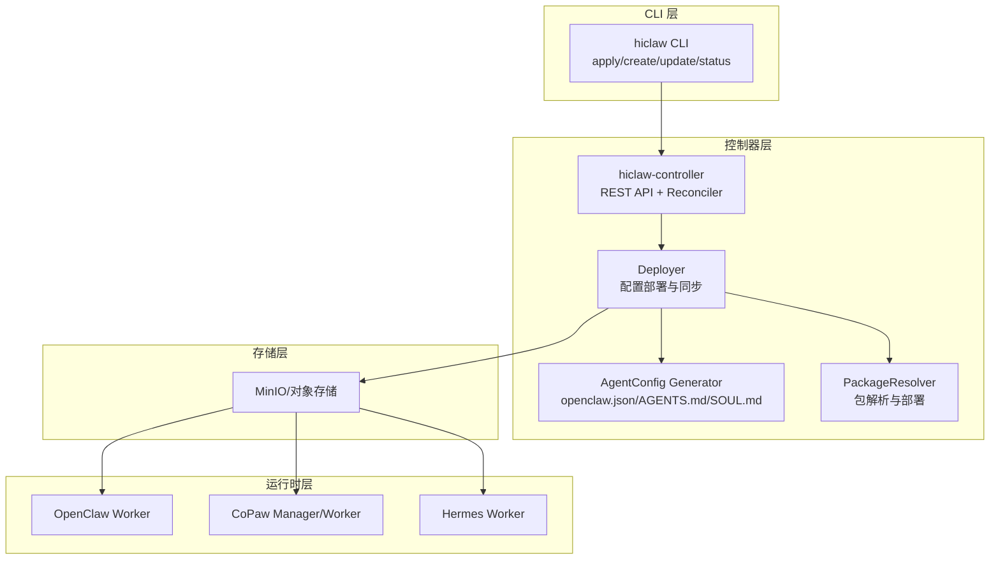
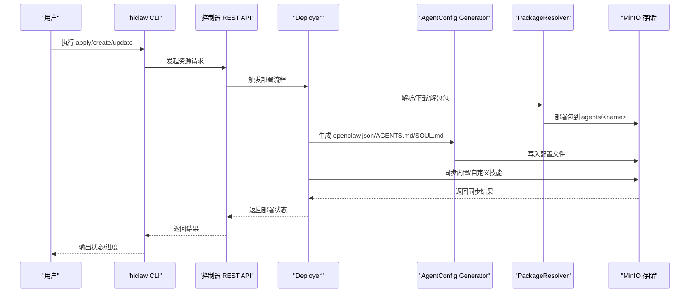
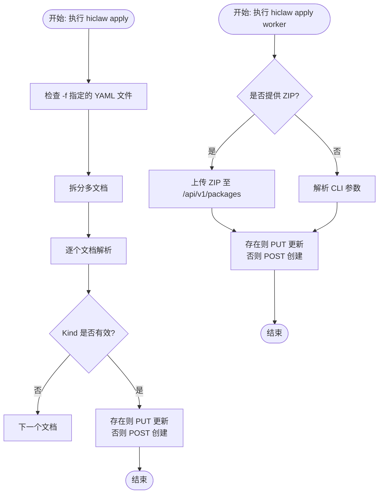
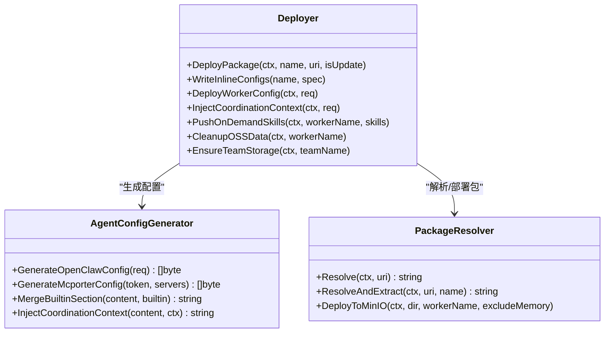
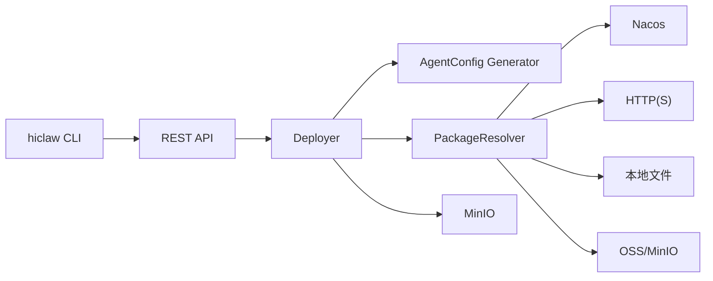

# 技能部署管理

<cite>
**本文档引用的文件**
- [hiclaw-controller/cmd/hiclaw/main.go](file://hiclaw-controller/cmd/hiclaw/main.go)
- [hiclaw-controller/cmd/hiclaw/apply.go](file://hiclaw-controller/cmd/hiclaw/apply.go)
- [hiclaw-controller/cmd/hiclaw/create.go](file://hiclaw-controller/cmd/hiclaw/create.go)
- [hiclaw-controller/cmd/hiclaw/update.go](file://hiclaw-controller/cmd/hiclaw/update.go)
- [hiclaw-controller/internal/service/deployer.go](file://hiclaw-controller/internal/service/deployer.go)
- [hiclaw-controller/internal/agentconfig/generator.go](file://hiclaw-controller/internal/agentconfig/generator.go)
- [hiclaw-controller/internal/agentconfig/types.go](file://hiclaw-controller/internal/agentconfig/types.go)
- [hiclaw-controller/internal/executor/package.go](file://hiclaw-controller/internal/executor/package.go)
- [manager/agent/copaw-manager-agent/AGENTS.md](file://manager/agent/copaw-manager-agent/AGENTS.md)
- [manager/agent/hermes-worker-agent/AGENTS.md](file://manager/agent/hermes-worker-agent/AGENTS.md)
- [migrate/skill/SKILL.md](file://migrate/skill/SKILL.md)
- [shared/lib/render-skills.sh](file://shared/lib/render-skills.sh)
- [install/hiclaw-apply.sh](file://install/hiclaw-apply.sh)
- [install/hiclaw-install.sh](file://install/hiclaw-install.sh)
</cite>

## 目录
1. [简介](#简介)
2. [项目结构](#项目结构)
3. [核心组件](#核心组件)
4. [架构总览](#架构总览)
5. [详细组件分析](#详细组件分析)
6. [依赖分析](#依赖分析)
7. [性能考虑](#性能考虑)
8. [故障排除指南](#故障排除指南)
9. [结论](#结论)
10. [附录](#附录)

## 简介
本文件面向 HiClaw 技能部署管理，系统性阐述技能的本地开发、打包、上传与分发全流程，覆盖版本管理、批量部署与更新（含增量与全量）、配置管理（参数传递、环境变量、运行时配置）、自动化工具与脚本使用、监控与回滚机制，并提供常见场景与最佳实践。目标是帮助读者在不同运行时（OpenClaw、CoPaw、Hermes）下，安全、可控、可追溯地完成技能的生命周期管理。

## 项目结构
HiClaw 采用“控制器 + 多运行时代理”的架构：
- 控制器层负责资源编排、配置生成与存储同步（MinIO）。
- 管理者与工作者分别在各自运行时（OpenClaw/CoPaw/Hermes）中执行任务与技能。
- 包管理器支持多种包来源（本地文件、HTTP、Nacos、OSS/MinIO），统一解包与部署。
- 配置生成器基于模板与策略生成 openclaw.json、AGENTS.md、SOUL.md 等文件，并注入 MCP 服务器与通道策略等。

图示来源
- [hiclaw-controller/cmd/hiclaw/main.go:1-35](file://hiclaw-controller/cmd/hiclaw/main.go#L1-L35)
- [hiclaw-controller/internal/service/deployer.go:75-97](file://hiclaw-controller/internal/service/deployer.go#L75-L97)
- [hiclaw-controller/internal/agentconfig/generator.go:26-203](file://hiclaw-controller/internal/agentconfig/generator.go#L26-L203)
- [hiclaw-controller/internal/executor/package.go:16-26](file://hiclaw-controller/internal/executor/package.go#L16-L26)

章节来源
- [hiclaw-controller/cmd/hiclaw/main.go:1-35](file://hiclaw-controller/cmd/hiclaw/main.go#L1-L35)
- [hiclaw-controller/internal/service/deployer.go:75-97](file://hiclaw-controller/internal/service/deployer.go#L75-L97)

## 核心组件
- CLI 工具（hiclaw）
  - 支持 apply、create、update、delete、worker、status、version 等子命令，提供资源的声明式与变更式管理。
- 部署器（Deployer）
  - 负责将 Worker/Manager 的配置写入 MinIO，同步内置与自定义技能，注入 MCP 服务器与通道策略，维护 SOUL/AGENTS/HEARTBEAT 等文件。
- 配置生成器（AgentConfig Generator）
  - 基于模板生成 openclaw.json、mcporter-servers.json、Matrix 凭证等，支持心跳、嵌入模型、通道策略等可定制项。
- 包解析器（PackageResolver）
  - 统一支持 file://、http(s)://、nacos://、oss:// 与 MinIO 相对路径，负责下载/定位、解压与部署至 MinIO。
- 运行时代理（Manager/Worker）
  - OpenClaw/CoPaw/Hermes 三种运行时，遵循统一的配置与技能规范，通过 MinIO 同步文件与状态。

章节来源
- [hiclaw-controller/cmd/hiclaw/apply.go:16-38](file://hiclaw-controller/cmd/hiclaw/apply.go#L16-L38)
- [hiclaw-controller/cmd/hiclaw/create.go:30-147](file://hiclaw-controller/cmd/hiclaw/create.go#L30-L147)
- [hiclaw-controller/cmd/hiclaw/update.go:24-98](file://hiclaw-controller/cmd/hiclaw/update.go#L24-L98)
- [hiclaw-controller/internal/service/deployer.go:75-97](file://hiclaw-controller/internal/service/deployer.go#L75-L97)
- [hiclaw-controller/internal/agentconfig/generator.go:26-203](file://hiclaw-controller/internal/agentconfig/generator.go#L26-L203)
- [hiclaw-controller/internal/executor/package.go:16-26](file://hiclaw-controller/internal/executor/package.go#L16-L26)

## 架构总览
下图展示了从 CLI 到控制器再到 MinIO 与运行时的整体流程，以及关键的配置生成与包部署步骤。

图示来源
- [hiclaw-controller/cmd/hiclaw/apply.go:27-126](file://hiclaw-controller/cmd/hiclaw/apply.go#L27-L126)
- [hiclaw-controller/internal/service/deployer.go:99-159](file://hiclaw-controller/internal/service/deployer.go#L99-L159)
- [hiclaw-controller/internal/agentconfig/generator.go:26-203](file://hiclaw-controller/internal/agentconfig/generator.go#L26-L203)
- [hiclaw-controller/internal/executor/package.go:28-125](file://hiclaw-controller/internal/executor/package.go#L28-L125)

## 详细组件分析

### CLI 与资源管理
- apply
  - 支持从 YAML 文件批量应用资源，或通过参数直接创建/更新 Worker。
  - 对 ZIP 包进行上传并创建/更新 Worker，自动提取 manifest.json 中的 model/runtime 并与 CLI 参数融合。
- create
  - 创建 Worker/Team/Human/Manager，支持等待 Ready、输出格式控制、超时控制。
- update
  - 仅更新指定字段，避免全量覆盖，适合增量更新。
- status
  - 查询 Worker/Manager 状态，辅助监控与回滚判断。

图示来源
- [hiclaw-controller/cmd/hiclaw/apply.go:56-126](file://hiclaw-controller/cmd/hiclaw/apply.go#L56-L126)
- [hiclaw-controller/cmd/hiclaw/apply.go:209-271](file://hiclaw-controller/cmd/hiclaw/apply.go#L209-L271)

章节来源
- [hiclaw-controller/cmd/hiclaw/apply.go:16-38](file://hiclaw-controller/cmd/hiclaw/apply.go#L16-L38)
- [hiclaw-controller/cmd/hiclaw/apply.go:56-126](file://hiclaw-controller/cmd/hiclaw/apply.go#L56-L126)
- [hiclaw-controller/cmd/hiclaw/apply.go:209-271](file://hiclaw-controller/cmd/hiclaw/apply.go#L209-L271)
- [hiclaw-controller/cmd/hiclaw/create.go:29-177](file://hiclaw-controller/cmd/hiclaw/create.go#L29-L177)
- [hiclaw-controller/cmd/hiclaw/update.go:24-98](file://hiclaw-controller/cmd/hiclaw/update.go#L24-L98)

### 部署器与配置生成
- DeployPackage
  - 解析包来源（Nacos/HTTP/本地/OSS/MinIO 相对路径），下载/定位并解压，随后部署到 MinIO 的 agents/<name> 前缀。
- WriteInlineConfigs
  - 将 inline 的 identity/soul/agents 写入本地代理目录，供后续同步至 MinIO。
- DeployWorkerConfig
  - 生成并推送 openclaw.json、SOUL.md、mcporter-servers.json、Matrix 密码、内置顶层文件、AGENTS.md 合并与协调上下文、内置技能。
  - 更新时保留用户自定义插件配置（如 memory-core 的 dreaming schedule），实现平滑升级。
- InjectCoordinationContext
  - 为团队领导者注入协调上下文（房间、心跳、空闲超时、成员列表等），并渲染 SOUL.md 模板。
- PushOnDemandSkills
  - 通过脚本推送按需技能（集群模式下若脚本不存在则由 Manager Agent 在运行时推送）。
- CleanupOSSData / EnsureTeamStorage
  - 删除 Worker 数据或创建团队共享目录，保障命名空间隔离。

图示来源
- [hiclaw-controller/internal/service/deployer.go:75-97](file://hiclaw-controller/internal/service/deployer.go#L75-L97)
- [hiclaw-controller/internal/agentconfig/generator.go:26-203](file://hiclaw-controller/internal/agentconfig/generator.go#L26-L203)
- [hiclaw-controller/internal/executor/package.go:28-125](file://hiclaw-controller/internal/executor/package.go#L28-L125)

章节来源
- [hiclaw-controller/internal/service/deployer.go:99-258](file://hiclaw-controller/internal/service/deployer.go#L99-L258)
- [hiclaw-controller/internal/agentconfig/generator.go:26-203](file://hiclaw-controller/internal/agentconfig/generator.go#L26-L203)
- [hiclaw-controller/internal/executor/package.go:28-256](file://hiclaw-controller/internal/executor/package.go#L28-L256)

### 包管理与版本控制
- 支持的包来源
  - file://：本地文件路径
  - http(s)://：远程 ZIP 包
  - nacos://：从 Nacos 拉取 AgentSpec 模板
  - oss://：OSS/MinIO 内容寻址包（文件名包含内容哈希）
  - MinIO 相对路径：通过 mc stat 获取 ETag，实现缓存命中与去重
- 解包与部署
  - 解压后校验 SOUL.md 存在性，将 config/ 下的文件（含 AGENTS.md 包装标记）与 skills/ 目录同步至 MinIO。
  - 本地目录复制用于后续镜像同步，避免后台同步覆盖风险。
- 版本与兼容性
  - 包名中包含内容哈希，天然实现“同内容同版本”，便于增量更新与一致性校验。
  - 更新时跳过 SOUL/AGENTS（由 DeployWorkerConfig 管理），避免覆盖用户自定义内容。

章节来源
- [hiclaw-controller/internal/executor/package.go:31-79](file://hiclaw-controller/internal/executor/package.go#L31-L79)
- [hiclaw-controller/internal/executor/package.go:81-125](file://hiclaw-controller/internal/executor/package.go#L81-L125)
- [hiclaw-controller/internal/executor/package.go:127-256](file://hiclaw-controller/internal/executor/package.go#L127-L256)

### 配置管理与运行时适配
- openclaw.json
  - 由配置生成器按运行时与策略生成，包含网关、模型、通道、插件、心跳、嵌入模型等。
  - 团队领导者可注入心跳周期与空闲超时；通道策略支持允许/拒绝列表扩展与剔除。
- AGENTS.md 与 SOUL.md
  - 采用内置标记（hiclaw-builtin-start/end）实现“受控合并”：内置规则由平台注入，用户自定义内容位于标记之后，升级时保留。
  - CoPaw/Hermes 运行时将 identity 合并进 SOUL.md，OpenClaw 则分别写入 IDENTITY.md 与 SOUL.md。
- 环境变量与占位符渲染
  - 通过 render-skills.sh 对技能文档中的环境变量占位符进行替换，支持矩阵域、AI 网关、默认模型、技能 API 等。
- 运行时差异
  - OpenClaw：标准配置文件与插件体系
  - CoPaw：强调 DM 快速回复、消息发送规则、权限与隐私约束
  - Hermes：Python 生态、MCP 工具桥接、内存与任务执行规则

章节来源
- [hiclaw-controller/internal/agentconfig/generator.go:26-203](file://hiclaw-controller/internal/agentconfig/generator.go#L26-L203)
- [hiclaw-controller/internal/agentconfig/types.go:66-75](file://hiclaw-controller/internal/agentconfig/types.go#L66-L75)
- [hiclaw-controller/internal/service/deployer.go:448-489](file://hiclaw-controller/internal/service/deployer.go#L448-L489)
- [shared/lib/render-skills.sh:14-27](file://shared/lib/render-skills.sh#L14-L27)
- [manager/agent/copaw-manager-agent/AGENTS.md:1-249](file://manager/agent/copaw-manager-agent/AGENTS.md#L1-L249)
- [manager/agent/hermes-worker-agent/AGENTS.md:1-225](file://manager/agent/hermes-worker-agent/AGENTS.md#L1-L225)

### 自动化工具与脚本
- hiclaw-apply.sh
  - 在 Manager 容器内转发到 hiclaw CLI，支持 -f、--prune、--dry-run、--watch 等参数，便于声明式资源管理。
- hiclaw-install.sh
  - 一键安装 Manager 与 Worker，支持快速开始与手动配置、端口与域名、LLM 提供商、E2EE、Docker API 代理、YOLO 模式等。
- render-skills.sh
  - 渲染技能文档中的环境变量占位符，确保在不同环境中正确注入配置。

章节来源
- [install/hiclaw-apply.sh:1-85](file://install/hiclaw-apply.sh#L1-L85)
- [install/hiclaw-install.sh:1-800](file://install/hiclaw-install.sh#L1-L800)
- [shared/lib/render-skills.sh:1-42](file://shared/lib/render-skills.sh#L1-L42)

### 迁移与兼容
- 迁移技能（migrate/skill）
  - 指导从 Standalone OpenClaw 迁移到 HiClaw Worker，强调内置标记系统、工具链差异、通信协议迁移（Discord/Slack → Matrix）。
  - 生成 ZIP 包时需包含 manifest.json、Dockerfile、config/AGENTS.md（不含内置段）、config/SOUL.md 等。

章节来源
- [migrate/skill/SKILL.md:1-238](file://migrate/skill/SKILL.md#L1-L238)

## 依赖分析
- 组件耦合
  - CLI 通过 REST API 与控制器交互，控制器内部依赖 Deployer、AgentConfig 与 PackageResolver。
  - Deployer 与 MinIO 强耦合，负责配置与技能的最终落盘。
- 外部依赖
  - MinIO/对象存储：作为统一配置与技能存储
  - Nacos：用于 AgentSpec 模板检索
  - Matrix：作为统一通信渠道
  - Docker/Podman：容器运行时（安装脚本可检测并挂载 socket）

图示来源
- [hiclaw-controller/cmd/hiclaw/main.go:9-34](file://hiclaw-controller/cmd/hiclaw/main.go#L9-L34)
- [hiclaw-controller/internal/service/deployer.go:75-97](file://hiclaw-controller/internal/service/deployer.go#L75-L97)
- [hiclaw-controller/internal/executor/package.go:31-79](file://hiclaw-controller/internal/executor/package.go#L31-L79)

章节来源
- [hiclaw-controller/cmd/hiclaw/main.go:9-34](file://hiclaw-controller/cmd/hiclaw/main.go#L9-L34)
- [hiclaw-controller/internal/service/deployer.go:75-97](file://hiclaw-controller/internal/service/deployer.go#L75-L97)
- [hiclaw-controller/internal/executor/package.go:31-79](file://hiclaw-controller/internal/executor/package.go#L31-L79)

## 性能考虑
- 包缓存与去重
  - MinIO 相对路径与 OSS 包名包含内容哈希，实现缓存命中与去重，减少重复下载与部署。
- 同步顺序
  - 先将解包内容推送到 MinIO，再复制到本地目录，避免后台镜像同步覆盖风险。
- 配置稳定性
  - openclaw.json 的 token 与绑定策略在控制器侧固定，避免频繁重启导致的任务中断。
- 并发与等待
  - create 子命令支持 --no-wait 与超时控制，适合批量创建与快速反馈。

章节来源
- [hiclaw-controller/internal/executor/package.go:58-78](file://hiclaw-controller/internal/executor/package.go#L58-L78)
- [hiclaw-controller/internal/executor/package.go:197-256](file://hiclaw-controller/internal/executor/package.go#L197-L256)
- [hiclaw-controller/internal/agentconfig/generator.go:103-120](file://hiclaw-controller/internal/agentconfig/generator.go#L103-L120)
- [hiclaw-controller/cmd/hiclaw/create.go:149-177](file://hiclaw-controller/cmd/hiclaw/create.go#L149-L177)

## 故障排除指南
- Worker 未就绪
  - 使用 create 的等待逻辑与 status 查询，结合 API 错误码与重试策略（404/5xx）定位问题。
- 包来源错误
  - 检查 nacos:// URI 格式、HTTP(S) 下载状态、本地文件路径是否存在。
- 配置冲突
  - AGENTS.md 内置段与用户段通过标记区分；更新时注意不要破坏内置段，避免升级回退。
- 权限与通道策略
  - 若消息无法送达，检查 Matrix 通道策略（允许/拒绝列表）与 @mention 规则。
- 环境变量未渲染
  - 确认 render-skills.sh 的变量白名单与环境注入是否正确。

章节来源
- [hiclaw-controller/cmd/hiclaw/create.go:149-191](file://hiclaw-controller/cmd/hiclaw/create.go#L149-L191)
- [hiclaw-controller/internal/executor/package.go:490-546](file://hiclaw-controller/internal/executor/package.go#L490-L546)
- [hiclaw-controller/internal/agentconfig/generator.go:267-345](file://hiclaw-controller/internal/agentconfig/generator.go#L267-L345)
- [shared/lib/render-skills.sh:19-27](file://shared/lib/render-skills.sh#L19-L27)

## 结论
HiClaw 的技能部署管理以“控制器 + 多运行时代理 + 统一存储”为核心，通过 CLI 实现资源的声明式与变更式管理，借助 Deployer 与配置生成器保证配置一致性与可追溯性，配合包解析器实现跨来源的标准化部署。内置标记系统与增量更新策略确保升级过程的安全与平滑。结合自动化脚本与监控回滚能力，可满足从本地开发到生产分发的全生命周期需求。

## 附录

### 常见场景与最佳实践
- 本地开发 → 打包 → 上传 → 应用
  - 在本地编写技能与配置，使用 migrate/skill 生成 ZIP，通过 hiclaw apply worker --zip 上传并创建/更新 Worker。
- 批量部署
  - 使用 hiclaw-apply.sh 与 YAML 资源清单，支持 --prune 进行全量同步，或多次 apply 实现增量同步。
- 增量更新与全量替换
  - 增量：update 子命令仅更新指定字段；全量：apply 时提供完整 YAML 或重新上传 ZIP。
- 版本管理
  - 采用内容哈希命名的包文件，天然实现“同内容同版本”；升级时保留用户自定义插件配置。
- 监控与回滚
  - 使用 status 查询 Worker/Manager 状态；若异常，可通过回退到上一版本包或恢复 AGENTS.md/配置标记段。

章节来源
- [migrate/skill/SKILL.md:152-202](file://migrate/skill/SKILL.md#L152-L202)
- [install/hiclaw-apply.sh:1-85](file://install/hiclaw-apply.sh#L1-L85)
- [hiclaw-controller/cmd/hiclaw/update.go:24-98](file://hiclaw-controller/cmd/hiclaw/update.go#L24-L98)
- [hiclaw-controller/internal/executor/package.go:407-435](file://hiclaw-controller/internal/executor/package.go#L407-L435)
- [hiclaw-controller/internal/service/deployer.go:556-621](file://hiclaw-controller/internal/service/deployer.go#L556-L621)