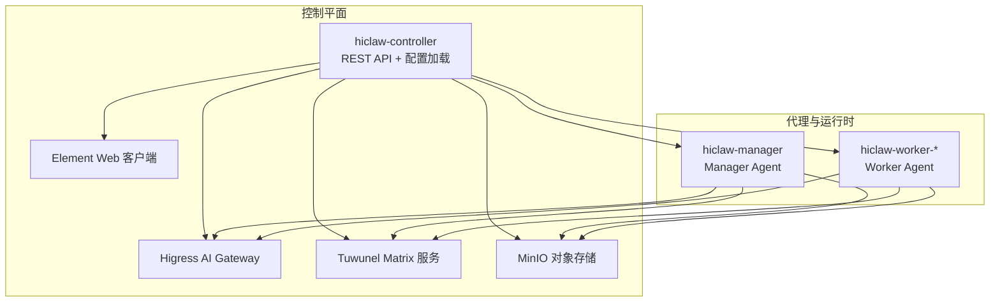
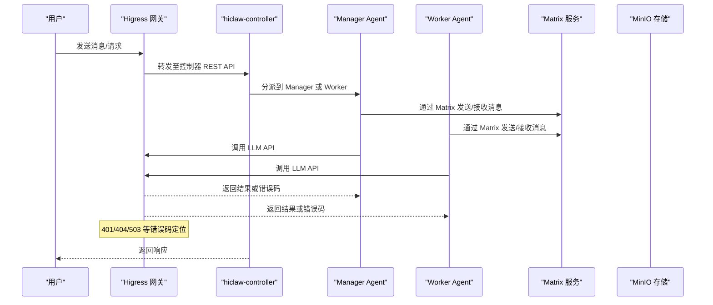
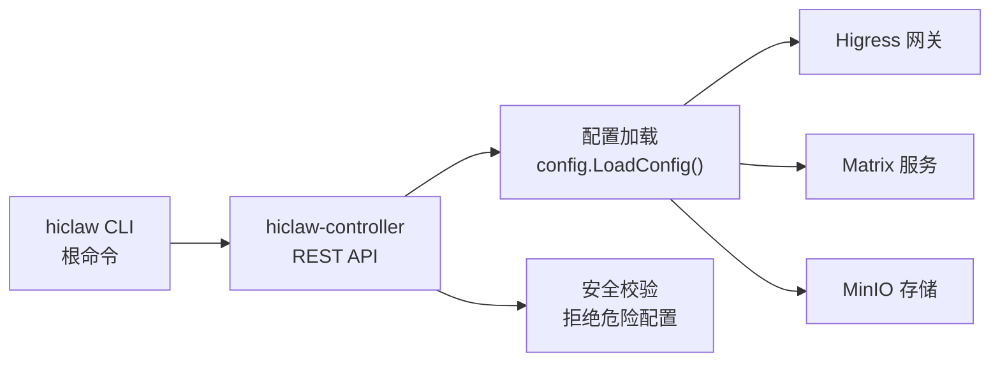

# 故障排除与常见问题

<cite>
**本文引用的文件**   
- [根目录自述文件](file://README.md)
- [故障排除与常见问题（FAQ）](file://docs/faq.md)
- [安装脚本说明](file://install/README.md)
- [调试日志导出工具](file://scripts/export-debug-log.py)
- [调试脚本（测试技能）](file://tests/skills/hiclaw-test/scripts/hiclaw-debug.sh)
- [hiclaw CLI 入口](file://hiclaw-controller/cmd/hiclaw/main.go)
- [控制器配置加载](file://hiclaw-controller/internal/config/config.go)
- [安全校验（容器创建）](file://hiclaw-controller/internal/proxy/security_test.go)
- [HTTP 响应工具](file://hiclaw-controller/internal/httputil/response.go)
- [CoPaw 标准排障路径](file://copaw/AGENTS.md)
- [安装脚本（Linux）](file://install/hiclaw-install.sh)
- [安装脚本（Windows PowerShell）](file://install/hiclaw-install.ps1)
- [测试辅助工具（断言与等待）](file://tests/lib/test-helpers.sh)
</cite>

## 目录
1. [简介](#简介)
2. [项目结构](#项目结构)
3. [核心组件](#核心组件)
4. [架构总览](#架构总览)
5. [详细组件分析](#详细组件分析)
6. [依赖关系分析](#依赖关系分析)
7. [性能考虑](#性能考虑)
8. [故障排除指南](#故障排除指南)
9. [结论](#结论)
10. [附录](#附录)

## 简介
本文件面向 HiClaw 用户与运维人员，提供系统化的故障排除与常见问题解答，覆盖安装、配置、运行时问题、调试与日志导出、错误码解释、问题报告流程、社区支持渠道、预防性维护与应急处理等。内容基于仓库内官方文档、CLI、控制器配置与调试工具，确保可操作性强且与实际代码实现一致。

## 项目结构
HiClaw 采用多容器/多后端架构：hiclaw-controller 作为控制平面，管理 Higress 网关、Tuwunel Matrix 服务器、MinIO 对象存储与 Element Web；Manager 与 Worker 通过声明式资源进行编排与生命周期管理。安装脚本与 Helm Chart 提供一键部署能力；CLI 用于资源管理与状态查询。

图示来源
- [根目录自述文件:305-333](file://README.md#L305-L333)
- [控制器配置加载:207-356](file://hiclaw-controller/internal/config/config.go#L207-L356)

章节来源
- [根目录自述文件:305-333](file://README.md#L305-L333)
- [安装脚本说明:1-186](file://install/README.md#L1-L186)

## 核心组件
- 控制器（hiclaw-controller）
  - 负责资源（Worker/Team/Human/Manager）的声明式管理、基础设施服务编排、认证与授权、网关与存储配置。
  - CLI 命令入口集中于根命令，支持 apply/create/get/update/delete/status/version 等子命令。
- 管理员代理（Manager Agent）
  - 运行在独立容器中，负责任务编排、与人类交互、模型切换、会话管理等。
- 工作者代理（Worker Agent）
  - 多运行时支持（OpenClaw/QwenPaw/Hermes），按需动态创建与销毁。
- 基础设施
  - Higress AI Gateway：统一流量入口与凭证管理。
  - Tuwunel Matrix：去中心化即时通讯协议服务。
  - MinIO：共享文件系统，支撑跨 Agent 的信息交换。
  - Element Web：零配置浏览器客户端。

章节来源
- [hiclaw CLI 入口:9-34](file://hiclaw-controller/cmd/hiclaw/main.go#L9-L34)
- [控制器配置加载:207-356](file://hiclaw-controller/internal/config/config.go#L207-L356)

## 架构总览
下图展示从用户到控制器、再到基础设施与代理的调用链路，以及关键错误点（如 401/404/503）的定位思路。

图示来源
- [根目录自述文件:268-276](file://README.md#L268-L276)
- [故障排除与常见问题（FAQ）:534-585](file://docs/faq.md#L534-L585)

## 详细组件分析

### 组件一：安装与升级问题
- 症状
  - Windows 安装脚本立即退出
  - “manifest unknown” 嵌入镜像拉取失败
- 排查要点
  - Windows：确认 Docker Desktop 已启动并完全加载；检查 WSL2 后端可用性。
  - 嵌入镜像：版本不匹配或镜像不存在；可选择已有版本、本地构建或覆盖镜像地址；必要时回退到旧版单容器架构（需满足条件）。
- 解决步骤
  - 升级/重装安装脚本，确保网络可达与镜像仓库可用。
  - 如需特定版本，使用版本变量指定；若无嵌入镜像，改用本地构建或自定义镜像。

章节来源
- [故障排除与常见问题（FAQ）:202-224](file://docs/faq.md#L202-L224)
- [安装脚本说明:1-186](file://install/README.md#L1-L186)
- [安装脚本（Linux）:1386-1416](file://install/hiclaw-install.sh#L1386-L1416)
- [安装脚本（Windows PowerShell）:3085-3099](file://install/hiclaw-install.ps1#L3085-L3099)

### 组件二：Manager/Worker 启动与连接问题
- 症状
  - Manager Agent 无响应或启动超时
  - 无法连接 Matrix 服务器
  - LAN 访问 Element Web 无法登录或提示不安全连接
- 排查要点
  - 检查容器健康状态与日志；内存不足需提升 Docker VM 内存配额。
  - 代理与容器网络策略：拒绝主机网络、特权、危险能力等。
  - 浏览器代理设置可能拦截本地域名解析，需加入绕过列表。
  - LAN 访问需将 Matrix 服务器地址改为本机 IP，并在 Element 中手动输入。
- 解决步骤
  - 重启安装流程并清理历史配置数据；升级 Docker Desktop/Podman 版本。
  - 在浏览器代理设置中添加本地域绕过规则；或直接修改 Element Homeserver 地址。
  - 使用 CLI 查询状态与资源，确认 Manager/Worker 是否成功创建。

章节来源
- [故障排除与常见问题（FAQ）:227-300](file://docs/faq.md#L227-L300)
- [安全校验（容器创建）:214-264](file://hiclaw-controller/internal/proxy/security_test.go#L214-L264)
- [hiclaw CLI 入口:9-34](file://hiclaw-controller/cmd/hiclaw/main.go#L9-L34)

### 组件三：模型切换与上下文窗口问题
- 症状
  - 切换模型后仍使用旧上下文窗口导致压缩失败
  - 会话卡在“正在输入”状态超过 2 分钟
- 排查要点
  - 模型切换需同时更新上下文窗口与最大令牌数；Higress 路由需正确指向目标提供商。
  - “正在输入”最长显示约 2 分钟，之后即使仍在执行也不会再显示。
- 解决步骤
  - 使用 Manager 的模型切换技能或 CLI 更新 Worker 模型；在 Higress 控制台配置路由规则。
  - 若会话异常，尝试在聊天中发送“/new”重置会话。

章节来源
- [故障排除与常见问题（FAQ）:312-400](file://docs/faq.md#L312-L400)
- [故障排除与常见问题（FAQ）:472-531](file://docs/faq.md#L472-L531)

### 组件四：HTTP 错误码定位与处理
- 常见错误码
  - 401：访问令牌无效或已过期（需激活相关计划或重启容器）
  - 404：模型名称错误或路由未配置
  - 503：容器无法访问外部 LLM 服务（网络或上游不可达）
- 定位方法
  - 查看 Higress 网关日志，结合“upstream_host”字段判断是上游错误还是路由配置问题。
  - 检查会话状态与模型配置是否匹配。
- 解决步骤
  - 激活所需计划并重新安装/重启；修正模型名称与路由；排查容器网络连通性。

章节来源
- [故障排除与常见问题（FAQ）:534-585](file://docs/faq.md#L534-L585)

### 组件五：日志导出与调试
- 工具与用途
  - 调试日志导出工具：导出 Matrix 消息与 Agent 会话日志，自动 PII 脱敏，支持时间范围过滤与容器/房间筛选。
  - 调试脚本：封装导出与挂起分析，快速识别 Worker 报告阶段完成但未 @Manager 的问题。
- 使用建议
  - 优先使用导出工具生成 debug-log，再交由 AI 工具交叉比对代码库定位根因。
  - 结合控制器与基础设施日志（Higress、Matrix、MinIO）进行关联分析。

章节来源
- [调试日志导出工具:1-756](file://scripts/export-debug-log.py#L1-L756)
- [调试脚本（测试技能）:1-176](file://tests/skills/hiclaw-test/scripts/hiclaw-debug.sh#L1-L176)

### 组件六：CoPaw 标准排障路径
- 五步定位法
  1. Matrix 是否收到用户消息
  2. 目标代理通道是否接受（检查策略/允许列表）
  3. 代理循环是否被唤醒（查看会话文件）
  4. LLM 请求是否往返成功（查看网关日志）
  5. 回复是否经 Matrix 成功发出
- 注意事项
  - 日志命名空间可能导致事件丢失，需核对日志级别与命名空间。
  - 检查 openclaw.json 与 .copaw/config.json 的策略配置。

章节来源
- [CoPaw 标准排障路径:354-379](file://copaw/AGENTS.md#L354-L379)

## 依赖关系分析
- CLI 与控制器
  - CLI 根命令集中注册各子命令，控制器监听本地 HTTP 端口并提供 REST API。
- 控制器与基础设施
  - 控制器根据配置加载矩阵、网关、对象存储参数，注入 Worker/Manager 环境变量。
- 安全与网络
  - 容器创建前进行安全校验，拒绝危险能力与主机网络模式，确保最小权限。

图示来源
- [hiclaw CLI 入口:9-34](file://hiclaw-controller/cmd/hiclaw/main.go#L9-L34)
- [控制器配置加载:207-356](file://hiclaw-controller/internal/config/config.go#L207-L356)
- [安全校验（容器创建）:214-264](file://hiclaw-controller/internal/proxy/security_test.go#L214-L264)

章节来源
- [hiclaw CLI 入口:9-34](file://hiclaw-controller/cmd/hiclaw/main.go#L9-L34)
- [控制器配置加载:207-356](file://hiclaw-controller/internal/config/config.go#L207-L356)
- [安全校验（容器创建）:214-264](file://hiclaw-controller/internal/proxy/security_test.go#L214-L264)

## 性能考虑
- 资源规划
  - 至少 2 核 CPU 与 4 GB 内存起步；多 Worker 场景建议 4 核 8 GB。
- 模型与上下文
  - 正确设置模型上下文窗口与最大令牌数，避免频繁压缩失败导致性能下降。
- 网络与路由
  - Higress 路由命中率与上游可用性直接影响响应延迟与成功率。

## 故障排除指南

### 一、安装与升级
- Windows 安装脚本立即退出
  - 确认 Docker Desktop 已启动并加载完成；检查 WSL2 后端。
- “manifest unknown” 嵌入镜像拉取失败
  - 选择存在嵌入镜像的版本；或本地构建；或覆盖镜像地址；必要时回退旧版单容器架构。

章节来源
- [故障排除与常见问题（FAQ）:202-224](file://docs/faq.md#L202-L224)
- [安装脚本说明:1-186](file://install/README.md#L1-L186)

### 二、启动与连接
- Manager 启动超时/无响应
  - 检查控制器与 Manager 容器日志；提升 Docker VM 内存；必要时删除并重新安装。
- 无法连接 Matrix 本地服务
  - 关闭浏览器/系统代理或添加本地域绕过；在 Element 中手动输入 Matrix 服务器地址。
- LAN 访问 Element Web
  - 将 Element Homeserver 地址改为本机 IP；忽略浏览器“不安全连接”警告。

章节来源
- [故障排除与常见问题（FAQ）:227-300](file://docs/faq.md#L227-L300)

### 三、模型与会话
- 切换模型后仍报错
  - 使用模型切换技能或 CLI 更新 Worker 模型；在 Higress 控制台配置路由；确保上下文窗口与最大令牌数匹配。
- 会话卡住“正在输入”
  - “正在输入”最长约 2 分钟；若长时间无响应，检查会话状态并重置。

章节来源
- [故障排除与常见问题（FAQ）:312-400](file://docs/faq.md#L312-L400)
- [故障排除与常见问题（FAQ）:472-531](file://docs/faq.md#L472-L531)

### 四、HTTP 错误码定位
- 401：激活所需计划或重启容器；确认令牌有效。
- 404：检查模型名称与路由配置。
- 503：排查容器网络与上游服务可达性。

章节来源
- [故障排除与常见问题（FAQ）:534-585](file://docs/faq.md#L534-L585)

### 五、日志导出与分析
- 导出范围与脱敏
  - 支持按小时/天导出；默认开启 PII 脱敏；可禁用脱敏以保留原始信息。
- 输出结构
  - 包含 Matrix 消息与 Agent 会话日志；按容器/房间分目录存放；生成汇总文件。
- AI 辅助分析
  - 将导出的 JSONL 文件交由 AI 工具与代码库交叉比对，快速定位根因。

章节来源
- [调试日志导出工具:1-756](file://scripts/export-debug-log.py#L1-L756)

### 六、CoPaw 排障流程
- 五步定位法
  1. Matrix 是否收到消息
  2. 通道是否允许
  3. 代理是否被唤醒
  4. LLM 请求是否成功
  5. 回复是否发出
- 注意事项
  - 核对日志命名空间与策略配置；检查 openclaw.json 与 .copaw/config.json。

章节来源
- [CoPaw 标准排障路径:354-379](file://copaw/AGENTS.md#L354-L379)

### 七、问题报告标准流程
- 准备材料
  - debug-log 输出目录（包含 Matrix 消息与 Agent 会话）
  - 控制器与基础设施日志（Higress、Matrix、MinIO）
  - 环境信息（操作系统、Docker/K8s 版本、HiClaw 版本、安装方式）
- 报告模板
  - 症状简述、复现步骤、期望行为、实际行为、影响范围
  - 相关日志与截图（建议先脱敏）
  - 环境信息与安装方式
- 提交渠道
  - GitHub Issues；可配合 AI 工具自动提交或代为填写

章节来源
- [根目录自述文件:363-378](file://README.md#L363-L378)

### 八、社区支持与获取帮助
- 社区渠道
  - Discord、GitHub Issues
- 获取帮助
  - 先自行导出 debug-log 并进行初步分析；在社区提问时附带分析摘要与日志链接

章节来源
- [根目录自述文件:396-400](file://README.md#L396-L400)

### 九、预防性维护与最佳实践
- 资源与网络
  - 为多 Worker 场景预留足够 CPU/内存；确保容器网络策略最小化暴露面。
- 配置与路由
  - 模型切换时同步更新上下文窗口；Higress 路由规则清晰明确。
- 日志与监控
  - 定期导出 debug-log；启用必要的日志级别；关注 401/404/503 等错误趋势。
- 升级与回滚
  - 升级前备份关键配置与日志；遇到问题可回滚至上一个稳定版本。

### 十、紧急情况应急处理
- 快速恢复
  - 重启 Manager/Worker 容器；重置会话（发送“/new”）；检查并修复 Higress 路由。
- 降级策略
  - 临时回退到旧版单容器架构（满足条件时）；或切换到更稳定的模型/路由组合。
- 通知与协作
  - 在 Matrix 房间中通知团队成员；共享 debug-log 以便协作者协助分析。

## 结论
HiClaw 的故障排除应遵循“日志先行、分层定位”的原则：先用调试工具导出日志，再结合控制器与基础设施日志定位问题根因；针对模型与路由、容器安全策略、网络连通性等关键环节逐一验证；最后通过社区与自动化工具加速问题闭环。建立标准化的问题报告流程与预防性维护机制，有助于降低故障发生概率与恢复成本。

## 附录

### A. CLI 常用命令速查
- 查询状态与资源
  - hiclaw status / get workers / get teams / get humans / get managers
- 创建/更新/删除资源
  - hiclaw create/update/delete worker/team/human/manager
- Worker 生命周期
  - hiclaw worker sleep/wake/status
- 版本与帮助
  - hiclaw version / help

章节来源
- [故障排除与常见问题（FAQ）:74-198](file://docs/faq.md#L74-L198)
- [hiclaw CLI 入口:9-34](file://hiclaw-controller/cmd/hiclaw/main.go#L9-L34)

### B. HTTP 错误码对照表
- 401：访问令牌无效或已过期
- 404：模型名称错误或路由未配置
- 503：容器无法访问外部 LLM 服务

章节来源
- [故障排除与常见问题（FAQ）:588-589](file://docs/faq.md#L588-L589)
- [故障排除与常见问题（FAQ）:576-581](file://docs/faq.md#L576-L581)

### C. 环境变量与配置要点
- 控制器与基础设施
  - HICLAW_ADMIN_USER/HICLAW_ADMIN_PASSWORD、HICLAW_AI_GATEWAY_ADMIN_URL、HICLAW_MATRIX_URL、HICLAW_FS_ENDPOINT、HICLAW_DEFAULT_MODEL、HICLAW_OPENAI_BASE_URL、HICLAW_ELEMENT_WEB_URL
- Worker 默认运行时与资源
  - HICLAW_DEFAULT_WORKER_RUNTIME、HICLAW_K8S_WORKER_CPU/MEMORY、HICLAW_MANAGER_* 系列
- 代理与可观测性
  - HICLAW_CMS_*、HICLAW_MATRIX_DEBUG、HICLAW_YOLO

章节来源
- [控制器配置加载:207-356](file://hiclaw-controller/internal/config/config.go#L207-L356)