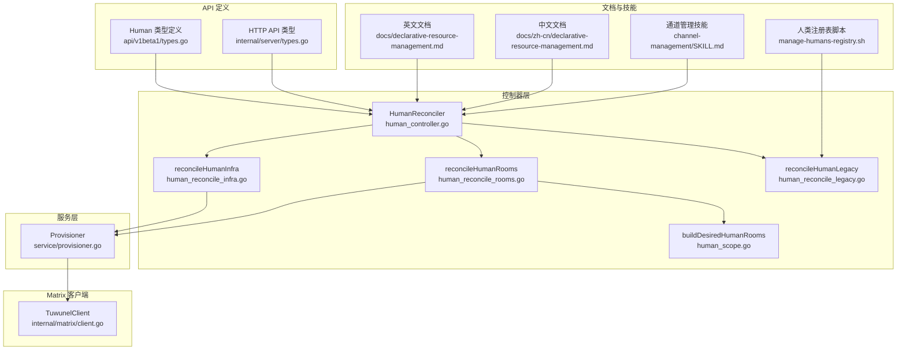
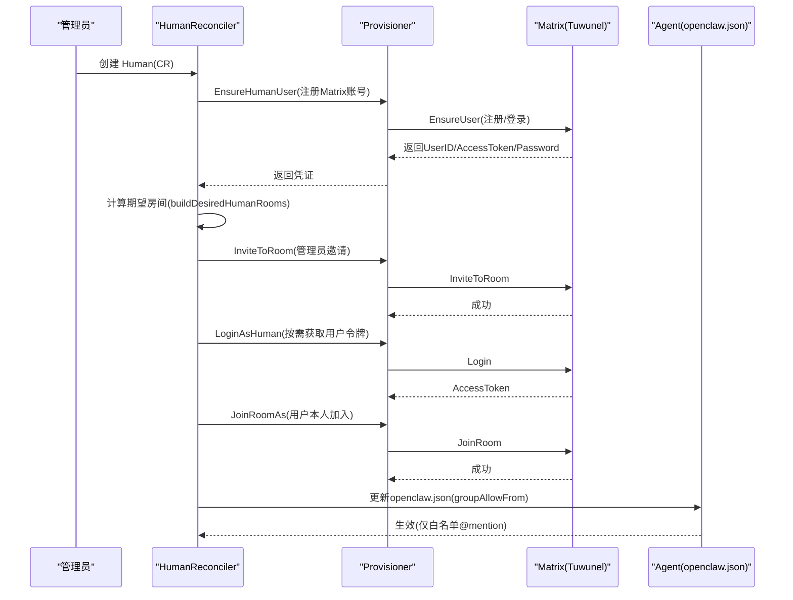
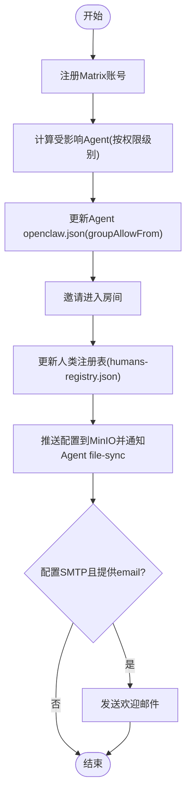
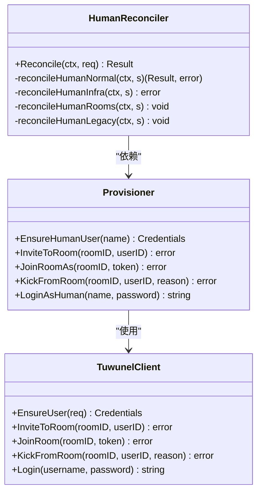
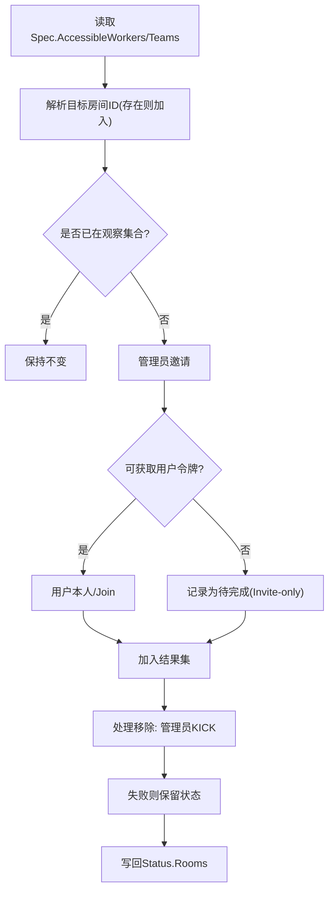
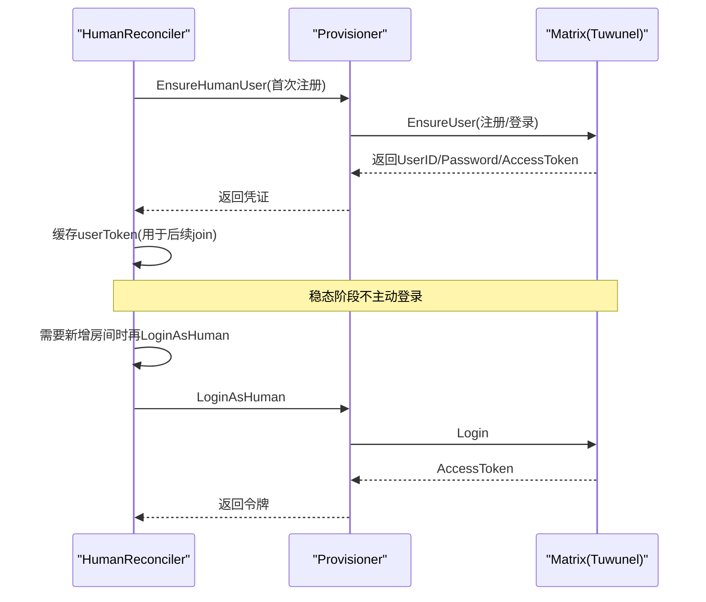
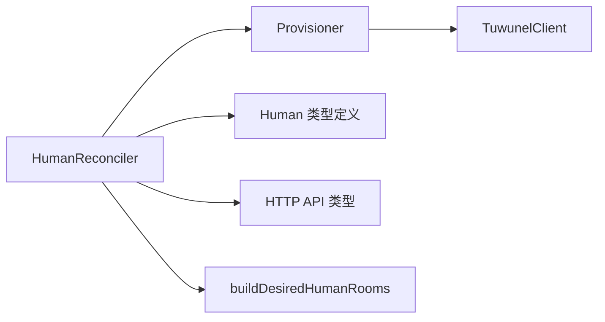

# 人类用户管理

<cite>
**本文引用的文件**
- [hiclaw-controller/internal/controller/human_controller.go](file://hiclaw-controller/internal/controller/human_controller.go)
- [hiclaw-controller/internal/controller/human_reconcile_rooms.go](file://hiclaw-controller/internal/controller/human_reconcile_rooms.go)
- [hiclaw-controller/internal/controller/human_reconcile_infra.go](file://hiclaw-controller/internal/controller/human_reconcile_infra.go)
- [hiclaw-controller/internal/controller/human_reconcile_legacy.go](file://hiclaw-controller/internal/controller/human_reconcile_legacy.go)
- [hiclaw-controller/internal/controller/human_scope.go](file://hiclaw-controller/internal/controller/human_scope.go)
- [hiclaw-controller/internal/matrix/client.go](file://hiclaw-controller/internal/matrix/client.go)
- [hiclaw-controller/internal/service/provisioner.go](file://hiclaw-controller/internal/service/provisioner.go)
- [hiclaw-controller/api/v1beta1/types.go](file://hiclaw-controller/api/v1beta1/types.go)
- [hiclaw-controller/internal/server/types.go](file://hiclaw-controller/internal/server/types.go)
- [docs/declarative-resource-management.md](file://docs/declarative-resource-management.md)
- [docs/zh-cn/declarative-resource-management.md](file://docs/zh-cn/declarative-resource-management.md)
- [manager/agent/skills/human-management/scripts/manage-humans-registry.sh](file://manager/agent/skills/human-management/scripts/manage-humans-registry.sh)
- [manager/agent/skills/channel-management/SKILL.md](file://manager/agent/skills/channel-management/SKILL.md)
</cite>

## 目录
1. [简介](#简介)
2. [项目结构](#项目结构)
3. [核心组件](#核心组件)
4. [架构总览](#架构总览)
5. [详细组件分析](#详细组件分析)
6. [依赖分析](#依赖分析)
7. [性能考虑](#性能考虑)
8. [故障排查指南](#故障排查指南)
9. [结论](#结论)
10. [附录](#附录)

## 简介
本文件面向 HiClaw 的 Human（人类用户）管理系统，系统性阐述人类用户的权限管理与访问控制机制、Matrix 房间中的身份验证与授权流程、人类用户的创建与生命周期管理、以及人类用户与 Manager、Worker 的交互与通信协议。同时覆盖 Matrix 服务器侧的人力资源管理能力（用户注册、房间邀请、权限设置）、安全最佳实践与权限控制策略，并给出多通道通信的角色与配置方法。

## 项目结构
围绕 Human 的实现，关键代码分布在控制器层、服务层、Matrix 客户端与 API 定义中；文档提供了权限模型与创建流程说明；Manager 侧技能负责人类用户注册表的维护与通道管理。

**图表来源**
- [hiclaw-controller/internal/controller/human_controller.go:1-103](file://hiclaw-controller/internal/controller/human_controller.go#L1-L103)
- [hiclaw-controller/internal/controller/human_reconcile_rooms.go:1-123](file://hiclaw-controller/internal/controller/human_reconcile_rooms.go#L1-L123)
- [hiclaw-controller/internal/controller/human_reconcile_infra.go:1-54](file://hiclaw-controller/internal/controller/human_reconcile_infra.go#L1-L54)
- [hiclaw-controller/internal/controller/human_reconcile_legacy.go:1-36](file://hiclaw-controller/internal/controller/human_reconcile_legacy.go#L1-L36)
- [hiclaw-controller/internal/controller/human_scope.go:49-79](file://hiclaw-controller/internal/controller/human_scope.go#L49-L79)
- [hiclaw-controller/internal/service/provisioner.go:162-182](file://hiclaw-controller/internal/service/provisioner.go#L162-L182)
- [hiclaw-controller/internal/matrix/client.go:16-87](file://hiclaw-controller/internal/matrix/client.go#L16-L87)
- [hiclaw-controller/api/v1beta1/types.go:331-355](file://hiclaw-controller/api/v1beta1/types.go#L331-L355)
- [hiclaw-controller/internal/server/types.go:146-173](file://hiclaw-controller/internal/server/types.go#L146-L173)
- [docs/declarative-resource-management.md:407-528](file://docs/declarative-resource-management.md#L407-L528)
- [docs/zh-cn/declarative-resource-management.md:477-528](file://docs/zh-cn/declarative-resource-management.md#L477-L528)
- [manager/agent/skills/human-management/scripts/manage-humans-registry.sh:50-92](file://manager/agent/skills/human-management/scripts/manage-humans-registry.sh#L50-L92)
- [manager/agent/skills/channel-management/SKILL.md:1-30](file://manager/agent/skills/channel-management/SKILL.md#L1-L30)

**章节来源**
- [hiclaw-controller/internal/controller/human_controller.go:1-103](file://hiclaw-controller/internal/controller/human_controller.go#L1-L103)
- [hiclaw-controller/internal/controller/human_reconcile_rooms.go:1-123](file://hiclaw-controller/internal/controller/human_reconcile_rooms.go#L1-L123)
- [hiclaw-controller/internal/controller/human_reconcile_infra.go:1-54](file://hiclaw-controller/internal/controller/human_reconcile_infra.go#L1-L54)
- [hiclaw-controller/internal/controller/human_reconcile_legacy.go:1-36](file://hiclaw-controller/internal/controller/human_reconcile_legacy.go#L1-L36)
- [hiclaw-controller/internal/controller/human_scope.go:49-79](file://hiclaw-controller/internal/controller/human_scope.go#L49-L79)
- [hiclaw-controller/internal/service/provisioner.go:162-182](file://hiclaw-controller/internal/service/provisioner.go#L162-L182)
- [hiclaw-controller/internal/matrix/client.go:16-87](file://hiclaw-controller/internal/matrix/client.go#L16-L87)
- [hiclaw-controller/api/v1beta1/types.go:331-355](file://hiclaw-controller/api/v1beta1/types.go#L331-L355)
- [hiclaw-controller/internal/server/types.go:146-173](file://hiclaw-controller/internal/server/types.go#L146-L173)
- [docs/declarative-resource-management.md:407-528](file://docs/declarative-resource-management.md#L407-L528)
- [docs/zh-cn/declarative-resource-management.md:477-528](file://docs/zh-cn/declarative-resource-management.md#L477-L528)
- [manager/agent/skills/human-management/scripts/manage-humans-registry.sh:50-92](file://manager/agent/skills/human-management/scripts/manage-humans-registry.sh#L50-L92)
- [manager/agent/skills/channel-management/SKILL.md:1-30](file://manager/agent/skills/channel-management/SKILL.md#L1-L30)

## 核心组件
- Human 控制器：负责人类用户的基础设施（Matrix 账户）与房间成员关系的声明式收敛，以及嵌入式模式下的注册表同步。
- Provisioner：封装矩阵客户端调用，执行人类账户注册、房间邀请/加入/踢出等操作。
- Matrix 客户端：抽象 Tuwunel（Conduwuit） Homeserver 的用户、房间、消息、权限等操作。
- API 类型：定义 Human 的 Spec/Status 字段、HTTP 请求/响应类型。
- 文档与技能：提供权限模型、创建流程、注册表维护与通道管理参考。

**章节来源**
- [hiclaw-controller/internal/controller/human_controller.go:16-27](file://hiclaw-controller/internal/controller/human_controller.go#L16-L27)
- [hiclaw-controller/internal/service/provisioner.go:128-182](file://hiclaw-controller/internal/service/provisioner.go#L128-L182)
- [hiclaw-controller/internal/matrix/client.go:16-87](file://hiclaw-controller/internal/matrix/client.go#L16-L87)
- [hiclaw-controller/api/v1beta1/types.go:339-355](file://hiclaw-controller/api/v1beta1/types.go#L339-L355)
- [hiclaw-controller/internal/server/types.go:148-173](file://hiclaw-controller/internal/server/types.go#L148-L173)

## 架构总览
Human 的权限与访问控制由两层机制共同保障：
- Matrix 房间邀请与成员关系：根据权限级别计算应加入的房间集合，控制器通过管理员令牌邀请人类用户，并在可获得用户令牌时触发用户本人 /join。
- Agent 侧白名单控制：将人类用户的 Matrix ID 写入 Agent 的 openclaw.json 中的 groupAllowFrom，仅允许白名单内的 @mention 触发 Agent 响应。

**图表来源**
- [hiclaw-controller/internal/controller/human_controller.go:83-96](file://hiclaw-controller/internal/controller/human_controller.go#L83-L96)
- [hiclaw-controller/internal/controller/human_reconcile_rooms.go:27-87](file://hiclaw-controller/internal/controller/human_reconcile_rooms.go#L27-L87)
- [hiclaw-controller/internal/controller/human_reconcile_infra.go:35-53](file://hiclaw-controller/internal/controller/human_reconcile_infra.go#L35-L53)
- [hiclaw-controller/internal/matrix/client.go:131-225](file://hiclaw-controller/internal/matrix/client.go#L131-L225)
- [docs/declarative-resource-management.md:479-500](file://docs/declarative-resource-management.md#L479-L500)

**章节来源**
- [docs/declarative-resource-management.md:479-500](file://docs/declarative-resource-management.md#L479-L500)
- [docs/zh-cn/declarative-resource-management.md:477-499](file://docs/zh-cn/declarative-resource-management.md#L477-L499)

## 详细组件分析

### 人类用户权限模型与创建流程
- 三等级权限模型：L1（管理员等效）、L2（团队范围）、L3（Worker 限定）。L1 忽略可访问列表，L2/L3 依据 Spec.AccessibleTeams/AccessibleWorkers 计算房间集合。
- 权限实现机制：
  - 房间邀请：将人类用户邀请至对应房间。
  - Agent 白名单：将人类用户的 Matrix ID 写入 Agent 的 openclaw.json 中的 groupAllowFrom，限制 Agent 仅响应白名单内的 @mention。
- 创建流程：注册 Matrix 账户、计算受影响 Agent 并更新 groupAllowFrom、邀请进入房间、更新注册表、推送配置、发送欢迎邮件（可选）。

**图表来源**
- [docs/declarative-resource-management.md:492-500](file://docs/declarative-resource-management.md#L492-L500)
- [docs/zh-cn/declarative-resource-management.md:490-518](file://docs/zh-cn/declarative-resource-management.md#L490-L518)

**章节来源**
- [docs/declarative-resource-management.md:439-500](file://docs/declarative-resource-management.md#L439-L500)
- [docs/zh-cn/declarative-resource-management.md:477-518](file://docs/zh-cn/declarative-resource-management.md#L477-L518)

### Human 控制器与声明式收敛
- 控制器职责：确保 Matrix 账户存在、维护房间成员关系、在嵌入式模式下同步人类注册表。
- 收敛阶段顺序：基础设施（首次注册）、房间（邀请/加入/移除）、注册表（最后同步，非致命）。
- 状态写回：统一在 defer 中进行 Patch，失败时聚合错误。

**图表来源**
- [hiclaw-controller/internal/controller/human_controller.go:22-27](file://hiclaw-controller/internal/controller/human_controller.go#L22-L27)
- [hiclaw-controller/internal/service/provisioner.go:162-182](file://hiclaw-controller/internal/service/provisioner.go#L162-L182)
- [hiclaw-controller/internal/matrix/client.go:16-87](file://hiclaw-controller/internal/matrix/client.go#L16-L87)

**章节来源**
- [hiclaw-controller/internal/controller/human_controller.go:29-96](file://hiclaw-controller/internal/controller/human_controller.go#L29-L96)

### 房间成员关系收敛逻辑
- 期望房间集合：基于 Spec.AccessibleWorkers/Teams 解析目标房间 ID；若目标对象未就绪（房间 ID 为空），则跳过本轮。
- 新增：管理员邀请；若可获取用户令牌，则以用户身份执行 /join。
- 移除：管理员踢出；失败则保留状态，等待下次重试。
- 错误处理：单个房间操作失败不阻断整体收敛。

**图表来源**
- [hiclaw-controller/internal/controller/human_reconcile_rooms.go:27-87](file://hiclaw-controller/internal/controller/human_reconcile_rooms.go#L27-L87)
- [hiclaw-controller/internal/controller/human_scope.go:49-79](file://hiclaw-controller/internal/controller/human_scope.go#L49-L79)

**章节来源**
- [hiclaw-controller/internal/controller/human_reconcile_rooms.go:9-87](file://hiclaw-controller/internal/controller/human_reconcile_rooms.go#L9-L87)
- [hiclaw-controller/internal/controller/human_scope.go:49-79](file://hiclaw-controller/internal/controller/human_scope.go#L49-L79)

### Matrix 账户基础设施与令牌懒加载
- 首次注册：调用 EnsureHumanUser，返回 MatrixUserID、初始密码与访问令牌；缓存令牌以便后续房间阶段直接使用。
- 稳态：不主动变更；避免周期性登录导致设备会话膨胀。
- 令牌懒加载：仅在确实需要新增房间加入时才尝试登录，避免每 5 分钟重试造成设备碎片化。

**图表来源**
- [hiclaw-controller/internal/controller/human_reconcile_infra.go:10-53](file://hiclaw-controller/internal/controller/human_reconcile_infra.go#L10-L53)
- [hiclaw-controller/internal/controller/human_reconcile_rooms.go:89-122](file://hiclaw-controller/internal/controller/human_reconcile_rooms.go#L89-L122)

**章节来源**
- [hiclaw-controller/internal/controller/human_reconcile_infra.go:10-53](file://hiclaw-controller/internal/controller/human_reconcile_infra.go#L10-L53)
- [hiclaw-controller/internal/controller/human_reconcile_rooms.go:89-122](file://hiclaw-controller/internal/controller/human_reconcile_rooms.go#L89-L122)

### 人类注册表与嵌入式模式同步
- 在嵌入式模式下，控制器将人类用户信息写入 humans-registry.json，供 Manager 侧技能消费。
- 同步为尽力而为，失败不阻断主流程。

**章节来源**
- [hiclaw-controller/internal/controller/human_reconcile_legacy.go:10-35](file://hiclaw-controller/internal/controller/human_reconcile_legacy.go#L10-L35)
- [manager/agent/skills/human-management/scripts/manage-humans-registry.sh:50-92](file://manager/agent/skills/human-management/scripts/manage-humans-registry.sh#L50-L92)

### 人类用户与 Manager、Worker 的交互与通信协议
- 人类用户通过 Matrix 房间与 Manager、Worker 交互；房间邀请由控制器根据权限级别自动完成。
- Agent 侧通过 openclaw.json 的 groupAllowFrom 限制仅响应白名单内的 @mention，确保协作安全可控。
- Manager 侧“通道管理”技能提供管理员身份识别、可信联系人管理、主通知通道配置与跨通道升级流程等能力。

**章节来源**
- [docs/declarative-resource-management.md:479-491](file://docs/declarative-resource-management.md#L479-L491)
- [manager/agent/skills/channel-management/SKILL.md:1-30](file://manager/agent/skills/channel-management/SKILL.md#L1-L30)

## 依赖分析
- 控制器依赖 Provisioner 提供的矩阵操作能力；Provisioner 再依赖 TuwunelClient 实现具体 API 调用。
- Human 的期望房间集合由 Spec.AccessibleWorkers/Teams 推导，依赖 Worker/Team 的状态房间 ID。
- API 层定义 Human 的 Spec/Status 字段与 HTTP 请求/响应类型，作为控制器与外部系统的契约。

**图表来源**
- [hiclaw-controller/internal/controller/human_controller.go:22-27](file://hiclaw-controller/internal/controller/human_controller.go#L22-L27)
- [hiclaw-controller/internal/service/provisioner.go:162-182](file://hiclaw-controller/internal/service/provisioner.go#L162-L182)
- [hiclaw-controller/internal/matrix/client.go:16-87](file://hiclaw-controller/internal/matrix/client.go#L16-L87)
- [hiclaw-controller/api/v1beta1/types.go:339-355](file://hiclaw-controller/api/v1beta1/types.go#L339-L355)
- [hiclaw-controller/internal/server/types.go:148-173](file://hiclaw-controller/internal/server/types.go#L148-L173)
- [hiclaw-controller/internal/controller/human_scope.go:49-79](file://hiclaw-controller/internal/controller/human_scope.go#L49-L79)

**章节来源**
- [hiclaw-controller/internal/controller/human_controller.go:22-27](file://hiclaw-controller/internal/controller/human_controller.go#L22-L27)
- [hiclaw-controller/internal/controller/human_scope.go:49-79](file://hiclaw-controller/internal/controller/human_scope.go#L49-L79)

## 性能考虑
- 设备会话膨胀防护：控制器仅在确需新增房间加入时才进行用户登录，避免每 5 分钟重试导致大量孤儿设备会话。
- 最大化幂等性：房间别名与邀请/加入/踢出均为幂等操作，重试不会产生重复或破坏性副作用。
- 最小化令牌刷新：稳态阶段不主动刷新用户令牌，减少不必要的登录往返。

[本节为通用指导，无需特定文件来源]

## 故障排查指南
- 登录失败或密码过期：控制器在获取用户令牌失败时降级为管理员邀请，不视为协调失败；建议检查 InitialPassword 是否可用，必要时重新生成并下发。
- 房间加入失败：检查用户令牌有效性与房间权限；控制器会保留状态并等待下次重试。
- 注册表同步失败：嵌入式模式下的注册表更新为尽力而为，失败不影响房间成员关系收敛。
- 管理员欢迎邮件未送达：确认 SMTP 配置与 Human.spec.email；控制器仅在配置完整时发送。

**章节来源**
- [hiclaw-controller/internal/controller/human_reconcile_rooms.go:89-122](file://hiclaw-controller/internal/controller/human_reconcile_rooms.go#L89-L122)
- [hiclaw-controller/internal/controller/human_reconcile_legacy.go:10-35](file://hiclaw-controller/internal/controller/human_reconcile_legacy.go#L10-L35)
- [docs/zh-cn/declarative-resource-management.md:500-528](file://docs/zh-cn/declarative-resource-management.md#L500-L528)

## 结论
HiClaw 的 Human 管理体系通过“房间邀请 + Agent 白名单”的双层权限控制，实现了对人类用户与 AI Agent 协作的精细化访问治理。控制器以声明式方式收敛人类用户的 Matrix 账户与房间成员关系，结合嵌入式注册表与配置推送，确保协作流程稳定、可审计、可扩展。配合 Manager 侧的通道管理与可信联系人机制，形成从身份、房间、到 Agent 行为的全链路安全基线。

[本节为总结性内容，无需特定文件来源]

## 附录

### 权限级别与房间映射速查
- L1：所有房间
- L2：指定 Team/Worker 房间
- L3：指定 Worker 房间

**章节来源**
- [docs/declarative-resource-management.md:486-491](file://docs/declarative-resource-management.md#L486-L491)
- [docs/zh-cn/declarative-resource-management.md:484-489](file://docs/zh-cn/declarative-resource-management.md#L484-L489)

### API 类型摘要
- CreateHumanRequest：创建人类用户所需字段（名称、显示名、邮箱、权限级别、可访问团队/Worker、备注）。
- HumanResponse：人类用户状态（阶段、Matrix 用户 ID、初始密码、房间列表、消息）。

**章节来源**
- [hiclaw-controller/internal/server/types.go:148-173](file://hiclaw-controller/internal/server/types.go#L148-L173)