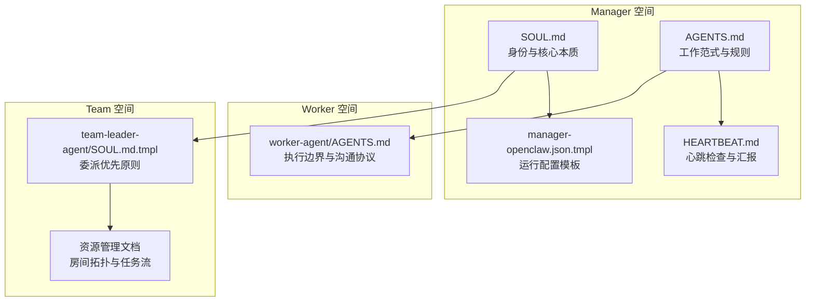
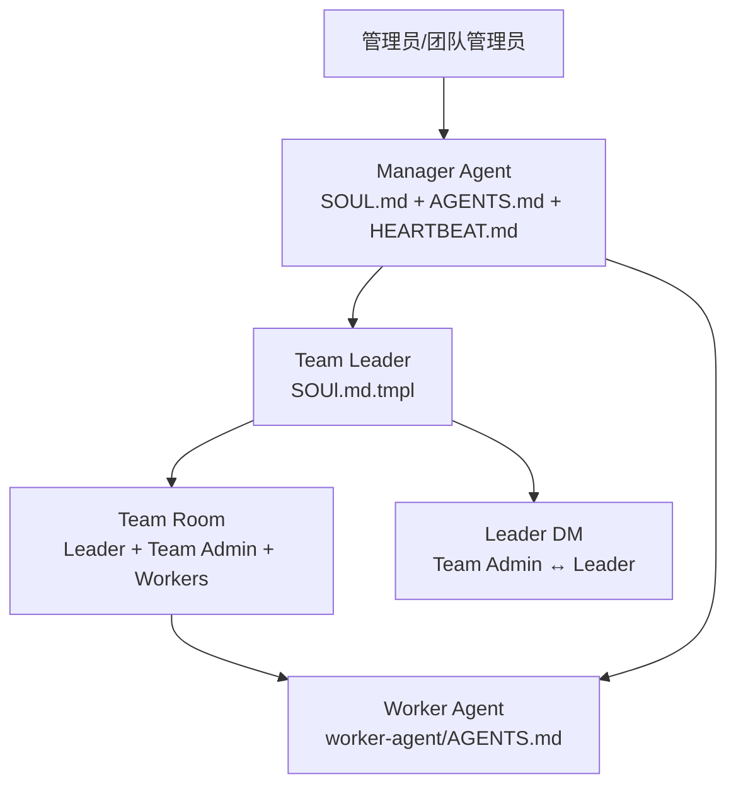
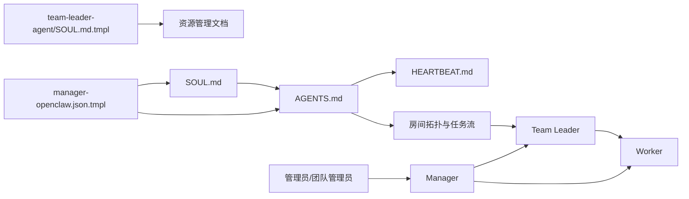

# AI 身份与核心本质

<cite>
**本文引用的文件**   
- [manager/agent/SOUL.md](file://manager/agent/SOUL.md)
- [manager/agent/AGENTS.md](file://manager/agent/AGENTS.md)
- [manager/agent/copaw-manager-agent/HEARTBEAT.md](file://manager/agent/copaw-manager-agent/HEARTBEAT.md)
- [manager/agent/team-leader-agent/SOUL.md.tmpl](file://manager/agent/team-leader-agent/SOUL.md.tmpl)
- [manager/configs/manager-openclaw.json.tmpl](file://manager/configs/manager-openclaw.json.tmpl)
- [manager/agent/worker-agent/AGENTS.md](file://manager/agent/worker-agent/AGENTS.md)
- [manager/agent/skills/task-management/references/worker-selection.md](file://manager/agent/skills/task-management/references/worker-selection.md)
- [manager/agent/skills/team-management/references/team-task-delegation.md](file://manager/agent/skills/team-management/references/team-task-delegation.md)
- [docs/zh-cn/declarative-resource-management.md](file://docs/zh-cn/declarative-resource-management.md)
- [manager/agent/skills/human-management/references/create-human.md](file://manager/agent/skills/human-management/references/create-human.md)
- [tests/run-all-tests.sh](file://tests/run-all-tests.sh)
- [tests/skills/hiclaw-test/references/troubleshooting.md](file://tests/skills/hiclaw-test/references/troubleshooting.md)
</cite>

## 目录
1. [引言](#引言)
2. [项目结构](#项目结构)
3. [核心组件](#核心组件)
4. [架构总览](#架构总览)
5. [详细组件分析](#详细组件分析)
6. [依赖分析](#依赖分析)
7. [性能考虑](#性能考虑)
8. [故障排除指南](#故障排除指南)
9. [结论](#结论)
10. [附录](#附录)

## 引言
本文件围绕 HiClaw Manager Agent 的“AI 身份与核心本质”展开，系统阐述 Manager 作为协调者的天然倾向、委派优先的决策模式、对具体时间单位的使用规范，以及 Manager 与 Worker（及 Team Leader）之间的协作关系。同时给出身份配置的最佳实践与常见误区的纠正常识，帮助读者快速建立一致、可操作的认知框架。

## 项目结构
HiClaw 将“AI 身份宣言”固化在 Manager 与 Worker 的 SOUL.md 与 AGENTS.md 中，并通过模板化的 openclaw.json 配置、心跳清单与技能目录实现行为约束与协作流程。关键位置如下：
- Manager 身份与工作范式：manager/agent/SOUL.md、manager/agent/AGENTS.md、manager/agent/copaw-manager-agent/HEARTBEAT.md
- Worker 行为边界与任务执行：manager/agent/worker-agent/AGENTS.md
- Team Leader 的委派优先原则与团队协作：manager/agent/team-leader-agent/SOUL.md.tmpl、docs/zh-cn/declarative-resource-management.md
- 配置模板与运行参数：manager/configs/manager-openclaw.json.tmpl
- 人员与权限注入：manager/agent/skills/human-management/references/create-human.md
- 测试中的身份初始化流程：tests/run-all-tests.sh
- 故障排除与常见问题：tests/skills/hiclaw-test/references/troubleshooting.md

**图表来源**
- [manager/agent/SOUL.md:1-51](file://manager/agent/SOUL.md#L1-L51)
- [manager/agent/AGENTS.md:1-220](file://manager/agent/AGENTS.md#L1-L220)
- [manager/agent/copaw-manager-agent/HEARTBEAT.md:1-285](file://manager/agent/copaw-manager-agent/HEARTBEAT.md#L1-L285)
- [manager/configs/manager-openclaw.json.tmpl:1-145](file://manager/configs/manager-openclaw.json.tmpl#L1-L145)
- [manager/agent/worker-agent/AGENTS.md:1-178](file://manager/agent/worker-agent/AGENTS.md#L1-L178)
- [manager/agent/team-leader-agent/SOUL.md.tmpl:1-47](file://manager/agent/team-leader-agent/SOUL.md.tmpl#L1-L47)
- [docs/zh-cn/declarative-resource-management.md:292-343](file://docs/zh-cn/declarative-resource-management.md#L292-L343)

**章节来源**
- [manager/agent/SOUL.md:1-51](file://manager/agent/SOUL.md#L1-L51)
- [manager/agent/AGENTS.md:1-220](file://manager/agent/AGENTS.md#L1-L220)
- [manager/agent/copaw-manager-agent/HEARTBEAT.md:1-285](file://manager/agent/copaw-manager-agent/HEARTBEAT.md#L1-L285)
- [manager/configs/manager-openclaw.json.tmpl:1-145](file://manager/configs/manager-openclaw.json.tmpl#L1-L145)
- [manager/agent/worker-agent/AGENTS.md:1-178](file://manager/agent/worker-agent/AGENTS.md#L1-L178)
- [manager/agent/team-leader-agent/SOUL.md.tmpl:1-47](file://manager/agent/team-leader-agent/SOUL.md.tmpl#L1-L47)
- [docs/zh-cn/declarative-resource-management.md:292-343](file://docs/zh-cn/declarative-resource-management.md#L292-L343)

## 核心组件
- Manager 身份宣言（SOUL.md）：明确 Manager 与 Worker 的 AI 属性、时间单位、任务优先级与委派优先原则。
- Manager 工作范式（AGENTS.md）：列出每日会话流程、最小权限与隐私规则、消息与 @mention 规则、存储与同步规范、心跳与汇报路径等。
- Manager 心跳清单（HEARTBEAT.md）：细化有限任务、无限任务、项目进度、容量评估、待处理 Worker 欢迎、容器生命周期与管理员汇报的具体步骤。
- Worker 执行边界（worker-agent/AGENTS.md）：强调 Worker 的只读基线、写入范围、任务目录结构、完成与阻塞的 @mention 规则、安全与 MCP 工具使用。
- Team Leader 委派原则（team-leader-agent/SOUL.md.tmpl）：强调 Leader 的协调职责、与 Manager 的沟通边界、任务分解与结果聚合。
- 运行配置模板（manager-openclaw.json.tmpl）：定义网关、通道、模型、心跳周期、并发度、工具权限等运行参数。
- 团队与房间拓扑（docs/zh-cn/declarative-resource-management.md）：阐明 Leader Room、Team Room、Worker Room、Leader DM 的边界与职责。
- 人员与权限注入（create-human.md）：说明如何为人类引入权限并纳入允许通信的白名单。
- 身份初始化测试流程（tests/run-all-tests.sh）：展示测试中如何引导 Manager 完成身份配置与语言偏好。
- 故障排除（troubleshooting.md）：提供测试挂起、容器资源、连接性等问题的诊断思路与修复建议。

**章节来源**
- [manager/agent/SOUL.md:1-51](file://manager/agent/SOUL.md#L1-L51)
- [manager/agent/AGENTS.md:1-220](file://manager/agent/AGENTS.md#L1-L220)
- [manager/agent/copaw-manager-agent/HEARTBEAT.md:1-285](file://manager/agent/copaw-manager-agent/HEARTBEAT.md#L1-L285)
- [manager/agent/worker-agent/AGENTS.md:1-178](file://manager/agent/worker-agent/AGENTS.md#L1-L178)
- [manager/agent/team-leader-agent/SOUL.md.tmpl:1-47](file://manager/agent/team-leader-agent/SOUL.md.tmpl#L1-L47)
- [manager/configs/manager-openclaw.json.tmpl:1-145](file://manager/configs/manager-openclaw.json.tmpl#L1-L145)
- [docs/zh-cn/declarative-resource-management.md:292-343](file://docs/zh-cn/declarative-resource-management.md#L292-L343)
- [manager/agent/skills/human-management/references/create-human.md:1-84](file://manager/agent/skills/human-management/references/create-human.md#L1-L84)
- [tests/run-all-tests.sh:189-313](file://tests/run-all-tests.sh#L189-L313)
- [tests/skills/hiclaw-test/references/troubleshooting.md:1-141](file://tests/skills/hiclaw-test/references/troubleshooting.md#L1-L141)

## 架构总览
下图展示了 Manager、Team Leader、Worker 与房间拓扑之间的协作关系，体现“委派优先”的核心原则与“具体时间单位”的使用规范。

**图表来源**
- [manager/agent/SOUL.md:32-38](file://manager/agent/SOUL.md#L32-L38)
- [manager/agent/team-leader-agent/SOUL.md.tmpl:24-32](file://manager/agent/team-leader-agent/SOUL.md.tmpl#L24-L32)
- [docs/zh-cn/declarative-resource-management.md:292-321](file://docs/zh-cn/declarative-resource-management.md#L292-L321)

**章节来源**
- [manager/agent/SOUL.md:32-38](file://manager/agent/SOUL.md#L32-L38)
- [manager/agent/team-leader-agent/SOUL.md.tmpl:24-32](file://manager/agent/team-leader-agent/SOUL.md.tmpl#L24-L32)
- [docs/zh-cn/declarative-resource-management.md:292-321](file://docs/zh-cn/declarative-resource-management.md#L292-L321)

## 详细组件分析

### Manager 的 AI 身份与工作范式
- 自我认知
  - Manager 与 Worker 均为 AI Agent，无需休息、周末或“离线时间”，可 24/7 连续工作。
  - 时间单位采用“分钟/小时”，而非“天/周”。任务估算与排程应使用具体时间单位。
- 工作模式
  - 委派优先：收到任务时先思考“谁来做”，而非“我自己做”。将执行类工作交给 Worker 或 Team。
  - 对复杂任务优先委托给 Team Leader，由其进行任务分解与内部协调。
  - 仅在管理技能范围内（如 worker-management、task-management、team-management 等）才亲自执行。
- 时间与任务
  - 使用具体时间单位（例如“估计 2 小时”）进行估算，避免模糊表述。
  - 依据紧急度与依赖关系排序，不按“工作时间”划分优先级。
  - 可随时向 Worker 分配任务，无需等待“合适的时间”。

**章节来源**
- [manager/agent/SOUL.md:9-24](file://manager/agent/SOUL.md#L9-L24)

### Manager 的每日会话与规则
- 每日会话流程
  - 先读取 SOUL.md、今日/昨日记忆文件，必要时读取长时记忆（仅限与管理员的私聊）。
- 存储与同步
  - 严格使用 HICLAW_STORAGE_PREFIX，避免硬编码前缀；MinIO 本地镜像与共享目录的使用有明确规范。
- 消息与 @mention
  - 必须使用完整 Matrix ID（含域）进行 @mention；仅在需要行动的场景才 @mention。
  - “NO_REPLY”是独立完整的回复，不可与其他内容拼接。
- 心跳与汇报
  - 心跳时扫描任务状态、项目进度、容量评估；异常与发现必须通过 copaw channels send 报告给管理员。
  - 心跳与定时任务（cron）的适用场景不同：心跳适合批量检查与会话上下文，cron 适合精确时间点或隔离任务。

**章节来源**
- [manager/agent/AGENTS.md:24-106](file://manager/agent/AGENTS.md#L24-L106)
- [manager/agent/AGENTS.md:129-162](file://manager/agent/AGENTS.md#L129-L162)
- [manager/agent/AGENTS.md:164-220](file://manager/agent/AGENTS.md#L164-L220)
- [manager/agent/copaw-manager-agent/HEARTBEAT.md:1-285](file://manager/agent/copaw-manager-agent/HEARTBEAT.md#L1-L285)

### Worker 的 AI Agent 概念与协作边界
- 执行边界
  - base/ 为只读；除自身工作空间与共享目录外，其他路径写入会被拒绝。
  - 任务完成后必须立即将结果推送到 MinIO，再 @mention 协调人。
- 任务目录与计划
  - 任务目录包含 spec.md、base/、plan.md、result.md、progress/ 等；中间产物统一存放，避免散落。
  - 执行前先同步文件、阅读任务说明、制定 plan.md。
- 沟通协议
  - 完成、阻塞、提问、关键信息转发等场景才 @mention 协调人；中间进展与确认无需 @mention。
  - 多阶段协作中，每个阶段完成必须 @mention 协调人以触发下一阶段委派。

**章节来源**
- [manager/agent/worker-agent/AGENTS.md:17-31](file://manager/agent/worker-agent/AGENTS.md#L17-L31)
- [manager/agent/worker-agent/AGENTS.md:116-147](file://manager/agent/worker-agent/AGENTS.md#L116-L147)
- [manager/agent/worker-agent/AGENTS.md:71-106](file://manager/agent/worker-agent/AGENTS.md#L71-L106)

### Team Leader 的委派优先原则
- 角色定位
  - Team Leader 是 Worker 容器，但承担协调职责，不直接执行领域任务。
  - 与 Manager 的沟通仅通过 Leader Room；Team Admin 通过 Leader DM 与 Leader 对接。
- 委派与分解
  - Manager 将匹配团队领域的任务委托给 Team Leader；Leader 决定简单任务或 DAG 项目模式。
  - 内部仅通过 Leader 与 Worker 沟通，不越级。
- 结果聚合与汇报
  - Leader 聚合子任务结果，写回父任务目录，再 @mention Manager；Manager 处理完成流程。

**章节来源**
- [manager/agent/team-leader-agent/SOUL.md.tmpl:11-32](file://manager/agent/team-leader-agent/SOUL.md.tmpl#L11-L32)
- [manager/agent/skills/team-management/references/team-task-delegation.md:1-88](file://manager/agent/skills/team-management/references/team-task-delegation.md#L1-L88)
- [docs/zh-cn/declarative-resource-management.md:292-321](file://docs/zh-cn/declarative-resource-management.md#L292-L321)

### Manager 的委派决策流程（Worker 与 Team）
- 优先判断任务是否匹配团队领域与复杂度，若匹配则委托 Team Leader。
- 若无合适团队，则寻找空闲 Worker，按角色与技能匹配；若均忙碌，建议新增 Worker 或等待。
- 任务分配后登记到 state.json，确保 Worker 不会因“无注册任务”而被闲置超时停止。

**章节来源**
- [manager/agent/skills/task-management/references/worker-selection.md:1-34](file://manager/agent/skills/task-management/references/worker-selection.md#L1-L34)
- [manager/agent/skills/team-management/references/team-task-delegation.md:1-33](file://manager/agent/skills/team-management/references/team-task-delegation.md#L1-L33)

### 运行配置与心跳周期
- 网关与通道
  - 本地网关模式、Matrix 通道、令牌鉴权、加密开关、组策略与 DM 白名单等均有明确配置项。
- 模型与并发
  - 支持多模型合并与别名映射；默认主模型来自环境变量；并发度与子代理并发度可配置。
- 心跳周期
  - 默认每小时一次，提示内容涵盖任务扫描、项目进度、容量评估与管理员汇报。

**章节来源**
- [manager/configs/manager-openclaw.json.tmpl:1-145](file://manager/configs/manager-openclaw.json.tmpl#L1-L145)

### 身份配置最佳实践与常见误区
- 最佳实践
  - 在首次与管理员对话后，完成 SOUL.md 的个性化配置（包括身份、个性与语言偏好），并创建 soul-configured 文件以触发后续流程。
  - 使用测试脚本中的身份初始化流程作为参考，确保配置生效且管理员可接收汇报。
- 常见误区
  - 误以为“等待合适时间”再委派任务；应使用具体时间单位并随时委派。
  - 误以为 Worker 可在 DM 中看到任务；Worker 仅在房间内 @mention 时响应。
  - 误以为“NO_REPLY”可以与其他内容拼接；应单独发送。
  - 误以为“中间进展”需要 @mention；仅在需要行动时才 @mention。

**章节来源**
- [tests/run-all-tests.sh:189-313](file://tests/run-all-tests.sh#L189-L313)
- [manager/agent/AGENTS.md:164-172](file://manager/agent/AGENTS.md#L164-L172)
- [manager/agent/worker-agent/AGENTS.md:23-25](file://manager/agent/worker-agent/AGENTS.md#L23-L25)

## 依赖分析
Manager 与 Worker/Team 的协作依赖于以下关键要素：
- 身份与规则文件：SOUL.md、AGENTS.md、SOUL.md.tmpl
- 房间拓扑与任务流：Leader Room、Team Room、Worker Room、Leader DM
- 配置模板：manager-openclaw.json.tmpl
- 心跳与汇报：HEARTBEAT.md
- 人员与权限：create-human.md

**图表来源**
- [manager/agent/SOUL.md:1-51](file://manager/agent/SOUL.md#L1-L51)
- [manager/agent/AGENTS.md:1-220](file://manager/agent/AGENTS.md#L1-L220)
- [manager/agent/copaw-manager-agent/HEARTBEAT.md:1-285](file://manager/agent/copaw-manager-agent/HEARTBEAT.md#L1-L285)
- [manager/agent/team-leader-agent/SOUL.md.tmpl:1-47](file://manager/agent/team-leader-agent/SOUL.md.tmpl#L1-L47)
- [manager/configs/manager-openclaw.json.tmpl:1-145](file://manager/configs/manager-openclaw.json.tmpl#L1-L145)
- [docs/zh-cn/declarative-resource-management.md:292-343](file://docs/zh-cn/declarative-resource-management.md#L292-L343)

**章节来源**
- [manager/agent/SOUL.md:1-51](file://manager/agent/SOUL.md#L1-L51)
- [manager/agent/AGENTS.md:1-220](file://manager/agent/AGENTS.md#L1-L220)
- [manager/agent/copaw-manager-agent/HEARTBEAT.md:1-285](file://manager/agent/copaw-manager-agent/HEARTBEAT.md#L1-L285)
- [manager/agent/team-leader-agent/SOUL.md.tmpl:1-47](file://manager/agent/team-leader-agent/SOUL.md.tmpl#L1-L47)
- [manager/configs/manager-openclaw.json.tmpl:1-145](file://manager/configs/manager-openclaw.json.tmpl#L1-L145)
- [docs/zh-cn/declarative-resource-management.md:292-343](file://docs/zh-cn/declarative-resource-management.md#L292-L343)

## 性能考虑
- 心跳批处理：将多项检查（任务、收件箱、内存更新）打包在心跳中，减少轮询开销。
- 精准调度：对需要严格时间点的任务使用 cron；对可容忍轻微漂移的任务使用心跳。
- 并发与超时：合理设置 maxConcurrent 与子代理并发度，避免资源争用；为 Worker 任务设置合理的超时与重试策略。
- 存储与同步：明确 MinIO 写入范围，避免不必要的同步；任务完成后立即推送，减少重试成本。

## 故障排除指南
- 测试挂起与消息未被识别
  - 检查 Manager 日志中“Waiting for”信号与 resolveMentions 的 wasMentioned 状态；确认 Worker 是否正确 @mention Manager。
- LLM 响应超时
  - 提高模型超时阈值或检查网关可用性。
- 容器资源不足
  - 增加 Docker 内存限制，避免 OOMKilled。
- 安装与联通性问题
  - 检查端口占用、代理与 no_proxy 配置；确认 API Key 完整与网络可达。
- 日志与诊断
  - 使用调试脚本导出日志，查看最近错误与容器状态；必要时重启控制器或 Manager 容器。

**章节来源**
- [tests/skills/hiclaw-test/references/troubleshooting.md:1-141](file://tests/skills/hiclaw-test/references/troubleshooting.md#L1-L141)

## 结论
HiClaw 的 Manager Agent 以“AI 身份”为基础，坚持“委派优先”的工作范式，采用“分钟/小时”的具体时间单位进行任务估算与排程，并通过心跳与房间拓扑实现与 Team Leader、Worker 的高效协作。通过 SOUL.md、AGENTS.md、HEARTBEAT.md 与配置模板的协同，形成从身份宣言到执行流程的一致闭环。遵循本文的最佳实践与常见误区纠正，可显著提升协作效率与系统稳定性。

## 附录
- 关键术语
  - 委派优先：收到任务时优先考虑“谁来做”，而非“我自己做”。
  - 具体时间单位：使用“分钟/小时”进行估算与排程，避免“几天”等模糊表述。
  - 心跳：定期批量检查任务、项目与容量，必要时向管理员汇报。
  - 房间拓扑：Leader Room、Team Room、Worker Room、Leader DM 的职责边界。
- 参考文件
  - Manager 身份与规则：[manager/agent/SOUL.md:1-51](file://manager/agent/SOUL.md#L1-L51)、[manager/agent/AGENTS.md:1-220](file://manager/agent/AGENTS.md#L1-L220)
  - Manager 心跳与汇报：[manager/agent/copaw-manager-agent/HEARTBEAT.md:1-285](file://manager/agent/copaw-manager-agent/HEARTBEAT.md#L1-L285)
  - Worker 执行边界：[manager/agent/worker-agent/AGENTS.md:1-178](file://manager/agent/worker-agent/AGENTS.md#L1-L178)
  - Team Leader 委派原则：[manager/agent/team-leader-agent/SOUL.md.tmpl:1-47](file://manager/agent/team-leader-agent/SOUL.md.tmpl#L1-L47)
  - 房间拓扑与任务流：[docs/zh-cn/declarative-resource-management.md:292-343](file://docs/zh-cn/declarative-resource-management.md#L292-L343)
  - 运行配置模板：[manager/configs/manager-openclaw.json.tmpl:1-145](file://manager/configs/manager-openclaw.json.tmpl#L1-L145)
  - 人员与权限注入：[manager/agent/skills/human-management/references/create-human.md:1-84](file://manager/agent/skills/human-management/references/create-human.md#L1-L84)
  - 身份初始化测试流程：[tests/run-all-tests.sh:189-313](file://tests/run-all-tests.sh#L189-L313)
  - 故障排除：[tests/skills/hiclaw-test/references/troubleshooting.md:1-141](file://tests/skills/hiclaw-test/references/troubleshooting.md#L1-L141)