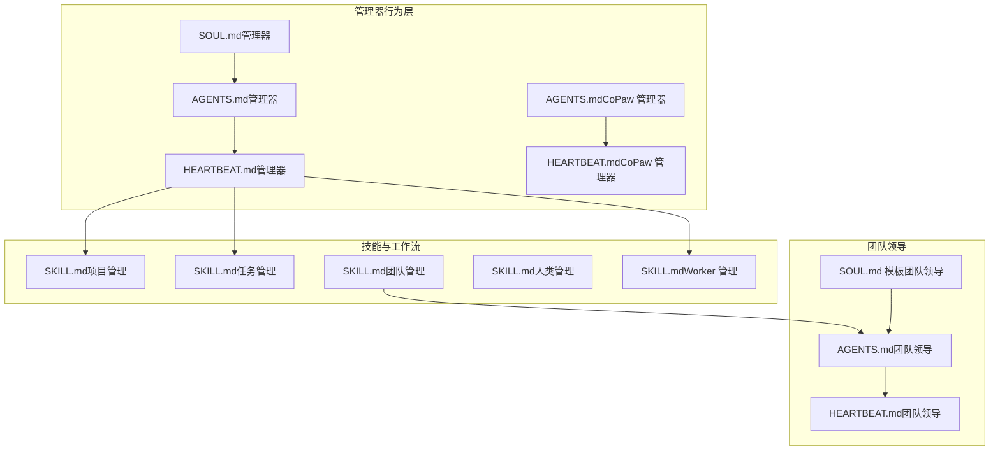
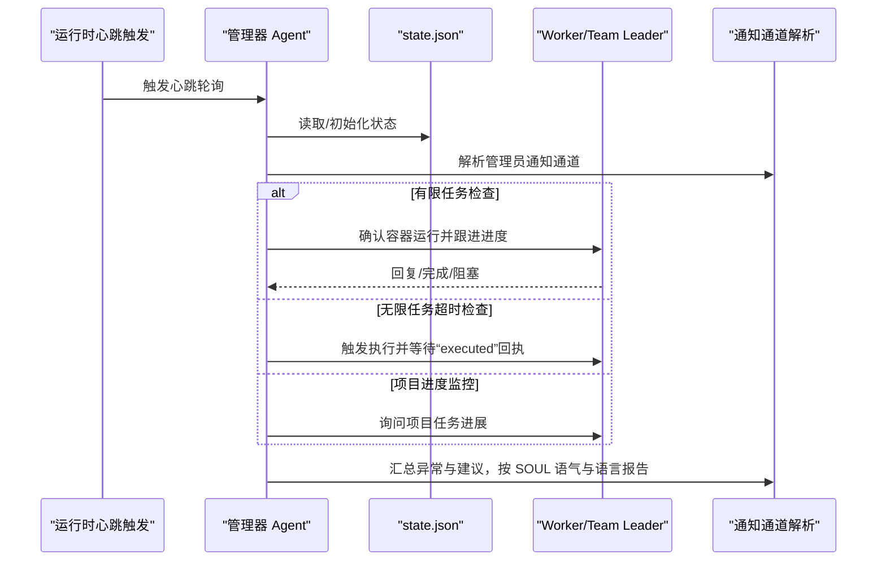
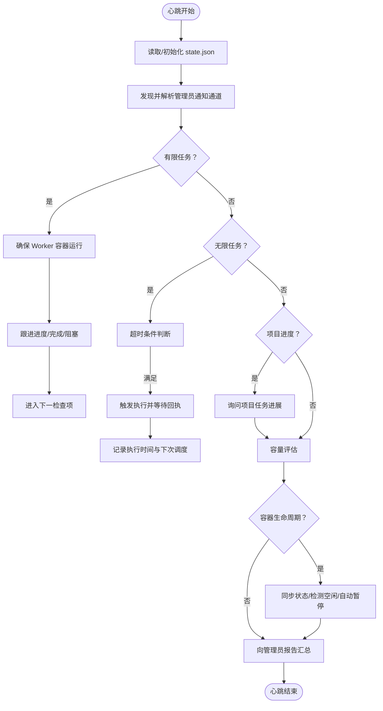
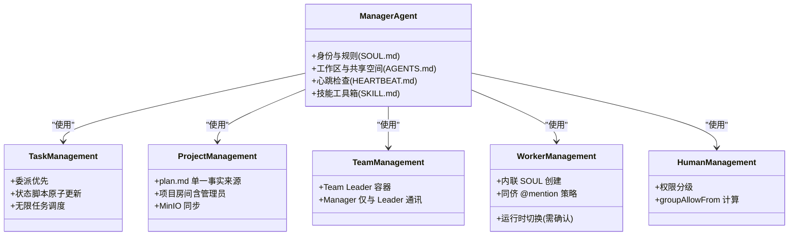
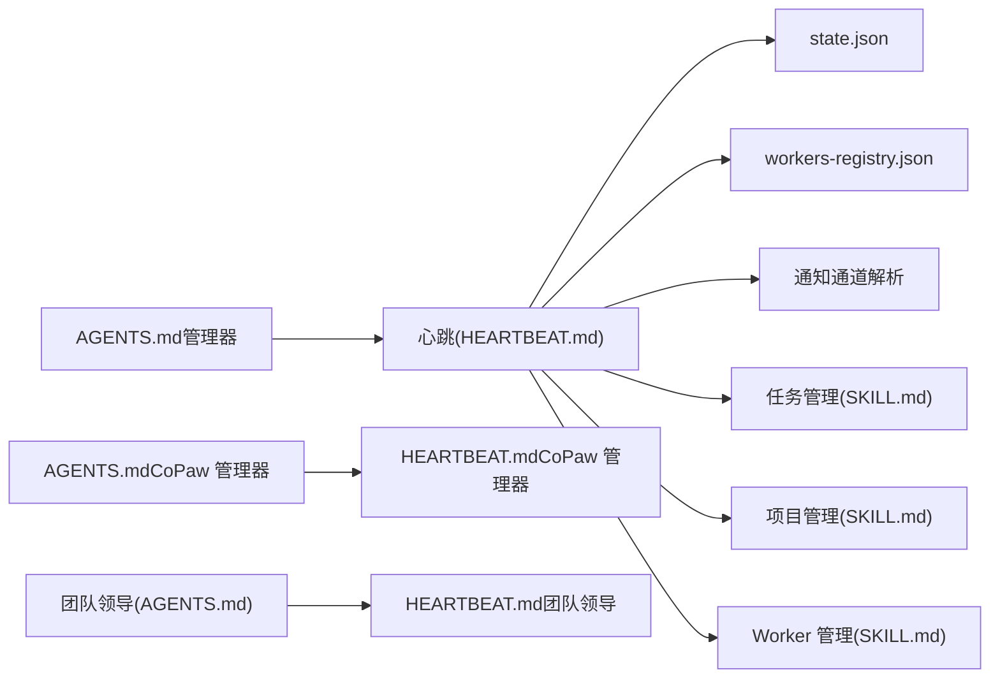

# Manager Agent 行为定义

<cite>
**本文引用的文件**
- [SOUL.md（管理器）](file://manager/agent/SOUL.md)
- [HEARTBEAT.md（管理器）](file://manager/agent/HEARTBEAT.md)
- [AGENTS.md（管理器）](file://manager/agent/AGENTS.md)
- [HEARTBEAT.md（CoPaw 管理器）](file://manager/agent/copaw-manager-agent/HEARTBEAT.md)
- [AGENTS.md（CoPaw 管理器）](file://manager/agent/copaw-manager-agent/AGENTS.md)
- [AGENTS.md（团队领导）](file://manager/agent/team-leader-agent/AGENTS.md)
- [SOUL.md 模板（团队领导）](file://manager/agent/team-leader-agent/SOUL.md.tmpl)
- [HEARTBEAT.md（团队领导）](file://manager/agent/team-leader-agent/HEARTBEAT.md)
- [SKILL.md（项目管理）](file://manager/agent/skills/project-management/SKILL.md)
- [SKILL.md（任务管理）](file://manager/agent/skills/task-management/SKILL.md)
- [SKILL.md（团队管理）](file://manager/agent/skills/team-management/SKILL.md)
- [SKILL.md（人类管理）](file://manager/agent/skills/human-management/SKILL.md)
- [SKILL.md（Worker 管理）](file://manager/agent/skills/worker-management/SKILL.md)
</cite>

## 目录
1. [简介](#简介)
2. [项目结构](#项目结构)
3. [核心组件](#核心组件)
4. [架构总览](#架构总览)
5. [详细组件分析](#详细组件分析)
6. [依赖关系分析](#依赖关系分析)
7. [性能考量](#性能考量)
8. [故障排查指南](#故障排查指南)
9. [结论](#结论)
10. [附录](#附录)

## 简介
本文件面向 HiClaw Manager Agent 的行为定义系统，系统性阐述代理身份与安全规则、心跳与定期检查流程、技能与任务工作流配置，并提供行为定制方法、最佳实践、验证与调试技巧，以及常见配置错误的解决方案。内容基于仓库中的 SOUL.md、HEARTBEAT.md、AGENTS.md 及相关技能文档，确保可操作、可落地。

## 项目结构
HiClaw 的 Manager Agent 行为定义由“身份与规则”“心跳与检查”“工作流与技能”三部分构成，并在不同运行时（OpenClaw 与 CoPaw）下有差异化的消息发送与通道解析策略。团队领导 Agent 作为 Manager 的委派者，承担团队内任务分解与协调职责。

图表来源
- [SOUL.md（管理器）](file://manager/agent/SOUL.md)
- [AGENTS.md（管理器）](file://manager/agent/AGENTS.md)
- [HEARTBEAT.md（管理器）](file://manager/agent/HEARTBEAT.md)
- [HEARTBEAT.md（CoPaw 管理器）](file://manager/agent/copaw-manager-agent/HEARTBEAT.md)
- [AGENTS.md（CoPaw 管理器）](file://manager/agent/copaw-manager-agent/AGENTS.md)
- [SKILL.md（项目管理）](file://manager/agent/skills/project-management/SKILL.md)
- [SKILL.md（任务管理）](file://manager/agent/skills/task-management/SKILL.md)
- [SKILL.md（团队管理）](file://manager/agent/skills/team-management/SKILL.md)
- [SKILL.md（人类管理）](file://manager/agent/skills/human-management/SKILL.md)
- [SKILL.md（Worker 管理）](file://manager/agent/skills/worker-management/SKILL.md)
- [AGENTS.md（团队领导）](file://manager/agent/team-leader-agent/AGENTS.md)
- [SOUL.md 模板（团队领导）](file://manager/agent/team-leader-agent/SOUL.md.tmpl)
- [HEARTBEAT.md（团队领导）](file://manager/agent/team-leader-agent/HEARTBEAT.md)

章节来源
- [SOUL.md（管理器）](file://manager/agent/SOUL.md)
- [AGENTS.md（管理器）](file://manager/agent/AGENTS.md)
- [HEARTBEAT.md（管理器）](file://manager/agent/HEARTBEAT.md)
- [HEARTBEAT.md（CoPaw 管理器）](file://manager/agent/copaw-manager-agent/HEARTBEAT.md)
- [AGENTS.md（CoPaw 管理器）](file://manager/agent/copaw-manager-agent/AGENTS.md)
- [SKILL.md（项目管理）](file://manager/agent/skills/project-management/SKILL.md)
- [SKILL.md（任务管理）](file://manager/agent/skills/task-management/SKILL.md)
- [SKILL.md（团队管理）](file://manager/agent/skills/team-management/SKILL.md)
- [SKILL.md（人类管理）](file://manager/agent/skills/human-management/SKILL.md)
- [SKILL.md（Worker 管理）](file://manager/agent/skills/worker-management/SKILL.md)
- [AGENTS.md（团队领导）](file://manager/agent/team-leader-agent/AGENTS.md)
- [SOUL.md 模板（团队领导）](file://manager/agent/team-leader-agent/SOUL.md.tmpl)
- [HEARTBEAT.md（团队领导）](file://manager/agent/team-leader-agent/HEARTBEAT.md)

## 核心组件
- 代理身份与安全规则（SOUL）
  - 明确 AI 身份、工作节奏、对 Worker 的认知与委托原则，以及安全边界（凭证存储、文件访问、权限与通道）。
- 心跳与定期检查（HEARTBEAT）
  - 周期性扫描任务状态、Worker 容器生命周期、项目进度与容量评估，并通过统一通道向管理员汇报。
- 工作流与技能（AGENTS + SKILL）
  - 以技能为工具箱，规范任务分配、无限循环任务调度、项目计划与房间协议、消息发送与通知渠道解析。

章节来源
- [SOUL.md（管理器）](file://manager/agent/SOUL.md)
- [HEARTBEAT.md（管理器）](file://manager/agent/HEARTBEAT.md)
- [AGENTS.md（管理器）](file://manager/agent/AGENTS.md)
- [SKILL.md（任务管理）](file://manager/agent/skills/task-management/SKILL.md)
- [SKILL.md（项目管理）](file://manager/agent/skills/project-management/SKILL.md)

## 架构总览
Manager Agent 在两类运行时中执行心跳与消息发送：
- OpenClaw 运行时：使用通用消息工具进行发送，心跳步骤直接描述消息体与目标。
- CoPaw 运行时：必须通过 CLI 封装的消息发送工具，确保格式化与 @mention 结构正确。

图表来源
- [HEARTBEAT.md（管理器）](file://manager/agent/HEARTBEAT.md)
- [HEARTBEAT.md（CoPaw 管理器）](file://manager/agent/copaw-manager-agent/HEARTBEAT.md)
- [AGENTS.md（管理器）](file://manager/agent/AGENTS.md)
- [AGENTS.md（CoPaw 管理器）](file://manager/agent/copaw-manager-agent/AGENTS.md)

## 详细组件分析

### 代理身份与安全规则（SOUL）
- 身份与个性
  - 强调 Manager 的“委派型管理者”本质：优先分解与委派，而非亲自动手；复杂多技能任务优先委派给 Team Leader。
  - 管理技能清单明确：包括 Worker/Team/Human/Task/Project/Channel/MCP/文件同步/模型切换等。
- 安全规则
  - 仅在受信任房间与 DM 白名单内回复；凭证通过加密文件传输，不通过 IM 泄露；外部 API 凭证集中于网关 MCP 配置，Worker 仅凭消费者密钥访问。
  - 文件访问需显式授权，不得扫描或读取主机文件，不得在未授权情况下发送主机文件内容。

章节来源
- [SOUL.md（管理器）](file://manager/agent/SOUL.md)

### 心跳机制与定期检查流程
- 周期性检查清单
  - 读取本地 state.json 并初始化；确保管理员通知通道可用（DM 房间发现与解析）。
  - 有限任务：确认 Worker 容器运行状态，按需等待初始化后跟进；若 Worker 无响应则标记异常并上报。
  - 团队委派任务：仅与 Team Leader 联系，不直接打扰团队成员。
  - 无限任务超时：满足条件时触发执行，收到“executed”后再更新时间戳，避免重复触发。
  - 项目进度：扫描 active 项目与 plan.md，跟进无进展任务；处理 Worker 报告完成但计划未更新的情况。
  - 容量评估：统计在途有限任务与空闲 Worker，决定是否增员或再分配。
  - Worker 容器生命周期：在容器 API 可用时同步状态、检测空闲并自动暂停，必要时通知 Worker 所在房间。
  - 向管理员报告：汇总异常与建议，按 SOUL 语气与语言发送至已解析的通知通道。
- CoPaw 运行时差异
  - 所有向组房间与管理员的通知必须通过 CLI 发送，确保 HTML 渲染与 @mention 结构正确；管理员 DM 中禁止使用 CLI 发送，应在最终回复中一次性传达。

图表来源
- [HEARTBEAT.md（管理器）](file://manager/agent/HEARTBEAT.md)
- [HEARTBEAT.md（CoPaw 管理器）](file://manager/agent/copaw-manager-agent/HEARTBEAT.md)

章节来源
- [HEARTBEAT.md（管理器）](file://manager/agent/HEARTBEAT.md)
- [HEARTBEAT.md（CoPaw 管理器）](file://manager/agent/copaw-manager-agent/HEARTBEAT.md)
- [AGENTS.md（管理器）](file://manager/agent/AGENTS.md)
- [AGENTS.md（CoPaw 管理器）](file://manager/agent/copaw-manager-agent/AGENTS.md)

### 技能定义与任务工作流配置
- 任务管理（SKILL.md）
  - 委派优先、避免 Worker 对陌生领域的“幻觉”；使用状态脚本原子更新 state.json；无限任务只“激活”不“完成”。
- 项目管理（SKILL.md）
  - plan.md 为单一事实来源；项目房间必须包含管理员；在 YOLO 模式下自动确认计划步骤；变更需同步到 MinIO。
- 团队管理（SKILL.md）
  - Team Leader 是具备管理技能的 Worker 容器；Manager 仅与 Leader 通讯，不直接 @mention 团队成员；Leader 房间为标准三方（Manager + 全局管理员 + Leader）。
- Worker 管理（SKILL.md）
  - 创建 Worker 时内联 SOUL，避免转义问题；支持运行时切换（破坏性操作，需先确认）；启用同侪 @mention 需明确使用场景与限制。
- 人类管理（SKILL.md）
  - 权限分级（1 最高，3 最低），按级别计算 groupAllowFrom；Level 1 人类拥有管理员同等访问。

图表来源
- [SKILL.md（任务管理）](file://manager/agent/skills/task-management/SKILL.md)
- [SKILL.md（项目管理）](file://manager/agent/skills/project-management/SKILL.md)
- [SKILL.md（团队管理）](file://manager/agent/skills/team-management/SKILL.md)
- [SKILL.md（Worker 管理）](file://manager/agent/skills/worker-management/SKILL.md)
- [SKILL.md（人类管理）](file://manager/agent/skills/human-management/SKILL.md)

章节来源
- [SKILL.md（任务管理）](file://manager/agent/skills/task-management/SKILL.md)
- [SKILL.md（项目管理）](file://manager/agent/skills/project-management/SKILL.md)
- [SKILL.md（团队管理）](file://manager/agent/skills/team-management/SKILL.md)
- [SKILL.md（Worker 管理）](file://manager/agent/skills/worker-management/SKILL.md)
- [SKILL.md（人类管理）](file://manager/agent/skills/human-management/SKILL.md)

### 团队领导 Agent
- 工作区与职责
  - 以 team-state.json 为准，协调团队完成 Manager 下达的任务；使用 CLI 发送消息，确保格式化与 @mention 正确。
- 心跳要点
  - 对长期无进展的任务进行跟进；对比运行时状态与 team-state.json 决定唤醒/休眠；仅在必要时向上游汇报。

章节来源
- [AGENTS.md（团队领导）](file://manager/agent/team-leader-agent/AGENTS.md)
- [SOUL.md 模板（团队领导）](file://manager/agent/team-leader-agent/SOUL.md.tmpl)
- [HEARTBEAT.md（团队领导）](file://manager/agent/team-leader-agent/HEARTBEAT.md)

## 依赖关系分析
- 运行时依赖
  - CoPaw 运行时强制使用 CLI 发送消息，避免绕过格式化层导致的渲染问题。
- 状态与房间依赖
  - state.json 与 workers-registry.json 提供任务与房间 ID；项目房间与 Worker 房间的 @mention 协议严格一致。
- 技能依赖
  - 任务管理依赖状态脚本与 MinIO 文件同步；项目管理依赖 plan.md 与 meta.json；团队管理依赖 Leader 房间与 Team 房间。

图表来源
- [HEARTBEAT.md（管理器）](file://manager/agent/HEARTBEAT.md)
- [HEARTBEAT.md（CoPaw 管理器）](file://manager/agent/copaw-manager-agent/HEARTBEAT.md)
- [AGENTS.md（管理器）](file://manager/agent/AGENTS.md)
- [AGENTS.md（CoPaw 管理器）](file://manager/agent/copaw-manager-agent/AGENTS.md)
- [AGENTS.md（团队领导）](file://manager/agent/team-leader-agent/AGENTS.md)
- [HEARTBEAT.md（团队领导）](file://manager/agent/team-leader-agent/HEARTBEAT.md)

章节来源
- [HEARTBEAT.md（管理器）](file://manager/agent/HEARTBEAT.md)
- [HEARTBEAT.md（CoPaw 管理器）](file://manager/agent/copaw-manager-agent/HEARTBEAT.md)
- [AGENTS.md（管理器）](file://manager/agent/AGENTS.md)
- [AGENTS.md（CoPaw 管理器）](file://manager/agent/copaw-manager-agent/AGENTS.md)
- [AGENTS.md（团队领导）](file://manager/agent/team-leader-agent/AGENTS.md)
- [HEARTBEAT.md（团队领导）](file://manager/agent/team-leader-agent/HEARTBEAT.md)

## 性能考量
- 心跳批处理：将多项检查合并到一次心跳中，减少对话历史干扰与上下文开销。
- 容器生命周期：在容器 API 可用时批量同步与空闲检测，降低资源占用。
- 无限任务：仅在到期时触发执行，回执后再更新时间戳，避免重复触发与令牌浪费。
- 文件同步：MinIO 同步前置，确保 Worker 文件就绪后再 @mention，减少无效往返。

## 故障排查指南
- 心跳无输出或“HEARTBEAT_OK”
  - 检查 state.json 是否存在且 active_tasks 是否为空；确认管理员通知通道解析成功。
- Worker 无响应
  - 确认容器状态（ready/started/recreated/failed）；若为 failed，建议管理员介入；若长时间无响应，按超时策略标记异常并上报。
- 无限任务循环
  - 避免在记录执行后立即再次触发；仅在心跳到期时触发，回执后再更新下次调度。
- CoPaw 消息格式异常
  - 使用 CLI 发送消息，确保 HTML 渲染与 @mention 结构正确；管理员 DM 中禁止使用 CLI 发送。
- Worker 创建卡住
  - 使用 CLI 创建并配合轮询确认 Running 状态；避免后台模式导致输出丢失。
- 主机文件访问违规
  - 严格遵循授权流程，不得扫描/搜索/读取主机文件；不得在未授权情况下发送主机文件内容。

章节来源
- [HEARTBEAT.md（管理器）](file://manager/agent/HEARTBEAT.md)
- [HEARTBEAT.md（CoPaw 管理器）](file://manager/agent/copaw-manager-agent/HEARTBEAT.md)
- [AGENTS.md（管理器）](file://manager/agent/AGENTS.md)
- [AGENTS.md（CoPaw 管理器）](file://manager/agent/copaw-manager-agent/AGENTS.md)
- [SOUL.md（管理器）](file://manager/agent/SOUL.md)

## 结论
HiClaw Manager Agent 的行为定义以“委派优先、状态驱动、通道合规”为核心，结合心跳与技能工具箱实现对 Worker 与项目的高效编排。在不同运行时下，通过统一的消息发送与通道解析策略，确保沟通一致性与安全性。遵循本文的行为规则、最佳实践与故障排查方法，可显著提升协作效率与系统稳定性。

## 附录
- 自定义行为规则建议
  - 在 SOUL.md 中沉淀管理员偏好的语言与语气；在 AGENTS.md 中补充本地化的工作区与存储约定；在 HEARTBEAT.md 中按需扩展检查项。
- 常见配置错误
  - 忘记 @mention 完整 Matrix ID 导致 Worker 不被唤醒；
  - 在管理员 DM 中使用 CLI 发送造成重复消息；
  - 未先推送 MinIO 再 @mention 导致 Worker 获取空文件；
  - 无限任务记录后立即触发导致循环；
  - Worker 未注册到 state.json 导致被自动停止。