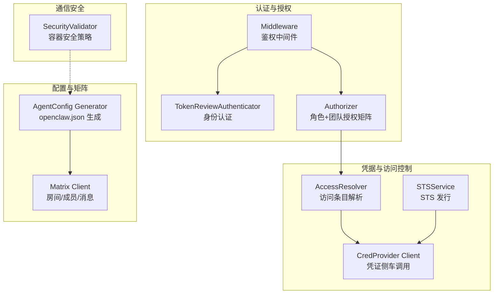
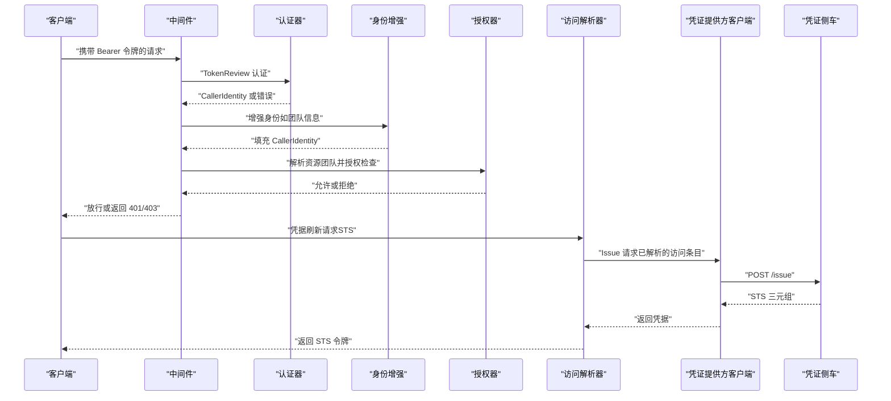
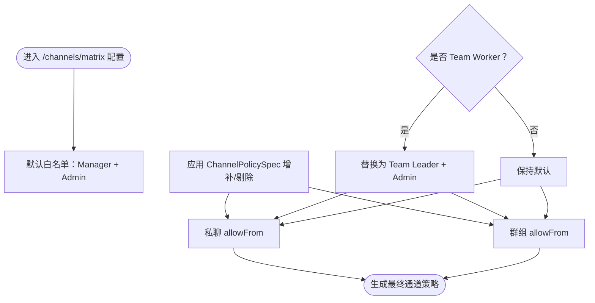
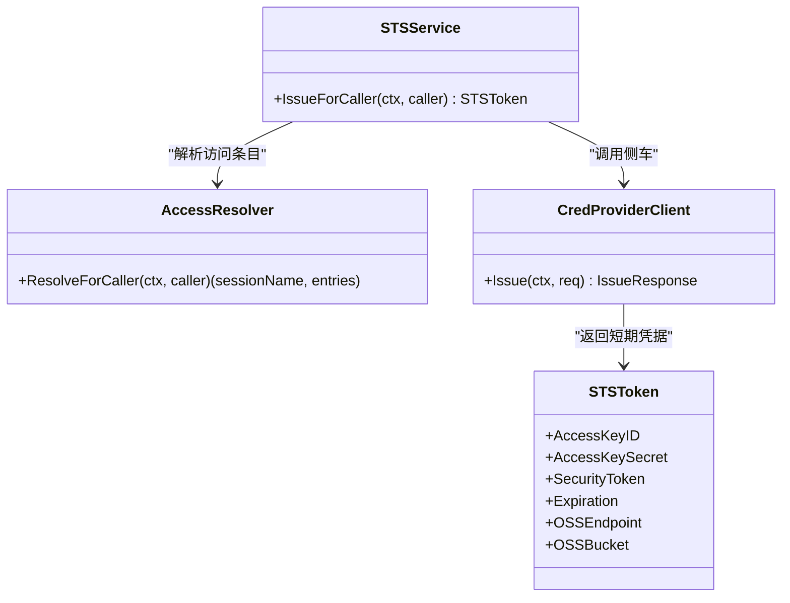
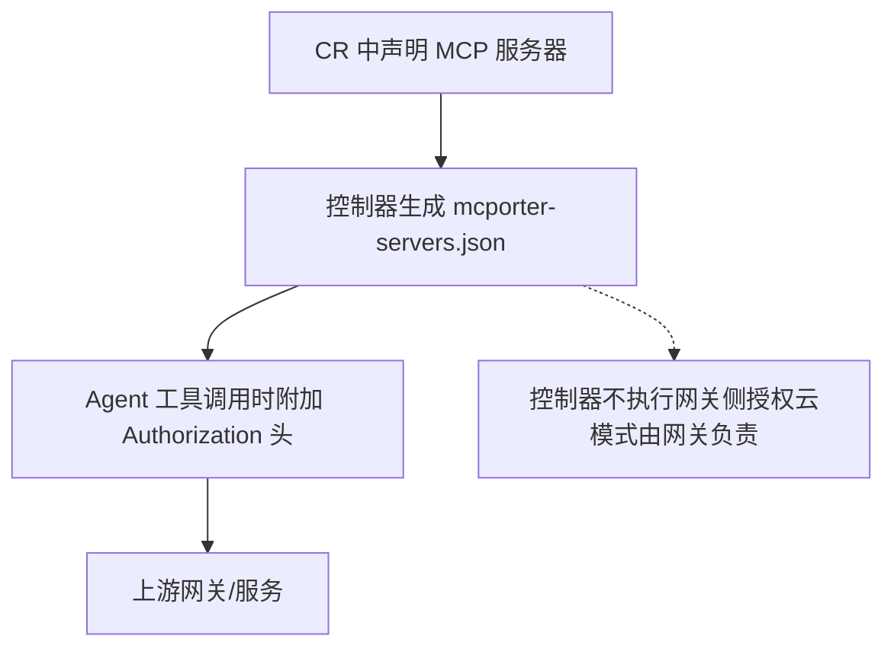
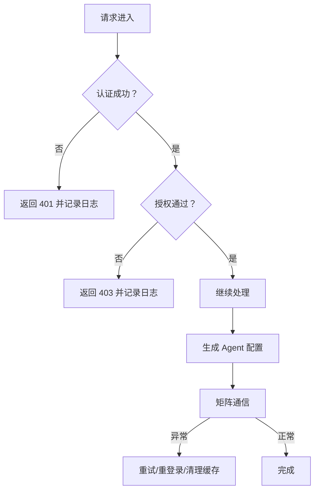
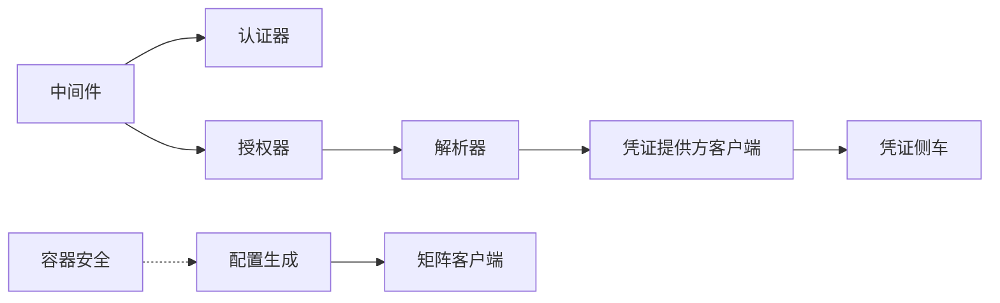

# 安全规则与合规要求

<cite>
**本文引用的文件**
- [hiclaw-controller/internal/auth/authenticator.go](file://hiclaw-controller/internal/auth/authenticator.go)
- [hiclaw-controller/internal/auth/authorizer.go](file://hiclaw-controller/internal/auth/authorizer.go)
- [hiclaw-controller/internal/auth/middleware.go](file://hiclaw-controller/internal/auth/middleware.go)
- [hiclaw-controller/internal/proxy/security.go](file://hiclaw-controller/internal/proxy/security.go)
- [hiclaw-controller/internal/credentials/sts.go](file://hiclaw-controller/internal/credentials/sts.go)
- [hiclaw-controller/internal/credprovider/client.go](file://hiclaw-controller/internal/credprovider/client.go)
- [hiclaw-controller/internal/credprovider/types.go](file://hiclaw-controller/internal/credprovider/types.go)
- [hiclaw-controller/internal/accessresolver/resolver.go](file://hiclaw-controller/internal/accessresolver/resolver.go)
- [hiclaw-controller/internal/server/credentials_handler.go](file://hiclaw-controller/internal/server/credentials_handler.go)
- [hiclaw-controller/internal/agentconfig/generator.go](file://hiclaw-controller/internal/agentconfig/generator.go)
- [hiclaw-controller/internal/agentconfig/types.go](file://hiclaw-controller/internal/agentconfig/types.go)
- [hiclaw-controller/internal/matrix/client.go](file://hiclaw-controller/internal/matrix/client.go)
- [hiclaw-controller/internal/oss/types.go](file://hiclaw-controller/internal/oss/types.go)
- [hiclaw-controller/api/v1beta1/types.go](file://hiclaw-controller/api/v1beta1/types.go)
</cite>

## 目录
1. [引言](#引言)
2. [项目结构](#项目结构)
3. [核心组件](#核心组件)
4. [架构总览](#架构总览)
5. [详细组件分析](#详细组件分析)
6. [依赖分析](#依赖分析)
7. [性能考虑](#性能考虑)
8. [故障排查指南](#故障排查指南)
9. [结论](#结论)
10. [附录](#附录)

## 引言
本文件面向 HiClaw Manager Agent 的安全规则与合规要求，系统化阐述通信安全、凭据管理、MCP 服务器访问控制与外部 API 凭据的集中存储策略，并给出安全事件处理流程、违规检测方法以及最佳实践与常见漏洞防护建议。目标是帮助运维与开发人员在保障功能可用的同时，满足最小权限、可审计、可追溯与可恢复的合规目标。

## 项目结构
围绕安全主题的关键模块分布如下：
- 认证与授权：基于 Kubernetes TokenReview 的身份认证、角色与团队授权矩阵、中间件链路。
- 凭据与访问控制：STS 服务、凭证提供方客户端、访问条目解析器与范围解析。
- 通信安全：容器运行时安全策略（镜像白名单、挂载限制、特权与网络模式等）。
- 矩阵通信：消息通道策略（群组/私聊白名单）、E2EE 开关、邀请与成员管理。
- 配置生成：Agent 运行时配置注入（网关令牌、模型 API 密钥、通道策略）。

图示来源
- [hiclaw-controller/internal/auth/authenticator.go:35-140](file://hiclaw-controller/internal/auth/authenticator.go#L35-L140)
- [hiclaw-controller/internal/auth/authorizer.go:31-155](file://hiclaw-controller/internal/auth/authorizer.go#L31-L155)
- [hiclaw-controller/internal/auth/middleware.go:31-169](file://hiclaw-controller/internal/auth/middleware.go#L31-L169)
- [hiclaw-controller/internal/credentials/sts.go:29-90](file://hiclaw-controller/internal/credentials/sts.go#L29-L90)
- [hiclaw-controller/internal/accessresolver/resolver.go:21-345](file://hiclaw-controller/internal/accessresolver/resolver.go#L21-L345)
- [hiclaw-controller/internal/credprovider/client.go:15-85](file://hiclaw-controller/internal/credprovider/client.go#L15-L85)
- [hiclaw-controller/internal/proxy/security.go:59-182](file://hiclaw-controller/internal/proxy/security.go#L59-L182)
- [hiclaw-controller/internal/agentconfig/generator.go:25-203](file://hiclaw-controller/internal/agentconfig/generator.go#L25-L203)
- [hiclaw-controller/internal/matrix/client.go:16-87](file://hiclaw-controller/internal/matrix/client.go#L16-L87)

章节来源
- [hiclaw-controller/internal/auth/authenticator.go:1-140](file://hiclaw-controller/internal/auth/authenticator.go#L1-L140)
- [hiclaw-controller/internal/auth/authorizer.go:1-155](file://hiclaw-controller/internal/auth/authorizer.go#L1-L155)
- [hiclaw-controller/internal/auth/middleware.go:1-169](file://hiclaw-controller/internal/auth/middleware.go#L1-L169)
- [hiclaw-controller/internal/proxy/security.go:1-182](file://hiclaw-controller/internal/proxy/security.go#L1-L182)
- [hiclaw-controller/internal/credentials/sts.go:1-90](file://hiclaw-controller/internal/credentials/sts.go#L1-L90)
- [hiclaw-controller/internal/credprovider/client.go:1-85](file://hiclaw-controller/internal/credprovider/client.go#L1-L85)
- [hiclaw-controller/internal/accessresolver/resolver.go:1-345](file://hiclaw-controller/internal/accessresolver/resolver.go#L1-L345)
- [hiclaw-controller/internal/server/credentials_handler.go:1-43](file://hiclaw-controller/internal/server/credentials_handler.go#L1-L43)
- [hiclaw-controller/internal/agentconfig/generator.go:1-493](file://hiclaw-controller/internal/agentconfig/generator.go#L1-L493)
- [hiclaw-controller/internal/matrix/client.go:1-724](file://hiclaw-controller/internal/matrix/client.go#L1-L724)
- [hiclaw-controller/internal/oss/types.go:1-53](file://hiclaw-controller/internal/oss/types.go#L1-L53)
- [hiclaw-controller/api/v1beta1/types.go:22-57](file://hiclaw-controller/api/v1beta1/types.go#L22-L57)

## 核心组件
- 身份认证与授权
  - 基于 Kubernetes TokenReview 的 Bearer 令牌认证，支持缓存与受众校验。
  - 角色与团队授权矩阵：admin/manager/team-leader/worker 四级角色，结合资源团队维度进行细粒度授权。
  - 中间件链：统一提取令牌、认证、增强身份、解析资源团队、执行授权检查。
- 凭据与访问控制
  - STS 服务：根据调用者身份解析访问条目，向凭证侧车请求短期凭据。
  - 访问条目解析器：将 CR 层模板变量与逻辑引用解析为侧车可理解的完全展开形式。
  - 凭证提供方客户端：通过本地回环 HTTP 调用凭证侧车，返回 STS 三元组。
- 通信安全
  - 容器运行时安全策略：镜像来源白名单、禁止绑定挂载、禁止特权与主机网络/进程命名空间、禁止危险能力。
- 配置与矩阵
  - Agent 配置生成：注入网关令牌、模型 API 密钥、通道策略（群组/私聊白名单、E2EE）。
  - 矩阵客户端：房间创建/别名解析/加入/离开/消息发送/成员管理，支持管理员命令与自动重试。

章节来源
- [hiclaw-controller/internal/auth/authenticator.go:35-140](file://hiclaw-controller/internal/auth/authenticator.go#L35-L140)
- [hiclaw-controller/internal/auth/authorizer.go:31-155](file://hiclaw-controller/internal/auth/authorizer.go#L31-L155)
- [hiclaw-controller/internal/auth/middleware.go:31-169](file://hiclaw-controller/internal/auth/middleware.go#L31-L169)
- [hiclaw-controller/internal/credentials/sts.go:29-90](file://hiclaw-controller/internal/credentials/sts.go#L29-L90)
- [hiclaw-controller/internal/accessresolver/resolver.go:48-174](file://hiclaw-controller/internal/accessresolver/resolver.go#L48-L174)
- [hiclaw-controller/internal/credprovider/client.go:15-85](file://hiclaw-controller/internal/credprovider/client.go#L15-L85)
- [hiclaw-controller/internal/proxy/security.go:59-182](file://hiclaw-controller/internal/proxy/security.go#L59-L182)
- [hiclaw-controller/internal/agentconfig/generator.go:25-203](file://hiclaw-controller/internal/agentconfig/generator.go#L25-L203)
- [hiclaw-controller/internal/matrix/client.go:16-87](file://hiclaw-controller/internal/matrix/client.go#L16-L87)

## 架构总览
下图展示从请求进入、身份认证与授权、到凭据发放与访问控制的整体流程。

图示来源
- [hiclaw-controller/internal/auth/middleware.go:51-118](file://hiclaw-controller/internal/auth/middleware.go#L51-L118)
- [hiclaw-controller/internal/auth/authenticator.go:78-112](file://hiclaw-controller/internal/auth/authenticator.go#L78-L112)
- [hiclaw-controller/internal/auth/authorizer.go:38-58](file://hiclaw-controller/internal/auth/authorizer.go#L38-L58)
- [hiclaw-controller/internal/accessresolver/resolver.go:48-78](file://hiclaw-controller/internal/accessresolver/resolver.go#L48-L78)
- [hiclaw-controller/internal/credprovider/client.go:43-84](file://hiclaw-controller/internal/credprovider/client.go#L43-L84)
- [hiclaw-controller/internal/server/credentials_handler.go:21-42](file://hiclaw-controller/internal/server/credentials_handler.go#L21-L42)

## 详细组件分析

### 通信安全规则（房间访问控制、DM 白名单管理、授权级别）
- 授权级别与资源范围
  - 角色：admin、manager、team-leader、worker；admin/manager 拥有全量访问；team-leader 仅限同团队资源；worker 仅限自身资源。
  - 资源种类：worker、team、human、manager、gateway、status、credentials 等。
- 房间与 DM 白名单
  - 默认允许：Manager 与 Admin。
  - Team 场景：Team Leader 与 Admin。
  - 可通过 ChannelPolicySpec 对群组/私聊白名单进行增补与剔除，实现精细化访问控制。
- E2EE 与消息流
  - 支持启用端到端加密；消息流策略与网络策略在配置中明确，确保对内网地址访问与流式预览的安全性。

图示来源
- [hiclaw-controller/internal/agentconfig/generator.go:205-345](file://hiclaw-controller/internal/agentconfig/generator.go#L205-L345)
- [hiclaw-controller/api/v1beta1/types.go:120-128](file://hiclaw-controller/api/v1beta1/types.go#L120-L128)

章节来源
- [hiclaw-controller/internal/auth/authorizer.go:38-155](file://hiclaw-controller/internal/auth/authorizer.go#L38-L155)
- [hiclaw-controller/internal/agentconfig/generator.go:205-345](file://hiclaw-controller/internal/agentconfig/generator.go#L205-L345)
- [hiclaw-controller/api/v1beta1/types.go:120-128](file://hiclaw-controller/api/v1beta1/types.go#L120-L128)
- [hiclaw-controller/internal/matrix/client.go:254-332](file://hiclaw-controller/internal/matrix/client.go#L254-L332)

### 凭据安全管理（API 密钥保护、加密传输、凭据隔离）
- STS 三元组与短期凭据
  - STSService 基于调用者身份解析 AccessEntries，委托 credprovider.Issue 获取短期凭据，避免长期密钥暴露。
  - 返回字段包含访问密钥、安全令牌与过期时间，同时附带对象存储端点与桶信息。
- 凭证提供方与传输
  - 凭证提供方客户端通过本地回环 HTTP 调用，超时与错误处理明确；非 2xx 状态码视为失败。
  - 凭证来源与 OSS 端点解耦，端点为部署时静态配置，凭据为短期令牌，降低泄露面。
- 凭据隔离与最小权限
  - 解析器将 CR 层模板变量与逻辑引用展开为具体作用域（OSS 桶/前缀、AI 网关资源），确保凭据仅授予必要范围。
  - PolicyRequest 结构用于生成针对 Worker/Team/Manager 的最小权限策略。

图示来源
- [hiclaw-controller/internal/credentials/sts.go:29-90](file://hiclaw-controller/internal/credentials/sts.go#L29-L90)
- [hiclaw-controller/internal/accessresolver/resolver.go:48-174](file://hiclaw-controller/internal/accessresolver/resolver.go#L48-L174)
- [hiclaw-controller/internal/credprovider/client.go:15-85](file://hiclaw-controller/internal/credprovider/client.go#L15-L85)
- [hiclaw-controller/internal/credprovider/types.go:20-75](file://hiclaw-controller/internal/credprovider/types.go#L20-L75)

章节来源
- [hiclaw-controller/internal/credentials/sts.go:29-90](file://hiclaw-controller/internal/credentials/sts.go#L29-L90)
- [hiclaw-controller/internal/credprovider/client.go:15-85](file://hiclaw-controller/internal/credprovider/client.go#L15-L85)
- [hiclaw-controller/internal/credprovider/types.go:20-75](file://hiclaw-controller/internal/credprovider/types.go#L20-L75)
- [hiclaw-controller/internal/accessresolver/resolver.go:195-307](file://hiclaw-controller/internal/accessresolver/resolver.go#L195-L307)
- [hiclaw-controller/internal/oss/types.go:16-53](file://hiclaw-controller/internal/oss/types.go#L16-L53)

### MCP 服务器访问控制与外部 API 凭据的中央存储策略
- MCP 服务器声明
  - CRD 支持声明多个 MCP 服务器，控制器将其直接写入 mcporter-servers.json，并在工具调用时注入 Authorization: Bearer 头。
  - 控制器不执行网关侧授权，上游授权由网关操作方负责；本地 Higress 部署由 Manager 技能层处理。
- 外部 API 凭据的集中存储
  - 凭据通过 STS 服务集中发放，避免在 Agent 配置中直接嵌入长期密钥。
  - 网关令牌（GatewayKey）作为共享密钥注入到 openclaw.json 的网关与模型 API 配置中，确保一致且稳定的访问边界。

图示来源
- [hiclaw-controller/api/v1beta1/types.go:42-57](file://hiclaw-controller/api/v1beta1/types.go#L42-L57)
- [hiclaw-controller/internal/agentconfig/generator.go:103-133](file://hiclaw-controller/internal/agentconfig/generator.go#L103-L133)

章节来源
- [hiclaw-controller/api/v1beta1/types.go:42-57](file://hiclaw-controller/api/v1beta1/types.go#L42-L57)
- [hiclaw-controller/internal/agentconfig/generator.go:103-133](file://hiclaw-controller/internal/agentconfig/generator.go#L103-L133)

### 安全事件处理流程与违规检测方法
- 认证失败与授权拒绝
  - 中间件在认证失败时返回 401，在授权失败时返回 403；日志记录失败原因便于审计。
- 容器运行时违规
  - 安全验证器拒绝不符合策略的容器创建请求（名称前缀、镜像来源、挂载、特权、网络/PID 模式、危险能力）。
- 凭证侧车异常
  - 凭证提供方客户端对非 2xx 响应与不完整凭据进行错误处理，防止空凭据下发。
- 矩阵通信异常
  - 管理员令牌失效会触发缓存清除与重登录；对用户不存在或状态异常提供重试与恢复路径。

图示来源
- [hiclaw-controller/internal/auth/middleware.go:51-118](file://hiclaw-controller/internal/auth/middleware.go#L51-L118)
- [hiclaw-controller/internal/proxy/security.go:107-159](file://hiclaw-controller/internal/proxy/security.go#L107-L159)
- [hiclaw-controller/internal/credprovider/client.go:43-84](file://hiclaw-controller/internal/credprovider/client.go#L43-L84)
- [hiclaw-controller/internal/matrix/client.go:678-682](file://hiclaw-controller/internal/matrix/client.go#L678-L682)

章节来源
- [hiclaw-controller/internal/auth/middleware.go:51-118](file://hiclaw-controller/internal/auth/middleware.go#L51-L118)
- [hiclaw-controller/internal/proxy/security.go:107-159](file://hiclaw-controller/internal/proxy/security.go#L107-L159)
- [hiclaw-controller/internal/credprovider/client.go:43-84](file://hiclaw-controller/internal/credprovider/client.go#L43-L84)
- [hiclaw-controller/internal/matrix/client.go:678-682](file://hiclaw-controller/internal/matrix/client.go#L678-L682)

## 依赖分析
- 组件耦合与职责
  - 中间件依赖认证器与授权器；授权器依赖资源团队解析；STSService 依赖解析器与凭证提供方客户端。
  - 容器安全策略独立于业务逻辑，仅依赖环境变量与镜像规则。
  - Agent 配置生成依赖矩阵域名、网关 URL、模型参数与通道策略。
- 外部依赖
  - Kubernetes TokenReview API 用于身份认证。
  - 凭证侧车通过本地回环 HTTP 提供短期凭据。
  - 矩阵 Homeserver 通过标准 CS API 进行房间与成员管理。

图示来源
- [hiclaw-controller/internal/auth/middleware.go:31-49](file://hiclaw-controller/internal/auth/middleware.go#L31-L49)
- [hiclaw-controller/internal/auth/authorizer.go:31-58](file://hiclaw-controller/internal/auth/authorizer.go#L31-L58)
- [hiclaw-controller/internal/accessresolver/resolver.go:21-46](file://hiclaw-controller/internal/accessresolver/resolver.go#L21-L46)
- [hiclaw-controller/internal/credprovider/client.go:15-41](file://hiclaw-controller/internal/credprovider/client.go#L15-L41)
- [hiclaw-controller/internal/agentconfig/generator.go:25-50](file://hiclaw-controller/internal/agentconfig/generator.go#L25-L50)
- [hiclaw-controller/internal/matrix/client.go:16-30](file://hiclaw-controller/internal/matrix/client.go#L16-L30)
- [hiclaw-controller/internal/proxy/security.go:59-105](file://hiclaw-controller/internal/proxy/security.go#L59-L105)

章节来源
- [hiclaw-controller/internal/auth/middleware.go:31-49](file://hiclaw-controller/internal/auth/middleware.go#L31-L49)
- [hiclaw-controller/internal/auth/authorizer.go:31-58](file://hiclaw-controller/internal/auth/authorizer.go#L31-L58)
- [hiclaw-controller/internal/accessresolver/resolver.go:21-46](file://hiclaw-controller/internal/accessresolver/resolver.go#L21-L46)
- [hiclaw-controller/internal/credprovider/client.go:15-41](file://hiclaw-controller/internal/credprovider/client.go#L15-L41)
- [hiclaw-controller/internal/agentconfig/generator.go:25-50](file://hiclaw-controller/internal/agentconfig/generator.go#L25-L50)
- [hiclaw-controller/internal/matrix/client.go:16-30](file://hiclaw-controller/internal/matrix/client.go#L16-L30)
- [hiclaw-controller/internal/proxy/security.go:59-105](file://hiclaw-controller/internal/proxy/security.go#L59-L105)

## 性能考虑
- 认证缓存
  - TokenReviewAuthenticator 使用内存缓存与 TTL，减少重复认证调用；注意缓存未清理的潜在风险，建议在服务主体删除后主动失效缓存。
- 授权检查
  - 授权器采用简单分支判断，开销极低；资源团队解析仅在需要时查询 K8s API。
- 凭据发放
  - STS 服务在解析与调用侧车之间存在少量 CPU 开销；建议在高并发场景下评估侧车吞吐与超时设置。
- 容器安全验证
  - 安全验证器为纯内存计算，对容器启动延迟影响微小；镜像来源匹配与路径解析为 O(n) 检查。
- 配置生成
  - 配置生成器为纯内存 JSON 序列化，按需应用策略；通道策略合并为线性扫描，复杂度与策略长度成正比。

## 故障排查指南
- 认证失败
  - 检查 Bearer 令牌格式与受众；查看中间件日志中的认证错误；确认 TokenReview API 可达。
- 授权拒绝
  - 核对调用者角色与资源团队；确认资源名称与团队匹配；检查授权矩阵分支。
- STS 无法发放
  - 确认 STSService 已配置；检查解析器返回的访问条目是否为空；查看凭证提供方客户端返回的非 2xx 错误。
- 容器启动被拒
  - 检查镜像来源是否在白名单；确认未使用 bind 挂载/特权/主机网络/危险能力；核对容器名称前缀。
- 矩阵通信异常
  - 关注管理员令牌失效导致的缓存清除与重登录；检查房间别名冲突与成员状态；确认 E2EE 与网络策略配置。

章节来源
- [hiclaw-controller/internal/auth/middleware.go:137-169](file://hiclaw-controller/internal/auth/middleware.go#L137-L169)
- [hiclaw-controller/internal/credprovider/client.go:43-84](file://hiclaw-controller/internal/credprovider/client.go#L43-L84)
- [hiclaw-controller/internal/proxy/security.go:107-159](file://hiclaw-controller/internal/proxy/security.go#L107-L159)
- [hiclaw-controller/internal/matrix/client.go:678-682](file://hiclaw-controller/internal/matrix/client.go#L678-L682)

## 结论
HiClaw Manager Agent 的安全体系以“最小权限、集中凭据、严格授权、可审计”为核心原则：通过 Kubernetes TokenReview 实现可信身份，结合角色与团队授权矩阵实现细粒度访问控制；通过 STS 与凭证侧车集中发放短期凭据，避免长期密钥泄露；容器安全策略与矩阵通信白名单进一步降低运行时与数据面风险。建议在生产环境中启用 E2EE、严格镜像白名单、定期轮换凭据与令牌，并完善日志与告警以支撑持续监控与合规审计。

## 附录
- 最佳实践
  - 仅授予必要的 OSS 桶与前缀范围；为不同角色与场景定义清晰的 AccessEntries。
  - 使用 ChannelPolicySpec 精细化控制群组与 DM 白名单，避免过度开放。
  - 启用容器安全策略并定期审查镜像来源与运行参数。
  - 将网关令牌与模型 API 密钥通过 STS 注入，避免硬编码。
- 常见漏洞与防护
  - 绑定挂载与特权容器：严格禁止；使用只读卷与受限能力。
  - 令牌泄露：短期凭据与最小权限；定期轮换；审计日志。
  - 越权访问：严格的授权矩阵与资源团队解析；RBAC 与策略联动。
  - 中间人攻击：仅通过受信网关与受控端点访问外部服务；TLS 与证书校验。