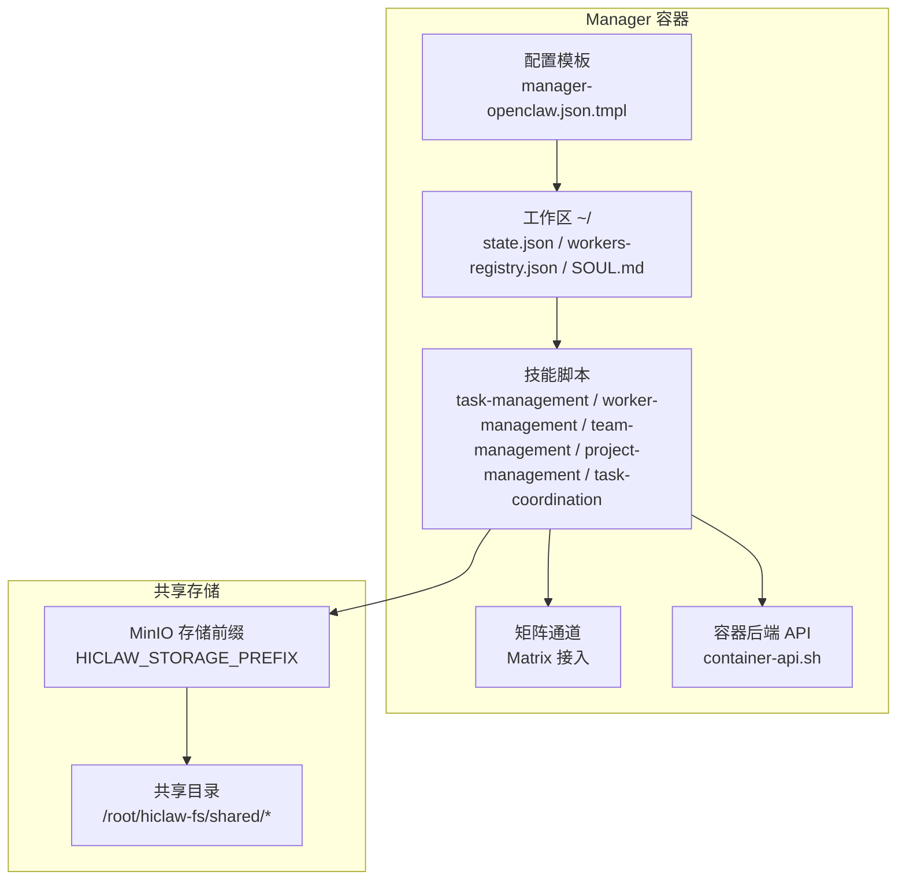
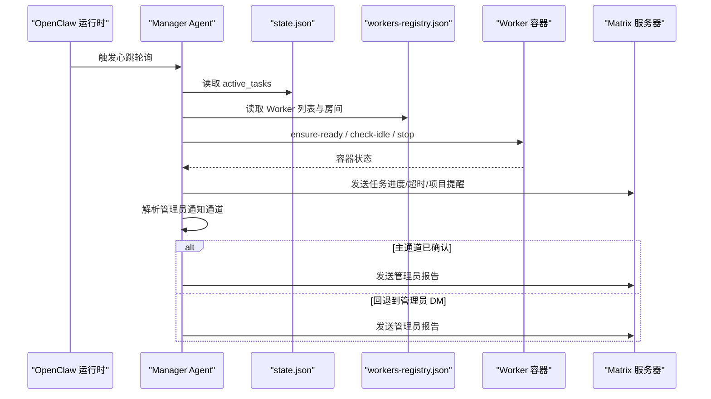
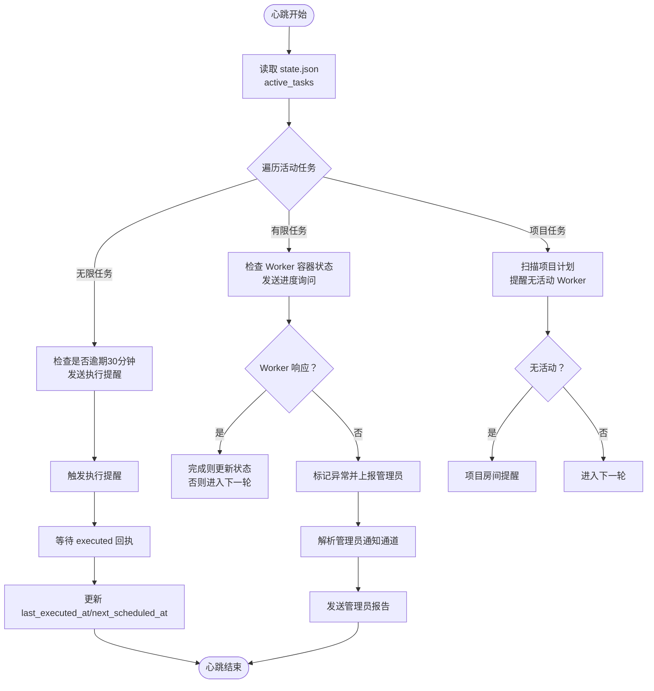
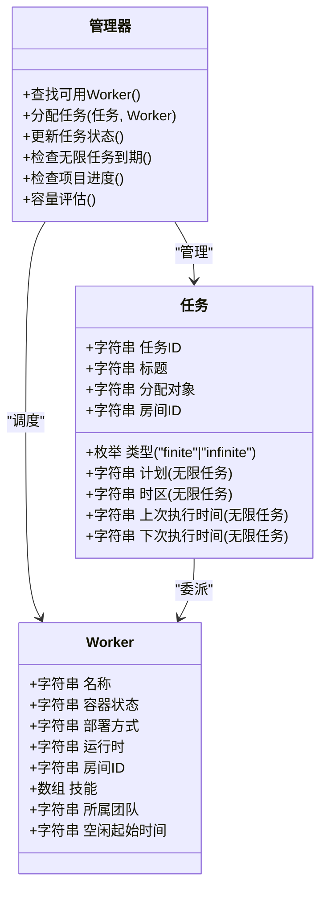
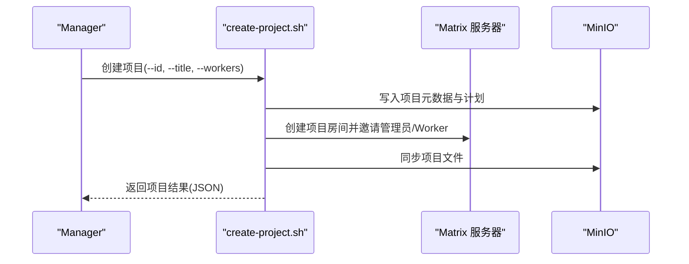
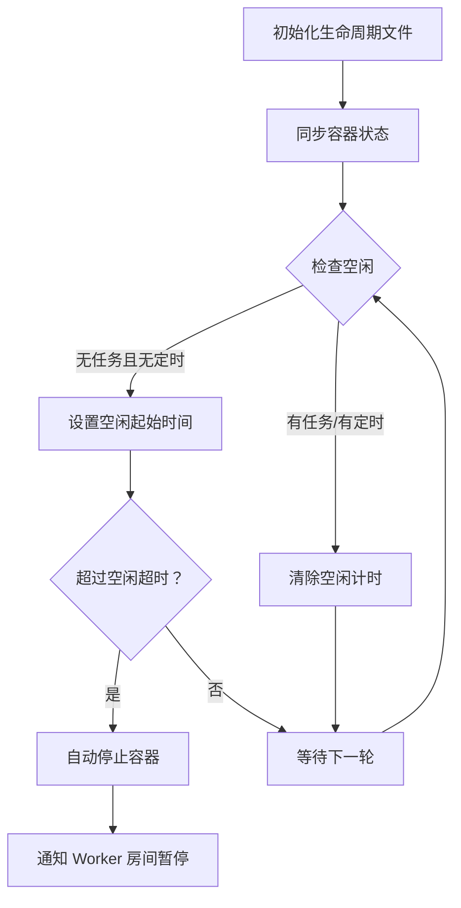
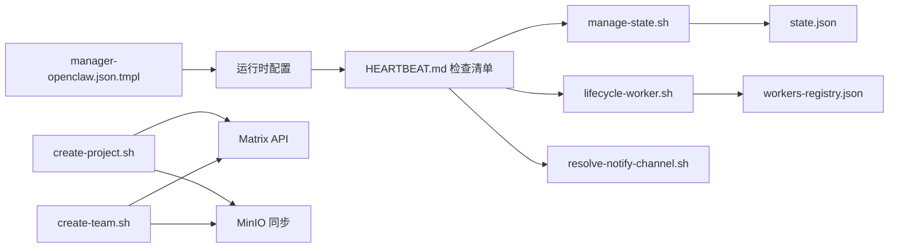

# 行为模式与工作流程

<cite>
**本文引用的文件**
- [HEARTBEAT.md](file://manager/agent/HEARTBEAT.md)
- [AGENTS.md](file://manager/agent/AGENTS.md)
- [SOUL.md](file://manager/agent/SOUL.md)
- [manager-openclaw.json.tmpl](file://manager/configs/manager-openclaw.json.tmpl)
- [state.json](file://manager/agent/state.json)
- [workers-registry.json](file://manager/agent/workers-registry.json)
- [manage-state.sh](file://manager/agent/skills/task-management/scripts/manage-state.sh)
- [lifecycle-worker.sh](file://manager/agent/skills/worker-management/scripts/lifecycle-worker.sh)
- [resolve-notify-channel.sh](file://manager/agent/skills/task-management/scripts/resolve-notify-channel.sh)
- [create-project.sh](file://manager/agent/skills/project-management/scripts/create-project.sh)
- [create-team.sh](file://manager/agent/skills/team-management/scripts/create-team.sh)
- [find-worker.sh](file://manager/agent/skills/task-management/scripts/find-worker.sh)
- [check-processing-marker.sh](file://manager/agent/skills/task-coordination/scripts/check-processing-marker.sh)
</cite>

## 目录
1. [引言](#引言)
2. [项目结构](#项目结构)
3. [核心组件](#核心组件)
4. [架构总览](#架构总览)
5. [详细组件分析](#详细组件分析)
6. [依赖关系分析](#依赖关系分析)
7. [性能考量](#性能考量)
8. [故障排查指南](#故障排查指南)
9. [结论](#结论)
10. [附录](#附录)

## 引言
本文件面向 HiClaw Manager Agent 的行为模式与工作流程，系统化阐述心跳机制与定期检查流程的设计原理（健康检查频率、异常检测与自动恢复策略），并深入解析技能定义与任务工作流程配置（任务分解、优先级排序与资源分配算法）。同时给出 Manager Agent 的日常操作模式与决策流程、行为模式自定义方法、性能优化建议，以及行为验证、调试技巧与常见配置问题的解决方案。

## 项目结构
Manager Agent 的行为由“配置模板 + 本地状态 + 技能脚本 + 矩阵通道 + 容器生命周期管理”共同构成。其核心工作空间位于 Manager 容器内的 ~/，共享数据通过 MinIO 同步；心跳与日常检查通过 OpenClaw 运行时触发，使用 Matrix 作为主要通信渠道。

图示来源
- [manager-openclaw.json.tmpl](file://manager/configs/manager-openclaw.json.tmpl)
- [HEARTBEAT.md](file://manager/agent/HEARTBEAT.md)
- [AGENTS.md](file://manager/agent/AGENTS.md)

章节来源
- [manager-openclaw.json.tmpl](file://manager/configs/manager-openclaw.json.tmpl)
- [AGENTS.md](file://manager/agent/AGENTS.md)

## 核心组件
- 心跳与检查清单：基于 ~/HEARTBEAT.md 的周期性检查，覆盖有限任务状态、无限任务超时、项目进度、容量评估、Worker 容器生命周期管理与管理员报告。
- 本地状态与注册表：state.json 记录活动任务；workers-registry.json 记录 Worker 注册信息；二者用于决策与消息路由。
- 技能脚本：task-management 提供任务状态原子更新；worker-management 提供 Worker 生命周期管理；team-management/project-management 提供团队/项目创建；task-coordination 提供处理标记检查。
- 配置模板：manager-openclaw.json.tmpl 定义模型、通道、工具、会话与心跳提示词等。
- 通知通道解析：resolve-notify-channel.sh 将管理员通知路由到首选渠道或管理员 DM。

章节来源
- [HEARTBEAT.md](file://manager/agent/HEARTBEAT.md)
- [state.json](file://manager/agent/state.json)
- [workers-registry.json](file://manager/agent/workers-registry.json)
- [manager-openclaw.json.tmpl](file://manager/configs/manager-openclaw.json.tmpl)
- [resolve-notify-channel.sh](file://manager/agent/skills/task-management/scripts/resolve-notify-channel.sh)

## 架构总览
Manager Agent 的行为遵循“配置驱动 + 脚本化技能 + 状态机 + 通道通知”的模式。心跳触发后，Agent 读取本地状态与注册表，调用容器 API 检查 Worker 容器状态，按类型检查任务执行情况，并在必要时发送消息至 Matrix 房间或管理员通道。管理员通知通道优先使用已确认的主通道，否则回退到管理员 DM。

图示来源
- [HEARTBEAT.md](file://manager/agent/HEARTBEAT.md)
- [lifecycle-worker.sh](file://manager/agent/skills/worker-management/scripts/lifecycle-worker.sh)
- [resolve-notify-channel.sh](file://manager/agent/skills/task-management/scripts/resolve-notify-channel.sh)

## 详细组件分析

### 心跳机制与定期检查流程
- 健康检查频率：心跳由配置模板中的 heartbeat.every 控制（默认每小时一次），提示词定义了检查范围与输出要求。
- 异常检测：
  - 有限任务：若 Worker 在心跳周期内无响应，标记异常；若 Worker 报告完成但 meta.json 未更新，则主动更新状态并移除活动任务。
  - 无限任务：当“尚未执行且已逾期30分钟”时触发执行提醒；收到“executed”回执后再更新 last_executed_at 与 next_scheduled_at。
  - 项目进度：扫描项目计划中处于进行中的任务，若 Worker 在心跳周期内无活动则提醒。
  - Worker 容器：若容器停止/缺失，尝试启动/重建；若长时间空闲则自动暂停。
- 自动恢复策略：
  - ensure-ready：容器停止/缺失时自动启动或重建；根据返回状态等待初始化时间（启动30秒、重建60秒）。
  - check-idle：超过空闲超时自动停止 Worker 容器，并在 Worker 房间通知其被暂停。
  - 管理员报告：汇总所有异常与待办，按管理员偏好语言与语气生成报告并通过已解析通道发送。

图示来源
- [HEARTBEAT.md](file://manager/agent/HEARTBEAT.md)
- [manage-state.sh](file://manager/agent/skills/task-management/scripts/manage-state.sh)
- [lifecycle-worker.sh](file://manager/agent/skills/worker-management/scripts/lifecycle-worker.sh)
- [resolve-notify-channel.sh](file://manager/agent/skills/task-management/scripts/resolve-notify-channel.sh)

章节来源
- [HEARTBEAT.md](file://manager/agent/HEARTBEAT.md)
- [manager-openclaw.json.tmpl](file://manager/configs/manager-openclaw.json.tmpl)

### 技能定义与任务工作流程配置
- 任务类型与状态：
  - 有限任务：有明确截止与完成条件，需持续跟踪 Worker 响应与状态更新。
  - 无限任务：按计划周期执行，仅在到期时提醒，收到回执后更新下次执行时间。
- 任务分解与委派：
  - 复杂任务可委派给团队领导，Manager 与团队领导直接沟通，避免对团队成员的直接打扰。
- 优先级排序与资源分配：
  - find-worker.sh 综合 Worker 技能、运行时、部署方式、容器状态与当前负载，输出可用 Worker 列表与摘要，辅助 Manager 决策。
  - 容量评估：统计有限任务数量与空闲 Worker 数量，决定是否需要创建新 Worker 或重新分配任务。
- 资源分配算法：
  - 优先选择“空闲且容器运行”的 Worker；
  - 若 Worker 已有有限任务则视为忙碌；
  - 对于远程 Worker，假设其可用；
  - 对于停止/退出/缺失的 Worker，先 ensure-ready 再分配。

图示来源
- [find-worker.sh](file://manager/agent/skills/task-management/scripts/find-worker.sh)
- [state.json](file://manager/agent/state.json)
- [workers-registry.json](file://manager/agent/workers-registry.json)

章节来源
- [find-worker.sh](file://manager/agent/skills/task-management/scripts/find-worker.sh)
- [state.json](file://manager/agent/state.json)
- [workers-registry.json](file://manager/agent/workers-registry.json)

### 项目与团队协作工作流
- 项目创建：create-project.sh 创建项目目录、生成 meta.json 与 plan.md，创建 Matrix 项目房间并邀请管理员与 Worker，同步到 MinIO 并更新 Manager 配置以允许 Worker 加入。
- 团队创建：create-team.sh 创建团队房间、Leader DM、Leader 与 Worker 房间，设置权限与功率等级，初始化团队存储空间，更新 teams-registry.json，并回注 Leader 的团队上下文（含 Worker 房间 ID）。

图示来源
- [create-project.sh](file://manager/agent/skills/project-management/scripts/create-project.sh)

章节来源
- [create-project.sh](file://manager/agent/skills/project-management/scripts/create-project.sh)
- [create-team.sh](file://manager/agent/skills/team-management/scripts/create-team.sh)

### 容器生命周期管理与自动恢复
- 状态同步：action_sync_status 从容器后端读取 Worker 容器状态并写入本地生命周期文件。
- 空闲检测：action_check-idle 根据空闲超时阈值自动停止空闲 Worker，并在 Worker 房间通知暂停。
- 启停与重建：action_start/action_stop 支持启动/停止；action_ensure_ready 在停止/缺失状态下尝试启动或重建，并返回状态码以便上层流程等待初始化。
- 安全保护：新建 Worker 的短暂运行期不计入空闲；团队 Worker 不参与空闲停止；有启用的定时任务的 Worker 不空闲停止。

图示来源
- [lifecycle-worker.sh](file://manager/agent/skills/worker-management/scripts/lifecycle-worker.sh)

章节来源
- [lifecycle-worker.sh](file://manager/agent/skills/worker-management/scripts/lifecycle-worker.sh)

### 通知通道与管理员报告
- 通道解析：resolve-notify-channel.sh 优先使用已确认的主通道；若不可用则回退到管理员 DM；若均不可用则输出错误信息。
- 报告生成：依据 SOUL.md 中的身份、个性与语言偏好生成管理员报告，确保在已解析通道中发送，避免散落回复。

章节来源
- [resolve-notify-channel.sh](file://manager/agent/skills/task-management/scripts/resolve-notify-channel.sh)
- [SOUL.md](file://manager/agent/SOUL.md)

### 任务协调与处理标记
- 处理标记：check-processing-marker.sh 用于检测任务目录的处理标记，若存在有效标记则阻止并发修改；过期则清理并放行。
- 与任务管理配合：在任务执行前通过标记避免重复处理，在执行完成后由任务管理脚本更新状态。

章节来源
- [check-processing-marker.sh](file://manager/agent/skills/task-coordination/scripts/check-processing-marker.sh)
- [manage-state.sh](file://manager/agent/skills/task-management/scripts/manage-state.sh)

## 依赖关系分析
- 配置模板依赖环境变量（如模型、矩阵域名、网关密钥等）生成运行时配置。
- 心跳脚本依赖本地状态与注册表，调用 Worker 生命周期脚本与通知解析脚本。
- 项目/团队创建脚本依赖 Matrix API 与 MinIO 同步能力。
- 任务管理脚本依赖处理标记与状态文件原子更新。

图示来源
- [manager-openclaw.json.tmpl](file://manager/configs/manager-openclaw.json.tmpl)
- [HEARTBEAT.md](file://manager/agent/HEARTBEAT.md)
- [manage-state.sh](file://manager/agent/skills/task-management/scripts/manage-state.sh)
- [lifecycle-worker.sh](file://manager/agent/skills/worker-management/scripts/lifecycle-worker.sh)
- [resolve-notify-channel.sh](file://manager/agent/skills/task-management/scripts/resolve-notify-channel.sh)
- [create-project.sh](file://manager/agent/skills/project-management/scripts/create-project.sh)
- [create-team.sh](file://manager/agent/skills/team-management/scripts/create-team.sh)

章节来源
- [manager-openclaw.json.tmpl](file://manager/configs/manager-openclaw.json.tmpl)
- [HEARTBEAT.md](file://manager/agent/HEARTBEAT.md)

## 性能考量
- 心跳频率：默认每小时一次，适合大多数场景；对于高并发或高敏感度任务，可通过配置模板调整 heartbeat.every 以平衡及时性与资源消耗。
- 并发控制：使用处理标记避免任务目录并发写入；任务状态更新采用原子写法（临时文件+覆盖），减少竞态风险。
- 容器生命周期：合理设置空闲超时，既能节省资源又能避免频繁启停带来的延迟。
- 通知与存储：批量检查与消息发送时尽量合并，减少 Matrix API 调用次数；MinIO 同步使用镜像命令，注意网络带宽与并发限制。

## 故障排查指南
- 心跳无响应：
  - 检查 Worker 容器状态：使用 ensure-ready 确认容器运行或重建；若返回 failed，联系管理员介入。
  - 检查 Worker 是否在心跳周期内未响应：有限任务默认 30 分钟超时，无限任务按计划到期触发。
- 无限任务未执行：
  - 确认 next_scheduled_at 是否已到期；收到 executed 回执后才会更新时间。
- 项目进度停滞：
  - 检查项目计划中进行中的任务是否在项目房间内得到 Worker 的状态更新。
- 容器自动停止：
  - 确认空闲超时设置是否合理；团队 Worker 与有定时任务的 Worker 不会被自动停止。
- 通知通道无效：
  - 使用 resolve-notify-channel.sh 检查主通道与管理员 DM；若均不可用，先按心跳步骤 1 发现管理员 DM 并重试。
- 调试技巧：
  - 使用 find-worker.sh 获取 Worker 可用性与负载视图，辅助决策。
  - 使用 manage-state.sh 的 list 功能查看当前活动任务与更新时间。
  - 使用 lifecycle-worker.sh 的同步与空闲检查功能定位容器状态问题。

章节来源
- [HEARTBEAT.md](file://manager/agent/HEARTBEAT.md)
- [lifecycle-worker.sh](file://manager/agent/skills/worker-management/scripts/lifecycle-worker.sh)
- [resolve-notify-channel.sh](file://manager/agent/skills/task-management/scripts/resolve-notify-channel.sh)
- [find-worker.sh](file://manager/agent/skills/task-management/scripts/find-worker.sh)
- [manage-state.sh](file://manager/agent/skills/task-management/scripts/manage-state.sh)

## 结论
Manager Agent 的行为模式围绕“配置驱动的心跳检查 + 原子状态管理 + 容器生命周期自动化 + 多通道通知”展开。通过有限/无限任务的差异化处理、团队委派与资源分配策略、以及完善的异常检测与自动恢复机制，实现了稳定高效的多 Worker 协作与项目管理。结合本文提供的自定义方法、性能优化建议与故障排查路径，可进一步提升系统的可靠性与可维护性。

## 附录
- 行为模式自定义：
  - 修改 manager-openclaw.json.tmpl 中的 heartbeat.every 与提示词，以适配不同业务节奏。
  - 在 SOUL.md 中设定身份、个性与语言偏好，确保管理员报告风格一致。
  - 通过 skills 目录下的 SKILL.md 了解各技能的使用场景与参数，按需扩展或调整。
- 常见配置问题：
  - 管理员 DM 未发现：按心跳步骤 1 发现并保存 admin_dm_room_id，再重试通知解析。
  - Worker 技能不匹配：使用 find-worker.sh 的 --skills 参数过滤，或更新 Worker 的技能列表。
  - 容器后端不可用：确保 container-api.sh 可用，或远程 Worker 需手动重启。