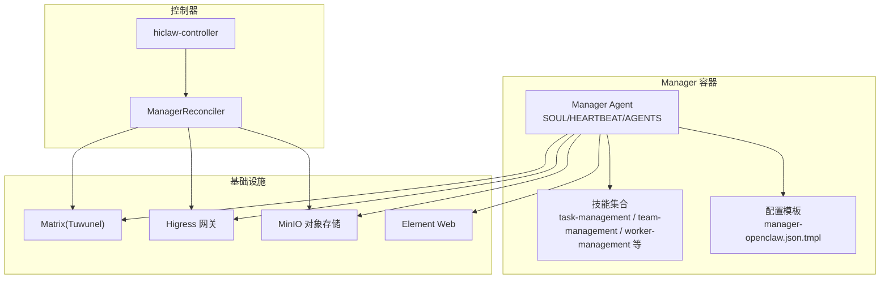
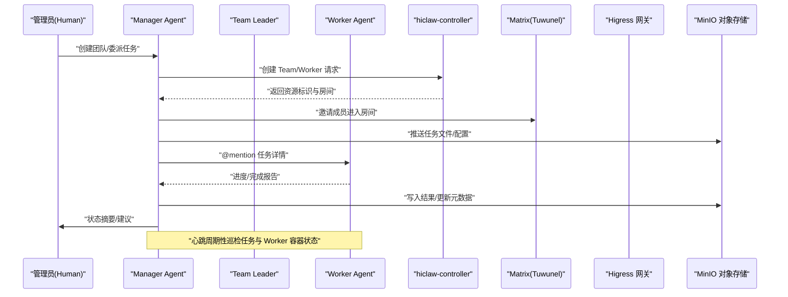
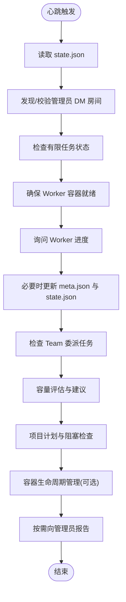
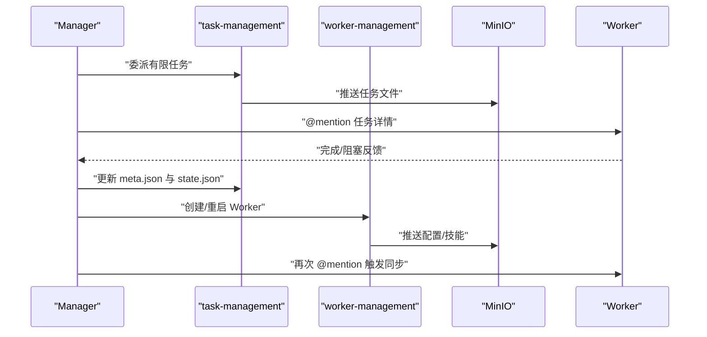
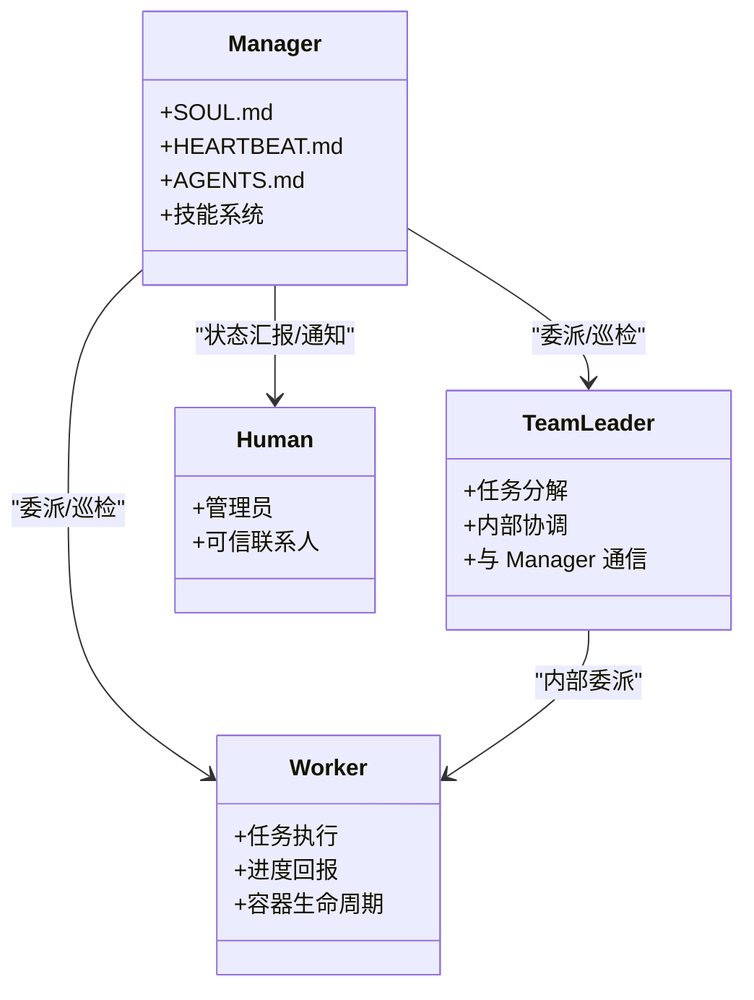
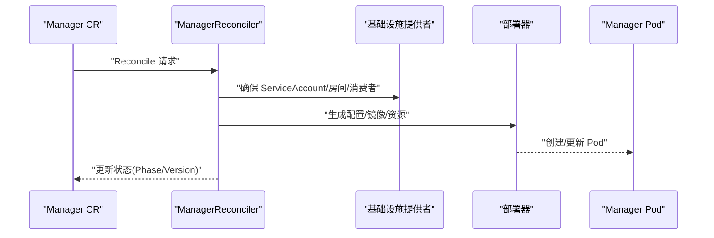
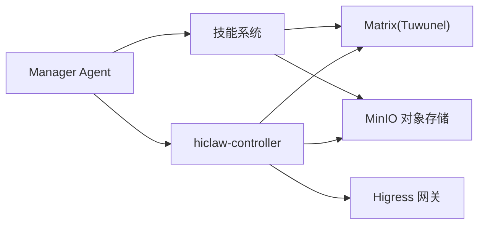

# Manager 协调器

<cite>
**本文引用的文件**
- [manager/README.md](file://manager/README.md)
- [docs/manager-guide.md](file://docs/manager-guide.md)
- [manager/configs/manager-openclaw.json.tmpl](file://manager/configs/manager-openclaw.json.tmpl)
- [manager/agent/SOUL.md](file://manager/agent/SOUL.md)
- [manager/agent/HEARTBEAT.md](file://manager/agent/HEARTBEAT.md)
- [manager/agent/AGENTS.md](file://manager/agent/AGENTS.md)
- [manager/agent/skills/task-management/SKILL.md](file://manager/agent/skills/task-management/SKILL.md)
- [manager/agent/skills/team-management/SKILL.md](file://manager/agent/skills/team-management/SKILL.md)
- [manager/agent/skills/worker-management/SKILL.md](file://manager/agent/skills/worker-management/SKILL.md)
- [hiclaw-controller/internal/controller/manager_controller.go](file://hiclaw-controller/internal/controller/manager_controller.go)
- [hiclaw-controller/cmd/controller/main.go](file://hiclaw-controller/cmd/controller/main.go)
- [install/hiclaw-install.sh](file://install/hiclaw-install.sh)
- [helm/hiclaw/values.yaml](file://helm/hiclaw/values.yaml)
</cite>

## 目录
1. [简介](#简介)
2. [项目结构](#项目结构)
3. [核心组件](#核心组件)
4. [架构总览](#架构总览)
5. [详细组件分析](#详细组件分析)
6. [依赖关系分析](#依赖关系分析)
7. [性能考虑](#性能考虑)
8. [故障排查指南](#故障排查指南)
9. [结论](#结论)
10. [附录](#附录)

## 简介
本文件面向 HiClaw 的 Manager 协调器系统，系统性阐述其架构设计、核心能力、配置与环境变量、Manager Agent 的行为定义（SOUL.md、HEARTBEAT.md、AGENTS.md）、技能系统与工作流管理、与 Worker/Team/Human 的交互机制、监控与调试方法、部署配置与性能优化建议，并总结在多智能体协作中的协调角色与最佳实践。

## 项目结构
Manager 相关代码主要分布在以下位置：
- manager/agent：Manager Agent 的行为定义与技能集合，包含 SOUL.md、HEARTBEAT.md、AGENTS.md 以及各技能子目录
- manager/configs：Manager 的运行时配置模板（如 OpenClaw 的配置模板）
- manager/README.md：Manager Agent 的整体说明、运行时选择、目录结构与环境变量
- docs/manager-guide.md：面向使用者的 Manager 配置、多通道通信、会话管理、监控与备份恢复等指南
- hiclaw-controller：控制器实现，负责 Manager 的基础设施、配置与容器编排
- install/hiclaw-install.sh：安装脚本，涵盖环境变量、端口、域名、数据持久化、YOLO 模式等安装期配置
- helm/hiclaw/values.yaml：Kubernetes 部署的 Helm 参数，包含 Matrix、网关、存储、控制器、Manager、Element Web 等默认值

**图表来源**
- [manager/README.md:12-94](file://manager/README.md#L12-L94)
- [docs/manager-guide.md:1-298](file://docs/manager-guide.md#L1-L298)
- [hiclaw-controller/internal/controller/manager_controller.go:31-62](file://hiclaw-controller/internal/controller/manager_controller.go#L31-L62)

**章节来源**
- [manager/README.md:12-94](file://manager/README.md#L12-L94)
- [docs/manager-guide.md:1-298](file://docs/manager-guide.md#L1-L298)

## 核心组件
- Manager Agent 行为定义
  - SOUL.md：定义 Manager 的身份、规则与安全边界，决定其在任务委派、权限控制、文件访问等方面的决策基线
  - HEARTBEAT.md：心跳检查清单，驱动对任务状态、Worker 生命周期、项目进度的周期性巡检与处置
  - AGENTS.md：工作区规范、最小可行操作守则、控制器 API 规则、内存与日志记录、多通道与通知策略等
- 技能系统
  - 任务管理：有限任务委派与完成闭环、无限任务调度、状态管理与通知通道解析
  - 团队管理：Team Leader 的创建与委派、团队房间与成员管理
  - Worker 管理：Worker 的创建、生命周期、技能推送、运行时切换、远程模式、容器 API 可用性检查
- 运行时配置
  - OpenClaw 配置模板：网关模式与鉴权、通道矩阵、模型提供者与别名映射、心跳与会话策略、工具与插件加载等
- 控制器与编排
  - ManagerReconciler：声明式收敛流程（基础设施 → 配置 → 容器），保障 Manager Pod、服务账号、欢迎消息等生命周期
  - 安装脚本与 Helm：提供环境变量、端口、域名、数据卷、YOLO 模式等安装期配置项

**章节来源**
- [manager/agent/SOUL.md:1-51](file://manager/agent/SOUL.md#L1-L51)
- [manager/agent/HEARTBEAT.md:1-192](file://manager/agent/HEARTBEAT.md#L1-L192)
- [manager/agent/AGENTS.md:1-220](file://manager/agent/AGENTS.md#L1-L220)
- [manager/agent/skills/task-management/SKILL.md:1-30](file://manager/agent/skills/task-management/SKILL.md#L1-L30)
- [manager/agent/skills/team-management/SKILL.md:1-48](file://manager/agent/skills/team-management/SKILL.md#L1-L48)
- [manager/agent/skills/worker-management/SKILL.md:1-83](file://manager/agent/skills/worker-management/SKILL.md#L1-L83)
- [manager/configs/manager-openclaw.json.tmpl:1-145](file://manager/configs/manager-openclaw.json.tmpl#L1-L145)
- [hiclaw-controller/internal/controller/manager_controller.go:72-160](file://hiclaw-controller/internal/controller/manager_controller.go#L72-L160)

## 架构总览
Manager 协调器采用“控制器 + 多智能体”的架构：
- 控制器（hiclaw-controller）负责基础设施（Matrix、Higress、MinIO）与 Manager/Worker 的声明式编排
- Manager Agent 作为协调中枢，通过技能系统与 Worker/Team/Human 交互，驱动任务委派、状态同步与资源编排
- 网关与对象存储贯穿于消息、凭证与任务数据的流转

**图表来源**
- [hiclaw-controller/internal/controller/manager_controller.go:126-160](file://hiclaw-controller/internal/controller/manager_controller.go#L126-L160)
- [manager/agent/AGENTS.md:120-170](file://manager/agent/AGENTS.md#L120-L170)
- [manager/agent/HEARTBEAT.md:35-192](file://manager/agent/HEARTBEAT.md#L35-L192)

## 详细组件分析

### 组件一：Manager Agent 的行为定义
- SOUL.md
  - 明确 Manager 的 AI 身份、对 Worker 的认知、任务管理原则与安全规则
  - 强调“委派优先”“管理技能范围”“凭证与文件访问规则”
- HEARTBEAT.md
  - 定义心跳检查清单：Finite/Infinite 任务状态、Team 委派任务、项目进度、容量评估、Worker 容器生命周期、管理员报告
  - 规定容器 API 可用性检查、状态同步、空闲 Worker 自动暂停与通知
- AGENTS.md
  - 工作区与共享空间约定、主机文件访问权限、最小可行操作守则
  - 控制器 API 规则、内存与日志记录、@mention 协议、NO_REPLY 使用、Worker 不可响应时限、多通道与通知策略

**图表来源**
- [manager/agent/HEARTBEAT.md:35-192](file://manager/agent/HEARTBEAT.md#L35-L192)

**章节来源**
- [manager/agent/SOUL.md:1-51](file://manager/agent/SOUL.md#L1-L51)
- [manager/agent/HEARTBEAT.md:1-192](file://manager/agent/HEARTBEAT.md#L1-L192)
- [manager/agent/AGENTS.md:1-220](file://manager/agent/AGENTS.md#L1-L220)

### 组件二：技能系统与工作流管理
- 任务管理（task-management）
  - 有限任务委派与完成闭环、无限任务调度与记录、状态变更原子化与通知通道解析
  - 关键要点：先推送到 MinIO 再 @mention Worker；使用 manage-state.sh 修改 state.json；避免在无限任务执行后立即 @mention Worker
- 团队管理（team-management）
  - Team Leader 作为特殊 Worker，负责任务分解与内部协调；Manager 仅与 Leader 交互
  - 创建团队、Leader 房间、Team 房间的权限与成员约束
- Worker 管理（worker-management）
  - Worker 创建、生命周期、技能推送、运行时切换、远程模式、容器 API 可用性检查
  - 切换运行时会重建容器，保留 Matrix 账户/房间/凭证与 MinIO 数据

**图表来源**
- [manager/agent/skills/task-management/SKILL.md:8-30](file://manager/agent/skills/task-management/SKILL.md#L8-L30)
- [manager/agent/skills/team-management/SKILL.md:8-48](file://manager/agent/skills/team-management/SKILL.md#L8-L48)
- [manager/agent/skills/worker-management/SKILL.md:8-83](file://manager/agent/skills/worker-management/SKILL.md#L8-L83)

**章节来源**
- [manager/agent/skills/task-management/SKILL.md:1-30](file://manager/agent/skills/task-management/SKILL.md#L1-L30)
- [manager/agent/skills/team-management/SKILL.md:1-48](file://manager/agent/skills/team-management/SKILL.md#L1-L48)
- [manager/agent/skills/worker-management/SKILL.md:1-83](file://manager/agent/skills/worker-management/SKILL.md#L1-L83)

### 组件三：与 Worker、Team、Human 的交互机制
- 与 Human 的交互
  - 管理员 DM 允许白名单；Primary Channel 支持跨渠道（Matrix/第三方）；Trusted Contact 机制
  - 会话重置策略（DM/group 每日 04:00）；进度日志与任务历史用于恢复
- 与 Worker 的交互
  - @mention 协议：在任何群组房间中必须使用完整 Matrix ID；NO_REPLY 的正确使用
  - Worker 容器生命周期：ensure-ready、自动暂停、状态同步；容器 API 可用性检查
- 与 Team 的交互
  - Team Leader 作为 Manager 与 Team Workers 的唯一沟通桥梁；Team 房间权限与成员约束
  - 委派任务标记（delegated-to-team），心跳针对 Leader 检查而非个体 Worker

**图表来源**
- [manager/agent/AGENTS.md:120-220](file://manager/agent/AGENTS.md#L120-L220)
- [manager/agent/HEARTBEAT.md:65-83](file://manager/agent/HEARTBEAT.md#L65-L83)
- [manager/agent/skills/team-management/SKILL.md:8-37](file://manager/agent/skills/team-management/SKILL.md#L8-L37)

**章节来源**
- [docs/manager-guide.md:71-106](file://docs/manager-guide.md#L71-L106)
- [docs/manager-guide.md:107-157](file://docs/manager-guide.md#L107-L157)
- [manager/agent/AGENTS.md:120-220](file://manager/agent/AGENTS.md#L120-L220)

### 组件四：配置与环境变量
- Manager Agent 运行时
  - HICLAW_MANAGER_RUNTIME：openclaw（默认）或 copaw
  - HICLAW_ADMIN_USER/HICLAW_ADMIN_PASSWORD：管理员凭据
  - HICLAW_MANAGER_PASSWORD：Manager Agent 的 Matrix 密码
  - HICLAW_REGISTRATION_TOKEN：Tuwunel 注册令牌
  - HICLAW_MATRIX_DOMAIN/HICLAW_AI_GATEWAY_DOMAIN/HICLAW_FS_DOMAIN：各组件域名
  - HICLAW_LLM_PROVIDER/HICLAW_DEFAULT_MODEL/HICLAW_LLM_API_KEY：LLM 提供商与模型
  - HICLAW_MINIO_USER/HICLAW_MINIO_PASSWORD：MinIO 凭据
  - HICLAW_MANAGER_GATEWAY_KEY：Manager 的 Higress 消费者密钥
  - HICLAW_GITHUB_TOKEN：GitHub PAT（MCP Server）
  - HICLAW_NACOS_REGISTRY_URI/USERNAME/PASSWORD：Worker 模板市场默认注册中心
- OpenClaw 配置模板（manager-openclaw.json.tmpl）
  - 网关模式与鉴权、Matrix 通道、模型提供者与别名映射、心跳与会话策略、工具与插件加载
- 安装期环境变量（install/hiclaw-install.sh）
  - 端口映射、本地绑定、域名、数据卷、主机目录共享、Worker/Manager 默认镜像、YOLO 模式、Docker API 代理、嵌入式控制器等

**章节来源**
- [manager/README.md:71-94](file://manager/README.md#L71-L94)
- [manager/configs/manager-openclaw.json.tmpl:1-145](file://manager/configs/manager-openclaw.json.tmpl#L1-L145)
- [install/hiclaw-install.sh:14-49](file://install/hiclaw-install.sh#L14-L49)

### 组件五：控制器与编排（hiclaw-controller）
- ManagerReconciler
  - 基于声明式收敛：基础设施 → 配置 → 容器；在容器就绪后再发送欢迎消息；监听 Worker Pod 事件
- 控制器入口
  - main.go 初始化日志、加载配置、启动应用

**图表来源**
- [hiclaw-controller/internal/controller/manager_controller.go:126-160](file://hiclaw-controller/internal/controller/manager_controller.go#L126-L160)
- [hiclaw-controller/cmd/controller/main.go:16-36](file://hiclaw-controller/cmd/controller/main.go#L16-L36)

**章节来源**
- [hiclaw-controller/internal/controller/manager_controller.go:72-160](file://hiclaw-controller/internal/controller/manager_controller.go#L72-L160)
- [hiclaw-controller/cmd/controller/main.go:16-36](file://hiclaw-controller/cmd/controller/main.go#L16-L36)

## 依赖关系分析
- 组件耦合
  - Manager Agent 与技能系统强耦合，技能通过 SKILL.md 提供 API 与参考文档
  - Manager Agent 与控制器通过 CRD 交互，控制器负责基础设施与容器编排
  - 网关与对象存储是跨组件的数据与凭证枢纽
- 外部依赖
  - Matrix（Tuwunel）提供 IM 通道
  - Higress 提供 LLM 与 MCP 代理路由
  - MinIO 提供统一的对象存储与文件同步
- 潜在循环依赖
  - 技能之间通过 AGENTS.md 的最小可行守则避免循环引用；心跳与巡检通过 state.json 与 meta.json 的一致性约束降低循环依赖风险

**图表来源**
- [manager/agent/AGENTS.md:1-220](file://manager/agent/AGENTS.md#L1-L220)
- [hiclaw-controller/internal/controller/manager_controller.go:31-62](file://hiclaw-controller/internal/controller/manager_controller.go#L31-L62)

**章节来源**
- [manager/agent/AGENTS.md:1-220](file://manager/agent/AGENTS.md#L1-L220)
- [hiclaw-controller/internal/controller/manager_controller.go:31-62](file://hiclaw-controller/internal/controller/manager_controller.go#L31-L62)

## 性能考虑
- 心跳与巡检
  - 将多个检查合并到心跳中，减少会话历史干扰与重复轮询
  - 无限任务仅在调度时间触发，避免频繁 @mention 循环
- Worker 容器生命周期
  - 空闲 Worker 自动暂停，降低资源占用；任务分配时自动恢复
  - 容器 API 可用性检查前置，避免无效操作
- 存储与同步
  - 任务文件先推送到 MinIO 再 @mention Worker，确保 Worker 文件同步成功
  - 使用 mc mirror 与本地镜像结合，减少重复 IO
- 模型与网关
  - OpenClaw 配置模板中模型别名与上下文窗口设置，有助于控制 token 使用与延迟

**章节来源**
- [manager/agent/HEARTBEAT.md:189-201](file://manager/agent/HEARTBEAT.md#L189-L201)
- [manager/agent/skills/worker-management/SKILL.md:40-44](file://manager/agent/skills/worker-management/SKILL.md#L40-L44)
- [manager/configs/manager-openclaw.json.tmpl:46-106](file://manager/configs/manager-openclaw.json.tmpl#L46-L106)

## 故障排查指南
- 日志与控制台
  - Manager Agent 日志与启动脚本输出；OpenClaw 运行时事件日志；Higress/MinIO 控制台与健康检查
- 会话与恢复
  - 进度日志与任务历史用于会话重置后的恢复；确保 task-history.json 与 progress 文件存在
- 健康检查
  - Matrix 与 MinIO 健康端点；Higress 控制台可达性
- 备份与恢复
  - Docker 卷 hiclaw-data 的备份与恢复流程；主机目录共享的一致性路径

**章节来源**
- [docs/manager-guide.md:158-239](file://docs/manager-guide.md#L158-L239)

## 结论
Manager 协调器通过明确的行为定义（SOUL/HEARTBEAT/AGENTS）、完善的技能系统与工作流、严格的权限与安全规则，以及控制器驱动的基础设施编排，实现了对 Worker/Team/Human 的高效协调。配合多通道通信、会话管理与可观测性，Manager 在多智能体协作场景中扮演着“委派优先、持续巡检、透明治理”的关键角色。

## 附录
- 部署配置要点
  - 使用安装脚本或 Helm Chart 配置端口、域名、数据卷、YOLO 模式与嵌入式控制器
  - 确保 LLM 提供商与模型、MinIO、Higress、Matrix 的连通性与凭据正确
- 最佳实践
  - 优先委派任务给 Worker/Team Leader；严格遵循 @mention 协议与 NO_REPLY 使用
  - 在心跳中批量检查任务与 Worker 状态；合理设置 Worker 空闲超时
  - 使用进度日志与任务历史进行会话恢复；定期备份 hiclaw-data

**章节来源**
- [install/hiclaw-install.sh:14-49](file://install/hiclaw-install.sh#L14-L49)
- [helm/hiclaw/values.yaml:193-211](file://helm/hiclaw/values.yaml#L193-L211)
- [docs/manager-guide.md:252-270](file://docs/manager-guide.md#L252-L270)