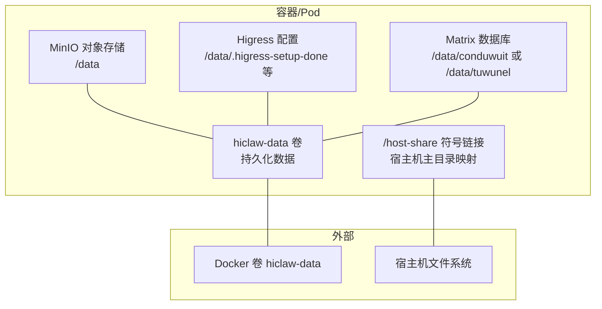
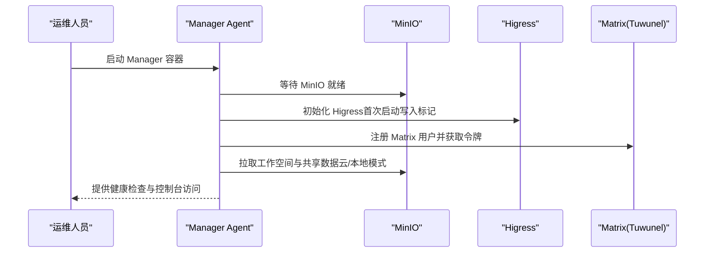
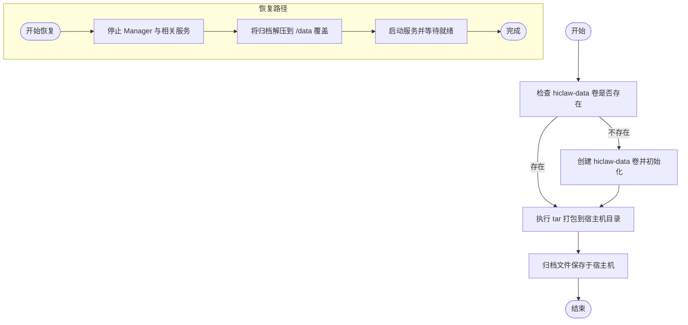
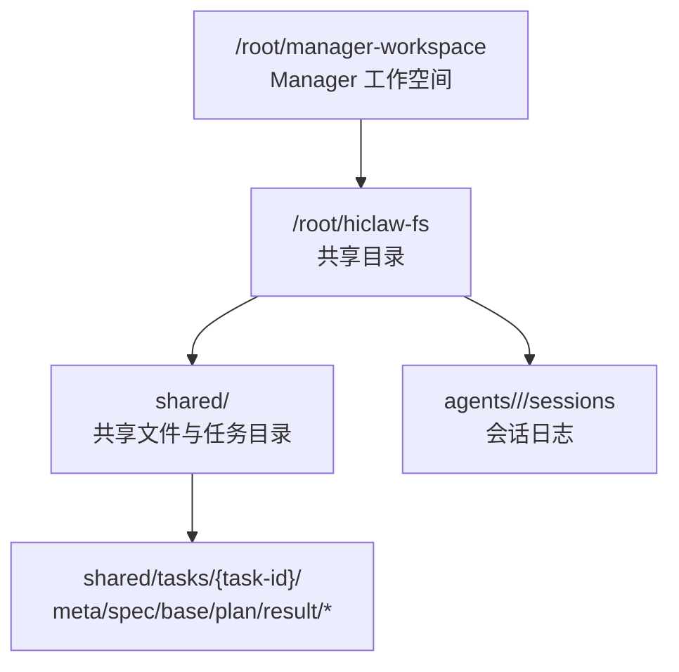
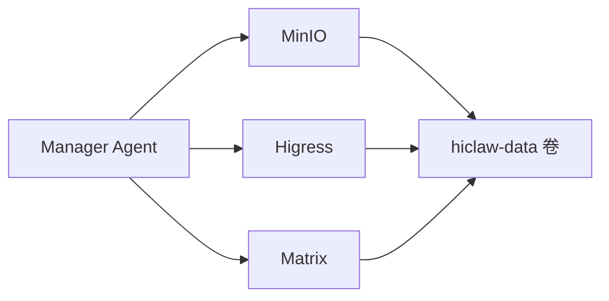

# Manager 备份与恢复

<cite>
**本文引用的文件**
- [docs/manager-guide.md](file://docs/manager-guide.md)
- [docs/zh-cn/manager-guide.md](file://docs/zh-cn/manager-guide.md)
- [manager/scripts/init/start-manager-agent.sh](file://manager/scripts/init/start-manager-agent.sh)
- [manager/scripts/init/setup-higress.sh](file://manager/scripts/init/setup-higress.sh)
- [manager/scripts/init/start-minio.sh](file://manager/scripts/init/start-minio.sh)
- [manager/Dockerfile](file://manager/Dockerfile)
- [helm/hiclaw/values.yaml](file://helm/hiclaw/values.yaml)
- [helm/hiclaw/templates/storage/minio-statefulset.yaml](file://helm/hiclaw/templates/storage/minio-statefulset.yaml)
- [helm/hiclaw/templates/storage/minio-service.yaml](file://helm/hiclaw/templates/storage/minio-service.yaml)
- [install/hiclaw-install.sh](file://install/hiclaw-install.sh)
- [install/hiclaw-verify.sh](file://install/hiclaw-verify.sh)
- [manager/agent/skills/task-management/references/finite-tasks.md](file://manager/agent/skills/task-management/references/finite-tasks.md)
- [scripts/export-debug-log.py](file://scripts/export-debug-log.py)
- [manager/scripts/lib/base.sh](file://manager/scripts/lib/base.sh)
</cite>

## 目录
1. [简介](#简介)
2. [项目结构](#项目结构)
3. [核心组件](#核心组件)
4. [架构总览](#架构总览)
5. [详细组件分析](#详细组件分析)
6. [依赖关系分析](#依赖关系分析)
7. [性能考量](#性能考量)
8. [故障排查指南](#故障排查指南)
9. [结论](#结论)
10. [附录](#附录)

## 简介
本文件面向 HiClaw Manager 的备份与恢复体系，系统性阐述数据持久化机制、hiclaw-data Docker 卷管理、备份与恢复策略、目录结构与文件组织、备份脚本使用方法与自定义选项，并给出灾难恢复计划与业务连续性保障措施，以及备份验证与恢复测试的最佳实践。

## 项目结构
HiClaw 的持久化数据主要由以下部分组成：
- Docker 卷 hiclaw-data：承载矩阵数据库、MinIO 对象存储、Higress 网关配置等系统级持久化数据
- 主目录共享（可选）：将宿主机用户主目录通过符号链接映射至容器内的统一访问路径，便于 Agent 与宿主机间文件路径一致性
- MinIO 存储：用于保存 Agent 配置、任务数据、共享文件等对象数据
- 网关与服务：Higress 路由与消费者配置、Matrix 历史记录等

**图表来源**
- [docs/zh-cn/manager-guide.md:207-242](file://docs/zh-cn/manager-guide.md#L207-L242)
- [manager/scripts/init/start-minio.sh:1-10](file://manager/scripts/init/start-minio.sh#L1-L10)
- [helm/hiclaw/templates/storage/minio-statefulset.yaml:56-77](file://helm/hiclaw/templates/storage/minio-statefulset.yaml#L56-L77)

**章节来源**
- [docs/zh-cn/manager-guide.md:207-242](file://docs/zh-cn/manager-guide.md#L207-L242)
- [docs/manager-guide.md:226-250](file://docs/manager-guide.md#L226-L250)

## 核心组件
- 备份与恢复命令
  - 备份：基于 Docker 卷的 tar 打包，将 hiclaw-data 整体打包为归档文件
  - 恢复：将指定日期的归档解压回根目录，覆盖原有数据
- 数据卷与挂载
  - hiclaw-data 卷作为唯一持久化载体，包含 MinIO 数据、Higress 配置、Matrix 数据等
  - 支持可选的宿主机主目录共享，便于 Agent 使用一致路径访问文件
- MinIO 与 Higress 初始化
  - MinIO 启动脚本负责初始化数据目录与监听端口
  - Higress 初始化脚本在首次启动时写入标记文件，避免重复配置
- 工作空间同步
  - Manager Agent 在不同运行模式下会从 MinIO 或 OSS 拉取工作空间与共享数据，确保重启后状态一致

**章节来源**
- [docs/manager-guide.md:226-250](file://docs/manager-guide.md#L226-L250)
- [docs/zh-cn/manager-guide.md:207-242](file://docs/zh-cn/manager-guide.md#L207-L242)
- [manager/scripts/init/start-minio.sh:1-10](file://manager/scripts/init/start-minio.sh#L1-L10)
- [manager/scripts/init/setup-higress.sh:95-158](file://manager/scripts/init/setup-higress.sh#L95-L158)
- [manager/scripts/init/start-manager-agent.sh:158-182](file://manager/scripts/init/start-manager-agent.sh#L158-L182)

## 架构总览
下图展示了 Manager 启动阶段如何与 MinIO、Higress、Matrix 等组件协作，以及持久化数据的来源与流向。

**图表来源**
- [manager/scripts/init/start-manager-agent.sh:106-129](file://manager/scripts/init/start-manager-agent.sh#L106-L129)
- [manager/scripts/init/setup-higress.sh:95-158](file://manager/scripts/init/setup-higress.sh#L95-L158)
- [manager/scripts/init/start-minio.sh:1-10](file://manager/scripts/init/start-minio.sh#L1-L10)

## 详细组件分析

### 数据持久化与 hiclaw-data 卷管理
- 卷用途
  - 存放 Matrix 历史记录（Tuwunel 数据库）
  - 存放 MinIO 对象存储数据（Agent 配置、任务数据、共享文件）
  - 存放 Higress 路由与消费者配置（首次启动写入标记文件）
- 卷生命周期
  - 安装脚本支持清理或保留 orphan volume 的交互逻辑
  - 通过 Docker 卷管理器进行创建、删除与迁移
- 卷挂载与路径
  - MinIO 数据目录通常位于 /data
  - Higress 配置标记文件位于 /data 下的特定路径
  - Matrix 数据目录根据部署模式位于 /data/conduwuit 或 /data/tuwunel

**章节来源**
- [docs/zh-cn/manager-guide.md:207-242](file://docs/zh-cn/manager-guide.md#L207-L242)
- [install/hiclaw-install.sh:2326-2349](file://install/hiclaw-install.sh#L2326-L2349)
- [helm/hiclaw/templates/storage/minio-statefulset.yaml:56-77](file://helm/hiclaw/templates/storage/minio-statefulset.yaml#L56-L77)
- [manager/scripts/init/setup-higress.sh:95-158](file://manager/scripts/init/setup-higress.sh#L95-L158)

### 备份策略与恢复流程
- 备份策略
  - 全量备份：对 hiclaw-data 卷进行 tar 打包，生成按日期命名的归档文件
  - 增量备份：建议结合对象存储层面的版本控制或快照能力实现增量；若无原生增量能力，可在应用层通过识别变更文件进行二次打包
- 恢复流程
  - 停止 Manager 与相关容器
  - 将备份归档解压到根目录，覆盖原有 /data 内容
  - 启动 Manager，等待 MinIO、Higress、Matrix 就绪后完成初始化
- 目录结构要点
  - /data/minio：MinIO 数据
  - /data/.higress-setup-done：Higress 首次配置标记
  - /data/conduwuit 或 /data/tuwunel：Matrix 数据库
  - /host-share：可选的宿主机主目录映射

**图表来源**
- [docs/manager-guide.md:226-250](file://docs/manager-guide.md#L226-L250)
- [docs/zh-cn/manager-guide.md:207-242](file://docs/zh-cn/manager-guide.md#L207-L242)

**章节来源**
- [docs/manager-guide.md:226-250](file://docs/manager-guide.md#L226-L250)
- [docs/zh-cn/manager-guide.md:207-242](file://docs/zh-cn/manager-guide.md#L207-L242)

### 目录结构与文件组织
- 任务与共享数据
  - 任务目录布局：shared/tasks/{task-id}/ 下包含元数据、规范、基线参考、执行计划、结果等文件
  - 任务历史：每个 Worker 维护本地任务历史文件，超过阈值后归档
- 工作空间与共享
  - Manager 工作空间位于 /root/manager-workspace
  - 通过 /root/hiclaw-fs 提供共享目录，包含 shared、agents、hiclaw-config 等子目录
- 日志与调试
  - 不同运行模式下的会话日志路径不同，可通过导出脚本定位

**图表来源**
- [manager/agent/skills/task-management/references/finite-tasks.md:99-110](file://manager/agent/skills/task-management/references/finite-tasks.md#L99-L110)
- [scripts/export-debug-log.py:347-373](file://scripts/export-debug-log.py#L347-L373)

**章节来源**
- [manager/agent/skills/task-management/references/finite-tasks.md:99-110](file://manager/agent/skills/task-management/references/finite-tasks.md#L99-L110)
- [scripts/export-debug-log.py:347-373](file://scripts/export-debug-log.py#L347-L373)

### 备份脚本使用方法与自定义选项
- 使用方法
  - 备份：在宿主机执行 tar 打包命令，将 hiclaw-data 卷内容打包到当前目录
  - 恢复：在宿主机执行 tar 解压命令，将指定日期归档解压到根目录
- 自定义选项
  - 指定备份输出目录与归档命名规则
  - 指定恢复目标路径（默认为根目录）
  - 结合调度工具（如 cron）定期执行备份任务
- 注意事项
  - 恢复前需停止相关服务，避免数据竞争
  - 恢复后验证 MinIO、Higress、Matrix 的健康状态

**章节来源**
- [docs/manager-guide.md:226-250](file://docs/manager-guide.md#L226-L250)
- [docs/zh-cn/manager-guide.md:207-242](file://docs/zh-cn/manager-guide.md#L207-L242)

### 灾难恢复计划与业务连续性保障
- 灾难场景
  - 卷损坏或数据丢失
  - MinIO 服务不可用
  - Higress 配置异常
  - Matrix 数据库异常
- 应对策略
  - 快速恢复：优先恢复 hiclaw-data 卷，再启动各组件并等待就绪
  - 降级运行：在最小功能集下启动（仅保留必要服务），逐步恢复其他组件
  - 多地备份：将归档文件上传至对象存储或异地位置
- 业务连续性
  - 通过定期备份与恢复演练，确保在故障发生时能快速回到最近可用状态
  - 在云模式下，结合 MinIO 的多副本与快照能力提升可用性

**章节来源**
- [docs/manager-guide.md:226-250](file://docs/manager-guide.md#L226-L250)
- [docs/zh-cn/manager-guide.md:207-242](file://docs/zh-cn/manager-guide.md#L207-L242)

### 备份验证与恢复测试最佳实践
- 验证清单
  - 备份完整性：校验归档文件大小与包含的关键目录
  - 恢复一致性：恢复后检查 MinIO、Higress、Matrix 是否正常
  - 功能回归：登录控制台、发起一次任务、验证日志与进度文件
- 测试流程
  - 准备阶段：创建测试数据与任务
  - 备份阶段：执行备份并校验
  - 恢复阶段：停止服务、恢复、启动并验证
  - 回滚准备：保留一份最近可用的备份以便回滚
- 工具辅助
  - 使用安装脚本提供的健康检查能力，验证各组件可达性与健康状态

**章节来源**
- [install/hiclaw-verify.sh:80-176](file://install/hiclaw-verify.sh#L80-L176)
- [manager/scripts/lib/base.sh:7-47](file://manager/scripts/lib/base.sh#L7-L47)

## 依赖关系分析
- 组件耦合
  - Manager Agent 依赖 MinIO 提供的对象存储与 /root/hiclaw-fs 共享目录
  - Higress 配置依赖首次初始化标记文件，避免重复配置
  - Matrix 用户注册与令牌获取是启动流程的关键步骤
- 外部依赖
  - Docker 卷管理器负责 hiclaw-data 的生命周期
  - Helm/Values 配置决定 MinIO 的持久化与资源规格
- 潜在风险
  - 卷未正确挂载导致数据丢失
  - Higress 配置未正确初始化导致路由异常
  - MinIO 未就绪导致工作空间同步失败

**图表来源**
- [manager/scripts/init/start-manager-agent.sh:106-129](file://manager/scripts/init/start-manager-agent.sh#L106-L129)
- [manager/scripts/init/setup-higress.sh:95-158](file://manager/scripts/init/setup-higress.sh#L95-L158)
- [helm/hiclaw/values.yaml:78-111](file://helm/hiclaw/values.yaml#L78-L111)

**章节来源**
- [manager/scripts/init/start-manager-agent.sh:106-129](file://manager/scripts/init/start-manager-agent.sh#L106-L129)
- [manager/scripts/init/setup-higress.sh:95-158](file://manager/scripts/init/setup-higress.sh#L95-L158)
- [helm/hiclaw/values.yaml:78-111](file://helm/hiclaw/values.yaml#L78-L111)

## 性能考量
- 备份性能
  - 全量备份受卷容量与网络带宽影响，建议在低峰期执行
  - 对大文件较多的场景，考虑分批备份或压缩级别调优
- 恢复性能
  - 恢复时应先停止服务，避免并发写入导致的性能抖动
  - MinIO 与 Higress 的就绪探测时间较长，需预留充足等待时间
- 存储与网络
  - MinIO 的持久化配置与存储类参数直接影响 IO 性能
  - 云模式下建议启用多副本与跨可用区部署

## 故障排查指南
- 常见问题
  - MinIO 未就绪：检查 /data 目录权限与磁盘空间
  - Higress 配置异常：确认首次初始化标记文件是否存在
  - Matrix 登录失败：核对注册令牌与用户凭据
- 排查步骤
  - 使用健康检查脚本验证各组件可达性
  - 查看 Manager Agent 的启动日志与错误输出
  - 检查 /data 下关键目录是否完整
- 相关工具
  - 健康检查脚本：验证 MinIO、Matrix、Higress、Manager Agent 的状态
  - 等待函数：封装 TCP 与 HTTP 就绪探测逻辑

**章节来源**
- [install/hiclaw-verify.sh:80-176](file://install/hiclaw-verify.sh#L80-L176)
- [manager/scripts/lib/base.sh:7-47](file://manager/scripts/lib/base.sh#L7-L47)

## 结论
HiClaw Manager 的备份与恢复体系以 hiclaw-data 卷为核心，结合 MinIO、Higress、Matrix 的初始化与同步机制，形成可验证、可恢复的数据保障方案。通过定期全量备份、恢复演练与健康检查，可有效降低数据丢失风险并提升业务连续性。建议在生产环境中配合对象存储快照与异地备份，进一步增强灾难恢复能力。

## 附录
- 关键路径与文件
  - 备份与恢复命令示例路径：[docs/manager-guide.md:226-250](file://docs/manager-guide.md#L226-L250)
  - MinIO 启动脚本：[manager/scripts/init/start-minio.sh:1-10](file://manager/scripts/init/start-minio.sh#L1-L10)
  - Higress 初始化脚本：[manager/scripts/init/setup-higress.sh:95-158](file://manager/scripts/init/setup-higress.sh#L95-L158)
  - Manager Agent 启动流程：[manager/scripts/init/start-manager-agent.sh:106-129](file://manager/scripts/init/start-manager-agent.sh#L106-L129)
  - Helm Values 与 MinIO 配置：[helm/hiclaw/values.yaml:78-111](file://helm/hiclaw/values.yaml#L78-L111)、[helm/hiclaw/templates/storage/minio-statefulset.yaml:56-77](file://helm/hiclaw/templates/storage/minio-statefulset.yaml#L56-L77)
  - 任务目录布局参考：[manager/agent/skills/task-management/references/finite-tasks.md:99-110](file://manager/agent/skills/task-management/references/finite-tasks.md#L99-L110)
  - 导出会话日志路径定位：[scripts/export-debug-log.py:347-373](file://scripts/export-debug-log.py#L347-L373)
  - 健康检查脚本：[install/hiclaw-verify.sh:80-176](file://install/hiclaw-verify.sh#L80-L176)