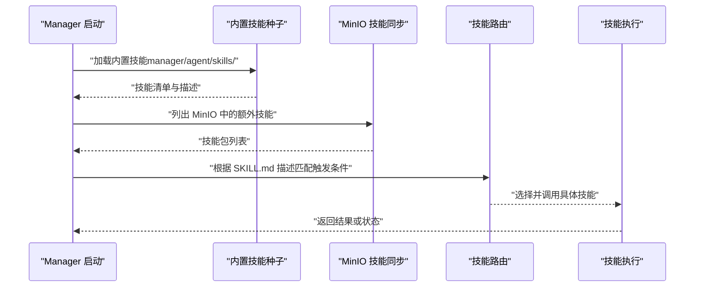
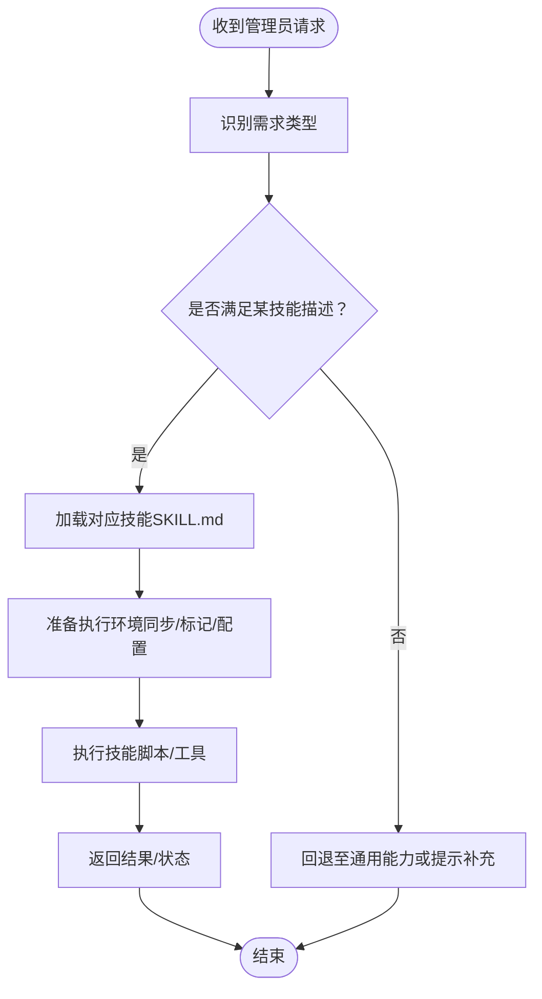
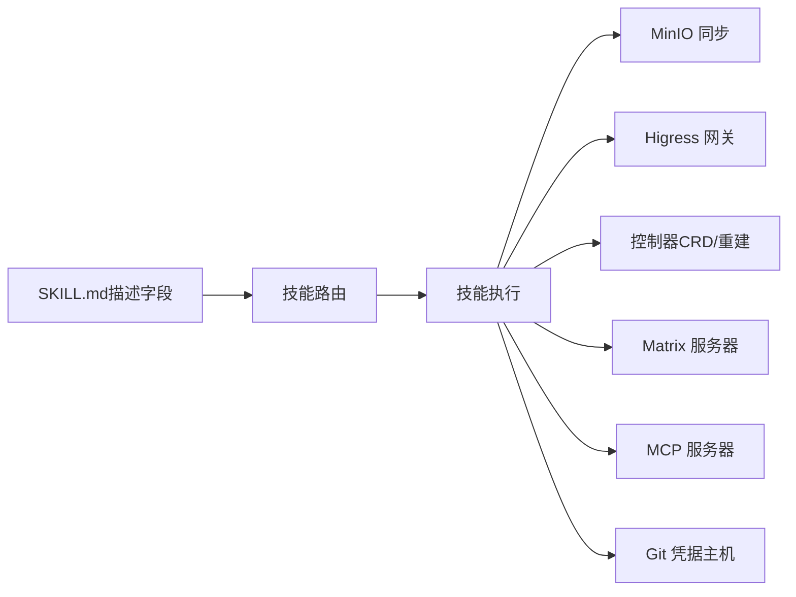

# Manager 技能系统

<cite>
**本文引用的文件**
- [架构与技能概览](file://docs/architecture.md)
- [管理技能快速参考](file://manager/agent/TOOLS.md)
- [技能：channel-management](file://manager/agent/skills/channel-management/SKILL.md)
- [技能：file-sync-management](file://manager/agent/skills/file-sync-management/SKILL.md)
- [技能：git-delegation-management](file://manager/agent/skills/git-delegation-management/SKILL.md)
- [技能：hiclaw-find-worker](file://manager/agent/skills/hiclaw-find-worker/SKILL.md)
- [技能：human-management](file://manager/agent/skills/human-management/SKILL.md)
- [技能：matrix-server-management](file://manager/agent/skills/matrix-server-management/SKILL.md)
- [技能：mcp-server-management](file://manager/agent/skills/mcp-server-management/SKILL.md)
- [技能：mcporter](file://manager/agent/skills/mcporter/SKILL.md)
- [技能：model-switch](file://manager/agent/skills/model-switch/SKILL.md)
- [技能：project-management](file://manager/agent/skills/project-management/SKILL.md)
- [技能：service-publishing](file://manager/agent/skills/service-publishing/SKILL.md)
- [技能：task-coordination](file://manager/agent/skills/task-coordination/SKILL.md)
- [技能：task-management](file://manager/agent/skills/task-management/SKILL.md)
- [技能：team-management](file://manager/agent/skills/team-management/SKILL.md)
- [技能：worker-management](file://manager/agent/skills/worker-management/SKILL.md)
- [技能：worker-model-switch](file://manager/agent/skills/worker-model-switch/SKILL.md)
- [CoPaw 工人同步与内置技能加载](file://copaw/src/copaw_worker/worker.py)
- [内置技能合并脚本](file://manager/scripts/lib/builtin-merge.sh)
- [渲染技能清单脚本](file://shared/lib/render-skills.sh)
- [测试：查找内置技能](file://tests/smoke-test.sh)
- [测试：更新内置技能段落（MinIO）](file://tests/test-update-builtin-section-minio.sh)
- [测试：更新内置技能段落](file://tests/test-update-builtin-section.sh)
- [测试：技能调试示例](file://tests/skills/hiclaw-test/SKILL.md)
</cite>

## 目录
1. [引言](#引言)
2. [项目结构](#项目结构)
3. [核心组件](#核心组件)
4. [架构总览](#架构总览)
5. [详细组件分析](#详细组件分析)
6. [依赖关系分析](#依赖关系分析)
7. [性能考量](#性能考量)
8. [故障排除指南](#故障排除指南)
9. [结论](#结论)
10. [附录](#附录)

## 引言
本文件面向 HiClaw Manager 的技能系统，系统性阐述内置技能的架构设计、功能分类、配置与使用方法，并覆盖自动发现与动态加载机制、自定义技能开发规范与 API 参考、部署与管理流程以及扩展性与最佳实践。目标是帮助管理员与开发者在不深入源码的前提下，高效理解并运用 Manager 的 16 个内置技能。

## 项目结构
HiClaw 将“技能”作为可组合的执行单元，Manager 端的技能位于 manager/agent/skills/ 下，每个子目录代表一个独立技能；同时存在团队领导代理与工人代理的技能集合，分别用于团队协作与工作流自动化。架构文档明确指出 Manager 共享 16 个通用技能，且这些技能由 OpenClaw 与 CoPaw 共用。

```mermaid
graph TB
subgraph "Manager 技能"
CM["channel-management"]
FSM["file-sync-management"]
GDM["git-delegation-management"]
HFW["hiclaw-find-worker"]
HM["human-management"]
MSM["matrix-server-management"]
MCM["mcp-server-management"]
MCP["mcporter"]
MSW["model-switch"]
PM["project-management"]
SP["service-publishing"]
TC["task-coordination"]
TM["task-management"]
TMS["team-management"]
WM["worker-management"]
WMS["worker-model-switch"]
end
subgraph "架构与入口"
DOC["架构与技能概览"]
TOOLS["管理技能快速参考"]
end
DOC --> CM
DOC --> FSM
DOC --> GDM
DOC --> HFW
DOC --> HM
DOC --> MSM
DOC --> MCM
DOC --> MCP
DOC --> MSW
DOC --> PM
DOC --> SP
DOC --> TC
DOC --> TM
DOC --> TMS
DOC --> WM
DOC --> WMS
TOOLS --> WM
TOOLS --> HFW
```

图表来源
- [架构与技能概览:184-222](file://docs/architecture.md#L184-L222)
- [管理技能快速参考:1-12](file://manager/agent/TOOLS.md#L1-L12)

章节来源
- [架构与技能概览:184-222](file://docs/architecture.md#L184-L222)
- [管理技能快速参考:1-12](file://manager/agent/TOOLS.md#L1-L12)

## 核心组件
- 16 个通用 Manager 技能：channel-management、file-sync-management、git-delegation-management、hiclaw-find-worker、human-management、matrix-server-management、mcp-server-management、mcporter、model-switch、project-management、service-publishing、task-coordination、task-management、team-management、worker-management、worker-model-switch。
- 技能元数据：每个技能目录包含 SKILL.md，其中以 YAML 头部声明 name 与 description，用于路由与自动加载。
- 自动发现与动态加载：Manager 在启动时通过内置合并与渲染脚本扫描并加载技能，同时支持从 MinIO 同步额外技能覆盖内置层。
- 运行时差异：OpenClaw 与 CoPaw 的 Manager 共享上述技能，但 CoPaw 的提示词覆盖位于专用目录中。

章节来源
- [架构与技能概览:184-222](file://docs/architecture.md#L184-L222)

## 架构总览
Manager 技能系统采用“共享技能 + 动态叠加”的模式：
- 基础层：内置技能（manager/agent/skills/）作为种子层，确保最小可用能力。
- 覆盖层：来自 MinIO 的 Manager 推送技能（按需叠加），优先级高于内置层。
- 自动发现：通过脚本扫描与渲染，识别 SKILL.md 中的描述字段以决定何时加载该技能。
- 安全与一致性：任务协调使用 .processing 标记避免并发冲突；文件同步强调显式拉取/推送。

图表来源
- [CoPaw 工人同步与内置技能加载:352-375](file://copaw/src/copaw_worker/worker.py#L352-L375)
- [内置技能合并脚本](file://manager/scripts/lib/builtin-merge.sh)
- [渲染技能清单脚本](file://shared/lib/render-skills.sh)

章节来源
- [CoPaw 工人同步与内置技能加载:352-375](file://copaw/src/copaw_worker/worker.py#L352-L375)
- [内置技能合并脚本](file://manager/scripts/lib/builtin-merge.sh)
- [渲染技能清单脚本](file://shared/lib/render-skills.sh)

## 详细组件分析

### 技能：channel-management（通道管理）
- 功能：管理通信通道、管理员身份识别、可信联系人、主通知通道配置与跨通道升级。
- 关键要点：主通道不可设为“matrix”，未知发件人在群组房间需静默忽略；消息工具调用必须显式设置 channel 与 target。
- 使用场景：首次接触协议、跨通道升级、主通道配置变更。

章节来源
- [技能：channel-management:1-30](file://manager/agent/skills/channel-management/SKILL.md#L1-L30)

### 技能：file-sync-management（文件同步管理）
- 功能：向 MinIO 推送/拉取文件、通知 Worker 文件同步、保证本地与云端一致。
- 关键要点：本地 /root/hiclaw-fs 非实时同步；写入后立即推送到 MinIO 并通知 Worker；Worker 报告上传后先拉取再读取。
- 使用场景：任务输入输出、共享资源分发与回传。

章节来源
- [技能：file-sync-management:1-20](file://manager/agent/skills/file-sync-management/SKILL.md#L1-L20)

### 技能：git-delegation-management（Git 委托管理）
- 功能：代表无凭据 Worker 执行任意 Git 操作，基于结构化请求块解析并执行。
- 关键流程：接收 git-request 块 → 同步工作区 → 检查 .processing 标记 → 创建标记 → 执行命令 → 清理标记 → 同步回传。
- 错误处理：合并冲突交由 Worker 本地解决；认证失败检查主机凭据；重复/过期请求遵循最后有效原则。
- 使用场景：仓库克隆、分支切换、提交推送、历史查看与修复。

章节来源
- [技能：git-delegation-management:1-167](file://manager/agent/skills/git-delegation-management/SKILL.md#L1-L167)

### 技能：hiclaw-find-worker（查找并导入 Worker）
- 功能：在 Nacos AgentSpecs 中搜索合适的 Worker 模板，或直接导入指定 package URI。
- 关键流程：搜索需求 → 推荐候选 → 确认安装 → 导入模板或直接包 → 失败直接上报。
- 使用场景：任务委派前的 Worker 发现与导入、市场模板安装。

章节来源
- [技能：hiclaw-find-worker:1-52](file://manager/agent/skills/hiclaw-find-worker/SKILL.md#L1-L52)

### 技能：human-management（人类用户管理）
- 功能：将真实人类账户导入系统，配置权限等级，管理访问与邮件欢迎。
- 权限等级：1（全局）→ 2（指定团队/Worker）→ 3（仅指定 Worker）。
- 使用场景：新增成员、权限调整、移除访问。

章节来源
- [技能：human-management:1-45](file://manager/agent/skills/human-management/SKILL.md#L1-L45)

### 技能：matrix-server-management（Matrix 服务器管理）
- 功能：独立管理 Tuwunel Homeserver 的注册、房间、成员与媒体上传。
- 关键要点：Worker 必须包含 m.mentions.user_ids；用户 ID 匹配严格；不应用于 Worker/项目创建。
- 使用场景：外部文件上传、房间与成员管理。

章节来源
- [技能：matrix-server-management:1-23](file://manager/agent/skills/matrix-server-management/SKILL.md#L1-L23)

### 技能：mcp-server-management（MCP 服务器管理）
- 功能：配置 MCP 工具服务器、轮换凭据、授权消费者、代理现有 MCP 服务。
- 关键要点：云模式不支持脚本管理；创建/更新后等待认证插件生效；验证端到端后再通知 Worker。
- 使用场景：GitHub、天气等外部 API 工具集成。

章节来源
- [技能：mcp-server-management:1-33](file://manager/agent/skills/mcp-server-management/SKILL.md#L1-L33)

### 技能：mcporter（MCP 工具 CLI）
- 功能：直接调用已配置 MCP 服务器的工具进行快速查询或决策辅助。
- 使用场景：快速检索、工具可用性验证、非持续性 API 交互。

章节来源
- [技能：mcporter:1-41](file://manager/agent/skills/mcporter/SKILL.md#L1-L41)

### 技能：model-switch（Manager 模型切换）
- 功能：切换 Manager Agent 自身的 LLM 主模型，含连通性测试与重启提示。
- 关键流程：去前缀校验 → 网关连通性测试 → 新模型注册与主模型切换 → 输出重启要求。
- 使用场景：模型能力评估、策略切换。

章节来源
- [技能：model-switch:1-83](file://manager/agent/skills/model-switch/SKILL.md#L1-L83)

### 技能：project-management（项目管理）
- 功能：多 Worker 项目的生命周期管理，包含计划、元数据与任务文件组织。
- 关键要点：plan.md 是单一真相源；YOLO 模式下需自动确认；项目房间必须包含人类管理员。
- 使用场景：项目启动、计划变更、阻塞任务处理、阶段性总结。

章节来源
- [技能：project-management:1-37](file://manager/agent/skills/project-management/SKILL.md#L1-L37)

### 技能：service-publishing（服务发布）
- 功能：通过 Higress 网关对外暴露 Worker 容器内的 HTTP 服务。
- 关键流程：CLI/YAML 添加 expose → 控制器创建域名/服务源/路由 → 自动域名生成。
- 使用场景：Web 应用或 API 对外访问。

章节来源
- [技能：service-publishing:1-92](file://manager/agent/skills/service-publishing/SKILL.md#L1-L92)

### 技能：task-coordination（任务协调）
- 功能：通过 .processing 标记文件协调 Manager 与 Worker 对共享工作区的并发访问。
- 关键流程：同步 → 检查标记 → 创建标记 → 修改 → 移除标记 → 同步回传。
- 使用场景：Git 委托、文件修改、状态变更。

章节来源
- [技能：task-coordination:1-153](file://manager/agent/skills/task-coordination/SKILL.md#L1-L153)

### 技能：task-management（任务管理）
- 功能：委派任务、处理完成、管理周期性任务、检查 Worker 可用性。
- 关键要点：避免 Worker 在不熟悉领域臆造；无限任务状态恒为 active；所有任务必须登记 state.json。
- 使用场景：单次任务委派、周期性任务、状态与通知渠道维护。

章节来源
- [技能：task-management:1-30](file://manager/agent/skills/task-management/SKILL.md#L1-L30)

### 技能：team-management（团队管理）
- 功能：创建/导入团队、管理组成、添加/移除 Worker、委托任务给 Team Leader。
- 关键要点：Team Leader 是具备管理技能的 Worker；Manager 仅与 Leader 通讯；Leader 房间为标准三方。
- 使用场景：团队创建、任务委派、团队生命周期管理。

章节来源
- [技能：team-management:1-48](file://manager/agent/skills/team-management/SKILL.md#L1-L48)

### 技能：worker-management（Worker 管理）
- 功能：手动生成/重置 Worker、启停/删除、推送/移除技能、启用直连 @mentions、打开 CoPaw 控制台。
- 关键流程：SOUL 内联传递、技能选择、运行时切换（破坏性操作）、重启后问候。
- 使用场景：Worker 生命周期管理、技能编排、运行时迁移。

章节来源
- [技能：worker-management:1-83](file://manager/agent/skills/worker-management/SKILL.md#L1-L83)

### 技能：worker-model-switch（Worker 模型切换）
- 功能：通过 hiclaw CLI 切换 Worker 的 LLM 模型，控制器自动解析参数并重建容器。
- 关键流程：CLI 更新 Worker CR → 解析模型参数 → 重新生成 openclaw.json → 推送到存储 → 重建容器。
- 使用场景：Worker 模型能力调整、策略适配。

章节来源
- [技能：worker-model-switch:1-45](file://manager/agent/skills/worker-model-switch/SKILL.md#L1-L45)

### 概念总览
以下为技能系统概念性工作流图，展示从“需求识别”到“技能执行”的典型路径。

（此图为概念性流程示意，不直接映射具体源码文件）

## 依赖关系分析
- 技能发现与加载依赖于 SKILL.md 的 YAML 头部（name/description）与路由规则。
- 任务协调依赖 .processing 标记文件与 MinIO 同步脚本。
- Git 委托依赖任务协调的标记机制与 Worker 的协作。
- MCP 管理依赖 Higress 网关与 mcporter CLI 的端到端验证。
- Worker 管理与 Worker 模型切换依赖控制器的 CRD 与容器重建流程。

图表来源
- [技能：git-delegation-management:1-167](file://manager/agent/skills/git-delegation-management/SKILL.md#L1-L167)
- [技能：task-coordination:1-153](file://manager/agent/skills/task-coordination/SKILL.md#L1-L153)
- [技能：mcp-server-management:1-33](file://manager/agent/skills/mcp-server-management/SKILL.md#L1-L33)
- [技能：worker-management:1-83](file://manager/agent/skills/worker-management/SKILL.md#L1-L83)

章节来源
- [技能：git-delegation-management:1-167](file://manager/agent/skills/git-delegation-management/SKILL.md#L1-L167)
- [技能：task-coordination:1-153](file://manager/agent/skills/task-coordination/SKILL.md#L1-L153)
- [技能：mcp-server-management:1-33](file://manager/agent/skills/mcp-server-management/SKILL.md#L1-L33)
- [技能：worker-management:1-83](file://manager/agent/skills/worker-management/SKILL.md#L1-L83)

## 性能考量
- 同步与回传：文件同步采用 mc mirror/cp，建议批量操作时合并为一次同步，减少往返。
- 标记与并发：任务协调的 .processing 标记默认 15 分钟过期，避免死锁；合理设置超时与重试。
- 模型切换：Manager 模型切换后需重启网关，建议在低峰时段执行。
- MCP 工具验证：创建/更新 MCP 服务器后务必端到端验证，避免 Worker 端反复失败。
- Worker 迁移：运行时切换为破坏性操作，应提前评估中断影响并选择合适窗口。

（本节为通用指导，不直接分析具体文件）

## 故障排除指南
- 模型不可达（model-switch）：检查 AI Provider 与路由配置，确保网关连通性；必要时在 Higress 控制台补充新供应商与路由。
- Git 委托失败：常见原因包括认证失败、合并冲突、上游未设置；按错误提示定位并修复。
- MCP 工具不可用：等待认证插件生效（约 10 秒）；使用 mcporter list/schema/call 验证工具可用性与参数。
- 文件不同步：确认已推送至 MinIO 并通知 Worker；Worker 上报后先拉取再读取。
- Worker 运行时切换异常：远程模式无法由控制器重建容器，需在客户端执行删除并重新创建。

章节来源
- [技能：model-switch:39-51](file://manager/agent/skills/model-switch/SKILL.md#L39-L51)
- [技能：git-delegation-management:137-150](file://manager/agent/skills/git-delegation-management/SKILL.md#L137-L150)
- [技能：mcp-server-management:10-21](file://manager/agent/skills/mcp-server-management/SKILL.md#L10-L21)
- [技能：file-sync-management:8-14](file://manager/agent/skills/file-sync-management/SKILL.md#L8-L14)
- [技能：worker-management:80-83](file://manager/agent/skills/worker-management/SKILL.md#L80-L83)

## 结论
HiClaw Manager 的技能系统以“共享技能 + 动态叠加 + 明确路由”为核心，既保证了最小可用能力，又允许按需扩展与覆盖。通过 .processing 标记、MinIO 同步与控制器编排，系统在并发与一致性方面提供了稳健保障。对于管理员与开发者而言，掌握 16 个内置技能的职责边界、触发条件与最佳实践，即可高效构建从任务委派到项目交付的完整自动化流水线。

## 附录

### 自动发现与动态加载机制
- 自动发现：SKILL.md 的 YAML 头部（name/description）用于路由与触发条件匹配。
- 动态加载：内置技能作为基础层，随后从 MinIO 同步额外技能覆盖；CoPaw 场景中内置技能通过脚本种子并去重定制化技能。
- 验证与回归：仓库提供针对内置技能更新与同步的测试脚本，确保加载链路稳定。

章节来源
- [CoPaw 工人同步与内置技能加载:352-375](file://copaw/src/copaw_worker/worker.py#L352-L375)
- [测试：更新内置技能段落](file://tests/test-update-builtin-section.sh)
- [测试：更新内置技能段落（MinIO）](file://tests/test-update-builtin-section-minio.sh)
- [测试：查找内置技能](file://tests/smoke-test.sh)

### 自定义技能开发指南（SKILL.md 编写规范与 API 参考）
- 规范要点
  - YAML 头部：name（技能唯一标识）、description（触发条件与用途说明）。
  - 路由与加载：description 字段用于系统判断何时加载该技能；请准确描述触发场景。
  - 操作参考：在 references/ 下提供相关文档链接，避免在 SKILL.md 中粘贴冗长内容。
  - 脚本与工具：在 scripts/ 下提供可复用的 Bash/Python 脚本，遵循统一命名与参数约定。
  - 测试与调试：在 tests/skills/ 下提供示例 SKILL.md 与调试脚本，便于验证与回归。
- API 参考
  - 文件同步：mc mirror/cp，明确覆盖策略与通知流程。
  - 任务协调：.processing 标记格式与生命周期管理。
  - MCP 工具：mcporter list/schema/call 的参数与返回约定。
  - Git 委托：结构化请求块的 workspace/operations/context 规范。
  - Worker 管理：hiclaw CLI 的 create/update/delete/lifecycle 等命令族。
  - 模型切换：Manager 与 Worker 的模型切换流程与重启要求。

章节来源
- [技能：file-sync-management:1-20](file://manager/agent/skills/file-sync-management/SKILL.md#L1-L20)
- [技能：task-coordination:32-60](file://manager/agent/skills/task-coordination/SKILL.md#L32-L60)
- [技能：mcporter:10-24](file://manager/agent/skills/mcporter/SKILL.md#L10-L24)
- [技能：git-delegation-management:20-44](file://manager/agent/skills/git-delegation-management/SKILL.md#L20-L44)
- [技能：worker-management:45-60](file://manager/agent/skills/worker-management/SKILL.md#L45-L60)
- [技能：model-switch:23-34](file://manager/agent/skills/model-switch/SKILL.md#L23-L34)
- [测试：技能调试示例](file://tests/skills/hiclaw-test/SKILL.md)