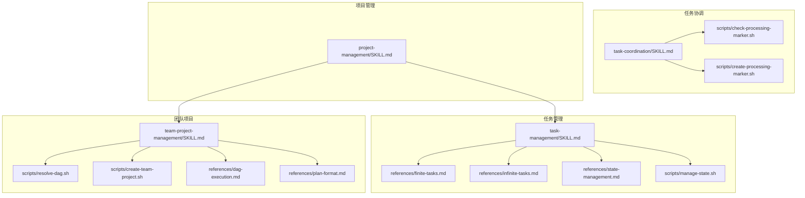
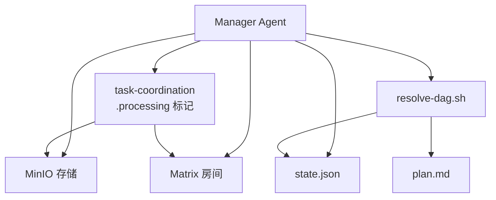
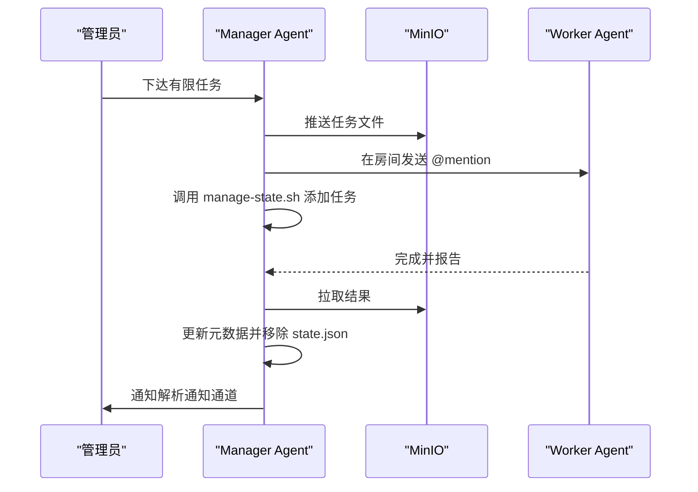
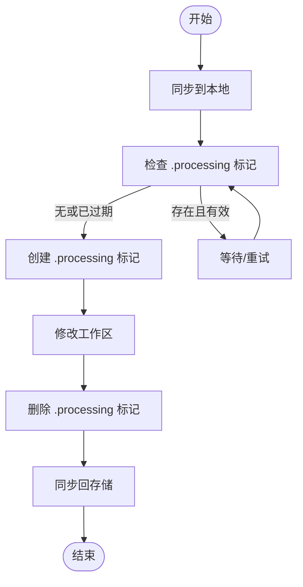
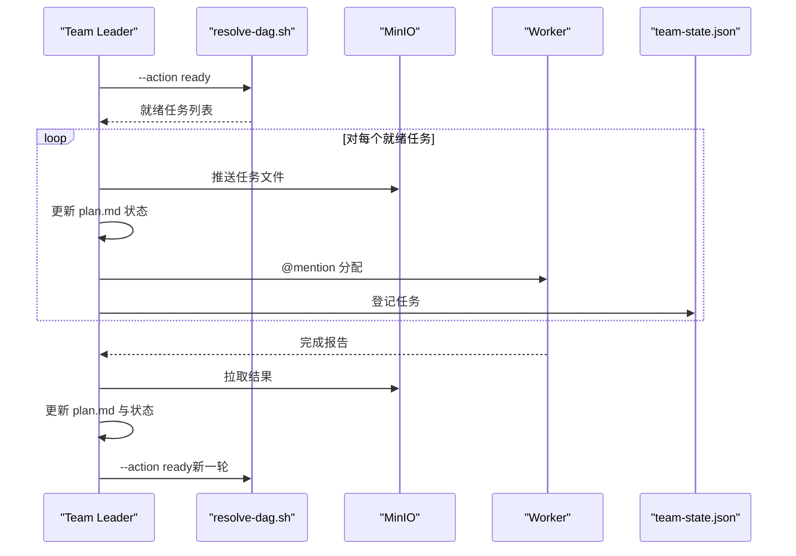
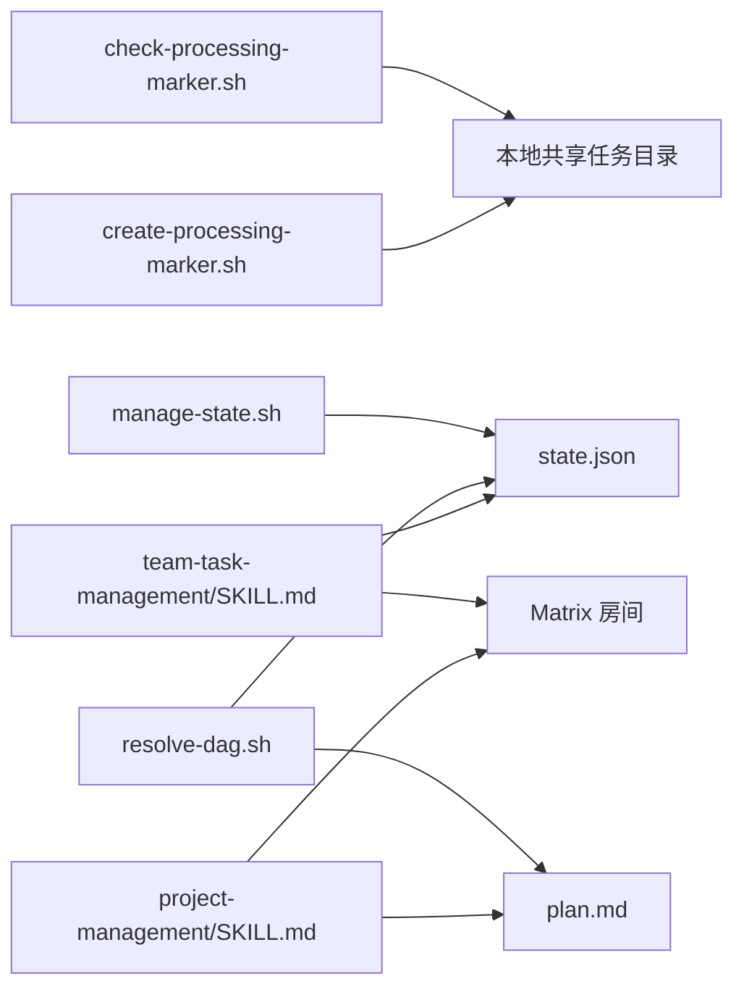

# 任务项目技能

<cite>
**本文引用的文件**
- [manager/agent/skills/task-management/SKILL.md](file://manager/agent/skills/task-management/SKILL.md)
- [manager/agent/skills/task-management/references/finite-tasks.md](file://manager/agent/skills/task-management/references/finite-tasks.md)
- [manager/agent/skills/task-management/references/infinite-tasks.md](file://manager/agent/skills/task-management/references/infinite-tasks.md)
- [manager/agent/skills/task-management/references/state-management.md](file://manager/agent/skills/task-management/references/state-management.md)
- [manager/agent/skills/task-coordination/SKILL.md](file://manager/agent/skills/task-coordination/SKILL.md)
- [manager/agent/skills/task-coordination/scripts/check-processing-marker.sh](file://manager/agent/skills/task-coordination/scripts/check-processing-marker.sh)
- [manager/agent/skills/task-coordination/scripts/create-processing-marker.sh](file://manager/agent/skills/task-coordination/scripts/create-processing-marker.sh)
- [manager/agent/skills/project-management/SKILL.md](file://manager/agent/skills/project-management/SKILL.md)
- [manager/agent/team-leader-agent/skills/team-task-management/SKILL.md](file://manager/agent/team-leader-agent/skills/team-task-management/SKILL.md)
- [manager/agent/team-leader-agent/skills/team-project-management/SKILL.md](file://manager/agent/team-leader-agent/skills/team-project-management/SKILL.md)
- [manager/agent/team-leader-agent/skills/team-project-management/references/dag-execution.md](file://manager/agent/team-leader-agent/skills/team-project-management/references/dag-execution.md)
- [manager/agent/team-leader-agent/skills/team-project-management/references/plan-format.md](file://manager/agent/team-leader-agent/skills/team-project-management/references/plan-format.md)
- [manager/agent/team-leader-agent/skills/team-project-management/scripts/resolve-dag.sh](file://manager/agent/team-leader-agent/skills/team-project-management/scripts/resolve-dag.sh)
- [manager/agent/team-leader-agent/skills/team-project-management/scripts/create-team-project.sh](file://manager/agent/team-leader-agent/skills/team-project-management/scripts/create-team-project.sh)
- [manager/agent/skills/task-management/scripts/manage-state.sh](file://manager/agent/skills/task-management/scripts/manage-state.sh)
</cite>

## 目录
1. [简介](#简介)
2. [项目结构](#项目结构)
3. [核心组件](#核心组件)
4. [架构总览](#架构总览)
5. [详细组件分析](#详细组件分析)
6. [依赖关系分析](#依赖关系分析)
7. [性能考量](#性能考量)
8. [故障排查指南](#故障排查指南)
9. [结论](#结论)
10. [附录](#附录)

## 简介
本文件系统化梳理 HiClaw Manager 的“任务项目技能”，覆盖以下能力：
- 任务管理：有限任务与无限任务的生命周期与触发机制
- 项目管理：以 plan.md 为单源真相的团队协作与计划治理
- 任务协调：通过 .processing 标记文件避免共享工作区冲突
- 团队项目与 DAG 执行：多 Worker 并行与串行依赖的编排
- 进度跟踪与状态同步：基于 state.json 的心跳驱动与通知通道解析

目标是帮助非技术读者理解整体流程，同时为技术读者提供可落地的实现路径与最佳实践。

## 项目结构
围绕“任务项目技能”的知识与脚本分布如下：
- 任务管理（有限/无限）与状态管理：位于 manager/agent/skills/task-management
- 任务协调（共享工作区互斥）：位于 manager/agent/skills/task-coordination
- 项目管理（单源真相与房间治理）：位于 manager/agent/skills/project-management
- 团队任务与团队项目（含 DAG 解析与执行）：位于 manager/agent/team-leader-agent/skills

图示来源
- [manager/agent/skills/task-management/SKILL.md:1-30](file://manager/agent/skills/task-management/SKILL.md#L1-L30)
- [manager/agent/skills/task-management/references/finite-tasks.md:1-110](file://manager/agent/skills/task-management/references/finite-tasks.md#L1-L110)
- [manager/agent/skills/task-management/references/infinite-tasks.md:1-44](file://manager/agent/skills/task-management/references/infinite-tasks.md#L1-L44)
- [manager/agent/skills/task-management/references/state-management.md:1-36](file://manager/agent/skills/task-management/references/state-management.md#L1-L36)
- [manager/agent/skills/task-management/scripts/manage-state.sh:1-294](file://manager/agent/skills/task-management/scripts/manage-state.sh#L1-L294)
- [manager/agent/skills/task-coordination/SKILL.md:1-153](file://manager/agent/skills/task-coordination/SKILL.md#L1-L153)
- [manager/agent/skills/task-coordination/scripts/check-processing-marker.sh:1-67](file://manager/agent/skills/task-coordination/scripts/check-processing-marker.sh#L1-L67)
- [manager/agent/skills/task-coordination/scripts/create-processing-marker.sh:1-46](file://manager/agent/skills/task-coordination/scripts/create-processing-marker.sh#L1-L46)
- [manager/agent/skills/project-management/SKILL.md:1-37](file://manager/agent/skills/project-management/SKILL.md#L1-L37)
- [manager/agent/team-leader-agent/skills/team-project-management/SKILL.md:1-48](file://manager/agent/team-leader-agent/skills/team-project-management/SKILL.md#L1-L48)
- [manager/agent/team-leader-agent/skills/team-project-management/scripts/resolve-dag.sh:1-239](file://manager/agent/team-leader-agent/skills/team-project-management/scripts/resolve-dag.sh#L1-L239)
- [manager/agent/team-leader-agent/skills/team-project-management/scripts/create-team-project.sh:1-148](file://manager/agent/team-leader-agent/skills/team-project-management/scripts/create-team-project.sh#L1-L148)
- [manager/agent/team-leader-agent/skills/team-project-management/references/dag-execution.md:1-131](file://manager/agent/team-leader-agent/skills/team-project-management/references/dag-execution.md#L1-L131)
- [manager/agent/team-leader-agent/skills/team-project-management/references/plan-format.md:1-95](file://manager/agent/team-leader-agent/skills/team-project-management/references/plan-format.md#L1-L95)

章节来源
- [manager/agent/skills/task-management/SKILL.md:1-30](file://manager/agent/skills/task-management/SKILL.md#L1-L30)
- [manager/agent/skills/project-management/SKILL.md:1-37](file://manager/agent/skills/project-management/SKILL.md#L1-L37)

## 核心组件
- 任务管理（有限/无限）
  - 有限任务：一次性交付型任务，完成后从 state.json 移除
  - 无限任务：按计划周期性执行，心跳触发，执行记录在 state.json 中更新下次时间
- 项目管理
  - 以 plan.md 为单源真相；项目房间必须包含人类管理员；遵循格式规范与变更日志
- 任务协调
  - 使用 .processing 标记文件在 Manager 与 Worker 访问共享工作区前进行互斥检查
- 团队项目与 DAG
  - 基于 plan.md 的 DAG 任务计划；支持验证无环、查询就绪任务、推进状态与并行执行

章节来源
- [manager/agent/skills/task-management/references/finite-tasks.md:1-110](file://manager/agent/skills/task-management/references/finite-tasks.md#L1-L110)
- [manager/agent/skills/task-management/references/infinite-tasks.md:1-44](file://manager/agent/skills/task-management/references/infinite-tasks.md#L1-L44)
- [manager/agent/skills/task-management/references/state-management.md:1-36](file://manager/agent/skills/task-management/references/state-management.md#L1-L36)
- [manager/agent/skills/project-management/SKILL.md:1-37](file://manager/agent/skills/project-management/SKILL.md#L1-L37)
- [manager/agent/skills/task-coordination/SKILL.md:1-153](file://manager/agent/skills/task-coordination/SKILL.md#L1-L153)
- [manager/agent/team-leader-agent/skills/team-project-management/SKILL.md:1-48](file://manager/agent/team-leader-agent/skills/team-project-management/SKILL.md#L1-L48)

## 架构总览
下图展示 Manager 在任务与项目层面的关键交互：任务分配、状态维护、通知通道解析、DAG 推进与并行执行。

图示来源
- [manager/agent/skills/task-management/scripts/manage-state.sh:1-294](file://manager/agent/skills/task-management/scripts/manage-state.sh#L1-L294)
- [manager/agent/team-leader-agent/skills/team-project-management/scripts/resolve-dag.sh:1-239](file://manager/agent/team-leader-agent/skills/team-project-management/scripts/resolve-dag.sh#L1-L239)
- [manager/agent/skills/task-coordination/SKILL.md:1-153](file://manager/agent/skills/task-coordination/SKILL.md#L1-L153)

## 详细组件分析

### 任务管理（有限/无限）
- 有限任务
  - 分配流程：生成任务目录与元数据，先推送到 MinIO，再在 Worker 房间发送 @mention，最后登记到 state.json
  - 完成流程：从 MinIO 拉取结果，更新元数据状态，移除 state.json，并按通道解析规则通知管理员
- 无限任务
  - 创建：写入元数据（类型为无限、状态为活跃），设置调度与时区，登记到 state.json
  - 触发：仅由心跳在满足条件时触发，禁止在完成回调中再次 @mention Worker
  - 记录：Worker 报告后仅更新 state.json 的下次执行时间，不立即触发下一次

图示来源
- [manager/agent/skills/task-management/references/finite-tasks.md:10-98](file://manager/agent/skills/task-management/references/finite-tasks.md#L10-L98)
- [manager/agent/skills/task-management/scripts/manage-state.sh:52-143](file://manager/agent/skills/task-management/scripts/manage-state.sh#L52-L143)

章节来源
- [manager/agent/skills/task-management/references/finite-tasks.md:1-110](file://manager/agent/skills/task-management/references/finite-tasks.md#L1-L110)
- [manager/agent/skills/task-management/references/infinite-tasks.md:1-44](file://manager/agent/skills/task-management/references/infinite-tasks.md#L1-L44)
- [manager/agent/skills/task-management/references/state-management.md:1-36](file://manager/agent/skills/task-management/references/state-management.md#L1-L36)
- [manager/agent/skills/task-management/scripts/manage-state.sh:1-294](file://manager/agent/skills/task-management/scripts/manage-state.sh#L1-L294)

### 任务协调（共享工作区互斥）
- 问题：Manager 与 Worker 可能同时修改同一任务工作区，导致冲突
- 方案：使用 .processing 标记文件表达“正在处理”，双方在修改前必须检查标记
- 协作协议（简化版）：
  1) 同步到本地
  2) 检查 .processing 标记（存在且未过期则等待）
  3) 创建标记（记录处理器、开始与过期时间）
  4) 修改工作区
  5) 删除标记
  6) 同步回存储

图示来源
- [manager/agent/skills/task-coordination/SKILL.md:64-95](file://manager/agent/skills/task-coordination/SKILL.md#L64-L95)
- [manager/agent/skills/task-coordination/scripts/check-processing-marker.sh:1-67](file://manager/agent/skills/task-coordination/scripts/check-processing-marker.sh#L1-L67)
- [manager/agent/skills/task-coordination/scripts/create-processing-marker.sh:1-46](file://manager/agent/skills/task-coordination/scripts/create-processing-marker.sh#L1-L46)

章节来源
- [manager/agent/skills/task-coordination/SKILL.md:1-153](file://manager/agent/skills/task-coordination/SKILL.md#L1-L153)
- [manager/agent/skills/task-coordination/scripts/check-processing-marker.sh:1-67](file://manager/agent/skills/task-coordination/scripts/check-processing-marker.sh#L1-L67)
- [manager/agent/skills/task-coordination/scripts/create-processing-marker.sh:1-46](file://manager/agent/skills/task-coordination/scripts/create-processing-marker.sh#L1-L46)

### 项目管理（单源真相与房间治理）
- 单源真相：plan.md 记录任务状态、分配与依赖
- 房间治理：项目房间必须包含管理员；语言需适配管理员偏好
- 变更治理：任何变更需同步到 MinIO；修订待完成前不得进入下一阶段

章节来源
- [manager/agent/skills/project-management/SKILL.md:1-37](file://manager/agent/skills/project-management/SKILL.md#L1-L37)

### 团队项目与 DAG 执行
- DAG 解析：从 plan.md 提取任务行，解析状态与依赖，支持 ready/status/validate 三种动作
- 执行循环：resolve-dag.sh 返回就绪任务 → 逐个创建任务目录/推送/更新 plan.md → @mention Worker → 完成后推进状态并继续 resolve
- 并行执行：当 ready 返回多个任务时，应同时分配给不同 Worker 并行执行
- 心跳集成：心跳周期内拉取 plan.md、自动分配未分配的就绪任务、跟进超时任务、必要时升级

图示来源
- [manager/agent/team-leader-agent/skills/team-project-management/references/dag-execution.md:1-131](file://manager/agent/team-leader-agent/skills/team-project-management/references/dag-execution.md#L1-L131)
- [manager/agent/team-leader-agent/skills/team-project-management/scripts/resolve-dag.sh:1-239](file://manager/agent/team-leader-agent/skills/team-project-management/scripts/resolve-dag.sh#L1-L239)

章节来源
- [manager/agent/team-leader-agent/skills/team-project-management/SKILL.md:1-48](file://manager/agent/team-leader-agent/skills/team-project-management/SKILL.md#L1-L48)
- [manager/agent/team-leader-agent/skills/team-project-management/references/dag-execution.md:1-131](file://manager/agent/team-leader-agent/skills/team-project-management/references/dag-execution.md#L1-L131)
- [manager/agent/team-leader-agent/skills/team-project-management/references/plan-format.md:1-95](file://manager/agent/team-leader-agent/skills/team-project-management/references/plan-format.md#L1-L95)
- [manager/agent/team-leader-agent/skills/team-project-management/scripts/resolve-dag.sh:1-239](file://manager/agent/team-leader-agent/skills/team-project-management/scripts/resolve-dag.sh#L1-L239)

### 团队任务管理（单任务编排）
- 分配三步法：写 spec.md → 发送 @mention → 登记 team-state.json
- 关键要点：严禁自行执行 Worker 工作；通过 copaw channels send 与 Matrix 通信；严格使用脚本维护状态

章节来源
- [manager/agent/team-leader-agent/skills/team-task-management/SKILL.md:1-103](file://manager/agent/team-leader-agent/skills/team-task-management/SKILL.md#L1-L103)

## 依赖关系分析
- 组件耦合
  - 任务管理与状态管理强耦合：所有任务增删改均通过 manage-state.sh 原子写入 state.json
  - 任务协调与存储/房间强耦合：.processing 标记与 MinIO 同步配合，确保一致性
  - 团队项目与 DAG 解析强耦合：resolve-dag.sh 是 DAG 执行的唯一权威
- 外部依赖
  - MinIO：任务与项目文件的持久化与同步
  - Matrix：任务通知与房间协作
  - Shell 工具链：jq、mc、date 等

图示来源
- [manager/agent/skills/task-management/scripts/manage-state.sh:1-294](file://manager/agent/skills/task-management/scripts/manage-state.sh#L1-L294)
- [manager/agent/skills/task-coordination/scripts/check-processing-marker.sh:1-67](file://manager/agent/skills/task-coordination/scripts/check-processing-marker.sh#L1-L67)
- [manager/agent/skills/task-coordination/scripts/create-processing-marker.sh:1-46](file://manager/agent/skills/task-coordination/scripts/create-processing-marker.sh#L1-L46)
- [manager/agent/team-leader-agent/skills/team-project-management/scripts/resolve-dag.sh:1-239](file://manager/agent/team-leader-agent/skills/team-project-management/scripts/resolve-dag.sh#L1-L239)
- [manager/agent/team-leader-agent/skills/team-task-management/SKILL.md:1-103](file://manager/agent/team-leader-agent/skills/team-task-management/SKILL.md#L1-L103)
- [manager/agent/skills/project-management/SKILL.md:1-37](file://manager/agent/skills/project-management/SKILL.md#L1-L37)

## 性能考量
- 并行执行
  - DAG 就绪任务应同时分配，充分利用多 Worker 并行，减少总周期
- 写入原子性
  - state.json 通过临时文件+覆盖写入，避免并发写冲突
- 存储同步
  - 先同步到 MinIO 再通知 Worker，确保文件可见性；完成后回拉结果，避免中间态读取
- 心跳节律
  - 无限任务仅在心跳周期内触发，避免高频轮询

## 故障排查指南
- 任务未被 Worker 执行或被强制停止
  - 检查是否已在 state.json 中登记；未登记会导致空闲超时回收容器
  - 章节来源: [manager/agent/skills/task-management/SKILL.md:14-14](file://manager/agent/skills/task-management/SKILL.md#L14-L14)
- 无限任务重复触发或循环
  - 不要在 Worker 报告后立即再次 @mention；仅在 state.json 中记录执行时间
  - 章节来源: [manager/agent/skills/task-management/references/infinite-tasks.md:34-43](file://manager/agent/skills/task-management/references/infinite-tasks.md#L34-L43)
- 共享工作区冲突
  - 检查 .processing 标记是否存在且未过期；若存在，等待或清理过期标记后再操作
  - 章节来源: [manager/agent/skills/task-coordination/SKILL.md:64-95](file://manager/agent/skills/task-coordination/SKILL.md#L64-L95)
- DAG 死锁或无法推进
  - 使用 validate 动作检查有无环；确认依赖的任务 ID 是否存在于 plan.md
  - 章节来源: [manager/agent/team-leader-agent/skills/team-project-management/scripts/resolve-dag.sh:159-226](file://manager/agent/team-leader-agent/skills/team-project-management/scripts/resolve-dag.sh#L159-L226)
- 通知通道异常
  - 使用通知通道解析脚本，优先使用主通道；若为空则回退到缓存的管理员 DM
  - 章节来源: [manager/agent/skills/task-management/references/state-management.md:27-35](file://manager/agent/skills/task-management/references/state-management.md#L27-L35)

## 结论
HiClaw Manager 的“任务项目技能”以 state.json 与 plan.md 为核心，结合 MinIO 与 Matrix 实现任务与项目的全生命周期编排。通过 .processing 标记与 DAG 解析，系统在保证一致性的同时实现了高并发与可扩展的协作模式。建议在实践中严格遵循脚本化的状态与存储操作，确保流程稳定与可观测。

## 附录
- 最佳实践清单
  - 有限任务：先推送到 MinIO，再 @mention Worker，最后登记 state.json
  - 无限任务：仅通过心跳触发，完成回调仅更新状态
  - 协调互斥：修改前必检 .processing，修改后及时清理
  - DAG：先 validate，再 ready，再并行分配，完成后立即二次 resolve
  - 项目治理：plan.md 为单源真相，房间必须包含管理员，语言适配管理员偏好