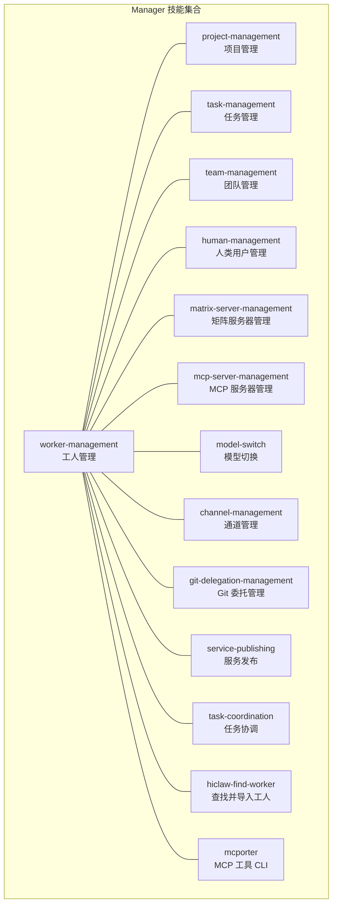
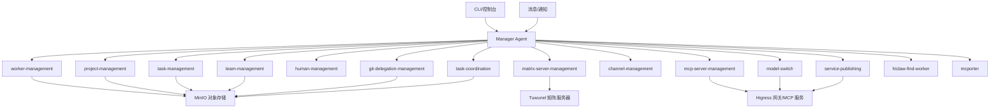
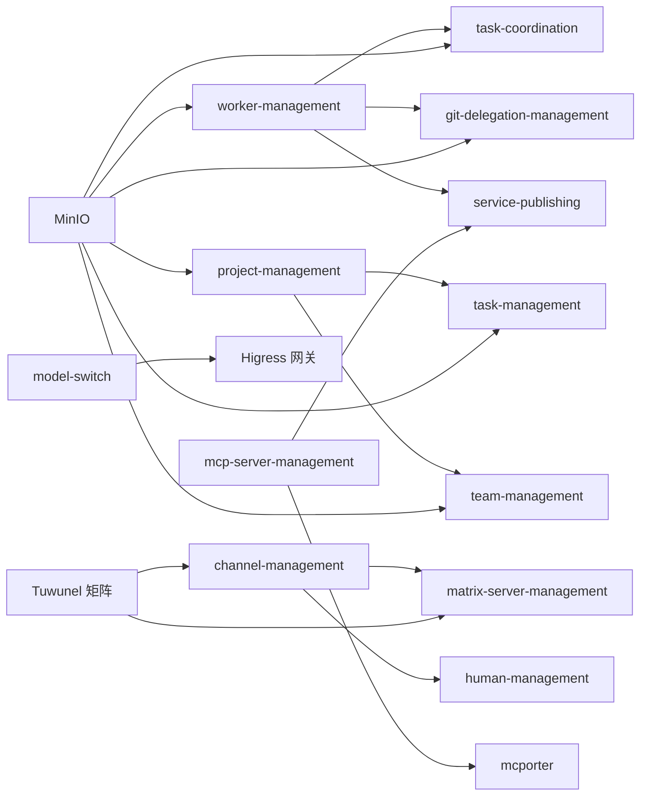

# 内置技能概览

<cite>
**本文引用的文件**
- [worker-management/SKILL.md](file://manager/agent/skills/worker-management/SKILL.md)
- [project-management/SKILL.md](file://manager/agent/skills/project-management/SKILL.md)
- [task-management/SKILL.md](file://manager/agent/skills/task-management/SKILL.md)
- [team-management/SKILL.md](file://manager/agent/skills/team-management/SKILL.md)
- [human-management/SKILL.md](file://manager/agent/skills/human-management/SKILL.md)
- [matrix-server-management/SKILL.md](file://manager/agent/skills/matrix-server-management/SKILL.md)
- [mcp-server-management/SKILL.md](file://manager/agent/skills/mcp-server-management/SKILL.md)
- [model-switch/SKILL.md](file://manager/agent/skills/model-switch/SKILL.md)
- [channel-management/SKILL.md](file://manager/agent/skills/channel-management/SKILL.md)
- [git-delegation-management/SKILL.md](file://manager/agent/skills/git-delegation-management/SKILL.md)
- [service-publishing/SKILL.md](file://manager/agent/skills/service-publishing/SKILL.md)
- [task-coordination/SKILL.md](file://manager/agent/skills/task-coordination/SKILL.md)
- [hiclaw-find-worker/SKILL.md](file://manager/agent/skills/hiclaw-find-worker/SKILL.md)
- [mcporter/SKILL.md](file://manager/agent/skills/mcporter/SKILL.md)
</cite>

## 目录
1. [简介](#简介)
2. [项目结构](#项目结构)
3. [核心组件](#核心组件)
4. [架构总览](#架构总览)
5. [详细组件分析](#详细组件分析)
6. [依赖关系分析](#依赖关系分析)
7. [性能考虑](#性能考虑)
8. [故障排查指南](#故障排查指南)
9. [结论](#结论)
10. [附录](#附录)

## 简介
本文件为 HiClaw Manager 内置技能系统的概览文档，面向管理员与平台使用者，系统性介绍 16 个内置技能的整体架构、分类体系、统一规范与标准接口、自动发现与加载流程，以及扩展框架与开发规范。文档同时提供技能分类、功能定位与典型使用场景的综合说明，帮助读者快速理解与高效使用。

## 项目结构
HiClaw Manager 的内置技能集中于 manager/agent/skills 目录下，每个技能以独立目录呈现，并在根部包含 SKILL.md 文档，用于声明技能名称、描述、职责边界、操作参考与注意事项等。技能按“管理域”划分，覆盖 Worker 生命周期、任务与项目编排、团队协作、人类用户管理、矩阵服务、MCP 工具链、模型切换、通道与身份识别、Git 委托、服务发布、任务协调与发现等。

图表来源
- [worker-management/SKILL.md:1-83](file://manager/agent/skills/worker-management/SKILL.md#L1-L83)
- [project-management/SKILL.md:1-37](file://manager/agent/skills/project-management/SKILL.md#L1-L37)
- [task-management/SKILL.md:1-30](file://manager/agent/skills/task-management/SKILL.md#L1-L30)
- [team-management/SKILL.md:1-48](file://manager/agent/skills/team-management/SKILL.md#L1-L48)
- [human-management/SKILL.md:1-45](file://manager/agent/skills/human-management/SKILL.md#L1-L45)
- [matrix-server-management/SKILL.md:1-23](file://manager/agent/skills/matrix-server-management/SKILL.md#L1-L23)
- [mcp-server-management/SKILL.md:1-33](file://manager/agent/skills/mcp-server-management/SKILL.md#L1-L33)
- [model-switch/SKILL.md:1-83](file://manager/agent/skills/model-switch/SKILL.md#L1-L83)
- [channel-management/SKILL.md:1-30](file://manager/agent/skills/channel-management/SKILL.md#L1-L30)
- [git-delegation-management/SKILL.md:1-167](file://manager/agent/skills/git-delegation-management/SKILL.md#L1-L167)
- [service-publishing/SKILL.md:1-92](file://manager/agent/skills/service-publishing/SKILL.md#L1-L92)
- [task-coordination/SKILL.md:1-153](file://manager/agent/skills/task-coordination/SKILL.md#L1-L153)
- [hiclaw-find-worker/SKILL.md:1-52](file://manager/agent/skills/hiclaw-find-worker/SKILL.md#L1-L52)
- [mcporter/SKILL.md:1-41](file://manager/agent/skills/mcporter/SKILL.md#L1-L41)

章节来源
- [worker-management/SKILL.md:1-83](file://manager/agent/skills/worker-management/SKILL.md#L1-L83)
- [project-management/SKILL.md:1-37](file://manager/agent/skills/project-management/SKILL.md#L1-L37)
- [task-management/SKILL.md:1-30](file://manager/agent/skills/task-management/SKILL.md#L1-L30)
- [team-management/SKILL.md:1-48](file://manager/agent/skills/team-management/SKILL.md#L1-L48)
- [human-management/SKILL.md:1-45](file://manager/agent/skills/human-management/SKILL.md#L1-L45)
- [matrix-server-management/SKILL.md:1-23](file://manager/agent/skills/matrix-server-management/SKILL.md#L1-L23)
- [mcp-server-management/SKILL.md:1-33](file://manager/agent/skills/mcp-server-management/SKILL.md#L1-L33)
- [model-switch/SKILL.md:1-83](file://manager/agent/skills/model-switch/SKILL.md#L1-L83)
- [channel-management/SKILL.md:1-30](file://manager/agent/skills/channel-management/SKILL.md#L1-L30)
- [git-delegation-management/SKILL.md:1-167](file://manager/agent/skills/git-delegation-management/SKILL.md#L1-L167)
- [service-publishing/SKILL.md:1-92](file://manager/agent/skills/service-publishing/SKILL.md#L1-L92)
- [task-coordination/SKILL.md:1-153](file://manager/agent/skills/task-coordination/SKILL.md#L1-L153)
- [hiclaw-find-worker/SKILL.md:1-52](file://manager/agent/skills/hiclaw-find-worker/SKILL.md#L1-L52)
- [mcporter/SKILL.md:1-41](file://manager/agent/skills/mcporter/SKILL.md#L1-L41)

## 核心组件
- 统一规范与标准接口
  - 每个技能通过 SKILL.md 声明：名称、简要描述、职责边界、操作参考、关键脚本/命令、注意事项与最佳实践。
  - 技能之间通过标准消息协议、共享存储（MinIO）、矩阵房间与 MCP 工具链进行交互。
  - 关键脚本与命令集中在 scripts/ 子目录，便于自动化与可重复执行。
- 自动发现与加载
  - Manager Agent 在启动时扫描 skills/ 目录，读取每个 SKILL.md 的元数据，构建技能索引。
  - 通过 CLI 或消息触发时，根据技能名称与职责边界动态路由到对应脚本或工具。
- 扩展框架与开发规范
  - 新增技能需提供 SKILL.md 元信息与最小可运行脚本，遵循“只做一件事且做好”的单一职责原则。
  - 使用统一的错误处理与日志输出格式，确保可观测性与可维护性。

章节来源
- [worker-management/SKILL.md:1-83](file://manager/agent/skills/worker-management/SKILL.md#L1-L83)
- [task-coordination/SKILL.md:1-153](file://manager/agent/skills/task-coordination/SKILL.md#L1-L153)
- [mcporter/SKILL.md:1-41](file://manager/agent/skills/mcporter/SKILL.md#L1-L41)

## 架构总览
下图展示 Manager 内置技能的总体交互关系：技能通过 CLI、消息与工具链协同工作，围绕 Worker、任务、项目、团队、人类用户、矩阵与 MCP 服务展开。

图表来源
- [worker-management/SKILL.md:1-83](file://manager/agent/skills/worker-management/SKILL.md#L1-L83)
- [project-management/SKILL.md:1-37](file://manager/agent/skills/project-management/SKILL.md#L1-L37)
- [task-management/SKILL.md:1-30](file://manager/agent/skills/task-management/SKILL.md#L1-L30)
- [team-management/SKILL.md:1-48](file://manager/agent/skills/team-management/SKILL.md#L1-L48)
- [human-management/SKILL.md:1-45](file://manager/agent/skills/human-management/SKILL.md#L1-L45)
- [matrix-server-management/SKILL.md:1-23](file://manager/agent/skills/matrix-server-management/SKILL.md#L1-L23)
- [mcp-server-management/SKILL.md:1-33](file://manager/agent/skills/mcp-server-management/SKILL.md#L1-L33)
- [model-switch/SKILL.md:1-83](file://manager/agent/skills/model-switch/SKILL.md#L1-L83)
- [channel-management/SKILL.md:1-30](file://manager/agent/skills/channel-management/SKILL.md#L1-L30)
- [git-delegation-management/SKILL.md:1-167](file://manager/agent/skills/git-delegation-management/SKILL.md#L1-L167)
- [service-publishing/SKILL.md:1-92](file://manager/agent/skills/service-publishing/SKILL.md#L1-L92)
- [task-coordination/SKILL.md:1-153](file://manager/agent/skills/task-coordination/SKILL.md#L1-L153)
- [hiclaw-find-worker/SKILL.md:1-52](file://manager/agent/skills/hiclaw-find-worker/SKILL.md#L1-L52)
- [mcporter/SKILL.md:1-41](file://manager/agent/skills/mcporter/SKILL.md#L1-L41)

## 详细组件分析

### 工人管理（worker-management）
- 功能定位：管理员手动生成/重置 Worker、启停/检查 Worker、推送/移除技能、启用/关闭同僚 @ 提及、打开/关闭 CoPaw 控制台、切换运行时等。
- 关键要点：
  - 默认包含 file-sync、task-progress、project-participation 技能。
  - 切换运行时会重建容器，保留 Matrix 账号/房间/网关消费者/MinIO 数据，丢失容器内临时状态。
  - 远程模式（--remote）由管理员本地运行，控制器无法重建。
- 使用场景：新 Worker 快速创建、批量启停、技能动态调整、跨运行时迁移。

章节来源
- [worker-management/SKILL.md:1-83](file://manager/agent/skills/worker-management/SKILL.md#L1-L83)

### 项目管理（project-management）
- 功能定位：启动多 Worker 项目、处理项目房间中的任务完成通知、变更计划、解决阻塞任务等。
- 关键要点：
  - 项目包含项目房间（Matrix）、单源真理 plan.md、meta.json 与各任务文件。
  - YOLO 模式下需自动确认；必须包含人类管理员；plan.md 是权威依据。
- 使用场景：多阶段项目编排、跨 Worker 协作、计划修订与阻塞处理。

章节来源
- [project-management/SKILL.md:1-37](file://manager/agent/skills/project-management/SKILL.md#L1-L37)

### 任务管理（task-management）
- 功能定位：委派一次性/周期性任务、处理 Worker 完成报告、管理 Worker 可用性、更新状态等。
- 关键要点：
  - 遇到不熟悉的领域先建议 Worker 使用 find-skills 搜索相关技能。
  - 无限循环任务仅心跳触发，避免持续 @ 提及导致的资源消耗。
  - 所有委派任务必须登记到 state.json，否则 Worker 可能因空闲超时被自动停止。
- 使用场景：日常任务委派、状态同步与通知、任务生命周期管理。

章节来源
- [task-management/SKILL.md:1-30](file://manager/agent/skills/task-management/SKILL.md#L1-L30)

### 团队管理（team-management）
- 功能定位：创建/导入团队、管理团队组成、向 Team Leader 委派任务、添加/移除团队成员等。
- 关键要点：
  - Team Leader 是具备管理技能的特殊 Worker，负责在团队内部分解与协调任务。
  - 管理员仅与 Team Leader 通讯，Team Room 包含 Team Admin 与所有成员。
  - Controller 强制团队成员使用 copaw 运行时。
- 使用场景：跨 Worker 的团队协作、任务分发与进度跟踪。

章节来源
- [team-management/SKILL.md:1-48](file://manager/agent/skills/team-management/SKILL.md#L1-L48)

### 人类用户管理（human-management）
- 功能定位：导入真实人类用户、配置权限级别、变更权限、移除访问等。
- 权限层级（包含关系）：
  - 1：可与 Manager、所有 Team Leaders 与 Workers 通讯（CTO/技术负责人）。
  - 2：指定 Team Leaders、其 Workers 与指定独立 Worker。
  - 3：仅指定 Workers。
- 使用场景：外部合作者接入、权限精细化控制、账号生命周期管理。

章节来源
- [human-management/SKILL.md:1-45](file://manager/agent/skills/human-management/SKILL.md#L1-L45)

### 矩阵服务器管理（matrix-server-management）
- 功能定位：独立的矩阵服务管理（注册用户、创建房间、管理成员、上传文件），以及通过矩阵媒体上传发送文件。
- 关键要点：
  - Workers 忽略无 m.mentions 的消息；必须包含完整 Matrix 用户 ID。
  - 不要在该技能中处理 Worker/项目创建；这些由专用技能处理。
- 使用场景：矩阵侧运维、文件传输、房间治理。

章节来源
- [matrix-server-management/SKILL.md:1-23](file://manager/agent/skills/matrix-server-management/SKILL.md#L1-L23)

### MCP 服务器管理（mcp-server-management）
- 功能定位：配置 MCP 工具服务器（如 GitHub、天气 API）、轮换凭据、授权/撤销 Worker 访问、通过 YAML 添加自定义 API 集成等。
- 关键要点：
  - 云模式不支持脚本式 MCP 管理，需前往阿里云 AI 网关控制台。
  - 授权是替换操作，需包含所有消费者。
  - 始终端到端验证后再通知 Worker。
- 使用场景：外部工具集成、API 代理与路由、凭据安全轮换。

章节来源
- [mcp-server-management/SKILL.md:1-33](file://manager/agent/skills/mcp-server-management/SKILL.md#L1-L33)

### 模型切换（model-switch）
- 功能定位：切换 Manager Agent 自身的 LLM 主模型，支持上下文窗口与推理开关配置。
- 关键流程：
  - 测试网关连通性 → 更新 openclaw.json → 输出 RESTART_REQUIRED。
  - 成功后需执行 openclaw gateway restart 生效。
- 使用场景：根据需求选择不同模型、临时会话模型切换（非持久化）。

章节来源
- [model-switch/SKILL.md:1-83](file://manager/agent/skills/model-switch/SKILL.md#L1-L83)

### 通道管理（channel-management）
- 功能定位：确定消息发送方身份、管理受信任联系人、配置管理员主通知通道、处理新通道首次接触、跨通道升级等。
- 关键要点：
  - 主通道不可设为“matrix”，默认回退至 Matrix DM。
  - 未知发件人在群组房间必须静默忽略，直至管理员明确批准为受信任联系人。
  - 任务派发必须走 Worker 房间，不得嵌入管理员 DM。
- 使用场景：跨渠道沟通、身份识别与信任建立、首触协议与升级流程。

章节来源
- [channel-management/SKILL.md:1-30](file://manager/agent/skills/channel-management/SKILL.md#L1-L30)

### Git 委托管理（git-delegation-management）
- 功能定位：代表无法直接访问 Git 凭据的 Worker 执行任意 Git 操作（clone/push/pull/commit/rebase 等）。
- 关键流程：
  - 解析 git-request 结构化请求 → 同步任务目录 → 检查 .processing 标记 → 创建标记 → 执行命令 → 清理标记 → 同步回存储 → 成功/失败反馈。
- 使用场景：跨阶段协作、多人共享仓库、冲突处理与权限隔离。

章节来源
- [git-delegation-management/SKILL.md:1-167](file://manager/agent/skills/git-delegation-management/SKILL.md#L1-L167)

### 服务发布（service-publishing）
- 功能定位：通过 Higress 网关对外暴露 Worker 容器内的 HTTP 服务，生成自动域名。
- 关键流程：
  - 在 Worker 规格中添加 expose 字段 → 控制器自动创建域名、服务源与路由。
- 使用场景：Web 应用/API 外放、临时服务暴露、团队联调。

章节来源
- [service-publishing/SKILL.md:1-92](file://manager/agent/skills/service-publishing/SKILL.md#L1-L92)

### 任务协调（task-coordination）
- 功能定位：通过 .processing 标记文件协调对共享任务目录的并发访问，避免 Manager 与 Worker 同时修改引发冲突。
- 关键流程：
  - 同步 → 检查标记 → 创建标记 → 修改 → 移除标记 → 同步回存储。
- 使用场景：Git 委托、文件同步、多角色协作。

章节来源
- [task-coordination/SKILL.md:1-153](file://manager/agent/skills/task-coordination/SKILL.md#L1-L153)

### 查找并导入工人（hiclaw-find-worker）
- 功能定位：在 Nacos 中搜索合适的 Worker 并导入，或直接安装管理员提供的包 URI。
- 关键流程：
  - 搜索需求 → 推荐候选 → 确认后安装 → 失败直接上报。
- 使用场景：按需引入已有能力 Worker、市场导入、模板安装。

章节来源
- [hiclaw-find-worker/SKILL.md:1-52](file://manager/agent/skills/hiclaw-find-worker/SKILL.md#L1-L52)

### MCP 工具 CLI（mcporter）
- 功能定位：直接调用已配置的 MCP 服务器工具，用于快速查询或决策前的验证。
- 使用场景：GitHub 搜索、天气查询、API 验证、工具发现与参数校验。

章节来源
- [mcporter/SKILL.md:1-41](file://manager/agent/skills/mcporter/SKILL.md#L1-L41)

## 依赖关系分析
- 技能内聚与耦合
  - worker-management 与 task-coordination、git-delegation-management、service-publishing 等存在直接协作关系（例如 Git 委托前后的标记与同步）。
  - project-management 与 task-management、team-management 协同，共同构成项目生命周期闭环。
  - channel-management 与 matrix-server-management、human-management 共同保障沟通与权限。
  - mcp-server-management 与 mcporter、service-publishing 共同支撑外部工具与服务暴露。
- 外部依赖
  - MinIO：作为共享存储，贯穿任务目录、项目资料与结果回传。
  - Tuwunel 矩阵：提供消息通道与房间管理。
  - Higress 网关：提供 MCP 代理与服务暴露能力。
- 循环依赖与风险
  - 技能间通过脚本与工具链解耦，未见直接循环依赖；但需注意 Git 委托与任务协调的时序一致性。

图表来源
- [worker-management/SKILL.md:1-83](file://manager/agent/skills/worker-management/SKILL.md#L1-L83)
- [task-coordination/SKILL.md:1-153](file://manager/agent/skills/task-coordination/SKILL.md#L1-L153)
- [git-delegation-management/SKILL.md:1-167](file://manager/agent/skills/git-delegation-management/SKILL.md#L1-L167)
- [service-publishing/SKILL.md:1-92](file://manager/agent/skills/service-publishing/SKILL.md#L1-L92)
- [project-management/SKILL.md:1-37](file://manager/agent/skills/project-management/SKILL.md#L1-L37)
- [task-management/SKILL.md:1-30](file://manager/agent/skills/task-management/SKILL.md#L1-L30)
- [team-management/SKILL.md:1-48](file://manager/agent/skills/team-management/SKILL.md#L1-L48)
- [channel-management/SKILL.md:1-30](file://manager/agent/skills/channel-management/SKILL.md#L1-L30)
- [matrix-server-management/SKILL.md:1-23](file://manager/agent/skills/matrix-server-management/SKILL.md#L1-L23)
- [mcp-server-management/SKILL.md:1-33](file://manager/agent/skills/mcp-server-management/SKILL.md#L1-L33)
- [mcporter/SKILL.md:1-41](file://manager/agent/skills/mcporter/SKILL.md#L1-L41)
- [model-switch/SKILL.md:1-83](file://manager/agent/skills/model-switch/SKILL.md#L1-L83)

章节来源
- [worker-management/SKILL.md:1-83](file://manager/agent/skills/worker-management/SKILL.md#L1-L83)
- [task-coordination/SKILL.md:1-153](file://manager/agent/skills/task-coordination/SKILL.md#L1-L153)
- [git-delegation-management/SKILL.md:1-167](file://manager/agent/skills/git-delegation-management/SKILL.md#L1-L167)
- [service-publishing/SKILL.md:1-92](file://manager/agent/skills/service-publishing/SKILL.md#L1-L92)
- [project-management/SKILL.md:1-37](file://manager/agent/skills/project-management/SKILL.md#L1-L37)
- [task-management/SKILL.md:1-30](file://manager/agent/skills/task-management/SKILL.md#L1-L30)
- [team-management/SKILL.md:1-48](file://manager/agent/skills/team-management/SKILL.md#L1-L48)
- [channel-management/SKILL.md:1-30](file://manager/agent/skills/channel-management/SKILL.md#L1-L30)
- [matrix-server-management/SKILL.md:1-23](file://manager/agent/skills/matrix-server-management/SKILL.md#L1-L23)
- [mcp-server-management/SKILL.md:1-33](file://manager/agent/skills/mcp-server-management/SKILL.md#L1-L33)
- [mcporter/SKILL.md:1-41](file://manager/agent/skills/mcporter/SKILL.md#L1-L41)
- [model-switch/SKILL.md:1-83](file://manager/agent/skills/model-switch/SKILL.md#L1-L83)

## 性能考虑
- 并发与冲突避免：通过 .processing 标记与过期时间防止死锁；任务目录同步采用增量镜像策略，减少网络与磁盘压力。
- 任务派发与心跳：无限循环任务仅在心跳触发，避免高频 @ 提及导致的资源浪费。
- 网络与路由：MCP 与服务发布通过 Higress 网关统一路由，减少直连开销与复杂度。
- 缓存与重启：模型切换后需重启网关生效，避免热更新带来的状态不一致风险。

## 故障排查指南
- Git 委托失败
  - 检查 .processing 标记是否被占用；确认 Workspace 路径与操作列表正确；优先尝试修复常见问题（上游配置、用户本地配置）。
  - 若为凭据/权限问题，及时升级至管理员介入。
- 任务卡住或 Worker 被停止
  - 确认 state.json 是否登记了任务；检查 MinIO 文件同步是否及时；核对任务目录结构与标记状态。
- MCP 工具不可用
  - 使用 mcporter list/schema 发现工具与参数；验证网关连通性与消费者授权；必要时重新创建 MCP 服务器并验证。
- 模型切换失败
  - 确认当前默认 AI Provider 是否支持目标模型；在 Higress 控制台创建新的 Provider 与路由后重试。
- 矩阵消息未被 Worker 处理
  - 确保消息体与 m.mentions.user_ids 完全匹配；在群组房间中必须包含 @ 提及才会被处理。

章节来源
- [git-delegation-management/SKILL.md:137-167](file://manager/agent/skills/git-delegation-management/SKILL.md#L137-L167)
- [task-coordination/SKILL.md:145-153](file://manager/agent/skills/task-coordination/SKILL.md#L145-L153)
- [mcp-server-management/SKILL.md:10-33](file://manager/agent/skills/mcp-server-management/SKILL.md#L10-L33)
- [model-switch/SKILL.md:39-55](file://manager/agent/skills/model-switch/SKILL.md#L39-L55)
- [matrix-server-management/SKILL.md:10-17](file://manager/agent/skills/matrix-server-management/SKILL.md#L10-L17)

## 结论
HiClaw Manager 内置技能体系以“单一职责、标准化接口、可组合协作”为核心设计原则，围绕 Worker、任务、项目、团队、人类用户、矩阵与 MCP 服务形成完整的自动化编排能力。通过统一的元数据规范与脚本化实现，既保证了易用性与可维护性，也为后续扩展提供了清晰的路径与约束。

## 附录
- 技能清单与职责摘要
  - worker-management：工人生命周期与技能管理
  - project-management：项目计划与任务编排
  - task-management：任务委派与状态管理
  - team-management：团队组织与任务分发
  - human-management：人类用户与权限
  - matrix-server-management：矩阵服务与房间
  - mcp-server-management：MCP 工具与路由
  - model-switch：模型切换与网关重启
  - channel-management：通道与身份识别
  - git-delegation-management：Git 委托与冲突避免
  - service-publishing：服务暴露与域名生成
  - task-coordination：共享目录并发协调
  - hiclaw-find-worker：Nacos 工人搜索与导入
  - mcporter：MCP 工具 CLI