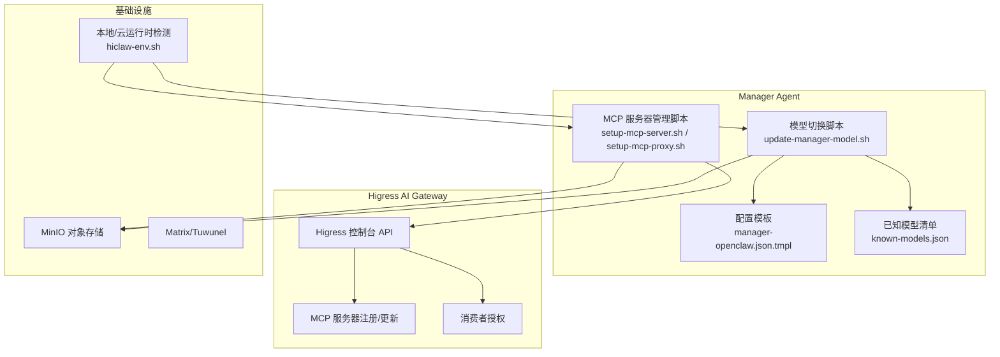
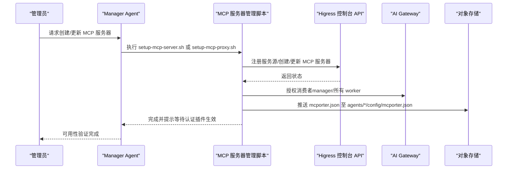
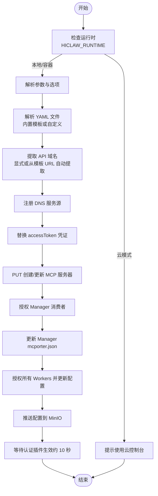
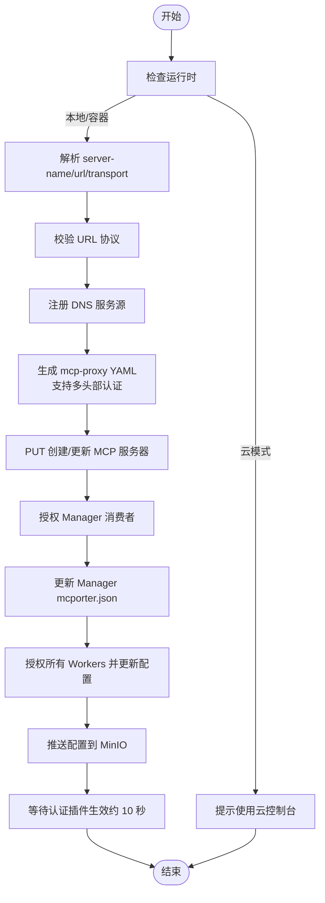
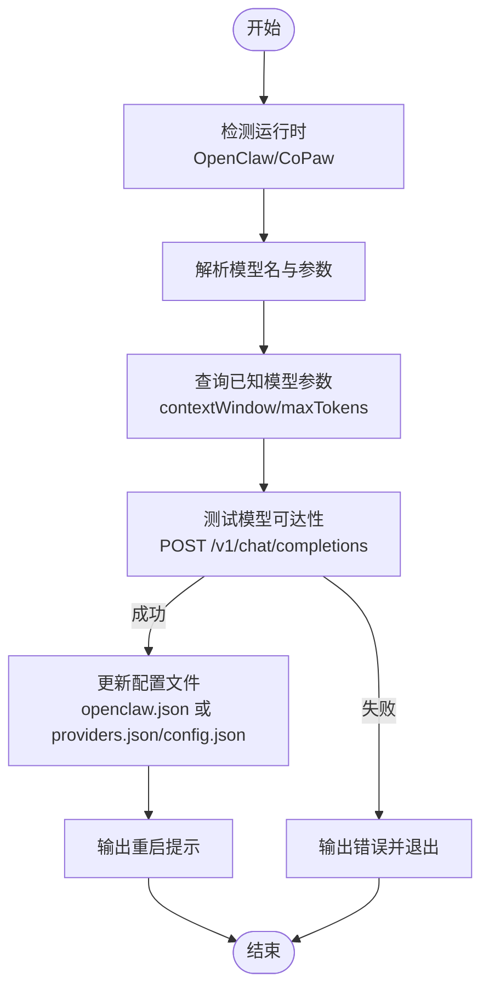
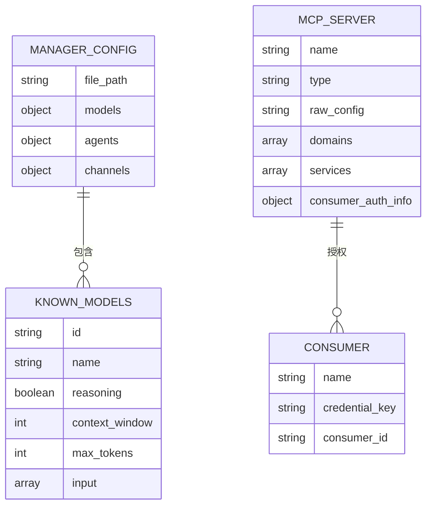
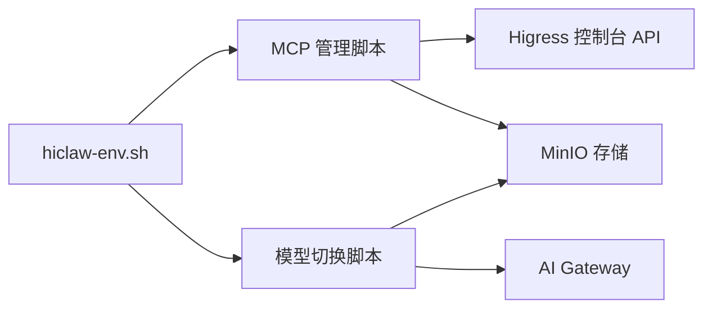

# 基础设施技能

<cite>
**本文引用的文件**
- [setup-mcp-server.sh](file://manager/agent/skills/mcp-server-management/scripts/setup-mcp-server.sh)
- [setup-mcp-proxy.sh](file://manager/agent/skills/mcp-server-management/scripts/setup-mcp-proxy.sh)
- [mcp-server-management/SKILL.md](file://manager/agent/skills/mcp-server-management/SKILL.md)
- [update-manager-model.sh](file://manager/agent/skills/model-switch/scripts/update-manager-model.sh)
- [model-switch/SKILL.md](file://manager/agent/skills/model-switch/SKILL.md)
- [known-models.json](file://manager/configs/known-models.json)
- [manager-openclaw.json.tmpl](file://manager/configs/manager-openclaw.json.tmpl)
- [hiclaw-env.sh](file://shared/lib/hiclaw-env.sh)
- [smoke-test.sh](file://manager/tests/smoke-test.sh)
- [hiclaw-verify.sh](file://install/hiclaw-verify.sh)
- [test-01-manager-boot.sh](file://tests/test-01-manager-boot.sh)
- [higress-api-doc.json](file://manager/agent/skills-alpha/higress-gateway-management/references/higress-api-doc.json)
- [mcp-github.yaml](file://manager/agent/skills/mcp-server-management/references/mcp-github.yaml)
- [setup-mcp-proxy.md](file://manager/agent/skills/mcp-server-management/references/setup-mcp-proxy.md)
</cite>

## 目录
1. [简介](#简介)
2. [项目结构](#项目结构)
3. [核心组件](#核心组件)
4. [架构总览](#架构总览)
5. [详细组件分析](#详细组件分析)
6. [依赖关系分析](#依赖关系分析)
7. [性能考虑](#性能考虑)
8. [故障排查指南](#故障排查指南)
9. [结论](#结论)
10. [附录](#附录)

## 简介
本文件面向 HiClaw Manager 的基础设施技能，聚焦两大能力：MCP 服务器管理与模型切换。前者涵盖通过 Higress AI Gateway 注册/更新 MCP 服务器、授权消费者、更新 mcporter 配置等；后者涵盖在不重启服务的前提下热更新 Manager Agent 的模型配置，并进行可达性校验与回滚建议。文档同时给出 MCP 代理设置、服务器管理方法、模型性能监控与故障恢复机制，帮助管理员在本地与云环境下高效运维。

## 项目结构
围绕基础设施技能的关键目录与文件如下：
- MCP 服务器管理脚本与参考文档
  - 脚本：setup-mcp-server.sh（基于 YAML 模板创建/更新）、setup-mcp-proxy.sh（代理已有 MCP 服务器）
  - 参考：mcp-server-management/SKILL.md、setup-mcp-proxy.md、mcp-github.yaml
- 模型切换脚本与配置
  - 脚本：update-manager-model.sh
  - 配置：known-models.json、manager-openclaw.json.tmpl
- 运行时环境与网关
  - 环境：hiclaw-env.sh
  - 网关接口：higress-api-doc.json
- 健康检查与验证
  - 测试：smoke-test.sh、test-01-manager-boot.sh
  - 安装验证：hiclaw-verify.sh

**图表来源**
- [setup-mcp-server.sh:1-393](file://manager/agent/skills/mcp-server-management/scripts/setup-mcp-server.sh#L1-L393)
- [setup-mcp-proxy.sh:1-391](file://manager/agent/skills/mcp-server-management/scripts/setup-mcp-proxy.sh#L1-L391)
- [update-manager-model.sh:1-227](file://manager/agent/skills/model-switch/scripts/update-manager-model.sh#L1-L227)
- [manager-openclaw.json.tmpl:1-145](file://manager/configs/manager-openclaw.json.tmpl#L1-L145)
- [known-models.json:1-19](file://manager/configs/known-models.json#L1-L19)
- [hiclaw-env.sh:1-52](file://shared/lib/hiclaw-env.sh#L1-L52)

**章节来源**
- [mcp-server-management/SKILL.md:1-33](file://manager/agent/skills/mcp-server-management/SKILL.md#L1-L33)
- [model-switch/SKILL.md:1-83](file://manager/agent/skills/model-switch/SKILL.md#L1-L83)

## 核心组件
- MCP 服务器管理脚本
  - setup-mcp-server.sh：支持内置模板与自定义 YAML，自动提取 API 域名、替换凭证、注册服务源、创建/更新 MCP 服务器、授权消费者、更新 mcporter 配置并推送至 MinIO。
  - setup-mcp-proxy.sh：代理现有 SSE/HTTP MCP 服务器，动态生成 mcp-proxy 配置，支持多头部认证方案。
- 模型切换脚本
  - update-manager-model.sh：根据运行时（OpenClaw/CoPaw）更新配置文件，测试 AI Gateway 可达性，按模型特征设置上下文窗口与推理开关。
- 配置与参考
  - known-models.json：预置模型参数清单，供脚本查询与回退。
  - manager-openclaw.json.tmpl：OpenClaw 默认配置模板，含模型提供商、默认模型与别名映射。
- 运行时与环境
  - hiclaw-env.sh：统一注入运行时变量（矩阵、AI 网关、存储桶、存储前缀），并提供云模式下的凭据刷新函数。

**章节来源**
- [setup-mcp-server.sh:1-393](file://manager/agent/skills/mcp-server-management/scripts/setup-mcp-server.sh#L1-L393)
- [setup-mcp-proxy.sh:1-391](file://manager/agent/skills/mcp-server-management/scripts/setup-mcp-proxy.sh#L1-L391)
- [update-manager-model.sh:1-227](file://manager/agent/skills/model-switch/scripts/update-manager-model.sh#L1-L227)
- [known-models.json:1-19](file://manager/configs/known-models.json#L1-L19)
- [manager-openclaw.json.tmpl:1-145](file://manager/configs/manager-openclaw.json.tmpl#L1-L145)
- [hiclaw-env.sh:1-52](file://shared/lib/hiclaw-env.sh#L1-L52)

## 架构总览
下图展示 MCP 服务器管理与模型切换在整体系统中的交互路径：

**图表来源**
- [setup-mcp-server.sh:186-393](file://manager/agent/skills/mcp-server-management/scripts/setup-mcp-server.sh#L186-L393)
- [setup-mcp-proxy.sh:159-391](file://manager/agent/skills/mcp-server-management/scripts/setup-mcp-proxy.sh#L159-L391)
- [higress-api-doc.json:1134-1160](file://manager/agent/skills-alpha/higress-gateway-management/references/higress-api-doc.json#L1134-L1160)

## 详细组件分析

### MCP 服务器管理（REST-to-MCP）
该组件负责将 REST API 转换为 MCP 工具服务器，或代理现有 MCP 服务器，确保消费者（Manager/Workers）可访问。

**图表来源**
- [setup-mcp-server.sh:82-393](file://manager/agent/skills/mcp-server-management/scripts/setup-mcp-server.sh#L82-L393)

**章节来源**
- [setup-mcp-server.sh:1-393](file://manager/agent/skills/mcp-server-management/scripts/setup-mcp-server.sh#L1-L393)
- [mcp-server-management/SKILL.md:1-33](file://manager/agent/skills/mcp-server-management/SKILL.md#L1-L33)
- [mcp-github.yaml:1-800](file://manager/agent/skills/mcp-server-management/references/mcp-github.yaml#L1-L800)

### MCP 服务器管理（代理现有 MCP）
该组件用于代理现有的 SSE 或 StreamableHTTP MCP 服务器，无需 YAML 模板。

**图表来源**
- [setup-mcp-proxy.sh:1-391](file://manager/agent/skills/mcp-server-management/scripts/setup-mcp-proxy.sh#L1-L391)
- [setup-mcp-proxy.md:1-47](file://manager/agent/skills/mcp-server-management/references/setup-mcp-proxy.md#L1-L47)

**章节来源**
- [setup-mcp-proxy.sh:1-391](file://manager/agent/skills/mcp-server-management/scripts/setup-mcp-proxy.sh#L1-L391)
- [setup-mcp-proxy.md:1-47](file://manager/agent/skills/mcp-server-management/references/setup-mcp-proxy.md#L1-L47)

### 模型切换（Manager Agent）
该组件负责在不重启服务的情况下热更新 Manager Agent 的模型配置，并进行可达性测试。

**图表来源**
- [update-manager-model.sh:1-227](file://manager/agent/skills/model-switch/scripts/update-manager-model.sh#L1-L227)
- [known-models.json:1-19](file://manager/configs/known-models.json#L1-L19)
- [model-switch/SKILL.md:1-83](file://manager/agent/skills/model-switch/SKILL.md#L1-L83)

**章节来源**
- [update-manager-model.sh:1-227](file://manager/agent/skills/model-switch/scripts/update-manager-model.sh#L1-L227)
- [known-models.json:1-19](file://manager/configs/known-models.json#L1-L19)
- [model-switch/SKILL.md:1-83](file://manager/agent/skills/model-switch/SKILL.md#L1-L83)

### 数据模型（配置与消费者）
以下 ER 图展示关键数据实体及其关系。

**图表来源**
- [manager-openclaw.json.tmpl:46-108](file://manager/configs/manager-openclaw.json.tmpl#L46-L108)
- [known-models.json:1-19](file://manager/configs/known-models.json#L1-L19)
- [higress-api-doc.json:1134-1160](file://manager/agent/skills-alpha/higress-gateway-management/references/higress-api-doc.json#L1134-L1160)

## 依赖关系分析
- 脚本对运行时的依赖
  - hiclaw-env.sh 提供统一的环境变量（矩阵、AI 网关、存储桶、存储前缀），并在云模式下提供凭据刷新函数。
- 脚本对 Higress 控制台 API 的依赖
  - 通过 /v1/service-sources、/v1/mcpServer、/v1/mcpServer/consumers 等端点完成服务源注册、MCP 服务器创建/更新与消费者授权。
- 脚本对 MinIO 的依赖
  - 使用 mc 命令推送 mcporter.json 至 agents/*/config/mcporter.json，确保 Workers 配置同步。
- 脚本对 AI Gateway 的依赖
  - 模型切换脚本通过 /v1/chat/completions 进行可达性测试，确保路由与提供商配置正确。

**图表来源**
- [hiclaw-env.sh:1-52](file://shared/lib/hiclaw-env.sh#L1-L52)
- [setup-mcp-server.sh:131-183](file://manager/agent/skills/mcp-server-management/scripts/setup-mcp-server.sh#L131-L183)
- [setup-mcp-proxy.sh:105-157](file://manager/agent/skills/mcp-server-management/scripts/setup-mcp-proxy.sh#L105-L157)
- [update-manager-model.sh:124-167](file://manager/agent/skills/model-switch/scripts/update-manager-model.sh#L124-L167)

**章节来源**
- [hiclaw-env.sh:1-52](file://shared/lib/hiclaw-env.sh#L1-L52)
- [higress-api-doc.json:1134-1160](file://manager/agent/skills-alpha/higress-gateway-management/references/higress-api-doc.json#L1134-L1160)

## 性能考虑
- 认证插件生效延迟
  - MCP 服务器创建/更新后，认证插件需约 10 秒生效，脚本末尾明确提示等待时间，避免过早通知 Worker 导致连接失败。
- 传输协议选择
  - SSE 传输超时更高（10000ms），适合长连接事件流；HTTP 传输适用于 StreamableHTTP 场景。
- 配置热更新
  - 模型切换脚本仅更新配置文件并进行可达性测试，避免频繁重启带来的中断；OpenClaw 支持文件变更自动重载，CoPaw 需要重启以应用变更。

[本节为通用指导，无需列出具体文件来源]

## 故障排查指南
- Higress 控制台登录失败
  - 检查 HIGRESS_COOKIE_FILE 是否设置，确认控制台端口与会话是否有效。
  - 参考测试脚本中的登录流程与返回码判断。
- MCP 服务器不可用
  - 确认服务源域名解析正确，必要时使用 --api-domain 显式指定。
  - 等待认证插件生效（约 10 秒）后再进行工具调用验证。
  - 使用 mcporter 发起一次工具调用，确认连通性。
- 模型不可达
  - 若返回非 200，检查当前默认 AI Provider 是否支持该模型名称。
  - 在 Higress 控制台新增对应供应商的 AI Provider 与 AI Route，匹配模型前缀。
  - 不要修改初始化配置中的默认 AI Provider，它会在重启时被覆盖。
- 健康检查失败
  - 使用 smoke-test.sh 与 hiclaw-verify.sh 检查 MinIO、Tuwunel、Higress、Element Web 等组件健康状态。
  - 在 K8s 环境中，使用 kubectl exec 执行健康检查命令。

**章节来源**
- [test-01-manager-boot.sh:35-66](file://tests/test-01-manager-boot.sh#L35-L66)
- [smoke-test.sh:1-70](file://manager/tests/smoke-test.sh#L1-L70)
- [hiclaw-verify.sh:129-175](file://install/hiclaw-verify.sh#L129-L175)
- [model-switch/SKILL.md:43-51](file://manager/agent/skills/model-switch/SKILL.md#L43-L51)

## 结论
HiClaw 的基础设施技能通过 MCP 服务器管理与模型切换两大脚本，实现了对 AI 网关与模型配置的自动化运维。脚本遵循幂等设计，结合 Higress 控制台 API 与 MinIO 存储，确保消费者授权与配置同步；同时通过可达性测试与健康检查，保障服务可用性与稳定性。在云模式下，部分功能受限于平台控制台，应遵循相应指引操作。

[本节为总结性内容，无需列出具体文件来源]

## 附录
- MCP 服务器管理操作参考
  - 创建/更新 MCP 服务器：参考 mcp-server-management/SKILL.md 中的“Operation Reference”与 create-update-server.md
  - 代理现有 MCP 服务器：参考 setup-mcp-proxy.md
  - 自定义 API YAML：参考 custom-yaml-guide.md
  - 手动管理服务器与消费者：参考 api-commands.md
  - GitHub MCP 工具定义：参考 mcp-github.yaml
- 模型切换操作参考
  - 已知模型参数表：见 known-models.json 与 model-switch/SKILL.md 的“Pre-configured models”
  - 运行时模板：见 manager-openclaw.json.tmpl

**章节来源**
- [mcp-server-management/SKILL.md:22-33](file://manager/agent/skills/mcp-server-management/SKILL.md#L22-L33)
- [setup-mcp-proxy.md:1-47](file://manager/agent/skills/mcp-server-management/references/setup-mcp-proxy.md#L1-L47)
- [known-models.json:1-19](file://manager/configs/known-models.json#L1-L19)
- [manager-openclaw.json.tmpl:1-145](file://manager/configs/manager-openclaw.json.tmpl#L1-L145)