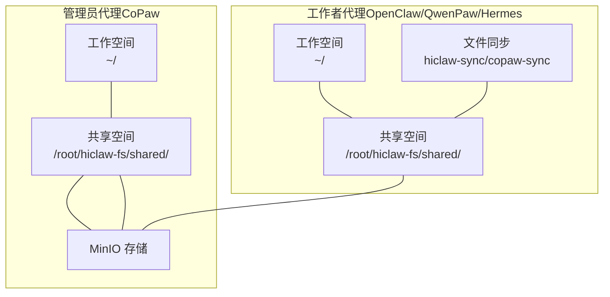
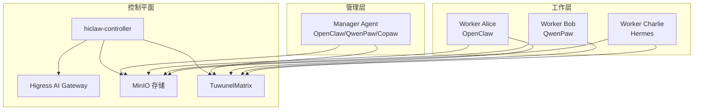
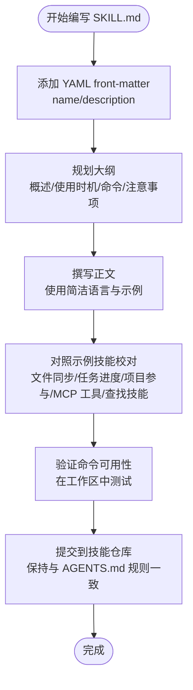
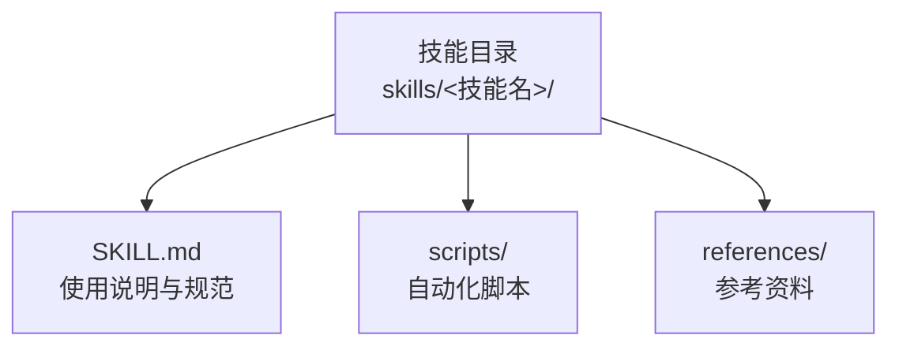
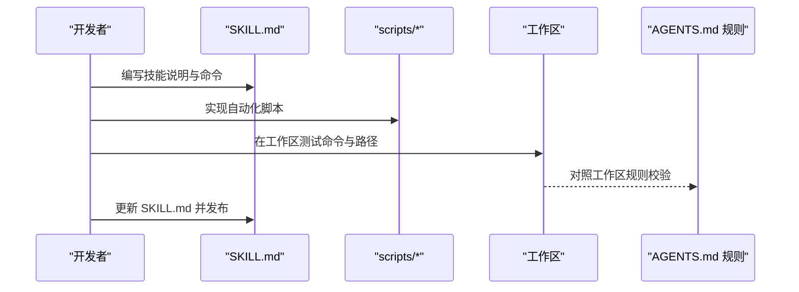
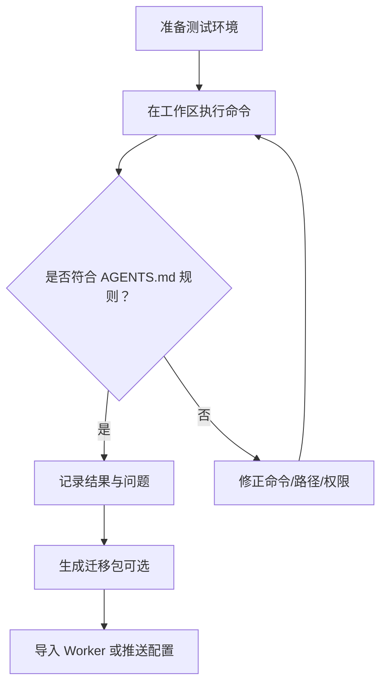
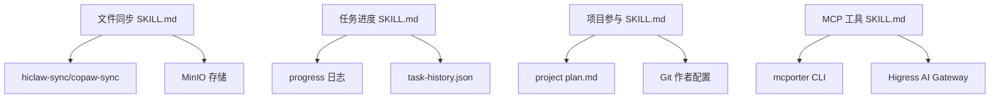

# 技能开发指南

<cite>
**本文引用的文件**
- [README.md](file://README.md)
- [AGENTS.md（CoPaw 管理员代理）](file://manager/agent/copaw-manager-agent/AGENTS.md)
- [AGENTS.md（Hermes 工作者代理）](file://manager/agent/hermes-worker-agent/AGENTS.md)
- [AGENTS.md（Worker 代理）](file://manager/agent/worker-agent/AGENTS.md)
- [迁移技能 SKILL.md](file://migrate/skill/SKILL.md)
- [文件同步 SKILL.md（Worker）](file://manager/agent/worker-agent/skills/file-sync/SKILL.md)
- [任务进度 SKILL.md（Worker）](file://manager/agent/worker-agent/skills/task-progress/SKILL.md)
- [项目参与 SKILL.md（Worker）](file://manager/agent/worker-agent/skills/project-participation/SKILL.md)
- [MCP 工具 SKILL.md（Worker）](file://manager/agent/worker-agent/skills/mcporter/SKILL.md)
- [文件同步 SKILL.md（CoPaw 工作者）](file://manager/agent/copaw-worker-agent/skills/file-sync/SKILL.md)
- [查找技能 SKILL.md（CoPaw 工作者）](file://manager/agent/copaw-worker-agent/skills/find-skills/SKILL.md)
- [MCP 工具 SKILL.md（CoPaw 工作者）](file://manager/agent/copaw-worker-agent/skills/mcporter/SKILL.md)
- [项目参与 SKILL.md（CoPaw 工作者）](file://manager/agent/copaw-worker-agent/skills/project-participation/SKILL.md)
</cite>

## 目录
1. [简介](#简介)
2. [项目结构](#项目结构)
3. [核心组件](#核心组件)
4. [架构总览](#架构总览)
5. [详细组件分析](#详细组件分析)
6. [依赖关系分析](#依赖关系分析)
7. [性能考虑](#性能考虑)
8. [故障排查指南](#故障排查指南)
9. [结论](#结论)
10. [附录](#附录)

## 简介
本指南面向 HiClaw Manager 技能开发者，系统讲解如何编写与维护 SKILL.md、组织技能目录结构、遵循开发流程与最佳实践，并覆盖技能测试、打包与部署、版本管理与兼容性处理等关键主题。文档基于仓库中现有的技能示例与工作区规则进行归纳总结，帮助你在不直接阅读代码的前提下快速上手。

## 项目结构
HiClaw 的技能生态围绕“管理员代理 + 多种运行时的工作者代理”展开，技能以目录形式组织，每个技能目录下包含 SKILL.md 作为使用说明与规范入口。不同运行时（OpenClaw/QwenPaw/Hermes）的工作区规则略有差异，但共享统一的文件同步与协作机制。

- 管理员代理工作区（CoPaw 运行时）
  - 工作空间：用户主目录（本地挂载，非自动同步至 MinIO）
  - 共享空间：容器内固定路径，通过 MinIO 同步
  - 关键文件：SOUL.md、AGENTS.md、skills/、state.json、workers-registry.json
- 工作者代理工作区（OpenClaw/QwenPaw/Hermes）
  - 工作空间：用户主目录（skills/、memory/、task-history.json 等）
  - 共享空间：/root/hiclaw-fs/shared/（tasks/、projects/ 等）
  - 文件同步：hiclaw-sync/copaw-sync 或自动镜像脚本
- MCP 工具生态：通过 mcporter CLI 调用外部 MCP 服务器工具，配置由管理员推送并热更新

**图表来源**
- [AGENTS.md（CoPaw 管理员代理）:1-249](file://manager/agent/copaw-manager-agent/AGENTS.md#L1-L249)
- [AGENTS.md（Worker 代理）:1-178](file://manager/agent/worker-agent/AGENTS.md#L1-L178)
- [文件同步 SKILL.md（Worker）:1-20](file://manager/agent/worker-agent/skills/file-sync/SKILL.md#L1-L20)
- [文件同步 SKILL.md（CoPaw 工作者）:1-65](file://manager/agent/copaw-worker-agent/skills/file-sync/SKILL.md#L1-L65)

**章节来源**
- [AGENTS.md（CoPaw 管理员代理）:1-249](file://manager/agent/copaw-manager-agent/AGENTS.md#L1-L249)
- [AGENTS.md（Worker 代理）:1-178](file://manager/agent/worker-agent/AGENTS.md#L1-L178)
- [AGENTS.md（Hermes 工作者代理）:1-225](file://manager/agent/hermes-worker-agent/AGENTS.md#L1-L225)

## 核心组件
- 技能规范与模板
  - 每个技能目录必须包含 SKILL.md，采用 YAML front-matter 声明 name 与 description；正文提供清晰的使用步骤、命令示例与注意事项
  - 示例参考：文件同步、任务进度、项目参与、MCP 工具、查找技能等
- 工作区规则与通信协议
  - 不同运行时的工作区布局、文件同步方式、消息 @mention 规则存在差异，需严格遵循对应 AGENTS.md 中的规则
- 分布式状态与持久化
  - 所有状态与配置均通过 MinIO 集中存储，容器可随时重建，确保无状态与可移植性

**章节来源**
- [文件同步 SKILL.md（Worker）:1-20](file://manager/agent/worker-agent/skills/file-sync/SKILL.md#L1-L20)
- [任务进度 SKILL.md（Worker）:1-71](file://manager/agent/worker-agent/skills/task-progress/SKILL.md#L1-L71)
- [项目参与 SKILL.md（Worker）:1-46](file://manager/agent/worker-agent/skills/project-participation/SKILL.md#L1-L46)
- [MCP 工具 SKILL.md（Worker）:1-110](file://manager/agent/worker-agent/skills/mcporter/SKILL.md#L1-L110)
- [查找技能 SKILL.md（CoPaw 工作者）:1-175](file://manager/agent/copaw-worker-agent/skills/find-skills/SKILL.md#L1-L175)

## 架构总览
HiClaw 采用“管理员-工作者”架构，管理者负责编排与资源控制，工作者专注于具体任务执行。技能通过集中式仓库分发，工作者按需拉取并执行。MCP 工具通过统一网关访问外部服务，避免暴露真实凭据。

**图表来源**
- [README.md:305-333](file://README.md#L305-L333)

**章节来源**
- [README.md:305-333](file://README.md#L305-L333)

## 详细组件分析

### SKILL.md 编写规范与标准格式
- 必备字段
  - YAML front-matter：name（技能名称）、description（技能描述）
  - 标题层级：使用 # 主标题，配合 ##、### 组织内容
- 内容结构建议
  - 概述：简要说明技能用途与适用场景
  - 使用时机：何时调用该技能
  - 命令与参数：提供可直接复制的命令示例与参数说明
  - 注意事项：常见陷阱、错误处理、安全提示
  - 参考资料：相关链接或配套脚本路径
- 示例参考
  - 文件同步：强调同步时机与确认反馈
  - 任务进度：进度日志格式、历史记录与恢复流程
  - 项目参与：多工作者协作、Git 提交作者信息
  - MCP 工具：工具发现、调用方法与权限说明
  - 查找技能：市场搜索、安装流程与环境变量

**图表来源**
- [文件同步 SKILL.md（Worker）:1-20](file://manager/agent/worker-agent/skills/file-sync/SKILL.md#L1-L20)
- [任务进度 SKILL.md（Worker）:1-71](file://manager/agent/worker-agent/skills/task-progress/SKILL.md#L1-L71)
- [项目参与 SKILL.md（Worker）:1-46](file://manager/agent/worker-agent/skills/project-participation/SKILL.md#L1-L46)
- [MCP 工具 SKILL.md（Worker）:1-110](file://manager/agent/worker-agent/skills/mcporter/SKILL.md#L1-L110)
- [查找技能 SKILL.md（CoPaw 工作者）:1-175](file://manager/agent/copaw-worker-agent/skills/find-skills/SKILL.md#L1-L175)

**章节来源**
- [文件同步 SKILL.md（Worker）:1-20](file://manager/agent/worker-agent/skills/file-sync/SKILL.md#L1-L20)
- [任务进度 SKILL.md（Worker）:1-71](file://manager/agent/worker-agent/skills/task-progress/SKILL.md#L1-L71)
- [项目参与 SKILL.md（Worker）:1-46](file://manager/agent/worker-agent/skills/project-participation/SKILL.md#L1-L46)
- [MCP 工具 SKILL.md（Worker）:1-110](file://manager/agent/worker-agent/skills/mcporter/SKILL.md#L1-L110)
- [查找技能 SKILL.md（CoPaw 工作者）:1-175](file://manager/agent/copaw-worker-agent/skills/find-skills/SKILL.md#L1-L175)

### 技能目录结构与文件组织
- 目录命名
  - 使用语义化短名，如 file-sync、task-progress、project-participation、mcporter、find-skills
- 文件清单
  - SKILL.md：技能使用说明与规范
  - scripts/：可选的自动化脚本（如 push-shared.sh、hiclaw-find-skill.sh）
  - references/：可选的参考资料（如 API 文档、模板）
- 工作区差异
  - OpenClaw/QwenPaw/Hermes 运行时的工作空间路径与同步方式不同，需在 SKILL.md 中明确路径与命令

**图表来源**
- [文件同步 SKILL.md（Worker）:1-20](file://manager/agent/worker-agent/skills/file-sync/SKILL.md#L1-L20)
- [任务进度 SKILL.md（Worker）:1-71](file://manager/agent/worker-agent/skills/task-progress/SKILL.md#L1-L71)
- [项目参与 SKILL.md（Worker）:1-46](file://manager/agent/worker-agent/skills/project-participation/SKILL.md#L1-L46)
- [文件同步 SKILL.md（CoPaw 工作者）:1-65](file://manager/agent/copaw-worker-agent/skills/file-sync/SKILL.md#L1-L65)
- [查找技能 SKILL.md（CoPaw 工作者）:1-175](file://manager/agent/copaw-worker-agent/skills/find-skills/SKILL.md#L1-L175)

**章节来源**
- [文件同步 SKILL.md（Worker）:1-20](file://manager/agent/worker-agent/skills/file-sync/SKILL.md#L1-L20)
- [任务进度 SKILL.md（Worker）:1-71](file://manager/agent/worker-agent/skills/task-progress/SKILL.md#L1-L71)
- [项目参与 SKILL.md（Worker）:1-46](file://manager/agent/worker-agent/skills/project-participation/SKILL.md#L1-L46)
- [文件同步 SKILL.md（CoPaw 工作者）:1-65](file://manager/agent/copaw-worker-agent/skills/file-sync/SKILL.md#L1-L65)
- [查找技能 SKILL.md（CoPaw 工作者）:1-175](file://manager/agent/copaw-worker-agent/skills/find-skills/SKILL.md#L1-L175)

### 技能开发流程与最佳实践
- 设计阶段
  - 明确技能目标与边界，避免功能重叠
  - 定义输入输出与前置条件，确保幂等性
- 实现阶段
  - 先写 SKILL.md，再实现脚本；保证文档与实现一致
  - 使用最小可行命令集，逐步完善
- 测试阶段
  - 在工作区中验证命令与路径，确保跨运行时兼容
  - 对照 AGENTS.md 规则检查 @mention、同步与存储路径
- 发布与维护
  - 保持 SKILL.md 最新，记录变更与已知限制
  - 通过集中式仓库分发，避免硬编码路径

**图表来源**
- [文件同步 SKILL.md（Worker）:1-20](file://manager/agent/worker-agent/skills/file-sync/SKILL.md#L1-L20)
- [任务进度 SKILL.md（Worker）:1-71](file://manager/agent/worker-agent/skills/task-progress/SKILL.md#L1-L71)
- [项目参与 SKILL.md（Worker）:1-46](file://manager/agent/worker-agent/skills/project-participation/SKILL.md#L1-L46)
- [AGENTS.md（Worker 代理）:1-178](file://manager/agent/worker-agent/AGENTS.md#L1-L178)

**章节来源**
- [文件同步 SKILL.md（Worker）:1-20](file://manager/agent/worker-agent/skills/file-sync/SKILL.md#L1-L20)
- [任务进度 SKILL.md（Worker）:1-71](file://manager/agent/worker-agent/skills/task-progress/SKILL.md#L1-L71)
- [项目参与 SKILL.md（Worker）:1-46](file://manager/agent/worker-agent/skills/project-participation/SKILL.md#L1-L46)
- [AGENTS.md（Worker 代理）:1-178](file://manager/agent/worker-agent/AGENTS.md#L1-L178)

### 技能测试、打包与部署
- 测试
  - 在工作区中逐条验证命令，确保路径与权限正确
  - 对照 AGENTS.md 的“Gotchas”与“Memory/Tools”等规则检查行为一致性
- 打包
  - 使用迁移技能提供的分析与打包流程生成 ZIP 包，确保 Dockerfile、AGENTS.md、SOUL.md 符合要求
- 部署
  - 通过 hiclaw CLI 导入 Worker，或在管理员工作区中推送技能与配置

**图表来源**
- [迁移技能 SKILL.md:1-238](file://migrate/skill/SKILL.md#L1-L238)
- [AGENTS.md（CoPaw 管理员代理）:1-249](file://manager/agent/copaw-manager-agent/AGENTS.md#L1-L249)

**章节来源**
- [迁移技能 SKILL.md:1-238](file://migrate/skill/SKILL.md#L1-L238)
- [AGENTS.md（CoPaw 管理员代理）:1-249](file://manager/agent/copaw-manager-agent/AGENTS.md#L1-L249)

### 版本管理与兼容性处理
- 版本管理
  - 通过集中式仓库与工作区同步机制管理技能版本，避免硬编码版本号
- 兼容性
  - 不同运行时（OpenClaw/QwenPaw/Hermes）的命令与路径可能不同，SKILL.md 中应分别说明
  - MCP 工具的权限与传输方式由网关统一管理，技能侧仅关注调用方式

**章节来源**
- [MCP 工具 SKILL.md（Worker）:1-110](file://manager/agent/worker-agent/skills/mcporter/SKILL.md#L1-L110)
- [MCP 工具 SKILL.md（CoPaw 工作者）:1-111](file://manager/agent/copaw-worker-agent/skills/mcporter/SKILL.md#L1-L111)
- [文件同步 SKILL.md（CoPaw 工作者）:1-65](file://manager/agent/copaw-worker-agent/skills/file-sync/SKILL.md#L1-L65)

## 依赖关系分析
- 技能依赖
  - 文件同步：依赖 hiclaw-sync/copaw-sync 与 MinIO 存储
  - 任务进度：依赖 progress 日志与 task-history.json
  - 项目参与：依赖共享计划与 Git 作者配置
  - MCP 工具：依赖 mcporter CLI 与网关配置
- 运行时差异
  - OpenClaw/QwenPaw/Hermes 的工作区路径与同步方式不同，需在 SKILL.md 中区分

**图表来源**
- [文件同步 SKILL.md（Worker）:1-20](file://manager/agent/worker-agent/skills/file-sync/SKILL.md#L1-L20)
- [任务进度 SKILL.md（Worker）:1-71](file://manager/agent/worker-agent/skills/task-progress/SKILL.md#L1-L71)
- [项目参与 SKILL.md（Worker）:1-46](file://manager/agent/worker-agent/skills/project-participation/SKILL.md#L1-L46)
- [MCP 工具 SKILL.md（Worker）:1-110](file://manager/agent/worker-agent/skills/mcporter/SKILL.md#L1-L110)
- [文件同步 SKILL.md（CoPaw 工作者）:1-65](file://manager/agent/copaw-worker-agent/skills/file-sync/SKILL.md#L1-L65)

**章节来源**
- [文件同步 SKILL.md（Worker）:1-20](file://manager/agent/worker-agent/skills/file-sync/SKILL.md#L1-L20)
- [任务进度 SKILL.md（Worker）:1-71](file://manager/agent/worker-agent/skills/task-progress/SKILL.md#L1-L71)
- [项目参与 SKILL.md（Worker）:1-46](file://manager/agent/worker-agent/skills/project-participation/SKILL.md#L1-L46)
- [MCP 工具 SKILL.md（Worker）:1-110](file://manager/agent/worker-agent/skills/mcporter/SKILL.md#L1-L110)
- [文件同步 SKILL.md（CoPaw 工作者）:1-65](file://manager/agent/copaw-worker-agent/skills/file-sync/SKILL.md#L1-L65)

## 性能考虑
- 减少不必要的 @mention 与消息往返，避免无限循环与资源浪费
- 将任务分解为小步骤，及时推送进度日志，降低会话重置带来的风险
- 使用自动同步与批量推送策略，减少手动操作与网络开销

## 故障排查指南
- 常见问题
  - 未使用 @mention 触发：检查 AGENTS.md 的 @mention 协议与全域 ID
  - 文件未同步：确认 hiclaw-sync/copaw-sync 命令与 MinIO 路径
  - MCP 工具 403：检查权限与 mcporter 配置，必要时请求管理员授权
  - 会话重置丢失进度：确保按步骤推送 progress 日志
- 排查步骤
  - 对照 AGENTS.md 的“Gotchas”与“Memory/Tools”规则
  - 在工作区中逐条重放命令，定位失败点
  - 检查 MinIO 权限与路径前缀

**章节来源**
- [AGENTS.md（Worker 代理）:1-178](file://manager/agent/worker-agent/AGENTS.md#L1-L178)
- [AGENTS.md（CoPaw 管理员代理）:1-249](file://manager/agent/copaw-manager-agent/AGENTS.md#L1-L249)
- [MCP 工具 SKILL.md（Worker）:1-110](file://manager/agent/worker-agent/skills/mcporter/SKILL.md#L1-L110)

## 结论
通过遵循 SKILL.md 编写规范、严格遵守工作区与通信协议、采用统一的测试与打包流程，以及重视版本与兼容性管理，你可以高效地为 HiClaw Manager 开发高质量技能，提升多智能体协作的稳定性与可维护性。

## 附录
- 快速参考
  - 文件同步：在收到更新通知后立即同步，完成后向发送者确认
  - 任务进度：每完成一个子步骤即追加进度日志并推送
  - 项目参与：使用工作区 Git 作者配置，按计划推进任务
  - MCP 工具：先 discovery 再调用，按权限范围使用