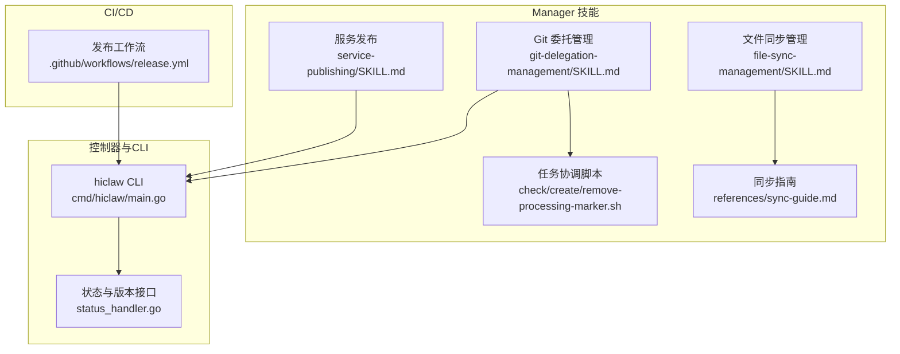
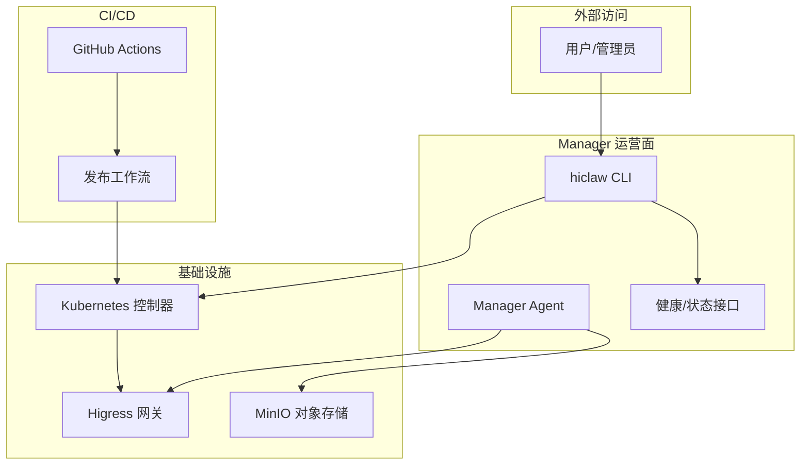
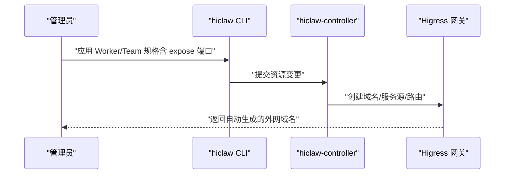
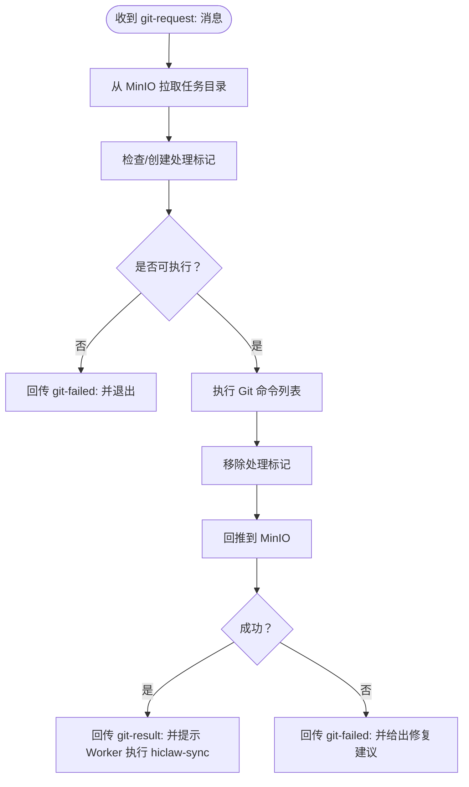
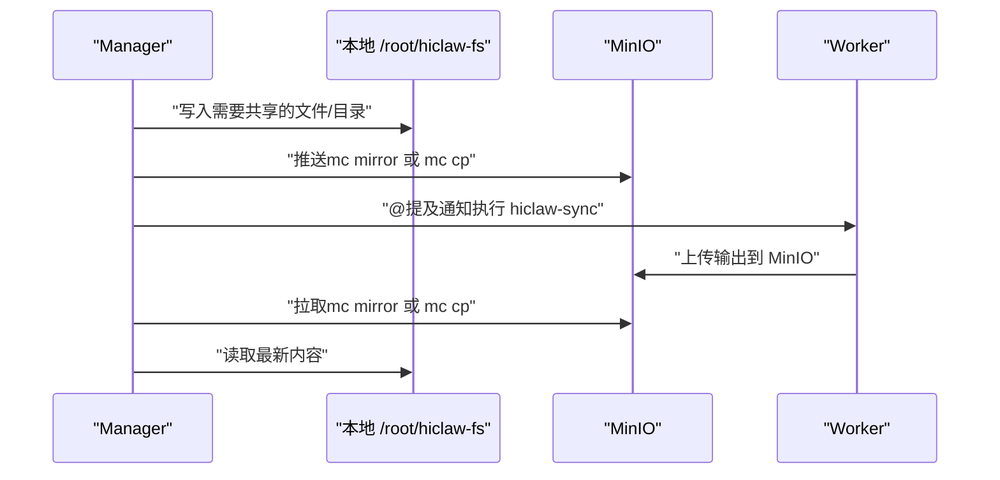
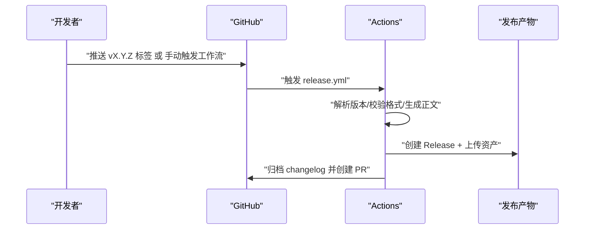
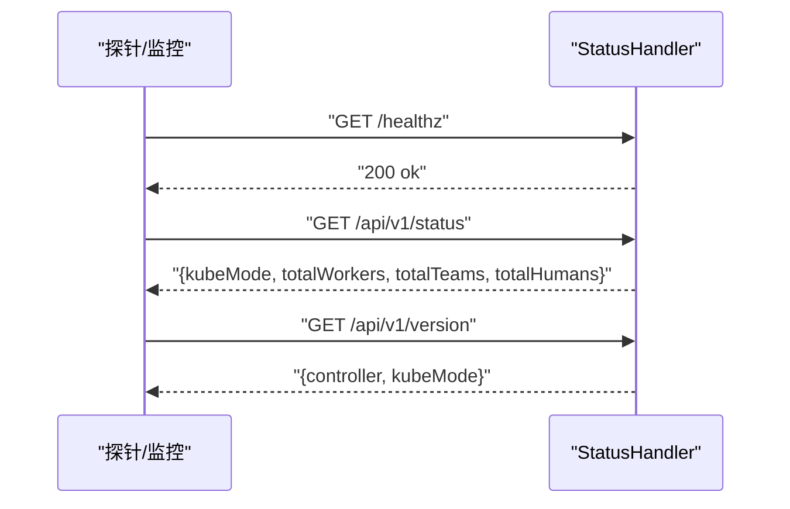
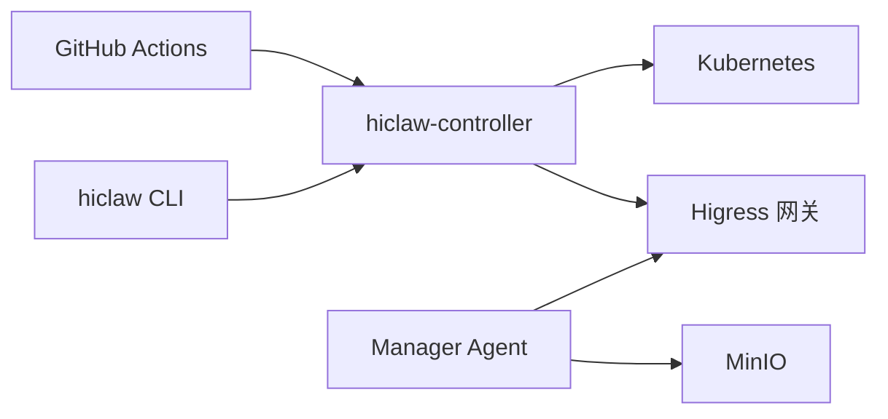

# 服务运营技能

<cite>
**本文引用的文件**
- [service-publishing/SKILL.md](file://manager/agent/skills/service-publishing/SKILL.md)
- [git-delegation-management/SKILL.md](file://manager/agent/skills/git-delegation-management/SKILL.md)
- [file-sync-management/SKILL.md](file://manager/agent/skills/file-sync-management/SKILL.md)
- [sync-guide.md](file://manager/agent/skills/file-sync-management/references/sync-guide.md)
- [release.yml](file://.github/workflows/release.yml)
- [main.go](file://hiclaw-controller/cmd/hiclaw/main.go)
- [check-processing-marker.sh](file://manager/agent/skills/task-coordination/scripts/check-processing-marker.sh)
- [create-processing-marker.sh](file://manager/agent/skills/task-coordination/scripts/create-processing-marker.sh)
- [remove-processing-marker.sh](file://manager/agent/skills/task-coordination/scripts/remove-processing-marker.sh)
- [status_handler.go](file://hiclaw-controller/internal/server/status_handler.go)
</cite>

## 目录
1. [简介](#简介)
2. [项目结构](#项目结构)
3. [核心组件](#核心组件)
4. [架构总览](#架构总览)
5. [详细组件分析](#详细组件分析)
6. [依赖关系分析](#依赖关系分析)
7. [性能考虑](#性能考虑)
8. [故障排查指南](#故障排查指南)
9. [结论](#结论)
10. [附录](#附录)

## 简介
本文件面向 HiClaw Manager 的服务运营团队，系统化梳理三类关键运营技能：服务发布（通过 Higress 网关对外暴露 Worker HTTP 服务）、Git 委托管理（在无凭据情况下代理执行 Git 操作）与文件同步（基于 MinIO 的任务态文件分发与拉取）。文档同时覆盖 CI/CD 发布流程、自动化部署要点、版本控制最佳实践以及服务监控与运维自动化建议，帮助读者建立从“开发—测试—发布—运行维护”的完整闭环。

## 项目结构
围绕服务运营主题，HiClaw 在以下位置提供了可直接落地的技能与工具：
- 服务发布：manager/agent/skills/service-publishing
- Git 委托：manager/agent/skills/git-delegation-management
- 文件同步：manager/agent/skills/file-sync-management 及其参考文档
- CI/CD 发布：.github/workflows/release.yml
- CLI 控制器：hiclaw-controller/cmd/hiclaw
- 运维自动化（任务协调标记）：manager/agent/skills/task-coordination/scripts
- 运行时健康检查：hiclaw-controller/internal/server/status_handler.go

**图表来源**
- [service-publishing/SKILL.md:1-92](file://manager/agent/skills/service-publishing/SKILL.md#L1-L92)
- [git-delegation-management/SKILL.md:1-167](file://manager/agent/skills/git-delegation-management/SKILL.md#L1-L167)
- [file-sync-management/SKILL.md:1-20](file://manager/agent/skills/file-sync-management/SKILL.md#L1-L20)
- [sync-guide.md:1-41](file://manager/agent/skills/file-sync-management/references/sync-guide.md#L1-L41)
- [main.go:1-35](file://hiclaw-controller/cmd/hiclaw/main.go#L1-L35)
- [status_handler.go:1-75](file://hiclaw-controller/internal/server/status_handler.go#L1-L75)
- [release.yml:1-160](file://.github/workflows/release.yml#L1-L160)

**章节来源**
- [service-publishing/SKILL.md:1-92](file://manager/agent/skills/service-publishing/SKILL.md#L1-L92)
- [git-delegation-management/SKILL.md:1-167](file://manager/agent/skills/git-delegation-management/SKILL.md#L1-L167)
- [file-sync-management/SKILL.md:1-20](file://manager/agent/skills/file-sync-management/SKILL.md#L1-L20)
- [sync-guide.md:1-41](file://manager/agent/skills/file-sync-management/references/sync-guide.md#L1-L41)
- [release.yml:1-160](file://.github/workflows/release.yml#L1-L160)
- [main.go:1-35](file://hiclaw-controller/cmd/hiclaw/main.go#L1-L35)
- [status_handler.go:1-75](file://hiclaw-controller/internal/server/status_handler.go#L1-L75)

## 核心组件
- 服务发布（Service Publishing）
  - 通过在 Worker 规格中添加 expose 字段，由控制器自动创建 Higress 域名、服务源与路由，实现容器端口对外暴露。
  - 支持 CLI 与 YAML 两种配置方式；支持团队 Worker 的批量暴露。
- Git 委托管理（Git Delegation Management）
  - 当 Worker 发送结构化的 git-request: 消息时，Manager 在宿主共享目录下执行指定 Git 命令，使用宿主 .gitconfig 与凭据完成认证。
  - 强调处理流程：同步—校验/创建处理标记—执行命令—清理与回传结果。
- 文件同步（File Sync Management）
  - 明确约定：本地 /root/hiclaw-fs 不是实时同步，必须显式拉取/推送；推荐使用 mc mirror 与 mc cp，并在写入后立即推送并通知 Worker 执行同步。
  - 提供同步指南，覆盖单文件、目录与任务目录的拉取/推送场景。

**章节来源**
- [service-publishing/SKILL.md:1-92](file://manager/agent/skills/service-publishing/SKILL.md#L1-L92)
- [git-delegation-management/SKILL.md:1-167](file://manager/agent/skills/git-delegation-management/SKILL.md#L1-L167)
- [file-sync-management/SKILL.md:1-20](file://manager/agent/skills/file-sync-management/SKILL.md#L1-L20)
- [sync-guide.md:1-41](file://manager/agent/skills/file-sync-management/references/sync-guide.md#L1-L41)

## 架构总览
下图展示服务发布、Git 委托与文件同步在整体系统中的交互关系，以及与 CLI、控制器健康检查、CI/CD 的衔接。

**图表来源**
- [main.go:1-35](file://hiclaw-controller/cmd/hiclaw/main.go#L1-L35)
- [status_handler.go:1-75](file://hiclaw-controller/internal/server/status_handler.go#L1-L75)
- [service-publishing/SKILL.md:1-92](file://manager/agent/skills/service-publishing/SKILL.md#L1-L92)
- [git-delegation-management/SKILL.md:1-167](file://manager/agent/skills/git-delegation-management/SKILL.md#L1-L167)
- [file-sync-management/SKILL.md:1-20](file://manager/agent/skills/file-sync-management/SKILL.md#L1-L20)
- [release.yml:1-160](file://.github/workflows/release.yml#L1-L160)

## 详细组件分析

### 组件一：服务发布（Service Publishing）
- 功能概述
  - 将 Worker 容器内的 HTTP 服务通过 Higress 网关对外暴露，自动生成域名（worker-{name}-{port}-local.hiclaw.io），支持多端口暴露与团队 Worker。
- 关键流程
  - 在 Worker/Team 规格中声明 expose 端口，控制器自动创建域名、服务源与路由。
  - 支持 CLI 与 YAML 两种应用方式；可通过查询确认已暴露端口。
- 使用建议
  - 确保容器内服务已在目标端口监听；避免对未授权路由进行访问；如需停用，从 expose 列表移除并重新应用。

**图表来源**
- [service-publishing/SKILL.md:1-92](file://manager/agent/skills/service-publishing/SKILL.md#L1-L92)
- [main.go:1-35](file://hiclaw-controller/cmd/hiclaw/main.go#L1-L35)

**章节来源**
- [service-publishing/SKILL.md:1-92](file://manager/agent/skills/service-publishing/SKILL.md#L1-L92)
- [main.go:1-35](file://hiclaw-controller/cmd/hiclaw/main.go#L1-L35)

### 组件二：Git 委托管理（Git Delegation Management）
- 功能概述
  - 当 Worker 发送结构化 git-request: 消息时，Manager 在宿主共享目录执行 Git 命令，使用宿主 .gitconfig 与凭据完成认证。
- 关键流程
  - 同步任务目录到本地（mc mirror）→ 检查/创建处理标记（防止并发冲突）→ 执行 Git 命令 → 清理标记并回推结果 → 成功/失败分别回传 git-result:/git-failed:。
- 错误处理与注意事项
  - 常见问题：合并冲突、认证失败、分支分歧；按优先级处理或升级到管理员介入。
  - 严格遵循“只执行最后一次请求”“不删除远程仓库”“git-result 不等于任务完成”等约束。

**图表来源**
- [git-delegation-management/SKILL.md:1-167](file://manager/agent/skills/git-delegation-management/SKILL.md#L1-L167)
- [check-processing-marker.sh:1-67](file://manager/agent/skills/task-coordination/scripts/check-processing-marker.sh#L1-L67)
- [create-processing-marker.sh:1-46](file://manager/agent/skills/task-coordination/scripts/create-processing-marker.sh#L1-L46)
- [remove-processing-marker.sh:1-22](file://manager/agent/skills/task-coordination/scripts/remove-processing-marker.sh#L1-L22)

**章节来源**
- [git-delegation-management/SKILL.md:1-167](file://manager/agent/skills/git-delegation-management/SKILL.md#L1-L167)
- [check-processing-marker.sh:1-67](file://manager/agent/skills/task-coordination/scripts/check-processing-marker.sh#L1-L67)
- [create-processing-marker.sh:1-46](file://manager/agent/skills/task-coordination/scripts/create-processing-marker.sh#L1-L46)
- [remove-processing-marker.sh:1-22](file://manager/agent/skills/task-coordination/scripts/remove-processing-marker.sh#L1-L22)

### 组件三：文件同步（File Sync Management）
- 功能概述
  - 明确约定：本地 /root/hiclaw-fs 不是实时同步，必须显式拉取/推送；推荐使用 mc mirror 与 mc cp，并在写入后立即推送并通知 Worker 执行同步。
- 操作参考
  - 单文件/目录/任务目录的拉取与推送示例；强调“先推送再通知”“收到 Worker 推送后必须拉取”。

**图表来源**
- [file-sync-management/SKILL.md:1-20](file://manager/agent/skills/file-sync-management/SKILL.md#L1-L20)
- [sync-guide.md:1-41](file://manager/agent/skills/file-sync-management/references/sync-guide.md#L1-L41)

**章节来源**
- [file-sync-management/SKILL.md:1-20](file://manager/agent/skills/file-sync-management/SKILL.md#L1-L20)
- [sync-guide.md:1-41](file://manager/agent/skills/file-sync-management/references/sync-guide.md#L1-L41)

### 组件四：CI/CD 集成与自动化部署
- 发布触发
  - 通过标签推送或手动触发，解析版本号并校验格式；生成发布说明与镜像清单。
- 自动化步骤
  - 创建/推送标签（手动触发时）→ 生成发布正文（包含变更摘要与自动生成的说明）→ 创建 GitHub Release → 归档变更日志并创建 PR。
- 镜像与安装
  - 提供多架构镜像拉取指令（embedded、manager、worker、controller），并附带快速安装指引。

**图表来源**
- [release.yml:1-160](file://.github/workflows/release.yml#L1-L160)

**章节来源**
- [release.yml:1-160](file://.github/workflows/release.yml#L1-L160)

### 组件五：服务监控与运维自动化
- 健康检查与状态
  - 提供 /healthz、/api/v1/status、/api/v1/version 等接口，返回集群模式、资源数量与版本信息，便于集成探针与仪表盘。
- 运维自动化（任务协调）
  - 通过 .processing 处理标记避免并发修改；脚本负责创建、检查与移除标记，确保 Git 委托与文件同步过程可控。

**图表来源**
- [status_handler.go:1-75](file://hiclaw-controller/internal/server/status_handler.go#L1-L75)

**章节来源**
- [status_handler.go:1-75](file://hiclaw-controller/internal/server/status_handler.go#L1-L75)
- [check-processing-marker.sh:1-67](file://manager/agent/skills/task-coordination/scripts/check-processing-marker.sh#L1-L67)
- [create-processing-marker.sh:1-46](file://manager/agent/skills/task-coordination/scripts/create-processing-marker.sh#L1-L46)
- [remove-processing-marker.sh:1-22](file://manager/agent/skills/task-coordination/scripts/remove-processing-marker.sh#L1-L22)

## 依赖关系分析
- 组件耦合
  - 服务发布依赖控制器与 Higress 网关；Git 委托依赖宿主共享目录与 .gitconfig；文件同步依赖 MinIO；CLI 作为统一入口对接控制器。
- 外部依赖
  - GitHub Actions 负责发布；Higress 网关负责流量接入；MinIO 负责对象存储；Kubernetes 控制器负责资源编排。

**图表来源**
- [main.go:1-35](file://hiclaw-controller/cmd/hiclaw/main.go#L1-L35)
- [status_handler.go:1-75](file://hiclaw-controller/internal/server/status_handler.go#L1-L75)
- [service-publishing/SKILL.md:1-92](file://manager/agent/skills/service-publishing/SKILL.md#L1-L92)
- [git-delegation-management/SKILL.md:1-167](file://manager/agent/skills/git-delegation-management/SKILL.md#L1-L167)
- [file-sync-management/SKILL.md:1-20](file://manager/agent/skills/file-sync-management/SKILL.md#L1-L20)
- [release.yml:1-160](file://.github/workflows/release.yml#L1-L160)

**章节来源**
- [main.go:1-35](file://hiclaw-controller/cmd/hiclaw/main.go#L1-L35)
- [status_handler.go:1-75](file://hiclaw-controller/internal/server/status_handler.go#L1-L75)
- [service-publishing/SKILL.md:1-92](file://manager/agent/skills/service-publishing/SKILL.md#L1-L92)
- [git-delegation-management/SKILL.md:1-167](file://manager/agent/skills/git-delegation-management/SKILL.md#L1-L167)
- [file-sync-management/SKILL.md:1-20](file://manager/agent/skills/file-sync-management/SKILL.md#L1-L20)
- [release.yml:1-160](file://.github/workflows/release.yml#L1-L160)

## 性能考虑
- 文件同步
  - 使用 mc mirror 进行目录级同步，注意带宽与延迟；对大文件建议分批传输并结合断点续传策略（如对象存储支持）。
- Git 委托
  - 在宿主共享目录执行命令，避免频繁跨容器复制；合理设置处理标记超时，防止长时间占用。
- 服务发布
  - Higress 路由创建应尽量复用域名与证书，减少重复创建带来的开销。

## 故障排查指南
- Git 委托失败
  - 认证失败：检查宿主 .gitconfig 与凭据助手；确认密钥权限正确。
  - 合并冲突：提示 Worker 本地解决后再发起请求。
  - 分支分歧：建议 Worker 先 pull/rebase 再推送。
- 文件同步不同步
  - 必须显式拉取/推送；收到 Worker 通知后立即从 MinIO 拉取，不要假设本地已是最新。
- 服务发布不可达
  - 确认容器内服务已在目标端口监听；检查控制器是否已创建域名/服务源/路由；确认网关路由生效。
- 健康检查异常
  - 检查控制器 API 是否可达；核对命名空间与 kubeMode；查看状态接口返回的资源计数是否符合预期。

**章节来源**
- [git-delegation-management/SKILL.md:137-167](file://manager/agent/skills/git-delegation-management/SKILL.md#L137-L167)
- [file-sync-management/SKILL.md:8-14](file://manager/agent/skills/file-sync-management/SKILL.md#L8-L14)
- [status_handler.go:23-74](file://hiclaw-controller/internal/server/status_handler.go#L23-L74)

## 结论
通过服务发布、Git 委托与文件同步三大技能，结合 CI/CD 自动化与控制器健康检查，HiClaw 形成了从“资源编排—能力交付—数据协同—可观测性”的完整运营闭环。建议在实际落地中严格遵循“先推送再通知”“只执行最后一次请求”“处理标记防并发”等最佳实践，以确保系统稳定性与可维护性。

## 附录
- 版本控制最佳实践
  - 使用语义化版本标签；每次发布前更新 changelog；发布后归档并重置当前版本说明。
- 自动化部署建议
  - 将镜像构建与发布流程纳入 Actions；在生产环境采用滚动更新与灰度发布策略；配合探针与告警完善监控体系。

**章节来源**
- [release.yml:134-160](file://.github/workflows/release.yml#L134-L160)