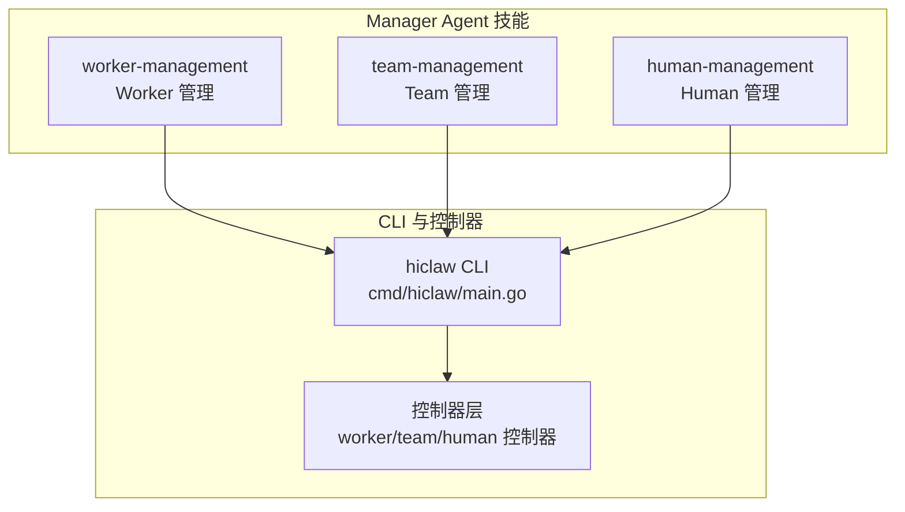
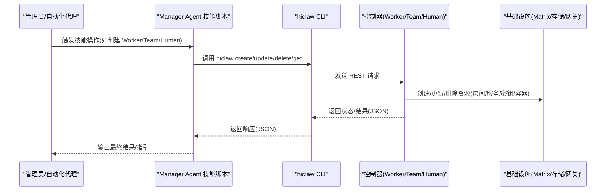
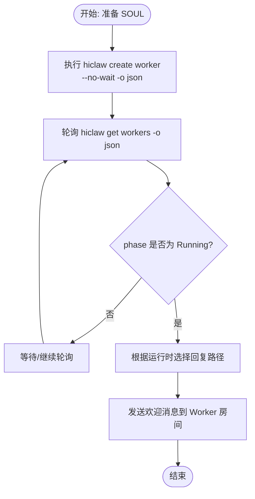
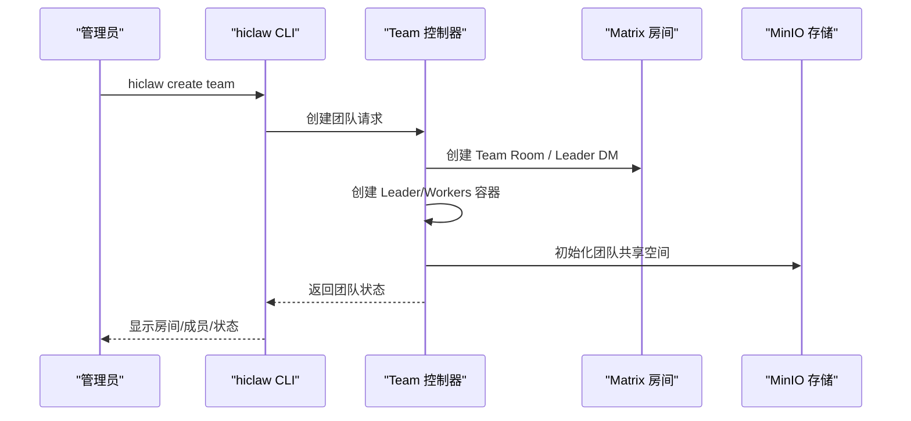
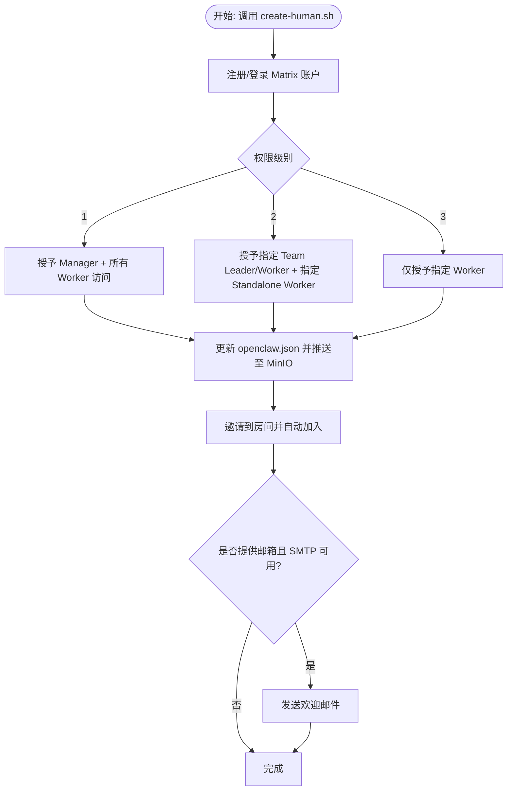
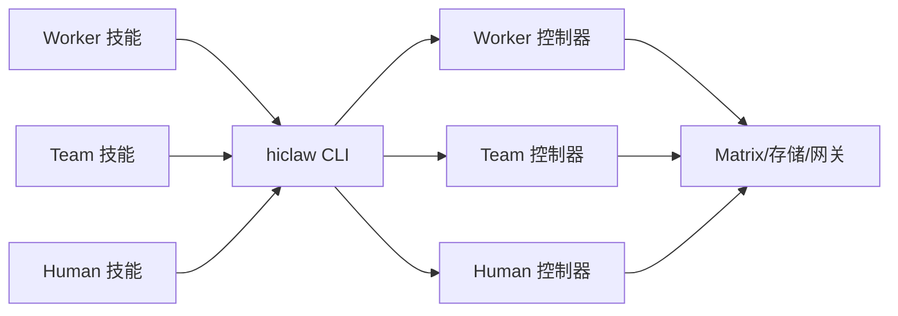

# 核心管理技能

<cite>
**本文引用的文件**
- [manager/agent/skills/worker-management/SKILL.md](file://manager/agent/skills/worker-management/SKILL.md)
- [manager/agent/skills/team-management/SKILL.md](file://manager/agent/skills/team-management/SKILL.md)
- [manager/agent/skills/human-management/SKILL.md](file://manager/agent/skills/human-management/SKILL.md)
- [manager/agent/skills/worker-management/references/create-worker.md](file://manager/agent/skills/worker-management/references/create-worker.md)
- [manager/agent/skills/team-management/references/create-team.md](file://manager/agent/skills/team-management/references/create-team.md)
- [manager/agent/skills/human-management/references/create-human.md](file://manager/agent/skills/human-management/references/create-human.md)
- [manager/agent/skills/worker-management/scripts/generate-worker-config.sh](file://manager/agent/skills/worker-management/scripts/generate-worker-config.sh)
- [manager/agent/skills/team-management/scripts/create-team.sh](file://manager/agent/skills/team-management/scripts/create-team.sh)
- [manager/agent/skills/human-management/scripts/create-human.sh](file://manager/agent/skills/human-management/scripts/create-human.sh)
- [hiclaw-controller/cmd/hiclaw/main.go](file://hiclaw-controller/cmd/hiclaw/main.go)
- [hiclaw-controller/internal/controller/worker_controller.go](file://hiclaw-controller/internal/controller/worker_controller.go)
- [hiclaw-controller/internal/controller/team_controller.go](file://hiclaw-controller/internal/controller/team_controller.go)
- [hiclaw-controller/internal/controller/human_controller.go](file://hiclaw-controller/internal/controller/human_controller.go)
</cite>

## 目录
1. [简介](#简介)
2. [项目结构](#项目结构)
3. [核心组件](#核心组件)
4. [架构总览](#架构总览)
5. [详细组件分析](#详细组件分析)
6. [依赖分析](#依赖分析)
7. [性能考虑](#性能考虑)
8. [故障排除指南](#故障排除指南)
9. [结论](#结论)
10. [附录](#附录)

## 简介
本文件聚焦 HiClaw Manager 的三大核心管理技能：Worker 管理、Team 管理与 Human 管理。目标是帮助管理员与自动化代理理解以下内容：
- 每个技能的功能边界与典型用法
- 关键配置参数、命令与脚本路径
- 实际操作流程与最佳实践
- 技能之间的协作关系与依赖
- 常见问题排查与性能优化建议

## 项目结构
HiClaw 将“管理技能”以“技能包（Skill）”的形式组织在 Manager Agent 的目录中，每个技能包含：
- SKILL.md：技能概述、操作参考与注意事项
- references/*：详细流程文档（如创建 Worker/Team/Human 的完整步骤）
- scripts/*：可直接调用的 Bash 脚本，封装 CLI、矩阵房间、权限与存储等操作

图示来源
- [hiclaw-controller/cmd/hiclaw/main.go:9-34](file://hiclaw-controller/cmd/hiclaw/main.go#L9-L34)
- [hiclaw-controller/internal/controller/worker_controller.go:57-151](file://hiclaw-controller/internal/controller/worker_controller.go#L57-L151)
- [hiclaw-controller/internal/controller/team_controller.go:76-106](file://hiclaw-controller/internal/controller/team_controller.go#L76-L106)
- [hiclaw-controller/internal/controller/human_controller.go:29-96](file://hiclaw-controller/internal/controller/human_controller.go#L29-L96)

章节来源
- [hiclaw-controller/cmd/hiclaw/main.go:9-34](file://hiclaw-controller/cmd/hiclaw/main.go#L9-L34)

## 核心组件
- Worker 管理：负责 Worker 的创建、生命周期、运行时切换、技能推送、控制台开关、@提及策略等。
- Team 管理：负责团队创建、成员编排、Leader 容器与 Worker 容器的统一收敛、房间与共享存储初始化。
- Human 管理：负责真实用户的导入、权限级别计算与应用、矩阵房间邀请与回退配置。

章节来源
- [manager/agent/skills/worker-management/SKILL.md:1-83](file://manager/agent/skills/worker-management/SKILL.md#L1-L83)
- [manager/agent/skills/team-management/SKILL.md:1-48](file://manager/agent/skills/team-management/SKILL.md#L1-L48)
- [manager/agent/skills/human-management/SKILL.md:1-45](file://manager/agent/skills/human-management/SKILL.md#L1-L45)

## 架构总览
从“技能层”到“控制器层”的调用链如下：

图示来源
- [hiclaw-controller/cmd/hiclaw/main.go:9-34](file://hiclaw-controller/cmd/hiclaw/main.go#L9-L34)
- [hiclaw-controller/internal/controller/worker_controller.go:57-151](file://hiclaw-controller/internal/controller/worker_controller.go#L57-L151)
- [hiclaw-controller/internal/controller/team_controller.go:76-106](file://hiclaw-controller/internal/controller/team_controller.go#L76-L106)
- [hiclaw-controller/internal/controller/human_controller.go:29-96](file://hiclaw-controller/internal/controller/human_controller.go#L29-L96)

## 详细组件分析

### Worker 管理技能
- 功能要点
  - 快速创建：通过 CLI 传入内联 SOUL 文本，避免 Heredoc 导致的 0 字节陷阱；支持 --no-wait 非阻塞返回，随后轮询状态。
  - 生命周期：启动/停止/检查空闲 Worker；删除 Worker 容器；重置 Worker（删除后重建）。
  - 运行时切换：在 openclaw/copaw/hermes 之间迁移，保留 Matrix 账号/房间/网关消费者/MinIO 数据，丢弃容器本地状态。
  - 技能管理：推送/添加/移除 Worker 技能；默认包含 file-sync/task-progress/project-participation。
  - 通信策略：启用/禁用 Worker 间直接 @提及；配置 groupAllowFrom/dm.allowFrom；支持通道策略叠加。
  - 控制台：打开/关闭 CoPaw 控制台。
  - 其他：远程模式(--remote)与本地模式的区别；文件同步提醒；Worker 无状态特性。

- 关键配置与参数
  - CLI 参数：--name、--soul、--model、--mcp-servers、--skills、--runtime、--no-wait、-o json
  - 运行时：openclaw(默认)、copaw、hermes
  - 通道策略：groupAllowExtra/groupDenyExtra/dmAllowExtra/dmDenyExtra
  - 远程模式：--remote 表示“从 Manager 角度看是远端”，即管理员本地机器

- 操作流程（创建 Worker）
  1) 准备 SOUL 内容（不写文件，直接传入 --soul）
  2) 执行 hiclaw create worker --no-wait -o json
  3) 轮询 hiclaw get workers -o json，等待 phase=Running
  4) 根据 Manager 运行时选择回复路径（OpenClaw/Hermes 可增量 DM；CoPaw 使用延迟问候）
  5) 成功后发送欢迎消息至 Worker 房间

- 脚本与参考
  - 操作参考与注意事项：SKILL.md
  - 完整创建流程与 CLI 参数详解：references/create-worker.md
  - Worker 配置生成（openclaw.json）：generate-worker-config.sh

图示来源
- [manager/agent/skills/worker-management/references/create-worker.md:138-169](file://manager/agent/skills/worker-management/references/create-worker.md#L138-L169)
- [manager/agent/skills/worker-management/SKILL.md:45-60](file://manager/agent/skills/worker-management/SKILL.md#L45-L60)

章节来源
- [manager/agent/skills/worker-management/SKILL.md:1-83](file://manager/agent/skills/worker-management/SKILL.md#L1-L83)
- [manager/agent/skills/worker-management/references/create-worker.md:1-277](file://manager/agent/skills/worker-management/references/create-worker.md#L1-L277)
- [manager/agent/skills/worker-management/scripts/generate-worker-config.sh:1-299](file://manager/agent/skills/worker-management/scripts/generate-worker-config.sh#L1-L299)

### Team 管理技能
- 功能要点
  - 团队由 Team Leader + 多个 Worker 组成，Leader 是具备团队管理技能的特殊 Worker。
  - 管理员向 Leader 下达任务，Leader 在团队房间内协调 Worker。
  - 控制器负责创建团队房间、Leader DM、Leader/Worker 容器、注入协调上下文、初始化共享存储，并维护注册表。

- 关键配置与参数
  - CLI：hiclaw create team --name --leader-name --leader-model --workers
  - 权限边界：Leader 仅与 Manager、Global Admin、Team Admin 以及团队成员通信
  - 默认运行时：控制器强制 copaw（Leader 与 Worker）

- 操作流程（创建团队）
  1) 使用 hiclaw create team 创建团队
  2) 校验团队状态：hiclaw get team
  3) 在 Leader 房间 @Leader 分配任务
  4) Leader 协调团队工作流

- 脚本与参考
  - 操作参考：SKILL.md
  - 完整创建流程与控制器行为：references/create-team.md
  - 团队创建脚本（房间/存储/注册表/上下文注入）：create-team.sh

图示来源
- [manager/agent/skills/team-management/references/create-team.md:3-41](file://manager/agent/skills/team-management/references/create-team.md#L3-L41)
- [manager/agent/skills/team-management/scripts/create-team.sh:1-651](file://manager/agent/skills/team-management/scripts/create-team.sh#L1-L651)
- [hiclaw-controller/internal/controller/team_controller.go:108-200](file://hiclaw-controller/internal/controller/team_controller.go#L108-L200)

章节来源
- [manager/agent/skills/team-management/SKILL.md:1-48](file://manager/agent/skills/team-management/SKILL.md#L1-L48)
- [manager/agent/skills/team-management/references/create-team.md:1-41](file://manager/agent/skills/team-management/references/create-team.md#L1-L41)
- [manager/agent/skills/team-management/scripts/create-team.sh:1-651](file://manager/agent/skills/team-management/scripts/create-team.sh#L1-L651)

### Human 管理技能
- 功能要点
  - 导入真实用户：自动注册 Matrix 账户、配置权限级别、可选发送欢迎邮件。
  - 权限级别（包含性）：Level 1（全局访问）、Level 2（团队+指定 Worker）、Level 3（仅指定 Worker）。
  - 会话边界：Human 不需要容器/MinIO/网关消费者，仅需房间访问与 groupAllowFrom。

- 关键配置与参数
  - CLI：--matrix-id --name --level [ --teams --workers --email --note ]
  - SMTP 环境变量：HICLAW_SMTP_HOST/PORT/USER/PASS/FROM
  - 注册表：更新 humans-registry.json 并通知受影响的 Agent 执行 file-sync

- 操作流程（创建 Human）
  1) 调用 create-human.sh
  2) 自动注册 Matrix 账户并登录获取 Token
  3) 根据权限级别更新各 Agent 的 groupAllowFrom 并推送至 MinIO
  4) 邀请到相应房间并自动加入
  5) 可选发送欢迎邮件

- 脚本与参考
  - 操作参考：SKILL.md
  - 完整流程与环境要求：references/create-human.md
  - 人类账户创建脚本：create-human.sh

图示来源
- [manager/agent/skills/human-management/references/create-human.md:1-84](file://manager/agent/skills/human-management/references/create-human.md#L1-L84)
- [manager/agent/skills/human-management/scripts/create-human.sh:1-379](file://manager/agent/skills/human-management/scripts/create-human.sh#L1-L379)

章节来源
- [manager/agent/skills/human-management/SKILL.md:1-45](file://manager/agent/skills/human-management/SKILL.md#L1-L45)
- [manager/agent/skills/human-management/references/create-human.md:1-84](file://manager/agent/skills/human-management/references/create-human.md#L1-L84)
- [manager/agent/skills/human-management/scripts/create-human.sh:1-379](file://manager/agent/skills/human-management/scripts/create-human.sh#L1-L379)

## 依赖分析
- 技能与 CLI 的耦合
  - Worker/Team/Human 技能均通过 hiclaw CLI 与控制器交互，CLI 提供统一的 create/get/update/delete/status 命令入口。
- 控制器对基础设施的依赖
  - Worker 控制器：负责 Worker 容器生命周期、配置生成、暴露端口、矩阵房间与权限、网关消费者与 MCP 授权。
  - Team 控制器：负责团队房间、Leader DM、Leader/Worker 容器、共享存储、注册表与上下文注入。
  - Human 控制器：负责矩阵账户与房间成员身份的声明式收敛。
- 脚本与控制器的协作
  - 技能脚本封装了 CLI 调用、轮询、错误处理与后续动作（如发送欢迎消息），控制器负责幂等收敛与状态持久化。

图示来源
- [hiclaw-controller/cmd/hiclaw/main.go:9-34](file://hiclaw-controller/cmd/hiclaw/main.go#L9-L34)
- [hiclaw-controller/internal/controller/worker_controller.go:57-151](file://hiclaw-controller/internal/controller/worker_controller.go#L57-L151)
- [hiclaw-controller/internal/controller/team_controller.go:76-106](file://hiclaw-controller/internal/controller/team_controller.go#L76-L106)
- [hiclaw-controller/internal/controller/human_controller.go:29-96](file://hiclaw-controller/internal/controller/human_controller.go#L29-L96)

章节来源
- [hiclaw-controller/internal/controller/worker_controller.go:57-151](file://hiclaw-controller/internal/controller/worker_controller.go#L57-L151)
- [hiclaw-controller/internal/controller/team_controller.go:76-106](file://hiclaw-controller/internal/controller/team_controller.go#L76-L106)
- [hiclaw-controller/internal/controller/human_controller.go:29-96](file://hiclaw-controller/internal/controller/human_controller.go#L29-L96)

## 性能考虑
- 避免阻塞式等待：Worker 创建使用 --no-wait，随后轮询状态，减少 CLI 阻塞时间。
- 批量创建：在一轮中并发触发多个 Worker 创建，再统一轮询，提高吞吐。
- CoPaw Manager 的回复路径：由于单轮最终回复限制，采用延迟问候与心跳处理队列，避免阻塞下一轮交互。
- 资源收敛频率：控制器按固定间隔轮询收敛，避免频繁变更导致的抖动。
- 文件同步：默认 5 分钟周期为兜底，重要变更后应显式触发 file-sync。

## 故障排除指南
- Worker 创建失败
  - 现象：phase=Failed，message 字段包含错误信息
  - 处理：读取 message 字段并反馈管理员；不要重复创建（会返回 409 冲突）
  - 参考：references/create-worker.md 中的“What NOT to do”与“轮询与错误处理”
- Worker 未就绪
  - 现象：phase=Pending 超过预期时间
  - 处理：确认控制器已接受请求；检查 MCP 服务器授权、模型可用性、容器镜像拉取与健康检查
- 运行时切换异常
  - 现象：切换后容器未重建或状态卡住
  - 处理：确认 --runtime 与 --package-dir/--channel-policy 的组合限制；远程模式需在管理员本地执行删除后再重新创建
- Team 房间权限问题
  - 现象：Leader/Worker 无法收到任务或被踢出房间
  - 处理：检查团队房间权限与组允许列表；确认 Team Admin 已加入房间并具有相应权限
- Human 权限未生效
  - 现象：Human 无法进入房间或被拒绝
  - 处理：确认 humans-registry.json 更新成功；确保受影响 Agent 已执行 file-sync；检查 SMTP 配置（如需发送欢迎邮件）

章节来源
- [manager/agent/skills/worker-management/references/create-worker.md:138-169](file://manager/agent/skills/worker-management/references/create-worker.md#L138-L169)
- [manager/agent/skills/team-management/SKILL.md:27-37](file://manager/agent/skills/team-management/SKILL.md#L27-L37)
- [manager/agent/skills/human-management/references/create-human.md:35-60](file://manager/agent/skills/human-management/references/create-human.md#L35-L60)

## 结论
- Worker/Team/Human 三大技能覆盖了 HiClaw 的核心管理场景，通过 CLI 与控制器实现声明式收敛。
- 技能脚本提供了清晰的操作路径与错误处理建议，配合控制器的幂等收敛能力，能够稳定地支撑多 Worker、多 Team、多人类用户的协同工作流。
- 建议在生产环境中遵循“非阻塞创建 + 轮询状态 + 显式 file-sync”的流程，并结合权限与通道策略最小化沟通开销与安全风险。

## 附录
- 常用命令速查
  - Worker：hiclaw create worker、hiclaw get workers、hiclaw update worker --runtime
  - Team：hiclaw create team、hiclaw get team
  - Human：bash /opt/hiclaw/agent/skills/human-management/scripts/create-human.sh
- 关键脚本路径
  - Worker 配置生成：manager/agent/skills/worker-management/scripts/generate-worker-config.sh
  - 团队创建：manager/agent/skills/team-management/scripts/create-team.sh
  - 人类创建：manager/agent/skills/human-management/scripts/create-human.sh
- CLI 入口
  - hiclaw CLI：hiclaw-controller/cmd/hiclaw/main.go