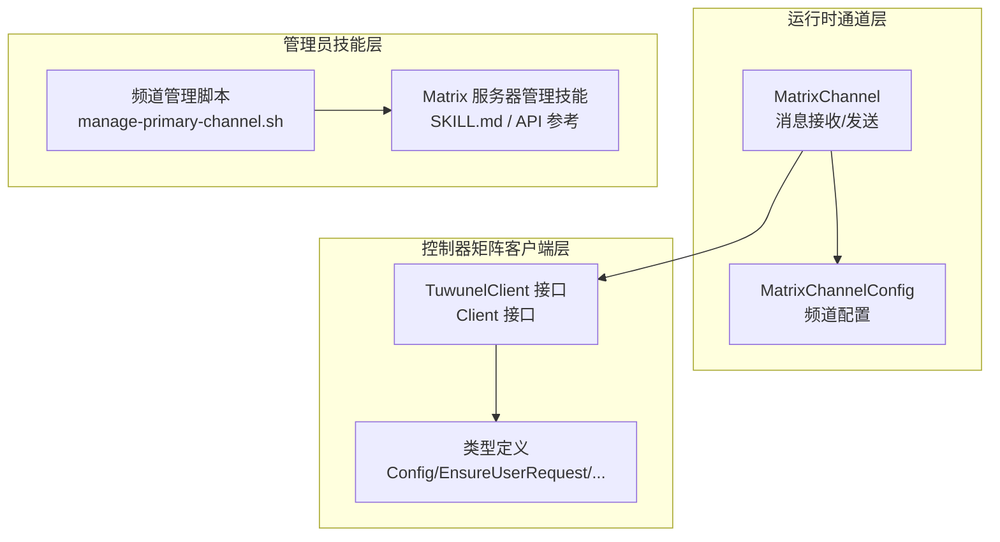
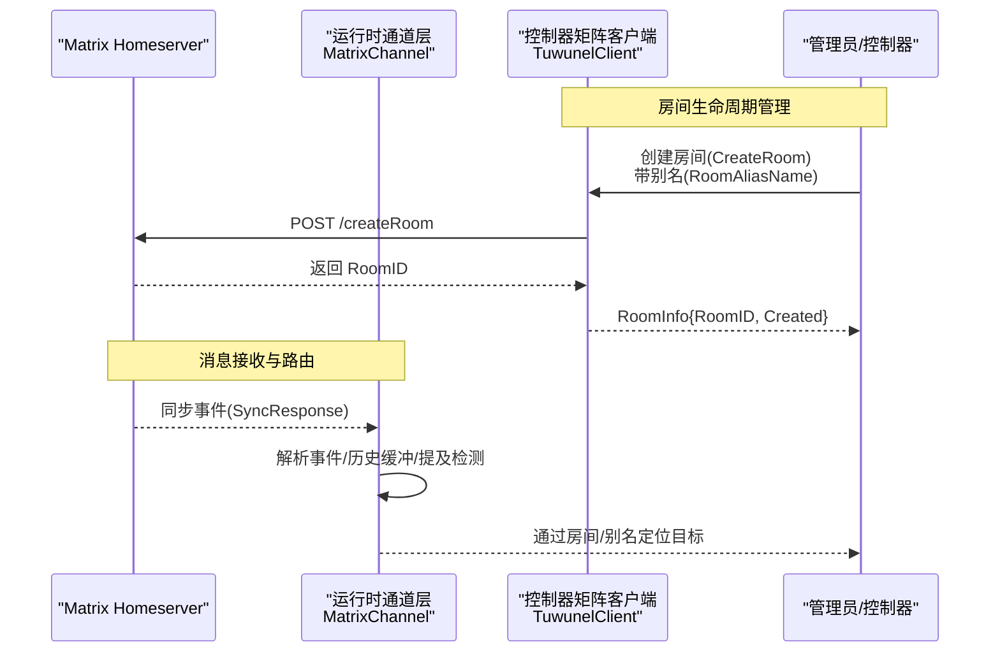
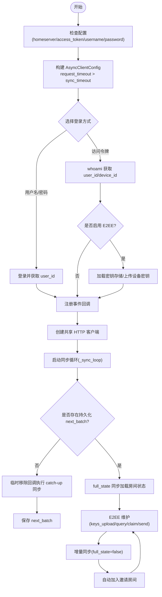
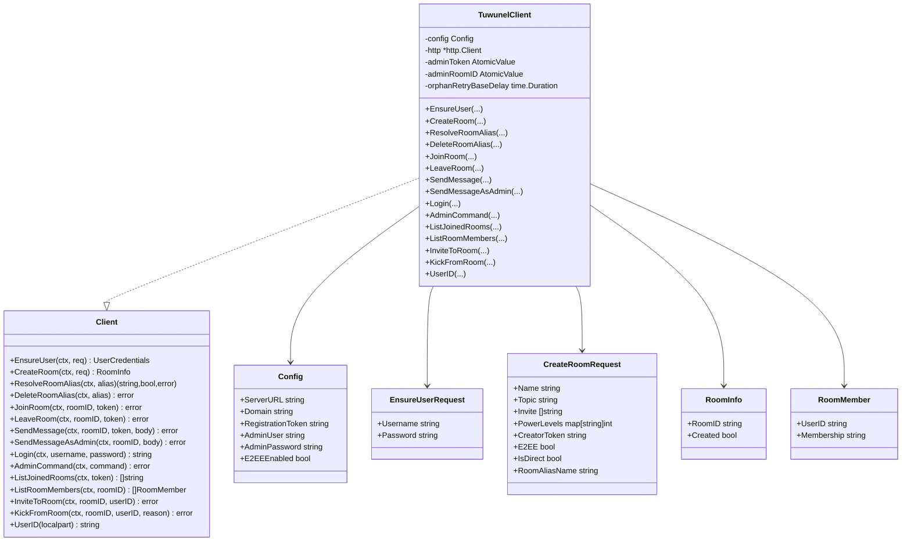
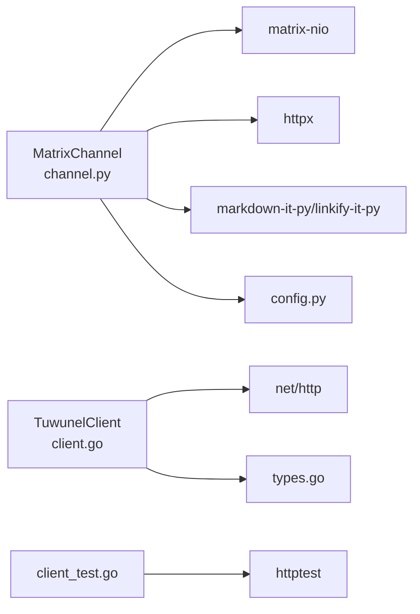

# 通信管理技能

<cite>
**本文引用的文件**
- [channel.py](file://copaw/src/matrix/channel.py)
- [config.py](file://copaw/src/matrix/config.py)
- [client.go](file://hiclaw-controller/internal/matrix/client.go)
- [types.go](file://hiclaw-controller/internal/matrix/types.go)
- [client_test.go](file://hiclaw-controller/internal/matrix/client_test.go)
- [manage-primary-channel.sh](file://manager/agent/skills/channel-management/scripts/manage-primary-channel.sh)
- [matrix-server-management SKILL.md](file://manager/agent/skills/matrix-server-management/SKILL.md)
- [matrix-server-management API 参考](file://manager/agent/skills/matrix-server-management/references/api-reference.md)
- [AGENTS.md](file://manager/agent/copaw-manager-agent/AGENTS.md)
</cite>

## 目录
1. [简介](#简介)
2. [项目结构](#项目结构)
3. [核心组件](#核心组件)
4. [架构总览](#架构总览)
5. [详细组件分析](#详细组件分析)
6. [依赖分析](#依赖分析)
7. [性能考虑](#性能考虑)
8. [故障排查指南](#故障排查指南)
9. [结论](#结论)
10. [附录](#附录)

## 简介
本文件面向 HiClaw Manager 的“通信管理技能”，系统性阐述以下能力与实现细节：
- Channel 管理：基于 Matrix 协议的聊天通道接入、消息解析、历史缓冲与提及检测。
- Matrix 服务器管理技能：通过控制器对 Homeserver 的用户注册、房间创建与成员管理等操作进行自动化编排。
- 频道配置、联系人管理与消息路由：如何在允许白名单策略下，结合房间别名与权限级别实现稳定的通信路由。
- 安全与性能：端到端加密（E2EE）开关、同步令牌持久化、速率限制与重试策略、超时参数调优。

## 项目结构
围绕通信管理的关键代码分布在三个层面：
- 运行时通道层（Python）：实现 Matrix 事件监听、消息格式转换、历史缓冲与提及处理。
- 控制器矩阵客户端层（Go）：封装 Homeserver CS API，提供用户、房间、成员管理等能力。
- 管理员技能层（Shell/CLI）：提供频道主通道管理与 Matrix 服务器管理技能的使用指引。

**图表来源**
- [channel.py](file://copaw/src/matrix/channel.py)
- [config.py](file://copaw/src/matrix/config.py)
- [client.go](file://hiclaw-controller/internal/matrix/client.go)
- [types.go](file://hiclaw-controller/internal/matrix/types.go)
- [manage-primary-channel.sh](file://manager/agent/skills/channel-management/scripts/manage-primary-channel.sh)
- [matrix-server-management SKILL.md](file://manager/agent/skills/matrix-server-management/SKILL.md)

**章节来源**
- [channel.py](file://copaw/src/matrix/channel.py)
- [config.py](file://copaw/src/matrix/config.py)
- [client.go](file://hiclaw-controller/internal/matrix/client.go)
- [types.go](file://hiclaw-controller/internal/matrix/types.go)

## 核心组件
- MatrixChannel：基于 matrix-nio 的异步客户端，负责登录、事件回调注册、增量同步、E2EE 维护、消息历史缓冲与提及检测。
- MatrixChannelConfig：从配置加载频道参数，支持允许白名单、组策略、历史缓冲上限、同步超时、结构化提及等。
- TuwunelClient：面向 Tuwunel（conduwuit）Homeserver 的客户端，提供用户确保、房间创建/解析/删除、加入/离开、消息发送、成员列表、邀请/踢出等。
- 类型定义：统一的请求/响应结构体，保证接口一致性与可测试性。

**章节来源**
- [channel.py](file://copaw/src/matrix/channel.py)
- [config.py](file://copaw/src/matrix/config.py)
- [client.go](file://hiclaw-controller/internal/matrix/client.go)
- [types.go](file://hiclaw-controller/internal/matrix/types.go)

## 架构总览
下图展示从消息进入、到房间管理与成员控制的整体流程：

**图表来源**
- [client.go](file://hiclaw-controller/internal/matrix/client.go)
- [channel.py](file://copaw/src/matrix/channel.py)

## 详细组件分析

### MatrixChannel 组件分析
- 登录与客户端初始化
  - 支持访问令牌与用户名/密码两种登录方式；当启用 E2EE 时，自动加载密钥存储并上传设备密钥。
  - 请求超时严格大于长轮询同步超时，避免 HTTP 层提前断开连接。
- 同步循环与令牌持久化
  - 首次部署或升级场景下，先执行 catch-up 同步抑制回调，仅保存 next_batch；随后恢复增量同步。
  - 同步令牌持久化至 COPAW_WORKING_DIR 下的文件，启动时由文件同步服务拉取，确保跨容器重启不丢失状态。
- 历史缓冲与提及检测
  - 在未被 @ 提及的消息中，按房间缓冲最近 N 条文本，形成“上下文历史”与“当前消息”的分段标记，便于模型区分。
  - 多种提及检测方式：结构化 m.mentions、matrix.to 链接、纯文本 MXID 匹配，并支持显示名称与本地部分的前缀剥离。
- 允许白名单与房间策略
  - 支持 DM 与群组两类策略，分别维护 allowlist；群组策略还支持 per-room 覆盖项（requireMention/autoReply）。
  - 支持过滤工具消息与思考内容，以及根据模型能力决定是否发送图片媒体。
- E2EE 维护
  - 在每次同步后执行密钥上传、查询、声明与 to-device 消息发送，维持会话健康。

**图表来源**
- [channel.py](file://copaw/src/matrix/channel.py)

**章节来源**
- [channel.py](file://copaw/src/matrix/channel.py)

### MatrixChannelConfig 与频道配置
- 关键字段
  - homeserver/access_token：Homeserver 地址与访问令牌。
  - dm_policy/group_policy/allow_from/group_allow_from：DM 与群组允许白名单策略。
  - groups：每房间覆盖项，如 requireMention/autoReply。
  - history_limit：房间内历史缓冲上限。
  - sync_timeout_ms：matrix-nio 长轮询超时。
  - encryption/vision_enabled/outbound_structured_mentions/mention_pill_in_body：E2EE 开关、视觉模型能力、结构化提及策略。
- 默认行为
  - 默认开启 allowlist 策略，历史缓冲上限为 50 条，同步超时 30 秒。

**章节来源**
- [config.py](file://copaw/src/matrix/config.py)

### TuwunelClient 与房间管理
- 用户管理
  - EnsureUser：优先尝试注册，失败且为 M_USER_IN_USE 时回退登录；若用户存在但无法登录（孤儿态），通过 AdminCommand 触发重置密码并重试。
- 房间管理
  - CreateRoom：支持 preset/trusted_private_chat、初始加密、房间别名（RoomAliasName）以保证幂等。
  - ResolveRoomAlias/DeleteRoomAlias：解析与删除别名，删除对缺失别名幂等。
- 成员管理
  - ListRoomMembers：返回 join/invite 成员集合。
  - InviteToRoom/KickFromRoom：邀请与踢出，对已入/已离幂等处理。
- 系统级消息
  - AdminCommand：向 #admins:<domain> 发送命令消息；SendMessageAsAdmin：以管理员身份发送消息。

**图表来源**
- [client.go](file://hiclaw-controller/internal/matrix/client.go)
- [types.go](file://hiclaw-controller/internal/matrix/types.go)

**章节来源**
- [client.go](file://hiclaw-controller/internal/matrix/client.go)
- [types.go](file://hiclaw-controller/internal/matrix/types.go)

### 管理员技能：频道管理与 Matrix 服务器管理
- 频道管理
  - 主频道（Primary Channel）管理脚本用于维护管理员与 Worker 之间的主沟通房间，确保房间别名、成员与权限正确。
- Matrix 服务器管理技能
  - 提供与 Homeserver 的直接交互参考，包括用户、房间、成员等 API 的使用示例与注意事项。
  - 强调通过 CLI 与运行时通道层发送消息的重要性，避免绕过格式化层导致渲染异常。

**章节来源**
- [manage-primary-channel.sh](file://manager/agent/skills/channel-management/scripts/manage-primary-channel.sh)
- [matrix-server-management SKILL.md](file://manager/agent/skills/matrix-server-management/SKILL.md)
- [matrix-server-management API 参考](file://manager/agent/skills/matrix-server-management/references/api-reference.md)
- [AGENTS.md](file://manager/agent/copaw-manager-agent/AGENTS.md)

## 依赖分析
- 运行时通道层依赖
  - matrix-nio：异步客户端、事件回调、加密存储。
  - httpx：媒体下载的异步 HTTP 客户端。
  - markdown-it-py/linkify-it-py：Markdown 到 HTML 渲染与链接识别。
- 控制器客户端依赖
  - Go 标准库 net/http：HTTP 请求封装。
  - 原子值与并发：缓存管理员令牌与管理员房间 ID，避免重复认证与解析。
- 测试依赖
  - httptest：模拟 Homeserver 行为，验证 EnsureUser、CreateRoom、成员管理等路径。

**图表来源**
- [channel.py](file://copaw/src/matrix/channel.py)
- [config.py](file://copaw/src/matrix/config.py)
- [client.go](file://hiclaw-controller/internal/matrix/client.go)
- [client_test.go](file://hiclaw-controller/internal/matrix/client_test.go)
- [types.go](file://hiclaw-controller/internal/matrix/types.go)

**章节来源**
- [channel.py](file://copaw/src/matrix/channel.py)
- [config.py](file://copaw/src/matrix/config.py)
- [client.go](file://hiclaw-controller/internal/matrix/client.go)
- [client_test.go](file://hiclaw-controller/internal/matrix/client_test.go)
- [types.go](file://hiclaw-controller/internal/matrix/types.go)

## 性能考虑
- 同步超时与请求超时
  - 请求超时必须大于同步超时，避免 HTTP 层打断长轮询，减少不必要的重连。
- 历史缓冲上限
  - 通过 history_limit 控制房间内缓冲条目数量，降低内存占用与上下文长度。
- E2EE 维护频率
  - 在每次同步后执行密钥上传/查询/声明与 to-device 消息发送，保持会话健康，避免解密失败导致的消息丢失。
- 幂等房间创建
  - 使用 RoomAliasName 作为房间唯一标识，CreateRoom 通过 homeserver 保证幂等，避免并发重建。
- 成员列表过滤
  - ListRoomMembers 仅返回 join/invite 成员，减少无关数据传输与处理。

[本节为通用指导，无需特定文件引用]

## 故障排查指南
- 登录失败
  - 访问令牌登录失败：检查 whoami 返回与 device_id 是否存在；若无 device_id，E2EE 将被禁用。
  - 用户名/密码登录失败：确认凭据正确性与注册令牌。
- 同步异常
  - 无 next_batch：首次部署或升级后执行 catch-up 同步，仅保存 next_batch 不触发回调。
  - 增量同步错误：记录错误信息并等待 5 秒后重试。
- E2EE 相关
  - 密钥上传/查询/声明失败：检查网络与 homeserver 状态；必要时手动触发维护。
- 房间别名冲突
  - CreateRoom 返回 M_ROOM_IN_USE：通过 ResolveRoomAlias 获取现有 RoomID，避免重复创建。
- 成员管理幂等性
  - Invite/Kick 对已入/已离幂等：注意 403/404 的语义差异，确保非预期错误被正确上报。
- 消息格式问题
  - 直接调用 Matrix CS API 发送消息可能缺少 formatted_body 渲染；请使用 CLI 或运行时通道层发送。

**章节来源**
- [channel.py](file://copaw/src/matrix/channel.py)
- [client.go](file://hiclaw-controller/internal/matrix/client.go)
- [client_test.go](file://hiclaw-controller/internal/matrix/client_test.go)

## 结论
HiClaw 的通信管理技能通过“运行时通道层 + 控制器客户端层 + 管理员技能层”的协同，实现了：
- 稳定的 Matrix 事件接入与消息路由；
- 基于别名与权限的房间生命周期管理；
- 可配置的允许白名单与历史缓冲策略；
- 可选的端到端加密与结构化提及；
- 明确的安全边界与性能调优建议。

这些能力共同支撑了多 Worker、多项目的协作式工作流，既满足日常任务编排，也兼顾了安全性与可运维性。

[本节为总结，无需特定文件引用]

## 附录

### 频道配置要点
- 启用 E2EE 时务必提供 store_path 并确保 device_id 存在。
- 设置合理的 sync_timeout_ms 与历史缓冲上限，平衡实时性与资源消耗。
- 使用 groups.per-room 覆盖项精确控制 requireMention/autoReply。

**章节来源**
- [config.py](file://copaw/src/matrix/config.py)

### 联系人与房间管理方法
- 使用 RoomAliasName 幂等创建房间，避免重复。
- 通过 InviteToRoom/KickFromRoom 管理成员，注意幂等性与错误码。
- 使用 ResolveRoomAlias/DeleteRoomAlias 管理别名，删除对缺失别名幂等。

**章节来源**
- [client.go](file://hiclaw-controller/internal/matrix/client.go)

### 消息路由与安全
- 通过 m.mentions + formatted_body 实现结构化提及，避免纯文本误判。
- 在 DM 与群组中分别应用允许白名单策略，防止未授权访问。
- 严禁在聊天中明文传输凭据，统一通过文件系统与 MinIO 传递敏感信息。

**章节来源**
- [channel.py](file://copaw/src/matrix/channel.py)
- [AGENTS.md](file://manager/agent/copaw-manager-agent/AGENTS.md)