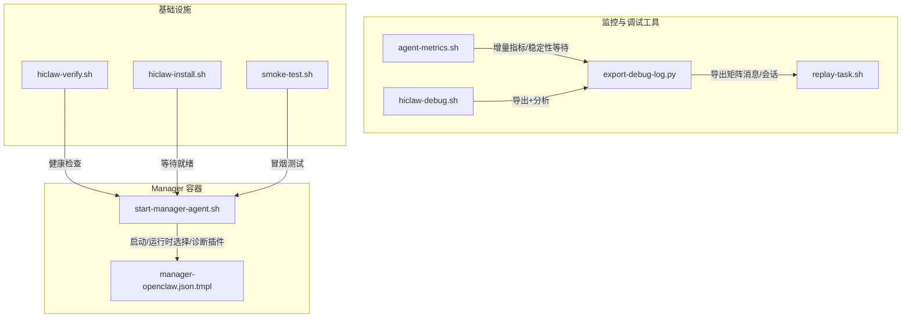
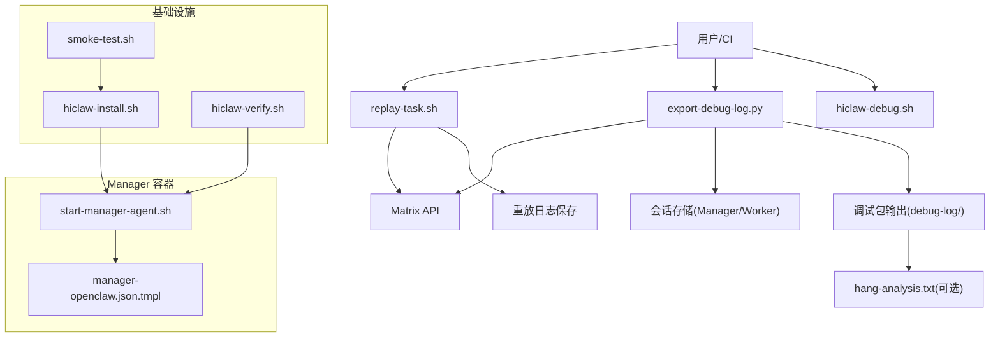
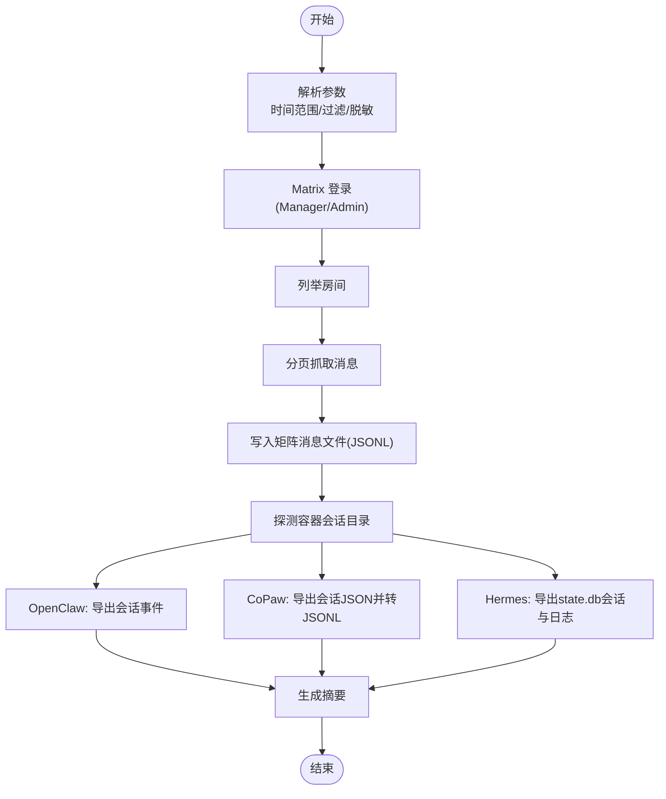
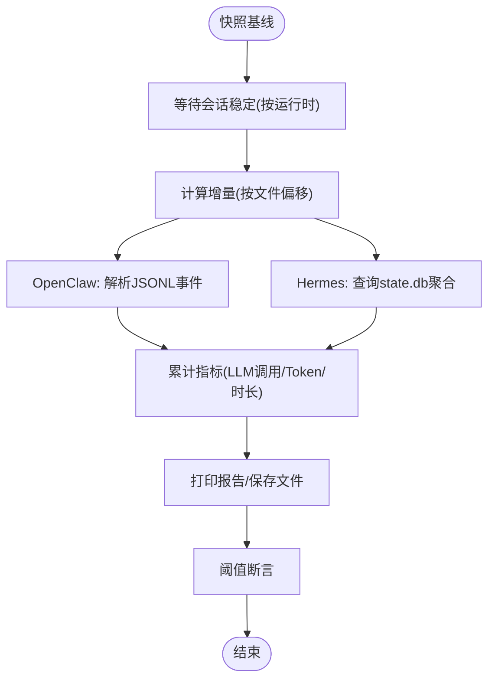
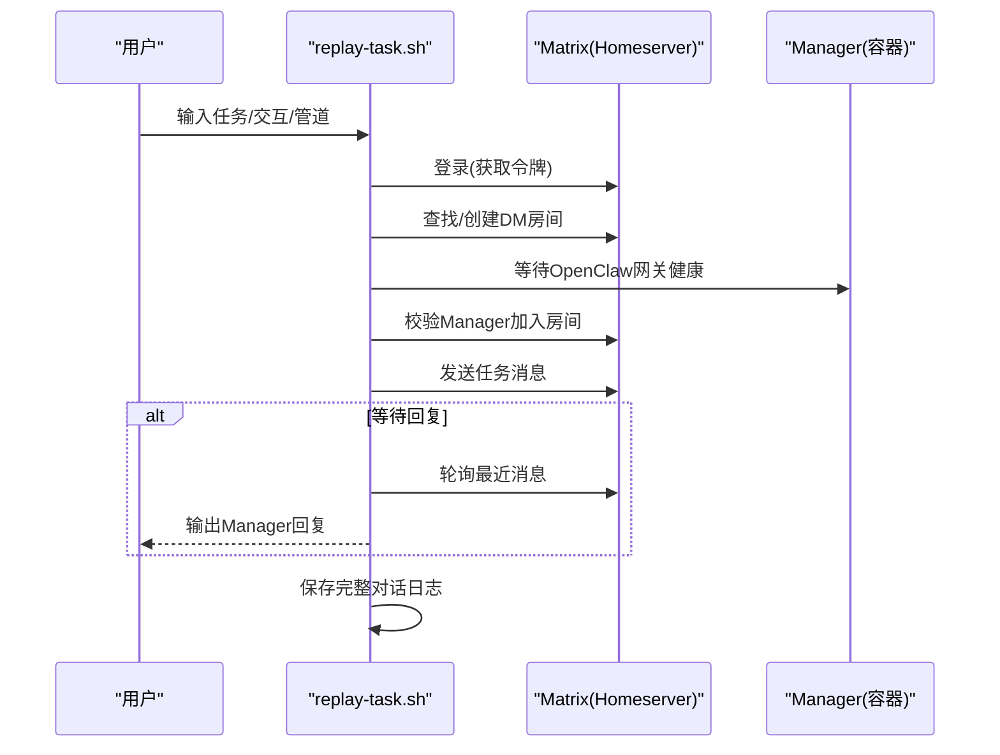
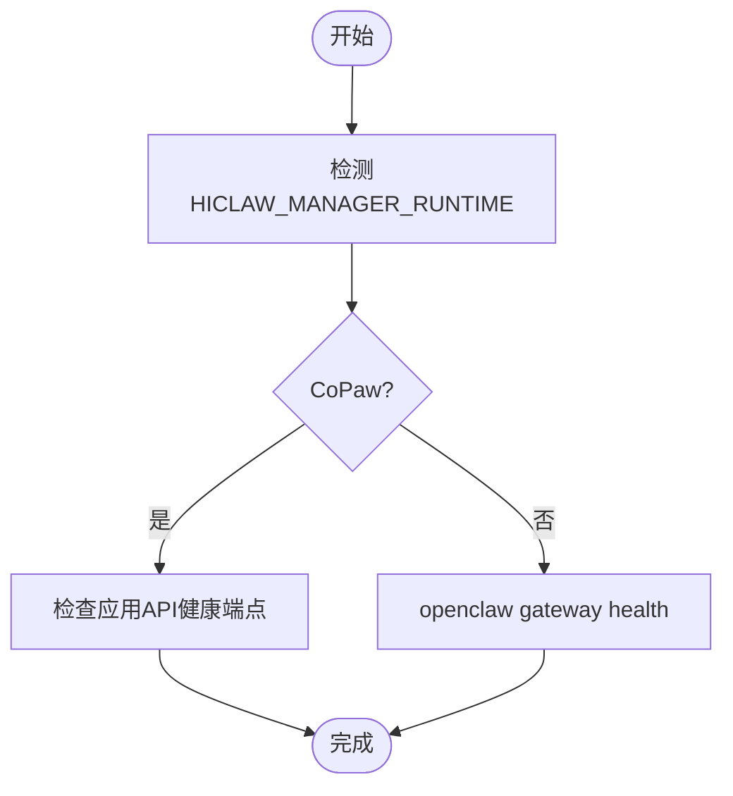
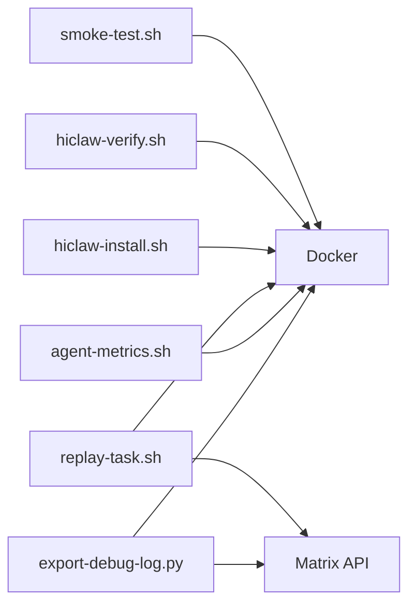

# Manager 监控与调试

<cite>
**本文引用的文件**
- [export-debug-log.py](file://scripts/export-debug-log.py)
- [replay-task.sh](file://scripts/replay-task.sh)
- [agent-metrics.sh](file://tests/lib/agent-metrics.sh)
- [hiclaw-debug.sh](file://tests/skills/hiclaw-test/scripts/hiclaw-debug.sh)
- [hiclaw-install.sh](file://install/hiclaw-install.sh)
- [hiclaw-verify.sh](file://install/hiclaw-verify.sh)
- [start-manager-agent.sh](file://manager/scripts/init/start-manager-agent.sh)
- [manager-openclaw.json.tmpl](file://manager/configs/manager-openclaw.json.tmpl)
- [manager-guide.md](file://docs/manager-guide.md)
- [faq.md](file://docs/faq.md)
- [smoke-test.sh](file://manager/tests/smoke-test.sh)
- [generate-worker-config.sh](file://manager/agent/skills/worker-management/scripts/generate-worker-config.sh)
</cite>

## 目录
1. [简介](#简介)
2. [项目结构](#项目结构)
3. [核心组件](#核心组件)
4. [架构总览](#架构总览)
5. [详细组件分析](#详细组件分析)
6. [依赖分析](#依赖分析)
7. [性能考虑](#性能考虑)
8. [故障排查指南](#故障排查指南)
9. [结论](#结论)
10. [附录](#附录)

## 简介
本文件面向 HiClaw Manager 的监控与调试场景，系统性阐述以下主题：
- 日志采集与分析：Manager Agent 日志、OpenClaw 运行时日志、基础设施日志
- 会话重放与对话记录回放流程：从 Matrix 消息到会话事件的完整链路
- 健康检查与系统状态监控：容器、服务、通道与网关健康
- 性能监控指标与阈值：LLM 调用次数、Token 使用量、时长等
- 常见问题诊断与调试技巧：典型错误定位、日志查看与修复建议
- 监控工具使用与最佳实践：导出调试日志、会话重放、指标断言与告警配置建议

## 项目结构
围绕监控与调试的关键目录与文件：
- scripts/export-debug-log.py：矩阵消息与代理会话导出工具
- scripts/replay-task.sh：任务重放脚本（Matrix 交互、等待回复、保存日志）
- tests/lib/agent-metrics.sh：会话指标提取、增量统计、稳定性等待
- tests/skills/hiclaw-test/scripts/hiclaw-debug.sh：调试日志导出与挂起分析
- install/hiclaw-install.sh 与 install/hiclaw-verify.sh：安装与健康检查
- manager/scripts/init/start-manager-agent.sh：Manager Agent 启动与运行时选择
- manager/configs/manager-openclaw.json.tmpl：OpenClaw 配置模板（通道、模型、心跳等）
- docs/manager-guide.md 与 docs/faq.md：监控与排障文档
- manager/tests/smoke-test.sh：冒烟测试（基础设施健康）
- manager/agent/skills/worker-management/scripts/generate-worker-config.sh：工作器配置生成（含可选诊断插件）

图示来源
- [export-debug-log.py:1-756](file://scripts/export-debug-log.py#L1-L756)
- [replay-task.sh:1-416](file://scripts/replay-task.sh#L1-L416)
- [agent-metrics.sh:1-800](file://tests/lib/agent-metrics.sh#L1-L800)
- [hiclaw-debug.sh:1-176](file://tests/skills/hiclaw-test/scripts/hiclaw-debug.sh#L1-L176)
- [hiclaw-install.sh:1082-1118](file://install/hiclaw-install.sh#L1082-L1118)
- [hiclaw-verify.sh:129-175](file://install/hiclaw-verify.sh#L129-L175)
- [start-manager-agent.sh:1-1258](file://manager/scripts/init/start-manager-agent.sh#L1-L1258)
- [manager-openclaw.json.tmpl:1-145](file://manager/configs/manager-openclaw.json.tmpl#L1-L145)
- [smoke-test.sh:1-70](file://manager/tests/smoke-test.sh#L1-L70)

章节来源
- [export-debug-log.py:1-756](file://scripts/export-debug-log.py#L1-L756)
- [replay-task.sh:1-416](file://scripts/replay-task.sh#L1-L416)
- [agent-metrics.sh:1-800](file://tests/lib/agent-metrics.sh#L1-L800)
- [hiclaw-debug.sh:1-176](file://tests/skills/hiclaw-test/scripts/hiclaw-debug.sh#L1-L176)
- [hiclaw-install.sh:1082-1118](file://install/hiclaw-install.sh#L1082-L1118)
- [hiclaw-verify.sh:129-175](file://install/hiclaw-verify.sh#L129-L175)
- [start-manager-agent.sh:1-1258](file://manager/scripts/init/start-manager-agent.sh#L1-L1258)
- [manager-openclaw.json.tmpl:1-145](file://manager/configs/manager-openclaw.json.tmpl#L1-L145)
- [smoke-test.sh:1-70](file://manager/tests/smoke-test.sh#L1-L70)

## 核心组件
- 调试日志导出器：支持按时间范围导出矩阵消息与代理会话，自动识别运行时布局，支持 PII 脱敏与过滤
- 会话指标采集器：解析 OpenClaw/Copaw/Hermes 会话文件，计算 LLM 调用次数、Token 使用量与时长，并支持增量与基线对比
- 会话重放器：通过 Matrix API 发送任务消息、等待回复、校验 Manager 就绪状态、保存完整对话日志
- 健康检查与就绪等待：安装脚本与验证脚本分别对 Manager Agent 与基础设施进行健康检查；支持按运行时差异化的就绪判断
- 冒烟测试：验证 MinIO、Tuwunel、Higress、Element Web 等关键服务可达性与进程状态
- 配置与运行时：Manager Agent 支持 OpenClaw 与 CoPaw 两种运行时；可选启用诊断插件（OTEL）以输出指标

章节来源
- [export-debug-log.py:1-756](file://scripts/export-debug-log.py#L1-L756)
- [agent-metrics.sh:1-800](file://tests/lib/agent-metrics.sh#L1-L800)
- [replay-task.sh:1-416](file://scripts/replay-task.sh#L1-L416)
- [hiclaw-install.sh:1082-1118](file://install/hiclaw-install.sh#L1082-L1118)
- [hiclaw-verify.sh:129-175](file://install/hiclaw-verify.sh#L129-L175)
- [smoke-test.sh:1-70](file://manager/tests/smoke-test.sh#L1-L70)
- [start-manager-agent.sh:1-1258](file://manager/scripts/init/start-manager-agent.sh#L1-L1258)

## 架构总览
下图展示了监控与调试系统的整体交互：从用户触发（重放或导出），到日志采集、指标统计与健康检查，再到结果呈现与告警。

图示来源
- [replay-task.sh:1-416](file://scripts/replay-task.sh#L1-L416)
- [export-debug-log.py:1-756](file://scripts/export-debug-log.py#L1-L756)
- [hiclaw-debug.sh:1-176](file://tests/skills/hiclaw-test/scripts/hiclaw-debug.sh#L1-L176)
- [start-manager-agent.sh:1-1258](file://manager/scripts/init/start-manager-agent.sh#L1-L1258)
- [manager-openclaw.json.tmpl:1-145](file://manager/configs/manager-openclaw.json.tmpl#L1-L145)
- [hiclaw-install.sh:1082-1118](file://install/hiclaw-install.sh#L1082-L1118)
- [hiclaw-verify.sh:129-175](file://install/hiclaw-verify.sh#L129-L175)
- [smoke-test.sh:1-70](file://manager/tests/smoke-test.sh#L1-L70)

## 详细组件分析

### 组件一：调试日志导出器（export-debug-log.py）
- 功能要点
  - 矩阵消息导出：登录、列出房间、分页拉取消息、格式化事件、写入 JSONL 文件
  - 代理会话导出：自动探测运行时（OpenClaw/Copaw/Hermes），按时间窗口筛选事件，支持脱敏
  - 输出结构：debug-log/{timestamp}/matrix-messages 与 agent-sessions 下按容器/会话拆分
- 关键流程（简化）
  - 解析时间范围与过滤参数
  - 登录 Matrix（优先使用 Manager 密码，失败回退管理员密码）
  - 列举房间并逐个抓取消息，写入文件
  - 探测各容器会话目录，按运行时导出会话事件
  - 生成汇总摘要

图示来源
- [export-debug-log.py:1-756](file://scripts/export-debug-log.py#L1-L756)

章节来源
- [export-debug-log.py:1-756](file://scripts/export-debug-log.py#L1-L756)

### 组件二：会话指标采集器（agent-metrics.sh）
- 功能要点
  - 自动识别运行时与会话目录（OpenClaw/Copaw/Hermes）
  - 稳定性等待：轮询最新会话文件大小，确保事件写入稳定后再采集
  - 增量采集：基于基线快照（文件偏移）仅读取新增事件，计算增量指标
  - 指标项：LLM 调用次数、输入/输出/缓存读写 Token、时长
  - 断言与报告：阈值断言、打印报告、保存指标文件
- 关键流程（简化）
  - 快照基线（Manager/Worker 所有会话文件偏移）
  - 等待会话稳定（OpenClaw/Hermes 差异化处理）
  - 增量解析（OpenClaw JSONL 或 Hermes state.db）
  - 汇总与断言（阈值检查）

图示来源
- [agent-metrics.sh:1-800](file://tests/lib/agent-metrics.sh#L1-L800)

章节来源
- [agent-metrics.sh:1-800](file://tests/lib/agent-metrics.sh#L1-L800)

### 组件三：会话重放器（replay-task.sh）
- 功能要点
  - 以“人类管理员”身份登录 Matrix，查找或创建与 Manager 的 DM 房间
  - 等待 Manager OpenClaw 网关健康与 Manager 加入房间
  - 发送任务消息，可选等待回复并保存完整对话日志
  - 支持通过 docker exec 访问内部端口，避免主机代理干扰
- 关键流程（简化）
  - 加载环境变量与默认配置
  - 登录 Matrix 获取访问令牌
  - 查找/创建 DM 房间并邀请 Manager
  - 等待 Manager 就绪（gateway 健康 + 加入房间）
  - 发送消息并可选等待回复
  - 导出房间消息到日志文件

图示来源
- [replay-task.sh:1-416](file://scripts/replay-task.sh#L1-L416)

章节来源
- [replay-task.sh:1-416](file://scripts/replay-task.sh#L1-L416)

### 组件四：健康检查与就绪等待（hiclaw-install.sh / hiclaw-verify.sh）
- 安装等待（hiclaw-install.sh）
  - 使用运行时差异化命令检测 Manager 就绪：CoPaw 使用应用 API，OpenClaw 使用 openclaw gateway health
  - 超时控制与进度提示
- 验证检查（hiclaw-verify.sh）
  - Matrix/Tuwunel/MinIO 可达性
  - Higress 控制台可达性
  - Manager Agent 健康检查（CoPaw/OpneClaw 差异化）

图示来源
- [hiclaw-install.sh:1082-1118](file://install/hiclaw-install.sh#L1082-L1118)
- [hiclaw-verify.sh:129-175](file://install/hiclaw-verify.sh#L129-L175)

章节来源
- [hiclaw-install.sh:1082-1118](file://install/hiclaw-install.sh#L1082-L1118)
- [hiclaw-verify.sh:129-175](file://install/hiclaw-verify.sh#L129-L175)

### 组件五：冒烟测试（smoke-test.sh）
- 验证关键服务与进程：MinIO、Tuwunel、Higress、Element Web、MC 客户端、supervisord、minio、tuwunel 进程
- 用于安装后快速确认基础设施可用性

章节来源
- [smoke-test.sh:1-70](file://manager/tests/smoke-test.sh#L1-L70)

### 组件六：配置与运行时（start-manager-agent.sh / manager-openclaw.json.tmpl / generate-worker-config.sh）
- 运行时选择：OpenClaw（默认）或 CoPaw
- 诊断插件：可选启用 diagnostics-otel 插件，配置 OTEL 端点、协议、头部与服务名
- OpenClaw 配置模板：通道（Matrix）、模型、心跳、会话策略、插件加载等

章节来源
- [start-manager-agent.sh:1-1258](file://manager/scripts/init/start-manager-agent.sh#L1-L1258)
- [manager-openclaw.json.tmpl:1-145](file://manager/configs/manager-openclaw.json.tmpl#L1-L145)
- [generate-worker-config.sh:209-230](file://manager/agent/skills/worker-management/scripts/generate-worker-config.sh#L209-L230)

## 依赖分析
- 外部依赖
  - Docker：容器生命周期管理、exec、日志查看
  - Matrix：Homeserver API（登录、房间、消息）
  - MinIO：对象存储（会话与配置）
  - Higress：网关路由与控制台
- 内部依赖
  - export-debug-log.py 依赖 Docker 与 Matrix API
  - agent-metrics.sh 依赖 Docker 与会话文件布局
  - replay-task.sh 依赖 Docker 与 Matrix API
  - hiclaw-install.sh / hiclaw-verify.sh 依赖容器内命令与端口可达性

图示来源
- [export-debug-log.py:1-756](file://scripts/export-debug-log.py#L1-L756)
- [agent-metrics.sh:1-800](file://tests/lib/agent-metrics.sh#L1-L800)
- [replay-task.sh:1-416](file://scripts/replay-task.sh#L1-L416)
- [hiclaw-install.sh:1082-1118](file://install/hiclaw-install.sh#L1082-L1118)
- [hiclaw-verify.sh:129-175](file://install/hiclaw-verify.sh#L129-L175)
- [smoke-test.sh:1-70](file://manager/tests/smoke-test.sh#L1-L70)

章节来源
- [export-debug-log.py:1-756](file://scripts/export-debug-log.py#L1-L756)
- [agent-metrics.sh:1-800](file://tests/lib/agent-metrics.sh#L1-L800)
- [replay-task.sh:1-416](file://scripts/replay-task.sh#L1-L416)
- [hiclaw-install.sh:1082-1118](file://install/hiclaw-install.sh#L1082-L1118)
- [hiclaw-verify.sh:129-175](file://install/hiclaw-verify.sh#L129-L175)
- [smoke-test.sh:1-70](file://manager/tests/smoke-test.sh#L1-L70)

## 性能考虑
- 指标维度
  - LLM 调用次数：衡量任务复杂度与工具调用频率
  - Token 使用量：输入/输出/缓存读写，评估上下文窗口压力
  - 时长：任务开始/结束时间差，评估执行效率
- 采集策略
  - OpenClaw：基于 JSONL 事件流，解析 assistant 角色中的 usage 字段
  - Hermes：基于 state.db 聚合查询，支持事务式增量
  - CoPaw：会话 JSON 中不含 Token usage，采用“不支持”占位并显式标注
- 稳定性等待
  - 对 OpenClaw/Hermes：轮询最新会话文件大小/最后事件时间，确保事件写入稳定
  - 对 CoPaw/Hermes：基于数据库聚合，跳过 JSONL 稳定等待
- 阈值断言
  - 提供默认阈值（可覆盖），在测试中统一断言，便于回归与告警

章节来源
- [agent-metrics.sh:1-800](file://tests/lib/agent-metrics.sh#L1-L800)
- [export-debug-log.py:1-756](file://scripts/export-debug-log.py#L1-L756)

## 故障排查指南
- 安装与就绪
  - 安装脚本等待 Manager 就绪：根据运行时选择差异化健康检查命令
  - 验证脚本：检查 Matrix/Tuwunel/MinIO/Higress 控制台可达性
- 日志查看
  - Manager Agent：容器日志与会话日志（OpenClaw）
  - 基础设施：控制器容器日志、Higress 控制台与网关日志
- 会话异常
  - “正在输入”长时间不消失：可能仍在执行；可通过会话文件或 TUI 观察
  - 会话损坏：在 TUI 中切换会话并尝试 /new 重置
- 模型与网关
  - 404/503：检查上游主机字段，区分路由问题与后端错误
  - 上下文窗口：确保目标模型的 contextWindow/maxTokens 正确配置
- 挂起分析
  - 使用 hiclaw-debug.sh 导出并分析 PHASE_DONE 消息是否遗漏 @manager 引用

章节来源
- [hiclaw-install.sh:1082-1118](file://install/hiclaw-install.sh#L1082-L1118)
- [hiclaw-verify.sh:129-175](file://install/hiclaw-verify.sh#L129-L175)
- [manager-guide.md:158-206](file://docs/manager-guide.md#L158-L206)
- [faq.md:472-584](file://docs/faq.md#L472-L584)
- [hiclaw-debug.sh:65-176](file://tests/skills/hiclaw-test/scripts/hiclaw-debug.sh#L65-L176)

## 结论
HiClaw Manager 的监控与调试体系以“可观测、可回放、可验证”为核心目标：通过 export-debug-log.py 实现全链路日志采集，借助 agent-metrics.sh 进行指标统计与阈值断言，配合 replay-task.sh 完成会话重放与回放日志保存，结合 hiclaw-install.sh/hiclaw-verify.sh 与 smoke-test.sh 构建健康检查与冒烟测试闭环。该体系既适用于日常运维，也适用于自动化测试与问题复盘。

## 附录
- 使用建议
  - 导出调试日志：指定时间范围与过滤条件，必要时关闭 PII 脱敏以便人工分析
  - 会话重放：在可控环境中发送任务消息，记录回复并保存日志，便于后续复盘
  - 指标断言：在测试中设置合理阈值，结合基线快照进行增量对比
  - 健康检查：定期运行验证脚本与冒烟测试，确保基础设施稳定
- 常用命令参考
  - 查看 Manager Agent 日志与会话日志
  - Higress 控制台与网关日志
  - Element Web 与 MinIO 访问
  - TUI 会话诊断与重置

章节来源
- [manager-guide.md:158-206](file://docs/manager-guide.md#L158-L206)
- [faq.md:602-628](file://docs/faq.md#L602-L628)