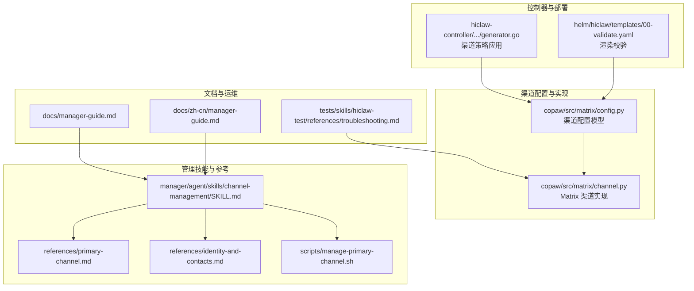
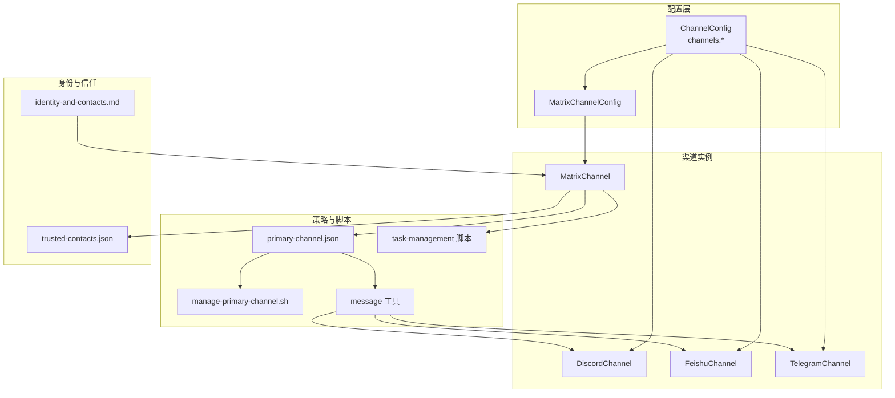
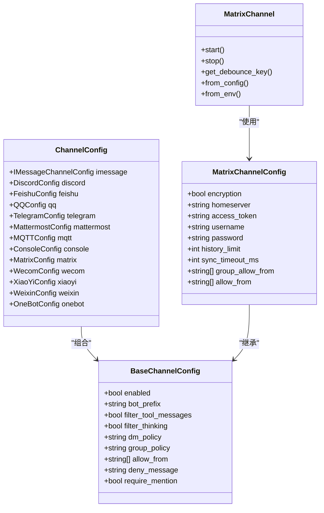
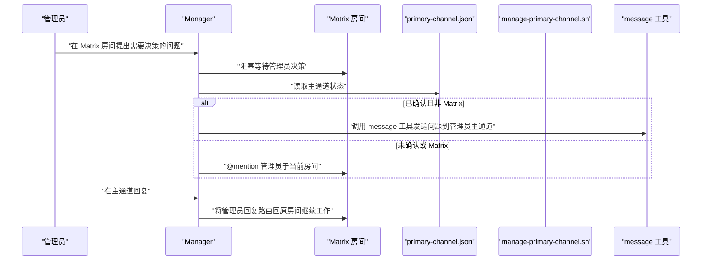
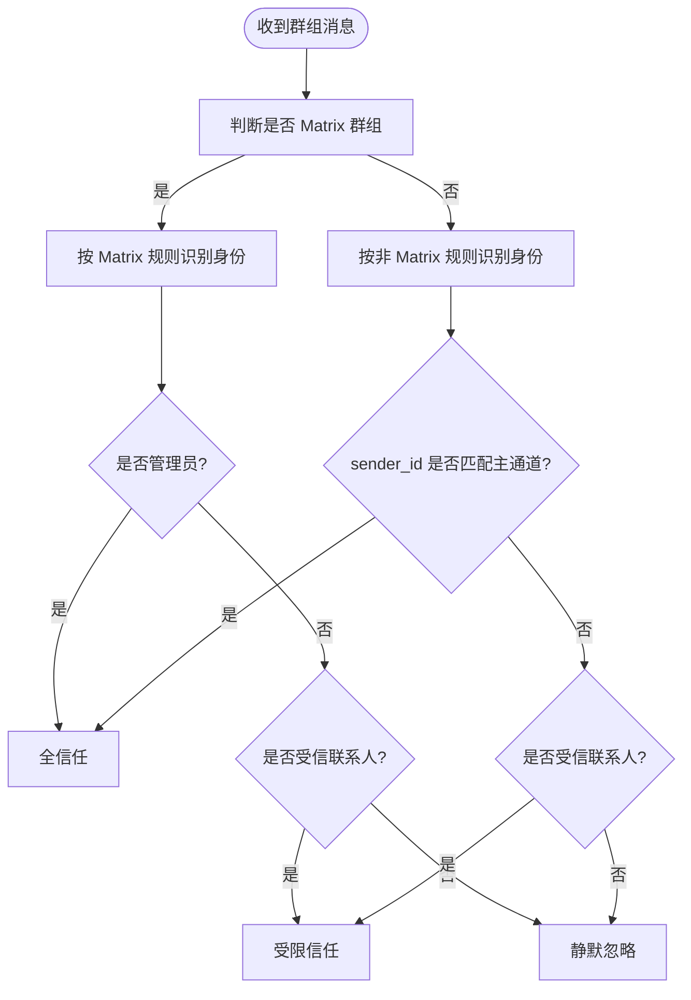
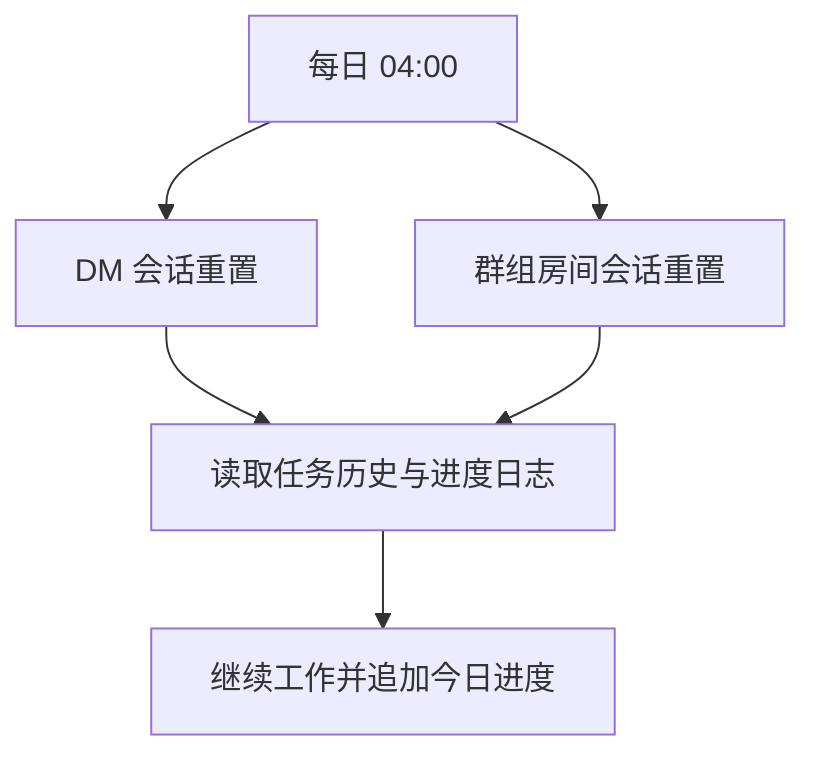
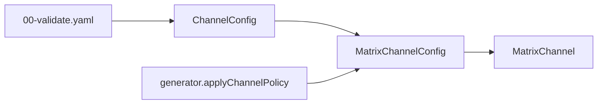

# Manager 通信管理

<cite>
**本文引用的文件**
- [copaw/src/matrix/config.py](file://copaw/src/matrix/config.py)
- [copaw/src/matrix/channel.py](file://copaw/src/matrix/channel.py)
- [manager/agent/skills/channel-management/SKILL.md](file://manager/agent/skills/channel-management/SKILL.md)
- [manager/agent/skills/channel-management/references/primary-channel.md](file://manager/agent/skills/channel-management/references/primary-channel.md)
- [manager/agent/skills/channel-management/references/identity-and-contacts.md](file://manager/agent/skills/channel-management/references/identity-and-contacts.md)
- [manager/agent/skills/channel-management/scripts/manage-primary-channel.sh](file://manager/agent/skills/channel-management/scripts/manage-primary-channel.sh)
- [docs/manager-guide.md](file://docs/manager-guide.md)
- [docs/zh-cn/manager-guide.md](file://docs/zh-cn/manager-guide.md)
- [tests/skills/hiclaw-test/references/troubleshooting.md](file://tests/skills/hiclaw-test/references/troubleshooting.md)
- [copaw/src/copaw_worker/worker.py](file://copaw/src/copaw_worker/worker.py)
- [hiclaw-controller/internal/agentconfig/generator.go](file://hiclaw-controller/internal/agentconfig/generator.go)
- [helm/hiclaw/templates/00-validate.yaml](file://helm/hiclaw/templates/00-validate.yaml)
</cite>

## 目录
1. [简介](#简介)
2. [项目结构](#项目结构)
3. [核心组件](#核心组件)
4. [架构总览](#架构总览)
5. [详细组件分析](#详细组件分析)
6. [依赖分析](#依赖分析)
7. [性能考虑](#性能考虑)
8. [故障排除指南](#故障排除指南)
9. [结论](#结论)
10. [附录](#附录)

## 简介
本文件面向 HiClaw Manager 的通信管理系统，系统化阐述多通道通信架构与管理，覆盖 Matrix DM、Discord、Feishu、Telegram 等渠道的配置与运行机制；详解主通道设置与切换流程、可信联系人管理与跨频道升级；提供通道配置步骤、故障排除方法；说明会话管理与上下文保持的技术实现；并总结通信安全与访问控制最佳实践。

## 项目结构
围绕通信管理的关键代码与文档分布如下：
- 渠道配置模型与默认值：copaw/src/matrix/config.py
- Matrix 渠道实现与事件处理：copaw/src/matrix/channel.py
- 主通道与身份识别参考文档：manager/agent/skills/channel-management/references/*
- 主通道脚本工具：manager/agent/skills/channel-management/scripts/manage-primary-channel.sh
- 管理员指南与会话策略：docs/manager-guide.md、docs/zh-cn/manager-guide.md
- 故障排除参考：tests/skills/hiclaw-test/references/troubleshooting.md
- 允许白名单热更新（Matrix）：copaw/src/copaw_worker/worker.py
- 渠道策略应用（控制器侧）：hiclaw-controller/internal/agentconfig/generator.go
- Helm 渲染校验（矩阵托管能力）：helm/hiclaw/templates/00-validate.yaml

**图表来源**
- [copaw/src/matrix/config.py:226-246](file://copaw/src/matrix/config.py#L226-L246)
- [copaw/src/matrix/channel.py:216-298](file://copaw/src/matrix/channel.py#L216-L298)
- [manager/agent/skills/channel-management/SKILL.md:1-30](file://manager/agent/skills/channel-management/SKILL.md#L1-L30)
- [manager/agent/skills/channel-management/references/primary-channel.md:1-72](file://manager/agent/skills/channel-management/references/primary-channel.md#L1-L72)
- [manager/agent/skills/channel-management/references/identity-and-contacts.md:1-60](file://manager/agent/skills/channel-management/references/identity-and-contacts.md#L1-L60)
- [manager/agent/skills/channel-management/scripts/manage-primary-channel.sh:1-124](file://manager/agent/skills/channel-management/scripts/manage-primary-channel.sh#L1-L124)
- [docs/manager-guide.md:75-137](file://docs/manager-guide.md#L75-L137)
- [docs/zh-cn/manager-guide.md:91-156](file://docs/zh-cn/manager-guide.md#L91-L156)
- [tests/skills/hiclaw-test/references/troubleshooting.md:1-141](file://tests/skills/hiclaw-test/references/troubleshooting.md#L1-L141)
- [hiclaw-controller/internal/agentconfig/generator.go:267-309](file://hiclaw-controller/internal/agentconfig/generator.go#L267-L309)
- [helm/hiclaw/templates/00-validate.yaml:1-17](file://helm/hiclaw/templates/00-validate.yaml#L1-L17)

**章节来源**
- [copaw/src/matrix/config.py:226-246](file://copaw/src/matrix/config.py#L226-L246)
- [copaw/src/matrix/channel.py:216-298](file://copaw/src/matrix/channel.py#L216-L298)
- [manager/agent/skills/channel-management/SKILL.md:1-30](file://manager/agent/skills/channel-management/SKILL.md#L1-L30)
- [manager/agent/skills/channel-management/references/primary-channel.md:1-72](file://manager/agent/skills/channel-management/references/primary-channel.md#L1-L72)
- [manager/agent/skills/channel-management/references/identity-and-contacts.md:1-60](file://manager/agent/skills/channel-management/references/identity-and-contacts.md#L1-L60)
- [manager/agent/skills/channel-management/scripts/manage-primary-channel.sh:1-124](file://manager/agent/skills/channel-management/scripts/manage-primary-channel.sh#L1-L124)
- [docs/manager-guide.md:75-137](file://docs/manager-guide.md#L75-L137)
- [docs/zh-cn/manager-guide.md:91-156](file://docs/zh-cn/manager-guide.md#L91-L156)
- [tests/skills/hiclaw-test/references/troubleshooting.md:1-141](file://tests/skills/hiclaw-test/references/troubleshooting.md#L1-L141)
- [hiclaw-controller/internal/agentconfig/generator.go:267-309](file://hiclaw-controller/internal/agentconfig/generator.go#L267-L309)
- [helm/hiclaw/templates/00-validate.yaml:1-17](file://helm/hiclaw/templates/00-validate.yaml#L1-L17)

## 核心组件
- 渠道配置模型：定义各渠道的启用开关、鉴权参数、媒体目录、消息策略等，统一收敛于 ChannelConfig，并支持扩展键用于插件渠道。
- Matrix 渠道实现：负责登录、同步、事件回调、允许/拒绝列表、提及检测、历史缓冲、E2EE 维护等。
- 主通道与跨频道升级：通过 primary-channel.json 决策通知目标，结合 message 工具与 task-management 技能脚本实现跨通道升级。
- 可信联系人与身份识别：通过 trusted-contacts.json 与两类房间规则（Matrix 群组 vs 非 Matrix 群组）区分信任级别与响应策略。
- 会话管理与上下文保持：基于类型（DM/group）的每日重置策略，配合进度日志与任务历史实现会话重置后的恢复。

**章节来源**
- [copaw/src/matrix/config.py:226-246](file://copaw/src/matrix/config.py#L226-L246)
- [copaw/src/matrix/channel.py:216-298](file://copaw/src/matrix/channel.py#L216-L298)
- [manager/agent/skills/channel-management/references/primary-channel.md:33-72](file://manager/agent/skills/channel-management/references/primary-channel.md#L33-L72)
- [manager/agent/skills/channel-management/references/identity-and-contacts.md:1-60](file://manager/agent/skills/channel-management/references/identity-and-contacts.md#L1-L60)
- [docs/manager-guide.md:107-156](file://docs/manager-guide.md#L107-L156)

## 架构总览
下图展示了多通道通信在 Manager 侧的总体交互：渠道配置驱动渠道实例，Matrix 渠道负责事件接收与处理，主通道与可信联系人策略决定消息路由与响应范围，跨频道升级通过 message 工具与任务脚本完成。

**图表来源**
- [copaw/src/matrix/config.py:226-246](file://copaw/src/matrix/config.py#L226-L246)
- [copaw/src/matrix/channel.py:216-298](file://copaw/src/matrix/channel.py#L216-L298)
- [manager/agent/skills/channel-management/references/primary-channel.md:33-72](file://manager/agent/skills/channel-management/references/primary-channel.md#L33-L72)
- [manager/agent/skills/channel-management/scripts/manage-primary-channel.sh:1-124](file://manager/agent/skills/channel-management/scripts/manage-primary-channel.sh#L1-L124)
- [manager/agent/skills/channel-management/references/identity-and-contacts.md:1-60](file://manager/agent/skills/channel-management/references/identity-and-contacts.md#L1-L60)

## 详细组件分析

### 多通道配置与管理（Matrix DM、Discord、Feishu、Telegram 等）
- 渠道配置模型
  - ChannelConfig 收敛内置渠道配置，包含 imessage、discord、dingtalk、feishu、qq、telegram、mattermost、mqtt、console、matrix、voice、wecom、xiaoyi、weixin、onebot 等。
  - 每个渠道均继承 BaseChannelConfig，具备 enabled、bot_prefix、dm_policy、group_policy、allow_from、deny_message、require_mention 等通用字段。
- Matrix 渠道
  - MatrixChannelConfig 解析 homeserver、access_token、用户名密码、加密开关、允许列表、历史缓冲、同步超时等。
  - MatrixChannel 实现登录、事件回调注册、E2EE 密钥维护、增量同步、提及检测、历史缓冲、DM 缓存等。
- 其他渠道
  - DiscordConfig、FeishuConfig、TelegramConfig 等分别包含各自鉴权与代理参数，便于在不同企业/地区场景下灵活部署。

**图表来源**
- [copaw/src/matrix/config.py:39-246](file://copaw/src/matrix/config.py#L39-L246)
- [copaw/src/matrix/channel.py:160-298](file://copaw/src/matrix/channel.py#L160-L298)

**章节来源**
- [copaw/src/matrix/config.py:39-246](file://copaw/src/matrix/config.py#L39-L246)
- [copaw/src/matrix/channel.py:160-298](file://copaw/src/matrix/channel.py#L160-L298)

### 主通道设置与切换机制
- 主通道状态文件
  - primary-channel.json 记录 confirmed、channel、to、sender_id、channel_name、confirmed_at 等字段。
- 设置与重置
  - 使用 manage-primary-channel.sh 提供 confirm/reset/show 三种原子操作，确保写入一致性与错误提示。
  - confirm 时禁止将 channel 设为 "matrix"，否则报错并要求 reset 回退。
- 跨频道升级
  - 当在 Matrix 房间阻塞等待管理员决策时，通过 resolve-notify-channel.sh 获取通知渠道，再使用 message 工具发送问题至管理员主通道。
  - 管理员回复后，自动路由回原房间继续工作流；若无主通道则 @mention 管理员于当前房间。

**图表来源**
- [manager/agent/skills/channel-management/references/primary-channel.md:46-72](file://manager/agent/skills/channel-management/references/primary-channel.md#L46-L72)
- [manager/agent/skills/channel-management/scripts/manage-primary-channel.sh:24-81](file://manager/agent/skills/channel-management/scripts/manage-primary-channel.sh#L24-L81)

**章节来源**
- [manager/agent/skills/channel-management/references/primary-channel.md:3-72](file://manager/agent/skills/channel-management/references/primary-channel.md#L3-L72)
- [manager/agent/skills/channel-management/scripts/manage-primary-channel.sh:1-124](file://manager/agent/skills/channel-management/scripts/manage-primary-channel.sh#L1-L124)

### 可信联系人管理与跨频道升级
- 可信联系人
  - 通过 trusted-contacts.json 记录 {channel, sender_id, approved_at, note}，仅限一般性回复，严禁分享敏感信息与执行管理操作。
- 身份识别
  - Matrix 群组：管理员、团队领导、Worker、受信联系人、未知用户按规则区分；未知用户静默忽略。
  - 非 Matrix 群组：以 primary-channel.json 中的 sender_id 匹配管理员身份，受信联系人按受限信任处理。
- 跨频道升级
  - 在 Matrix 房间中，当需要紧急决策时，Manager 通过主通道发送问题；管理员回复后自动路由回原房间。

**图表来源**
- [manager/agent/skills/channel-management/references/identity-and-contacts.md:7-27](file://manager/agent/skills/channel-management/references/identity-and-contacts.md#L7-L27)
- [manager/agent/skills/channel-management/references/identity-and-contacts.md:20-60](file://manager/agent/skills/channel-management/references/identity-and-contacts.md#L20-L60)

**章节来源**
- [manager/agent/skills/channel-management/references/identity-and-contacts.md:1-60](file://manager/agent/skills/channel-management/references/identity-and-contacts.md#L1-L60)

### 会话管理与上下文保持
- 类型化会话策略
  - DM 与群组房间均在每日 04:00 重置，避免长期上下文膨胀。
- 会话重置后的恢复
  - 通过每日进度日志与任务历史文件重建上下文，保证任务连续性。
- 运行时会话稳定等待（测试辅助）
  - 提供会话稳定检测脚本，便于自动化测试与指标采集。

**图表来源**
- [docs/manager-guide.md:107-156](file://docs/manager-guide.md#L107-L156)
- [docs/zh-cn/manager-guide.md:107-156](file://docs/zh-cn/manager-guide.md#L107-L156)

**章节来源**
- [docs/manager-guide.md:107-156](file://docs/manager-guide.md#L107-L156)
- [docs/zh-cn/manager-guide.md:107-156](file://docs/zh-cn/manager-guide.md#L107-L156)

### 渠道配置步骤（以 Matrix DM 为例）
- 启用 Matrix 渠道
  - 在 openclaw.json 的 channels.matrix 下配置 homeserver、access_token（或 username/password）。
- 设置允许列表
  - 在 channels.matrix.dm.allow_from 与 channels.matrix.group_allow_from 中添加允许的 Matrix 用户或群组。
- 邀请管理员加入房间
  - 通过控制器生成的策略将管理员加入对应 Matrix 房间。
- 验证与热更新
  - Worker 启动后可热更新 Matrix 允许列表，无需重启。

**章节来源**
- [copaw/src/matrix/config.py:160-184](file://copaw/src/matrix/config.py#L160-L184)
- [copaw/src/matrix/channel.py:334-477](file://copaw/src/matrix/channel.py#L334-L477)
- [copaw/src/copaw_worker/worker.py:525-544](file://copaw/src/copaw_worker/worker.py#L525-L544)
- [hiclaw-controller/internal/agentconfig/generator.go:267-309](file://hiclaw-controller/internal/agentconfig/generator.go#L267-L309)

### 通信安全与访问控制最佳实践
- 严格的身份识别
  - 仅允许白名单用户进入房间或被允许 DM；未知用户一律静默忽略。
- 受信联系人边界
  - 不得向受信联系人披露敏感信息（API Key、凭据、Worker 配置）；不得代表其执行管理操作。
- 主通道与跨频道升级
  - 主通道不可设为 "matrix"；跨频道升级需明确记录并路由回原房间。
- 会话与上下文
  - 使用每日重置策略与进度日志保障任务可恢复性；避免在 DM 中泄露内部配置。
- 安全加固
  - Matrix E2EE 可选开启；HTTP 代理与 TLS 参数按需配置；最小权限原则应用于各渠道令牌与密钥。

**章节来源**
- [manager/agent/skills/channel-management/SKILL.md:11-20](file://manager/agent/skills/channel-management/SKILL.md#L11-L20)
- [manager/agent/skills/channel-management/references/identity-and-contacts.md:46-60](file://manager/agent/skills/channel-management/references/identity-and-contacts.md#L46-L60)
- [copaw/src/matrix/config.py:160-184](file://copaw/src/matrix/config.py#L160-L184)

## 依赖分析
- 渠道配置与实现
  - ChannelConfig 作为统一入口，MatrixChannelConfig 与 MatrixChannel 分别承担解析与运行时职责。
- 控制器策略应用
  - 通过 generator.applyChannelPolicy 动态合并 groupAllowFrom 与 dm.allowFrom，确保人类权限与房间邀请一致。
- Helm 渲染校验
  - 限定 matrix.provider 与 matrix.mode，确保托管矩阵服务的可用性与一致性。

**图表来源**
- [copaw/src/matrix/config.py:226-246](file://copaw/src/matrix/config.py#L226-L246)
- [copaw/src/matrix/channel.py:160-298](file://copaw/src/matrix/channel.py#L160-L298)
- [hiclaw-controller/internal/agentconfig/generator.go:267-309](file://hiclaw-controller/internal/agentconfig/generator.go#L267-L309)
- [helm/hiclaw/templates/00-validate.yaml:1-17](file://helm/hiclaw/templates/00-validate.yaml#L1-L17)

**章节来源**
- [copaw/src/matrix/config.py:226-246](file://copaw/src/matrix/config.py#L226-L246)
- [copaw/src/matrix/channel.py:160-298](file://copaw/src/matrix/channel.py#L160-L298)
- [hiclaw-controller/internal/agentconfig/generator.go:267-309](file://hiclaw-controller/internal/agentconfig/generator.go#L267-L309)
- [helm/hiclaw/templates/00-validate.yaml:1-17](file://helm/hiclaw/templates/00-validate.yaml#L1-L17)

## 性能考虑
- 同步与超时
  - MatrixChannel 的同步超时需大于 HTTP 请求超时，避免连接被提前中断。
- 上下文压缩
  - 合理设置上下文压缩阈值与保留比例，减少长对话带来的 token 消耗。
- 会话重置频率
  - 每日重置策略有助于控制内存占用与上下文长度，建议结合任务周期规划消息节奏。

[本节为通用指导，无需特定文件引用]

## 故障排除指南
- 测试挂起与未完成
  - 关注 Manager 日志中“Waiting for”“PHASE*_DONE”“REVISION_NEEDED”等关键字；检查 resolveMentions 的 wasMentioned 状态。
  - 常见原因：Worker 未在项目房间中 @mention Manager；解决：确保多阶段任务完成后 @mention。
- LLM 响应超时
  - 提升 LLM 超时或检查上游 API 可用性。
- 容器资源不足
  - OOMKilled：提升 Docker 内存限制。
- Worker 无法连接 Matrix
  - 检查 Worker 的 Matrix 凭证文件是否存在与正确。
- 快速诊断命令
  - 导出日志、分析挂起问题、查看容器状态、快速查看最近错误日志。

**章节来源**
- [tests/skills/hiclaw-test/references/troubleshooting.md:1-141](file://tests/skills/hiclaw-test/references/troubleshooting.md#L1-L141)

## 结论
HiClaw Manager 的通信管理体系以 ChannelConfig 为统一入口，结合 MatrixChannel 的事件处理与策略化白名单，实现了对多渠道的标准化接入与安全管控。通过主通道与跨频道升级机制，Manager 能够在多场景下高效地与管理员沟通；可信联系人与身份识别规则确保了信息与操作的最小暴露面。配合每日会话重置与进度日志恢复机制，系统在安全性与可用性之间取得平衡，适合在企业级环境中稳定运行。

[本节为总结性内容，无需特定文件引用]

## 附录
- 管理员指南（英文）：[docs/manager-guide.md](file://docs/manager-guide.md)
- 管理员指南（中文）：[docs/zh-cn/manager-guide.md](file://docs/zh-cn/manager-guide.md)
- 主通道参考：[manager/agent/skills/channel-management/references/primary-channel.md](file://manager/agent/skills/channel-management/references/primary-channel.md)
- 身份与联系人参考：[manager/agent/skills/channel-management/references/identity-and-contacts.md](file://manager/agent/skills/channel-management/references/identity-and-contacts.md)
- 主通道脚本：[manager/agent/skills/channel-management/scripts/manage-primary-channel.sh](file://manager/agent/skills/channel-management/scripts/manage-primary-channel.sh)
- Matrix 渠道实现：[copaw/src/matrix/channel.py](file://copaw/src/matrix/channel.py)
- 渠道配置模型：[copaw/src/matrix/config.py](file://copaw/src/matrix/config.py)
- 控制器策略应用：[hiclaw-controller/internal/agentconfig/generator.go](file://hiclaw-controller/internal/agentconfig/generator.go)
- Helm 渲染校验：[helm/hiclaw/templates/00-validate.yaml](file://helm/hiclaw/templates/00-validate.yaml)

[本节为索引性内容，无需特定文件引用]