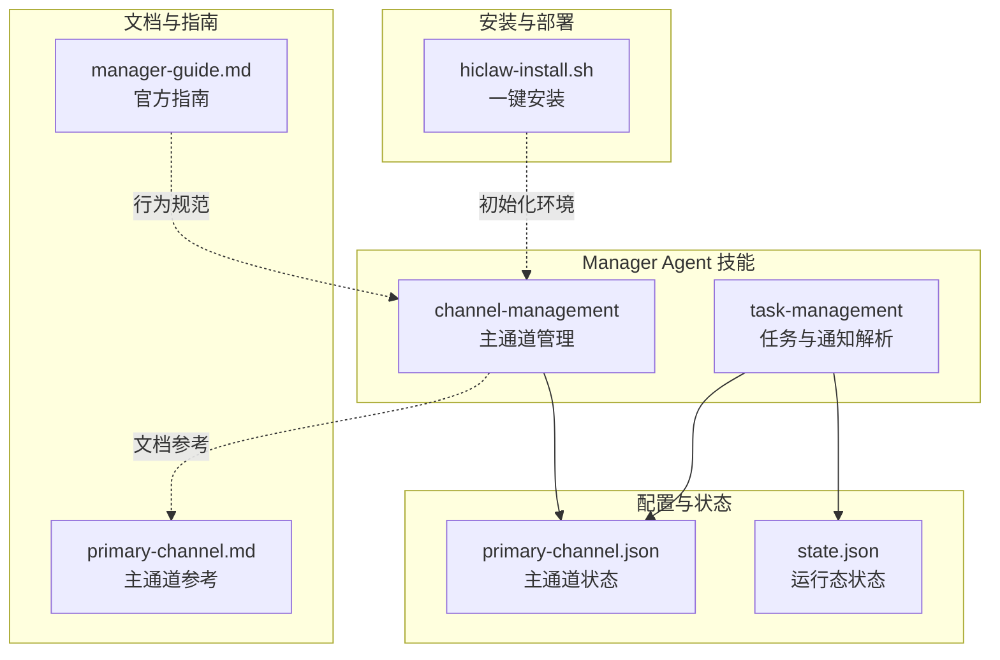
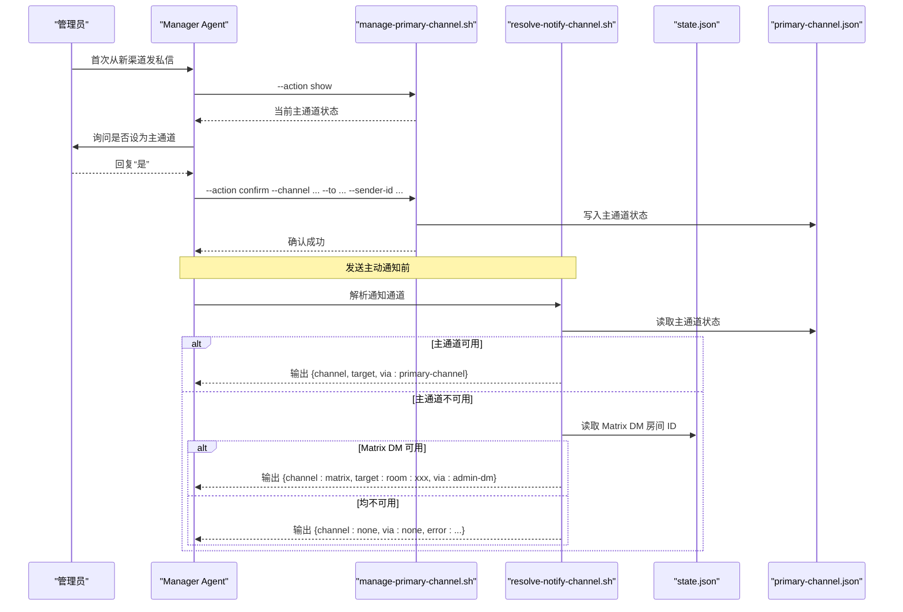
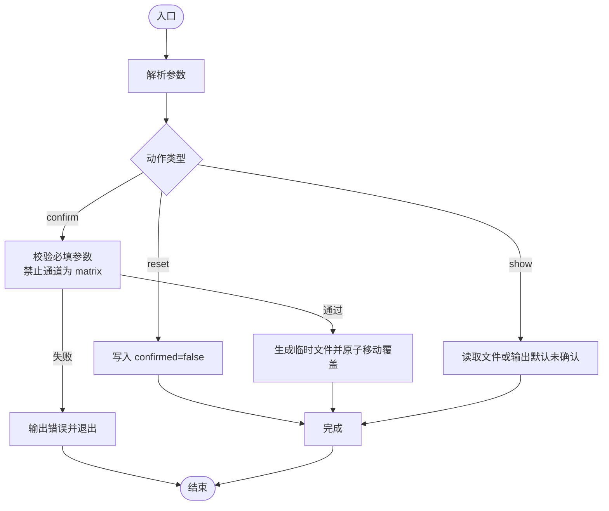
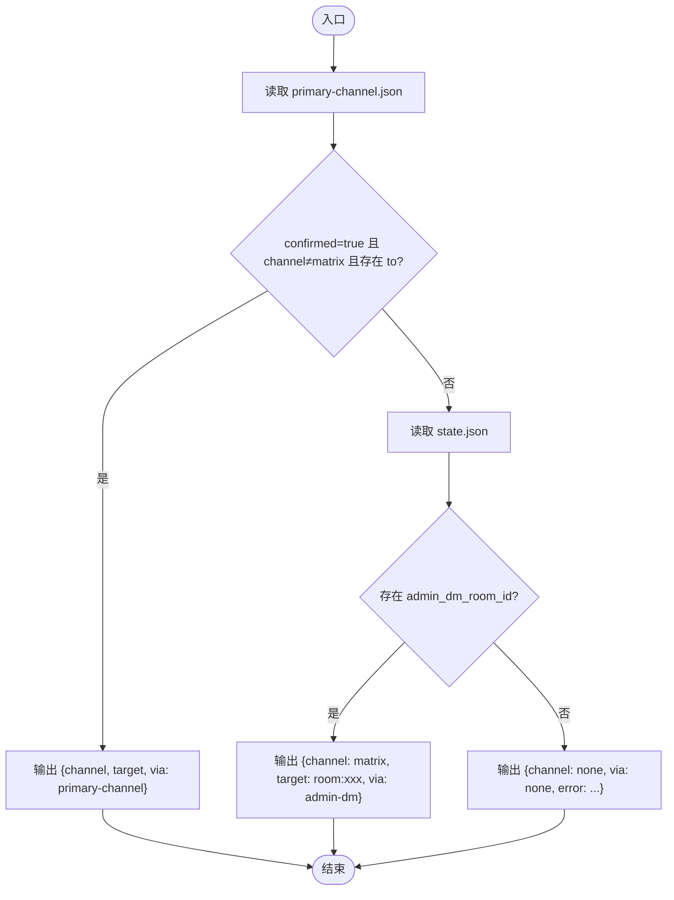
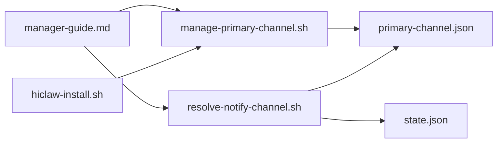

# 主通道管理

<cite>
**本文档引用的文件**
- [manage-primary-channel.sh](file://manager/agent/skills/channel-management/scripts/manage-primary-channel.sh)
- [primary-channel.md](file://manager/agent/skills/channel-management/references/primary-channel.md)
- [SKILL.md](file://manager/agent/skills/channel-management/SKILL.md)
- [resolve-notify-channel.sh](file://manager/agent/skills/task-management/scripts/resolve-notify-channel.sh)
- [HEARTBEAT.md](file://manager/agent/HEARTBEAT.md)
- [manager-guide.md](file://docs/manager-guide.md)
- [manager-guide.md（中文）](file://docs/zh-cn/manager-guide.md)
- [hiclaw-install.sh](file://install/hiclaw-install.sh)
</cite>

## 目录
1. [简介](#简介)
2. [项目结构](#项目结构)
3. [核心组件](#核心组件)
4. [架构总览](#架构总览)
5. [详细组件分析](#详细组件分析)
6. [依赖关系分析](#依赖关系分析)
7. [性能考量](#性能考量)
8. [故障排查指南](#故障排查指南)
9. [结论](#结论)
10. [附录](#附录)

## 简介
本章节面向 HiClaw 主通道管理系统，系统性阐述“主通道”的概念、作用与重要性，以及在多渠道通信场景下的配置、切换与回退策略。主通道用于承载 Manager 的主动通知（如心跳报告、任务提醒、紧急升级等），默认为 Matrix 私信；当主通道不可用或未配置时，系统自动回退至 Matrix DM，确保关键信息不丢失。

## 项目结构
围绕主通道管理的关键文件与职责如下：
- 主通道状态文件：位于用户家目录的 JSON 文件，记录主通道的确认状态、目标通道标识、接收人标识、发送者标识与名称等。
- 主通道管理脚本：提供原子化的主通道配置操作（确认、重置、查看）。
- 通知通道解析脚本：在发送主动通知前，解析当前可用的通知通道（主通道优先，否则回退到 Matrix DM）。
- 文档与指南：官方文档明确主通道的默认行为、设置流程与回退机制。
- 安装与部署：安装脚本负责初始化环境与服务，确保 Manager Agent 可用，从而保证主通道相关能力正常工作。

图表来源
- [manage-primary-channel.sh:1-124](file://manager/agent/skills/channel-management/scripts/manage-primary-channel.sh#L1-L124)
- [primary-channel.md:1-72](file://manager/agent/skills/channel-management/references/primary-channel.md#L1-L72)
- [resolve-notify-channel.sh:1-49](file://manager/agent/skills/task-management/scripts/resolve-notify-channel.sh#L1-L49)
- [manager-guide.md:71-97](file://docs/manager-guide.md#L71-L97)
- [hiclaw-install.sh:1-800](file://install/hiclaw-install.sh#L1-L800)

章节来源
- [manage-primary-channel.sh:1-124](file://manager/agent/skills/channel-management/scripts/manage-primary-channel.sh#L1-L124)
- [primary-channel.md:1-72](file://manager/agent/skills/channel-management/references/primary-channel.md#L1-L72)
- [resolve-notify-channel.sh:1-49](file://manager/agent/skills/task-management/scripts/resolve-notify-channel.sh#L1-L49)
- [manager-guide.md:71-97](file://docs/manager-guide.md#L71-L97)
- [hiclaw-install.sh:1-800](file://install/hiclaw-install.sh#L1-L800)

## 核心组件
- 主通道状态文件（primary-channel.json）
  - 字段含义：确认状态、通道标识、目标标识、发送者标识、通道名称、确认时间等。
  - 默认行为：未确认或缺失时，系统默认采用 Matrix DM。
- 主通道管理脚本（manage-primary-channel.sh）
  - 功能：原子化地确认主通道、重置为 Matrix DM 回退、显示当前状态。
  - 参数：动作类型、通道标识、目标标识、发送者标识、通道名称。
- 通知通道解析脚本（resolve-notify-channel.sh）
  - 功能：优先使用主通道，若不可用则回退到 Matrix DM；若两者均不可用，则返回错误提示。
  - 输入：主通道状态文件与运行态状态文件。
- 官方文档与指南
  - 明确主通道默认为 Matrix DM，首次从新渠道发私信时询问是否设为主通道，支持随时切换。
  - 当主通道不可用或未配置时，自动回退到 Matrix DM。

章节来源
- [primary-channel.md:3-16](file://manager/agent/skills/channel-management/references/primary-channel.md#L3-L16)
- [manage-primary-channel.sh:6-15](file://manager/agent/skills/channel-management/scripts/manage-primary-channel.sh#L6-L15)
- [resolve-notify-channel.sh:8-15](file://manager/agent/skills/task-management/scripts/resolve-notify-channel.sh#L8-L15)
- [manager-guide.md:81-97](file://docs/manager-guide.md#L81-L97)

## 架构总览
主通道管理贯穿“状态存储—配置操作—通道解析—发送通知”的闭环，确保在多渠道环境下，Manager 能够可靠地将主动通知送达管理员。

图表来源
- [manage-primary-channel.sh:24-81](file://manager/agent/skills/channel-management/scripts/manage-primary-channel.sh#L24-L81)
- [resolve-notify-channel.sh:21-48](file://manager/agent/skills/task-management/scripts/resolve-notify-channel.sh#L21-L48)
- [primary-channel.md:37-43](file://manager/agent/skills/channel-management/references/primary-channel.md#L37-L43)
- [HEARTBEAT.md:177-192](file://manager/agent/HEARTBEAT.md#L177-L192)

## 详细组件分析

### 组件一：主通道状态文件与格式
- 存储位置：用户家目录的 JSON 文件，用于持久化主通道配置。
- 关键字段：
  - confirmed：是否确认为主通道
  - channel：通道标识（如 discord、telegram、slack、feishu 等）
  - to：目标标识（不同通道格式不同）
  - sender_id：管理员在该通道的原始 ID
  - channel_name：人类可读的通道名称
  - confirmed_at：确认时间戳
- 默认行为：未确认或缺失时，系统默认采用 Matrix DM。

章节来源
- [primary-channel.md:5-16](file://manager/agent/skills/channel-management/references/primary-channel.md#L5-L16)
- [manager-guide.md:87-87](file://docs/manager-guide.md#L87-L87)

### 组件二：主通道管理脚本（原子化操作）
- 功能清单
  - confirm：确认主通道（校验必填项，禁止将主通道设为 Matrix，写入 JSON 并返回成功信息）
  - reset：重置为未确认（回退到 Matrix DM）
  - show：打印当前状态（文件存在则输出文件内容，否则输出默认未确认状态）
- 参数与约束
  - confirm 需要提供通道标识、目标标识、发送者标识
  - 通道标识不能为 “matrix”
  - 通道名称可选，未提供时按默认规则生成
- 错误处理
  - 缺少必要参数时返回错误并退出
  - 通道标识为 “matrix” 时拒绝设置为主通道

图表来源
- [manage-primary-channel.sh:24-81](file://manager/agent/skills/channel-management/scripts/manage-primary-channel.sh#L24-L81)

章节来源
- [manage-primary-channel.sh:6-15](file://manager/agent/skills/channel-management/scripts/manage-primary-channel.sh#L6-L15)
- [manage-primary-channel.sh:24-81](file://manager/agent/skills/channel-management/scripts/manage-primary-channel.sh#L24-L81)

### 组件三：通知通道解析脚本（主通道优先，Matrix DM 回退）
- 逻辑流程
  - 读取主通道状态文件
  - 若 confirmed 为 true 且 channel 非 “matrix”，且存在目标标识，则返回主通道信息
  - 否则尝试从运行态状态文件读取 Matrix DM 房间 ID，若存在则返回 Matrix DM
  - 若两者均不可用，返回错误提示
- 输出格式
  - 成功：包含 channel、target、via 字段
  - 失败：channel 为 none，via 为 none，并附带错误信息

图表来源
- [resolve-notify-channel.sh:21-48](file://manager/agent/skills/task-management/scripts/resolve-notify-channel.sh#L21-L48)

章节来源
- [resolve-notify-channel.sh:8-15](file://manager/agent/skills/task-management/scripts/resolve-notify-channel.sh#L8-L15)
- [resolve-notify-channel.sh:21-48](file://manager/agent/skills/task-management/scripts/resolve-notify-channel.sh#L21-L48)

### 组件四：首次对话确认与后续切换
- 首次对话确认
  - 触发条件：管理员从与当前主通道不匹配的新渠道发送私信
  - 流程：读取当前状态 → 正常回复 → 询问是否设为主通道 → 根据回复执行 confirm 或 reset
- 切换主通道
  - 管理员可随时请求切换，流程：读取当前状态 → 更新为 confirm → 以管理员语言确认
- 交叉通道升级
  - 在 Matrix 房间中遇到阻塞时，先解析通知通道：若非 Matrix 主通道已确认，则使用 message 工具发送问题；收到回复后回到原房间继续流程；若无主通道，则在当前房间 @ 管理员

章节来源
- [primary-channel.md:46-72](file://manager/agent/skills/channel-management/references/primary-channel.md#L46-L72)
- [manager-guide.md:81-97](file://docs/manager-guide.md#L81-L97)

### 组件五：紧急升级与通知中的关键作用
- 心跳报告与异常上报
  - 心跳流程要求：在报告给管理员时，必须通过解析出的通知通道发送，不得在错误的 Matrix 房间中散落回复
  - 若解析结果为 none，需先尝试发现 Matrix DM 房间，再重试
- 任务完成与项目进度
  - 任务完成后，通过解析出的通知通道向管理员发送完成摘要
- 交叉通道升级
  - 当在 Matrix 房间中被阻塞时，使用解析脚本判断是否可通过主通道发送问题；收到回复后回到原房间继续协作

章节来源
- [HEARTBEAT.md:177-192](file://manager/agent/HEARTBEAT.md#L177-L192)
- [primary-channel.md:59-72](file://manager/agent/skills/channel-management/references/primary-channel.md#L59-L72)

## 依赖关系分析
- 主通道状态文件依赖于主通道管理脚本的原子写入，确保并发安全与一致性
- 通知通道解析脚本依赖主通道状态文件与运行态状态文件，决定发送路径
- 官方文档与指南定义了行为规范与最佳实践，指导用户正确设置与使用主通道
- 安装脚本负责初始化环境，确保 Manager Agent 可用，从而保障主通道相关能力正常工作

图表来源
- [manage-primary-channel.sh:18-81](file://manager/agent/skills/channel-management/scripts/manage-primary-channel.sh#L18-L81)
- [resolve-notify-channel.sh:18-48](file://manager/agent/skills/task-management/scripts/resolve-notify-channel.sh#L18-L48)
- [manager-guide.md:81-97](file://docs/manager-guide.md#L81-L97)
- [hiclaw-install.sh:1-800](file://install/hiclaw-install.sh#L1-L800)

章节来源
- [manage-primary-channel.sh:18-81](file://manager/agent/skills/channel-management/scripts/manage-primary-channel.sh#L18-L81)
- [resolve-notify-channel.sh:18-48](file://manager/agent/skills/task-management/scripts/resolve-notify-channel.sh#L18-L48)
- [manager-guide.md:81-97](file://docs/manager-guide.md#L81-L97)
- [hiclaw-install.sh:1-800](file://install/hiclaw-install.sh#L1-L800)

## 性能考量
- 原子写入：主通道管理脚本通过临时文件与原子移动的方式写入状态文件，避免竞态与损坏
- 轻量解析：通知通道解析脚本仅读取两个小文件，开销极低
- 默认回退：未配置主通道时立即回退到 Matrix DM，减少等待与失败重试成本
- 语言与协议：主通道使用内置 message 工具，避免额外 HTTP 调用，降低延迟与复杂度

## 故障排查指南
- 主通道无法确认
  - 检查通道标识是否为 “matrix”，若是则改为其他通道
  - 确认目标标识与发送者标识非空
  - 查看脚本输出的错误信息并修正参数
- 主通道不可用或未配置
  - 使用解析脚本检查输出，若 channel 为 none，先发现并设置 Matrix DM 房间 ID，再重试
  - 确认运行态状态文件中 admin_dm_room_id 是否存在
- 交叉通道升级无响应
  - 确认主通道已确认且目标标识有效
  - 若无主通道，改为在当前 Matrix 房间 @ 管理员
- 心跳报告未送达
  - 检查解析脚本输出，确保 channel 非 none
  - 若为 none，先执行发现 Matrix DM 房间的步骤，再重试发送

章节来源
- [manage-primary-channel.sh:24-41](file://manager/agent/skills/channel-management/scripts/manage-primary-channel.sh#L24-L41)
- [resolve-notify-channel.sh:21-48](file://manager/agent/skills/task-management/scripts/resolve-notify-channel.sh#L21-L48)
- [HEARTBEAT.md:177-192](file://manager/agent/HEARTBEAT.md#L177-L192)

## 结论
主通道管理通过“状态文件 + 原子化脚本 + 通道解析 + 回退策略”的设计，在多渠道通信环境中提供了高可靠、易用且可审计的主动通知能力。其默认回退至 Matrix DM 的机制确保了关键信息不会因通道不可用而丢失，同时交叉通道升级与紧急通知流程保障了协作效率与应急响应能力。

## 附录
- 主通道配置文件存储位置与格式
  - 存储位置：用户家目录
  - 文件名：主通道状态文件
  - 字段：确认状态、通道标识、目标标识、发送者标识、通道名称、确认时间
- 常用命令与操作方式
  - 查看当前状态：调用主通道管理脚本的 show 动作
  - 确认主通道：调用 confirm 动作并提供必要参数
  - 重置回退：调用 reset 动作
  - 解析通知通道：调用通知通道解析脚本
- 安装与初始化
  - 通过安装脚本完成环境初始化，确保 Manager Agent 可用，从而支持主通道相关能力

章节来源
- [primary-channel.md:5-16](file://manager/agent/skills/channel-management/references/primary-channel.md#L5-L16)
- [manage-primary-channel.sh:6-15](file://manager/agent/skills/channel-management/scripts/manage-primary-channel.sh#L6-L15)
- [resolve-notify-channel.sh:8-15](file://manager/agent/skills/task-management/scripts/resolve-notify-channel.sh#L8-L15)
- [manager-guide.md:81-97](file://docs/manager-guide.md#L81-L97)
- [hiclaw-install.sh:1-800](file://install/hiclaw-install.sh#L1-L800)