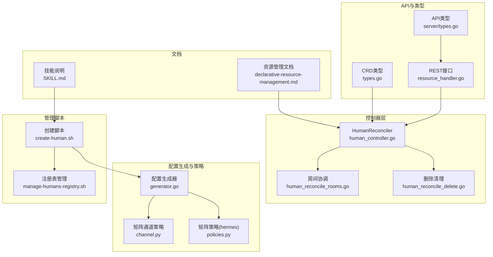
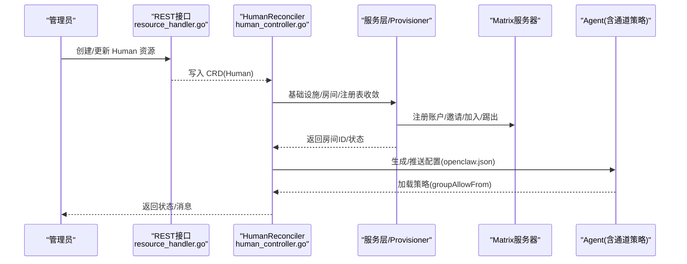
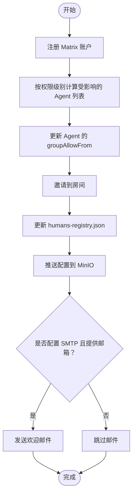
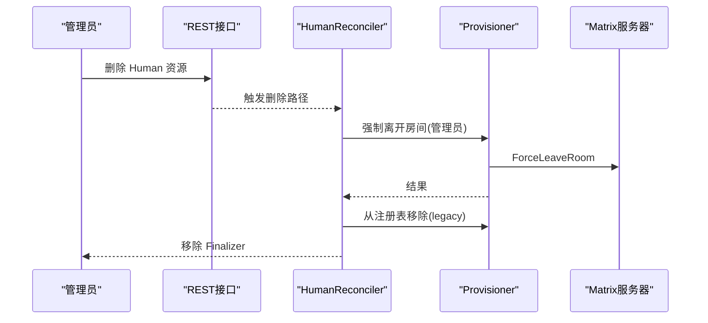
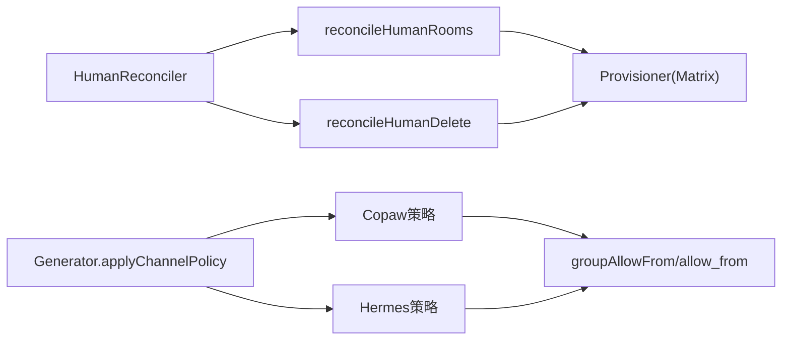

# 可信联系人管理

<cite>
**本文引用的文件**
- [types.go](file://hiclaw-controller/api/v1beta1/types.go)
- [human_controller.go](file://hiclaw-controller/internal/controller/human_controller.go)
- [human_reconcile_rooms.go](file://hiclaw-controller/internal/controller/human_reconcile_rooms.go)
- [human_reconcile_delete.go](file://hiclaw-controller/internal/controller/human_reconcile_delete.go)
- [resource_handler.go](file://hiclaw-controller/internal/server/resource_handler.go)
- [types.go](file://hiclaw-controller/internal/server/types.go)
- [generator.go](file://hiclaw-controller/internal/agentconfig/generator.go)
- [channel.py](file://copaw/src/matrix/channel.py)
- [policies.py](file://hermes/src/hermes_matrix/policies.py)
- [create-human.sh](file://manager/agent/skills/human-management/scripts/create-human.sh)
- [manage-humans-registry.sh](file://manager/agent/skills/human-management/scripts/manage-humans-registry.sh)
- [declarative-resource-management.md](file://docs/zh-cn/declarative-resource-management.md)
- [SKILL.md](file://manager/agent/skills/human-management/SKILL.md)
</cite>

## 目录
1. [简介](#简介)
2. [项目结构](#项目结构)
3. [核心组件](#核心组件)
4. [架构总览](#架构总览)
5. [详细组件分析](#详细组件分析)
6. [依赖分析](#依赖分析)
7. [性能考虑](#性能考虑)
8. [故障排查指南](#故障排查指南)
9. [结论](#结论)
10. [附录](#附录)

## 简介
本文件面向 HiClaw 可信联系人（Human）管理，系统性阐述可信联系人的概念、权限范围与安全限制，给出添加与移除的完整流程，明确权限边界（可接收信息类型与不可共享的敏感信息），并提供安全最佳实践、权限撤销与访问控制的技术实现细节，以及可信联系人在团队协作中的关键作用。

## 项目结构
可信联系人管理由“声明式资源 + 控制器 + 服务层 + 矩阵通道策略 + 管理脚本”构成，围绕 K8s CRD Human 实现生命周期闭环：创建、同步、删除；同时通过 Matrix 房间与 Agent 的 groupAllowFrom 白名单共同实现细粒度访问控制。

图表来源
- [human_controller.go:16-103](file://hiclaw-controller/internal/controller/human_controller.go#L16-L103)
- [human_reconcile_rooms.go:9-123](file://hiclaw-controller/internal/controller/human_reconcile_rooms.go#L9-L123)
- [human_reconcile_delete.go:11-52](file://hiclaw-controller/internal/controller/human_reconcile_delete.go#L11-L52)
- [resource_handler.go:562-613](file://hiclaw-controller/internal/server/resource_handler.go#L562-L613)
- [types.go:148-173](file://hiclaw-controller/internal/server/types.go#L148-L173)
- [types.go:339-355](file://hiclaw-controller/api/v1beta1/types.go#L339-L355)
- [generator.go:267-345](file://hiclaw-controller/internal/agentconfig/generator.go#L267-L345)
- [channel.py:174-717](file://copaw/src/matrix/channel.py#L174-L717)
- [policies.py:135-184](file://hermes/src/hermes_matrix/policies.py#L135-L184)
- [create-human.sh:1-379](file://manager/agent/skills/human-management/scripts/create-human.sh#L1-L379)
- [manage-humans-registry.sh:1-184](file://manager/agent/skills/human-management/scripts/manage-humans-registry.sh#L1-L184)
- [declarative-resource-management.md:409-531](file://docs/zh-cn/declarative-resource-management.md#L409-L531)
- [SKILL.md:1-45](file://manager/agent/skills/human-management/SKILL.md#L1-L45)

章节来源
- [human_controller.go:16-103](file://hiclaw-controller/internal/controller/human_controller.go#L16-L103)
- [declarative-resource-management.md:409-531](file://docs/zh-cn/declarative-resource-management.md#L409-L531)

## 核心组件
- Human CRD 与状态：定义可信联系人的显示名、邮箱、权限级别、可访问团队/Worker 列表等，并记录 Matrix 用户ID、初始密码、房间列表与消息。
- 控制器 HumanReconciler：负责基础设施（Matrix 账户）、房间（成员关系）、遗留注册表（embedded 模式）的收敛。
- 矩阵通道策略：基于 groupAllowFrom 与 allow_from 的白名单策略，确保仅允许授权用户在群组/私聊中被提及或直接对话。
- 配置生成器：将 ChannelPolicy（含 GroupAllowExtra/DenyExtra、DMAllowExtra/DenyExtra）应用到 Agent 的 openclaw.json，形成最终的 groupAllowFrom。
- 管理脚本：提供创建、查询、更新、移除可信联系人的命令行能力，维护 humans-registry.json 并推送配置到存储。

章节来源
- [types.go:339-355](file://hiclaw-controller/api/v1beta1/types.go#L339-L355)
- [human_controller.go:16-103](file://hiclaw-controller/internal/controller/human_controller.go#L16-L103)
- [generator.go:267-345](file://hiclaw-controller/internal/agentconfig/generator.go#L267-L345)
- [channel.py:174-717](file://copaw/src/matrix/channel.py#L174-L717)
- [create-human.sh:1-379](file://manager/agent/skills/human-management/scripts/create-human.sh#L1-L379)
- [manage-humans-registry.sh:1-184](file://manager/agent/skills/human-management/scripts/manage-humans-registry.sh#L1-L184)

## 架构总览
可信联系人管理采用“声明式 + 协调器”的架构：管理员通过 REST 或脚本声明 Human 资源；控制器按需调用 Matrix 与存储服务，使实际状态收敛到期望状态；Agent 侧通过通道策略拒绝未授权的交互。

图表来源
- [resource_handler.go:562-613](file://hiclaw-controller/internal/server/resource_handler.go#L562-L613)
- [human_controller.go:83-96](file://hiclaw-controller/internal/controller/human_controller.go#L83-L96)
- [human_reconcile_rooms.go:27-87](file://hiclaw-controller/internal/controller/human_reconcile_rooms.go#L27-L87)
- [generator.go:267-345](file://hiclaw-controller/internal/agentconfig/generator.go#L267-L345)

## 详细组件分析

### 1) 可信联系人概念与权限模型
- 概念：Human 代表真实用户，不运行容器，仅通过 Matrix 账号与 Agent 通信。
- 权限级别（包含关系，高包含低）：
  - Level 1：管理员等价，可与 Manager、所有 Team Leader、所有 Worker 对话。
  - Level 2：团队级，可与指定 Team 的 Leader/Worker 以及指定独立 Worker 对话。
  - Level 3：Worker 限定，仅能与指定 Worker 对话。
- 权限实现机制：
  - 房间邀请：将 Human 邀请到对应 Matrix Room。
  - groupAllowFrom：将 Human 的 Matrix ID 写入 Agent 的 openclaw.json，Agent 仅对白名单 @mention 做响应。

章节来源
- [declarative-resource-management.md:437-490](file://docs/zh-cn/declarative-resource-management.md#L437-L490)
- [types.go:339-355](file://hiclaw-controller/api/v1beta1/types.go#L339-L355)
- [SKILL.md:10-16](file://manager/agent/skills/human-management/SKILL.md#L10-L16)

### 2) 添加可信联系人流程
- 通过脚本创建 Human：注册 Matrix 账户、按权限级别计算受影响的 Agent 列表、更新 openclaw.json 的 groupAllowFrom、邀请进入房间、更新 humans-registry.json、推送配置到 MinIO、发送欢迎邮件（可选）。
- 关键步骤：
  - 注册 Matrix 账户并获取 token（若可用则自动加入房间）。
  - 基于权限级别批量更新 Agent 的 groupAllowFrom。
  - 邀请到团队/Worker 房间。
  - 维护 humans-registry.json 并推送配置。
  - 可选：SMTP 发送欢迎邮件。

图表来源
- [create-human.sh:89-347](file://manager/agent/skills/human-management/scripts/create-human.sh#L89-L347)
- [manage-humans-registry.sh:47-78](file://manager/agent/skills/human-management/scripts/manage-humans-registry.sh#L47-L78)

章节来源
- [create-human.sh:89-347](file://manager/agent/skills/human-management/scripts/create-human.sh#L89-L347)
- [manage-humans-registry.sh:47-78](file://manager/agent/skills/human-management/scripts/manage-humans-registry.sh#L47-L78)
- [declarative-resource-management.md:490-499](file://docs/zh-cn/declarative-resource-management.md#L490-L499)

### 3) 移除可信联系人流程
- 删除 Human CR：控制器尝试以管理员身份强制离开所有房间，从 legacy 注册表移除条目，移除 Finalizer，允许对象被回收。
- 注意：由于无法保证 Human 密码有效，控制器使用管理员令牌强制离开房间，避免设备泄漏。

图表来源
- [human_reconcile_delete.go:22-51](file://hiclaw-controller/internal/controller/human_reconcile_delete.go#L22-L51)

章节来源
- [human_reconcile_delete.go:22-51](file://hiclaw-controller/internal/controller/human_reconcile_delete.go#L22-L51)

### 4) 权限边界与安全限制
- 可接收信息类型：
  - 群组消息：当发送者在 Agent 的 groupAllowFrom 或 allow_from 中时，Agent 允许响应。
  - 私聊消息：当发送者在 dm.allowFrom 中时，Agent 允许响应。
- 不可共享的敏感信息：
  - Agent 的内部凭证、密钥、跨成员工作区访问权限等，不在 groupAllowFrom 中暴露。
  - 管理员/Leader 的专属房间与工具调用权限不向普通 Worker 或外部协作者开放。
- 策略来源：
  - Copaw/Hermes 通道策略均基于 allowlist 模式，严格校验 groupAllowFrom 与 allow_from。
  - 支持通过 ChannelPolicy 的 GroupAllowExtra/DenyExtra、DMAllowExtra/DenyExtra 动态调整白名单。

章节来源
- [channel.py:174-717](file://copaw/src/matrix/channel.py#L174-L717)
- [policies.py:135-184](file://hermes/src/hermes_matrix/policies.py#L135-L184)
- [generator.go:267-345](file://hiclaw-controller/internal/agentconfig/generator.go#L267-L345)

### 5) 权限撤销与访问控制的技术实现
- 基于控制器的声明式收敛：Human 的 Spec 与 Status 之间的差异由控制器自动修复，房间增删、策略更新均在单次收敛循环内完成。
- 矩阵侧访问控制：
  - 房间邀请/加入/踢出失败不会阻塞后续 reconcile，错误被记录但不中断整体流程。
  - 登录获取用户 token 仅在确需加入新房间时进行，避免设备泄漏。
- Agent 侧访问控制：
  - 通过 openclaw.json 的 channels.matrix.groupAllowFrom/dm.allowFrom 限制 @mention 与私聊来源。
  - 支持 per-room 策略覆盖（如 requireMention）。

章节来源
- [human_controller.go:83-96](file://hiclaw-controller/internal/controller/human_controller.go#L83-L96)
- [human_reconcile_rooms.go:27-123](file://hiclaw-controller/internal/controller/human_reconcile_rooms.go#L27-L123)
- [generator.go:267-345](file://hiclaw-controller/internal/agentconfig/generator.go#L267-L345)

### 6) 在团队协作中的作用
- Level 1：CTO/技术总监等可与全系统角色对话，便于全局协调与审计。
- Level 2：产品经理/团队成员可与指定团队内的 Leader 与 Worker 对话，聚焦项目协作。
- Level 3：外部协作者/特定职能人员仅能与指定 Worker 对话，降低越权风险。
- 通过房间与策略的组合，实现“最小权限 + 可见性”的协作模式。

章节来源
- [declarative-resource-management.md:441-477](file://docs/zh-cn/declarative-resource-management.md#L441-L477)
- [SKILL.md:10-16](file://manager/agent/skills/human-management/SKILL.md#L10-L16)

## 依赖分析
- 控制器依赖：
  - HumanReconciler 依赖 Service 层（Provisioner）进行 Matrix 操作与注册表维护。
  - 房间协调函数依赖房间集合与用户 token 获取逻辑。
- 配置生成依赖：
  - Generator 将 ChannelPolicy 应用到 Agent 的 openclaw.json，形成最终策略。
- Agent 通道策略依赖：
  - Copaw/Hermes 的策略模块从环境变量或配置中读取 allowlist，执行许可判断。

图表来源
- [human_controller.go:83-96](file://hiclaw-controller/internal/controller/human_controller.go#L83-L96)
- [generator.go:267-345](file://hiclaw-controller/internal/agentconfig/generator.go#L267-L345)
- [channel.py:174-717](file://copaw/src/matrix/channel.py#L174-L717)
- [policies.py:135-184](file://hermes/src/hermes_matrix/policies.py#L135-L184)

## 性能考虑
- 登录与设备：仅在需要加入新房间时才获取用户 token，避免每周期登录造成设备膨胀。
- 房间操作幂等：邀请/加入/踢出失败不中断，控制器下轮重试，减少一次性失败导致的状态不一致。
- 配置推送：通过 MinIO 推送配置，Agent 通过 file-sync 生效，避免频繁重启。

## 故障排查指南
- 无法加入房间：
  - 检查 Human 是否已获得房间邀请；确认用户 token 是否可用（密码可能失效）。
  - 查看控制器日志中房间操作错误与重试行为。
- Agent 不响应：
  - 确认 openclaw.json 的 groupAllowFrom 已包含 Human 的 Matrix ID。
  - 检查 per-room 策略（如 requireMention）是否影响交互。
- 删除后仍残留房间：
  - 使用管理员强制离开房间；确认 Finalizer 已移除。
- 注册表不同步：
  - 确认 humans-registry.json 已更新并推送至 MinIO。

章节来源
- [human_reconcile_rooms.go:27-123](file://hiclaw-controller/internal/controller/human_reconcile_rooms.go#L27-L123)
- [human_reconcile_delete.go:22-51](file://hiclaw-controller/internal/controller/human_reconcile_delete.go#L22-L51)
- [create-human.sh:128-154](file://manager/agent/skills/human-management/scripts/create-human.sh#L128-L154)

## 结论
可信联系人管理通过“声明式资源 + 控制器 + 矩阵房间 + Agent 白名单策略”的组合，实现了可控、可观测、可撤销的访问边界。结合脚本化与文档化的流程，既能满足多层级协作需求，又能有效限制敏感信息的传播面，保障系统安全与合规。

## 附录
- 权限级别与房间映射参考：[权限实现机制:477-490](file://docs/zh-cn/declarative-resource-management.md#L477-L490)
- API 请求/响应类型：[Human API 类型:148-173](file://hiclaw-controller/internal/server/types.go#L148-L173)
- CRD 字段说明：[HumanSpec/Status:339-355](file://hiclaw-controller/api/v1beta1/types.go#L339-L355)
- 管理脚本参考：[human-management 技能说明:1-45](file://manager/agent/skills/human-management/SKILL.md#L1-L45)