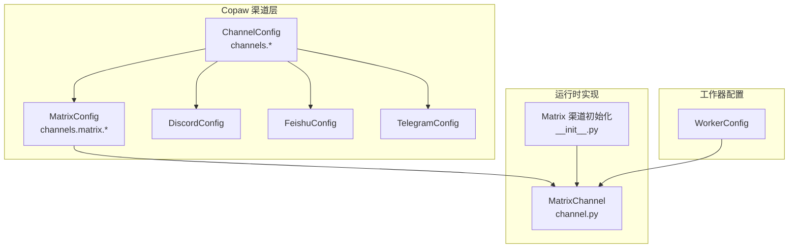
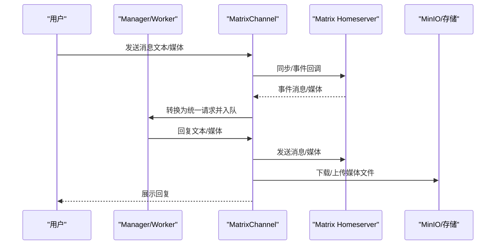
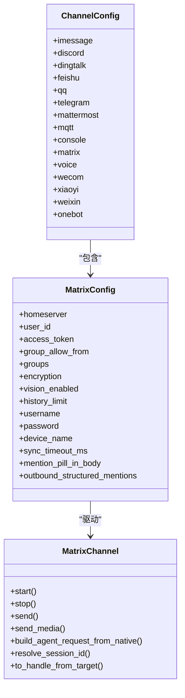
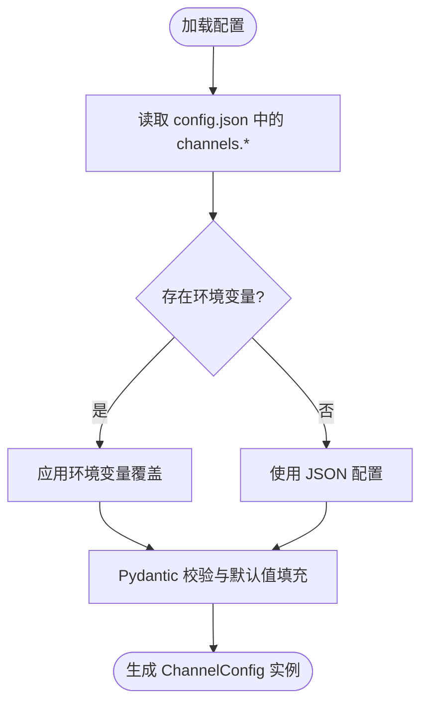
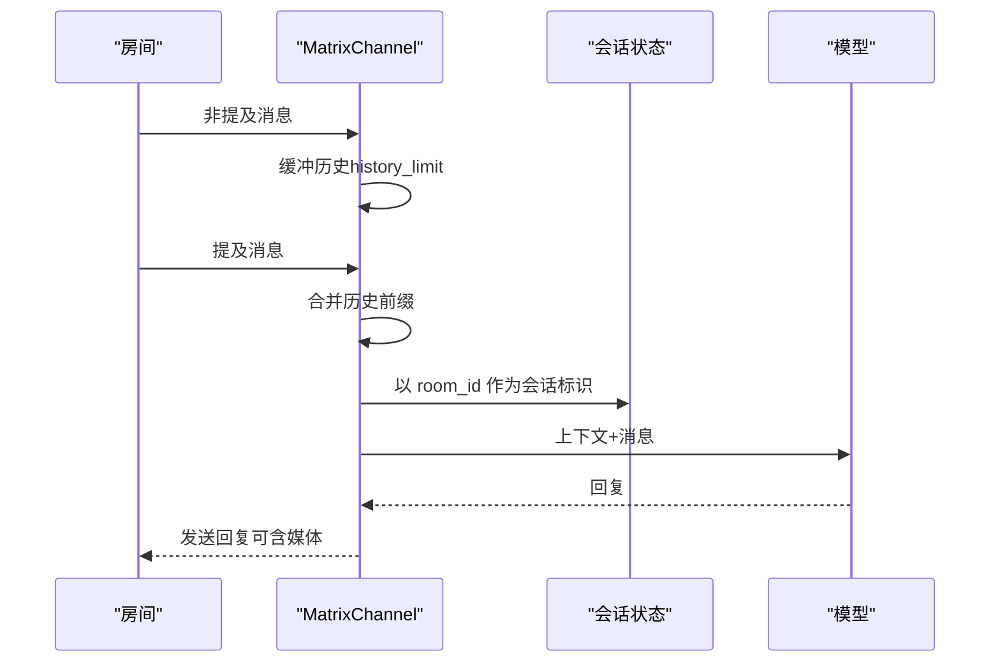
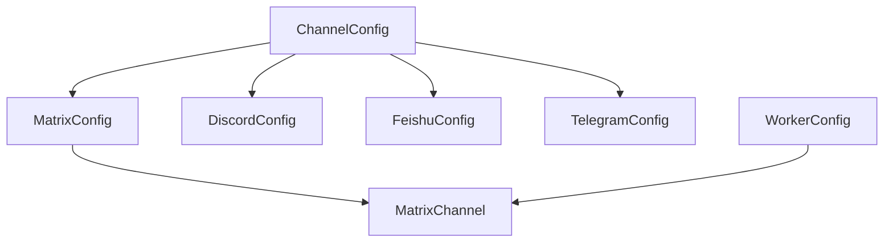

# 多通道支持

<cite>
**本文引用的文件**
- [copaw/src/matrix/config.py](file://copaw/src/matrix/config.py)
- [copaw/src/matrix/channel.py](file://copaw/src/matrix/channel.py)
- [copaw/src/matrix/__init__.py](file://copaw/src/matrix/__init__.py)
- [copaw/src/copaw_worker/config.py](file://copaw/src/copaw_worker/config.py)
- [docs/quickstart.md](file://docs/quickstart.md)
</cite>

## 目录
1. [简介](#简介)
2. [项目结构](#项目结构)
3. [核心组件](#核心组件)
4. [架构总览](#架构总览)
5. [详细组件分析](#详细组件分析)
6. [依赖分析](#依赖分析)
7. [性能考虑](#性能考虑)
8. [故障排查指南](#故障排查指南)
9. [结论](#结论)
10. [附录](#附录)

## 简介
本文件面向 HiClaw 多通道通信系统，聚焦于 Matrix（含端到端加密）、Discord、飞书（Feishu/Lark）、Telegram 等多种通信渠道的配置与管理方法。内容涵盖：
- 各渠道的连接设置、认证配置与消息路由机制
- 渠道配置文件结构与参数说明
- 新渠道接入的步骤与配置要点
- 渠道间互操作性与消息同步策略
- 不同渠道的适用场景与最佳实践

## 项目结构
HiClaw 的多通道能力由 Copaw 运行时扩展而来，核心位于 copaw 子模块中：
- 渠道配置模型：定义各渠道的参数与默认值
- 渠道实现：以 MatrixChannel 为例，展示事件监听、媒体处理、会话管理等机制
- 初始化入口：在 copaw 中替换内置 Matrix 渠道，增强 E2EE、历史缓冲与提及处理
- 工作器配置：Worker 的通用配置对象，用于统一管理 MinIO、控制台端口等运行参数

**图表来源**
- [copaw/src/matrix/config.py:226-246](file://copaw/src/matrix/config.py#L226-L246)
- [copaw/src/matrix/config.py:160-184](file://copaw/src/matrix/config.py#L160-L184)
- [copaw/src/matrix/channel.py:216-255](file://copaw/src/matrix/channel.py#L216-L255)
- [copaw/src/matrix/__init__.py:9-11](file://copaw/src/matrix/__init__.py#L9-L11)
- [copaw/src/copaw_worker/config.py:7-29](file://copaw/src/copaw_worker/config.py#L7-L29)

**章节来源**
- [copaw/src/matrix/config.py:226-246](file://copaw/src/matrix/config.py#L226-L246)
- [copaw/src/matrix/channel.py:216-255](file://copaw/src/matrix/channel.py#L216-L255)
- [copaw/src/matrix/__init__.py:9-11](file://copaw/src/matrix/__init__.py#L9-L11)
- [copaw/src/copaw_worker/config.py:7-29](file://copaw/src/copaw_worker/config.py#L7-L29)

## 核心组件
- ChannelConfig：聚合所有内置渠道配置，默认允许额外键用于插件渠道
- MatrixConfig：Matrix 渠道专属配置，包括 homeserver、用户凭据、策略白名单、历史缓冲、E2EE 开关、提及策略等
- MatrixChannel：基于 matrix-nio 实现的通道类，负责登录、事件回调、历史缓冲、媒体下载/上传、提及解析、会话管理等
- WorkerConfig：工作器运行参数，如 MinIO 端点、访问密钥、桶名、同步间隔、控制台端口等

关键要点
- 渠道配置通过 Pydantic 模型校验与序列化，支持从 JSON 配置加载
- MatrixChannel 提供从原生事件到统一内容对象的转换，以及反向发送文本/媒体消息的能力
- WorkerConfig 为工作器提供统一的存储与网络参数，便于跨渠道部署

**章节来源**
- [copaw/src/matrix/config.py:226-246](file://copaw/src/matrix/config.py#L226-L246)
- [copaw/src/matrix/config.py:160-184](file://copaw/src/matrix/config.py#L160-L184)
- [copaw/src/matrix/channel.py:216-255](file://copaw/src/matrix/channel.py#L216-L255)
- [copaw/src/copaw_worker/config.py:7-29](file://copaw/src/copaw_worker/config.py#L7-L29)

## 架构总览
下图展示了多通道系统在运行时的交互关系：Manager/Worker 通过各渠道与用户进行消息交互；MatrixChannel 基于 matrix-nio 进行长轮询同步、事件回调与媒体处理；WorkerConfig 统一承载存储与网络参数。

**图表来源**
- [copaw/src/matrix/channel.py:335-477](file://copaw/src/matrix/channel.py#L335-L477)
- [copaw/src/matrix/channel.py:1461-1584](file://copaw/src/matrix/channel.py#L1461-L1584)
- [copaw/src/matrix/channel.py:2036-2200](file://copaw/src/matrix/channel.py#L2036-L2200)
- [copaw/src/copaw_worker/config.py:7-29](file://copaw/src/copaw_worker/config.py#L7-L29)

## 详细组件分析

### Matrix 渠道配置与实现
- 配置项要点
  - 基础连接：homeserver、access_token 或 username/password
  - 安全与隐私：encryption 开启端到端加密；设备名 device_name；同步超时 sync_timeout_ms
  - 访问策略：dm_policy/group_policy 白名单模式；allow_from/group_allow_from 允许来源
  - 历史与视觉：history_limit 缓冲条数；vision_enabled 控制图像输入
  - 提及与格式：outbound_structured_mentions、mention_pill_in_body 控制外发提及样式
- 实现要点
  - 登录与 whoami 校验；E2EE 密钥上传与维护；HTTP 客户端用于媒体下载
  - 事件回调：文本消息、媒体消息、加密媒体、未解密事件
  - 历史缓冲：非提及消息按房间缓存，提及后合并到当前消息前缀
  - DM 检测：使用 joined_members API 并带 TTL 的内存缓存，确保恢复令牌后的准确性
  - 提及解析：支持 m.mentions、matrix.to 链接与 MXID 文本匹配
  - 发送：Markdown 转 HTML；可选结构化提及；NO_REPLY 协议抑制空回复

**图表来源**
- [copaw/src/matrix/config.py:226-246](file://copaw/src/matrix/config.py#L226-L246)
- [copaw/src/matrix/config.py:160-184](file://copaw/src/matrix/config.py#L160-L184)
- [copaw/src/matrix/channel.py:216-255](file://copaw/src/matrix/channel.py#L216-L255)

**章节来源**
- [copaw/src/matrix/config.py:160-184](file://copaw/src/matrix/config.py#L160-L184)
- [copaw/src/matrix/channel.py:216-255](file://copaw/src/matrix/channel.py#L216-L255)
- [copaw/src/matrix/channel.py:335-477](file://copaw/src/matrix/channel.py#L335-L477)
- [copaw/src/matrix/channel.py:1461-1584](file://copaw/src/matrix/channel.py#L1461-L1584)
- [copaw/src/matrix/channel.py:1600-1735](file://copaw/src/matrix/channel.py#L1600-L1735)
- [copaw/src/matrix/channel.py:1742-1839](file://copaw/src/matrix/channel.py#L1742-L1839)
- [copaw/src/matrix/channel.py:2036-2200](file://copaw/src/matrix/channel.py#L2036-L2200)

### Discord 渠道配置
- 关键参数
  - bot_token：机器人访问令牌
  - http_proxy/http_proxy_auth：HTTP 代理与认证
  - accept_bot_messages：是否接受来自其他机器人的消息
- 适用场景
  - 服务器内协作、自动化通知与工具集成
- 最佳实践
  - 使用独立机器人账号，限制权限范围
  - 通过代理访问受限网络环境
  - 对重复消息进行去重处理

**章节来源**
- [copaw/src/matrix/config.py:62-67](file://copaw/src/matrix/config.py#L62-L67)

### 飞书（Feishu/Lark）渠道配置
- 关键参数
  - app_id/app_secret：应用凭证
  - encrypt_key/verification_token：事件处理器可选参数
  - media_dir：接收媒体文件目录
  - domain：区域选择（feishu 中国版，lark 国际版）
- 适用场景
  - 企业内部沟通与审批流程集成
- 最佳实践
  - 在企业防火墙内配置回调域名白名单
  - 使用 verification_token 校验事件来源
  - 合理设置 media_dir 与磁盘配额

**章节来源**
- [copaw/src/matrix/config.py:80-92](file://copaw/src/matrix/config.py#L80-L92)

### Telegram 渠道配置
- 关键参数
  - bot_token：机器人访问令牌
  - http_proxy/http_proxy_auth：HTTP 代理与认证
  - show_typing：是否显示正在输入状态
- 适用场景
  - 公共群组协作与个人助手
- 最佳实践
  - 通过代理绕过网络限制
  - 显示输入状态提升交互体验
  - 对机器人消息进行过滤以避免回环

**章节来源**
- [copaw/src/matrix/config.py:110-115](file://copaw/src/matrix/config.py#L110-L115)

### 渠道配置文件结构与参数
- ChannelConfig：聚合所有内置渠道配置，并允许额外键用于插件渠道
- 各渠道子配置类（如 MatrixConfig、DiscordConfig、FeishuConfig、TelegramConfig 等）定义具体字段与默认值
- 参数覆盖顺序
  - 优先使用配置文件中的 channels.* 字段
  - 其次考虑环境变量（如 Matrix 的 HICLAW_MATRIX_SERVER/HICLAW_MATRIX_TOKEN）
  - 最后使用默认值

**图表来源**
- [copaw/src/matrix/config.py:226-246](file://copaw/src/matrix/config.py#L226-L246)
- [copaw/src/matrix/channel.py:300-308](file://copaw/src/matrix/channel.py#L300-L308)

**章节来源**
- [copaw/src/matrix/config.py:226-246](file://copaw/src/matrix/config.py#L226-L246)
- [copaw/src/matrix/channel.py:300-308](file://copaw/src/matrix/channel.py#L300-L308)

### 新渠道添加步骤与配置示例
- 步骤
  1. 在 ChannelConfig 中新增子配置类，定义必要字段与默认值
  2. 在渠道实现层新增对应 Channel 类，实现 start/stop/send/build_agent_request_from_native 等接口
  3. 在初始化入口注册新渠道（参考 Matrix 的导出方式）
  4. 在 WorkerConfig 中补充必要的运行参数（如存储、网络）
  5. 在安装/部署脚本中提供环境变量或配置文件模板
- 示例路径
  - 新增配置类：参考 [MatrixConfig:160-184](file://copaw/src/matrix/config.py#L160-L184)
  - 新增实现类：参考 [MatrixChannel:216-255](file://copaw/src/matrix/channel.py#L216-L255)
  - 注册入口：参考 [Matrix 初始化:9-11](file://copaw/src/matrix/__init__.py#L9-L11)
  - 工作器参数：参考 [WorkerConfig:7-29](file://copaw/src/copaw_worker/config.py#L7-L29)

**章节来源**
- [copaw/src/matrix/config.py:160-184](file://copaw/src/matrix/config.py#L160-L184)
- [copaw/src/matrix/channel.py:216-255](file://copaw/src/matrix/channel.py#L216-L255)
- [copaw/src/matrix/__init__.py:9-11](file://copaw/src/matrix/__init__.py#L9-L11)
- [copaw/src/copaw_worker/config.py:7-29](file://copaw/src/copaw_worker/config.py#L7-L29)

### 渠道间互操作性与消息同步
- 会话标识与路由
  - MatrixChannel 将 room_id 作为会话标识，确保同一房间内的消息共享会话状态
  - to_handle_from_target 返回 room_id，保证发送目标正确
- 历史上下文与去重
  - 非提及消息在房间内缓冲，提及后合并到当前消息前缀，形成一致的历史上下文
  - DM 房间检测通过 API 与缓存结合，避免令牌恢复后的成员列表不一致
- 媒体与视觉
  - 支持图片/音频/视频/文件的下载与上传；当模型不支持视觉时，图片自动降级为文本描述
- NO_REPLY 协议
  - 当 Agent 决定不回复时，发送 NO_REPLY 抑制触发，防止无限回环

**图表来源**
- [copaw/src/matrix/channel.py:871-947](file://copaw/src/matrix/channel.py#L871-L947)
- [copaw/src/matrix/channel.py:1909-1929](file://copaw/src/matrix/channel.py#L1909-L1929)
- [copaw/src/matrix/channel.py:2036-2200](file://copaw/src/matrix/channel.py#L2036-L2200)

**章节来源**
- [copaw/src/matrix/channel.py:871-947](file://copaw/src/matrix/channel.py#L871-L947)
- [copaw/src/matrix/channel.py:1909-1929](file://copaw/src/matrix/channel.py#L1909-L1929)
- [copaw/src/matrix/channel.py:2036-2200](file://copaw/src/matrix/channel.py#L2036-L2200)

## 依赖分析
- 组件耦合
  - ChannelConfig 与各渠道配置类松耦合，通过聚合关系组织
  - MatrixChannel 依赖 matrix-nio 与 httpx，负责事件处理与媒体下载
  - WorkerConfig 为外部存储与网络提供统一参数
- 外部依赖
  - Matrix：homeserver、access_token/whoami、媒体仓库
  - MinIO：配置文件与媒体文件的持久化
  - Higress/网关：对外暴露服务与路由

**图表来源**
- [copaw/src/matrix/config.py:226-246](file://copaw/src/matrix/config.py#L226-L246)
- [copaw/src/matrix/config.py:160-184](file://copaw/src/matrix/config.py#L160-L184)
- [copaw/src/matrix/channel.py:216-255](file://copaw/src/matrix/channel.py#L216-L255)
- [copaw/src/copaw_worker/config.py:7-29](file://copaw/src/copaw_worker/config.py#L7-L29)

**章节来源**
- [copaw/src/matrix/config.py:226-246](file://copaw/src/matrix/config.py#L226-L246)
- [copaw/src/matrix/config.py:160-184](file://copaw/src/matrix/config.py#L160-L184)
- [copaw/src/matrix/channel.py:216-255](file://copaw/src/matrix/channel.py#L216-L255)
- [copaw/src/copaw_worker/config.py:7-29](file://copaw/src/copaw_worker/config.py#L7-L29)

## 性能考虑
- 同步与超时
  - MatrixChannel 的同步超时需大于 HTTP 请求超时，避免连接被提前中断
  - 建议根据网络状况调整 sync_timeout_ms，平衡延迟与稳定性
- 历史缓冲
  - history_limit 控制内存占用与上下文长度，建议结合模型上下文窗口大小设置
- 媒体处理
  - 媒体下载采用异步 HTTP 客户端，注意磁盘空间与并发下载上限
- E2EE 维护
  - 定期执行密钥上传、查询与声明，减少未解密事件日志

[本节为通用指导，无需特定文件来源]

## 故障排查指南
- Matrix 登录失败
  - 检查 homeserver 地址与 access_token 是否正确；确认 whoami 返回包含 user_id 与 device_id
  - 若启用 E2EE，确认 device_id 存在且 crypto store 可加载
- 未收到消息
  - 确认 allowlist 策略与 requireMention 设置；检查 DM 房间检测是否命中缓存
  - 查看历史缓冲是否截断了上下文
- 媒体无法下载
  - 检查 mxc:// URL 与 Authorization 头；确认媒体目录可写
  - 若为加密媒体，确认解密参数（key/hashes/iv）齐全
- 发送失败
  - 检查 room_id 是否有效；查看 formatted_body 与 m.mentions 是否符合规范
  - 对于 NO_REPLY，确认未被二次触发导致回环

**章节来源**
- [copaw/src/matrix/channel.py:335-477](file://copaw/src/matrix/channel.py#L335-L477)
- [copaw/src/matrix/channel.py:1382-1453](file://copaw/src/matrix/channel.py#L1382-L1453)
- [copaw/src/matrix/channel.py:1038-1129](file://copaw/src/matrix/channel.py#L1038-L1129)
- [copaw/src/matrix/channel.py:2036-2200](file://copaw/src/matrix/channel.py#L2036-L2200)

## 结论
HiClaw 的多通道通信系统以 ChannelConfig 为中心，围绕 MatrixChannel 提供了完善的事件处理、媒体管理与会话路由能力。通过清晰的配置模型与实现抽象，系统能够便捷地扩展新的通信渠道，并在企业与公共场景中实现安全、稳定的消息同步与协作。

[本节为总结，无需特定文件来源]

## 附录
- 快速开始与矩阵部署参考
  - [快速开始文档:1-356](file://docs/quickstart.md#L1-L356)
  - Element Web 访问地址与管理员登录验证
  - Worker 创建与任务委派流程

**章节来源**
- [docs/quickstart.md:62-77](file://docs/quickstart.md#L62-L77)
- [docs/quickstart.md:80-141](file://docs/quickstart.md#L80-L141)
- [docs/quickstart.md:144-172](file://docs/quickstart.md#L144-L172)