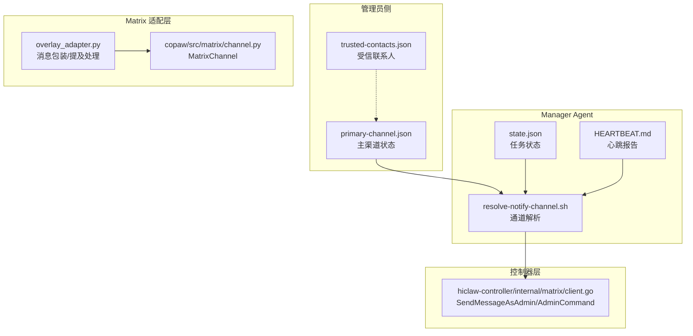
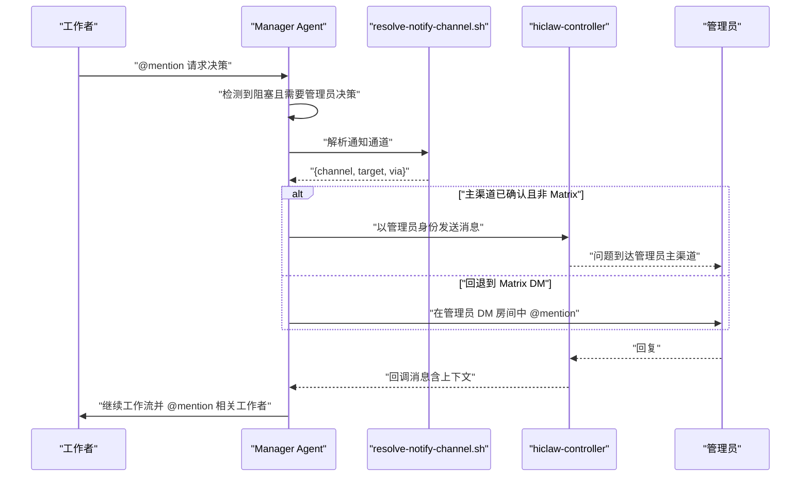
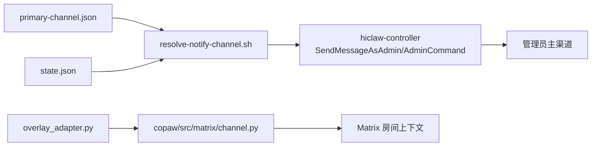

# 跨通道升级

<cite>
**本文引用的文件**
- [primary-channel.md](file://manager/agent/skills/channel-management/references/primary-channel.md)
- [manage-primary-channel.sh](file://manager/agent/skills/channel-management/scripts/manage-primary-channel.sh)
- [resolve-notify-channel.sh](file://manager/agent/skills/task-management/scripts/resolve-notify-channel.sh)
- [manage-state.sh](file://manager/agent/skills/task-management/scripts/manage-state.sh)
- [state-management.md](file://manager/agent/skills/task-management/references/state-management.md)
- [HEARTBEAT.md](file://manager/agent/HEARTBEAT.md)
- [manager-guide.md](file://docs/zh-cn/manager-guide.md)
- [client.go](file://hiclaw-controller/internal/matrix/client.go)
- [overlay_adapter.py](file://hermes/src/hermes_matrix/overlay_adapter.py)
- [AGENTS.md（CoPaw 管理员代理）](file://manager/agent/copaw-manager-agent/AGENTS.md)
- [AGENTS.md（CoPaw 工作者代理）](file://manager/agent/copaw-worker-agent/AGENTS.md)
- [AGENTS.md（Hermes 工作者代理）](file://manager/agent/hermes-worker-agent/AGENTS.md)
- [matrix.py](file://copaw/src/matrix/channel.py)
- [test-04-human-intervene.sh](file://tests/test-04-human-intervene.sh)
</cite>

## 目录
1. [简介](#简介)
2. [项目结构](#项目结构)
3. [核心组件](#核心组件)
4. [架构总览](#架构总览)
5. [详细组件分析](#详细组件分析)
6. [依赖关系分析](#依赖关系分析)
7. [性能考量](#性能考量)
8. [故障排查指南](#故障排查指南)
9. [结论](#结论)
10. [附录](#附录)

## 简介
本章节面向“跨通道升级”能力，系统阐述其工作原理、触发条件、升级流程（从项目房间到管理员主通道的消息路由）、消息自动转发与上下文保持、回复路由、配置项与自定义设置、用户体验与通知机制，以及在紧急与决策场景中的应用。

## 项目结构
跨通道升级涉及多个层面的协作：
- 管理员侧：主渠道配置与首选联系人策略
- Manager Agent：任务状态管理、通知通道解析、心跳报告
- Matrix 适配层：消息接收、@提及规则、上下文缓冲
- 控制器层：系统级消息发送与管理员房间维护
- 测试与文档：验证升级流程与使用指南

图示来源
- [primary-channel.md:1-72](file://manager/agent/skills/channel-management/references/primary-channel.md#L1-L72)
- [resolve-notify-channel.sh:1-49](file://manager/agent/skills/task-management/scripts/resolve-notify-channel.sh#L1-L49)
- [state-management.md:1-36](file://manager/agent/skills/task-management/references/state-management.md#L1-L36)
- [overlay_adapter.py:116-146](file://hermes/src/hermes_matrix/overlay_adapter.py#L116-L146)
- [matrix.py:216-300](file://copaw/src/matrix/channel.py#L216-L300)
- [client.go:477-508](file://hiclaw-controller/internal/matrix/client.go#L477-L508)

章节来源
- [primary-channel.md:1-72](file://manager/agent/skills/channel-management/references/primary-channel.md#L1-L72)
- [manager-guide.md:80-106](file://docs/zh-cn/manager-guide.md#L80-L106)

## 核心组件
- 主渠道与首选联系人
  - 主渠道状态由管理员侧的主渠道文件维护，支持确认、重置与显示。
  - 受信联系人用于扩展非管理员的有限交互。
- 通知通道解析
  - 优先使用已确认的非 Matrix 主渠道；否则回退到管理员私信房间。
- 任务状态与管理员 DM 缓存
  - 通过状态文件缓存管理员 DM 房间 ID，供心跳与通知使用。
- 消息适配与上下文
  - Matrix 适配器负责消息发送包装、@提及处理与历史上下文缓冲。
- 控制器级系统消息
  - 控制器提供以管理员身份发送消息的能力，保障系统级提示一致性。

章节来源
- [manage-primary-channel.sh:1-124](file://manager/agent/skills/channel-management/scripts/manage-primary-channel.sh#L1-L124)
- [primary-channel.md:1-72](file://manager/agent/skills/channel-management/references/primary-channel.md#L1-L72)
- [resolve-notify-channel.sh:1-49](file://manager/agent/skills/task-management/scripts/resolve-notify-channel.sh#L1-L49)
- [state-management.md:1-36](file://manager/agent/skills/task-management/references/state-management.md#L1-L36)
- [overlay_adapter.py:116-146](file://hermes/src/hermes_matrix/overlay_adapter.py#L116-L146)
- [matrix.py:216-300](file://copaw/src/matrix/channel.py#L216-L300)
- [client.go:477-508](file://hiclaw-controller/internal/matrix/client.go#L477-L508)

## 架构总览
跨通道升级的关键路径：Manager 在项目房间中阻塞等待管理员决策时，解析通知通道，将问题发送至管理员主渠道；管理员回复后，系统将回复自动路由回原项目房间并@相关工作者继续流程。

图示来源
- [primary-channel.md:59-71](file://manager/agent/skills/channel-management/references/primary-channel.md#L59-L71)
- [resolve-notify-channel.sh:1-49](file://manager/agent/skills/task-management/scripts/resolve-notify-channel.sh#L1-L49)
- [client.go:477-508](file://hiclaw-controller/internal/matrix/client.go#L477-L508)

章节来源
- [primary-channel.md:59-71](file://manager/agent/skills/channel-management/references/primary-channel.md#L59-L71)
- [manager-guide.md:103-106](file://docs/zh-cn/manager-guide.md#L103-L106)

## 详细组件分析

### 主渠道与首选联系人
- 主渠道状态
  - 管理员首次从新渠道发送 DM 时，触发“首接触协议”，询问是否设为主渠道。
  - 确认后写入主渠道文件；重置则回退到 Matrix DM。
- 首次接触协议
  - 触发条件：管理员从与主渠道不匹配的新渠道发送 DM。
  - 动作：读取当前状态、正常回复、询问是否设为主渠道；根据回复执行确认或重置。
- 切换主渠道
  - 管理员请求切换时，读取当前状态并更新。

章节来源
- [primary-channel.md:46-58](file://manager/agent/skills/channel-management/references/primary-channel.md#L46-L58)
- [manage-primary-channel.sh:24-81](file://manager/agent/skills/channel-management/scripts/manage-primary-channel.sh#L24-L81)

### 通知通道解析与回退策略
- 解析逻辑
  - 优先：主渠道已确认且非 Matrix，则使用主渠道目标。
  - 回退：若主渠道缺失或未确认，则使用状态文件中的管理员 DM 房间 ID。
  - 失败：输出错误信息，提示先执行心跳步骤以发现管理员 DM 房间。
- 输出格式
  - 返回 JSON，包含 channel、target、via 字段，便于后续工具直接使用。

章节来源
- [resolve-notify-channel.sh:1-49](file://manager/agent/skills/task-management/scripts/resolve-notify-channel.sh#L1-L49)
- [state-management.md:27-36](file://manager/agent/skills/task-management/references/state-management.md#L27-L36)

### 心跳报告与跨通道升级
- 心跳报告
  - 心跳阶段必须将发现与建议发送到解析出的通知通道，而非散落于错误的 Matrix 房间。
  - 若通道为 none，则尝试发现管理员 DM 房间后再重试。
- 升级触发
  - 当 Manager 在 Matrix 项目房间中阻塞等待管理员决策时，按上述通道解析结果进行升级。

章节来源
- [HEARTBEAT.md:177-192](file://manager/agent/HEARTBEAT.md#L177-L192)
- [manager-guide.md:103-106](file://docs/zh-cn/manager-guide.md#L103-L106)

### 消息自动转发、上下文保持与回复路由
- 自动转发
  - 通过控制器以管理员身份发送消息，确保系统级提示的一致性与可信度。
- 上下文保持
  - Matrix 适配器在发送消息前包装提及，保证消息结构正确；在接收消息时，若存在历史缓冲，会将“当前消息”与“历史上下文”分段呈现，确保只对当前消息响应。
- 回复路由
  - 管理员回复后，系统将回调消息交由 Manager Agent 处理，继续原项目房间的工作流，并@相关工作者。

章节来源
- [client.go:477-508](file://hiclaw-controller/internal/matrix/client.go#L477-L508)
- [overlay_adapter.py:116-146](file://hermes/src/hermes_matrix/overlay_adapter.py#L116-L146)
- [AGENTS.md（CoPaw 管理员代理）:159-188](file://manager/agent/copaw-manager-agent/AGENTS.md#L159-L188)
- [AGENTS.md（CoPaw 工作者代理）:109-121](file://manager/agent/copaw-worker-agent/AGENTS.md#L109-L121)
- [AGENTS.md（Hermes 工作者代理）:102-133](file://manager/agent/hermes-worker-agent/AGENTS.md#L102-L133)

### 配置选项与自定义设置
- 主渠道配置
  - 在 Manager 的 openclaw 配置中添加 channels.<channel> 块，并在 dm.allowFrom 中填入管理员用户 ID，重启后生效。
  - 主渠道文件位置：管理员主目录下的持久化文件，跨重启保留。
- 受信联系人
  - 允许非管理员在受信条件下进行有限交流，但不得泄露敏感信息或代表其执行管理操作。
- Matrix 适配器参数
  - 支持过滤工具消息、思考内容、历史缓冲上限、同步超时等参数，按需调整体验与性能。

章节来源
- [manager-guide.md:71-89](file://docs/zh-cn/manager-guide.md#L71-L89)
- [matrix.py:190-206](file://copaw/src/matrix/channel.py#L190-L206)

### 用户体验与通知机制
- 通知渠道优先级
  - 主渠道（已确认且非 Matrix）> 管理员 DM 房间 > 无通道。
- 语言与语气
  - 心跳报告应遵循 SOUL.md 的身份、个性与用户偏好语言。
- 交互提示
  - 首次接触时，Manager 会询问管理员是否将新渠道设为主渠道；管理员可在任意时刻切换主渠道。

章节来源
- [primary-channel.md:33-58](file://manager/agent/skills/channel-management/references/primary-channel.md#L33-L58)
- [HEARTBEAT.md:177-192](file://manager/agent/HEARTBEAT.md#L177-L192)

### 应用场景：紧急与决策需求
- 紧急升级
  - 在项目房间中阻塞等待管理员决策时，无需管理员即时在线，系统自动通过主渠道升级。
- 决策需求
  - 管理员在主渠道回复后，系统将回复路由回原项目房间，继续工作流并@相关工作者，避免重复沟通成本。

章节来源
- [primary-channel.md:59-71](file://manager/agent/skills/channel-management/references/primary-channel.md#L59-L71)
- [manager-guide.md:103-106](file://docs/zh-cn/manager-guide.md#L103-L106)

## 依赖关系分析
跨通道升级涉及以下关键依赖：
- 通道解析依赖主渠道状态与管理员 DM 房间 ID。
- 消息发送依赖控制器提供的管理员身份令牌与房间 ID。
- 上下文保持依赖 Matrix 适配器的消息包装与历史缓冲策略。

图示来源
- [resolve-notify-channel.sh:1-49](file://manager/agent/skills/task-management/scripts/resolve-notify-channel.sh#L1-L49)
- [client.go:477-508](file://hiclaw-controller/internal/matrix/client.go#L477-L508)
- [overlay_adapter.py:116-146](file://hermes/src/hermes_matrix/overlay_adapter.py#L116-L146)
- [matrix.py:216-300](file://copaw/src/matrix/channel.py#L216-L300)

章节来源
- [resolve-notify-channel.sh:1-49](file://manager/agent/skills/task-management/scripts/resolve-notify-channel.sh#L1-L49)
- [client.go:477-508](file://hiclaw-controller/internal/matrix/client.go#L477-L508)
- [overlay_adapter.py:116-146](file://hermes/src/hermes_matrix/overlay_adapter.py#L116-L146)

## 性能考量
- 通道解析为轻量级文件读取与 JSON 解析，开销极低。
- 心跳阶段仅在有异常或待办时发送，避免频繁通知。
- Matrix 历史缓冲与消息包装在适配层完成，减少重复渲染与无效消息。

## 故障排查指南
- 无法解析通知通道
  - 检查主渠道文件是否存在且已确认且非 Matrix；否则确认管理员 DM 房间 ID 是否已在状态文件中缓存。
- 管理员未收到升级消息
  - 确认主渠道配置与管理员 ID 白名单；检查控制器日志与管理员主渠道可用性。
- 回复未路由回原房间
  - 确认回调消息是否携带正确的上下文；检查适配器的提及处理与历史缓冲逻辑。
- 测试验证
  - 使用人类干预测试脚本验证在任务处理过程中管理员可补充指令并影响最终结果。

章节来源
- [state-management.md:27-36](file://manager/agent/skills/task-management/references/state-management.md#L27-L36)
- [test-04-human-intervene.sh:1-79](file://tests/test-04-human-intervene.sh#L1-L79)

## 结论
跨通道升级通过“主渠道确认 + 通道解析 + 控制器系统消息 + 适配器上下文保持”的组合，实现了从项目房间到管理员主通道的高效升级与自动回复路由。配合受信联系人与心跳报告的语言与语气规范，既提升了紧急决策效率，也保障了用户体验与安全性。

## 附录
- 关键脚本与参考
  - 主渠道管理：[manage-primary-channel.sh:1-124](file://manager/agent/skills/channel-management/scripts/manage-primary-channel.sh#L1-L124)
  - 通知通道解析：[resolve-notify-channel.sh:1-49](file://manager/agent/skills/task-management/scripts/resolve-notify-channel.sh#L1-L49)
  - 任务状态管理：[manage-state.sh:169-179](file://manager/agent/skills/task-management/scripts/manage-state.sh#L169-L179)
  - 心跳报告流程：[HEARTBEAT.md:177-192](file://manager/agent/HEARTBEAT.md#L177-L192)
  - 管理员指南（含跨通道升级说明）：[manager-guide.md:103-106](file://docs/zh-cn/manager-guide.md#L103-L106)