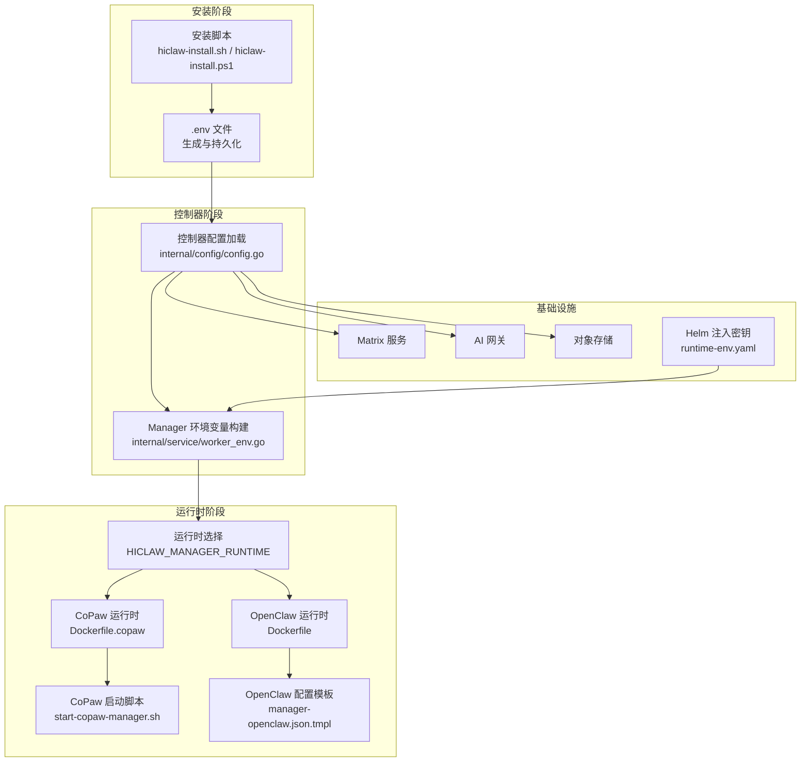
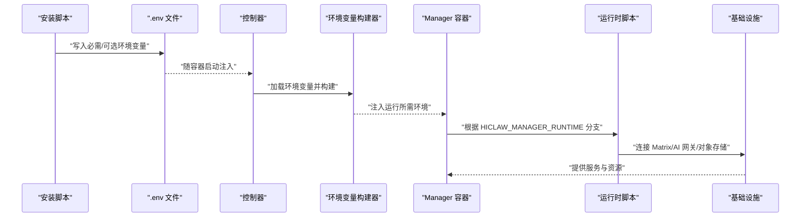
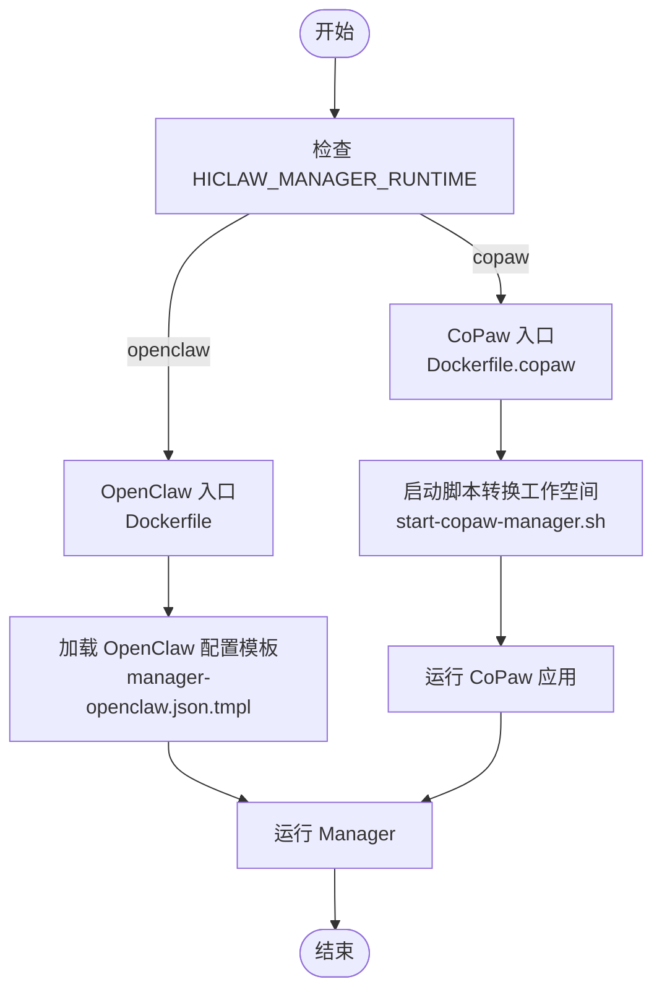
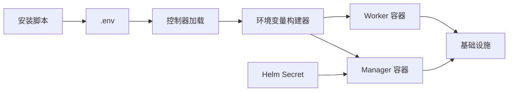

# Manager 配置管理

<cite>
**本文档引用的文件**
- [hiclaw-install.sh](file://install/hiclaw-install.sh)
- [hiclaw-install.ps1](file://install/hiclaw-install.ps1)
- [config.go](file://hiclaw-controller/internal/config/config.go)
- [manager-guide.md](file://docs/manager-guide.md)
- [manager-guide.md(zh-cn)](file://docs/zh-cn/manager-guide.md)
- [manager-openclaw.json.tmpl](file://manager/configs/manager-openclaw.json.tmpl)
- [hiclaw-env.sh](file://shared/lib/hiclaw-env.sh)
- [start-copaw-manager.sh](file://manager/scripts/init/start-copaw-manager.sh)
- [Dockerfile](file://manager/Dockerfile)
- [Dockerfile.copaw](file://manager/Dockerfile.copaw)
- [base.sh](file://manager/scripts/lib/base.sh)
- [runtime-env.yaml](file://helm/hiclaw/templates/secrets/runtime-env.yaml)
- [worker_env.go](file://hiclaw-controller/internal/service/worker_env.go)
- [security.go](file://hiclaw-controller/internal/proxy/security.go)
- [troubleshooting.md](file://tests/skills/hiclaw-test/references/troubleshooting.md)
</cite>

## 目录
1. [简介](#简介)
2. [项目结构](#项目结构)
3. [核心组件](#核心组件)
4. [架构总览](#架构总览)
5. [详细组件分析](#详细组件分析)
6. [依赖分析](#依赖分析)
7. [性能考虑](#性能考虑)
8. [故障排除指南](#故障排除指南)
9. [结论](#结论)
10. [附录](#附录)

## 简介
本文件面向 HiClaw Manager 的配置管理，系统性梳理并解释环境变量配置选项，涵盖必需与可选参数、不同运行时模式（OpenClaw 与 CoPaw）的配置差异、配置验证与故障排除流程，并提供配置模板与最佳实践建议。目标是帮助用户在不同部署场景（本地、嵌入式控制器、Kubernetes）中正确设置 Manager 的运行参数，确保 Manager 与基础设施（矩阵、AI 网关、对象存储等）协同工作。

## 项目结构
围绕 Manager 配置管理的关键位置与文件如下：
- 安装与引导：安装脚本负责收集与生成环境变量，写入 .env 文件；Windows 版本提供等价逻辑。
- 控制器配置加载：控制器从环境变量读取并构建运行配置，下发到 Manager 与 Worker。
- 运行时脚本：根据 HICLAW_MANAGER_RUNTIME 分支选择 OpenClaw 或 CoPaw 启动路径。
- 配置模板：Manager 的 OpenClaw 配置模板定义了通道、模型、代理等默认行为。
- Helm 密钥注入：Helm 模板将关键密钥注入到 Manager Pod 的环境变量中。
- 故障排除：测试技能中的排障指南提供常见问题诊断命令与思路。

**图表来源**
- [hiclaw-install.sh:14-50](file://install/hiclaw-install.sh#L14-L50)
- [hiclaw-install.ps1:2049-2076](file://install/hiclaw-install.ps1#L2049-L2076)
- [config.go:207-356](file://hiclaw-controller/internal/config/config.go#L207-L356)
- [worker_env.go:38-79](file://hiclaw-controller/internal/service/worker_env.go#L38-L79)
- [Dockerfile:69-87](file://manager/Dockerfile#L69-L87)
- [Dockerfile.copaw:135-143](file://manager/Dockerfile.copaw#L135-L143)
- [start-copaw-manager.sh:1-31](file://manager/scripts/init/start-copaw-manager.sh#L1-L31)
- [manager-openclaw.json.tmpl:1-145](file://manager/configs/manager-openclaw.json.tmpl#L1-L145)
- [runtime-env.yaml:26-35](file://helm/hiclaw/templates/secrets/runtime-env.yaml#L26-L35)

**章节来源**
- [hiclaw-install.sh:14-50](file://install/hiclaw-install.sh#L14-L50)
- [hiclaw-install.ps1:2049-2076](file://install/hiclaw-install.ps1#L2049-L2076)
- [config.go:207-356](file://hiclaw-controller/internal/config/config.go#L207-L356)
- [worker_env.go:38-79](file://hiclaw-controller/internal/service/worker_env.go#L38-L79)
- [Dockerfile:69-87](file://manager/Dockerfile#L69-L87)
- [Dockerfile.copaw:135-143](file://manager/Dockerfile.copaw#L135-L143)
- [start-copaw-manager.sh:1-31](file://manager/scripts/init/start-copaw-manager.sh#L1-L31)
- [manager-openclaw.json.tmpl:1-145](file://manager/configs/manager-openclaw.json.tmpl#L1-L145)
- [runtime-env.yaml:26-35](file://helm/hiclaw/templates/secrets/runtime-env.yaml#L26-L35)

## 核心组件
本节聚焦 Manager 的关键配置项及其作用、默认值与设置方法。

- HICLAW_LLM_API_KEY
  - 必需：是
  - 作用：LLM API 访问密钥，用于调用大模型服务
  - 设置方法：安装脚本要求提供；Helm 模板强制校验
  - 默认值：无
  - 示例来源
    - [hiclaw-install.sh](file://install/hiclaw-install.sh#L19)
    - [runtime-env.yaml](file://helm/hiclaw/templates/secrets/runtime-env.yaml#L30)

- HICLAW_MANAGER_RUNTIME
  - 必需：否
  - 默认值：openclaw
  - 作用：选择 Manager 运行时引擎
  - 取值：openclaw 或 copaw
  - 影响：决定启动脚本分支与镜像类型
  - 示例来源
    - [hiclaw-install.sh:2113-2144](file://install/hiclaw-install.sh#L2113-L2144)
    - [hiclaw-install.ps1:2049-2076](file://install/hiclaw-install.ps1#L2049-L2076)
    - [Dockerfile](file://manager/Dockerfile#L69)
    - [Dockerfile.copaw:135-143](file://manager/Dockerfile.copaw#L135-L143)

- HICLAW_WORKSPACE_DIR
  - 必需：否
  - 默认值：~/hiclaw-manager
  - 作用：Manager 工作空间宿主机目录，挂载到容器 /root/manager-workspace
  - 设置方法：安装脚本交互或非交互输入
  - 示例来源
    - [hiclaw-install.sh:2063-2075](file://install/hiclaw-install.sh#L2063-L2075)
    - [hiclaw-install.ps1:2380-2402](file://install/hiclaw-install.ps1#L2380-L2402)
    - [config.go](file://hiclaw-controller/internal/config/config.go#L277)

- HICLAW_MANAGER_MODEL
  - 必需：否
  - 默认值：来自 HICLAW_DEFAULT_MODEL 或 qwen3.6-plus
  - 作用：Manager 默认使用的模型标识
  - 示例来源
    - [config.go:264-266](file://hiclaw-controller/internal/config/config.go#L264-L266)

- HICLAW_DEFAULT_MODEL
  - 必需：否
  - 默认值：qwen3.6-plus
  - 作用：默认模型 ID，影响 Manager 与 Worker 的模型选择
  - 示例来源
    - [config.go:264-266](file://hiclaw-controller/internal/config/config.go#L264-L266)

- HICLAW_LLM_PROVIDER
  - 必需：否
  - 默认值：qwen
  - 作用：LLM 提供商（如 qwen、openai-compat）
  - 示例来源
    - [config.go:298-299](file://hiclaw-controller/internal/config/config.go#L298-L299)

- HICLAW_OPENAI_BASE_URL
  - 必需：否
  - 作用：OpenAI 兼容提供商的基础 URL
  - 示例来源
    - [config.go:299-300](file://hiclaw-controller/internal/config/config.go#L299-L300)

- HICLAW_ADMIN_USER / HICLAW_ADMIN_PASSWORD
  - 必需：否（若不设则自动生成）
  - 作用：管理员 Matrix 用户名与密码
  - 示例来源
    - [hiclaw-install.sh:20-21](file://install/hiclaw-install.sh#L20-L21)
    - [runtime-env.yaml:26-29](file://helm/hiclaw/templates/secrets/runtime-env.yaml#L26-L29)

- HICLAW_MATRIX_URL / HICLAW_MATRIX_DOMAIN
  - 必需：否
  - 作用：Matrix 服务器地址与域，容器内使用
  - 示例来源
    - [config.go:283-288](file://hiclaw-controller/internal/config/config.go#L283-L288)
    - [manager-openclaw.json.tmpl:20-26](file://manager/configs/manager-openclaw.json.tmpl#L20-L26)

- HICLAW_AI_GATEWAY_URL
  - 必需：否
  - 作用：AI 网关地址，用于 LLM 与 MCP
  - 示例来源
    - [manager-openclaw.json.tmpl:50-51](file://manager/configs/manager-openclaw.json.tmpl#L50-L51)

- HICLAW_FS_BUCKET / HICLAW_STORAGE_PREFIX
  - 必需：否
  - 作用：对象存储桶名与前缀
  - 示例来源
    - [hiclaw-env.sh:39-40](file://shared/lib/hiclaw-env.sh#L39-L40)
    - [config.go:258-290](file://hiclaw-controller/internal/config/config.go#L258-L290)

- HICLAW_MANAGER_PASSWORD / HICLAW_MANAGER_GATEWAY_KEY
  - 必需：否（由控制器生成）
  - 作用：Manager 的 Matrix 密码与网关密钥
  - 示例来源
    - [config.go:279-281](file://hiclaw-controller/internal/config/config.go#L279-L281)
    - [worker_env.go:45-55](file://hiclaw-controller/internal/service/worker_env.go#L45-L55)

- HICLAW_PORT_MANAGER_CONSOLE
  - 必需：否
  - 默认值：18888
  - 作用：Manager 控制台宿主机端口
  - 示例来源
    - [hiclaw-install.sh](file://install/hiclaw-install.sh#L47)
    - [config.go](file://hiclaw-controller/internal/config/config.go#L279)

- HICLAW_DATA_DIR / HICLAW_HOST_SHARE_DIR
  - 必需：否
  - 作用：数据卷与共享目录（嵌入式模式）
  - 示例来源
    - [hiclaw-install.sh:24-25](file://install/hiclaw-install.sh#L24-L25)
    - [config.go:277-278](file://hiclaw-controller/internal/config/config.go#L277-L278)

- HICLAW_YOLO / HICLAW_MATRIX_DEBUG
  - 必需：否
  - 作用：YOLO 模式与 Matrix 调试开关，传播至 Manager 与 Worker
  - 示例来源
    - [config.go:323-324](file://hiclaw-controller/internal/config/config.go#L323-L324)

**章节来源**
- [hiclaw-install.sh:19-25](file://install/hiclaw-install.sh#L19-L25)
- [hiclaw-install.ps1:2049-2076](file://install/hiclaw-install.ps1#L2049-L2076)
- [config.go:264-301](file://hiclaw-controller/internal/config/config.go#L264-L301)
- [hiclaw-env.sh:39-40](file://shared/lib/hiclaw-env.sh#L39-L40)
- [worker_env.go:45-55](file://hiclaw-controller/internal/service/worker_env.go#L45-L55)
- [manager-openclaw.json.tmpl:20-51](file://manager/configs/manager-openclaw.json.tmpl#L20-L51)
- [runtime-env.yaml:26-35](file://helm/hiclaw/templates/secrets/runtime-env.yaml#L26-L35)

## 架构总览
下图展示 Manager 配置从安装到运行的关键流转：安装脚本收集环境变量并写入 .env；控制器加载环境变量并构建 Manager 环境；运行时脚本根据 HICLAW_MANAGER_RUNTIME 决定启动路径；OpenClaw/CoPaw 配置模板与基础设施（Matrix、AI 网关、对象存储）协同工作。

**图表来源**
- [hiclaw-install.sh:14-50](file://install/hiclaw-install.sh#L14-L50)
- [config.go:207-356](file://hiclaw-controller/internal/config/config.go#L207-L356)
- [worker_env.go:38-79](file://hiclaw-controller/internal/service/worker_env.go#L38-L79)
- [Dockerfile:69-87](file://manager/Dockerfile#L69-L87)
- [Dockerfile.copaw:135-143](file://manager/Dockerfile.copaw#L135-L143)

## 详细组件分析

### 运行时模式差异（OpenClaw vs CoPaw）
- 选择方式
  - 通过 HICLAW_MANAGER_RUNTIME 指定：openclaw 或 copaw
  - 安装脚本提供交互式选择与非交互默认值
- 镜像与入口
  - OpenClaw：基于 openclaw-base，入口为 Manager Agent 启动脚本
  - CoPaw：基于 Python 3.11，入口为 Manager Agent 启动脚本，内置 CoPaw 运行时
- 启动流程
  - CoPaw 模式下，启动脚本会将 OpenClaw 风格的工作空间转换为 CoPaw 风格并初始化目录结构
- 配置模板
  - OpenClaw 使用 manager-openclaw.json.tmpl，定义通道、模型、工具等
  - CoPaw 使用 Python 配置体系，启动脚本负责桥接与转换

**图表来源**
- [hiclaw-install.sh:2113-2144](file://install/hiclaw-install.sh#L2113-L2144)
- [Dockerfile:69-87](file://manager/Dockerfile#L69-L87)
- [Dockerfile.copaw:135-143](file://manager/Dockerfile.copaw#L135-L143)
- [start-copaw-manager.sh:1-31](file://manager/scripts/init/start-copaw-manager.sh#L1-L31)
- [manager-openclaw.json.tmpl:1-145](file://manager/configs/manager-openclaw.json.tmpl#L1-L145)

**章节来源**
- [hiclaw-install.sh:2113-2144](file://install/hiclaw-install.sh#L2113-L2144)
- [hiclaw-install.ps1:2049-2076](file://install/hiclaw-install.ps1#L2049-L2076)
- [Dockerfile:69-87](file://manager/Dockerfile#L69-L87)
- [Dockerfile.copaw:135-143](file://manager/Dockerfile.copaw#L135-L143)
- [start-copaw-manager.sh:1-31](file://manager/scripts/init/start-copaw-manager.sh#L1-L31)
- [manager-openclaw.json.tmpl:1-145](file://manager/configs/manager-openclaw.json.tmpl#L1-L145)

### 环境变量加载与默认值（控制器侧）
控制器从环境变量构建运行配置，包含以下要点：
- 关键字段：Manager 启用状态、模型、运行时、镜像、资源请求与限制、控制器 URL/名称、工作空间目录、主机共享目录、控制台端口、管理员凭据、网关密钥、Matrix 与对象存储配置、默认模型与嵌入模型、LLM 提供商与 API Key、OpenAI Base URL、Element Web URL、语言与时区、CMS 观测性等
- 默认值策略：优先使用环境变量，否则采用硬编码默认值；部分布尔值支持多种真值形式
- 端口与域名：在安装脚本中交互式或非交互式设置，控制器侧提供默认值
- 环境变量透传：控制器将必要的环境变量透传给 Worker 与 Manager

```mermaid
classDiagram
class Config {
+string KubeMode
+string DataDir
+string HTTPAddr
+string ConfigDir
+string CRDDir
+string SkillsDir
+string ResourcePrefix
+string SocketPath
+string ContainerPrefix
+string AuthAudience
+string GatewayProvider
+string StorageProvider
+string CredentialProviderURL
+string HigressBaseURL
+string HigressCookieFile
+string HigressAdminUser
+string HigressAdminPassword
+string WorkerBackend
+string Region
+string GWGatewayID
+string GWModelAPIID
+string GWEnvID
+string OSSBucket
+string K8sNamespace
+string K8sWorkerCPU
+string K8sWorkerMemory
+bool ManagerEnabled
+string ManagerModel
+string ManagerRuntime
+string ManagerImage
+string DefaultWorkerRuntime
+string ManagerWorkspaceDir
+string HostShareDir
+string ManagerConsolePort
+string ManagerPassword
+string ManagerGatewayKey
+string MatrixServerURL
+string MatrixDomain
+string MatrixRegistrationToken
+string MatrixAdminUser
+string MatrixAdminPassword
+bool MatrixE2EE
+string OSSStoragePrefix
+string DefaultModel
+string EmbeddingModel
+string Runtime
+int ModelContextWindow
+int ModelMaxTokens
+string LLMProvider
+string LLMAPIKey
+string OpenAIBaseURL
+string ElementWebURL
+string UserLanguage
+string UserTimezone
+bool CMSTracesEnabled
+bool CMSMetricsEnabled
+string CMSEndpoint
+string CMSLicenseKey
+string CMSProject
+string CMSWorkspace
+string CMSServiceName
+WorkerEnvDefaults WorkerEnv
+LoadConfig() *Config
+ManagerAgentEnv() map[string]string
+AgentConfig() agentconfig.Config
}
class WorkerEnvDefaults {
+string MatrixDomain
+string FSEndpoint
+string FSBucket
+string StoragePrefix
+string ControllerURL
+string AIGatewayURL
+string MatrixURL
+string AdminUser
+string Runtime
+bool YoloMode
+bool MatrixDebug
+bool CMSTracesEnabled
+bool CMSMetricsEnabled
+string CMSEndpoint
+string CMSLicenseKey
+string CMSProject
+string CMSWorkspace
}
Config --> WorkerEnvDefaults : "组合"
```

**图表来源**
- [config.go:19-188](file://hiclaw-controller/internal/config/config.go#L19-L188)

**章节来源**
- [config.go:207-356](file://hiclaw-controller/internal/config/config.go#L207-L356)
- [config.go:598-645](file://hiclaw-controller/internal/config/config.go#L598-L645)
- [config.go:647-679](file://hiclaw-controller/internal/config/config.go#L647-L679)

### 配置模板（OpenClaw）
OpenClaw 配置模板定义了：
- 网关：本地模式、端口、绑定、鉴权、远程令牌、控制界面允许策略
- 通道：Matrix 通道启用、服务器、用户 ID、访问令牌、加密、自动加入、DM/群组策略、流式传输
- 模型：合并模式、提供商（hiclaw-gateway）、模型列表与能力
- 代理：默认超时、工作空间、主模型别名映射、并发限制、心跳任务
- 工具：执行工具安全级别、提升权限策略
- 会话：DM/群组重置策略
- 插件：加载路径与入口
- 命令：重启命令可用

该模板通过环境变量占位符与控制器注入的密钥协同工作。

**章节来源**
- [manager-openclaw.json.tmpl:1-145](file://manager/configs/manager-openclaw.json.tmpl#L1-L145)

### Helm 密钥注入
Helm 模板将关键密钥注入到 Manager Pod 的环境变量中，包括：
- HICLAW_ADMIN_PASSWORD：管理员密码（存在则使用现有值，否则随机生成）
- HICLAW_LLM_API_KEY：LLM API Key（强制校验）
- HICLAW_LLM_PROVIDER：LLM 提供商
- HICLAW_DEFAULT_MODEL：默认模型
- HICLAW_OPENAI_BASE_URL：OpenAI 兼容 Base URL（可选）

**章节来源**
- [runtime-env.yaml:26-35](file://helm/hiclaw/templates/secrets/runtime-env.yaml#L26-L35)

### 安装脚本与平台差异
- Linux/macOS：hiclaw-install.sh 收集 LLM API Key、管理员凭据、Matrix 域名、端口、工作空间目录、运行时选择等，并写入 .env 文件
- Windows：hiclaw-install.ps1 提供等价的交互与非交互逻辑，设置运行时、数据目录、工作空间目录、默认 Worker 运行时、E2EE、Worker 空闲超时等

**章节来源**
- [hiclaw-install.sh:14-50](file://install/hiclaw-install.sh#L14-L50)
- [hiclaw-install.sh:2016-2075](file://install/hiclaw-install.sh#L2016-L2075)
- [hiclaw-install.sh:2113-2144](file://install/hiclaw-install.sh#L2113-L2144)
- [hiclaw-install.ps1:2049-2076](file://install/hiclaw-install.ps1#L2049-L2076)
- [hiclaw-install.ps1:2380-2402](file://install/hiclaw-install.ps1#L2380-L2402)

## 依赖分析
- 环境变量依赖链
  - 安装脚本 → .env 文件 → 控制器加载 → 环境变量构建器 → Manager/Worker 容器
  - Helm 模板 → Secret 注入 → Manager Pod 环境变量
- 运行时耦合
  - HICLAW_MANAGER_RUNTIME 决定镜像与启动脚本路径，进而影响配置模板与工作空间格式
- 外部依赖
  - Matrix 服务、AI 网关、对象存储（MinIO/OSS），均由控制器统一配置并注入

**图表来源**
- [hiclaw-install.sh:14-50](file://install/hiclaw-install.sh#L14-L50)
- [config.go:207-356](file://hiclaw-controller/internal/config/config.go#L207-L356)
- [worker_env.go:38-79](file://hiclaw-controller/internal/service/worker_env.go#L38-L79)
- [runtime-env.yaml:26-35](file://helm/hiclaw/templates/secrets/runtime-env.yaml#L26-L35)

**章节来源**
- [hiclaw-install.sh:14-50](file://install/hiclaw-install.sh#L14-L50)
- [config.go:207-356](file://hiclaw-controller/internal/config/config.go#L207-L356)
- [worker_env.go:38-79](file://hiclaw-controller/internal/service/worker_env.go#L38-L79)
- [runtime-env.yaml:26-35](file://helm/hiclaw/templates/secrets/runtime-env.yaml#L26-L35)

## 性能考虑
- 模型上下文窗口与最大令牌数可通过环境变量配置，影响推理成本与延迟
- 资源请求与限制（CPU/内存）应结合负载评估调整
- E2EE 加密与流式传输可能增加带宽与处理开销，按需开启
- 端口冲突与网络连通性对启动时间有直接影响，建议在安装阶段完成端口检查

[本节为通用指导，无需特定文件来源]

## 故障排除指南
- 容器启动失败
  - 检查端口占用与服务可达性
  - 查看容器日志与错误日志
- LLM 响应超时
  - 检查 API Key、提供商与 Base URL 配置
  - 增加超时或检查上游服务可用性
- 资源不足
  - 提升 Docker 内存限制或优化模型参数
- 管理员凭据问题
  - 确认 HICLAW_ADMIN_USER 与 HICLAW_ADMIN_PASSWORD 设置
- 运行时切换问题
  - 确认 HICLAW_MANAGER_RUNTIME 与镜像匹配
  - CoPaw 模式下检查工作空间转换是否成功

**章节来源**
- [troubleshooting.md:57-95](file://tests/skills/hiclaw-test/references/troubleshooting.md#L57-L95)
- [troubleshooting.md:126-141](file://tests/skills/hiclaw-test/references/troubleshooting.md#L126-L141)

## 结论
Manager 的配置管理围绕“安装阶段收集与持久化 + 控制器加载与下发 + 运行时脚本分支 + 基础设施协同”展开。通过合理设置 HICLAW_LLM_API_KEY、HICLAW_MANAGER_RUNTIME、HICLAW_WORKSPACE_DIR 等关键环境变量，并结合 OpenClaw/CoPaw 的差异化配置与 Helm 的密钥注入机制，可在不同部署环境中稳定运行 Manager 并与 Matrix、AI 网关、对象存储等基础设施协同工作。

[本节为总结性内容，无需特定文件来源]

## 附录

### 配置验证清单
- 必需项
  - HICLAW_LLM_API_KEY
  - HICLAW_ADMIN_USER / HICLAW_ADMIN_PASSWORD（或允许自动生成）
- 可选项
  - HICLAW_MANAGER_RUNTIME（openclaw/copaw）
  - HICLAW_WORKSPACE_DIR
  - HICLAW_DEFAULT_MODEL / HICLAW_LLM_PROVIDER / HICLAW_OPENAI_BASE_URL
  - HICLAW_MATRIX_URL / HICLAW_MATRIX_DOMAIN
  - HICLAW_AI_GATEWAY_URL
  - HICLAW_FS_BUCKET / HICLAW_STORAGE_PREFIX
  - HICLAW_PORT_MANAGER_CONSOLE
  - HICLAW_DATA_DIR / HICLAW_HOST_SHARE_DIR
  - HICLAW_YOLO / HICLAW_MATRIX_DEBUG

**章节来源**
- [hiclaw-install.sh:19-25](file://install/hiclaw-install.sh#L19-L25)
- [hiclaw-install.sh:2063-2075](file://install/hiclaw-install.sh#L2063-L2075)
- [config.go:277-301](file://hiclaw-controller/internal/config/config.go#L277-L301)
- [manager-openclaw.json.tmpl:20-51](file://manager/configs/manager-openclaw.json.tmpl#L20-L51)

### 配置模板与示例
- OpenClaw 配置模板路径：manager/configs/manager-openclaw.json.tmpl
- 运行时镜像入口：
  - OpenClaw：manager/Dockerfile
  - CoPaw：manager/Dockerfile.copaw
- 启动脚本：
  - CoPaw：manager/scripts/init/start-copaw-manager.sh

**章节来源**
- [manager-openclaw.json.tmpl:1-145](file://manager/configs/manager-openclaw.json.tmpl#L1-L145)
- [Dockerfile:69-87](file://manager/Dockerfile#L69-L87)
- [Dockerfile.copaw:135-143](file://manager/Dockerfile.copaw#L135-L143)
- [start-copaw-manager.sh:1-31](file://manager/scripts/init/start-copaw-manager.sh#L1-L31)

### 配置变更最佳实践
- 在安装后修改 .env 文件并重启 Manager 容器
- 对于 Helm 部署，更新 Secret 或通过 Helm values 覆盖
- 修改运行时（openclaw ↔ copaw）前备份工作空间
- 在生产环境启用 YOLO 与调试前充分评估风险
- 使用 base.sh 中的等待函数确保服务就绪后再启动 Manager

**章节来源**
- [hiclaw-install.sh:14-50](file://install/hiclaw-install.sh#L14-L50)
- [base.sh:7-47](file://manager/scripts/lib/base.sh#L7-L47)
- [security.go:66-105](file://hiclaw-controller/internal/proxy/security.go#L66-L105)