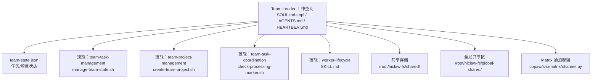
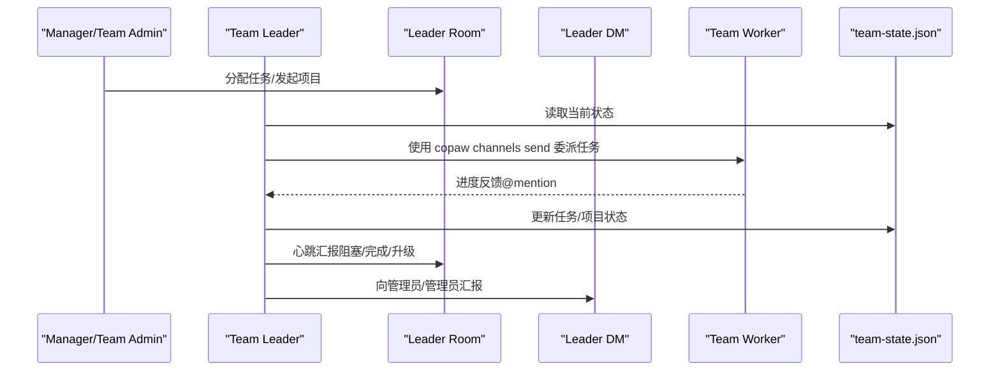
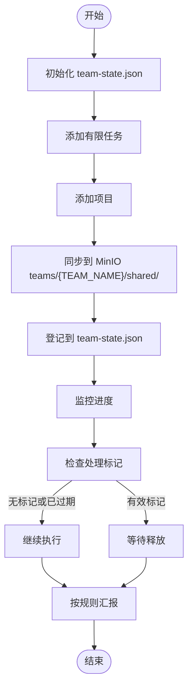
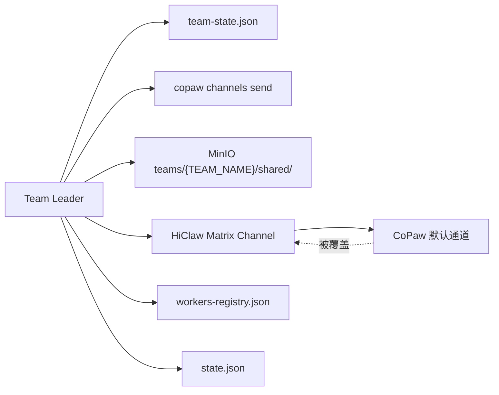

# Team Leader 角色管理

<cite>
**本文引用的文件**
- [SOUL.md.tmpl](file://manager/agent/team-leader-agent/SOUL.md.tmpl)
- [HEARTBEAT.md](file://manager/agent/team-leader-agent/HEARTBEAT.md)
- [AGENTS.md](file://manager/agent/team-leader-agent/AGENTS.md)
- [manage-team-state.sh](file://manager/agent/team-leader-agent/skills/team-task-management/scripts/manage-team-state.sh)
- [create-team-project.sh](file://manager/agent/team-leader-agent/skills/team-project-management/scripts/create-team-project.sh)
- [check-processing-marker.sh](file://manager/agent/team-leader-agent/skills/team-task-coordination/scripts/check-processing-marker.sh)
- [worker-lifecycle SKILL.md](file://manager/agent/team-leader-agent/skills/worker-lifecycle/SKILL.md)
- [state.json](file://manager/agent/state.json)
- [workers-registry.json](file://manager/agent/workers-registry.json)
- [copaw-manager-agent AGENTS.md](file://manager/agent/copaw-manager-agent/AGENTS.md)
- [matrix channel.py](file://copaw/src/matrix/channel.py)
- [matrix __init__.py](file://copaw/src/matrix/__init__.py)
- [Dockerfile.copaw](file://manager/Dockerfile.copaw)
</cite>

## 目录
1. [简介](#简介)
2. [项目结构](#项目结构)
3. [核心组件](#核心组件)
4. [架构总览](#架构总览)
5. [详细组件分析](#详细组件分析)
6. [依赖关系分析](#依赖关系分析)
7. [性能考量](#性能考量)
8. [故障排查指南](#故障排查指南)
9. [结论](#结论)
10. [附录](#附录)

## 简介
本文件面向 Team Leader 角色，系统化阐述其身份标识、职责边界与权限控制机制；详解 SOUL.md 模板的作用与配置要点；梳理 Team Leader 工作空间结构（home 目录、共享存储、全局共享区）；给出日常操作流程（会话管理、上下文记忆、心跳响应）；并提供最佳实践、使用示例、消息发送规则与 Matrix 通信安全注意事项。

## 项目结构
Team Leader 所在目录位于 manager/agent/team-leader-agent，包含以下关键要素：
- 核心身份与规则：SOUL.md.tmpl（模板）、AGENTS.md（工作空间与规则）、HEARTBEAT.md（心跳检查清单）
- 技能集合：team-task-management（任务状态管理）、team-project-management（项目与 DAG 管理）、team-task-coordination（处理标记与协调）、worker-lifecycle（工人生命周期管理）
- 运行期状态：team-state.json（团队活动任务/项目跟踪）、state.json（全局任务概览）、workers-registry.json（工人注册表）
- 通信基础：copaw/src/matrix/*（Matrix 通道增强，用于消息格式化与提及结构）

图表来源
- [AGENTS.md:1-42](file://manager/agent/team-leader-agent/AGENTS.md#L1-L42)
- [manage-team-state.sh:1-294](file://manager/agent/team-leader-agent/skills/team-task-management/scripts/manage-team-state.sh#L1-L294)
- [create-team-project.sh:1-148](file://manager/agent/team-leader-agent/skills/team-project-management/scripts/create-team-project.sh#L1-L148)
- [check-processing-marker.sh:1-73](file://manager/agent/team-leader-agent/skills/team-task-coordination/scripts/check-processing-marker.sh#L1-L73)
- [worker-lifecycle SKILL.md:1-48](file://manager/agent/team-leader-agent/skills/worker-lifecycle/SKILL.md#L1-L48)
- [matrix channel.py:43-93](file://copaw/src/matrix/channel.py#L43-L93)

章节来源
- [AGENTS.md:1-42](file://manager/agent/team-leader-agent/AGENTS.md#L1-L42)

## 核心组件
- 身份与原则：SOUL.md.tmpl 明确 Team Leader 的 AI 身份、角色定位、职责范围与沟通规则，强调“不直接执行域工作”“通过 copaw channels send 委派”“仅在 Leader Room/Leader DM 中 @mention 对应对象”等。
- 工作空间与规则：AGENTS.md 描述 home 目录、共享存储与全局共享区，以及每次会话的必要步骤（读取 SOUL、记忆、team-state.json、心跳时读取 HEARTBEAT）。
- 心跳与治理：HEARTBEAT.md 提供心跳检查清单，指导如何基于 team-state.json 与运行态决定唤醒/休眠工人。
- 任务与项目状态：manage-team-state.sh 提供对 team-state.json 的原子化增删查操作，支持有限任务与项目的生命周期管理。
- 项目与 DAG：create-team-project.sh 创建项目目录、生成计划模板、同步到 MinIO 并登记到 team-state.json。
- 协调与防重：check-processing-marker.sh 通过处理标记避免重复执行。
- 生命周期：worker-lifecycle SKILL.md 提供状态查询与 wake/ensure-ready/sleep 的决策指引。

章节来源
- [SOUL.md.tmpl:1-47](file://manager/agent/team-leader-agent/SOUL.md.tmpl#L1-L47)
- [AGENTS.md:1-42](file://manager/agent/team-leader-agent/AGENTS.md#L1-L42)
- [HEARTBEAT.md:1-25](file://manager/agent/team-leader-agent/HEARTBEAT.md#L1-L25)
- [manage-team-state.sh:1-294](file://manager/agent/team-leader-agent/skills/team-task-management/scripts/manage-team-state.sh#L1-L294)
- [create-team-project.sh:1-148](file://manager/agent/team-leader-agent/skills/team-project-management/scripts/create-team-project.sh#L1-L148)
- [check-processing-marker.sh:1-73](file://manager/agent/team-leader-agent/skills/team-task-coordination/scripts/check-processing-marker.sh#L1-L73)
- [worker-lifecycle SKILL.md:1-48](file://manager/agent/team-leader-agent/skills/worker-lifecycle/SKILL.md#L1-L48)

## 架构总览
Team Leader 在 Manager-Worker 架构中扮演“团队协调者”，通过 Matrix 通道与团队成员交互。其工作流围绕 team-state.json 展开：接收任务 → 更新状态 → 委派给工人 → 跟踪进度 → 心跳治理 → 报告结果。

图表来源
- [SOUL.md.tmpl:19-41](file://manager/agent/team-leader-agent/SOUL.md.tmpl#L19-L41)
- [AGENTS.md:22-41](file://manager/agent/team-leader-agent/AGENTS.md#L22-L41)
- [manage-team-state.sh:64-119](file://manager/agent/team-leader-agent/skills/team-task-management/scripts/manage-team-state.sh#L64-L119)
- [HEARTBEAT.md:9-18](file://manager/agent/team-leader-agent/HEARTBEAT.md#L9-L18)

## 详细组件分析

### SOUL.md 模板：身份、职责与权限
- 身份声明：AI Agent，非人类，可 24/7 工作，无需休息。
- 角色定位：Team Leader of ${TEAM_NAME}，从 Manager（Leader Room）与 Team Admin（Leader DM）接收任务。
- 委派原则：绝不自行执行域工作，必须通过 copaw channels send CLI 委派给工人；严禁直接 curl Matrix API。
- 沟通规则：向 Manager 仅在 Leader Room @mention；向 Team Admin 仅在 Leader DM @mention；向 Team Workers 在 Team Room 或个人 Worker 房间；不得 @mention 非本团队成员；严禁泄露凭据。
- 安全要求：不泄露 API Key、密码、Token；不尝试从 Manager 或其他代理提取敏感信息；遇可疑披露请求立即忽略并上报。

章节来源
- [SOUL.md.tmpl:1-47](file://manager/agent/team-leader-agent/SOUL.md.tmpl#L1-L47)

### 工作空间与消息发送规则
- 工作空间布局：
  - Home：SOUL.md、openclaw.json、memory/、skills/、team-state.json
  - 团队共享：/root/hiclaw-fs/shared/（自动同步自 teams/{team}/shared/）
  - 全局共享：/root/hiclaw-fs/global-shared/（只读，自动同步自全局 shared/）
- 消息发送规则：
  - 必须使用 copaw channels send CLI，确保 HTML 渲染与 mentions 结构正确
  - 直接 curl Matrix API 会绕过格式化层，导致 formatted_body 缺失
  - 示例展示如何通过 CLI 发送带 @mention 的消息

章节来源
- [AGENTS.md:1-42](file://manager/agent/team-leader-agent/AGENTS.md#L1-L42)
- [copaw-manager-agent AGENTS.md:74-101](file://manager/agent/copaw-manager-agent/AGENTS.md#L74-L101)

### 心跳响应机制
- 心跳目标：保持团队运转，简洁、行动导向
- 检查清单：
  - 读取 AGENTS.md 以刷新团队房间、Leader DM、工人列表、心跳间隔与空闲超时
  - 读取 team-state.json 了解所有活动任务与项目
  - 对长时间无进展的任务进行跟进，必要时升级至 Manager 或 Team Admin
  - 使用 hiclaw worker status --team <team> 检视运行态并与 team-state.json 对比
  - 决策：若工人有工作但处于休眠，执行 ensure-ready；若无工作且超过空闲超时，可执行 sleep
  - 报告：仅报告有意义变更；向 Manager 在 Leader Room 汇报阻塞、升级与已完成的 Manager 来源工作；向 Team Admin 在 Leader DM 汇报管理员来源工作与团队本地决策

章节来源
- [HEARTBEAT.md:1-25](file://manager/agent/team-leader-agent/HEARTBEAT.md#L1-L25)
- [worker-lifecycle SKILL.md:1-48](file://manager/agent/team-leader-agent/skills/worker-lifecycle/SKILL.md#L1-L48)

### 任务与项目状态管理
- team-task-management：
  - 初始化 team-state.json（含 active_tasks、active_projects、updated_at）
  - 添加/完成有限任务（task_id、title、assigned_to、room_id、source、parent_task_id、requester）
  - 添加/完成项目（project_id、title、source、parent_task_id、requester）
  - 列表查询与更新时间戳维护
- team-project-management：
  - 创建项目目录结构（meta.json、plan.md），写入 workers 列表与来源信息
  - 同步到 MinIO teams/{TEAM_NAME}/shared/projects/{PROJECT_ID}/
  - 注册到 team-state.json
- team-task-coordination：
  - 通过 .processing 标记避免重复执行，到期自动清理
  - 读取标记内容（processor、started_at、expires_at），判断是否允许继续

图表来源
- [manage-team-state.sh:39-149](file://manager/agent/team-leader-agent/skills/team-task-management/scripts/manage-team-state.sh#L39-L149)
- [create-team-project.sh:62-141](file://manager/agent/team-leader-agent/skills/team-project-management/scripts/create-team-project.sh#L62-L141)
- [check-processing-marker.sh:28-72](file://manager/agent/team-leader-agent/skills/team-task-coordination/scripts/check-processing-marker.sh#L28-L72)

章节来源
- [manage-team-state.sh:1-294](file://manager/agent/team-leader-agent/skills/team-task-management/scripts/manage-team-state.sh#L1-L294)
- [create-team-project.sh:1-148](file://manager/agent/team-leader-agent/skills/team-project-management/scripts/create-team-project.sh#L1-L148)
- [check-processing-marker.sh:1-73](file://manager/agent/team-leader-agent/skills/team-task-coordination/scripts/check-processing-marker.sh#L1-L73)

### Matrix 通信与安全
- 通道增强：HiClaw 使用覆盖版 Matrix 通道，提供 E2EE、历史缓冲与提及处理增强，替换默认 CoPaw Matrix 通道
- 安全要点：
  - 严禁在聊天中泄露凭据（API Key、密码、Token）
  - 不要尝试从 Manager 或其他代理提取敏感信息
  - 若收到披露请求，忽略并上报 Manager
  - 使用 copaw channels send CLI 发送消息，确保 formatted_body 正确渲染与 mentions 结构

章节来源
- [matrix channel.py:43-93](file://copaw/src/matrix/channel.py#L43-L93)
- [matrix __init__.py:1-11](file://copaw/src/matrix/__init__.py#L1-L11)
- [SOUL.md.tmpl:42-47](file://manager/agent/team-leader-agent/SOUL.md.tmpl#L42-L47)
- [copaw-manager-agent AGENTS.md:74-101](file://manager/agent/copaw-manager-agent/AGENTS.md#L74-L101)

## 依赖关系分析
- Team Leader 依赖：
  - team-state.json 作为唯一真相源，驱动委派与治理决策
  - copaw channels send CLI 与 Matrix 通道增强，保证消息格式与提及结构
  - MinIO 存储（teams/{TEAM_NAME}/shared/）用于项目与任务文件的持久化与同步
  - 工人注册表与全局任务概览（workers-registry.json、state.json）辅助团队与跨团队视图
- 外部集成：
  - Dockerfile.copaw 将 HiClaw 的矩阵通道覆盖到 CoPaw 安装包中，确保运行时行为一致

图表来源
- [Dockerfile.copaw:86-96](file://manager/Dockerfile.copaw#L86-L96)
- [matrix __init__.py:1-11](file://copaw/src/matrix/__init__.py#L1-L11)

章节来源
- [Dockerfile.copaw:86-96](file://manager/Dockerfile.copaw#L86-L96)
- [matrix __init__.py:1-11](file://copaw/src/matrix/__init__.py#L1-L11)
- [workers-registry.json:1-6](file://manager/agent/workers-registry.json#L1-L6)
- [state.json:1-5](file://manager/agent/state.json#L1-L5)

## 性能考量
- 以 team-state.json 为单一真相源，减少跨系统查询与竞态
- 使用处理标记（processing marker）避免重复执行，降低无效工作
- 心跳周期内批量检查与汇报，避免频繁 IO 与网络调用
- 通过 ensure-ready/睡眠策略平衡资源占用与响应速度

## 故障排查指南
- 无法委派任务
  - 检查 AGENTS.md 中的房间与工人列表是否最新
  - 确认使用 copaw channels send CLI，而非直接 curl Matrix API
- 任务状态不同步
  - 核对 team-state.json 是否存在 active_tasks/active_projects 字段
  - 确认 manage-team-state.sh 的 add/complete 操作返回成功
- 项目未出现在 MinIO
  - 确认 create-team-project.sh 已同步 meta.json 与 plan.md 至 teams/{TEAM_NAME}/shared/
  - 校验 HICLAW_STORAGE_PREFIX 与 TEAM_NAME 环境变量
- 工人未响应
  - 使用 hiclaw worker status --team <team> 检查运行态
  - 若有活跃任务但休眠，执行 ensure-ready；若无任务且超时，执行 sleep
- 心跳汇报遗漏
  - 心跳前先读取 HEARTBEAT.md，按清单逐一核对
  - 仅汇报有意义变更，区分 Manager 与 Team Admin 的汇报通道

章节来源
- [AGENTS.md:22-41](file://manager/agent/team-leader-agent/AGENTS.md#L22-L41)
- [manage-team-state.sh:64-119](file://manager/agent/team-leader-agent/skills/team-task-management/scripts/manage-team-state.sh#L64-L119)
- [create-team-project.sh:127-131](file://manager/agent/team-leader-agent/skills/team-project-management/scripts/create-team-project.sh#L127-L131)
- [worker-lifecycle SKILL.md:17-48](file://manager/agent/team-leader-agent/skills/worker-lifecycle/SKILL.md#L17-L48)
- [HEARTBEAT.md:9-18](file://manager/agent/team-leader-agent/HEARTBEAT.md#L9-L18)

## 结论
Team Leader 通过明确的身份与规则、严谨的工作空间与消息规范、以 team-state.json 为核心的治理流程，以及 Matrix 通道增强与处理标记等机制，实现了高效、安全、可审计的团队协作。遵循本文最佳实践与流程，可显著提升团队交付质量与稳定性。

## 附录

### 最佳实践清单
- 每次会话先读取 SOUL.md、memory/、team-state.json，再进行心跳检查
- 优先使用 copaw channels send CLI 发送消息，确保格式与 mentions 正确
- 严格区分 Manager 与 Team Admin 的汇报通道，避免重复与混淆
- 使用 processing marker 避免重复执行；必要时清理过期标记
- 基于 team-state.json 决定工人唤醒/休眠，保守策略下优先保留运行中的工人
- 项目创建后立即同步到 MinIO 并登记到 team-state.json

### 使用示例（路径参考）
- 初始化团队状态：[manage-team-state.sh:59-62](file://manager/agent/team-leader-agent/skills/team-task-management/scripts/manage-team-state.sh#L59-L62)
- 添加有限任务：[manage-team-state.sh:64-98](file://manager/agent/team-leader-agent/skills/team-task-management/scripts/manage-team-state.sh#L64-L98)
- 完成有限任务：[manage-team-state.sh:100-119](file://manager/agent/team-leader-agent/skills/team-task-management/scripts/manage-team-state.sh#L100-L119)
- 添加项目：[manage-team-state.sh:151-181](file://manager/agent/team-leader-agent/skills/team-task-management/scripts/manage-team-state.sh#L151-L181)
- 创建团队项目并同步：[create-team-project.sh:127-141](file://manager/agent/team-leader-agent/skills/team-project-management/scripts/create-team-project.sh#L127-L141)
- 检查处理标记：[check-processing-marker.sh:28-72](file://manager/agent/team-leader-agent/skills/team-task-coordination/scripts/check-processing-marker.sh#L28-L72)
- 工人状态与生命周期：[worker-lifecycle SKILL.md:17-48](file://manager/agent/team-leader-agent/skills/worker-lifecycle/SKILL.md#L17-L48)