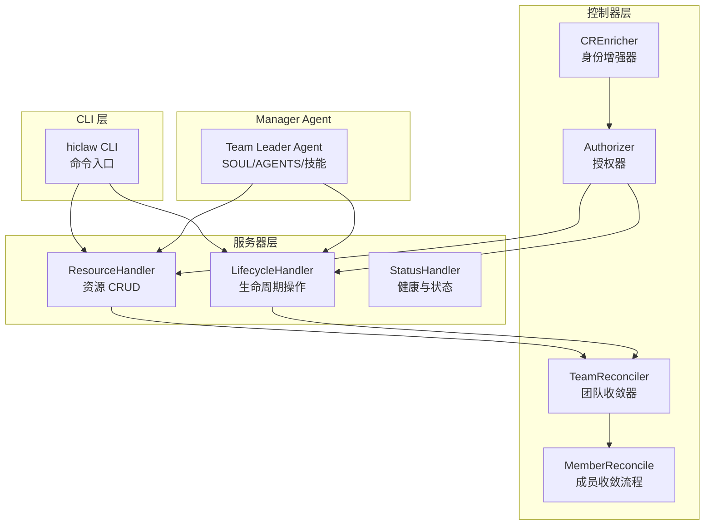
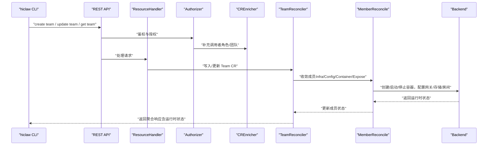
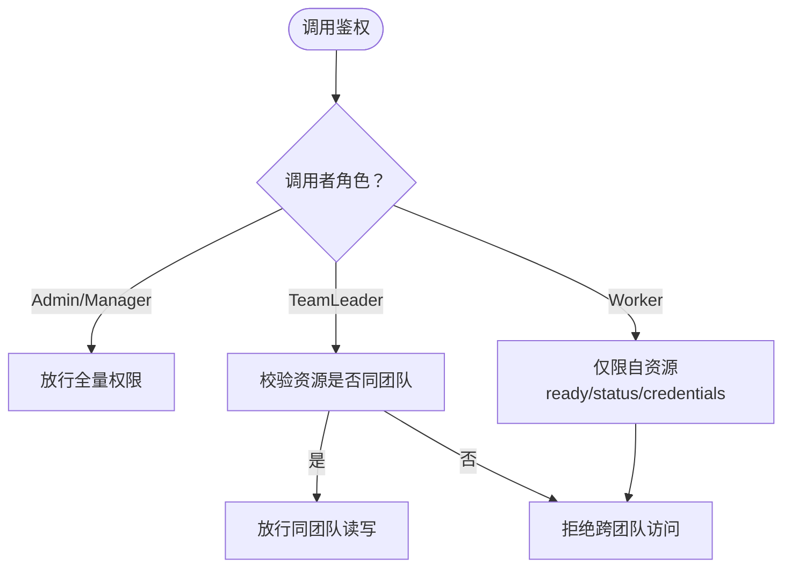
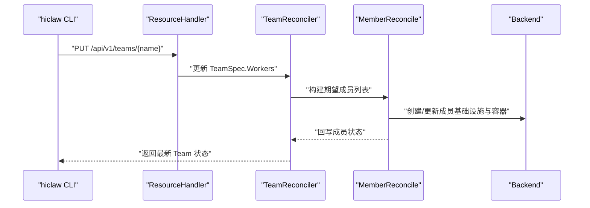
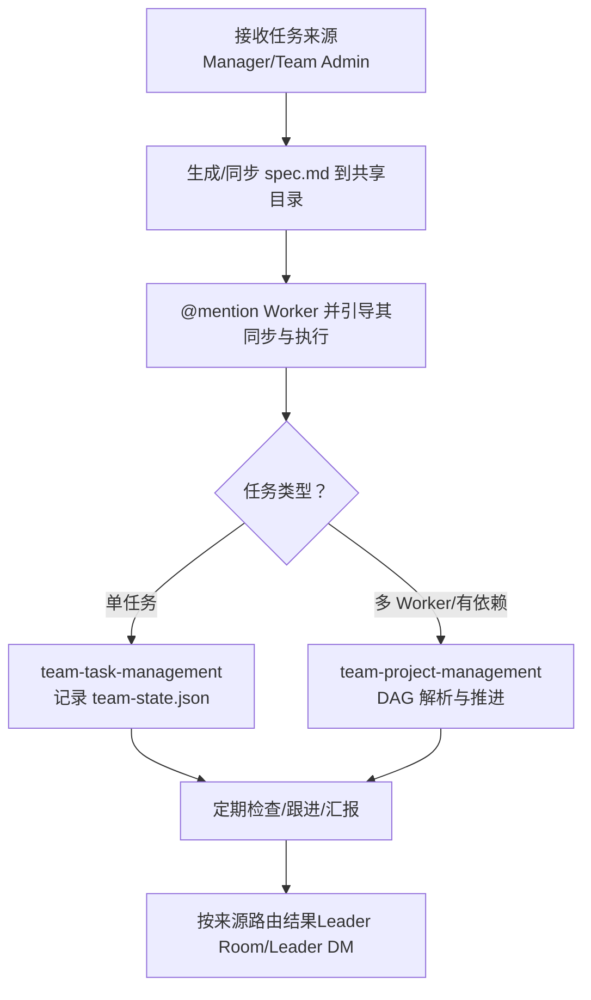
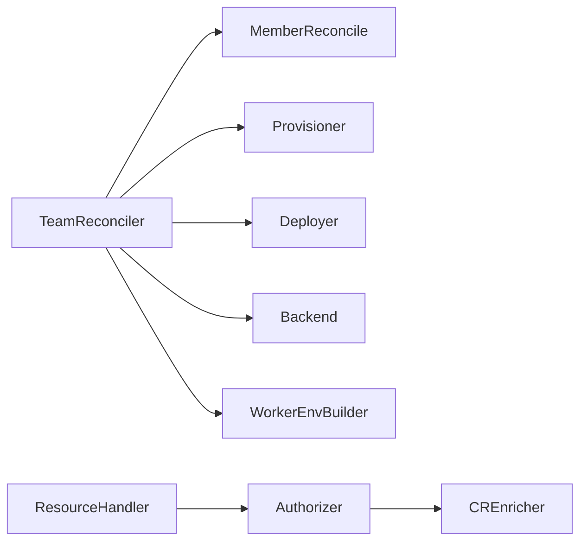

# Team 团队管理

<cite>
**本文引用的文件**
- [types.go](file://hiclaw-controller/api/v1beta1/types.go)
- [team_controller.go](file://hiclaw-controller/internal/controller/team_controller.go)
- [member_reconcile.go](file://hiclaw-controller/internal/controller/member_reconcile.go)
- [authorizer.go](file://hiclaw-controller/internal/auth/authorizer.go)
- [enricher.go](file://hiclaw-controller/internal/auth/enricher.go)
- [resource_handler.go](file://hiclaw-controller/internal/server/resource_handler.go)
- [lifecycle_handler.go](file://hiclaw-controller/internal/server/lifecycle_handler.go)
- [status_handler.go](file://hiclaw-controller/internal/server/status_handler.go)
- [main.go](file://hiclaw-controller/cmd/hiclaw/main.go)
- [create.go](file://hiclaw-controller/cmd/hiclaw/create.go)
- [worker_cmd.go](file://hiclaw-controller/cmd/hiclaw/worker_cmd.go)
- [SKILL.md（项目管理）](file://manager/agent/team-leader-agent/skills/team-project-management/SKILL.md)
- [SKILL.md（任务协调）](file://manager/agent/team-leader-agent/skills/team-task-coordination/SKILL.md)
- [SKILL.md（任务管理）](file://manager/agent/team-leader-agent/skills/team-task-management/SKILL.md)
- [AGENTS.md（团队领导）](file://manager/agent/team-leader-agent/AGENTS.md)
- [SOUL.md 模板](file://manager/agent/team-leader-agent/SOUL.md.tmpl)
</cite>

## 目录
1. [简介](#简介)
2. [项目结构](#项目结构)
3. [核心组件](#核心组件)
4. [架构总览](#架构总览)
5. [详细组件分析](#详细组件分析)
6. [依赖关系分析](#依赖关系分析)
7. [性能考量](#性能考量)
8. [故障排查指南](#故障排查指南)
9. [结论](#结论)
10. [附录：CLI 与 API 接口](#附录cli-与-api-接口)

## 简介
本文件面向 HiClaw 的 Team 团队管理系统，聚焦 Team Leader 角色的职责与权限、团队成员的添加/移除/角色分配、任务协调与工作流、项目创建与执行流程、权限控制与访问策略，并提供最佳实践、常见使用场景以及 CLI 与 API 使用指南，帮助在多 Worker 团队中高效协作与任务分发。

## 项目结构
HiClaw 将“团队”抽象为 CRD 资源 Team，由控制器负责团队级基础设施（房间、共享存储）、成员生命周期（Leader + Workers）收敛、以及与 Manager/Matrix/Gateway/OSS 等后端服务的集成。CLI 通过 hiclaw 控制器 REST API 进行资源编排；Manager Agent 的 Team Leader Agent 提供任务委派、项目编排与状态管理能力。

图表来源
- [team_controller.go:76-305](file://hiclaw-controller/internal/controller/team_controller.go#L76-L305)
- [member_reconcile.go:145-359](file://hiclaw-controller/internal/controller/member_reconcile.go#L145-L359)
- [authorizer.go:40-154](file://hiclaw-controller/internal/auth/authorizer.go#L40-L154)
- [enricher.go:40-89](file://hiclaw-controller/internal/auth/enricher.go#L40-L89)
- [resource_handler.go:74-402](file://hiclaw-controller/internal/server/resource_handler.go#L74-L402)
- [lifecycle_handler.go:34-205](file://hiclaw-controller/internal/server/lifecycle_handler.go#L34-L205)
- [main.go:9-34](file://hiclaw-controller/cmd/hiclaw/main.go#L9-L34)

章节来源
- [team_controller.go:76-305](file://hiclaw-controller/internal/controller/team_controller.go#L76-L305)
- [resource_handler.go:74-402](file://hiclaw-controller/internal/server/resource_handler.go#L74-L402)

## 核心组件
- Team 数据模型与状态
  - TeamSpec 定义团队描述、管理员、Leader、Worker 列表、跨成员通信策略等。
  - TeamStatus 聚合每个成员的状态（角色、房间、就绪态、暴露端口等），并汇总团队整体阶段（Pending/Active/Degraded/Failed）。
- 成员收敛流程
  - 成员基础设施（Matrix 用户/房间、凭证、MinIO 用户）与容器生命周期（Running/Sleeping/Stopped）收敛。
  - Leader 与 Worker 的 ChannelPolicy 合并规则确保跨成员可见性与安全。
- 权限与身份
  - Authorizer 基于角色（Admin/Manager/TeamLeader/Worker）与团队范围进行授权判定。
  - CREnricher 从 Worker/Team CR 反查调用者角色与所属团队，实现细粒度访问控制。
- CLI 与 API
  - hiclaw CLI 提供 create/get/update/delete/worker 子命令，映射到控制器 REST API。
  - ResourceHandler/LifecycleHandler 提供统一的资源与生命周期操作接口。

章节来源
- [types.go:159-258](file://hiclaw-controller/api/v1beta1/types.go#L159-L258)
- [team_controller.go:114-305](file://hiclaw-controller/internal/controller/team_controller.go#L114-L305)
- [member_reconcile.go:145-359](file://hiclaw-controller/internal/controller/member_reconcile.go#L145-L359)
- [authorizer.go:40-154](file://hiclaw-controller/internal/auth/authorizer.go#L40-L154)
- [enricher.go:40-89](file://hiclaw-controller/internal/auth/enricher.go#L40-L89)
- [main.go:9-34](file://hiclaw-controller/cmd/hiclaw/main.go#L9-L34)

## 架构总览
下图展示了 Team 团队管理的关键交互：CLI/Manager 发起请求，经鉴权与授权后，ResourceHandler/LifecycleHandler 写入或更新 CR，TeamReconciler 驱动成员收敛，最终落地到后端（K8s/Docker/Matrix/Gateway/OSS）。

图表来源
- [resource_handler.go:336-547](file://hiclaw-controller/internal/server/resource_handler.go#L336-L547)
- [team_controller.go:114-305](file://hiclaw-controller/internal/controller/team_controller.go#L114-L305)
- [member_reconcile.go:145-359](file://hiclaw-controller/internal/controller/member_reconcile.go#L145-L359)
- [authorizer.go:40-154](file://hiclaw-controller/internal/auth/authorizer.go#L40-L154)
- [enricher.go:40-89](file://hiclaw-controller/internal/auth/enricher.go#L40-L89)

## 详细组件分析

### Team Leader 角色职责与权限
- 职责边界
  - 协调 Manager 与 Team Admin 下达的任务，委派给 Worker 并跟踪进度。
  - 在项目模式下进行 DAG 任务编排与依赖解析，推进多 Worker 并行/串行执行。
  - 通过 .processing 标记文件避免 Leader 与 Worker 对同一任务目录并发修改。
- 权限矩阵
  - TeamLeader 对自身与同团队资源具有读写权限；对其他团队资源仅允许读取。
  - 不可越权操作非同团队资源，不可绕过 /teams 接口直接操作独立 Worker。
- 身份识别
  - 通过 CREnricher 从 Team CR 字段索引反查调用者是否为 TeamLeader 及其所在团队。

图表来源
- [authorizer.go:40-154](file://hiclaw-controller/internal/auth/authorizer.go#L40-L154)
- [enricher.go:40-89](file://hiclaw-controller/internal/auth/enricher.go#L40-L89)

章节来源
- [authorizer.go:60-154](file://hiclaw-controller/internal/auth/authorizer.go#L60-L154)
- [enricher.go:40-89](file://hiclaw-controller/internal/auth/enricher.go#L40-L89)

### 团队成员的添加、移除与角色分配
- 添加成员
  - 通过更新 TeamSpec.Workers 或使用 CLI 创建 Team 时指定 leader 与 workers。
  - 控制器将根据 ChannelPolicy 合并规则自动注入跨成员可见性（Leader、Admin、Peer mentions）。
- 移除成员
  - 从 TeamSpec.Workers 中移除即可触发清理流程；控制器会删除成员的房间别名、凭证、ServiceAccount、容器与 OSS 数据。
- 角色分配
  - TeamLeader 由 TeamSpec.Leader 指定；Worker 由 TeamSpec.Workers 列表定义。
  - 成员角色在状态中以 TeamMemberStatus.Role 记录，用于 API 响应与工具链消费。

图表来源
- [resource_handler.go:435-529](file://hiclaw-controller/internal/server/resource_handler.go#L435-L529)
- [team_controller.go:644-730](file://hiclaw-controller/internal/controller/team_controller.go#L644-L730)
- [member_reconcile.go:145-359](file://hiclaw-controller/internal/controller/member_reconcile.go#L145-L359)

章节来源
- [resource_handler.go:435-529](file://hiclaw-controller/internal/server/resource_handler.go#L435-L529)
- [team_controller.go:154-233](file://hiclaw-controller/internal/controller/team_controller.go#L154-L233)
- [member_reconcile.go:423-484](file://hiclaw-controller/internal/controller/member_reconcile.go#L423-L484)

### 团队任务协调与工作流管理
- 单任务委派
  - 使用 team-task-management 技能：在共享目录生成 spec.md，通过 copaw channels send CLI 在团队房间向 Worker @mention 并引导其同步与执行。
  - 使用 team-state.json 记录任务生命周期（新增/委派/完成/查询）。
- 多 Worker 项目编排
  - 使用 team-project-management 技能：基于 plan.md 的 DAG 描述，进行环路检测、就绪任务解析与执行推进。
- 并发冲突避免
  - 使用 team-task-coordination 技能：在访问共享任务目录前检查 .processing 标记，创建/移除标记后再同步数据，避免 Leader 与 Worker 并发写冲突。

图表来源
- [SKILL.md（任务管理）:15-93](file://manager/agent/team-leader-agent/skills/team-task-management/SKILL.md#L15-L93)
- [SKILL.md（项目管理）:12-29](file://manager/agent/team-leader-agent/skills/team-project-management/SKILL.md#L12-L29)
- [SKILL.md（任务协调）:12-33](file://manager/agent/team-leader-agent/skills/team-task-coordination/SKILL.md#L12-L33)

章节来源
- [SKILL.md（任务管理）:15-93](file://manager/agent/team-leader-agent/skills/team-task-management/SKILL.md#L15-L93)
- [SKILL.md（项目管理）:12-29](file://manager/agent/team-leader-agent/skills/team-project-management/SKILL.md#L12-L29)
- [SKILL.md（任务协调）:12-33](file://manager/agent/team-leader-agent/skills/team-task-coordination/SKILL.md#L12-L33)

### 团队项目的创建、计划与执行流程
- 创建项目
  - 通过 team-project-management 的脚本创建团队项目，指定项目 ID、标题与参与 Worker。
- 计划与 DAG
  - 编写/同步 plan.md 至 MinIO；先 validate 检测环路，再查询 ready 任务集合。
- 执行与推进
  - 依据 DAG 推进，完成后解析下一组可执行任务；按来源将结果路由至相应通道。
- 最佳实践
  - plan.md 是唯一事实来源；变更后务必同步；执行前后均需校验与解析。

章节来源
- [SKILL.md（项目管理）:12-29](file://manager/agent/team-leader-agent/skills/team-project-management/SKILL.md#L12-L29)

### 团队权限控制系统与访问控制
- 角色与范围
  - Admin/Manager：全局读写。
  - TeamLeader：同团队读写；禁止跨团队访问。
  - Worker：仅限自身资源（ready/status/credentials）。
- 身份增强
  - CREnricher 通过字段索引反查调用者是否为 TeamLeader 及其团队，避免误判。
- 授权决策
  - Authorizer 统一判定 Action 与 ResourceKind 的组合是否允许，拒绝跨团队访问。

章节来源
- [authorizer.go:40-154](file://hiclaw-controller/internal/auth/authorizer.go#L40-L154)
- [enricher.go:40-89](file://hiclaw-controller/internal/auth/enricher.go#L40-L89)

### 团队配置最佳实践与常见场景
- 配置最佳实践
  - 明确 ChannelPolicy：Leader 默认可 @ 全体成员与 Admin；Worker 默认可 @ Leader/Admin；可选开启 Peer mentions。
  - 使用 AccessEntries 为 Leader/Worker 注入对象存储与 AI 网关权限，避免硬编码凭据。
  - 通过标签合并策略（Team.metadata.labels + per-member.spec.labels + 控制器系统标签）统一打标。
- 常见场景
  - 快速扩容：在 TeamSpec.Workers 新增 Worker 名称，控制器自动收敛。
  - 临时休眠：设置 desired state 为 Sleeping/Stopped，减少资源占用。
  - 任务委派：使用 copaw channels send CLI 在团队房间发送带 @ 的消息，确保格式化渲染与 mentions 结构正确。

章节来源
- [types.go:167-238](file://hiclaw-controller/api/v1beta1/types.go#L167-L238)
- [team_controller.go:669-728](file://hiclaw-controller/internal/controller/team_controller.go#L669-L728)
- [AGENTS.md（团队领导）:22-39](file://manager/agent/team-leader-agent/AGENTS.md#L22-L39)

### 多 Worker 团队协作与任务分配
- 协作原则
  - Team Leader 不做领域工作，只做协调与汇报；Worker 执行具体任务。
  - 使用 Leader Room 与 Leader DM 分别与 Manager/Team Admin 沟通。
- 任务分配
  - 通过 copaw channels send CLI 发送消息，确保 HTML 渲染与 mentions 正确。
  - 在 team-state.json 中登记任务来源、委派人、房间与状态。
- 运行时状态
  - 使用 /api/v1/workers/{name}/status 获取聚合状态（CR + 后端），结合 Ready 标记判断就绪。

章节来源
- [AGENTS.md（团队领导）:16-39](file://manager/agent/team-leader-agent/AGENTS.md#L16-L39)
- [lifecycle_handler.go:176-205](file://hiclaw-controller/internal/server/lifecycle_handler.go#L176-L205)

## 依赖关系分析
- TeamReconciler 依赖
  - MemberReconcile：统一处理成员基础设施、配置、容器与暴露端口。
  - Provisioner/Deployer/Backend：提供矩阵用户/房间、凭证、包部署、容器生命周期与端口暴露。
  - WorkerEnvBuilder：生成容器环境变量（含令牌、密钥、房间 ID 等）。
- 授权与身份
  - Authorizer 与 CREnricher 在 API 层共同完成鉴权与身份增强，确保跨团队访问隔离。

图表来源
- [team_controller.go:40-74](file://hiclaw-controller/internal/controller/team_controller.go#L40-L74)
- [member_reconcile.go:115-140](file://hiclaw-controller/internal/controller/member_reconcile.go#L115-L140)
- [authorizer.go:32-36](file://hiclaw-controller/internal/auth/authorizer.go#L32-L36)
- [enricher.go:31-38](file://hiclaw-controller/internal/auth/enricher.go#L31-L38)

章节来源
- [team_controller.go:40-74](file://hiclaw-controller/internal/controller/team_controller.go#L40-L74)
- [member_reconcile.go:115-140](file://hiclaw-controller/internal/controller/member_reconcile.go#L115-L140)
- [authorizer.go:32-36](file://hiclaw-controller/internal/auth/authorizer.go#L32-L36)
- [enricher.go:31-38](file://hiclaw-controller/internal/auth/enricher.go#L31-L38)

## 性能考量
- 状态聚合与重试
  - ResourceHandler 在聚合 /workers 列表时，对 Team 成员采用合成响应，避免重复持久化子资源。
  - LifecycleHandler 对 Ready 标记采用内存缓存，降低频繁查询成本。
- 收敛策略
  - TeamReconciler 通过 SpecChanged 哈希与 Observed 标志避免不必要的容器重建与令牌轮换。
  - MemberReconcile 将基础设施、配置、容器与暴露端口分阶段收敛，失败可独立重试。
- 后端探测
  - 当后端不可用时，TeamReconciler 保留先前就绪状态，避免抖动导致 Phase 波动。

章节来源
- [resource_handler.go:171-212](file://hiclaw-controller/internal/server/resource_handler.go#L171-L212)
- [lifecycle_handler.go:209-223](file://hiclaw-controller/internal/server/lifecycle_handler.go#L209-L223)
- [team_controller.go:361-387](file://hiclaw-controller/internal/controller/team_controller.go#L361-L387)
- [member_reconcile.go:276-320](file://hiclaw-controller/internal/controller/member_reconcile.go#L276-L320)

## 故障排查指南
- 常见错误与定位
  - 409 冲突：尝试在 /workers 上对团队成员进行操作，应改用 /teams/{name}。
  - 403 拒绝：跨团队访问或非自资源访问被拒绝，检查调用者角色与团队归属。
  - 404/5xx：后端容器/Pod 不存在或后端异常，查看控制器日志与后端状态。
- 自检步骤
  - 使用 CLI 查询团队状态与成员就绪情况：hiclaw get teams -o json 与 hiclaw worker status。
  - 查看集群状态：/api/v1/status 与 /healthz。
  - Worker 就绪：通过 /api/v1/workers/{name}/ready 与 /api/v1/workers/{name}/status 核对状态。

章节来源
- [resource_handler.go:85-92](file://hiclaw-controller/internal/server/resource_handler.go#L85-L92)
- [authorizer.go:151-154](file://hiclaw-controller/internal/auth/authorizer.go#L151-L154)
- [status_handler.go:23-62](file://hiclaw-controller/internal/server/status_handler.go#L23-L62)
- [lifecycle_handler.go:162-205](file://hiclaw-controller/internal/server/lifecycle_handler.go#L162-L205)

## 结论
HiClaw 的 Team 团队管理以 CRD 为核心，结合控制器的成员收敛与后端集成，实现了从团队创建、成员管理到任务委派与项目编排的完整闭环。通过严格的权限控制与身份增强，确保 TeamLeader 仅在团队范围内拥有必要的操作权限；通过 Manager Agent 的技能体系，将任务委派、项目编排与并发协调标准化，适合多 Worker 的复杂协作场景。

## 附录：CLI 与 API 接口

### CLI 命令
- 根命令与环境变量
  - hiclaw：根命令，支持环境变量 HICLAW_CONTROLLER_URL、HICLAW_AUTH_TOKEN、HICLAW_AUTH_TOKEN_FILE。
- 资源创建
  - hiclaw create worker：创建独立 Worker。
  - hiclaw create team：创建 Team（含 Leader 与可选 Workers）。
  - hiclaw create human/manager：创建人类用户与 Manager。
- 生命周期与状态
  - hiclaw worker wake/sleep/ensure-ready/status/report-ready：成员生命周期与就绪上报。
- 等待与输出
  - 支持 --wait-timeout、--no-wait、-o json 等参数。

章节来源
- [main.go:9-34](file://hiclaw-controller/cmd/hiclaw/main.go#L9-L34)
- [create.go:14-292](file://hiclaw-controller/cmd/hiclaw/create.go#L14-L292)
- [worker_cmd.go:11-289](file://hiclaw-controller/cmd/hiclaw/worker_cmd.go#L11-L289)

### API 接口清单（节选）
- 资源管理（Team/Worker/Human/Manager）
  - POST /api/v1/teams：创建团队
  - GET /api/v1/teams/{name}：获取团队
  - GET /api/v1/teams：列出团队
  - PUT /api/v1/teams/{name}：更新团队
  - DELETE /api/v1/teams/{name}：删除团队
  - GET /api/v1/workers：列出所有资源（含团队成员合成视图）
  - GET /api/v1/workers/{name}：获取资源（含团队成员合成视图）
  - PUT /api/v1/workers/{name}：更新独立 Worker
  - DELETE /api/v1/workers/{name}：删除独立 Worker
  - POST /api/v1/humans /managers：创建人类用户与 Manager
- 生命周期与状态
  - POST /api/v1/workers/{name}/wake：唤醒
  - POST /api/v1/workers/{name}/sleep：休眠
  - POST /api/v1/workers/{name}/ensure-ready：确保运行
  - POST /api/v1/workers/{name}/ready：成员就绪上报
  - GET /api/v1/workers/{name}/status：获取运行时状态
- 系统状态
  - GET /api/v1/status：集群统计
  - GET /healthz：健康检查
  - GET /api/v1/version：版本信息

章节来源
- [resource_handler.go:74-797](file://hiclaw-controller/internal/server/resource_handler.go#L74-L797)
- [lifecycle_handler.go:34-205](file://hiclaw-controller/internal/server/lifecycle_handler.go#L34-L205)
- [status_handler.go:23-74](file://hiclaw-controller/internal/server/status_handler.go#L23-L74)